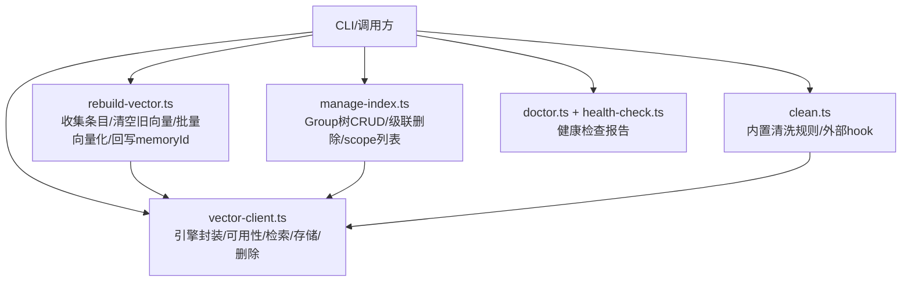
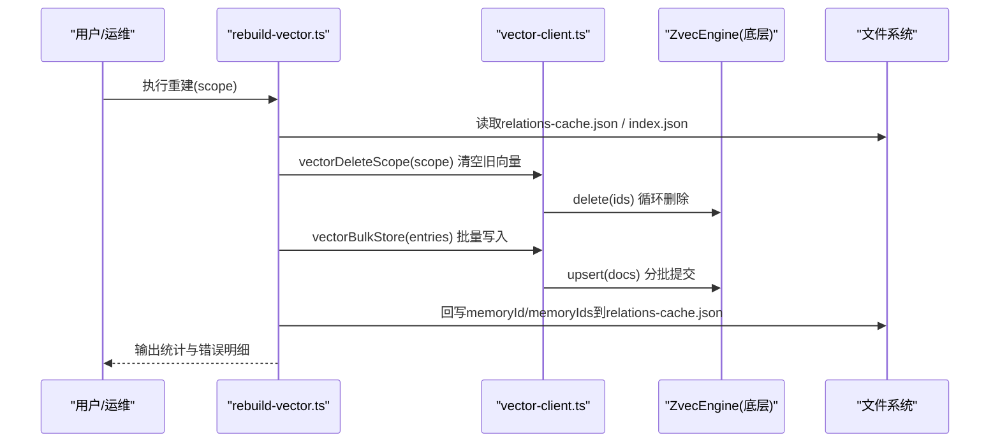
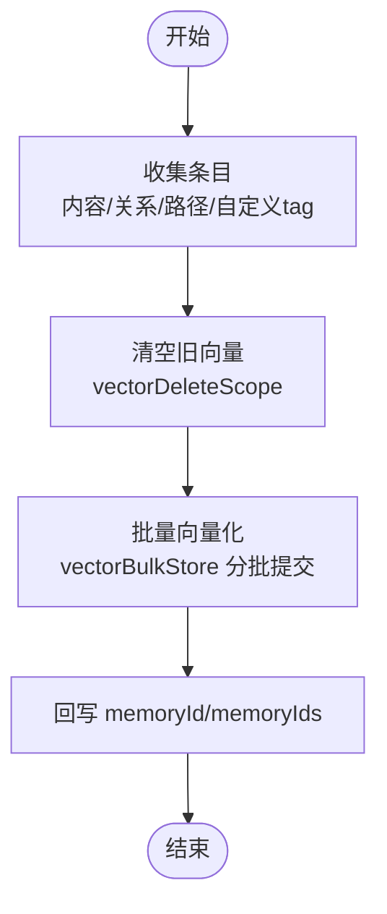
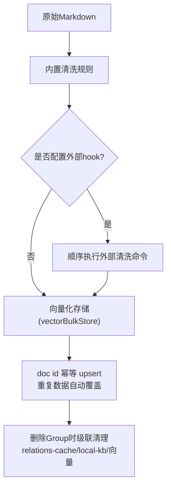
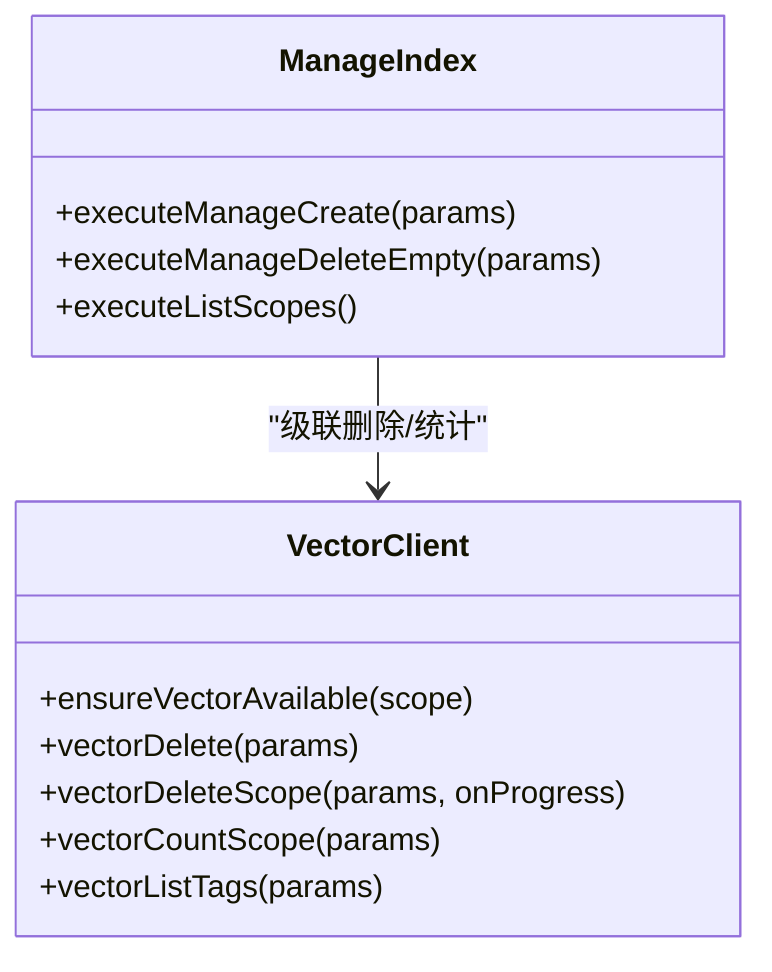
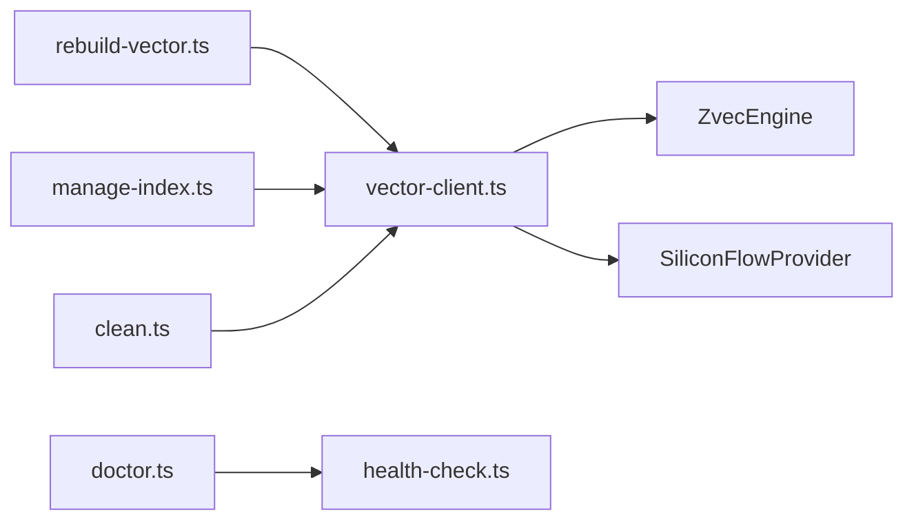

# 知识库维护

<cite>
**本文引用的文件**
- [rebuild-vector.ts](file://src/lib/rebuild-vector.ts)
- [clean.ts](file://src/lib/clean.ts)
- [manage-index.ts](file://src/manage-index.ts)
- [doctor.ts](file://src/doctor.ts)
- [health-check.ts](file://src/lib/health-check.ts)
- [vector-client.ts](file://src/lib/vector-client.ts)
- [batch-vectorize.ts](file://src/lib/batch-vectorize.ts)
- [manage-index.md](file://docs/manage-index.md)
- [verify-index.md](file://docs/verify-index.md)
- [backup-restore.md](file://docs/backup-restore.md)
</cite>

## 目录
1. [简介](#简介)
2. [项目结构](#项目结构)
3. [核心组件](#核心组件)
4. [架构总览](#架构总览)
5. [详细组件分析](#详细组件分析)
6. [依赖关系分析](#依赖关系分析)
7. [性能考虑](#性能考虑)
8. [故障诊断指南](#故障诊断指南)
9. [结论](#结论)
10. [附录](#附录)

## 简介
本文件面向知识库的长期维护与治理，覆盖以下主题：
- 向量索引重建：重新向量化、索引优化、性能调优
- 知识库清理：重复数据处理、无效关系清理、存储空间优化
- 索引管理：索引状态检查、碎片整理、统计信息更新
- 大规模维护策略：定期计划、性能监控、容量规划
- 故障诊断工具：健康检查、错误日志分析、性能瓶颈识别
- 自动化配置与定时任务：维护脚本编排与调度建议

## 项目结构
围绕“维护”能力，代码库提供了清晰的职责划分：
- 向量层封装与可用性检测：vector-client.ts
- 重建流程：rebuild-vector.ts（从已还原 KB 重建三类向量）
- 清洗规则与外部钩子：clean.ts（内置规则 + 外部 hook 管道）
- 索引管理 CLI：manage-index.ts（Group 树 CRUD、级联删除、scope 列表）
- 健康诊断：doctor.ts + health-check.ts（只读检查，返回 pass/warn/fail）
- 批量向量化：batch-vectorize.ts（bulkVectorize 分批提交）
- 文档参考：manage-index.md、verify-index.md、backup-restore.md

图表来源
- [vector-client.ts:1-120](file://src/lib/vector-client.ts#L1-L120)
- [rebuild-vector.ts:1-60](file://src/lib/rebuild-vector.ts#L1-L60)
- [clean.ts:1-40](file://src/lib/clean.ts#L1-L40)
- [manage-index.ts:1-30](file://src/manage-index.ts#L1-L30)
- [doctor.ts:1-20](file://src/doctor.ts#L1-L20)
- [health-check.ts:1-30](file://src/lib/health-check.ts#L1-L30)

章节来源
- [vector-client.ts:1-120](file://src/lib/vector-client.ts#L1-L120)
- [rebuild-vector.ts:1-60](file://src/lib/rebuild-vector.ts#L1-L60)
- [clean.ts:1-40](file://src/lib/clean.ts#L1-L40)
- [manage-index.ts:1-30](file://src/manage-index.ts#L1-L30)
- [doctor.ts:1-20](file://src/doctor.ts#L1-L20)
- [health-check.ts:1-30](file://src/lib/health-check.ts#L1-L30)

## 核心组件
- 向量客户端（vector-client.ts）
  - 提供统一检索、存储、删除、统计、范围操作接口
  - 单例引擎、撞锁重试、空闲释放锁、在途保护、超时控制
  - doc id 由 text+scope+tag 确定性生成，幂等 upsert
- 重建器（rebuild-vector.ts）
  - 从已还原 KB 重建三类向量：内容、关系、路径；并恢复自定义 tag 向量
  - 先清空旧向量，再批量写入，最后回写 memoryId/memoryIds
- 清洗器（clean.ts）
  - 内置规则：BOM/frontmatter/HTML注释/mermaid/代码块/路径剥离/空行折叠
  - 外部 hook 管道：stdin→stdout，超时保护，失败不阻断后续
- 索引管理（manage-index.ts）
  - Group 树创建/删除/列出 scope；删除时级联清理 relations-cache、local-kb、向量
- 健康诊断（doctor.ts + health-check.ts）
  - 只读检查：配置文件、目录可写、apiKey、embedding连通性/维度、zvec collection、scopes.default
- 批量向量化（batch-vectorize.ts）
  - bulkVectorize 按批次（默认 200）提交，共享一次 engine，减少网络与序列化开销

章节来源
- [vector-client.ts:120-340](file://src/lib/vector-client.ts#L120-L340)
- [rebuild-vector.ts:235-324](file://src/lib/rebuild-vector.ts#L235-L324)
- [clean.ts:42-130](file://src/lib/clean.ts#L42-L130)
- [manage-index.ts:300-411](file://src/manage-index.ts#L300-L411)
- [doctor.ts:18-49](file://src/doctor.ts#L18-L49)
- [health-check.ts:148-213](file://src/lib/health-check.ts#L148-L213)
- [batch-vectorize.ts:129-183](file://src/lib/batch-vectorize.ts#L129-L183)

## 架构总览
维护流程的关键交互如下：

图表来源
- [rebuild-vector.ts:280-324](file://src/lib/rebuild-vector.ts#L280-L324)
- [vector-client.ts:732-754](file://src/lib/vector-client.ts#L732-L754)
- [vector-client.ts:547-590](file://src/lib/vector-client.ts#L547-L590)

## 详细组件分析

### 向量索引重建（重新向量化、索引优化、性能调优）
- 重建目标
  - 内容向量（ki-search）：基于 Group index.json 的关系值
  - 关系向量（ki-relation）：每条 relation 一条
  - 路径向量（ki-path）：每个 Group 一条
  - 自定义 tag 向量：从 relations-cache 的 tags 恢复，为每个 tag 生成内容向量
- 关键步骤
  - 收集四类条目（内容/关系/路径/tag）
  - 清空旧向量（保证幂等与一致性）
  - 批量向量化（vectorBulkStore），记录成功/失败
  - 回写 memoryId/memoryIds（内容向量与自定义 tag 向量聚合回填）
- 性能要点
  - 批量写入（默认每批 200 条），减少网络与序列化成本
  - 引擎单例复用，避免频繁 open/close
  - 撞锁重试与空闲释放锁，多进程共享向量库更稳健
  - 文本长度限制（MAX_TEXT_LENGTH）防止异常大文档
- 注意事项
  - 重建前需确保 relations-cache.json 存在且有效
  - 若向量服务不可用或损坏，会给出明确原因码（LOCKED/CORRUPTED/PROBE_ERROR）

图表来源
- [rebuild-vector.ts:280-324](file://src/lib/rebuild-vector.ts#L280-L324)
- [vector-client.ts:547-590](file://src/lib/vector-client.ts#L547-L590)

章节来源
- [rebuild-vector.ts:65-191](file://src/lib/rebuild-vector.ts#L65-L191)
- [rebuild-vector.ts:235-324](file://src/lib/rebuild-vector.ts#L235-L324)
- [vector-client.ts:547-590](file://src/lib/vector-client.ts#L547-L590)
- [vector-client.ts:420-467](file://src/lib/vector-client.ts#L420-L467)

### 知识库清理机制（重复数据、无效关系、存储优化）
- 内置清洗规则
  - 去除 BOM、控制字符、frontmatter、HTML 注释、mermaid 块
  - 代码块剥离（短示例保留 ≤15 行）、路径剥离（file://、markdown链接、裸路径、行号引用）
  - 空 inline code、孤儿标题清理、连续空行折叠
- 外部清洗钩子
  - 顺序执行外部命令（stdin→stdout），超时保护（默认 10s），失败跳过并记录
- 重复与无效关系处理
  - 通过 doc id = sha256(text+scope+tag) 实现幂等 upsert，重复写入自动覆盖
  - 删除 Group 时级联清理 relations-cache 中相关 key、local-kb index.json、向量记忆
- 存储优化
  - 批量写入减少 I/O 与网络开销
  - 删除无用 Group 后同步清理缓存与向量，避免碎片累积

图表来源
- [clean.ts:42-130](file://src/lib/clean.ts#L42-L130)
- [clean.ts:177-228](file://src/lib/clean.ts#L177-L228)
- [vector-client.ts:240-242](file://src/lib/vector-client.ts#L240-L242)
- [manage-index.ts:320-411](file://src/manage-index.ts#L320-L411)

章节来源
- [clean.ts:42-130](file://src/lib/clean.ts#L42-L130)
- [clean.ts:177-228](file://src/lib/clean.ts#L177-L228)
- [vector-client.ts:240-242](file://src/lib/vector-client.ts#L240-L242)
- [manage-index.ts:320-411](file://src/manage-index.ts#L320-L411)

### 索引管理操作（状态检查、碎片整理、统计信息更新）
- 状态检查
  - list-scopes：列出所有已初始化与已注册的 scope，附带顶层 Group 信息
  - ensureVectorAvailable：检测向量服务可用性与原因码（LOCKED/CORRUPTED/PROBE_ERROR）
- 碎片整理
  - 删除 Group 时级联清理 relations-cache 中前缀匹配的 key、local-kb 的 index.json、向量记忆
  - 向量层支持按 scope/tag 批量删除，避免残留
- 统计信息更新
  - vectorCountScope：统计指定 scope（可选 tag）下的文档数
  - vectorListTags：枚举 scope 下出现过的 tag 及计数（受扫描上限约束）
  - rebuild-vector 完成后回写 memoryId/memoryIds，保持 cache 与向量一致

图表来源
- [manage-index.ts:145-166](file://src/manage-index.ts#L145-L166)
- [manage-index.ts:320-411](file://src/manage-index.ts#L320-L411)
- [vector-client.ts:420-467](file://src/lib/vector-client.ts#L420-L467)
- [vector-client.ts:597-608](file://src/lib/vector-client.ts#L597-L608)
- [vector-client.ts:722-726](file://src/lib/vector-client.ts#L722-L726)
- [vector-client.ts:693-717](file://src/lib/vector-client.ts#L693-L717)

章节来源
- [manage-index.ts:145-166](file://src/manage-index.ts#L145-L166)
- [manage-index.ts:320-411](file://src/manage-index.ts#L320-L411)
- [vector-client.ts:420-467](file://src/lib/vector-client.ts#L420-L467)
- [vector-client.ts:597-608](file://src/lib/vector-client.ts#L597-L608)
- [vector-client.ts:693-717](file://src/lib/vector-client.ts#L693-L717)
- [vector-client.ts:722-726](file://src/lib/vector-client.ts#L722-L726)

### 大规模知识库维护策略（定期计划、性能监控、容量规划）
- 定期维护计划
  - 周期性地执行重建（如每周/每月），确保向量与 KB 一致
  - 结合备份与恢复流程，定期快照 kb 目录（group-index、relations-cache、本地 KB 原文）
- 性能监控
  - 使用 doctor 命令进行启动前健康检查（pass/warn/fail），作为 CI gate
  - 关注向量服务可用性（ensureVectorAvailable）与错误码，及时告警
- 容量规划
  - 关注向量库目录大小与磁盘使用率，必要时扩容或归档历史数据
  - 利用 vectorListTags/vectorCountScope 评估数据规模与标签分布，指导分片或分区策略

章节来源
- [doctor.ts:18-49](file://src/doctor.ts#L18-L49)
- [health-check.ts:148-213](file://src/lib/health-check.ts#L148-L213)
- [vector-client.ts:420-467](file://src/lib/vector-client.ts#L420-L467)
- [backup-restore.md:102-170](file://docs/backup-restore.md#L102-L170)

### 故障诊断工具（健康检查、错误日志分析、性能瓶颈识别）
- 健康检查
  - ki doctor：检查配置文件、目录可写、apiKey、embedding 连通性/维度、zvec collection、scopes.default
  - 输出结构化报告，失败项退出码为 1，便于脚本 gate
- 错误日志分析
  - 向量层错误包含 reason/code（如 LOCKED/CORRUPTED/PROBE_ERROR），定位问题根因
  - 重建过程记录 errors 数组，包含类型、路径、错误消息
- 性能瓶颈识别
  - 批量向量化分批大小（默认 200），可根据吞吐调整
  - 引擎空闲释放锁与撞锁重试，避免多进程争用导致的阻塞
  - 文本长度限制（MAX_TEXT_LENGTH）防止异常大文档导致性能抖动

章节来源
- [doctor.ts:18-49](file://src/doctor.ts#L18-L49)
- [health-check.ts:148-213](file://src/lib/health-check.ts#L148-L213)
- [rebuild-vector.ts:307-316](file://src/lib/rebuild-vector.ts#L307-L316)
- [vector-client.ts:74-86](file://src/lib/vector-client.ts#L74-L86)
- [vector-client.ts:120-140](file://src/lib/vector-client.ts#L120-L140)
- [batch-vectorize.ts:129-183](file://src/lib/batch-vectorize.ts#L129-L183)

### 维护脚本的自动化配置与定时任务设置指南
- 自动化脚本
  - install-latest.sh：自动检查并安装最新版本（支持 GitHub API/gh CLI/页面重定向）
  - release.sh：构建 npm 包、创建 tag、发布 Release（含测试与打包校验）
- 定时任务建议
  - 使用系统 cron 或任务调度器定期执行：
    - 健康检查：ki doctor
    - 重建向量：ki rebuild-vector <scope>
    - 备份：rsync/tar 备份 kb 目录
    - 清理：按需执行 group 删除与级联清理
  - 将脚本输出与错误日志集中收集，便于审计与排障
- 注意事项
  - 定时任务应避开业务高峰，避免影响在线服务
  - 对敏感操作（如删除）增加确认参数（如 --yes），防止误删
  - 结合告警机制，当 doctor 出现 fail 或重建失败时通知运维

章节来源
- [scripts/install-latest.sh:1-205](file://scripts/install-latest.sh#L1-L205)
- [scripts/release.sh:1-142](file://scripts/release.sh#L1-L142)
- [backup-restore.md:102-170](file://docs/backup-restore.md#L102-L170)

## 依赖关系分析
- 模块耦合
  - rebuild-vector.ts 依赖 vector-client.ts（向量操作）与文件系统（KB 读取）
  - manage-index.ts 依赖 vector-client.ts（级联删除向量）与文件系统（cache/local-kb）
  - clean.ts 独立于向量层，但清洗结果最终进入向量存储
  - doctor.ts 依赖 health-check.ts，后者依赖配置与 embedding provider
- 外部依赖
  - ZvecEngine（dist 产物）：向量数据库与嵌入服务
  - SiliconFlowProvider：embedding 提供商（baseURL/model/dimension/apiKey）
- 潜在风险
  - 向量库被占用（LOCKED）或损坏（CORRUPTED）会导致操作失败
  - embedding 服务不可达或维度不匹配会影响重建质量
  - 大库下统计与列举受扫描上限约束（LIST_ALL_LIMIT）

图表来源
- [rebuild-vector.ts:17-25](file://src/lib/rebuild-vector.ts#L17-L25)
- [manage-index.ts:11-19](file://src/manage-index.ts#L11-L19)
- [clean.ts:177-228](file://src/lib/clean.ts#L177-L228)
- [doctor.ts:15-16](file://src/doctor.ts#L15-L16)
- [health-check.ts:15-18](file://src/lib/health-check.ts#L15-L18)
- [vector-client.ts:21-31](file://src/lib/vector-client.ts#L21-L31)

章节来源
- [rebuild-vector.ts:17-25](file://src/lib/rebuild-vector.ts#L17-L25)
- [manage-index.ts:11-19](file://src/manage-index.ts#L11-L19)
- [clean.ts:177-228](file://src/lib/clean.ts#L177-L228)
- [doctor.ts:15-16](file://src/doctor.ts#L15-L16)
- [health-check.ts:15-18](file://src/lib/health-check.ts#L15-L18)
- [vector-client.ts:21-31](file://src/lib/vector-client.ts#L21-L31)

## 性能考虑
- 批量向量化
  - 默认每批 200 条，减少网络往返与序列化开销
  - 多批场景下提供进度反馈，便于监控
- 引擎生命周期
  - 单例引擎 + 撞锁重试 + 空闲释放锁，提升多进程并发稳定性
  - 打开/创建带超时保护，避免原生竞态导致的永久阻塞
- 文本处理
  - 文本长度限制（MAX_TEXT_LENGTH）防止异常大文档
  - 清洗规则减少噪声，提高检索质量与存储效率
- 统计与列举
  - 受扫描上限约束（LIST_ALL_LIMIT），大库下结果为近似值

章节来源
- [batch-vectorize.ts:129-183](file://src/lib/batch-vectorize.ts#L129-L183)
- [vector-client.ts:120-140](file://src/lib/vector-client.ts#L120-L140)
- [vector-client.ts:199-216](file://src/lib/vector-client.ts#L199-L216)
- [vector-client.ts:127-127](file://src/lib/vector-client.ts#L127-L127)
- [vector-client.ts:674-686](file://src/lib/vector-client.ts#L674-L686)

## 故障诊断指南
- 健康检查
  - 执行 ki doctor，查看 pass/warn/fail 项，重点关注 embedding 连通性与维度匹配
- 向量服务状态
  - 使用 ensureVectorAvailable 获取可用性与原因码（LOCKED/CORRUPTED/PROBE_ERROR）
  - 若被占用，等待其他进程释放或停止常驻服务
- 重建失败排查
  - 检查 relations-cache.json 是否存在且有效
  - 查看重建输出的 errors 数组，定位具体失败条目与原因
- 性能瓶颈
  - 调整批量大小（VECTORIZE_BATCH_SIZE）以平衡吞吐与内存
  - 监控向量库目录大小与磁盘使用率，必要时扩容或归档

章节来源
- [doctor.ts:18-49](file://src/doctor.ts#L18-L49)
- [health-check.ts:148-213](file://src/lib/health-check.ts#L148-L213)
- [vector-client.ts:420-467](file://src/lib/vector-client.ts#L420-L467)
- [rebuild-vector.ts:307-316](file://src/lib/rebuild-vector.ts#L307-L316)
- [batch-vectorize.ts:129-183](file://src/lib/batch-vectorize.ts#L129-L183)

## 结论
本仓库提供了完善的知识库维护能力：
- 向量重建：从已还原 KB 重建三类向量，幂等可重跑，回写 memoryId 保持一致性
- 清洗机制：内置规则 + 外部 hook，去噪提效，支持短示例保留与路径剥离
- 索引管理：Group 树 CRUD、级联删除、scope 列表，保障数据结构整洁
- 健康诊断：只读检查，快速定位配置与环境问题
- 性能优化：批量向量化、引擎单例、撞锁重试、空闲释放锁
- 自动化：提供安装与发布脚本，建议结合 cron 实现定期维护

建议在生产环境中：
- 定期执行健康检查与重建
- 结合备份与恢复策略，确保数据安全
- 监控向量服务状态与磁盘容量，及时扩容或归档
- 将维护脚本纳入 CI/CD 与任务调度，实现自动化运维

## 附录
- 常用命令参考
  - 健康检查：ki doctor
  - 重建向量：ki rebuild-vector <scope>
  - 索引管理：ki manage-index --action create/delete/list-scopes
  - 验证索引：ki query-group --scope <scope> [--mode full]
  - 备份恢复：参考 backup-restore.md 中的 rsync/tar 与 restore 命令

章节来源
- [manage-index.md:38-129](file://docs/manage-index.md#L38-L129)
- [verify-index.md:14-132](file://docs/verify-index.md#L14-L132)
- [backup-restore.md:102-170](file://docs/backup-restore.md#L102-L170)