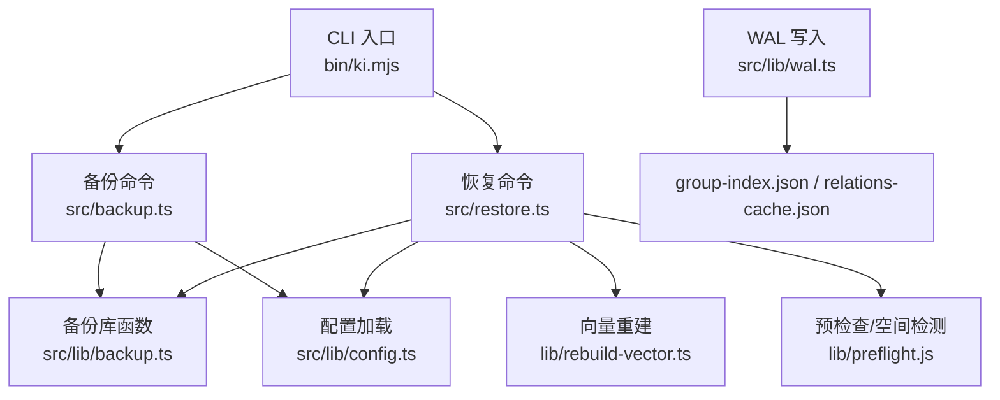
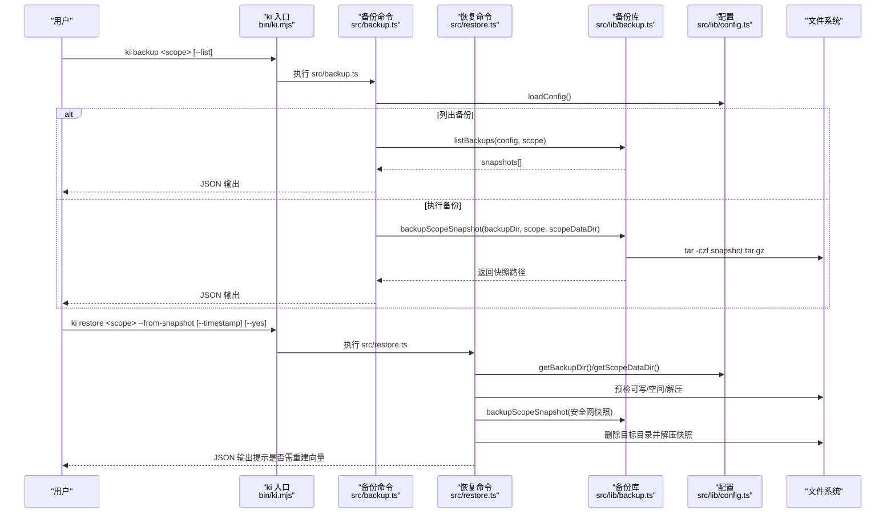
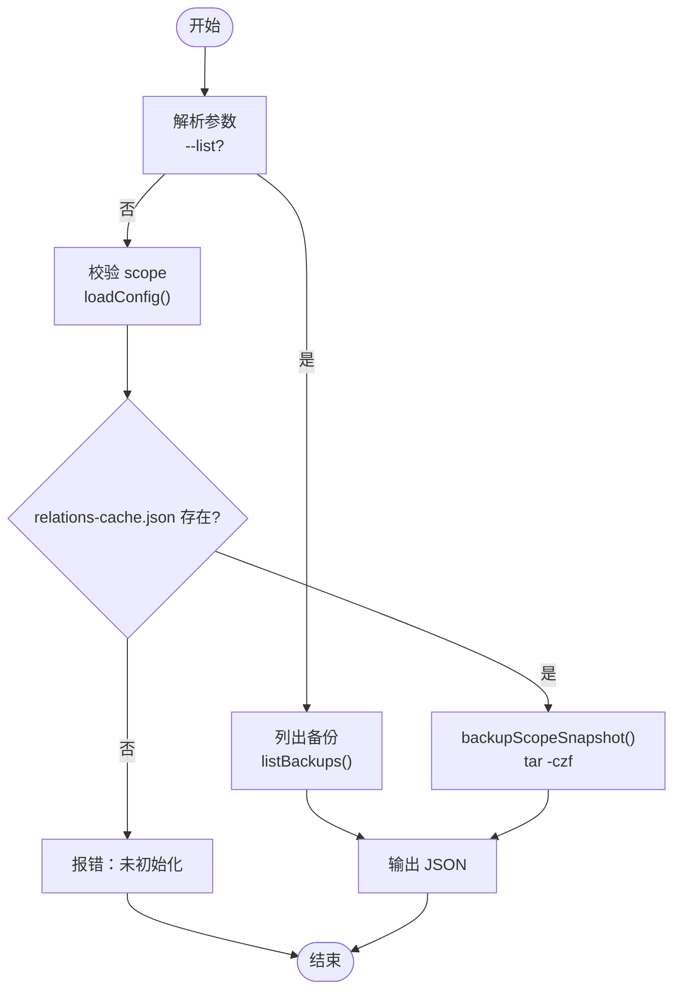
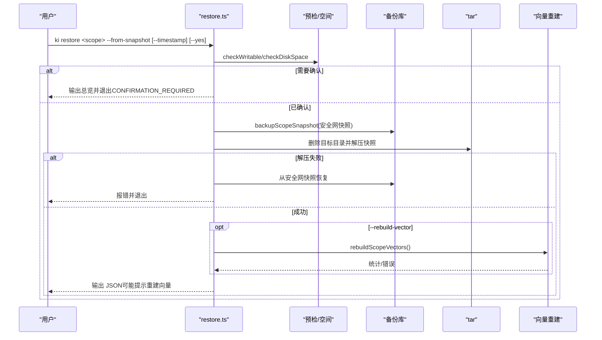
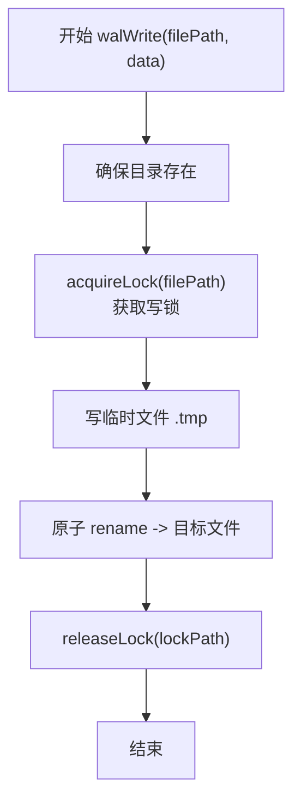
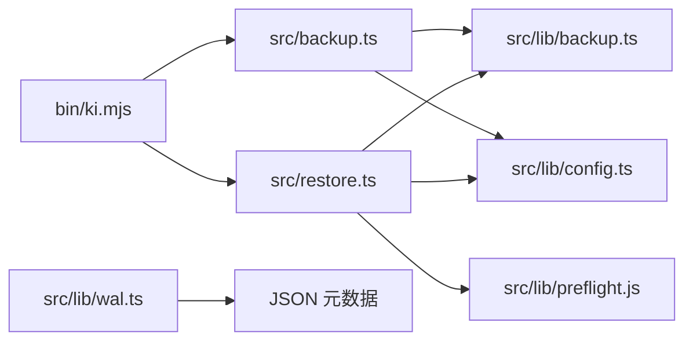

# 备份与恢复

<cite>
**本文引用的文件**
- [bin/ki.mjs](file://bin/ki.mjs)
- [src/backup.ts](file://src/backup.ts)
- [src/restore.ts](file://src/restore.ts)
- [src/lib/backup.ts](file://src/lib/backup.ts)
- [src/lib/wal.ts](file://src/lib/wal.ts)
- [src/lib/config.ts](file://src/lib/config.ts)
- [docs/backup-restore.md](file://docs/backup-restore.md)
</cite>

## 目录
1. [简介](#简介)
2. [项目结构](#项目结构)
3. [核心组件](#核心组件)
4. [架构总览](#架构总览)
5. [详细组件分析](#详细组件分析)
6. [依赖关系分析](#依赖关系分析)
7. [性能考量](#性能考量)
8. [故障排查指南](#故障排查指南)
9. [结论](#结论)
10. [附录](#附录)

## 简介
本文件面向“知识索引器”的备份与恢复策略，覆盖数据备份的重要性、本地 KB 数据结构、ki backup 与 ki restore 命令用法（单 scope 备份、批量备份、自动备份脚本）、WAL（Write-Ahead Log）一致性机制、不同故障场景的恢复流程、备份存储与保留策略、自动化任务配置与定时任务设置，以及灾难恢复演练最佳实践。

## 项目结构
- CLI 入口：bin/ki.mjs 将 ki backup / ki restore 等子命令分发到对应实现。
- 备份模块：src/lib/backup.ts 提供快照打包、列表、自动备份能力；src/backup.ts 为 ki backup 命令实现。
- 恢复模块：src/restore.ts 提供从快照还原、向量重建、预检与安全网快照等能力。
- WAL 一致性：src/lib/wal.ts 通过写锁 + 临时文件 + 原子重命名保证 JSON 元数据写入不损坏。
- 配置：src/lib/config.ts 定义 dataDir、backupDir、vectorDir 等默认路径与解析逻辑。
- 文档：docs/backup-restore.md 提供用户侧快速上手与故障恢复指引。

图表来源
- [bin/ki.mjs:29-49](file://bin/ki.mjs#L29-L49)
- [src/backup.ts:10-18](file://src/backup.ts#L10-L18)
- [src/restore.ts:18-34](file://src/restore.ts#L18-L34)
- [src/lib/backup.ts:13-19](file://src/lib/backup.ts#L13-L19)
- [src/lib/config.ts:148-175](file://src/lib/config.ts#L148-L175)
- [src/lib/wal.ts:1-9](file://src/lib/wal.ts#L1-L9)

章节来源
- [bin/ki.mjs:29-49](file://bin/ki.mjs#L29-L49)
- [src/backup.ts:1-108](file://src/backup.ts#L1-L108)
- [src/restore.ts:1-450](file://src/restore.ts#L1-L450)
- [src/lib/backup.ts:1-178](file://src/lib/backup.ts#L1-L178)
- [src/lib/config.ts:148-175](file://src/lib/config.ts#L148-L175)
- [src/lib/wal.ts:1-143](file://src/lib/wal.ts#L1-L143)
- [docs/backup-restore.md:1-239](file://docs/backup-restore.md#L1-L239)

## 核心组件
- 备份命令（ki backup）：校验 scope、读取配置、创建 tar.gz 快照并输出结果。支持 --list 列出已有备份。
- 恢复命令（ki restore）：列出可用备份、从快照还原（含安全网快照、磁盘空间预检、破坏性确认）、可选重建向量。
- 备份库（lib/backup）：封装 tar 打包、时间戳生成、防覆盖、预检、自动备份（import 成功后调用）。
- WAL（lib/wal）：跨进程写锁、临时文件写入、原子重命名、残留清理，确保 JSON 元数据一致。
- 配置（lib/config）：dataDir、backupDir、vectorDir 默认值与解析；scope 数据目录定位。

章节来源
- [src/backup.ts:28-108](file://src/backup.ts#L28-L108)
- [src/restore.ts:121-283](file://src/restore.ts#L121-L283)
- [src/lib/backup.ts:87-178](file://src/lib/backup.ts#L87-L178)
- [src/lib/wal.ts:92-143](file://src/lib/wal.ts#L92-L143)
- [src/lib/config.ts:382-393](file://src/lib/config.ts#L382-L393)

## 架构总览
下图展示了 ki backup 与 ki restore 的端到端调用链路与关键交互点。

图表来源
- [bin/ki.mjs:29-49](file://bin/ki.mjs#L29-L49)
- [src/backup.ts:63-108](file://src/backup.ts#L63-L108)
- [src/restore.ts:121-283](file://src/restore.ts#L121-L283)
- [src/lib/backup.ts:87-117](file://src/lib/backup.ts#L87-L117)
- [src/lib/config.ts:382-393](file://src/lib/config.ts#L382-L393)

## 详细组件分析

### 备份命令（ki backup）
- 参数解析：支持 --list；未知参数检测；缺少 scope 时给出错误。
- 主流程：
  - 校验 scope 有效性。
  - 加载配置，获取 scope 数据目录。
  - 若 --list：列出该 scope 下的所有快照。
  - 否则：校验 scope 已初始化（存在 relations-cache.json），调用备份库打包 tar.gz 快照。
- 输出：JSON 格式，包含 action、scope、snapshot 等信息。

图表来源
- [src/backup.ts:28-108](file://src/backup.ts#L28-L108)
- [src/lib/backup.ts:152-178](file://src/lib/backup.ts#L152-L178)

章节来源
- [src/backup.ts:28-108](file://src/backup.ts#L28-L108)

### 恢复命令（ki restore）
- 模式：
  - 列出可用备份（默认或显式 --list）。
  - 从快照还原（--from-snapshot），支持指定 timestamp 或直接指定快照文件。
  - 仅重建向量（--rebuild-vector），对已还原的 KB 重建内容、关系、路径向量。
- 安全与预检：
  - 非交互式：未加 --yes 时展示总览并以 CONFIRMATION_REQUIRED 退出，不执行任何还原。
  - 预检：目标父目录可写、磁盘空间估算（按 5x 膨胀保守估计）。
  - 安全网快照：还原前自动创建当前状态快照，失败则阻断后续不可逆操作。
  - 自动回滚：tar 解压失败时尝试从安全网快照恢复原始数据。
- 向量重建：可选在还原后重建向量，失败时输出 errors 并 exit 1。

图表来源
- [src/restore.ts:121-283](file://src/restore.ts#L121-L283)
- [src/restore.ts:384-416](file://src/restore.ts#L384-L416)
- [src/lib/backup.ts:87-117](file://src/lib/backup.ts#L87-L117)

章节来源
- [src/restore.ts:47-119](file://src/restore.ts#L47-L119)
- [src/restore.ts:121-283](file://src/restore.ts#L121-L283)
- [src/restore.ts:384-416](file://src/restore.ts#L384-L416)

### 备份库（lib/backup）
- 快照打包：使用系统 tar 命令压缩 scope 目录，文件名带时间戳，同秒内多次备份通过序号避免冲突。
- 预检：目标目录可写性与磁盘空间（按源目录体积估算）。
- 自动备份：import 成功后调用 autoBackup，失败仅告警不阻断导入。
- 列表：扫描 snapshots 目录，过滤 snapshot.*.tar.gz，提取时间与大小并排序。

章节来源
- [src/lib/backup.ts:32-58](file://src/lib/backup.ts#L32-L58)
- [src/lib/backup.ts:87-117](file://src/lib/backup.ts#L87-L117)
- [src/lib/backup.ts:125-143](file://src/lib/backup.ts#L125-L143)
- [src/lib/backup.ts:152-178](file://src/lib/backup.ts#L152-L178)

### WAL（Write-Ahead Log）
- 设计要点：
  - 跨进程写锁：基于 .lock 文件，支持陈旧锁抢占与超时，避免死锁。
  - 原子写入：先写 .tmp，再 rename 为目标文件，确保中断不会损坏原文件。
  - 残留清理：清理 .tmp 与陈旧 .lock，防止干扰。
- 适用对象：group-index.json、relations-cache.json 等 JSON 元数据。

图表来源
- [src/lib/wal.ts:92-112](file://src/lib/wal.ts#L92-L112)
- [src/lib/wal.ts:37-76](file://src/lib/wal.ts#L37-L76)
- [src/lib/wal.ts:121-143](file://src/lib/wal.ts#L121-L143)

章节来源
- [src/lib/wal.ts:1-143](file://src/lib/wal.ts#L1-L143)

### 配置与路径
- 默认路径：
  - dataDir：~/.ki/kb
  - backupDir：~/.ki/backup
  - vectorDir：~/.ki/vector
- 配置文件查找优先级：--config > $HOME/.ki/config.yaml/yml/json > 内置默认。
- scope 数据目录：优先 scopes.<scope>.kbDir/kb/{scope}，否则 dataDir/{scope}。

章节来源
- [src/lib/config.ts:47-59](file://src/lib/config.ts#L47-L59)
- [src/lib/config.ts:148-175](file://src/lib/config.ts#L148-L175)
- [src/lib/config.ts:382-393](file://src/lib/config.ts#L382-L393)

## 依赖关系分析
- CLI 入口将子命令映射到具体实现，形成松耦合的命令分发。
- 备份与恢复均依赖配置模块获取路径信息。
- 恢复流程依赖预检查模块进行安全与空间评估。
- WAL 被用于保障 JSON 元数据的原子写入，降低并发与中断风险。

图表来源
- [bin/ki.mjs:29-49](file://bin/ki.mjs#L29-L49)
- [src/backup.ts:10-18](file://src/backup.ts#L10-L18)
- [src/restore.ts:18-34](file://src/restore.ts#L18-L34)
- [src/lib/backup.ts:13-19](file://src/lib/backup.ts#L13-L19)
- [src/lib/config.ts:148-175](file://src/lib/config.ts#L148-L175)
- [src/lib/wal.ts:1-9](file://src/lib/wal.ts#L1-L9)

章节来源
- [bin/ki.mjs:29-49](file://bin/ki.mjs#L29-L49)
- [src/backup.ts:10-18](file://src/backup.ts#L10-L18)
- [src/restore.ts:18-34](file://src/restore.ts#L18-L34)
- [src/lib/backup.ts:13-19](file://src/lib/backup.ts#L13-L19)
- [src/lib/config.ts:148-175](file://src/lib/config.ts#L148-L175)
- [src/lib/wal.ts:1-9](file://src/lib/wal.ts#L1-L9)

## 性能考量
- 快照打包：使用系统 tar 命令，压缩比高且稳定；建议在高 IO 负载时段外执行。
- 预检空间：恢复时按 5x 膨胀估算所需空间，避免解压中途失败。
- WAL 写锁：同步阻塞语义，锁争用窗口极短；极端高并发下可能出现毫秒级阻塞，但整体影响可控。
- 向量重建：按需执行（--rebuild-vector），避免不必要的 embedding API 调用与计算开销。

[本节为通用性能讨论，不直接分析具体文件]

## 故障排查指南
- 常见错误与处理：
  - tar 不可用：安装 tar（Linux/macOS 内置，Windows 请安装 Git for Windows）。
  - 磁盘空间不足：预检失败会输出明确错误码与消息，释放空间后重试。
  - 权限问题：目标父目录不可写会阻止还原，调整权限后重试。
  - 安全网快照失败：阻断还原以避免数据丢失，修复权限/空间后重试。
  - 向量重建失败：查看 errors 字段，部分条目失败不影响已成功部分。
- 日志与输出：
  - 命令均以 JSON 形式输出结果，便于脚本解析与自动化。
  - stderr 用于警告与提示信息（如自动备份失败、帮助文本等）。

章节来源
- [src/restore.ts:66-74](file://src/restore.ts#L66-L74)
- [src/restore.ts:185-198](file://src/restore.ts#L185-L198)
- [src/restore.ts:211-231](file://src/restore.ts#L211-L231)
- [src/restore.ts:239-270](file://src/restore.ts#L239-L270)
- [src/restore.ts:384-416](file://src/restore.ts#L384-L416)
- [src/lib/backup.ts:125-143](file://src/lib/backup.ts#L125-L143)

## 结论
- 备份与恢复围绕“快照 + 预检 + 安全网 + 可选向量重建”构建，兼顾安全性与可操作性。
- WAL 机制保障元数据写入的一致性，降低并发与中断导致的损坏风险。
- 通过 CLI 的非交互设计与 JSON 输出，便于集成到自动化流程与 CI/CD。
- 建议结合定时任务与保留策略，建立稳健的数据保护体系。

[本节为总结性内容，不直接分析具体文件]

## 附录

### 数据备份的重要性
- 防止误删、误改、硬件故障、勒索软件等导致的数据丢失。
- 支持回滚到任意历史时间点，满足合规与审计需求。
- 配合 WAL 与原子写入，确保备份点数据一致。

[本节为概念性说明，不直接分析具体文件]

### 本地 KB 的数据结构
- 核心目录：kb/{scope}/
  - group-index.json：Group 树索引 + source 块。
  - relations-cache.json：Relation 缓存（评分/淘汰/分区）。
  - {group}/index.json：本地 KB 原文。
- 模板目录：_template/（初始化新 scope 用）。

章节来源
- [docs/backup-restore.md:44-69](file://docs/backup-restore.md#L44-L69)

### ki backup 使用方法
- 单 scope 备份：ki backup <scope>
- 列出备份：ki backup <scope> --list
- 批量备份：遍历所有 scope 并逐个执行备份。

章节来源
- [src/backup.ts:28-108](file://src/backup.ts#L28-L108)
- [docs/backup-restore.md:72-98](file://docs/backup-restore.md#L72-L98)

### ki restore 使用方法
- 列出可用备份：ki restore <scope>
- 从快照还原：ki restore <scope> --from-snapshot [--timestamp <ts>] [--yes]
- 指定备份根目录：--backup-dir <dir>
- 仅重建向量：ki restore <scope> --rebuild-vector

章节来源
- [src/restore.ts:308-416](file://src/restore.ts#L308-L416)
- [docs/backup-restore.md:120-163](file://docs/backup-restore.md#L120-L163)

### 自动备份脚本
- 建议在导入完成后调用自动备份（autoBackup），失败仅告警不阻断导入。
- 可通过外部脚本定期执行 ki backup，并结合保留策略清理旧快照。

章节来源
- [src/lib/backup.ts:125-143](file://src/lib/backup.ts#L125-L143)

### WAL 如何保证数据一致性
- 写锁串行化同一文件的并发写入，避免 Last-Write-Wins 静默覆盖。
- 临时文件 + 原子重命名确保写入中断不会损坏原文件。
- 残留清理移除 .tmp 与陈旧 .lock，避免干扰。

章节来源
- [src/lib/wal.ts:1-9](file://src/lib/wal.ts#L1-L9)
- [src/lib/wal.ts:92-143](file://src/lib/wal.ts#L92-L143)

### 不同故障场景的恢复流程
- group-index.json 损坏：从快照恢复整个 scope。
- relations-cache.json 损坏：从快照恢复整个 scope。
- 整个 scope 丢失：从快照恢复或重新初始化 scope 并导入数据。
- 本地 KB 原文丢失：从快照恢复或重新导入知识库（幂等追加）。

章节来源
- [docs/backup-restore.md:183-229](file://docs/backup-restore.md#L183-L229)

### 备份存储策略与保留策略
- 存储位置：{backupDir}/{scope}/snapshots/snapshot.{timestamp}.tar.gz
- 保留策略：默认保留全部历史，不做自动清理；建议外部脚本按时间或数量清理旧快照。

章节来源
- [docs/backup-restore.md:29-32](file://docs/backup-restore.md#L29-L32)
- [src/lib/backup.ts:152-178](file://src/lib/backup.ts#L152-L178)

### 自动化备份任务的配置与定时任务设置
- 使用系统 cron（Linux/macOS）或 Task Scheduler（Windows）定期执行 ki backup。
- 示例思路：
  - 每日凌晨执行所有 scope 备份。
  - 每周保留最近 N 个快照，清理更早备份。
- 注意：
  - 确保 tar 可用。
  - 监控备份失败告警。
  - 合理设置备份窗口，避开业务高峰。

[本节为通用指导，不直接分析具体文件]

### 灾难恢复演练的最佳实践
- 定期演练：在测试环境模拟数据损坏，验证恢复流程与 RTO/RPO。
- 多版本快照：保留多个时间点的快照，支持细粒度回滚。
- 向量重建演练：验证 --rebuild-vector 的成功率与耗时。
- 记录与复盘：记录每次演练的问题与改进措施，持续优化流程。

[本节为通用指导，不直接分析具体文件]