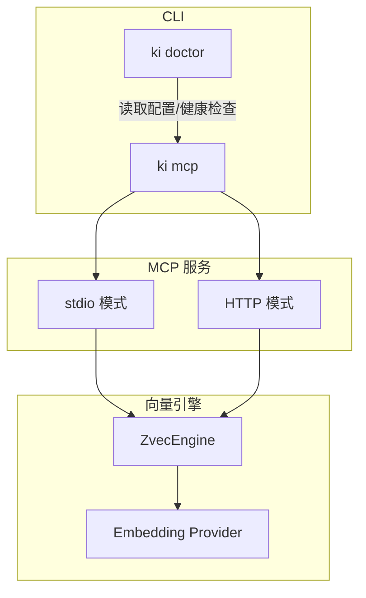
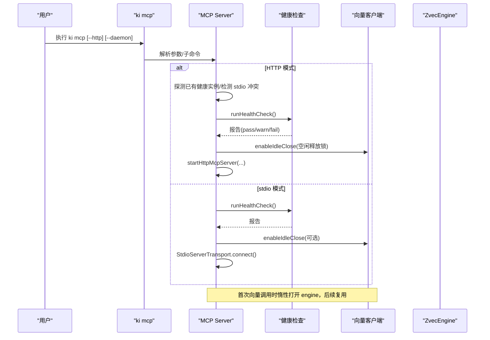
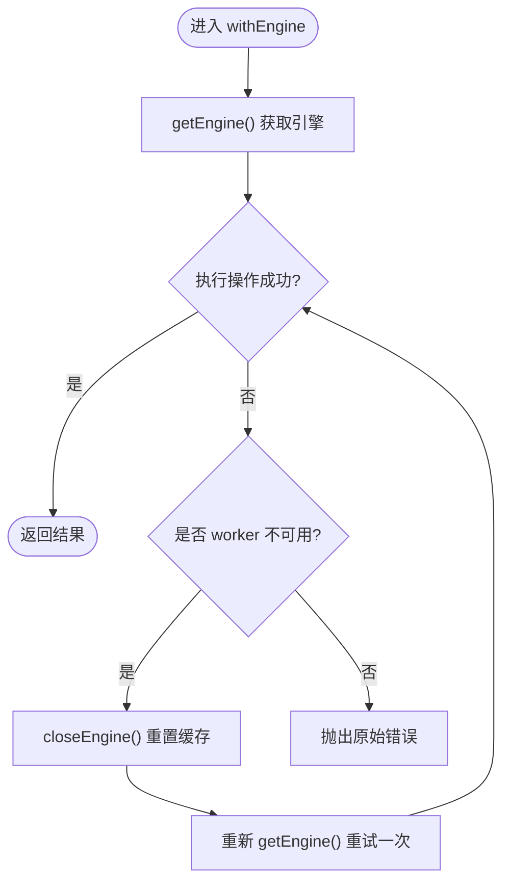
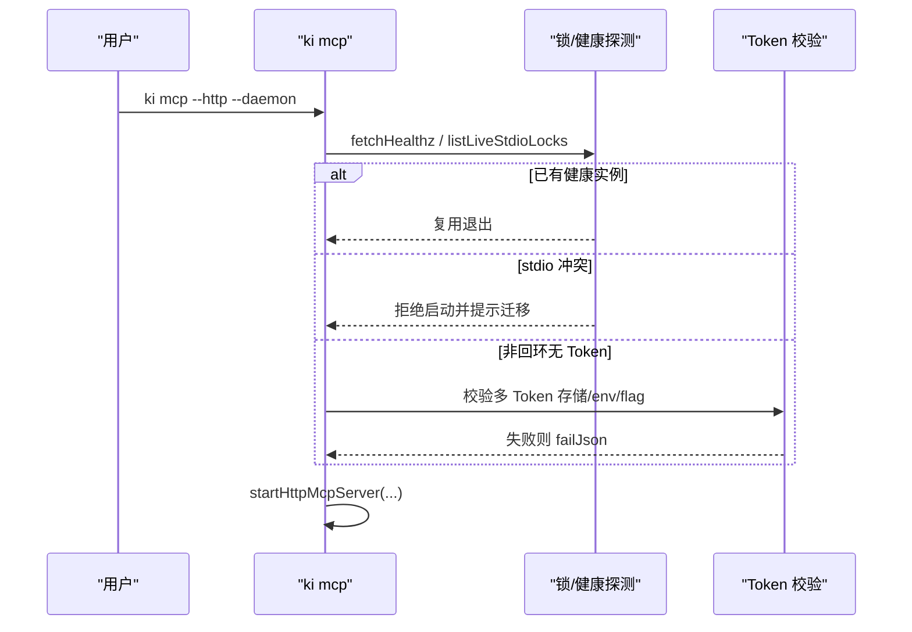
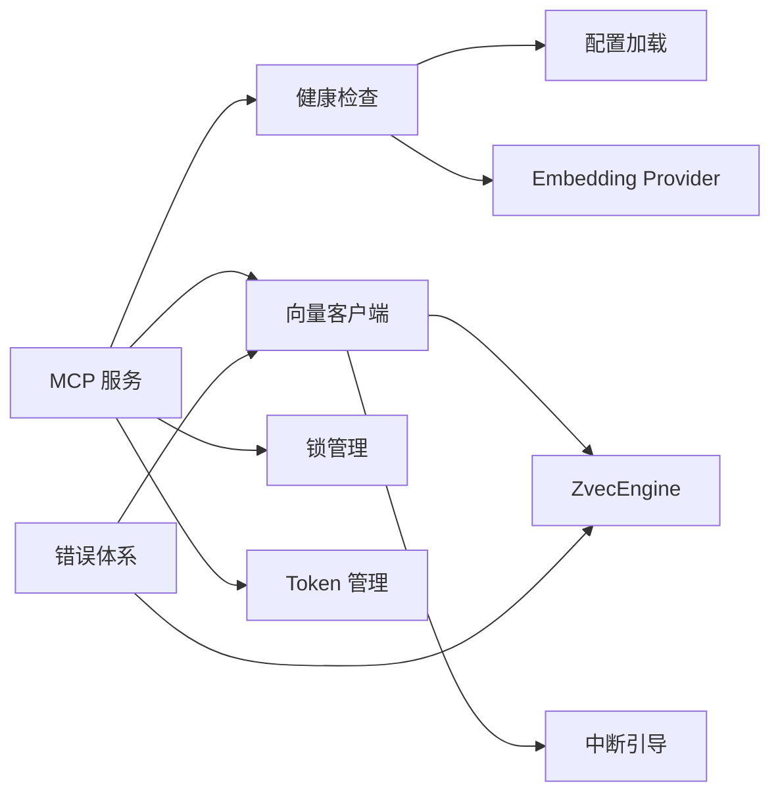

# 故障排查

<cite>
**本文引用的文件**
- [src/doctor.ts](file://src/doctor.ts)
- [src/lib/health-check.ts](file://src/lib/health-check.ts)
- [src/mcp-server.ts](file://src/mcp-server.ts)
- [src/lib/vector-client.ts](file://src/lib/vector-client.ts)
- [src/zvec-engine/errors.ts](file://src/zvec-engine/errors.ts)
- [docs/error-handling.md](file://docs/error-handling.md)
- [docs/vector-engine-mem.md](file://docs/vector-engine-mem.md)
- [src/lib/interrupt.ts](file://src/lib/interrupt.ts)
- [src/lib/config.ts](file://src/lib/config.ts)
- [src/lib/mcp-stop.ts](file://src/lib/mcp-stop.ts)
</cite>

## 目录
1. [简介](#简介)
2. [项目结构](#项目结构)
3. [核心组件](#核心组件)
4. [架构总览](#架构总览)
5. [详细组件分析](#详细组件分析)
6. [依赖关系分析](#依赖关系分析)
7. [性能问题定位与优化](#性能问题定位与优化)
8. [网络问题排查](#网络问题排查)
9. [日志与调试信息](#日志与调试信息)
10. [内存管理与资源清理](#内存管理与资源清理)
11. [进程中断与数据一致性](#进程中断与数据一致性)
12. [常见问题速查](#常见问题速查)
13. [结论](#结论)

## 简介
本指南面向运维与开发人员，聚焦知识索引器（kisearch）的故障排查与应急处置。内容覆盖：
- 常见错误类型与诊断方法：向量引擎错误、MCP 通信错误、文件权限问题等
- 系统诊断工具：ki doctor 命令与各检查项说明
- 日志与调试信息分析方法
- 性能问题定位与优化：查询慢、内存泄漏、CPU 占用过高等
- 网络问题排查：MCP 服务器连接问题、外部 API 调用失败
- 内存管理与资源清理最佳实践
- 进程中断处理与数据一致性保障

## 项目结构
本项目围绕“CLI + MCP Server + 向量引擎”三层架构组织：
- CLI 层：提供 ki doctor、ki mcp、导入/导出等命令
- MCP 服务层：stdio/HTTP 两种传输，注册工具并路由到业务逻辑
- 向量引擎层：基于 zvec 的进程内引擎，封装创建/打开/检索/写入/关闭等能力
- 健康检查与诊断：ki doctor 统一预检配置、目录权限、embedding 连通性、collection 状态等

**图表来源**
- [src/mcp-server.ts:492-734](file://src/mcp-server.ts#L492-L734)
- [src/lib/vector-client.ts:314-340](file://src/lib/vector-client.ts#L314-L340)
- [src/lib/health-check.ts:148-213](file://src/lib/health-check.ts#L148-L213)

**章节来源**
- [src/mcp-server.ts:492-734](file://src/mcp-server.ts#L492-L734)
- [src/lib/health-check.ts:148-213](file://src/lib/health-check.ts#L148-L213)

## 核心组件
- 健康检查与诊断：ki doctor 命令与 runHealthCheck 实现，输出 pass/warn/fail 报告，用于启动前预检与独立诊断
- MCP 服务：支持 stdio/HTTP，具备守护进程、重启、鉴权、锁冲突检测、版本守卫等能力
- 向量客户端：封装 ZvecEngine，提供搜索、存储、删除、可用性检测、撞锁重试、空闲释放锁等
- 错误体系：zvec-engine 定义结构化异常类型，便于跨线程/协议序列化与上层识别
- 中断与锁：导入中断标记与并发导入锁，保障中断恢复与幂等重建

**章节来源**
- [src/doctor.ts:1-55](file://src/doctor.ts#L1-L55)
- [src/lib/health-check.ts:148-213](file://src/lib/health-check.ts#L148-L213)
- [src/mcp-server.ts:492-734](file://src/mcp-server.ts#L492-L734)
- [src/lib/vector-client.ts:314-340](file://src/lib/vector-client.ts#L314-L340)
- [src/zvec-engine/errors.ts:17-99](file://src/zvec-engine/errors.ts#L17-L99)
- [src/lib/interrupt.ts:1-141](file://src/lib/interrupt.ts#L1-L141)

## 架构总览
下图展示 MCP 启动流程中的关键步骤：参数解析、守护/重启、预检、实例复用、锁冲突检测、向量库空闲释放锁启用、stdio/HTTP 启动。

**图表来源**
- [src/mcp-server.ts:492-734](file://src/mcp-server.ts#L492-L734)
- [src/lib/health-check.ts:148-213](file://src/lib/health-check.ts#L148-L213)
- [src/lib/vector-client.ts:164-181](file://src/lib/vector-client.ts#L164-L181)

## 详细组件分析

### 向量引擎错误与恢复
- 错误分类：集合生命周期（不存在/已存在/锁定/损坏）、Schema/配置（维度不匹配/无效 schema/文档输入非法/搜索或过滤非法）、嵌入错误（配置错误/请求错误）、Worker 错误（spawn/crash/unavailable/protocol/close timeout）
- 恢复策略：
  - 集合锁定：提示停止其他进程或等待自动释放；必要时重建
  - 损坏：建议从快照恢复或重建向量库
  - 维度不匹配：修正 embedding.dimension 与实际模型返回维度一致
  - Worker 不可用：自动重置并重试一次

**图表来源**
- [src/lib/vector-client.ts:389-407](file://src/lib/vector-client.ts#L389-L407)
- [src/zvec-engine/errors.ts:17-99](file://src/zvec-engine/errors.ts#L17-L99)

**章节来源**
- [src/zvec-engine/errors.ts:17-99](file://src/zvec-engine/errors.ts#L17-L99)
- [src/lib/vector-client.ts:389-407](file://src/lib/vector-client.ts#L389-L407)

### MCP 通信错误与守护管理
- 常见错误：
  - 未知参数/短 flag：打印帮助并退出
  - --daemon 仅支持 HTTP：非 HTTP 模式拒绝
  - 非回环绑定需 Token：未配置则 fail-loud 并给出指引
  - stdio 与 HTTP 单例冲突：检测到存活 stdio 实例时拒绝启动 HTTP，引导迁移 URL 接入
  - 重启失败：restart 前进行守卫校验（stdio 冲突、Token 校验），避免假成功
- 管理命令：
  - stop：关闭所有实例并清理 lock
  - restart：仅 HTTP 模式，后台常驻重启
  - token：生成/列出/更新/删除授权 Token

**图表来源**
- [src/mcp-server.ts:137-212](file://src/mcp-server.ts#L137-L212)
- [src/mcp-server.ts:592-658](file://src/mcp-server.ts#L592-L658)
- [src/mcp-server.ts:410-490](file://src/mcp-server.ts#L410-L490)

**章节来源**
- [src/mcp-server.ts:137-212](file://src/mcp-server.ts#L137-L212)
- [src/mcp-server.ts:410-490](file://src/mcp-server.ts#L410-L490)
- [src/mcp-server.ts:592-658](file://src/mcp-server.ts#L592-L658)

### 文件权限与目录检查
- 检查项：dataDir、backupDir、vectorDir 是否存在且可写
- 配置文件：加载优先级（命令行 > 环境变量 > 默认路径），YAML 优先，JSON 兼容但提示迁移
- 常见错误：
  - 目录不存在：创建或修正路径
  - 无写权限：调整文件系统权限或更换路径
  - 配置文件语法错误：修复 YAML/JSON 格式

**章节来源**
- [src/lib/health-check.ts:35-46](file://src/lib/health-check.ts#L35-L46)
- [src/lib/config.ts:148-175](file://src/lib/config.ts#L148-L175)
- [src/lib/config.ts:185-200](file://src/lib/config.ts#L185-L200)

### 诊断工具：ki doctor
- 功能：一键诊断配置有效性、目录可写、apiKey、embedding 连通性与维度、zvec collection、scopes.default
- 行为：只读，不修改任何配置或数据；有失败项时退出码为 1（供脚本 gate）
- 使用：
  - ki doctor
  - ki --config <path> doctor

**章节来源**
- [src/doctor.ts:1-55](file://src/doctor.ts#L1-L55)
- [src/lib/health-check.ts:148-213](file://src/lib/health-check.ts#L148-L213)

## 依赖关系分析
- 健康检查依赖配置加载与 embedding provider
- MCP 服务依赖健康检查、向量客户端、锁管理、Token 管理
- 向量客户端依赖 ZvecEngine、配置、scope 校验、中断引导
- 错误体系贯穿向量引擎与客户端，支持跨线程/协议序列化

**图表来源**
- [src/lib/health-check.ts:148-213](file://src/lib/health-check.ts#L148-L213)
- [src/mcp-server.ts:492-734](file://src/mcp-server.ts#L492-L734)
- [src/lib/vector-client.ts:314-340](file://src/lib/vector-client.ts#L314-L340)
- [src/zvec-engine/errors.ts:17-99](file://src/zvec-engine/errors.ts#L17-L99)

**章节来源**
- [src/lib/health-check.ts:148-213](file://src/lib/health-check.ts#L148-L213)
- [src/mcp-server.ts:492-734](file://src/mcp-server.ts#L492-L734)
- [src/lib/vector-client.ts:314-340](file://src/lib/vector-client.ts#L314-L340)
- [src/zvec-engine/errors.ts:17-99](file://src/zvec-engine/errors.ts#L17-L99)

## 性能问题定位与优化
- 查询慢：
  - 确认混合检索参数合理（queryText、fts、topk、filter）
  - 检查 scope/tag 过滤是否缩小范围
  - 观察向量库是否被锁定导致频繁重试
- 内存泄漏：
  - 确保 MCP 进程正确关闭 engine（SIGINT/SIGTERM/onclose）
  - 避免长时间持有 engine 引用而不释放
- CPU 占用过高：
  - 减少高频批量 upsert 的并发度
  - 检查 embedding 请求频率与超时设置
- 优化建议：
  - 使用空闲释放锁（enableIdleClose）让多实例错开共享
  - 合理设置 topk 与阈值，避免全量扫描
  - 对大库使用分页/限制扫描上限

**章节来源**
- [src/lib/vector-client.ts:164-181](file://src/lib/vector-client.ts#L164-L181)
- [src/lib/vector-client.ts:389-407](file://src/lib/vector-client.ts#L389-L407)
- [docs/vector-engine-mem.md:233-245](file://docs/vector-engine-mem.md#L233-L245)

## 网络问题排查
- MCP 服务器连接问题：
  - 检查端口与 Host 头白名单
  - 非回环绑定必须配置 Token
  - 使用 ki mcp --status 查看运行状态
- 外部 API 调用失败（embedding）：
  - 检查 baseURL、apiKey、dimension 是否匹配
  - 观察 health-check 报告的 URL 连通性、密钥有效性、维度匹配
  - 超时/网络错误：调整超时与重试策略

**章节来源**
- [src/mcp-server.ts:137-212](file://src/mcp-server.ts#L137-L212)
- [src/lib/health-check.ts:52-142](file://src/lib/health-check.ts#L52-L142)

## 日志与调试信息
- 健康检查报告：ki doctor 输出 pass/warn/fail 明细，stderr 输出启动预检结果
- MCP 模式提示：stdio/HTTP 模式启动信息、锁冲突提示、Token 来源说明
- 向量库状态：probe 结果、锁定提示、损坏提示
- 调试建议：
  - 先执行 ki doctor 排除配置与环境问题
  - 使用 ki mcp --status 检查 HTTP 实例状态
  - 关注 stderr 输出的诊断信息与引导文案

**章节来源**
- [src/doctor.ts:18-48](file://src/doctor.ts#L18-L48)
- [src/mcp-server.ts:660-678](file://src/mcp-server.ts#L660-L678)
- [src/lib/vector-client.ts:74-86](file://src/lib/vector-client.ts#L74-L86)

## 内存管理与资源清理
- 引擎生命周期：
  - 首次调用惰性打开，后续复用
  - 空闲释放锁：常驻 MCP 启用，CLI 不启用
  - 关闭流程：SIGINT/SIGTERM/onclose 触发 closeEngine
- 资源清理最佳实践：
  - 确保每次调用后释放引擎引用
  - 避免在长任务中阻塞关闭流程
  - 使用 withEngine 包装操作，保证在途保护与自愈重试

**章节来源**
- [src/lib/vector-client.ts:164-181](file://src/lib/vector-client.ts#L164-L181)
- [src/lib/vector-client.ts:346-365](file://src/lib/vector-client.ts#L346-L365)
- [src/mcp-server.ts:710-733](file://src/mcp-server.ts#L710-L733)

## 进程中断与数据一致性
- 中断标记：导入被 SIGINT/SIGTERM 中断时写入进度信息，下次命令给出恢复引导
- 导入锁：防止并发导入，支持死锁自动清理
- 恢复策略：rebuild-vector 或 restore --from-snapshot --rebuild-vector
- 数据一致性：
  - 幂等 upsert：同 scope+text+tag 生成相同 docId，重复写入覆盖
  - 双写模式：本地索引先行，向量异步写入，失败不影响主流程

**章节来源**
- [src/lib/interrupt.ts:1-141](file://src/lib/interrupt.ts#L1-L141)
- [src/lib/vector-client.ts:240-242](file://src/lib/vector-client.ts#L240-L242)
- [docs/vector-engine-mem.md:194-203](file://docs/vector-engine-mem.md#L194-L203)

## 常见问题速查
- 向量库被占用：
  - 现象：CollectionLockedException 或 probe locked
  - 处置：停止其他进程、等待自动释放、重建向量库
- 维度不匹配：
  - 现象：embedding 返回维度与配置不一致
  - 处置：修正 embedding.dimension 与实际模型维度一致
- MCP 启动失败：
  - 现象：未知参数、--daemon 仅支持 HTTP、非回环无 Token
  - 处置：修正参数、配置 Token、迁移 URL 接入
- 文件权限问题：
  - 现象：目录不存在或无写权限
  - 处置：创建目录、调整权限、更换路径
- 查询慢：
  - 现象：hybridSearch 耗时过长
  - 处置：调整 topk、filter、检查锁竞争

**章节来源**
- [src/lib/vector-client.ts:74-86](file://src/lib/vector-client.ts#L74-L86)
- [src/lib/health-check.ts:52-142](file://src/lib/health-check.ts#L52-L142)
- [src/mcp-server.ts:137-212](file://src/mcp-server.ts#L137-L212)
- [docs/error-handling.md:130-146](file://docs/error-handling.md#L130-L146)

## 结论
通过 ki doctor 健康检查、MCP 守护管理、向量引擎错误体系与中断恢复机制，本项目提供了完善的故障排查与恢复能力。建议在日常运维中：
- 定期执行 ki doctor 验证环境与健康状态
- 使用 ki mcp --status 监控服务状态
- 关注 stderr 输出的诊断信息与引导文案
- 合理配置 embedding、Token 与锁策略，避免网络与锁竞争问题
- 遵循内存管理与资源清理最佳实践，确保进程稳定与数据一致性