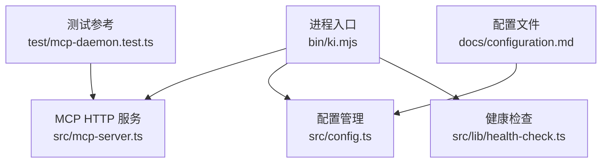
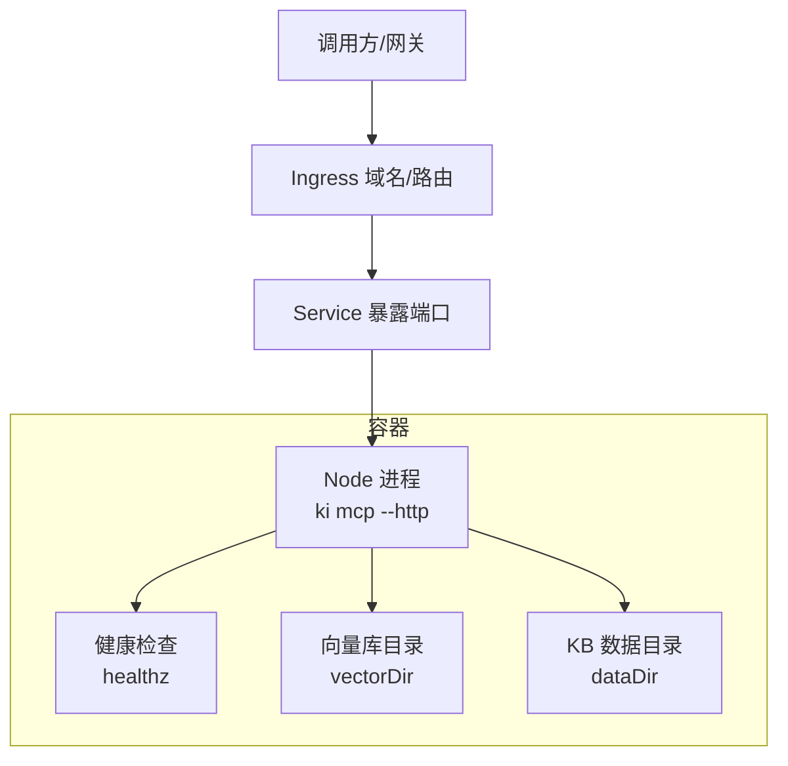
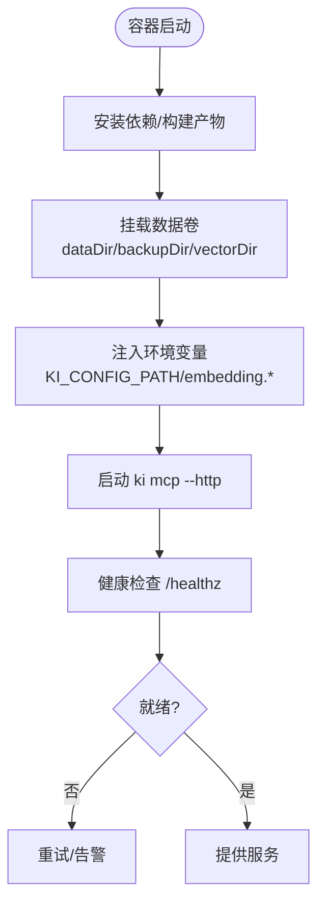
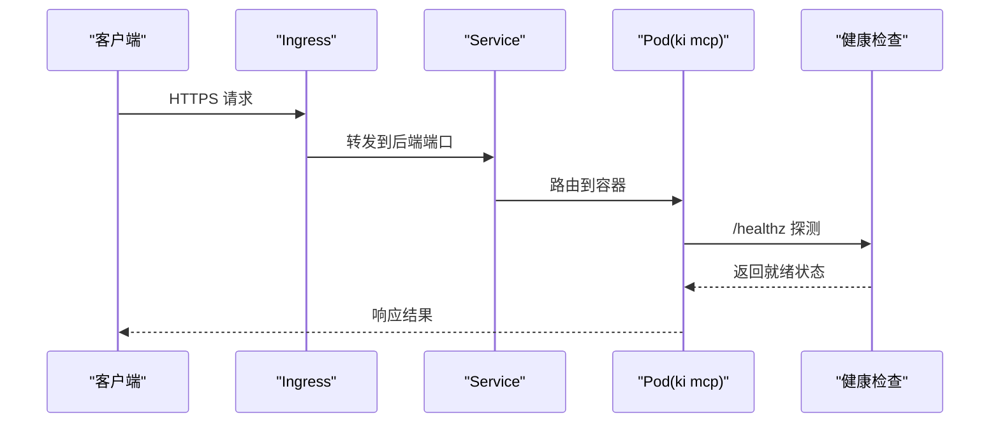
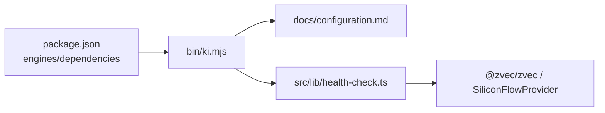

# 生产环境部署

<cite>
**本文引用的文件**
- [package.json](file://package.json)
- [bin/ki.mjs](file://bin/ki.mjs)
- [src/config.ts](file://src/config.ts)
- [docs/configuration.md](file://docs/configuration.md)
- [src/lib/health-check.ts](file://src/lib/health-check.ts)
- [test/mcp-daemon.test.ts](file://test/mcp-daemon.test.ts)
- [test/fixtures/mock-wiki/部署指南/Docker 部署.md](file://test/fixtures/mock-wiki/部署指南/Docker 部署.md)
</cite>

## 目录
1. [简介](#简介)
2. [项目结构](#项目结构)
3. [核心组件](#核心组件)
4. [架构总览](#架构总览)
5. [详细组件分析](#详细组件分析)
6. [依赖关系分析](#依赖关系分析)
7. [性能与资源规划](#性能与资源规划)
8. [故障排查指南](#故障排查指南)
9. [结论](#结论)
10. [附录：部署清单与示例](#附录部署清单与示例)

## 简介
本指南面向生产环境，聚焦 Node.js 环境要求、配置优化（内存、并发、日志等）、容器化（Dockerfile 与 docker-compose）、Kubernetes 部署（Pod/Service/Ingress）、环境变量与敏感信息管理，以及性能调优与资源规划建议。kisearch 提供 CLI 与 MCP HTTP 服务两种运行形态，生产环境通常以长驻 MCP HTTP 服务模式对外暴露能力，并通过健康检查与诊断工具保障稳定性。

## 项目结构
- 入口与命令分发：CLI 入口统一由 bin/ki.mjs 解析并转发到各子命令实现。
- 配置体系：通过 docs/configuration.md 描述的优先级加载 YAML/JSON 配置文件；支持环境变量覆盖与模板生成。
- 健康检查：src/lib/health-check.ts 提供启动前预检与诊断输出，用于 MCP 启动前验证 embedding 连通性、密钥、维度匹配及数据目录可写性等。
- 测试参考：test/mcp-daemon.test.ts 展示了 MCP HTTP 服务的端口、健康端点与健康就绪轮询方式，便于编排容器就绪探针。

**图表来源**
- [bin/ki.mjs:1-49](file://bin/ki.mjs#L1-L49)
- [docs/configuration.md:1-252](file://docs/configuration.md#L1-L252)
- [src/lib/health-check.ts:1-234](file://src/lib/health-check.ts#L1-L234)
- [test/mcp-daemon.test.ts:136-173](file://test/mcp-daemon.test.ts#L136-L173)

**章节来源**
- [bin/ki.mjs:1-49](file://bin/ki.mjs#L1-L49)
- [docs/configuration.md:1-252](file://docs/configuration.md#L1-L252)

## 核心组件
- 运行时环境与版本
  - Node.js 版本要求：>=18.0.0（见 engines 字段）。
  - 构建与脚本：使用 TypeScript 编译与 jiti 执行 TS 源文件。
- 配置加载与模板
  - 配置文件查找顺序：命令行参数 > 环境变量 KI_CONFIG_PATH > $HOME/.ki/config.yaml/yml/json > 内置默认值。
  - 模板生成：ki config init 生成带注释的 YAML 模板，包含 dataDir、backupDir、vectorDir、embedding、scopeMode、scopes、mcp 等关键项。
- 健康检查与诊断
  - 启动预检：校验配置文件、目录可写、apiKey、embedding 连通性/密钥/维度、zvec collection 状态、default scope。
  - 诊断输出：结构化报告，便于自动化集成。

**章节来源**
- [package.json:60-62](file://package.json#L60-L62)
- [docs/configuration.md:7-24](file://docs/configuration.md#L7-L24)
- [src/config.ts:30-119](file://src/config.ts#L30-L119)
- [src/lib/health-check.ts:148-213](file://src/lib/health-check.ts#L148-L213)

## 架构总览
生产环境典型部署形态：
- 容器内运行 ki mcp --http，监听 MCP HTTP 端口，对外提供服务。
- 通过健康检查在启动阶段验证 embedding 与存储路径可用性。
- 通过 Service/Ingress 暴露 MCP HTTP 接口，供上游网关或内部系统调用。
- 使用环境变量注入敏感信息（如 apiKey），避免写入配置文件。

[此图为概念图，不直接映射具体源码文件]

## 详细组件分析

### 配置与生产优化要点
- 基础路径
  - dataDir：KB 源数据目录，建议挂载持久卷，确保高可用与备份策略。
  - backupDir：备份快照目录，建议独立磁盘或对象存储挂载。
  - vectorDir：zvec 向量库集合目录，schema 创建后不可变更，需提前规划并固定 dimension。
- Embedding 提供商
  - provider/baseURL/model/dimension/apiKey：生产建议使用环境变量引用 apiKey，避免明文落盘。
  - 健康检查会发起一次最短请求验证 URL 连通性、密钥有效性、维度匹配，超时与重试已内置。
- Scope 护栏
  - scopeMode：生产推荐 strict，强制白名单，降低误用风险。
- MCP 传输
  - host/port：生产建议绑定 0.0.0.0 并通过反向代理/Ingress 暴露；allowedHosts 用于 DNS Rebinding 防护。
  - 健康端点：/healthz 可用于就绪探针。
- 日志级别
  - 本项目未暴露显式日志级别配置项；可通过外部日志采集（stdout/stderr）与容器平台日志策略控制。

**章节来源**
- [docs/configuration.md:43-177](file://docs/configuration.md#L43-L177)
- [src/lib/health-check.ts:52-142](file://src/lib/health-check.ts#L52-L142)
- [test/mcp-daemon.test.ts:136-173](file://test/mcp-daemon.test.ts#L136-L173)

### 环境变量管理与敏感信息保护
- 配置文件优先级与环境变量
  - KI_CONFIG_PATH：显式指定配置文件路径。
  - embedding.apiKey：支持 ${VAR_NAME} 引用环境变量，生产务必使用此方式注入密钥。
- 安全建议
  - 不在配置文件中明文存放 apiKey。
  - 通过容器编排平台（Secrets/ConfigMap）注入环境变量。
  - 限制 MCP 监听地址与 allowedHosts，仅暴露必要端口。

**章节来源**
- [docs/configuration.md:7-24](file://docs/configuration.md#L7-L24)
- [docs/configuration.md:67-89](file://docs/configuration.md#L67-L89)
- [src/config.ts:88-99](file://src/config.ts#L88-L99)

### Docker 容器化部署
- 镜像与运行
  - 基于 Node.js 官方镜像（满足 >=18.0.0）。
  - 安装依赖并构建产物（如需），将工作目录设置为应用根目录。
  - 启动命令：ki mcp --http（或通过脚本传入 host/port）。
- 数据持久化
  - 挂载 dataDir、backupDir、vectorDir 为持久卷，避免容器重启丢失数据。
- 健康检查
  - 使用 /healthz 作为存活/就绪探针，参考测试中的轮询逻辑。
- 最小资源
  - 参考仓库中“最低 4GB 内存”的建议，结合向量导入与查询负载评估实际需求。

[此图为概念流程，不直接映射具体源码文件]

**章节来源**
- [test/fixtures/mock-wiki/部署指南/Docker 部署.md:1-34](file://test/fixtures/mock-wiki/部署指南/Docker 部署.md#L1-L34)
- [test/mcp-daemon.test.ts:136-173](file://test/mcp-daemon.test.ts#L136-L173)

### Kubernetes 部署
- Pod 资源配置
  - 资源限制：requests/limits 设置 CPU/内存，结合向量导入峰值与查询延迟目标调整。
  - 探针：liveness/readiness 指向 /healthz。
  - 存储：使用 PVC 挂载 dataDir、backupDir、vectorDir。
  - 环境变量：通过 Secret/ConfigMap 注入 KI_CONFIG_PATH 与 embedding.*。
- Service 暴露
  - ClusterIP 类型 Service 暴露 MCP HTTP 端口，供 Ingress 或内部调用。
- Ingress 配置
  - 域名与路径路由至 Service 端口，启用 TLS 终止。
  - 若需要鉴权，可在 Ingress 层接入认证插件或前置网关。

[此图为概念序列图，不直接映射具体源码文件]

**章节来源**
- [test/mcp-daemon.test.ts:136-173](file://test/mcp-daemon.test.ts#L136-L173)

## 依赖关系分析
- 运行时依赖
  - Node.js >=18.0.0。
  - 依赖包包括 @modelcontextprotocol/sdk、@zvec/zvec、commander、jiti、yaml、zod 等。
- 模块耦合
  - CLI 入口集中分发命令，降低耦合。
  - 配置读取与模板生成解耦，便于扩展。
  - 健康检查复用 embedding 提供者错误语义，减少重复逻辑。

**图表来源**
- [package.json:42-62](file://package.json#L42-L62)
- [bin/ki.mjs:28-49](file://bin/ki.mjs#L28-L49)
- [src/lib/health-check.ts:15-19](file://src/lib/health-check.ts#L15-L19)

**章节来源**
- [package.json:42-62](file://package.json#L42-L62)
- [bin/ki.mjs:28-49](file://bin/ki.mjs#L28-L49)

## 性能与资源规划
- 内存与并发
  - Node.js 进程内存受限于容器 limits；向量导入与查询可能产生峰值内存，建议预留足够 headroom。
  - 并发连接数由 MCP HTTP 服务器与底层网络栈决定，生产建议通过反向代理/Ingress 进行限流与队列控制。
- 存储与 I/O
  - dataDir/backupDir/vectorDir 建议使用高性能块存储或 SSD，避免导入与索引重建时的 I/O 瓶颈。
- 向量引擎
  - zvec collection 的 dimension 固定，扩容需重建；合理规划初始 schema，避免频繁重建。
- 健康检查与降级
  - embedding 健康检查具备超时与重试，生产应容忍瞬时抖动；必要时对上游调用做超时与熔断。
- 日志与观测
  - 通过 stdout/stderr 输出日志，配合平台日志采集；结合健康检查与指标埋点（如有）形成可观测闭环。

[本节为通用指导，不直接分析具体文件]

## 故障排查指南
- 启动失败
  - 检查配置文件是否存在且格式正确；使用 ki doctor 或 health-check 输出定位问题。
  - 确认 dataDir/backupDir/vectorDir 存在且可写。
- Embedding 异常
  - 若 baseURL 不可达或密钥无效，健康检查会标记 fail；核对 apiKey 与 baseURL。
  - 维度不匹配时，需重建 collection 或修正配置。
- 服务就绪
  - 通过 /healthz 判断服务是否就绪；测试用例展示了轮询等待就绪的逻辑，可作为编排参考。

**章节来源**
- [src/lib/health-check.ts:148-213](file://src/lib/health-check.ts#L148-L213)
- [test/mcp-daemon.test.ts:136-173](file://test/mcp-daemon.test.ts#L136-L173)

## 结论
生产环境部署 kisearch 的关键在于：稳定的 Node.js 环境、合理的配置与权限、健壮的启动健康检查、安全的敏感信息管理、以及完善的容器化与编排方案。通过持久化存储、资源限制与健康探针，可实现高可用的 MCP HTTP 服务；结合 Ingress 与反向代理，可安全地对外暴露能力。

## 附录：部署清单与示例
- 环境准备
  - Node.js >=18.0.0。
  - 持久卷：dataDir、backupDir、vectorDir。
- 配置步骤
  - 生成模板：ki config init。
  - 编辑配置：设置 embedding.provider/baseURL/model/dimension/apiKey、scopeMode、mcp.host/port。
  - 注入环境变量：KI_CONFIG_PATH、embedding.*。
- 容器化
  - 构建镜像并挂载数据卷。
  - 启动命令：ki mcp --http。
  - 健康探针：/healthz。
- Kubernetes
  - Pod：设置 requests/limits、探针、PVC、环境变量。
  - Service：ClusterIP 暴露端口。
  - Ingress：域名与 TLS 终止。

[本节为操作清单，不直接分析具体文件]