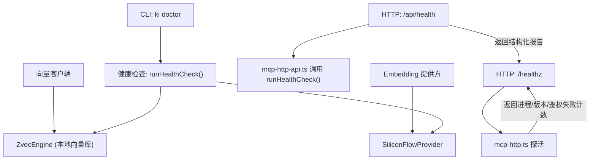
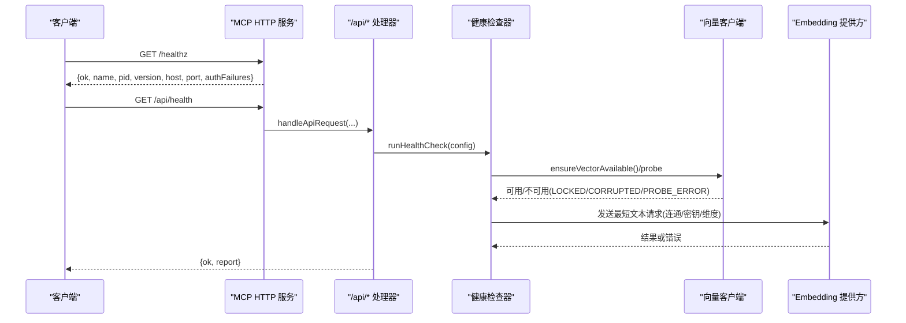
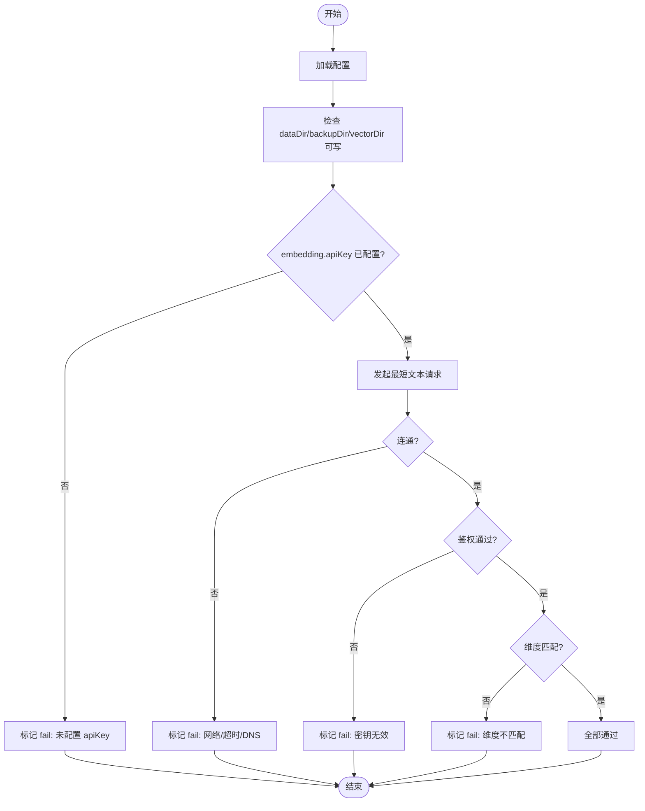
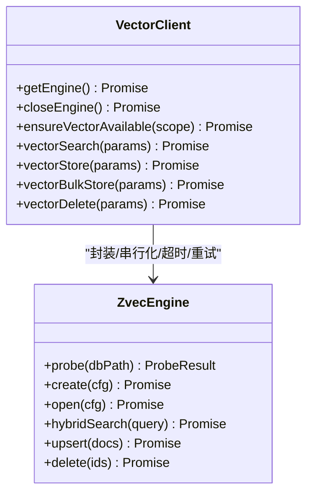
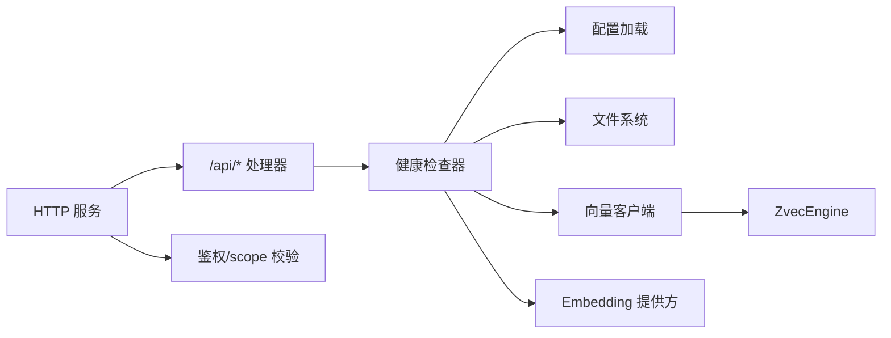

# 监控与日志

<cite>
**本文引用的文件**
- [health-check.ts](file://src/lib/health-check.ts)
- [doctor.ts](file://src/doctor.ts)
- [mcp-http.ts](file://src/lib/mcp-http.ts)
- [mcp-http-api.ts](file://src/lib/mcp-http-api.ts)
- [vector-client.ts](file://src/lib/vector-client.ts)
- [config.ts](file://src/config.ts)
- [error-handling.md](file://docs/error-handling.md)
</cite>

## 目录
1. [简介](#简介)
2. [项目结构](#项目结构)
3. [核心组件](#核心-components)
4. [架构总览](#架构总览)
5. [详细组件分析](#详细组件分析)
6. [依赖关系分析](#依赖关系分析)
7. [性能考量](#性能考量)
8. [故障排查指南](#故障排查指南)
9. [结论](#结论)
10. [附录](#附录)

## 简介
本指南面向运维与开发者，系统化说明知识索引服务的“健康检查、日志与诊断、关键指标采集、错误处理与告警建议、以及内置诊断工具”的使用与实践。重点覆盖：
- 健康检查端点：系统状态、依赖服务状态与健康指标
- 日志体系：输出位置、级别控制、轮转策略建议
- 关键性能指标：查询响应时间、向量检索性能、内存使用等
- 错误处理与异常监控最佳实践
- 告警规则与通知机制（结合现有可观测性能力）
- 内置诊断工具：ki doctor、HTTP /healthz、/api/health、进程状态查看

## 项目结构
围绕监控与日志的关键代码集中在以下模块：
- 健康检查与诊断：lib/health-check.ts、src/doctor.ts
- HTTP 服务与端点：lib/mcp-http.ts、lib/mcp-http-api.ts
- 向量引擎客户端：lib/vector-client.ts
- 配置管理：src/config.ts
- 错误处理文档：docs/error-handling.md

**图示来源**
- [health-check.ts:148-213](file://src/lib/health-check.ts#L148-L213)
- [mcp-http.ts:183-229](file://src/lib/mcp-http.ts#L183-L229)
- [mcp-http-api.ts:276-288](file://src/lib/mcp-http-api.ts#L276-L288)
- [vector-client.ts:247-303](file://src/lib/vector-client.ts#L247-L303)

**章节来源**
- [health-check.ts:1-234](file://src/lib/health-check.ts#L1-L234)
- [mcp-http.ts:1-810](file://src/lib/mcp-http.ts#L1-L810)
- [mcp-http-api.ts:1-565](file://src/lib/mcp-http-api.ts#L1-L565)
- [vector-client.ts:1-754](file://src/lib/vector-client.ts#L1-L754)
- [config.ts:1-204](file://src/config.ts#L1-L204)
- [error-handling.md:1-153](file://docs/error-handling.md#L1-L153)

## 核心组件
- 健康检查器：对配置文件、数据/备份/向量目录、apiKey、embedding 连通性与维度、zvec collection、scopes.default 进行只读检查，输出 pass/warn/fail 报告。
- HTTP 健康端点：/healthz 提供轻量存活探测；/api/health 返回完整健康报告（含超时保护）。
- 诊断命令：ki doctor 一键诊断并输出可读报告，失败时退出码为 1，便于脚本 gate。
- 向量客户端：封装 ZvecEngine，提供检索、存储、删除、可用性检测、空闲释放锁、撞锁重试等能力。
- 配置管理：生成默认配置模板，定义 embedding、scopeMode、scopes 等关键项。

**章节来源**
- [health-check.ts:148-213](file://src/lib/health-check.ts#L148-L213)
- [mcp-http.ts:183-229](file://src/lib/mcp-http.ts#L183-L229)
- [mcp-http-api.ts:276-288](file://src/lib/mcp-http-api.ts#L276-L288)
- [vector-client.ts:420-467](file://src/lib/vector-client.ts#L420-L467)
- [config.ts:70-119](file://src/config.ts#L70-L119)

## 架构总览
健康检查与 HTTP 端点协同工作，形成“进程级存活 + 应用级健康”的双层可观测性：
- /healthz：快速存活探测，包含进程信息、版本号、鉴权失败计数（非回环模式）
- /api/health：调用 runHealthCheck，返回结构化健康报告（配置、目录、apiKey、embedding、collection、scopes）
- ki doctor：命令行诊断，复用同一健康检查逻辑，适合 CI/CD 门禁

**图示来源**
- [mcp-http.ts:183-229](file://src/lib/mcp-http.ts#L183-L229)
- [mcp-http-api.ts:276-288](file://src/lib/mcp-http-api.ts#L276-L288)
- [health-check.ts:52-142](file://src/lib/health-check.ts#L52-L142)
- [vector-client.ts:420-467](file://src/lib/vector-client.ts#L420-L467)

## 详细组件分析

### 健康检查与诊断（ki doctor 与 /api/health）
- 检查项：
  - 配置文件存在且可解析
  - dataDir、backupDir、vectorDir 存在且可写
  - embedding.apiKey 是否配置
  - embedding 连通性、密钥有效性、维度匹配（一次请求三合一）
  - zvec collection 是否存在
  - scopes.default 是否配置
- 输出：结构化报告 items（name/status/detail），统计 pass/warn/fail 数量
- 超时：/api/health 对健康检查设置超时保护，避免阻塞

**图示来源**
- [health-check.ts:52-142](file://src/lib/health-check.ts#L52-L142)
- [health-check.ts:148-213](file://src/lib/health-check.ts#L148-L213)

**章节来源**
- [health-check.ts:1-234](file://src/lib/health-check.ts#L1-L234)
- [mcp-http-api.ts:276-288](file://src/lib/mcp-http-api.ts#L276-L288)

### HTTP 健康端点（/healthz）
- 功能：返回进程名、PID、版本、绑定地址、鉴权失败次数（非回环模式）
- 用途：进程存活探测、实例复用判定、鉴权问题定位
- 安全：免鉴权，供单例探活与运维排查

**章节来源**
- [mcp-http.ts:183-229](file://src/lib/mcp-http.ts#L183-L229)

### 向量客户端与可用性检测
- 可用性检测：ensureVectorAvailable 返回 available/code/reason，区分 LOCKED/CORRUPTED/PROBE_ERROR
- 撞锁重试：多进程共享向量库时，检测到 locked 会等待并重试，避免立即失败
- 空闲释放锁：常驻 MCP 模式下，空闲超时自动 closeEngine 释放锁，让其他实例抢占
- 在途保护：withEngine 包装操作，防止空闲释放竞态导致 worker closed 错误

**图示来源**
- [vector-client.ts:183-216](file://src/lib/vector-client.ts#L183-L216)
- [vector-client.ts:314-340](file://src/lib/vector-client.ts#L314-L340)
- [vector-client.ts:420-467](file://src/lib/vector-client.ts#L420-L467)

**章节来源**
- [vector-client.ts:1-754](file://src/lib/vector-client.ts#L1-L754)

### 配置管理与初始化
- 配置模板：包含 dataDir、backupDir、vectorDir、embedding.provider/baseURL/model/dimension/apiKey、scopeMode、scopes
- 初始化命令：ki config init 生成 YAML 模板到 .ki/config.yaml，并创建默认目录
- 环境变量支持：apiKey 支持 ${VAR_NAME} 引用，运行时从同名环境变量读取

**章节来源**
- [config.ts:70-119](file://src/config.ts#L70-L119)
- [config.ts:128-177](file://src/config.ts#L128-L177)

## 依赖关系分析
- 健康检查依赖：
  - 配置加载（loadConfig）
  - 文件系统（fs）
  - 向量客户端（ensureVectorAvailable/probe）
  - Embedding 提供方（SiliconFlowProvider）
- HTTP 端点依赖：
  - mcp-http.ts 提供 /healthz 与路由分发
  - mcp-http-api.ts 实现 /api/health 等扩展接口
  - 鉴权与 scope 校验（非回环模式）
- 向量客户端依赖：
  - ZvecEngine（worker_threads 后端）
  - 配置（embedding 参数、向量目录）
  - 中断引导（interruptGuidance）

**图示来源**
- [health-check.ts:148-213](file://src/lib/health-check.ts#L148-L213)
- [mcp-http-api.ts:216-272](file://src/lib/mcp-http-api.ts#L216-L272)
- [vector-client.ts:247-303](file://src/lib/vector-client.ts#L247-L303)

**章节来源**
- [health-check.ts:1-234](file://src/lib/health-check.ts#L1-L234)
- [mcp-http.ts:1-810](file://src/lib/mcp-http.ts#L1-L810)
- [mcp-http-api.ts:1-565](file://src/lib/mcp-http-api.ts#L1-L565)
- [vector-client.ts:1-754](file://src/lib/vector-client.ts#L1-L754)

## 性能考量
- 健康检查超时：/api/health 对健康检查设置 10s 超时，避免长时间阻塞
- 向量库打开超时：ENGINE_OPEN_TIMEOUT_MS=20s，防止底层挂死导致永久 pending
- 会话限制：DEFAULT_MAX_SESSIONS=256，防止会话无界增长耗尽内存
- 空闲回收：SESSION_SWEEP_INTERVAL_MS=60s，清理空闲会话
- 撞锁重试：LOCK_RETRY_INTERVAL_MS=2s，最多重试 3 次，错开共享向量库
- 嵌入请求超时：timeoutMs=8000，retries=1，容忍瞬时网络抖动

**章节来源**
- [mcp-http-api.ts:41-42](file://src/lib/mcp-http-api.ts#L41-L42)
- [vector-client.ts:199-216](file://src/lib/vector-client.ts#L199-L216)
- [mcp-http.ts:46-53](file://src/lib/mcp-http.ts#L46-L53)
- [vector-client.ts:137-140](file://src/lib/vector-client.ts#L137-L140)
- [health-check.ts:90-92](file://src/lib/health-check.ts#L90-L92)

## 故障排查指南
- 常见问题：
  - 端口占用：EADDRINUSE，需更换端口或排查占用进程
  - 权限不足：EACCES，改用高位端口
  - 地址不可用：EADDRNOTAVAIL，本机访问用 127.0.0.1，对外监听用 0.0.0.0
  - 主机无法解析：ENOTFOUND，检查 --host 是否为合法 IP 或可解析主机名
- 鉴权失败：
  - 非回环模式需 Bearer Token，缺失或无效将记录失败次数并写入 stderr
  - 可通过 /healthz 的 authFailures 字段观察累计失败次数
- 向量库锁冲突：
  - 多进程共享向量库时，检测到 locked 会等待并重试
  - 若持续报锁，确认无其他 ki 命令正在写入，或执行重建恢复
- 配置问题：
  - embedding.apiKey 未配置会导致向量操作失败
  - 维度不匹配会明确提示配置值与实际值差异

**章节来源**
- [mcp-http.ts:609-630](file://src/lib/mcp-http.ts#L609-L630)
- [mcp-http.ts:358-372](file://src/lib/mcp-http.ts#L358-L372)
- [vector-client.ts:74-86](file://src/lib/vector-client.ts#L74-L86)
- [health-check.ts:108-140](file://src/lib/health-check.ts#L108-L140)
- [error-handling.md:13-146](file://docs/error-handling.md#L13-L146)

## 结论
本系统提供了完整的健康检查与诊断能力：
- 进程级存活探测（/healthz）与应用级健康报告（/api/health、ki doctor）
- 向量库可用性检测与撞锁自愈
- 鉴权失败可观测与限流日志
- 配置模板与初始化命令简化部署
建议在生产环境中：
- 定期调用 /api/health 或 ki doctor 作为健康探针
- 监控 /healthz 的 authFailures 字段，及时发现鉴权问题
- 结合外部监控系统采集关键指标（见附录）
- 建立告警规则与通知机制（见附录）

## 附录

### 关键性能指标（KPI）收集方案
- 查询响应时间：
  - 在客户端记录 /api/health 与向量检索请求的耗时
  - 服务端可通过日志记录请求处理时长（建议在中间件层添加）
- 向量检索性能：
  - 监控 hybridSearch 的 topk、filter 复杂度
  - 关注向量库打开/关闭耗时（ENGINE_OPEN_TIMEOUT_MS）
- 内存使用情况：
  - 监控会话数（transports.size）与空闲回收效果
  - 关注大请求体限制（MAX_BODY=16MB）
- 鉴权失败率：
  - 通过 /healthz 的 authFailures 字段统计
  - 结合 stderr 日志中的鉴权失败原因

### 日志系统与轮转策略建议
- 当前实现：
  - 鉴权失败与越权拦截写入 process.stderr
  - 启动/关闭信息写入 process.stderr
  - 向量库锁冲突提示写入 process.stderr
- 建议：
  - 日志级别：DEBUG/INFO/WARN/ERROR，按环境切换
  - 输出格式：JSON 结构化日志，便于集中收集与分析
  - 轮转策略：按文件大小（如 100MB）或时间（每日）轮转，保留 30 天
  - 集中收集：通过 sidecar 或 agent 将 stderr 转发至日志平台

### 告警规则与通知机制
- 健康检查失败：
  - /api/health 返回 fail > 0 时触发告警
  - 重点关注 embedding 连通性、密钥有效性、维度匹配
- 鉴权失败激增：
  - /healthz 的 authFailures 在短时间内快速增长
  - 可能表示客户端 Token 配置错误或被恶意探测
- 向量库不可用：
  - ensureVectorAvailable 返回 code='LOCKED'/'CORRUPTED'/'PROBE_ERROR'
  - 需要人工介入或自动恢复（重建向量库）
- 通知渠道：
  - 邮件、短信、企业微信、Slack 等（根据团队需求选择）
  - 建议分级告警：P0（服务不可用）、P1（性能降级）、P2（配置警告）

### 内置诊断工具使用
- ki doctor：
  - 一键诊断配置与环境，输出可读报告
  - 失败时退出码为 1，适合 CI/CD 门禁
- HTTP 端点：
  - /healthz：进程存活探测
  - /api/health：完整健康报告
  - /api/doc/list：文档列表与分组统计
  - /api/import/*：导入任务管理（上传、运行、状态查询）
- 进程状态：
  - ki mcp --status：查看 HTTP 实例、stdio 实例、Token 数量

**章节来源**
- [mcp-http.ts:632-670](file://src/lib/mcp-http.ts#L632-L670)
- [mcp-http-api.ts:306-369](file://src/lib/mcp-http-api.ts#L306-L369)
- [mcp-http-api.ts:452-565](file://src/lib/mcp-http-api.ts#L452-L565)