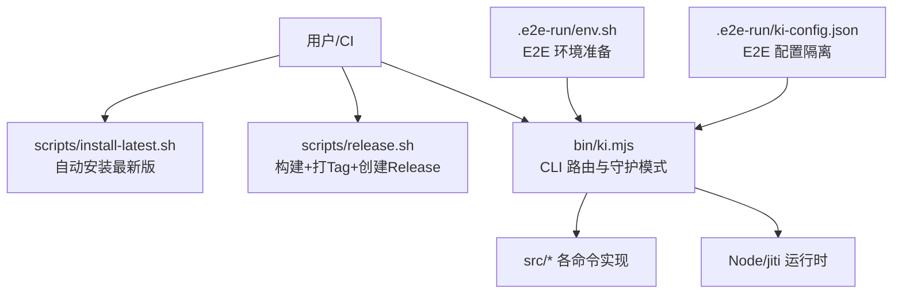
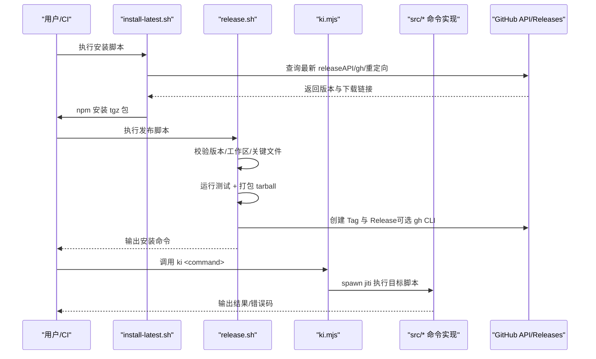
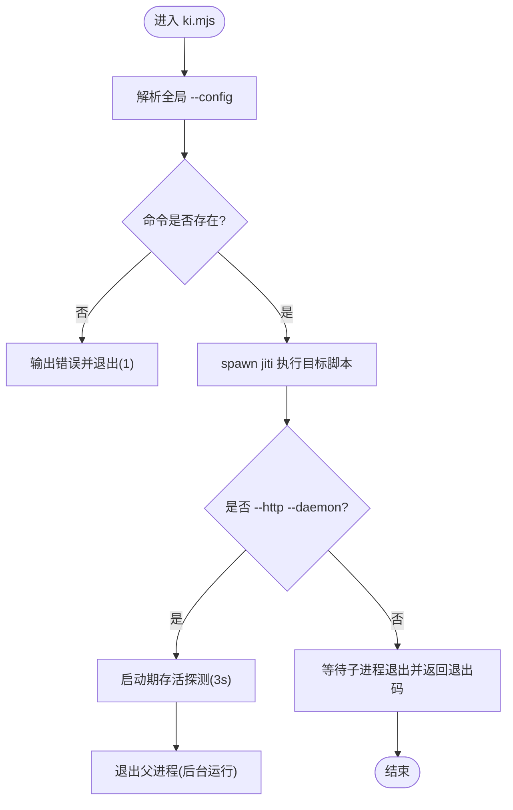
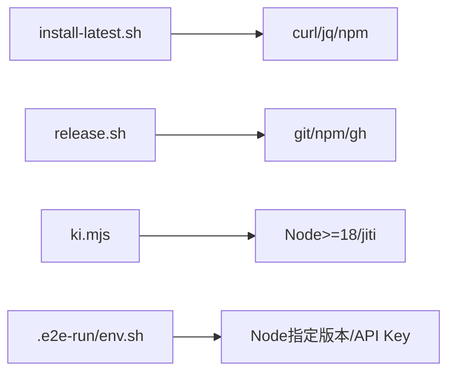

# 自动化脚本

<cite>
**本文引用的文件**
- [scripts/install-latest.sh](file://scripts/install-latest.sh)
- [scripts/release.sh](file://scripts/release.sh)
- [bin/ki.mjs](file://bin/ki.mjs)
- [package.json](file://package.json)
- [docs/cli.md](file://docs/cli.md)
- [docs/backup-restore.md](file://docs/backup-restore.md)
- [docs/error-handling.md](file://docs/error-handling.md)
- [.e2e-run/env.sh](file://.e2e-run/env.sh)
- [.e2e-run/ki-config.json](file://.e2e-run/ki-config.json)
</cite>

## 目录
1. [简介](#简介)
2. [项目结构](#项目结构)
3. [核心组件](#核心组件)
4. [架构总览](#架构总览)
5. [详细组件分析](#详细组件分析)
6. [依赖关系分析](#依赖关系分析)
7. [性能与可观测性](#性能与可观测性)
8. [故障排查指南](#故障排查指南)
9. [结论](#结论)
10. [附录：CI/CD 集成与自定义任务](#附录cicd-集成与自定义任务)

## 简介
本指南面向运维与开发者，系统化说明本项目提供的自动化脚本能力与用法，覆盖安装、发布、测试、备份恢复、索引重建、数据同步、E2E 执行环境、CI/CD 集成以及 CLI 扩展方法。文档以仓库内现有脚本和命令为依据，提供可直接落地的操作建议与最佳实践。

## 项目结构
- 安装与发布脚本位于 scripts 目录，分别用于自动安装最新版本与构建并发布 npm 包到 GitHub Releases。
- CLI 入口为 bin/ki.mjs，负责路由所有子命令（如 scan-kb、manage-index、search、backup、restore 等）并转发给对应实现脚本。
- package.json 定义了 npm 脚本、二进制入口、打包文件范围与 Node 版本要求。
- E2E 运行环境配置在 .e2e-run 下，包含环境变量注入与隔离的配置文件。
- 文档集中在 docs 目录，涵盖 CLI 参考、备份恢复、错误处理与工作流。

图表来源
- [scripts/install-latest.sh:1-205](file://scripts/install-latest.sh#L1-L205)
- [scripts/release.sh:1-142](file://scripts/release.sh#L1-L142)
- [bin/ki.mjs:1-223](file://bin/ki.mjs#L1-L223)
- [.e2e-run/env.sh:1-7](file://.e2e-run/env.sh#L1-L7)
- [.e2e-run/ki-config.json:1-17](file://.e2e-run/ki-config.json#L1-L17)

章节来源
- [scripts/install-latest.sh:1-205](file://scripts/install-latest.sh#L1-L205)
- [scripts/release.sh:1-142](file://scripts/release.sh#L1-L142)
- [bin/ki.mjs:1-223](file://bin/ki.mjs#L1-L223)
- [package.json:1-68](file://package.json#L1-L68)
- [.e2e-run/env.sh:1-7](file://.e2e-run/env.sh#L1-L7)
- [.e2e-run/ki-config.json:1-17](file://.e2e-run/ki-config.json#L1-L17)

## 核心组件
- 安装脚本 install-latest.sh：自动检测并安装 kisearch 最新版本，支持多种获取 release 的方式与本地安装模式。
- 发布脚本 release.sh：校验版本与代码状态、运行测试、打包 tarball、创建 Git Tag 与 GitHub Release。
- CLI 入口 ki.mjs：统一入口，解析全局参数（如 --config），分发到具体命令；支持守护进程模式（仅 HTTP 模式）。
- 测试与 E2E：通过 package.json 的 test 系列脚本与 .e2e-run 环境进行隔离测试与端到端验证。
- 备份与恢复：内置 backup/restore 命令，配合配置中的 backupDir 管理快照。

章节来源
- [scripts/install-latest.sh:1-205](file://scripts/install-latest.sh#L1-L205)
- [scripts/release.sh:1-142](file://scripts/release.sh#L1-L142)
- [bin/ki.mjs:1-223](file://bin/ki.mjs#L1-L223)
- [package.json:1-68](file://package.json#L1-L68)
- [docs/backup-restore.md:1-227](file://docs/backup-restore.md#L1-L227)

## 架构总览
下图展示了从用户或 CI 触发安装、发布与日常运维命令的整体流程，以及 CLI 如何路由到具体实现。

图表来源
- [scripts/install-latest.sh:42-125](file://scripts/install-latest.sh#L42-L125)
- [scripts/release.sh:18-117](file://scripts/release.sh#L18-L117)
- [bin/ki.mjs:28-49](file://bin/ki.mjs#L28-L49)
- [bin/ki.mjs:148-223](file://bin/ki.mjs#L148-L223)

## 详细组件分析

### 安装脚本：install-latest.sh
- 功能要点
  - 检查依赖（curl、jq），提供降级方案。
  - 三种方式获取最新版本：GitHub API、gh CLI、页面重定向。
  - 比较当前已安装版本，避免重复安装。
  - 支持本地模式安装（--local）与标准全局安装。
  - 彩色日志输出，错误快速失败。
- 使用方式
  - 直接运行以自动安装最新版本。
  - 使用 --help 查看帮助。
  - 使用 --local 走本地安装模式。
- 注意事项
  - 网络受限或速率限制时会自动切换备用方法。
  - 若 jq 未安装，将回退到 grep 解析 JSON。

章节来源
- [scripts/install-latest.sh:29-159](file://scripts/install-latest.sh#L29-L159)
- [scripts/install-latest.sh:161-205](file://scripts/install-latest.sh#L161-L205)

### 发布脚本：release.sh
- 功能要点
  - 校验版本号与 package.json 一致。
  - 检查工作区干净状态与关键文件存在性。
  - 运行测试套件，失败即拒绝发布。
  - 生成 tarball 并列出内容统计。
  - 创建/推送 Git Tag，并通过 gh CLI 创建 GitHub Release（含预发布支持）。
  - 未认证 gh 时给出手动步骤提示。
- 使用方式
  - 指定版本号：./scripts/release.sh <version>
  - 可选预发布：./scripts/release.sh <version> true
- 注意事项
  - 需要已登录 gh CLI 才能自动创建 Release。
  - 发布前务必确保测试通过且工作区干净。

章节来源
- [scripts/release.sh:1-142](file://scripts/release.sh#L1-L142)

### CLI 入口：ki.mjs
- 功能要点
  - 统一入口，解析全局 --config 参数，支持任意位置传入。
  - 维护命令映射表，将子命令分发到 src 下的 TypeScript 实现。
  - 支持守护进程模式（仅 mcp --http 时可用），后台启动并做存活探测。
  - 信号透传：SIGINT/SIGTERM 转发给子进程，保证中断标记机制生效。
  - 提供版本与帮助信息。
- 使用方式
  - 通用：ki <command> [options]
  - 指定配置：ki --config /path/to/config.yaml <command>
  - 守护模式：ki mcp --http --daemon
- 扩展新命令
  - 在 COMMANDS 映射中添加新命令键值对，指向 src 下的实现脚本。
  - 在帮助文本中补充描述与示例。
  - 如需全局参数，可在入口层解析后注入环境变量传递给子进程。

图表来源
- [bin/ki.mjs:54-63](file://bin/ki.mjs#L54-L63)
- [bin/ki.mjs:135-146](file://bin/ki.mjs#L135-L146)
- [bin/ki.mjs:148-223](file://bin/ki.mjs#L148-L223)

章节来源
- [bin/ki.mjs:1-223](file://bin/ki.mjs#L1-L223)

### 测试与 E2E 环境
- 单元测试与集成测试
  - 通过 package.json 的 test 系列脚本执行，例如 test:all、test:e2e:*。
  - 使用 npx jiti 直接运行 TypeScript 测试文件。
- E2E 环境
  - .e2e-run/env.sh 设置 Node 版本、API Key 与配置文件路径。
  - .e2e-run/ki-config.json 定义隔离的数据目录、向量目录与嵌入模型配置。
- 执行建议
  - 在 CI 或本地执行 E2E 前，先 source env.sh 初始化环境。
  - 使用 --config 指向隔离配置文件，避免污染生产数据。

章节来源
- [package.json:9-32](file://package.json#L9-L32)
- [.e2e-run/env.sh:1-7](file://.e2e-run/env.sh#L1-L7)
- [.e2e-run/ki-config.json:1-17](file://.e2e-run/ki-config.json#L1-L17)

### 备份与恢复
- 内置命令
  - ki backup <scope>：创建 scope 快照。
  - ki restore <scope> --from-snapshot [--timestamp ...] --yes：从快照还原。
- 存储位置
  - 快照默认存放于 {backupDir}/{scope}/snapshots/snapshot.{timestamp}.tar.gz。
- 手动备份策略
  - 直接复制 kb/ 目录或使用 rsync/tar 进行完整备份。
- 恢复场景
  - group-index.json/relations-cache.json 损坏、整个 scope 丢失、KB 原文丢失等。

章节来源
- [docs/backup-restore.md:1-227](file://docs/backup-restore.md#L1-L227)

### 索引重建与数据同步
- 索引重建
  - 可通过重新导入知识库触发重建：ki scan-kb import --source <wiki-dir> --group <group>。
  - 删除损坏 scope 后重新初始化，再执行导入。
- 数据同步
  - 使用 sync-relation 写入 Relation 与本地 KB，可选择非向量化模式（--no-vector）仅写 KB 层。
  - Wiki 写回：根据 group-index.json 的 source 块或 config.yaml 的 wikiSync.sourceDir 自动写回 Markdown。

章节来源
- [docs/cli.md:758-847](file://docs/cli.md#L758-L847)
- [docs/backup-restore.md:165-179](file://docs/backup-restore.md#L165-L179)

## 依赖关系分析
- 安装脚本依赖 curl、jq（可选）、npm。
- 发布脚本依赖 git、npm、gh CLI（可选）。
- CLI 依赖 Node.js >= 18、jiti（用于直接执行 TypeScript）。
- E2E 依赖 Node 指定版本与外部 embedding API Key。

图表来源
- [scripts/install-latest.sh:29-40](file://scripts/install-latest.sh#L29-L40)
- [scripts/release.sh:18-48](file://scripts/release.sh#L18-L48)
- [bin/ki.mjs:161-168](file://bin/ki.mjs#L161-L168)
- [.e2e-run/env.sh:1-7](file://.e2e-run/env.sh#L1-L7)

章节来源
- [scripts/install-latest.sh:29-40](file://scripts/install-latest.sh#L29-L40)
- [scripts/release.sh:18-48](file://scripts/release.sh#L18-L48)
- [bin/ki.mjs:161-168](file://bin/ki.mjs#L161-L168)
- [.e2e-run/env.sh:1-7](file://.e2e-run/env.sh#L1-L7)

## 性能与可观测性
- 批量写入优化：sync-relation 批量模式一次 embedding + 一次批量写入，减少多次调用开销。
- 守护模式：mcp --http --daemon 后台常驻，启动期存活探测避免假成功。
- 日志与诊断：doctor 命令可用于配置诊断（apiKey/连通性/维度/目录）。

章节来源
- [docs/cli.md:829-847](file://docs/cli.md#L829-L847)
- [bin/ki.mjs:154-197](file://bin/ki.mjs#L154-L197)

## 故障排查指南
- 常见错误分类
  - 参数校验错误：非法 scope、缺少必要参数。
  - 数据文件缺失或损坏：relations-cache.json/group-index.json 损坏、KB 文件不存在。
  - 增量导入相关：增量删除失败记录 warning 继续执行；缓存未找到 sourcePath 记录 warning。
  - 展示参数问题：--mode 无效值会报错并提示有效值。
- 推荐排障顺序
  - 参数补齐 → 路径确认 → scope 注册 → 索引生成 → 下一步。
- 恢复建议
  - 从快照恢复或重新初始化 scope，再执行导入。

章节来源
- [docs/error-handling.md:1-153](file://docs/error-handling.md#L1-L153)
- [docs/backup-restore.md:183-227](file://docs/backup-restore.md#L183-L227)

## 结论
本项目提供了完善的自动化脚本与 CLI 工具链，覆盖安装、发布、测试、备份恢复、索引重建与数据同步等运维场景。通过标准化的脚本与清晰的错误处理规范，结合 E2E 隔离环境与 CI/CD 集成，可有效提升交付质量与运维效率。

## 附录：CI/CD 集成与自定义任务

### CI/CD 集成建议
- 安装阶段
  - 在 CI 中使用 install-latest.sh 自动安装最新版本，便于快速验证。
- 发布阶段
  - 在受保护分支合并后触发 release.sh，自动构建、打 Tag 与创建 Release。
  - 若未配置 gh CLI，按提示手动创建 Release。
- 测试阶段
  - 使用 package.json 的 test 系列脚本执行单元与集成测试。
  - E2E 测试前 source .e2e-run/env.sh 初始化环境，并使用 --config 指向隔离配置。

### 自定义自动化任务
- 定时备份
  - 使用 cron 或 CI 定时任务执行 ki backup <scope>，将快照落盘至配置的 backupDir。
- 数据同步
  - 定期执行 ki sync-relation 将新增或变更的关系写入 KB，必要时使用 --no-vector 跳过向量化。
- 索引重建
  - 当索引损坏或需要全量重建时，删除 scope 目录后重新初始化，再执行 ki scan-kb import 导入源 Wiki。
- 扩展 CLI 命令
  - 在 bin/ki.mjs 的 COMMANDS 映射中添加新命令键值对，指向 src 下的实现脚本。
  - 在帮助文本中补充描述与示例，并在入口层解析新的全局参数（如有）。

章节来源
- [scripts/install-latest.sh:161-205](file://scripts/install-latest.sh#L161-L205)
- [scripts/release.sh:18-142](file://scripts/release.sh#L18-L142)
- [package.json:9-32](file://package.json#L9-L32)
- [bin/ki.mjs:28-49](file://bin/ki.mjs#L28-L49)
- [bin/ki.mjs:73-133](file://bin/ki.mjs#L73-L133)
- [docs/backup-restore.md:1-35](file://docs/backup-restore.md#L1-L35)