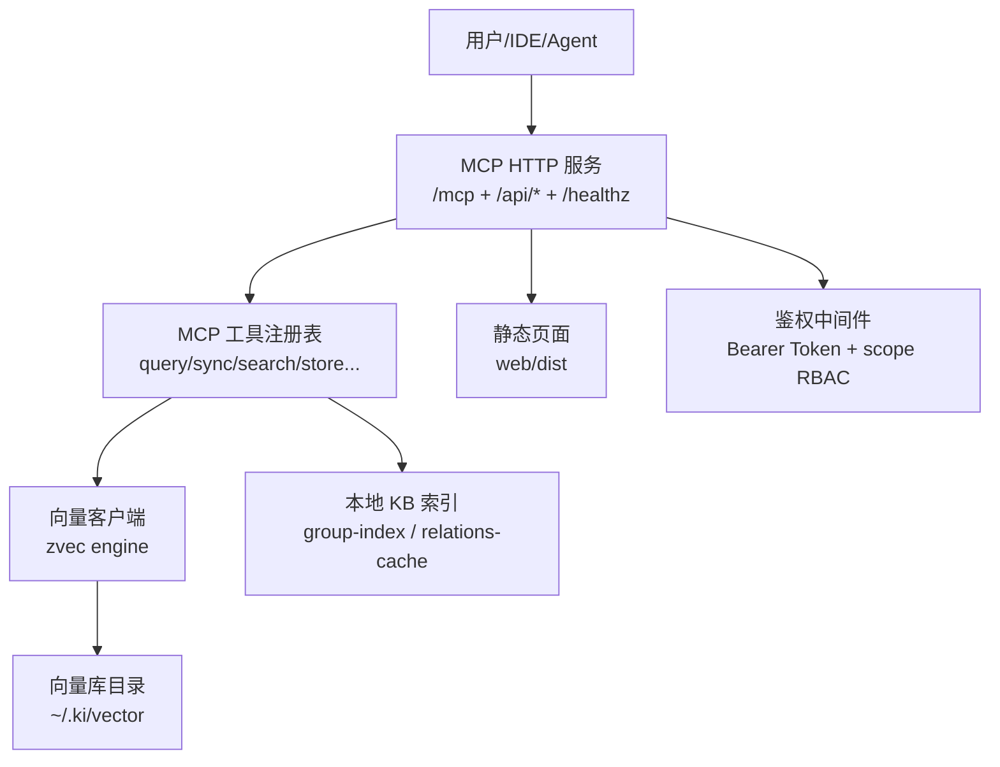
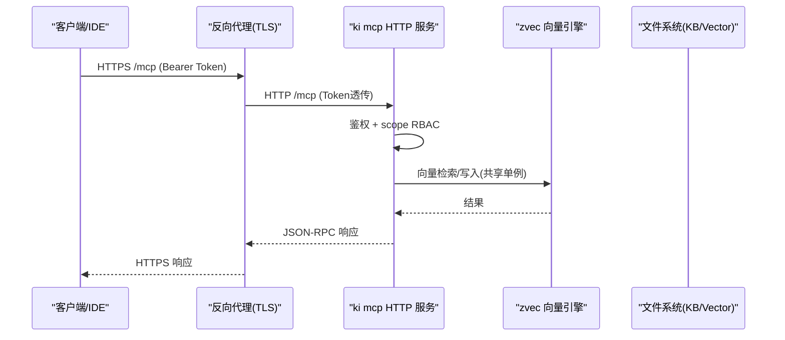
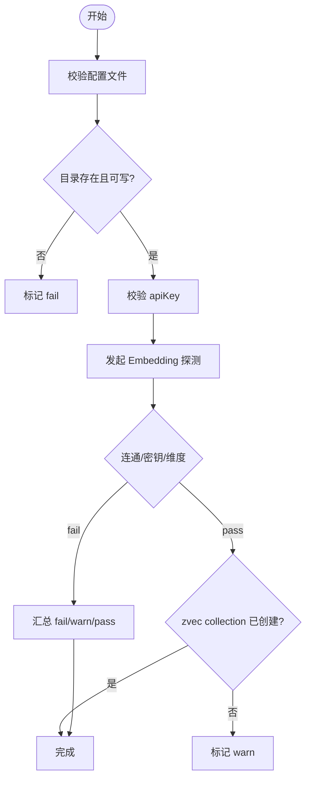
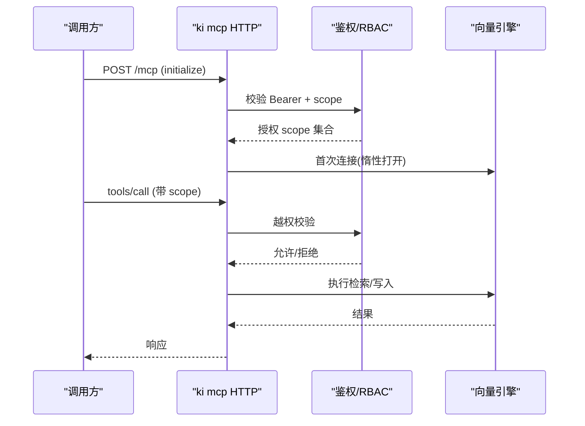
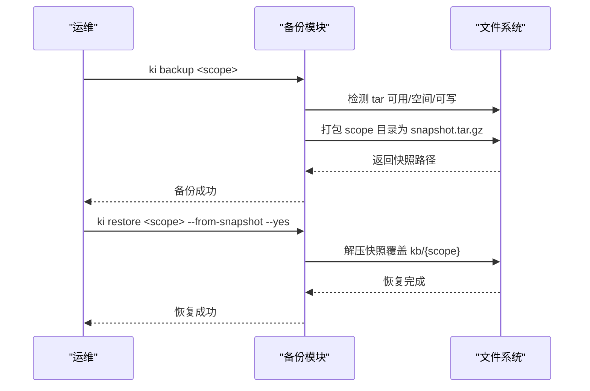
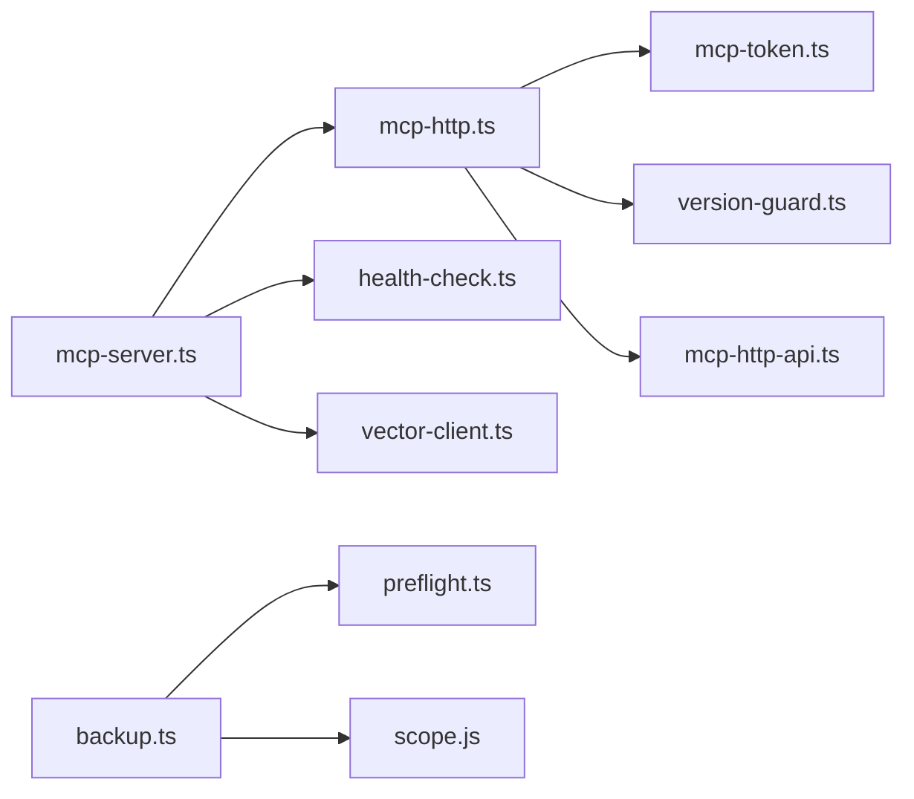

# 部署与运维

<cite>
**本文引用的文件**
- [README.md](file://README.md)
- [配置指南](file://docs/configuration.md)
- [备份与恢复](file://docs/backup-restore.md)
- [MCP HTTP 共享单例模式](file://docs/mcp-http.md)
- [异常处理与恢复](file://docs/error-handling.md)
- [安装脚本 install-latest.sh](file://scripts/install-latest.sh)
- [配置管理命令 config.ts](file://src/config.ts)
- [健康检查 health-check.ts](file://src/lib/health-check.ts)
- [MCP 服务器入口 mcp-server.ts](file://src/mcp-server.ts)
- [MCP HTTP 传输层 mcp-http.ts](file://src/lib/mcp-http.ts)
- [备份模块 backup.ts](file://src/lib/backup.ts)
- [诊断命令 doctor.ts](file://src/doctor.ts)
</cite>

## 目录
1. [简介](#简介)
2. [项目结构](#项目结构)
3. [核心组件](#核心组件)
4. [架构总览](#架构总览)
5. [详细组件分析](#详细组件分析)
6. [依赖关系分析](#依赖关系分析)
7. [性能与资源规划](#性能与资源规划)
8. [故障排查指南](#故障排查指南)
9. [结论](#结论)
10. [附录：常用运维命令速查](#附录常用运维命令速查)

## 简介
本指南面向生产环境的部署与运维，覆盖以下主题：
- 生产环境部署方案与配置优化
- 监控指标收集与健康检查
- 日志管理与可观测性
- 备份恢复与灾难恢复计划
- 故障排查方法与工具使用
- 性能调优与资源规划建议
- 自动化部署脚本与运维工具使用方法
- 健康检查与自愈机制配置

kisearch 提供 CLI、MCP（stdio/HTTP）与内置 Web 前端三种交互方式；向量引擎 zvec 作为底层检索能力。生产环境推荐采用 MCP HTTP 共享单例模式，配合反向代理与鉴权 Token 实现多 IDE/Agent 安全接入。

## 项目结构
- 服务入口与协议层
  - MCP 服务器入口：负责参数解析、启动守卫、预检、HTTP/stdio 双模式、会话管理、鉴权与 RBAC
  - MCP HTTP 传输层：实现 Streamable HTTP、会话池、空闲回收、静态页面与 /api/* 扩展接口
- 配置与诊断
  - 配置加载与模板生成：config init、默认路径、环境变量覆盖
  - 健康检查：目录权限、Embedding 连通性/密钥/维度、zvec collection 状态
  - 诊断命令：ki doctor 输出结构化报告
- 数据与备份
  - 备份模块：scope 快照 tar.gz、自动备份、列表查询
  - 恢复流程：从快照还原、从模板初始化、增量导入幂等追加
- 文档与脚本
  - 安装脚本：一键获取最新版本并全局安装
  - 文档：配置、备份恢复、MCP HTTP、错误处理等

图表来源
- [MCP 服务器入口 mcp-server.ts:49-71](file://src/mcp-server.ts#L49-L71)
- [MCP HTTP 传输层 mcp-http.ts:344-452](file://src/lib/mcp-http.ts#L344-L452)
- [配置指南:27-37](file://docs/configuration.md#L27-L37)

章节来源
- [README.md:35-54](file://README.md#L35-L54)
- [MCP HTTP 共享单例模式:3-10](file://docs/mcp-http.md#L3-L10)

## 核心组件
- MCP 服务器入口
  - 职责：参数解析、启动守卫（冲突检测）、健康预检、HTTP/stdio 分发、版本守护、优雅退出
  - 关键行为：非回环绑定强制鉴权；stdio 与 HTTP 互斥保护；空闲释放锁避免争抢
- MCP HTTP 传输层
  - 职责：Streamable HTTP 传输、会话生命周期、空闲回收、静态页面、/api/* 扩展路由、/healthz 探活
  - 关键行为：最大会话数限制、DNS rebinding 保护、鉴权失败计数上报
- 健康检查
  - 职责：配置文件、目录可写、apiKey、Embedding 连通性/密钥/维度、zvec collection 存在性
  - 关键行为：单次最短请求三合一验证；超时重试；warn/fail/pass 分级
- 备份模块
  - 职责：scope 快照打包、自动备份、列表查询
  - 关键行为：tar 可用性检测、磁盘空间预估、防覆盖命名、失败不阻断主流程
- 配置管理
  - 职责：生成 YAML 模板、默认路径计算、目录创建
  - 关键行为：$HOME 相对化、KI_DATA_DIR 覆盖、幂等 init

章节来源
- [MCP 服务器入口 mcp-server.ts:492-734](file://src/mcp-server.ts#L492-L734)
- [MCP HTTP 传输层 mcp-http.ts:344-452](file://src/lib/mcp-http.ts#L344-L452)
- [健康检查 health-check.ts:148-213](file://src/lib/health-check.ts#L148-L213)
- [备份模块 backup.ts:87-178](file://src/lib/backup.ts#L87-L178)
- [配置管理命令 config.ts:128-177](file://src/config.ts#L128-L177)

## 架构总览
生产部署推荐拓扑：
- 反向代理（Nginx/Caddy）终结 TLS，转发至 ki mcp --http
- 前置防火墙/安全组收敛来源 IP
- 通过 Token 鉴权与 scope RBAC 控制访问范围
- 使用 /healthz 做存活探针，/api/health 做健康报告

图表来源
- [MCP HTTP 共享单例模式:132-146](file://docs/mcp-http.md#L132-L146)
- [MCP HTTP 传输层 mcp-http.ts:454-526](file://src/lib/mcp-http.ts#L454-L526)
- [MCP 服务器入口 mcp-server.ts:660-698](file://src/mcp-server.ts#L660-L698)

## 详细组件分析

### 健康检查与启动预检
- 触发点：ki doctor、ki mcp 启动前
- 检查项：配置文件、dataDir/backupDir/vectorDir 可写、apiKey、Embedding 连通性/密钥/维度、zvec collection、scopes.default
- 策略：单次最短请求验证 URL/密钥/维度；超时 8s、重试 1 次；fail 拒绝启动，warn 继续

图表来源
- [健康检查 health-check.ts:148-213](file://src/lib/health-check.ts#L148-L213)
- [诊断命令 doctor.ts:18-49](file://src/doctor.ts#L18-L49)

章节来源
- [健康检查 health-check.ts:1-234](file://src/lib/health-check.ts#L1-L234)
- [诊断命令 doctor.ts:1-55](file://src/doctor.ts#L1-L55)

### MCP HTTP 共享单例与鉴权
- 单例守护：先探活 /healthz，命中则复用退出；未命中再监听并写 lock
- 鉴权策略：回环绑定免鉴权；非回环绑定强制 Bearer Token；支持临时 Token 或多 Token 存储
- RBAC：对 tools/call 的 arguments.scope 进行越权拦截；枚举工具按授权集合过滤输出
- 会话模型：每 initialize 新建 transport+server，共享 vector-client 单例；最大会话数、空闲回收

图表来源
- [MCP HTTP 传输层 mcp-http.ts:454-577](file://src/lib/mcp-http.ts#L454-L577)
- [MCP 服务器入口 mcp-server.ts:595-698](file://src/mcp-server.ts#L595-L698)

章节来源
- [MCP HTTP 共享单例模式:132-146](file://docs/mcp-http.md#L132-L146)
- [MCP HTTP 传输层 mcp-http.ts:344-607](file://src/lib/mcp-http.ts#L344-L607)
- [MCP 服务器入口 mcp-server.ts:492-734](file://src/mcp-server.ts#L492-L734)

### 备份与恢复
- 备份策略：scope 快照 tar.gz，落盘到 {backupDir}/{scope}/snapshots；import 成功后自动备份
- 恢复流程：列出快照 → 选择目标 → 执行还原；无快照时从模板初始化后重新导入
- 故障场景：group-index.json/relations-cache.json 损坏或 KB 原文丢失，均支持快照恢复或重建

图表来源
- [备份模块 backup.ts:87-178](file://src/lib/backup.ts#L87-L178)
- [备份与恢复:72-180](file://docs/backup-restore.md#L72-L180)

章节来源
- [备份与恢复:1-239](file://docs/backup-restore.md#L1-L239)
- [备份模块 backup.ts:1-178](file://src/lib/backup.ts#L1-L178)

### 配置与初始化
- 配置文件位置优先级：命令行 > 环境变量 > ~/.ki/config.yaml/yml/json > 内置默认
- 模板生成：ki config init 生成 YAML 模板并创建 dataDir/backupDir/vectorDir
- 关键项：dataDir、backupDir、vectorDir、embedding.provider/model/dimension/apiKey、scopeMode、scopes、mcp.http

章节来源
- [配置指南:7-17](file://docs/configuration.md#L7-L17)
- [配置指南:27-37](file://docs/configuration.md#L27-L37)
- [配置指南:43-88](file://docs/configuration.md#L43-L88)
- [配置指南:164-177](file://docs/configuration.md#L164-L177)
- [配置管理命令 config.ts:128-177](file://src/config.ts#L128-L177)

### 自动化部署与脚本
- 一键安装：scripts/install-latest.sh 自动查询最新 release 并全局安装
- 启动与守护：ki mcp --http --daemon 后台常驻；ki mcp restart 重启；ki mcp stop 关闭全部实例
- 前端集成：构建 web/dist 后以 --web 提供可视化页面

章节来源
- [安装脚本 install-latest.sh:101-159](file://scripts/install-latest.sh#L101-L159)
- [MCP HTTP 共享单例模式:191-223](file://docs/mcp-http.md#L191-L223)
- [README.md:105-166](file://README.md#L105-L166)

## 依赖关系分析
- 组件耦合
  - mcp-server.ts 依赖 mcp-http.ts（HTTP 传输）、health-check.ts（预检）、vector-client.ts（向量锁）
  - mcp-http.ts 依赖 mcp-token.ts（RBAC）、version-guard.ts（版本守护）、mcp-http-api.ts（/api/*）
  - backup.ts 依赖 preflight.ts（空间/可写检查）、scope.js（kbDir）
- 外部依赖
  - Node.js ≥ 18、tar 命令（Linux/macOS 内置；Windows 需 Git for Windows）
  - Embedding 提供商（siliconflow/openai-compatible），需 baseURL/model/dimension/apiKey

图表来源
- [MCP 服务器入口 mcp-server.ts:1-48](file://src/mcp-server.ts#L1-L48)
- [MCP HTTP 传输层 mcp-http.ts:17-34](file://src/lib/mcp-http.ts#L17-L34)
- [备份模块 backup.ts:13-20](file://src/lib/backup.ts#L13-L20)

章节来源
- [MCP 服务器入口 mcp-server.ts:1-741](file://src/mcp-server.ts#L1-L741)
- [MCP HTTP 传输层 mcp-http.ts:1-810](file://src/lib/mcp-http.ts#L1-L810)
- [备份模块 backup.ts:1-178](file://src/lib/backup.ts#L1-L178)

## 性能与资源规划
- 向量引擎
  - 单进程单锁：HTTP 共享单例避免多进程争抢；空闲释放锁支持错开共享
  - 批量操作：bulk-store/bulk-sync-relation 减少 HTTP 往返与重复 embedding
- 会话与内存
  - 最大会话数默认 256；空闲会话 30 分钟回收；建议根据并发规模调整
- 网络与 I/O
  - Embedding 请求超时 8s、重试 1 次；/healthz 短超时探活
  - 备份前估算目录体积并检查磁盘空间
- 资源建议
  - CPU：向量检索与 embedding 为 CPU 敏感，建议至少 2C 起
  - 内存：取决于向量库大小与并发会话，建议 4G 起
  - 磁盘：KB 与 vectorDir 分离，预留足够空间用于快照与增量导入

章节来源
- [MCP HTTP 共享单例模式:3-10](file://docs/mcp-http.md#L3-L10)
- [MCP HTTP 传输层 mcp-http.ts:46-56](file://src/lib/mcp-http.ts#L46-L56)
- [健康检查 health-check.ts:48-142](file://src/lib/health-check.ts#L48-L142)
- [备份模块 backup.ts:97-117](file://src/lib/backup.ts#L97-L117)

## 故障排查指南
- 启动失败
  - 预检失败：运行 ki doctor 查看 fail/warn/pass；修复缺失目录、apiKey 或维度不匹配
  - 端口占用：ki mcp --status 确认是否已有健康实例；更换端口或停止占用进程
- 鉴权问题
  - 401：核对客户端 Authorization: Bearer 与服务端 ki mcp token list 输出完全一致
  - 403：检查 scope 越权；使用 ki mcp token update 扩大授权
- 数据损坏
  - group-index.json/relations-cache.json 损坏：从快照恢复
  - KB 原文丢失：恢复或重新导入（幂等追加）
- 日志与可观测性
  - 服务端 stderr：鉴权失败、越权拦截、启动预检报告
  - /healthz：快速探活；/api/health：健康报告（含 zvec 探活）

章节来源
- [异常处理与恢复:13-60](file://docs/error-handling.md#L13-L60)
- [MCP HTTP 共享单例模式:224-233](file://docs/mcp-http.md#L224-L233)
- [MCP HTTP 传输层 mcp-http.ts:358-372](file://src/lib/mcp-http.ts#L358-L372)
- [MCP HTTP 传输层 mcp-http.ts:418-429](file://src/lib/mcp-http.ts#L418-L429)

## 结论
- 生产环境优先采用 MCP HTTP 共享单例 + 反向代理 + Token 鉴权 + scope RBAC 的安全架构
- 通过 ki doctor 与 /healthz 建立健康基线，结合备份快照实现可靠的数据保护
- 利用批量写入与空闲锁释放提升吞吐与稳定性；按并发规模规划 CPU/内存/磁盘
- 借助标准化脚本与命令实现一键安装、后台常驻、重启与关停，降低运维复杂度

## 附录：常用运维命令速查
- 安装与初始化
  - 一键安装：curl ... | bash（参考安装脚本）
  - 初始化配置：ki config init
  - 健康诊断：ki doctor
- 服务管理
  - 启动 HTTP：ki mcp --http [--host 0.0.0.0] [--port 7423]
  - 后台常驻：ki mcp --http --daemon
  - 重启：ki mcp restart
  - 关闭：ki mcp stop
  - 状态：ki mcp --status
- 备份恢复
  - 备份：ki backup <scope>
  - 恢复：ki restore <scope> --from-snapshot --yes
- 导入与检索
  - 导入：ki scan-kb import --scope <s> --source <dir> --group <g>
  - 检索：ki search --scope <s> --query "<q>"

章节来源
- [安装脚本 install-latest.sh:101-159](file://scripts/install-latest.sh#L101-L159)
- [配置管理命令 config.ts:128-177](file://src/config.ts#L128-L177)
- [诊断命令 doctor.ts:18-49](file://src/doctor.ts#L18-L49)
- [MCP HTTP 共享单例模式:191-223](file://docs/mcp-http.md#L191-L223)
- [备份与恢复:72-180](file://docs/backup-restore.md#L72-L180)
- [README.md:143-166](file://README.md#L143-L166)