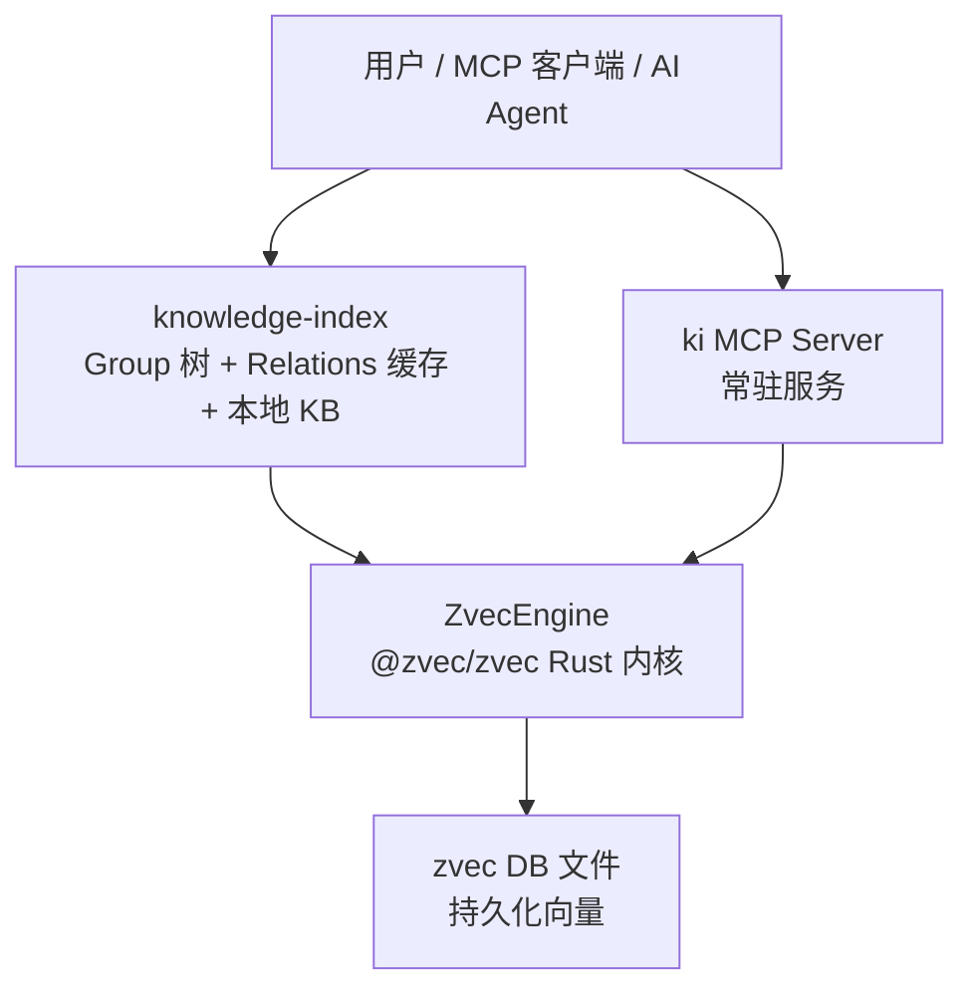
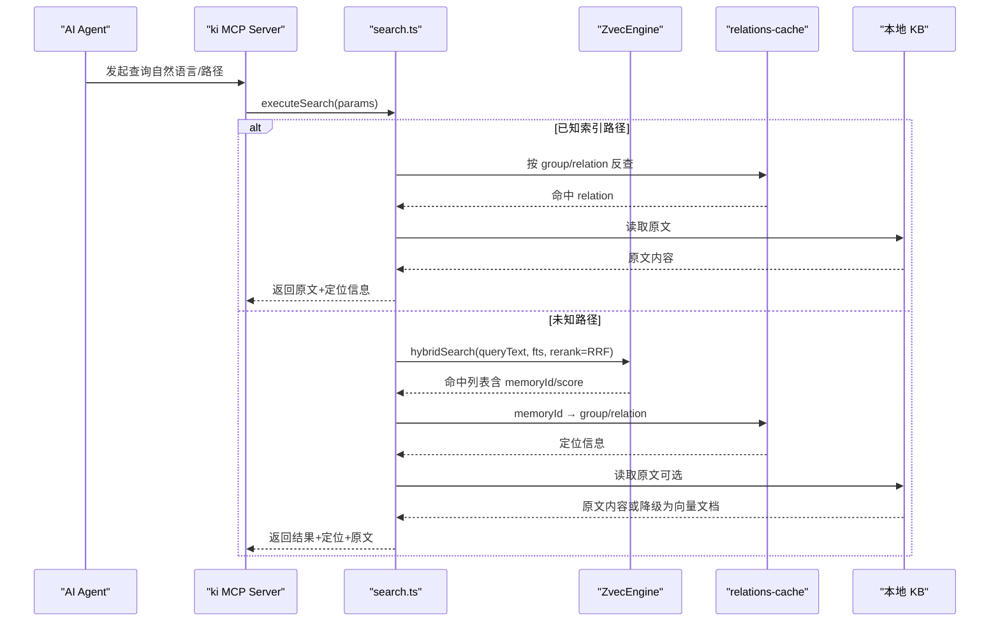
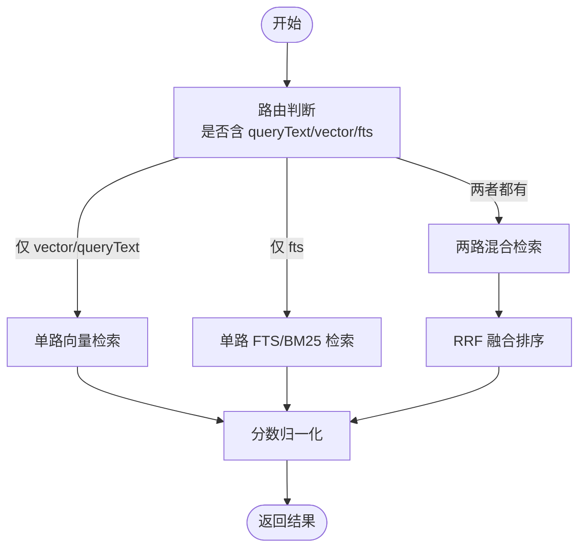
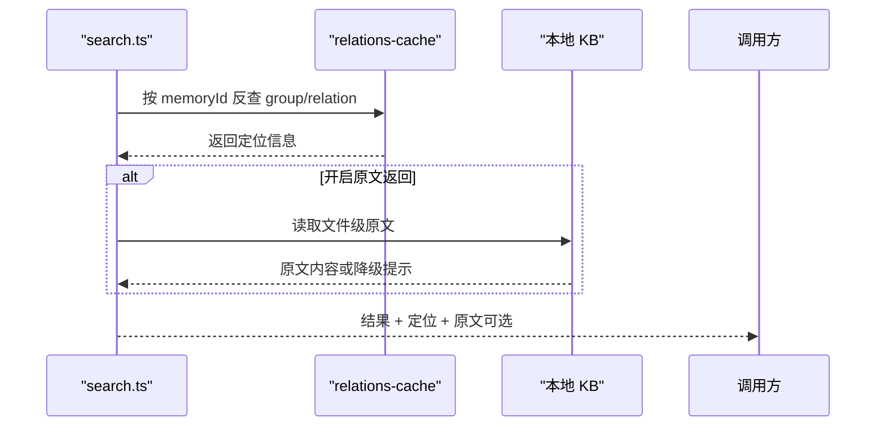
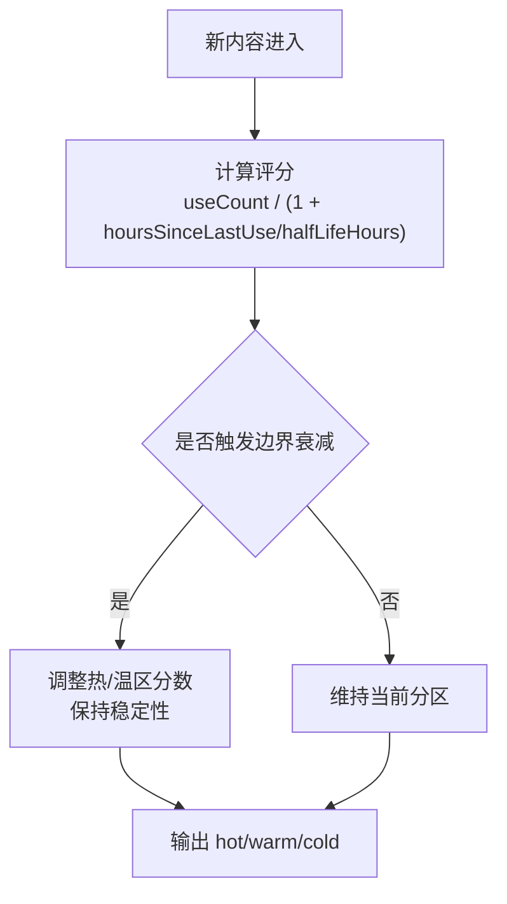
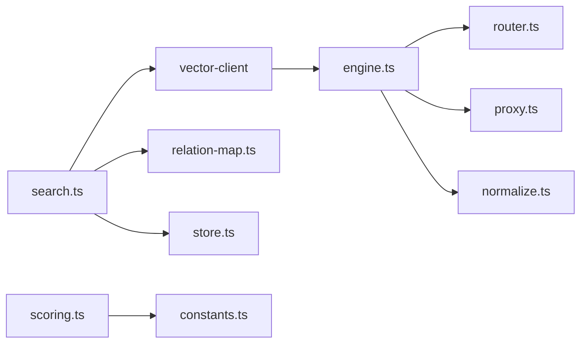

# 与常规RAG的差异

<cite>
**本文引用的文件**
- [README.md](file://README.md)
- [architecture.md](file://docs/architecture.md)
- [search.ts](file://src/search.ts)
- [engine.ts](file://src/zvec-engine/engine.ts)
- [router.ts](file://src/zvec-engine/search/router.ts)
- [types.ts](file://src/zvec-engine/types.ts)
- [relation-map.ts](file://src/lib/relation-map.ts)
- [scoring.ts](file://src/lib/scoring.ts)
- [constants.ts](file://src/lib/constants.ts)
- [vector-engine-mem.md](file://docs/vector-engine-mem.md)
</cite>

## 目录
1. [引言](#引言)
2. [项目结构](#项目结构)
3. [核心组件](#核心组件)
4. [架构总览](#架构总览)
5. [详细组件分析](#详细组件分析)
6. [依赖关系分析](#依赖关系分析)
7. [性能考量](#性能考量)
8. [故障排查指南](#故障排查指南)
9. [结论](#结论)
10. [附录](#附录)

## 引言
本文件面向“选择 kisearch 而非传统 RAG”的决策者与技术读者，系统性对比常规 RAG 与 kisearch 在知识组织、检索结果、查询路径、精准度等方面的差异；深入解释 kisearch 的结构化索引、原文交付、双路径查询、混合检索（语义向量 + BM25 全文 + RRF 融合排序）以及状态管理与跨会话记忆等能力；并提供实际场景下的性能对比与效果评估参考，帮助理解 kisearch 的价值与必要性。

## 项目结构
kisearch 以“结构化知识索引 + 向量语义检索”为核心：上层通过 Group 树与 Relation 缓存组织知识，底层基于 zvec 引擎提供混合检索能力，并通过本地 KB 实现原文交付。整体分层清晰，职责解耦，便于扩展与维护。

图表来源
- [architecture.md:11-26](file://docs/architecture.md#L11-L26)

章节来源
- [architecture.md:1-50](file://docs/architecture.md#L1-L50)
- [README.md:35-47](file://README.md#L35-L47)

## 核心组件
- 结构化索引层：Group 树导航、Relation 热缓存、关键词词云，避免无序 chunk 带来的上下文断裂问题。
- 混合检索层：语义向量召回 + BM25 全文召回 + RRF 融合排序，兼顾语义泛化与符号精确匹配。
- 原文交付层：按 memoryId 反查定位到 group/relation，直接返回本地 KB 中的 Markdown 原文，避免黑盒片段。
- 状态管理层：冷热分区、评分衰减、使用计数，热点优先；支持跨会话长期记忆沉淀。
- 安全与隔离：scope 隔离、WAL 原子写入、幂等覆盖更新，保障数据一致性与可恢复性。

章节来源
- [README.md:64-103](file://README.md#L64-L103)
- [scoring.ts:19-36](file://src/lib/scoring.ts#L19-L36)
- [relation-map.ts:1-17](file://src/lib/relation-map.ts#L1-L17)

## 架构总览
kisearch 将“发现层（zvec 向量引擎）”与“交付层（Group/Relation/KB）”解耦：Agent 可通过 MCP 或 CLI 发起查询；若已知索引路径则走“索引直查”，否则走“语义检索兜底”。检索命中后通过 memoryId 反查 relations-cache，定位到 group/relation，再读取本地 KB 原文交付。

图表来源
- [search.ts:70-199](file://src/search.ts#L70-L199)
- [engine.ts:298-312](file://src/zvec-engine/engine.ts#L298-L312)
- [router.ts:43-127](file://src/zvec-engine/search/router.ts#L43-L127)
- [relation-map.ts:48-78](file://src/lib/relation-map.ts#L48-L78)

章节来源
- [search.ts:70-199](file://src/search.ts#L70-L199)
- [engine.ts:298-312](file://src/zvec-engine/engine.ts#L298-L312)
- [router.ts:43-127](file://src/zvec-engine/search/router.ts#L43-L127)
- [relation-map.ts:48-78](file://src/lib/relation-map.ts#L48-L78)

## 详细组件分析

### 与常规 RAG 的差异对比
| 维度 | 常规 RAG | kisearch |
|------|---------|----------|
| 知识组织 | 无序 chunk，无层级关系 | Group 树 + Relation 结构化索引，知识有归属有层级 |
| 检索结果 | chunk 片段（可能断裂、缺上下文） | 原文全文（命中时可直接引用原文） |
| 查询路径 | 仅语义检索一条路（模糊召回） | 双路径：已知索引时直接精准查询原文；未知时语义检索兜底 |
| 检索精准度 | 语义模糊匹配，存在噪声 | 索引直查精准命中原文（零误差）；语义检索有 memoryId 反查定位兜底 |
| 原文定位 | 黑盒召回，不知结果来自哪 | 每条结果带 group/relation 定位字段，可定位到原文出处 |
| 符号检索 | 弱（纯语义向量，camelCase 难匹配） | BM25 全文路支持类名/方法名精确召回 |
| 状态管理 | 无状态，每次检索平等 | 冷热治理 + 评分衰减 + 使用计数，热点 Relation 优先 |
| 跨会话 | 一次性检索，无积累 | 长期记忆库，Agent 沉淀的知识持续积累 |
| 写入校验 | 无约束，随意写入 | scope 隔离 + WAL 原子写入 + 幂等覆盖更新 |

章节来源
- [README.md:64-80](file://README.md#L64-L80)

### 混合检索算法实现原理（语义向量 + BM25 全文 + RRF 融合）
- 路由策略：根据请求参数决定单路向量、单路 FTS 或两路混合（hybrid）。当同时具备 queryText 与 fts 时，进入 multiQuery 并启用 RRF 融合。
- 嵌入与向量化：queryText 经 EmbeddingProvider 转为稠密向量；FTS 侧使用 BM25 对文本进行关键词匹配。
- 融合排序：默认采用 RRF（Reciprocal Rank Fusion），rankConstant 默认为 60；也支持 weighted 加权融合。
- 结果归一化：vector 路分数为 1/(1+distance)，fts 路为 BM25 原值，hybrid 路为融合分。

图表来源
- [router.ts:43-127](file://src/zvec-engine/search/router.ts#L43-L127)
- [types.ts:118-151](file://src/zvec-engine/types.ts#L118-L151)
- [engine.ts:454-495](file://src/zvec-engine/engine.ts#L454-L495)

章节来源
- [router.ts:43-127](file://src/zvec-engine/search/router.ts#L43-L127)
- [types.ts:118-151](file://src/zvec-engine/types.ts#L118-L151)
- [engine.ts:454-495](file://src/zvec-engine/engine.ts#L454-L495)

### 结构化索引与原文交付
- 结构化索引：Group 树用于导航，Relation 缓存记录 hot_relations，包含 memoryIds/sourcePath，便于快速定位与热度治理。
- 原文交付：search 结果通过 memoryId 反查 relations-cache，附加 group/relation；开启 includeOriginal 时从本地 KB 读取 Markdown 原文，失败则降级返回向量文档并提示。
- 多标签优先级：默认搜索全部标签时，按 ki-search > ki-relation > ki-path 优先级合并结果，提升内容相关度。

图表来源
- [search.ts:123-199](file://src/search.ts#L123-L199)
- [relation-map.ts:48-78](file://src/lib/relation-map.ts#L48-L78)

章节来源
- [search.ts:123-199](file://src/search.ts#L123-L199)
- [relation-map.ts:48-78](file://src/lib/relation-map.ts#L48-L78)

### 状态管理与跨会话记忆
- 评分与使用记录：calculateScore 基于 useCount 与 lastUsedTime 计算热度；recordUse 防刷（5分钟间隔）与上限控制（MAX_USE_COUNT）。
- 冷热分区：hybridPartition 将新兴热区（最近使用）、历史热门、常温/冷区按比例分配，支持上限截断与边界衰减，保证热点优先且稳定。
- 跨会话记忆：通过长期记忆库沉淀知识，结合 Group/Relation 索引形成闭环，长尾知识逐步沉淀为可导航热点。

图表来源
- [scoring.ts:44-57](file://src/lib/scoring.ts#L44-L57)
- [scoring.ts:90-117](file://src/lib/scoring.ts#L90-L117)
- [scoring.ts:222-274](file://src/lib/scoring.ts#L222-L274)
- [constants.ts:19-50](file://src/lib/constants.ts#L19-L50)

章节来源
- [scoring.ts:44-117](file://src/lib/scoring.ts#L44-L117)
- [scoring.ts:222-274](file://src/lib/scoring.ts#L222-L274)
- [constants.ts:19-50](file://src/lib/constants.ts#L19-L50)

### 双路径查询的优势
- 索引直查：已知 Group/Relation 路径时，直接读取本地 KB 原文，零误差、无向量噪声，适合精确查找。
- 语义检索兜底：未知路径时，通过 hybridSearch 召回候选，再以 memoryId 反查定位，必要时返回原文或降级提示。
- 标签过滤：支持按 ki-search/ki-relation/ki-path 过滤，提升准确率与可控性。

章节来源
- [README.md:64-103](file://README.md#L64-L103)
- [search.ts:94-121](file://src/search.ts#L94-L121)

## 依赖关系分析
- search.ts 依赖 vector-client（封装 ZvecEngine 的搜索接口）、relation-map（memoryId 反查）、store（本地 JSON 读写）。
- engine.ts 作为门面，编排 embedding、router、proxy、normalize，统一暴露 upsert/insert/update/delete/search 等 API。
- router.ts 负责检索路由与参数校验，决定单路/混合检索及融合策略。
- scoring.ts 提供评分、使用记录、冷热分区与边界衰减，支撑状态管理。
- constants.ts 定义默认分区配置、标签集与路径常量，确保行为一致性。

图表来源
- [search.ts:11-18](file://src/search.ts#L11-L18)
- [engine.ts:13-32](file://src/zvec-engine/engine.ts#L13-L32)
- [router.ts:14-21](file://src/zvec-engine/search/router.ts#L14-L21)
- [scoring.ts:11-15](file://src/lib/scoring.ts#L11-L15)
- [constants.ts:55-58](file://src/lib/constants.ts#L55-L58)

章节来源
- [search.ts:11-18](file://src/search.ts#L11-L18)
- [engine.ts:13-32](file://src/zvec-engine/engine.ts#L13-L32)
- [router.ts:14-21](file://src/zvec-engine/search/router.ts#L14-L21)
- [scoring.ts:11-15](file://src/lib/scoring.ts#L11-L15)
- [constants.ts:55-58](file://src/lib/constants.ts#L55-L58)

## 性能考量
- 引擎内嵌与常驻：zvec 引擎进程内常驻，查询首条延迟约 3.6ms，平均约 0.8ms，相比旧 mem CLI 延迟降低约 5000 倍。
- 建库性能：创建+嵌入+插入+优化约 8.3s，显著优于旧方案。
- 召回质量：Recall@1/3/5 分别达 85%/92.5%/95%，较旧方案大幅提升。
- 混合检索优势：BM25 对符号（类名/方法名）精确匹配，语义向量对自然语言泛化召回，RRF 融合平衡两路相关性。

章节来源
- [vector-engine-mem.md:233-245](file://docs/vector-engine-mem.md#L233-L245)

## 故障排查指南
- 向量服务不可用：ensureVectorAvailable 检测失败时返回 degraded 状态，建议检查 embedding 配置与网络连通性。
- 原文不可用：当 local KB 缺失 relation 或读取异常时，search 返回 originalHint 提示，并降级返回向量文档。
- 映射缓存失效：relation-map 基于 mtime/size/TTL 失效，若 relations-cache 被写入或损坏，会重建映射，避免陈旧定位。
- 写入错误聚合：engine.writeDocs 将 embed 失败与 zvec 写入错误合并返回 errors，便于定位具体失败项。

章节来源
- [search.ts:84-92](file://src/search.ts#L84-L92)
- [search.ts:137-155](file://src/search.ts#L137-L155)
- [relation-map.ts:54-78](file://src/lib/relation-map.ts#L54-L78)
- [engine.ts:330-450](file://src/zvec-engine/engine.ts#L330-L450)

## 结论
kisearch 通过“结构化索引 + 混合检索 + 原文交付 + 状态管理”的组合拳，有效解决了常规 RAG 的痛点：无序 chunk 导致上下文断裂、符号检索弱、结果不可溯源、无状态积累等问题。其双路径查询机制既能在已知索引时精准直达原文，也能在未知路径时通过语义检索兜底；混合检索（语义向量 + BM25 + RRF）兼顾泛化与精确；冷热分区与评分衰减保障热点优先与系统稳定性。综合性能与召回指标显示，kisearch 在延迟、召回质量与可解释性上均显著优于传统 RAG，是构建高质量 AI Agent 知识系统的优选方案。

## 附录
- 快速上手：初始化配置、导入外部 Wiki、启动 MCP HTTP 模式与可视化前端。
- 命令参考：scan-kb、manage-index、query-group、get-module-info、sync-relation、delete-relation、search、store、bulk-store、scope、doc、tag、config、doctor、backup、restore、export、mcp。
- 工作流：本地快取 + 远端召回、原文与摘要分层存储、共同形成闭环。

章节来源
- [README.md:105-217](file://README.md#L105-L217)
- [architecture.md:109-169](file://docs/architecture.md#L109-L169)