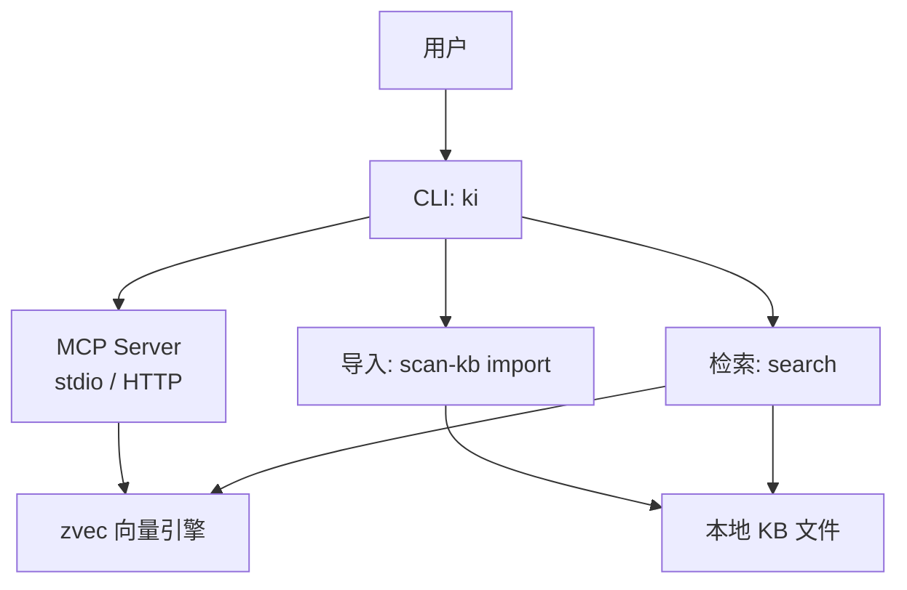
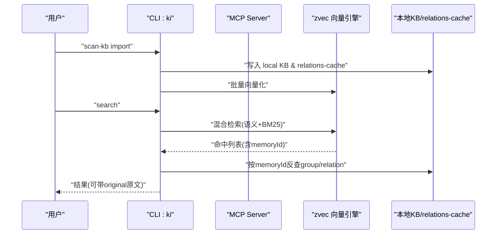
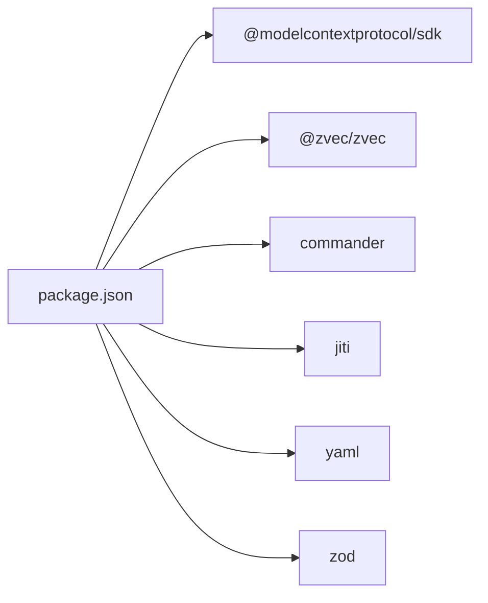

# 快速开始

<cite>
**本文引用的文件**
- [README.md](file://README.md)
- [package.json](file://package.json)
- [bin/ki.mjs](file://bin/ki.mjs)
- [docs/configuration.md](file://docs/configuration.md)
- [docs/mcp-http.md](file://docs/mcp-http.md)
- [docs/cli.md](file://docs/cli.md)
- [test/e2e-guide.md](file://test/e2e-guide.md)
</cite>

## 目录
1. [简介](#简介)
2. [项目结构](#项目结构)
3. [核心组件](#核心组件)
4. [架构总览](#架构总览)
5. [详细组件分析](#详细组件分析)
6. [依赖关系分析](#依赖关系分析)
7. [性能注意事项](#性能注意事项)
8. [故障排查指南](#故障排查指南)
9. [结论](#结论)
10. [附录：端到端验证用例](#附录端到端验证用例)

## 简介
本指南面向首次使用 knowledge-indexer（CLI 命令为 ki）的用户，目标是在最短时间内完成环境搭建、初始化配置、导入外部 Wiki、启动 MCP（支持 stdio 与 HTTP 两种模式），并通过检索验证安装成功。项目基于 Node.js ≥ 18，提供结构化知识索引与向量语义检索能力，并通过 MCP 协议向 AI Agent 暴露工具。

## 项目结构
- CLI 入口：bin/ki.mjs，负责分发子命令到对应脚本
- 配置系统：通过 YAML/JSON 配置文件管理数据目录、向量库、Embedding、scope 映射与 MCP 默认值
- MCP 服务：支持 stdio 与 HTTP 共享单例模式，并提供可视化前端
- 知识库导入：scan-kb import 支持从外部 Markdown Wiki 原文直导并自动切分、向量化
- 检索能力：search 提供混合检索（语义 + BM25 + RRF 融合排序）

图表来源
- [bin/ki.mjs:29-49](file://bin/ki.mjs#L29-L49)
- [docs/mcp-http.md:1-10](file://docs/mcp-http.md#L1-L10)
- [docs/cli.md:467-532](file://docs/cli.md#L467-L532)

章节来源
- [bin/ki.mjs:29-49](file://bin/ki.mjs#L29-L49)
- [docs/mcp-http.md:1-10](file://docs/mcp-http.md#L1-L10)
- [docs/cli.md:467-532](file://docs/cli.md#L467-L532)

## 核心组件
- 安装与环境要求
  - Node.js ≥ 18
  - 通过 npm 安装依赖；如需构建 zvec 引擎需执行构建脚本
- 初始化配置
  - 生成配置文件模板到 ~/.ki/config.yaml
  - 关键项：dataDir、backupDir、vectorDir、embedding（provider/model/dimension/apiKey）、scopeMode、scopes、mcp
- 知识库导入
  - 从外部 Markdown Wiki 原文直导，自动切分、批量向量化、写入 local KB 与 relations-cache
- MCP 集成
  - stdio 模式：每个客户端独立进程
  - HTTP 模式：共享单例，多 IDE 共享同一持锁进程，支持 --web 前端与鉴权 Token
- 检索验证
  - 使用 search 进行语义检索，结果包含 group/relation 定位字段，可开启 --original 获取原文

章节来源
- [README.md:107-166](file://README.md#L107-L166)
- [docs/configuration.md:27-177](file://docs/configuration.md#L27-L177)
- [docs/cli.md:467-532](file://docs/cli.md#L467-L532)

## 架构总览
kisearch 将“发现层”的 zvec 向量引擎与“交付层”的结构化知识索引结合，Agent 可通过 MCP 工具调用实现：
- 索引直查：已知 Group/Relation 路径时直接返回原文
- 语义兜底：未知查询经向量召回后反查原文
- 双路径融合：BM25 全文与语义向量按 RRF 融合排序

图表来源
- [docs/cli.md:467-532](file://docs/cli.md#L467-L532)
- [README.md:35-47](file://README.md#L35-L47)

## 详细组件分析

### 安装与环境准备
- 方式一：一键安装 CLI（推荐）
- 方式二：源码安装
  - 克隆仓库并安装依赖
  - 构建 zvec 引擎（必需，否则 MCP 启动会报找不到模块）
- 版本与运行环境
  - package.json 指定 engines.node >= 18
  - bin/ki.mjs 作为 CLI 入口，分发子命令

章节来源
- [README.md:107-119](file://README.md#L107-L119)
- [package.json:60-62](file://package.json#L60-L62)
- [bin/ki.mjs:29-49](file://bin/ki.mjs#L29-L49)

### 初始化配置
- 生成配置文件模板
  - 使用 ki config init 生成 ~/.ki/config.yaml（或 JSON）
- 关键配置项说明
  - dataDir：KB 源数据目录（各 scope 的数据落在此目录下）
  - backupDir：备份目录
  - vectorDir：zvec 向量库目录（schema 创建后不可 alter/drop，变更需重建）
  - embedding：provider/baseURL/model/dimension/apiKey（优先环境变量引用）
  - scopeMode：default（自动创建）或 strict（白名单注册）
  - scopes：scope → kbDir/wikiSync/clean/import 等映射
  - mcp：HTTP 传输默认 host/port/allowedHosts
- 安全建议
  - apiKey 使用环境变量引用，避免明文写入配置
  - 非回环绑定必须启用 Token 鉴权

章节来源
- [docs/configuration.md:27-177](file://docs/configuration.md#L27-L177)
- [docs/mcp-http.md:132-145](file://docs/mcp-http.md#L132-L145)

### 知识库导入（外部 Wiki 原文直导）
- 前置条件
  - 已生成并编辑好配置文件（至少设置 dataDir/vectorDir/embedding）
  - 若使用严格 scope 模式，需在 scopes 中注册
- 导入命令
  - 使用 scan-kb import 指定 --scope、--source、--group（可选）
  - 支持增量更新（幂等追加）
- 内部流程
  - 格式白名单校验 → 自动切分（chunkSize/overlap）→ 批量向量化 → 写入 local KB → 写入 relations-cache（含 memoryIds）
- 验证
  - 查看 group-index.json、relations-cache.json、local KB 文件
  - 使用 query-group/get-module-info 验证索引与原文

章节来源
- [README.md:143-166](file://README.md#L143-L166)
- [docs/cli.md:467-532](file://docs/cli.md#L467-L532)
- [test/e2e-guide.md:178-273](file://test/e2e-guide.md#L178-L273)

### MCP 集成（stdio 与 HTTP）
- stdio 模式
  - 默认模式，每个客户端拉起独立子进程
  - 适合单机单 IDE；注意与 HTTP 单例冲突检测
- HTTP 模式
  - 共享单例，多 IDE 共享同一持锁进程，避免向量库锁冲突
  - 支持 --web 提供可视化前端（浏览器访问 http://127.0.0.1:7423/）
  - 支持后台常驻（--daemon/-d）与重启（restart）
  - 鉴权：回环免鉴权；非回环强制 Bearer Token（可通过 token generate/list/update/delete 管理）
- 客户端接入
  - stdio：command/args/env 配置
  - HTTP：url + headers（Authorization: Bearer <token>）
- 状态自查
  - 使用 ki mcp --status 查看当前持锁进程与实例全貌

章节来源
- [docs/mcp-http.md:1-10](file://docs/mcp-http.md#L1-L10)
- [docs/mcp-http.md:41-70](file://docs/mcp-http.md#L41-L70)
- [docs/mcp-http.md:132-145](file://docs/mcp-http.md#L132-L145)
- [docs/mcp-http.md:147-169](file://docs/mcp-http.md#L147-L169)
- [docs/mcp-http.md:170-233](file://docs/mcp-http.md#L170-L233)
- [README.md:219-273](file://README.md#L219-L273)

### 检索与验证
- 语义检索
  - 使用 search 进行混合检索（语义 + BM25 + RRF 融合）
  - 支持 --limit、--threshold、--tags、--original
  - 结果包含 group/relation 定位字段，可开启 --original 获取原文
- 验证步骤
  - 导入后执行 search，确认命中结果与预期一致
  - 使用 get-module-info 读取原文，核对内容

章节来源
- [docs/cli.md:467-532](file://docs/cli.md#L467-L532)
- [test/e2e-guide.md:630-665](file://test/e2e-guide.md#L630-L665)

## 依赖关系分析
- 运行时依赖
  - @modelcontextprotocol/sdk：MCP 协议通信
  - @zvec/zvec：向量引擎
  - commander：CLI 参数解析
  - jiti：TypeScript 直接执行
  - yaml：YAML 配置解析
  - zod：参数校验
- 构建与测试
  - TypeScript 编译 zvec 引擎
  - 单元测试与 e2e 测试套件

图表来源
- [package.json:42-49](file://package.json#L42-L49)

章节来源
- [package.json:42-49](file://package.json#L42-L49)

## 性能注意事项
- 向量库 schema 固定维度（如 4096），变更需重建 vectorDir 并重新导入
- 混合检索阈值建议区间 0.02~0.03，可根据数据校准
- 大文档导入时合理设置 chunkSize 与 overlap，平衡召回与性能
- HTTP 模式共享单例避免多进程锁冲突，提升并发稳定性

章节来源
- [docs/configuration.md:59-77](file://docs/configuration.md#L59-L77)
- [docs/cli.md:525-532](file://docs/cli.md#L525-L532)
- [docs/mcp-http.md:1-10](file://docs/mcp-http.md#L1-L10)

## 故障排查指南
- 启动预检失败
  - 缺 Embedding API Key、向量维度不匹配等会导致拒绝启动
  - 使用 ki doctor 诊断配置、目录、API 连通性与维度
- MCP 冲突与锁问题
  - 已有健康 HTTP 单例会拒绝新的 stdio 实例
  - 使用 ki mcp --status 查看持锁进程与实例全貌
  - 使用 ki mcp stop 关闭所有实例并清理 lock
- 鉴权与越权
  - 非回环绑定强制 Bearer Token，未提供则拒绝启动
  - 越权返回 403，检查 Token 授权 scope 与请求 scope
- 导入与检索异常
  - 确认 source 目录为 git 仓库（增量模式依赖 git diff）
  - 检查 local KB 与 relations-cache 是否生成正确
  - 使用 get-module-info 验证原文是否存在

章节来源
- [docs/mcp-http.md:132-169](file://docs/mcp-http.md#L132-L169)
- [docs/mcp-http.md:170-233](file://docs/mcp-http.md#L170-L233)
- [test/e2e-guide.md:178-273](file://test/e2e-guide.md#L178-L273)
- [docs/cli.md:467-532](file://docs/cli.md#L467-L532)

## 结论
通过本指南，您可以在最短时间内完成 knowledge-indexer 的安装、配置、导入与检索验证。推荐使用 HTTP 共享单例模式以稳定支撑多 IDE 接入，并结合可视化前端与状态自查工具进行运维与排障。

## 附录：端到端验证用例
以下用例可直接用于验证安装成功与核心功能：

- 前置准备
  - 确保 Node.js ≥ 18，已安装依赖
  - 确认 mock-wiki 已初始化（git 仓库）
- 初始化配置
  - 在临时目录生成配置文件模板，修改 dataDir 指向隔离目录
- 全量导入
  - 使用 scan-kb import 导入 mock-wiki，验证 group-index.json、relations-cache.json 与 local KB
- 索引查询
  - 使用 query-group 查询 Group 树与 Relations
- 原文读取
  - 使用 get-module-info 读取 Relation 原文
- 语义检索
  - 使用 search 进行自然语言查询，验证结果与定位字段
- 导出与差异
  - 使用 export 反向导出为 Markdown；使用 scan-kb diff 检测增量变更

章节来源
- [test/e2e-guide.md:27-80](file://test/e2e-guide.md#L27-L80)
- [test/e2e-guide.md:84-114](file://test/e2e-guide.md#L84-L114)
- [test/e2e-guide.md:178-273](file://test/e2e-guide.md#L178-L273)
- [test/e2e-guide.md:275-332](file://test/e2e-guide.md#L275-L332)
- [test/e2e-guide.md:334-367](file://test/e2e-guide.md#L334-L367)
- [test/e2e-guide.md:630-665](file://test/e2e-guide.md#L630-L665)
- [test/e2e-guide.md:667-715](file://test/e2e-guide.md#L667-L715)
- [test/e2e-guide.md:718-800](file://test/e2e-guide.md#L718-L800)