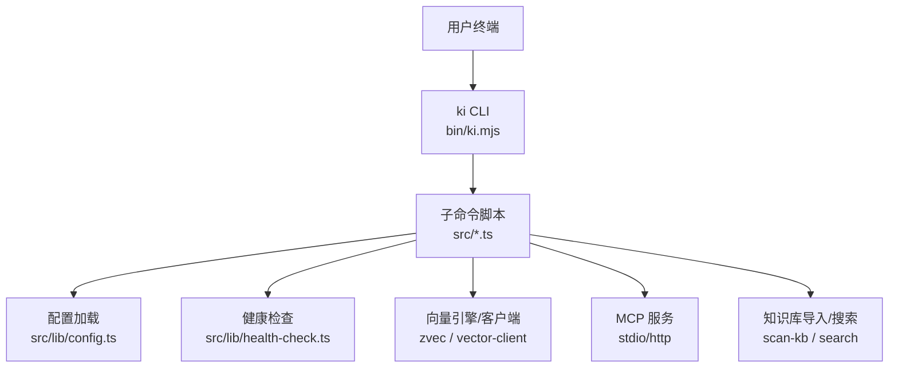
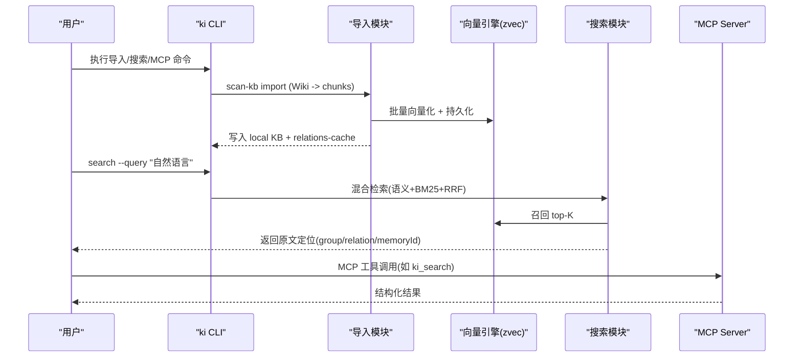
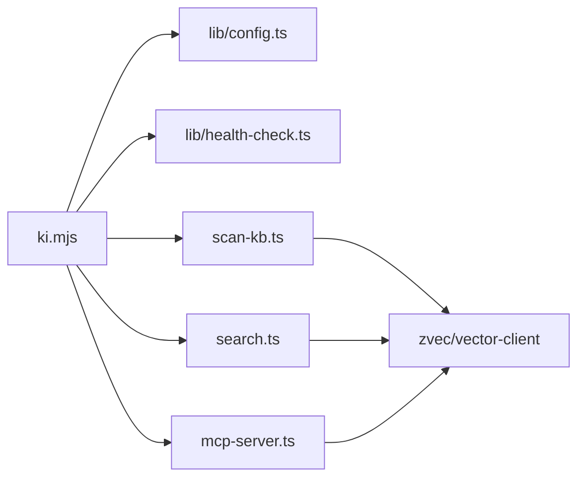

# 快速开始指南

<cite>
**本文引用的文件**
- [README.md](file://README.md)
- [package.json](file://package.json)
- [bin/ki.mjs](file://bin/ki.mjs)
- [docs/configuration.md](file://docs/configuration.md)
- [docs/mcp-http.md](file://docs/mcp-http.md)
- [src/config.ts](file://src/config.ts)
- [src/lib/config.ts](file://src/lib/config.ts)
- [src/lib/health-check.ts](file://src/lib/health-check.ts)
- [src/search.ts](file://src/search.ts)
- [src/scan-kb.ts](file://src/scan-kb.ts)
- [scripts/install-latest.sh](file://scripts/install-latest.sh)
</cite>

## 目录
1. [简介](#简介)
2. [项目结构](#项目结构)
3. [核心组件](#核心组件)
4. [架构总览](#架构总览)
5. [详细组件分析](#详细组件分析)
6. [依赖关系分析](#依赖关系分析)
7. [性能注意事项](#性能注意事项)
8. [故障排查指南](#故障排查指南)
9. [结论](#结论)
10. [附录：命令与配置模板](#附录命令与配置模板)

## 简介
本指南面向首次接触 knowledge-indexer（CLI 命令为 ki）的用户，提供从安装、配置、导入外部 Wiki、语义检索到 MCP HTTP 模式启动的端到端流程。你将学会两种安装方式（一键安装与源码安装），完成配置文件初始化，执行一次外部 Wiki 导入并验证语义检索结果，最后以 MCP HTTP 模式对外暴露能力，供 AI Agent 接入。

## 项目结构
knowledge-indexer 采用“CLI + 模块脚本”的组织方式：
- bin/ki.mjs 是统一入口，负责解析参数并转发到具体子命令脚本
- src/* 包含各功能实现（搜索、导入、MCP、配置、健康检查等）
- docs/* 提供用户文档（配置、MCP HTTP、CLI 参考等）
- scripts/* 提供安装与发布脚本
- web/* 为内置可视化前端（可选）

**图表来源**
- [bin/ki.mjs:28-49](file://bin/ki.mjs#L28-L49)
- [src/lib/config.ts:159-183](file://src/lib/config.ts#L159-L183)
- [src/lib/health-check.ts:1-35](file://src/lib/health-check.ts#L1-L35)

**章节来源**
- [bin/ki.mjs:1-133](file://bin/ki.mjs#L1-L133)
- [package.json:1-68](file://package.json#L1-L68)

## 核心组件
- 配置系统：支持 YAML/JSON，含字段级校验、路径展开、默认值回退
- 健康诊断：ki doctor 一次性检查配置、目录、Embedding API、向量库状态
- 知识库导入：外部 Markdown Wiki 直导，自动切分、向量化、写入本地 KB 与 relations-cache
- 语义检索：混合检索（语义 + BM25 + RRF），返回原文定位信息
- MCP 集成：支持 stdio 与 HTTP 共享单例，支持 Token 鉴权与可视化前端

**章节来源**
- [docs/configuration.md:1-39](file://docs/configuration.md#L1-L39)
- [docs/cli.md:1235-1251](file://docs/cli.md#L1235-L1251)
- [src/scan-kb.ts:35-46](file://src/scan-kb.ts#L35-L46)
- [src/search.ts:1-31](file://src/search.ts#L1-L31)
- [docs/mcp-http.md:1-55](file://docs/mcp-http.md#L1-L55)

## 架构总览
知识索引系统由“发现层（zvec 向量引擎）+ 交付层（kisearch）”组成。导入阶段将外部 Wiki 切分为 chunk 并生成向量；检索阶段通过混合检索召回相关片段，再反查 memoryId 获取原文。MCP 作为标准协议通道，对外暴露工具集供 AI Agent 调用。

**图表来源**
- [src/scan-kb.ts:35-46](file://src/scan-kb.ts#L35-L46)
- [src/search.ts:1-31](file://src/search.ts#L1-L31)
- [docs/mcp-http.md:72-103](file://docs/mcp-http.md#L72-L103)

## 详细组件分析

### 安装与环境准备
- 一键安装：使用脚本自动检测最新版本并通过 npm 全局安装
- 源码安装：克隆仓库后安装依赖并构建 zvec 引擎

关键步骤
- 运行安装脚本或执行 npm install && npm link
- 若源码安装，需构建 zvec 引擎以避免运行时找不到模块
- Node.js 版本要求 ≥ 18

**章节来源**
- [scripts/install-latest.sh:1-205](file://scripts/install-latest.sh#L1-L205)
- [README.md:107-119](file://README.md#L107-L119)
- [package.json:60-62](file://package.json#L60-L62)

### 配置文件初始化与校验
- 生成配置文件模板：ki config init
- 诊断环境：ki doctor（检查配置文件、目录权限、Embedding API 连通性与维度、zvec 状态、scope 配置）
- 配置文件优先级：命令行 --config > 环境变量 KI_CONFIG_PATH > ~/.ki/config.yaml/yml/json > 内置默认

要点
- 模板会探测默认数据目录，避免“数据消失”
- 字段级校验失败会直接报错并给出建议
- Embedding apiKey 必须显式声明（明文或 ${VAR} 引用）

**章节来源**
- [src/config.ts:1-64](file://src/config.ts#L1-L64)
- [docs/configuration.md:7-23](file://docs/configuration.md#L7-L23)
- [docs/configuration.md:69-90](file://docs/configuration.md#L69-L90)
- [docs/configuration.md:234-260](file://docs/configuration.md#L234-L260)
- [docs/cli.md:1235-1251](file://docs/cli.md#L1235-L1251)

### 外部 Wiki 导入（无 AI 依赖，自动切分）
- 命令：ki scan-kb import
- 参数：--source（Wiki 根目录）、--group（目标 Group）、--chunk-size、--chunk-overlap、--no-vector（仅写 KB 层）
- 行为：格式白名单校验 → 自动切分 → 批量向量化 → 写入 local KB 与 relations-cache → 幂等追加

提示
- 重复执行同一条命令即增量更新（修改/新增 source 目录文件后重新跑）
- 可附加标签 --tags，便于后续按标签检索

**章节来源**
- [src/scan-kb.ts:35-46](file://src/scan-kb.ts#L35-L46)
- [README.md:145-167](file://README.md#L145-L167)

### 语义检索使用方法
- 命令：ki search
- 参数：--scope、--query、--limit、--threshold、--tags
- 行为：混合检索（语义 + BM25 + RRF），返回 group/relation/memoryId 等定位字段，便于定位原文

注意
- 不传 tags 时默认搜索全部标签，并按内容优先策略排序
- 可通过标签过滤提升准确率

**章节来源**
- [src/search.ts:1-31](file://src/search.ts#L1-L31)
- [README.md:156-158](file://README.md#L156-L158)

### MCP HTTP 模式启动与配置
- 启动：ki mcp --http [--web] [--daemon]
- 状态：ki mcp --status
- 安全：回环绑定免鉴权；非回环绑定强制 Token（--token 或环境变量 KI_MCP_TOKEN，或多 Token 存储）
- 前端：--web 提供可视化页面（需先构建 web/dist）

要点
- 多 IDE 共享同一持锁进程，避免向量库锁冲突
- 支持后台常驻（--daemon）与重启（ki mcp restart）
- 所有 IDE 必须使用完全一致的 URL（host/port）

**章节来源**
- [docs/mcp-http.md:11-55](file://docs/mcp-http.md#L11-L55)
- [docs/mcp-http.md:72-103](file://docs/mcp-http.md#L72-L103)
- [docs/mcp-http.md:132-146](file://docs/mcp-http.md#L132-L146)
- [docs/mcp-http.md:147-157](file://docs/mcp-http.md#L147-L157)
- [docs/mcp-http.md:191-223](file://docs/mcp-http.md#L191-L223)

## 依赖关系分析
- CLI 入口分发到子命令脚本，子命令依赖配置加载与健康检查
- 导入与搜索均依赖向量引擎（zvec）与 embedding 提供商
- MCP 服务复用同一向量引擎实例，保证并发安全

**图表来源**
- [bin/ki.mjs:28-49](file://bin/ki.mjs#L28-L49)
- [src/lib/config.ts:159-183](file://src/lib/config.ts#L159-L183)
- [src/lib/health-check.ts:1-35](file://src/lib/health-check.ts#L1-L35)

**章节来源**
- [bin/ki.mjs:28-49](file://bin/ki.mjs#L28-L49)

## 性能注意事项
- 导入阶段批量向量化可减少网络往返，提高吞吐
- 混合检索利用 RRF 融合排序，兼顾语义与关键词精确匹配
- MCP HTTP 共享单例避免多进程争抢向量库锁，减少等待与降级
- 合理设置 chunk-size 与 overlap，平衡召回质量与存储开销

[本节为通用指导，无需特定文件引用]

## 故障排查指南
常见问题与处理
- 未找到配置文件：执行 ki config init 生成模板，或指定 --config
- Embedding API 不可用：检查 apiKey、baseURL、网络连通性；使用 ki doctor 查看诊断报告
- 向量维度不匹配：确保 embedding.dimension 与实际模型返回一致
- MCP 端口占用或鉴权失败：使用 ki mcp --status 查看状态；非回环绑定需配置 Token
- 导入后无法检索：确认是否开启向量化（未传 --no-vector），或检查 scope/tags 过滤

诊断命令
- ki doctor：一次性检查配置、目录、API 连通性、维度、zvec 状态
- ki mcp --status：查看当前持锁进程、健康状态、Token 数量

**章节来源**
- [docs/cli.md:1235-1251](file://docs/cli.md#L1235-L1251)
- [docs/mcp-http.md:105-146](file://docs/mcp-http.md#L105-L146)
- [src/lib/health-check.ts:1-35](file://src/lib/health-check.ts#L1-L35)

## 结论
通过本指南，你可以在最短时间内完成 knowledge-indexer 的安装、配置、导入与检索，并以 MCP HTTP 模式对外提供服务。结合内置可视化前端与诊断工具，能够快速验证导入效果与排查问题。推荐在生产环境中使用 HTTP 共享单例与 Token 鉴权，确保多 IDE 稳定接入与数据安全。

[本节为总结，无需特定文件引用]

## 附录：命令与配置模板

常用命令示例
- 安装
  - 一键安装：curl -fsSL https://raw.githubusercontent.com/HACK-WU/kisearch/master/scripts/install-latest.sh | bash
  - 源码安装：git clone ... && cd kisearch && npm install && npm link && npm run build:zvec-engine
- 配置
  - 生成模板：ki config init
  - 诊断环境：ki doctor
- 导入
  - 外部 Wiki 导入：ki scan-kb import --scope my-project --source /path/to/wiki --group Wiki --chunk-size 1000 --chunk-overlap 150
- 检索
  - 语义检索：ki search --scope my-project --query "用户登录流程"
- MCP
  - 启动 HTTP 并附带前端：ki mcp --http --web
  - 后台常驻：ki mcp --http --daemon
  - 查看状态：ki mcp --status
  - 生成 Token：ki mcp token generate --scope team-a

配置文件模板要点
- dataDir：KB 源数据目录
- backupDir：备份目录
- vectorDir：zvec 向量库目录
- embedding：provider、baseURL、model、dimension、apiKey
- scopeMode：default 或 strict
- scopes：scope → kbDir 映射与 wikiSync/clean/import 等选项
- mcp.http：host、port、allowedHosts

说明
- 以上命令与配置项均可在对应文档中找到详细说明与完整示例
- 如需自定义清洗规则或导入行为，可在 scopes.<scope>.clean 与 import 中配置

**章节来源**
- [README.md:107-193](file://README.md#L107-L193)
- [docs/configuration.md:182-230](file://docs/configuration.md#L182-L230)
- [docs/mcp-http.md:41-70](file://docs/mcp-http.md#L41-L70)