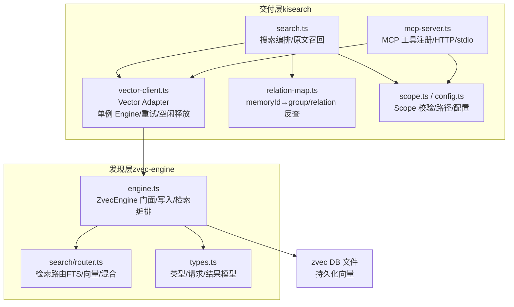
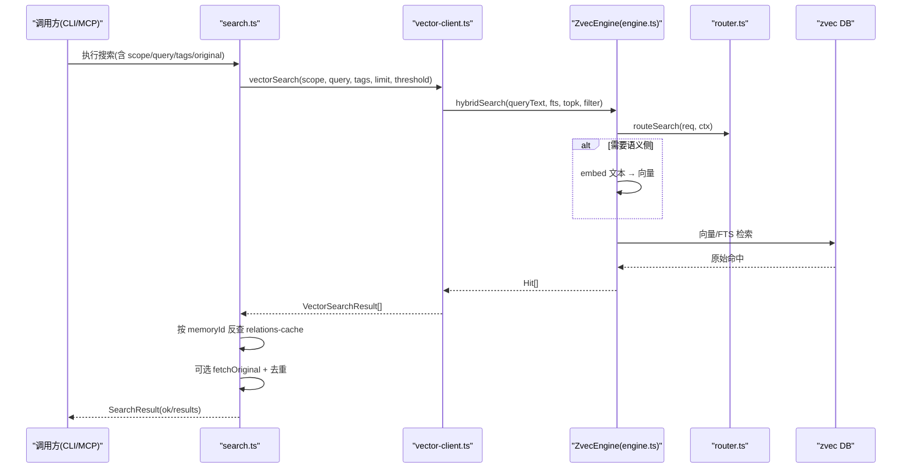
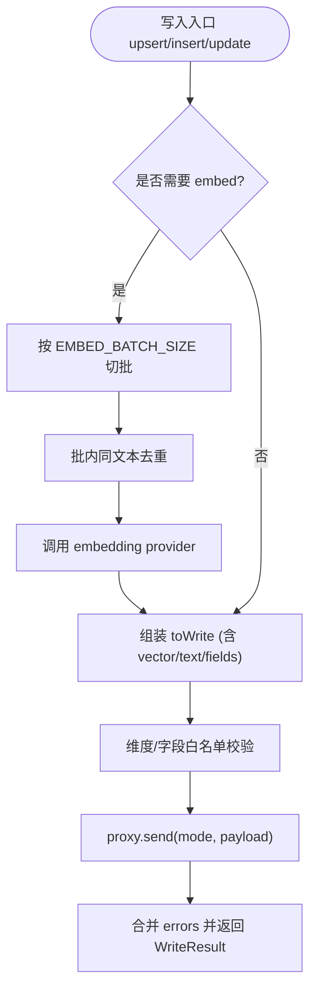
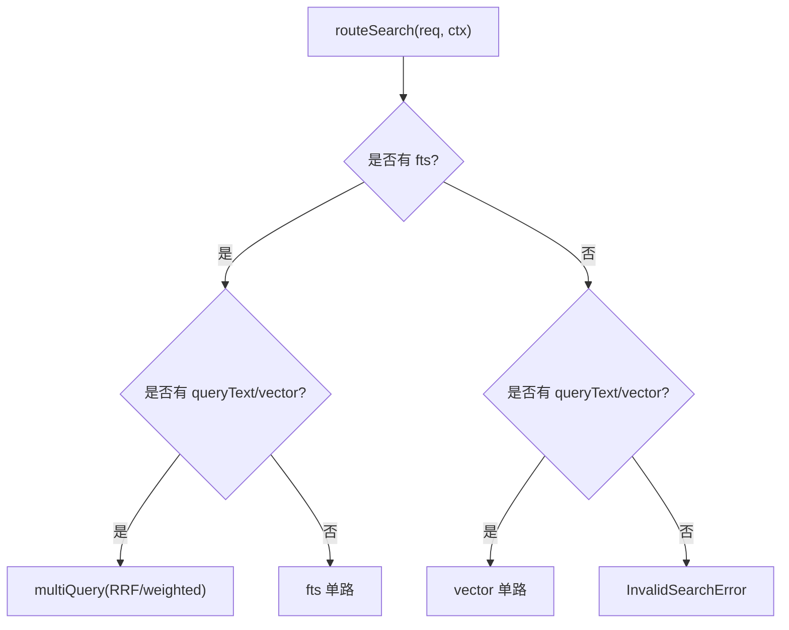
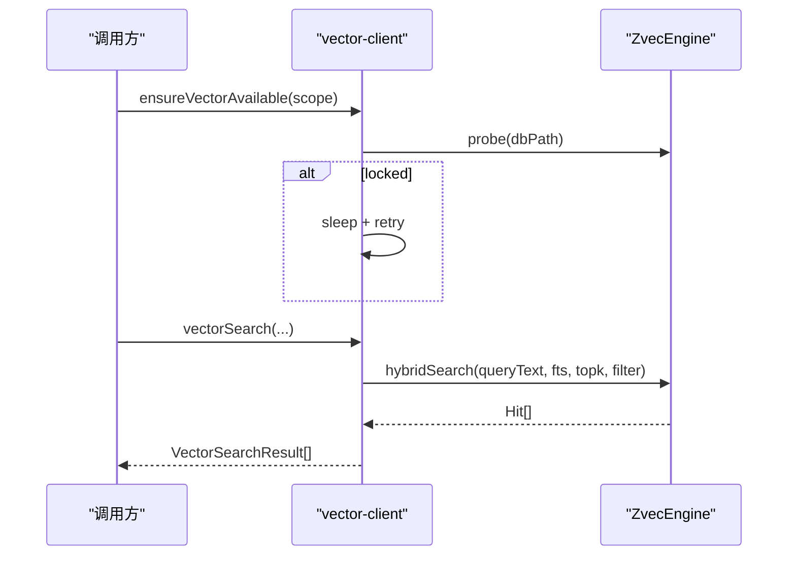
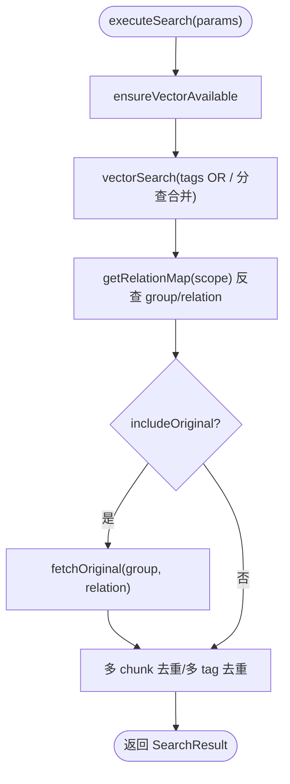
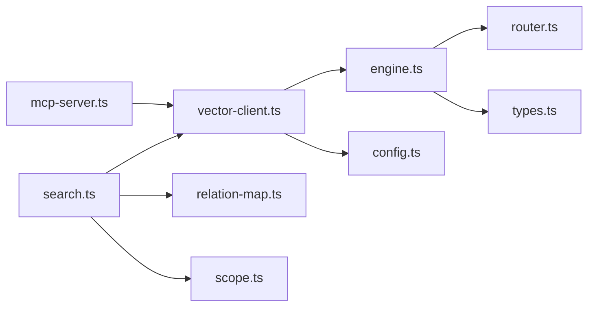

# 分层架构设计

<cite>
**本文引用的文件**
- [src/zvec-engine/engine.ts](file://src/zvec-engine/engine.ts)
- [src/zvec-engine/types.ts](file://src/zvec-engine/types.ts)
- [src/zvec-engine/search/router.ts](file://src/zvec-engine/search/router.ts)
- [src/lib/vector-client.ts](file://src/lib/vector-client.ts)
- [src/search.ts](file://src/search.ts)
- [src/lib/relation-map.ts](file://src/lib/relation-map.ts)
- [src/lib/scope.ts](file://src/lib/scope.ts)
- [src/config.ts](file://src/config.ts)
- [src/mcp-server.ts](file://src/mcp-server.ts)
- [docs/architecture.md](file://docs/architecture.md)
</cite>

## 目录
1. [引言](#引言)
2. [项目结构](#项目结构)
3. [核心组件](#核心组件)
4. [架构总览](#架构总览)
5. [详细组件分析](#详细组件分析)
6. [依赖关系分析](#依赖关系分析)
7. [性能与扩展性](#性能与扩展性)
8. [故障排查指南](#故障排查指南)
9. [结论](#结论)

## 引言
本文件面向开发者，系统化阐述 knowledge-indexer 的分层架构：以“发现层（zvec 向量引擎）”和“交付层（kisearch）”为核心，明确两层职责边界、接口契约、数据流向与缓存策略。重点覆盖向量检索、原文定位、缓存管理、扩展点与集成方式，并给出架构图与关键流程时序图，帮助快速理解整体设计与实现思路。

## 项目结构
knowledge-indexer 将“向量索引与检索”下沉到 zvec-engine，上层通过 vector-client 统一封装；交付层 search.ts 负责业务编排（标签优先级、原文召回、去重等），MCP Server 暴露工具供 Agent/IDE 调用。配置与 scope 隔离由 lib/config.ts 与 lib/scope.ts 提供。

图表来源
- [src/search.ts:70-199](file://src/search.ts#L70-L199)
- [src/mcp-server.ts:54-70](file://src/mcp-server.ts#L54-L70)
- [src/lib/vector-client.ts:314-340](file://src/lib/vector-client.ts#L314-L340)
- [src/zvec-engine/engine.ts:97-131](file://src/zvec-engine/engine.ts#L97-L131)
- [src/zvec-engine/search/router.ts:43-127](file://src/zvec-engine/search/router.ts#L43-L127)
- [src/zvec-engine/types.ts:118-151](file://src/zvec-engine/types.ts#L118-L151)

章节来源
- [docs/architecture.md:11-35](file://docs/architecture.md#L11-L35)
- [src/search.ts:70-199](file://src/search.ts#L70-L199)
- [src/lib/vector-client.ts:314-340](file://src/lib/vector-client.ts#L314-L340)
- [src/zvec-engine/engine.ts:97-131](file://src/zvec-engine/engine.ts#L97-L131)

## 核心组件
- 发现层（zvec-engine）
  - ZvecEngine：进程内向量引擎门面，负责创建/打开集合、写入（upsert/insert/update/delete）、检索（semantic/vector/fts/hybrid）、索引管理与生命周期控制。
  - 检索路由：根据请求参数选择单路向量、单路 FTS 或双路 RRF 混合检索。
  - 类型系统：统一的请求/响应/错误类型，确保跨 worker 通信稳定。
- 交付层（kisearch）
  - Vector Adapter（vector-client）：封装 ZvecEngine，提供进程内单例、撞锁重试、空闲释放锁、可用性检测、批量存储、删除、枚举等能力。
  - 搜索编排（search.ts）：按 tag 优先级分查、多 tag OR 组合、按 memoryId 反查 relations-cache 定位 group/relation、可选原文召回与去重。
  - MCP Server：注册搜索/存储/管理等工具，支持 stdio/HTTP，共享 vector-client 单例。
  - Scope/配置：scope 校验、路径构造、embedding 配置加载。

章节来源
- [src/zvec-engine/engine.ts:68-131](file://src/zvec-engine/engine.ts#L68-L131)
- [src/zvec-engine/search/router.ts:43-127](file://src/zvec-engine/search/router.ts#L43-L127)
- [src/zvec-engine/types.ts:118-151](file://src/zvec-engine/types.ts#L118-L151)
- [src/lib/vector-client.ts:314-340](file://src/lib/vector-client.ts#L314-L340)
- [src/search.ts:70-199](file://src/search.ts#L70-L199)
- [src/mcp-server.ts:54-70](file://src/mcp-server.ts#L54-L70)
- [src/lib/scope.ts:30-77](file://src/lib/scope.ts#L30-L77)
- [src/config.ts:70-118](file://src/config.ts#L70-L118)

## 架构总览
知识检索的端到端流程：
- 用户/Agent 通过 CLI 或 MCP 发起查询。
- 交付层进行 scope/tag 过滤、向量检索（hybridSearch）、relations-cache 反查、可选原文召回与去重。
- 发现层执行 embedding（必要时）、路由到向量/FTS/混合检索，返回归一化结果。
- 底层 zvec DB 持久化向量与标量字段。

图表来源
- [src/search.ts:70-199](file://src/search.ts#L70-L199)
- [src/lib/vector-client.ts:477-506](file://src/lib/vector-client.ts#L477-L506)
- [src/zvec-engine/engine.ts:454-495](file://src/zvec-engine/engine.ts#L454-L495)
- [src/zvec-engine/search/router.ts:43-127](file://src/zvec-engine/search/router.ts#L43-L127)

## 详细组件分析

### 发现层：ZvecEngine（engine.ts）
- 职责
  - 集合生命周期：create/open/probe/close/destroy。
  - 写入编排：upsert/insert/update/delete，自动切分需 embed 与不需 embed 的文档，批大小与失败粒度控制。
  - 检索编排：统一入口 search()，内部走 router 路由，必要时 embed，注入 filterSql，调用 worker 后归一化为 Hit[]。
  - 防御与校验：维度检查、字段白名单、状态守卫。
- 关键流程
  - 写入：按是否包含 text 且无 vector 切分 → 分批 embed → 组装 WriteDocPayload → proxy.send 写入 → 聚合 errors。
  - 检索：compileFilter → routeSearch → 若需 embed 则主线程 embed → 注入 filterSql → query/multiQuery → toHit 归一化。
- 复杂度与优化
  - Embedding 小批（EMBED_BATCH_SIZE=64）降低失败影响面，批内同文本去重减少重复 HTTP 调用。
  - 写路径默认 batch size 100，平衡吞吐与延迟。
  - 检索 topk 限制与文本长度校验避免过大请求。

图表来源
- [src/zvec-engine/engine.ts:330-450](file://src/zvec-engine/engine.ts#L330-L450)

章节来源
- [src/zvec-engine/engine.ts:97-131](file://src/zvec-engine/engine.ts#L97-L131)
- [src/zvec-engine/engine.ts:330-450](file://src/zvec-engine/engine.ts#L330-L450)
- [src/zvec-engine/engine.ts:454-495](file://src/zvec-engine/engine.ts#L454-L495)

### 发现层：检索路由（router.ts）
- 职责
  - 根据请求参数决定单路向量、单路 FTS 或双路 RRF 混合检索。
  - 校验 topk、文本长度、向量维度、FTS 字段存在性等。
- 退化矩阵
  - 有 fts 且有 queryText/vector → multiQuery（hybrid）。
  - 缺 fts → 退单路向量。
  - 缺 queryText/vector → 退单路 FTS。
  - 三者皆缺 → 报错。
  - queryText 与 vector 互斥。

图表来源
- [src/zvec-engine/search/router.ts:43-127](file://src/zvec-engine/search/router.ts#L43-L127)

章节来源
- [src/zvec-engine/search/router.ts:43-127](file://src/zvec-engine/search/router.ts#L43-L127)

### 交付层：Vector Adapter（vector-client.ts）
- 职责
  - 进程内唯一 ZvecEngine 单例，负责 create/open、撞锁重试、空闲释放锁、在途保护与自愈重试。
  - 构建 schema（denseField/dimension/FTS/scalarFields）、tag/scope 过滤、doc id 生成（含 tag 参与，幂等 upsert）。
  - 对外暴露 vectorSearch/vectorStore/vectorBulkStore/vectorDelete/vectorListTags 等能力。
- 关键机制
  - 撞锁重试：probeWithRetry 检测到 locked 时等待并重试，避免并发冲突。
  - 空闲释放锁：enableIdleClose 在常驻 MCP 场景下空闲超时自动 closeEngine，让其他实例抢占。
  - 在途保护：withEngine 包装操作，防止 idle close 竞态中断网络阶段 embedding。
  - 可用性检测：ensureVectorAvailable 区分 LOCKED/CORRUPTED/PROBE_ERROR。
- 数据流
  - vectorSearch：buildScopeTagFilter → hybridSearch → 映射为 VectorSearchResult（含 group/tag）。
  - vectorStore/BulkStore：generateDocId → upsert → 返回 docId/成功失败明细。

图表来源
- [src/lib/vector-client.ts:420-467](file://src/lib/vector-client.ts#L420-L467)
- [src/lib/vector-client.ts:477-506](file://src/lib/vector-client.ts#L477-L506)
- [src/lib/vector-client.ts:314-340](file://src/lib/vector-client.ts#L314-L340)

章节来源
- [src/lib/vector-client.ts:120-144](file://src/lib/vector-client.ts#L120-L144)
- [src/lib/vector-client.ts:240-303](file://src/lib/vector-client.ts#L240-L303)
- [src/lib/vector-client.ts:314-340](file://src/lib/vector-client.ts#L314-L340)
- [src/lib/vector-client.ts:420-467](file://src/lib/vector-client.ts#L420-L467)
- [src/lib/vector-client.ts:477-506](file://src/lib/vector-client.ts#L477-L506)

### 交付层：搜索编排（search.ts）
- 职责
  - 解析 CLI/MCP 参数，执行向量检索，按 memoryId 反查 relations-cache 附加 group/relation。
  - 可选原文召回（includeOriginal），同一文件多 chunk 命中去重，保留 score 最高的一条。
  - 多 tag 优先级排序（ki-search > ki-relation > ki-path），默认全量搜索时按 tag 分查再合并。
- 关键流程
  - 可用性检测 → 向量检索（支持 tags OR）→ relations-cache 反查 → 原文召回（本地 KB）→ 去重 → 返回。
- 原文定位
  - 通过 getRelationMap(scope) 获取 memoryId→{group,relation} 映射，再读取 local KB 中对应 index.json 获取原文。

图表来源
- [src/search.ts:70-199](file://src/search.ts#L70-L199)
- [src/lib/relation-map.ts:48-78](file://src/lib/relation-map.ts#L48-L78)

章节来源
- [src/search.ts:70-199](file://src/search.ts#L70-L199)
- [src/lib/relation-map.ts:48-78](file://src/lib/relation-map.ts#L48-L78)

### 交付层：MCP Server（mcp-server.ts）
- 职责
  - 构建 McpServer 并注册搜索/存储/管理等工具，支持 stdio/HTTP 模式。
  - 启用空闲释放锁（VECTOR_IDLE_CLOSE_MS），共享 vector-client 单例，避免多实例争用向量库锁。
  - 健康检查、版本守护、Token 鉴权（HTTP 非回环绑定）。
- 集成点
  - 通过 registerSearchTool/registerStoreTool 等暴露能力给 Agent/IDE。
  - 与 vector-client 的 enableIdleClose/closeEngine 配合，保障常驻服务稳定性。

章节来源
- [src/mcp-server.ts:54-70](file://src/mcp-server.ts#L54-L70)
- [src/mcp-server.ts:36-38](file://src/mcp-server.ts#L36-L38)

### 配置与 Scope（config.ts / scope.ts）
- 配置
  - 生成 YAML 模板，定义 dataDir/backupDir/vectorDir/embedding/scopes 等。
  - embedding.apiKey 必填，支持明文或环境变量引用。
- Scope
  - validateScope 严格校验字符集，禁止路径遍历。
  - 提供 kb/{scope}/ 路径、group-index.json、relations-cache.json 路径构造。
  - 支持 source 块写入（dir/chunkSize/chunkOverlap），用于 Wiki 写回与增量导入。

章节来源
- [src/config.ts:70-118](file://src/config.ts#L70-L118)
- [src/lib/scope.ts:30-77](file://src/lib/scope.ts#L30-L77)
- [src/lib/scope.ts:205-229](file://src/lib/scope.ts#L205-L229)

## 依赖关系分析
- 耦合与内聚
  - 交付层对发现层的依赖集中在 vector-client 与 search.ts，通过类型化的请求/响应解耦。
  - 发现层内部 engine.ts 与 router.ts/types.ts 高内聚，worker 通信细节被屏蔽。
- 直接/间接依赖
  - search.ts → vector-client.ts → zvec-engine/engine.ts → router.ts/types.ts。
  - mcp-server.ts → vector-client.ts（共享单例）+ 各工具模块。
- 外部依赖
  - embedding provider（SiliconFlowProvider）通过配置注入。
  - zvec 原生内核通过 dist 产物加载，保证 worker_threads 可运行。

图表来源
- [src/search.ts:70-199](file://src/search.ts#L70-L199)
- [src/lib/vector-client.ts:314-340](file://src/lib/vector-client.ts#L314-L340)
- [src/zvec-engine/engine.ts:97-131](file://src/zvec-engine/engine.ts#L97-L131)
- [src/zvec-engine/search/router.ts:43-127](file://src/zvec-engine/search/router.ts#L43-L127)
- [src/zvec-engine/types.ts:118-151](file://src/zvec-engine/types.ts#L118-L151)
- [src/mcp-server.ts:54-70](file://src/mcp-server.ts#L54-L70)
- [src/lib/relation-map.ts:48-78](file://src/lib/relation-map.ts#L48-L78)
- [src/lib/scope.ts:30-77](file://src/lib/scope.ts#L30-L77)
- [src/config.ts:70-118](file://src/config.ts#L70-L118)

## 性能与扩展性
- 性能特性
  - 混合检索（dense + FTS + RRF）提升召回质量与速度。
  - Embedding 批处理与小批失败粒度，降低抖动影响。
  - 进程内单例 + 撞锁重试 + 空闲释放锁，提高并发利用率。
  - relations-cache TTL 缓存 O(1) 反查，减少 IO。
- 扩展点
  - Embedding Provider：通过 SiliconFlowProvider 配置 baseURL/model/dimension/apiKey，可替换任意 OpenAI 兼容提供商。
  - 检索路由：支持 weighted rerank 权重配置，便于引入自定义融合策略。
  - 标签体系：tag 参与 doc id 生成，支撑多标签独立向量与过滤。
  - Scope 隔离：schema 中 scope/tag/group 标量字段，天然支持多租户/多项目。
- 建议
  - 大库场景关注 LIST_ALL_LIMIT 与 scanLimit，避免全量扫描。
  - 高频查询可开启 includeOriginal=false 以降低 IO。
  - 常驻服务建议启用 enableIdleClose，避免长期持锁。

[本节为通用指导，不直接分析具体文件]

## 故障排查指南
- 向量库被占用（LOCKED）
  - 现象：ensureVectorAvailable 返回 code='LOCKED'，提示停止其他 ki 进程或等待释放。
  - 处置：确认无其他 ki 命令/服务占用；若异常退出残留，稍后重试或重建。
  - 参考：lockedHint 与 probeWithRetry 逻辑。
- 向量库损坏（CORRUPTED）
  - 现象：probe 返回 healthy=false，提示重建。
  - 处置：执行 ki restore <scope> --from-snapshot 重建向量库。
- Worker 不可用（WorkerUnavailableError）
  - 现象：withEngine 捕获 "worker not open" 并自愈重试。
  - 处置：检查 dist 构建是否正确、zvec 内核是否正常加载。
- 原文不可用
  - 现象：includeOriginal=true 但无法定位本地 KB，返回降级 content 与 hint。
  - 处置：执行 sync-relation 或 rebuild-vector 恢复映射。

章节来源
- [src/lib/vector-client.ts:74-86](file://src/lib/vector-client.ts#L74-L86)
- [src/lib/vector-client.ts:420-467](file://src/lib/vector-client.ts#L420-L467)
- [src/search.ts:54-68](file://src/search.ts#L54-L68)

## 结论
knowledge-indexer 采用清晰的“发现层（zvec-engine）+ 交付层（kisearch）”分层设计：
- 发现层专注向量化、索引与检索，提供稳定的 API 与鲁棒的错误处理。
- 交付层负责业务编排、原文召回、缓存与多标签优先级，屏蔽底层复杂性。
- 两层通过 vector-client 与类型化请求/响应解耦，支持可扩展的 embedding 提供方与检索策略。
- 通过撞锁重试、空闲释放锁、TTL 缓存与混合检索，兼顾可用性与性能。
该设计使系统在多进程/多实例环境下具备良好稳定性，同时为后续扩展（如新 rerank 策略、新 embedding 提供商）预留了清晰扩展点。