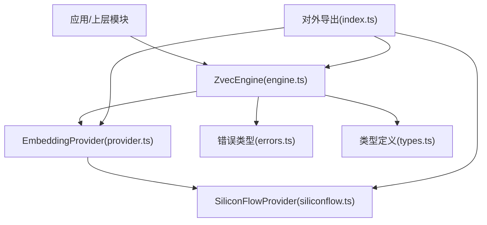
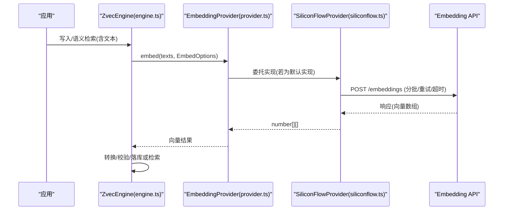
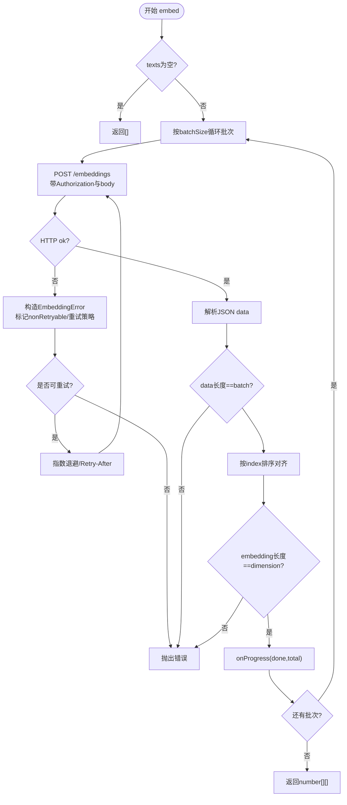
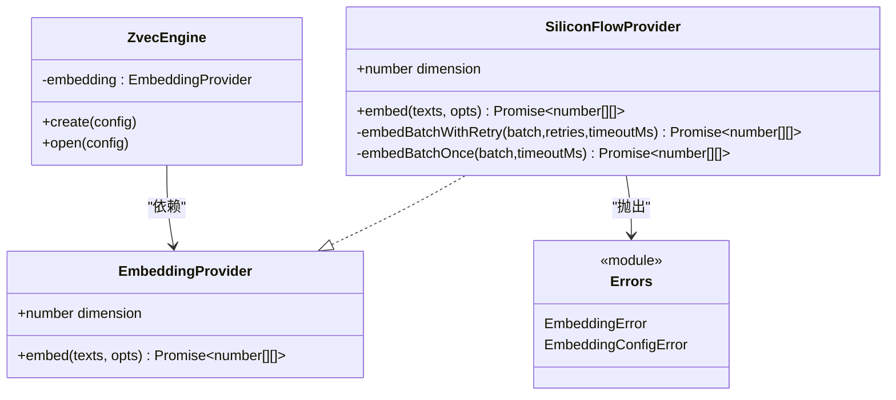
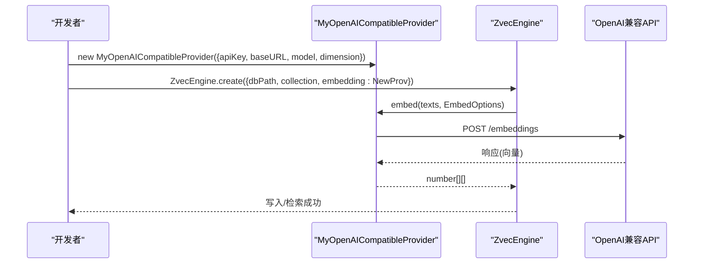

# Embedding提供商扩展

<cite>
**本文引用的文件**
- [provider.ts](file://src/zvec-engine/embedding/provider.ts)
- [siliconflow.ts](file://src/zvec-engine/embedding/siliconflow.ts)
- [errors.ts](file://src/zvec-engine/errors.ts)
- [engine.ts](file://src/zvec-engine/engine.ts)
- [types.ts](file://src/zvec-engine/types.ts)
- [index.ts](file://src/zvec-engine/index.ts)
- [zvec-engine-embedding.test.mjs](file://test/zvec-engine-embedding.test.mjs)
- [config.ts](file://src/config.ts)
</cite>

## 目录
1. [简介](#简介)
2. [项目结构](#项目结构)
3. [核心组件](#核心组件)
4. [架构总览](#架构总览)
5. [详细组件分析](#详细组件分析)
6. [依赖关系分析](#依赖关系分析)
7. [性能与优化](#性能与优化)
8. [故障排查指南](#故障排查指南)
9. [结论](#结论)
10. [附录：实现新提供商示例](#附录：实现新提供商示例)

## 简介
本文件面向需要在 knowledge-indexer 中扩展 Embedding 提供商的开发者，系统性说明 EmbeddingProvider 接口规范、EmbedOptions 配置项、错误处理策略、性能优化技巧，并给出自定义提供商（如 OpenAI 兼容接口、本地模型）的实现要点与注册使用方式。文档基于仓库内现有实现（SiliconFlowProvider）与类型定义进行提炼，确保可落地、可复用。

## 项目结构
与 Embedding 扩展直接相关的代码集中在 zvec-engine 子系统中：
- 抽象与类型：embedding/provider.ts
- 参考实现：embedding/siliconflow.ts
- 错误类型：errors.ts
- 引擎集成：engine.ts、types.ts
- 对外导出门面：index.ts
- 配置与使用示例：src/config.ts、测试用例 test/zvec-engine-embedding.test.mjs

图表来源
- [engine.ts:68-93](file://src/zvec-engine/engine.ts#L68-L93)
- [provider.ts:9-28](file://src/zvec-engine/embedding/provider.ts#L9-L28)
- [siliconflow.ts:43-102](file://src/zvec-engine/embedding/siliconflow.ts#L43-L102)
- [errors.ts:56-61](file://src/zvec-engine/errors.ts#L56-L61)
- [types.ts:41-61](file://src/zvec-engine/types.ts#L41-L61)
- [index.ts:43-45](file://src/zvec-engine/index.ts#L43-L45)

章节来源
- [engine.ts:68-93](file://src/zvec-engine/engine.ts#L68-L93)
- [provider.ts:9-28](file://src/zvec-engine/embedding/provider.ts#L9-L28)
- [siliconflow.ts:43-102](file://src/zvec-engine/embedding/siliconflow.ts#L43-L102)
- [errors.ts:56-61](file://src/zvec-engine/errors.ts#L56-L61)
- [types.ts:41-61](file://src/zvec-engine/types.ts#L41-L61)
- [index.ts:43-45](file://src/zvec-engine/index.ts#L43-L45)

## 核心组件
- EmbeddingProvider 接口
  - dimension：输出向量维度，必须与集合配置的 dimension 一致。
  - embed(texts, opts?)：将文本数组转换为二维向量数组；返回长度等于 texts.length，每条向量长度为 dimension。小批失败时抛出 EmbeddingError（携带该批文本范围信息）。
- EmbedOptions 配置
  - retries：失败重试次数（默认 3）。
  - batchSize：分批大小，避免触发限流（默认 64），失败粒度为“小批”。
  - timeoutMs：单批超时时间（默认 30000ms）。
  - onProgress：进度回调 (done, total)。
- SiliconFlowProvider
  - 实现了 EmbeddingProvider，提供 OpenAI 兼容 /embeddings 端点的调用、重试、退避、维度校验等能力。
- 错误体系
  - EmbeddingError：嵌入过程异常（网络、HTTP、响应结构、维度不匹配等）。
  - EmbeddingConfigError：配置错误（缺少 apiKey、dimension 非法、baseURL 非 https 等）。

章节来源
- [provider.ts:9-28](file://src/zvec-engine/embedding/provider.ts#L9-L28)
- [siliconflow.ts:43-102](file://src/zvec-engine/embedding/siliconflow.ts#L43-L102)
- [errors.ts:56-61](file://src/zvec-engine/errors.ts#L56-L61)

## 架构总览
ZvecEngine 在写入或语义检索路径中，通过注入的 EmbeddingProvider 将文本转为向量，再交由底层 worker 持久化或检索。SiliconFlowProvider 作为参考实现，封装了 HTTP 调用、重试、超时、进度上报与维度一致性校验。

图表来源
- [engine.ts:68-93](file://src/zvec-engine/engine.ts#L68-L93)
- [provider.ts:20-28](file://src/zvec-engine/embedding/provider.ts#L20-L28)
- [siliconflow.ts:77-102](file://src/zvec-engine/embedding/siliconflow.ts#L77-L102)

## 详细组件分析

### EmbeddingProvider 接口与 EmbedOptions
- dimension 属性
  - 必须为正整数，且与 ZvecEngineConfig.collection.dimension 严格相等，否则会导致维度不一致错误。
- embed 方法
  - 输入：texts 字符串数组；可选 EmbedOptions。
  - 输出：Promise<number[][]>，外层数组长度等于 texts.length，内层每个向量长度等于 dimension。
  - 错误：小批失败抛 EmbeddingError，需包含该批文本范围信息以便上层定位。
- EmbedOptions 选项
  - retries：重试次数（默认 3）。
  - batchSize：分批大小（默认 64），用于控制并发与限流。
  - timeoutMs：单批超时（默认 30000ms）。
  - onProgress：进度回调 (done, total)，便于 UI 或日志展示。

章节来源
- [provider.ts:9-28](file://src/zvec-engine/embedding/provider.ts#L9-L28)
- [types.ts:41-61](file://src/zvec-engine/types.ts#L41-L61)

### SiliconFlowProvider 实现要点
- 配置校验
  - apiKey 必填（可从环境变量读取），缺失抛 EmbeddingConfigError。
  - baseURL 必须以 https:// 开头，否则抛 EmbeddingConfigError。
  - dimension 必须为正整数，否则抛 EmbeddingConfigError。
- 批量与重试
  - 按 batchSize 切分批次，逐批串行调用以避免触发限流。
  - 对 5xx、429、网络错误进行重试；指数退避优先遵循 Retry-After（支持秒数与 HTTP 日期格式）。
  - 4xx（非 429）视为不可重试，直接抛出 EmbeddingError。
- 超时控制
  - 每批请求使用 AbortController 设置 timeoutMs，超时抛 EmbeddingError(code=TIMEOUT)。
- 响应校验
  - 校验 data 数量与输入 batch 长度一致。
  - 按 index 排序对齐输入顺序，防御 provider 乱序返回。
  - 校验 embedding 为数组且长度等于 dimension，否则抛 EmbeddingError。
- 进度回调
  - 每批完成后调用 onProgress(done, total)，异常被静默捕获不影响主流程。

图表来源
- [siliconflow.ts:77-102](file://src/zvec-engine/embedding/siliconflow.ts#L77-L102)
- [siliconflow.ts:104-202](file://src/zvec-engine/embedding/siliconflow.ts#L104-L202)

章节来源
- [siliconflow.ts:43-202](file://src/zvec-engine/embedding/siliconflow.ts#L43-L202)

### 引擎集成与使用
- ZvecEngine 在 create/open 时接收 EmbeddingProvider，并在写入/检索路径中调用 embed。
- 写入路径：当文档包含 text 且未提供 vector 时，引擎会调用 EmbeddingProvider 生成 dense vector。
- 检索路径：语义检索会将 queryText 经 EmbeddingProvider 转为向量后执行相似度搜索。
- 配置：ZvecEngineConfig 与 ZvecEngineOpenConfig 均要求 embedding 字段。

章节来源
- [engine.ts:68-93](file://src/zvec-engine/engine.ts#L68-L93)
- [types.ts:41-61](file://src/zvec-engine/types.ts#L41-L61)

## 依赖关系分析
- 耦合与内聚
  - EmbeddingProvider 与 ZvecEngine 松耦合：仅通过接口交互，便于替换不同后端。
  - SiliconFlowProvider 内部高内聚：封装了 HTTP、重试、超时、校验、进度等逻辑。
- 外部依赖
  - fetch：可通过 fetchImpl 注入以支持测试或代理环境。
  - 环境变量：apiKey 可从环境变量读取，提升安全性。
- 错误传播
  - EmbeddingError/EmbeddingConfigError 继承自 ZvecEngineError，支持跨线程序列化与统一识别。

图表来源
- [provider.ts:20-28](file://src/zvec-engine/embedding/provider.ts#L20-L28)
- [siliconflow.ts:43-202](file://src/zvec-engine/embedding/siliconflow.ts#L43-L202)
- [engine.ts:68-93](file://src/zvec-engine/engine.ts#L68-L93)
- [errors.ts:56-61](file://src/zvec-engine/errors.ts#L56-L61)

章节来源
- [engine.ts:68-93](file://src/zvec-engine/engine.ts#L68-L93)
- [errors.ts:56-61](file://src/zvec-engine/errors.ts#L56-L61)

## 性能与优化
- 分批大小（batchSize）
  - 默认 64，平衡吞吐与限流风险；可根据供应商 QPS 限制调优。
- 重试与退避
  - 指数退避 + Retry-After 优先，避免雪崩；对 4xx（非 429）不重试，减少无效开销。
- 超时控制（timeoutMs）
  - 单批超时保护，防止长尾请求拖垮整体；建议根据网络与模型规模调整。
- 进度回调（onProgress）
  - 用于前端/CLI 进度展示，降低用户等待焦虑。
- 维度一致性
  - 严格校验 embedding 长度与 dimension，避免后续索引构建失败。
- 连接与并发
  - 当前实现批次间串行，避免触发供应商限流；如需更高吞吐，可在上层做并发调度（注意限流与错误隔离）。

[本节为通用指导，不直接分析具体文件]

## 故障排查指南
- 常见错误与定位
  - EmbeddingConfigError：检查 apiKey、baseURL（https）、dimension（正整数）。
  - EmbeddingError(HTTP_*)：查看 status 与 nonRetryable 标志；4xx（非 429）不重试。
  - EmbeddingError(TIMEOUT)：增大 timeoutMs 或优化网络。
  - EmbeddingError(NETWORK)：检查网络连通性与代理设置。
  - 维度不匹配：确认 provider.dimension 与集合 dimension 一致。
- 调试技巧
  - 使用 onProgress 观察批次完成进度。
  - 通过 fetchImpl 注入 mock，复现特定状态码与响应结构。
  - 利用测试用例中的 seq/makeResp 工具快速构造场景。

章节来源
- [errors.ts:56-61](file://src/zvec-engine/errors.ts#L56-L61)
- [siliconflow.ts:104-202](file://src/zvec-engine/embedding/siliconflow.ts#L104-L202)
- [zvec-engine-embedding.test.mjs:107-197](file://test/zvec-engine-embedding.test.mjs#L107-L197)

## 结论
EmbeddingProvider 提供了统一的嵌入能力抽象，配合 EmbedOptions 实现可控的重试、分批、超时与进度反馈。SiliconFlowProvider 展示了生产级实现的关键点：配置校验、幂等重试、严格响应校验与维度一致性保障。通过替换 EmbeddingProvider，可灵活接入 OpenAI 兼容接口或本地模型，满足多样化部署需求。

[本节为总结性内容，不直接分析具体文件]

## 附录：实现新提供商示例

### 目标
实现一个通用的 OpenAI 兼容 Embedding 提供商，支持任意 baseURL 与 model，保持与 SiliconFlowProvider 一致的接口与行为。

### 步骤
1. 新建类实现 EmbeddingProvider
   - 暴露 dimension 属性。
   - 实现 embed(texts, opts?) 方法，遵循分批、重试、超时、进度回调与响应校验。
2. 配置校验
   - 校验 apiKey、baseURL（https）、model、dimension。
3. HTTP 调用
   - 使用 fetch 或可注入的 fetchImpl 调用 /embeddings。
   - 设置 Authorization 头与 JSON body（model、input）。
4. 重试与退避
   - 对 5xx、429、网络错误进行重试；遵循 Retry-After。
   - 4xx（非 429）不重试。
5. 响应校验
   - 校验 data 长度与输入一致。
   - 按 index 排序对齐。
   - 校验 embedding 为数组且长度等于 dimension。
6. 进度回调
   - 每批完成后调用 onProgress(done, total)。
7. 注册与使用
   - 在 ZvecEngine.create/open 的 config.embedding 中传入你的提供商实例。
   - 或通过配置文件指定 provider 名称与参数（参考 src/config.ts 的 embedding 段落）。

图表来源
- [provider.ts:20-28](file://src/zvec-engine/embedding/provider.ts#L20-L28)
- [siliconflow.ts:77-102](file://src/zvec-engine/embedding/siliconflow.ts#L77-L102)
- [engine.ts:97-131](file://src/zvec-engine/engine.ts#L97-L131)
- [config.ts:88-99](file://src/config.ts#L88-L99)

### 关键注意事项
- 维度一致性：确保 dimension 与集合配置一致，否则后续索引构建会失败。
- 限流与重试：合理设置 batchSize 与 retries，结合 Retry-Header 控制退避。
- 安全：apiKey 推荐通过环境变量引用，避免明文入库。
- 可测试性：通过 fetchImpl 注入 mock，覆盖各种错误分支。

章节来源
- [provider.ts:9-28](file://src/zvec-engine/embedding/provider.ts#L9-L28)
- [siliconflow.ts:43-202](file://src/zvec-engine/embedding/siliconflow.ts#L43-L202)
- [engine.ts:97-131](file://src/zvec-engine/engine.ts#L97-L131)
- [config.ts:88-99](file://src/config.ts#L88-L99)
- [zvec-engine-embedding.test.mjs:85-197](file://test/zvec-engine-embedding.test.mjs#L85-L197)