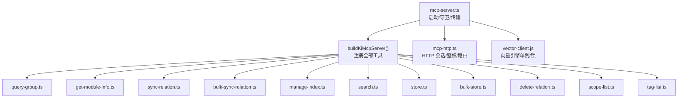
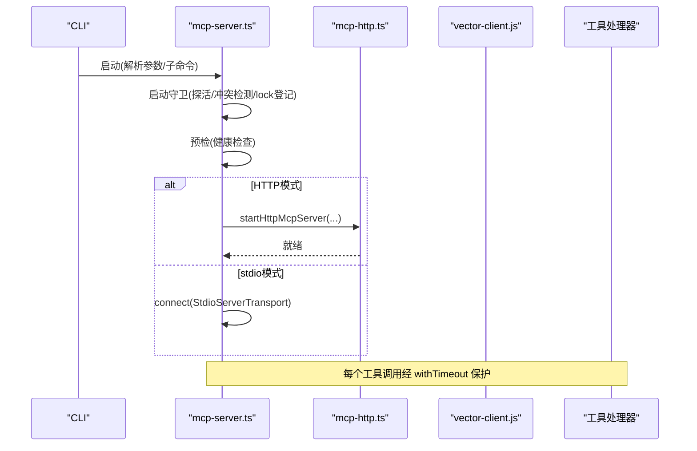
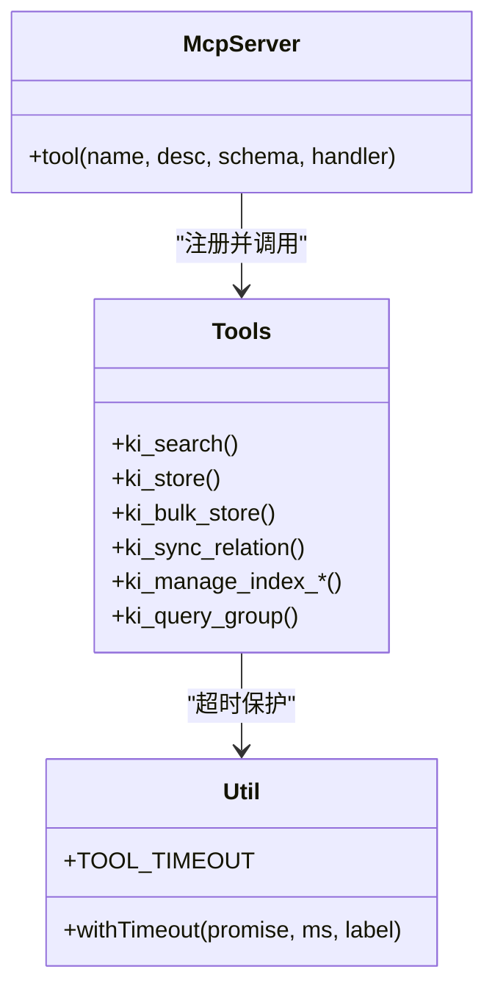
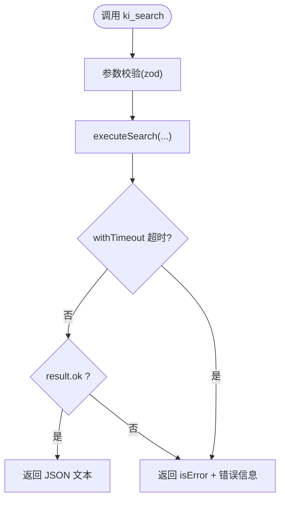
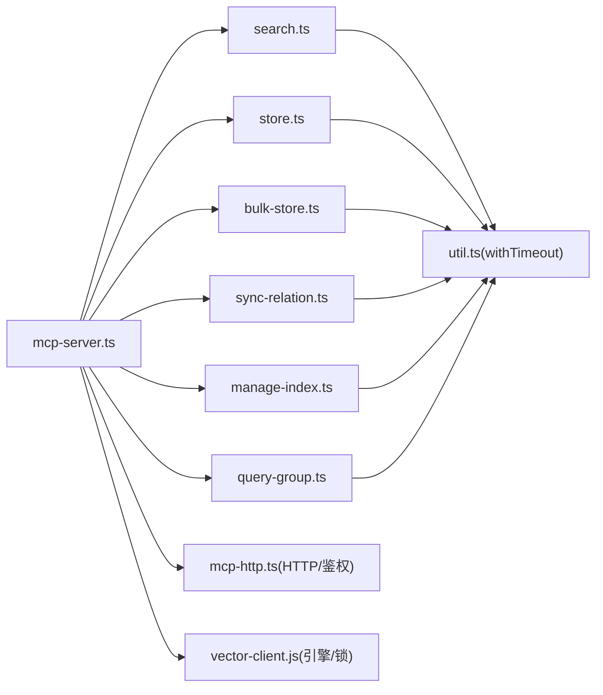

# MCP工具扩展

<cite>
**本文引用的文件**
- [src/mcp-server.ts](file://src/mcp-server.ts)
- [src/lib/mcp-tools/search.ts](file://src/lib/mcp-tools/search.ts)
- [src/lib/mcp-tools/store.ts](file://src/lib/mcp-tools/store.ts)
- [src/lib/mcp-tools/bulk-store.ts](file://src/lib/mcp-tools/bulk-store.ts)
- [src/lib/mcp-tools/sync-relation.ts](file://src/lib/mcp-tools/sync-relation.ts)
- [src/lib/mcp-tools/manage-index.ts](file://src/lib/mcp-tools/manage-index.ts)
- [src/lib/mcp-tools/query-group.ts](file://src/lib/mcp-tools/query-group.ts)
- [src/lib/mcp-tools/util.ts](file://src/lib/mcp-tools/util.ts)
- [docs/mcp-http.md](file://docs/mcp-http.md)
</cite>

## 目录
1. [简介](#简介)
2. [项目结构](#项目结构)
3. [核心组件](#核心组件)
4. [架构总览](#架构总览)
5. [详细组件分析](#详细组件分析)
6. [依赖关系分析](#依赖关系分析)
7. [性能与并发](#性能与并发)
8. [故障排查指南](#故障排查指南)
9. [结论](#结论)
10. [附录：扩展示例与最佳实践](#附录扩展示例与最佳实践)

## 简介
本文件面向 knowledge-indexer 的 MCP（Model Context Protocol）工具扩展，系统性说明工具的注册机制、接口规范、生命周期管理、权限控制、并发模型、错误处理与超时策略，并提供从设计到部署的完整开发流程与扩展示例。读者可据此快速添加新的知识库操作工具、搜索增强工具或数据管理工具，并掌握测试、调试与性能优化方法。

## 项目结构
MCP 服务由统一入口构建服务器实例，集中注册各工具模块；每个工具以独立文件实现参数校验、执行逻辑与错误封装，并通过公共工具层提供超时保护。HTTP 模式支持多 IDE 共享单例进程，stdio 模式为单客户端单进程。

图表来源
- [src/mcp-server.ts:54-70](file://src/mcp-server.ts#L54-L70)
- [docs/mcp-http.md:234-241](file://docs/mcp-http.md#L234-L241)

章节来源
- [src/mcp-server.ts:54-70](file://src/mcp-server.ts#L54-L70)
- [docs/mcp-http.md:1-10](file://docs/mcp-http.md#L1-L10)

## 核心组件
- 服务器构建与工具注册：通过工厂函数创建 McpServer 实例并批量注册工具，支持传入授权 scope 集合用于 RBAC 过滤。
- 工具定义与参数校验：每个工具使用 zod schema 声明参数与默认值，确保类型安全与可读提示。
- 执行包装与超时：所有工具调用经 withTimeout 包裹，按只读/写入/批量设置不同超时阈值，避免长驻进程阻塞。
- 错误返回约定：业务失败返回 { ok: false } 的结构化结果；异常捕获后以 isError: true + 文本内容返回，便于上层统一处理。
- 权限控制：HTTP 模式下对 tools/call 进行鉴权与 scope 越权校验；枚举类工具在工具层按授权 scope 过滤输出。

章节来源
- [src/mcp-server.ts:54-70](file://src/mcp-server.ts#L54-L70)
- [src/lib/mcp-tools/util.ts:1-43](file://src/lib/mcp-tools/util.ts#L1-L43)
- [docs/mcp-http.md:132-144](file://docs/mcp-http.md#L132-L144)

## 架构总览
MCP 服务支持两种传输：
- stdio：单客户端单进程，适合本地 IDE 直连。
- HTTP：多 IDE 共享单例进程，统一持锁访问向量库，具备会话管理与鉴权能力。

启动流程包含：
- 命令行解析与子命令分发（token/restart/status/stop）。
- 启动守卫：检测健康实例复用、stdio 冲突防护、lock 登记。
- 预检：运行健康检查，失败则拒绝启动。
- 启动传输：HTTP 或 stdio，连接后进入请求处理。

图表来源
- [src/mcp-server.ts:492-733](file://src/mcp-server.ts#L492-L733)
- [docs/mcp-http.md:147-166](file://docs/mcp-http.md#L147-L166)

章节来源
- [src/mcp-server.ts:492-733](file://src/mcp-server.ts#L492-L733)
- [docs/mcp-http.md:147-166](file://docs/mcp-http.md#L147-L166)

## 详细组件分析

### 工具注册机制与生命周期
- 注册点：buildKiMcpServer 集中调用各 registerXxxTool 函数完成工具注册。
- 生命周期：
  - 进程级：HTTP 单例常驻，维护会话表与空闲回收；stdio 随客户端断开退出。
  - 请求级：每个工具调用经过参数校验、超时保护、业务执行、错误封装。
  - 资源级：向量引擎懒加载、空闲释放锁，避免长时间占用。

图表来源
- [src/mcp-server.ts:54-70](file://src/mcp-server.ts#L54-L70)
- [src/lib/mcp-tools/util.ts:1-43](file://src/lib/mcp-tools/util.ts#L1-L43)

章节来源
- [src/mcp-server.ts:54-70](file://src/mcp-server.ts#L54-L70)

### 搜索增强工具（ki_search）
- 功能：语义检索知识库内容，支持 scope、查询文本、限制条数、相似度阈值、标签过滤、是否返回原文等。
- 参数校验：zod 定义可选/必填与默认值，描述信息用于生成工具元数据。
- 执行逻辑：调用 executeSearch，经 withTimeout 包装，按 WRITE 超时保护。
- 错误处理：业务失败返回结构化结果；异常捕获后以 isError 形式返回。

图表来源
- [src/lib/mcp-tools/search.ts:6-49](file://src/lib/mcp-tools/search.ts#L6-L49)
- [src/lib/mcp-tools/util.ts:24-32](file://src/lib/mcp-tools/util.ts#L24-L32)

章节来源
- [src/lib/mcp-tools/search.ts:6-49](file://src/lib/mcp-tools/search.ts#L6-L49)

### 数据存储工具（ki_store / ki_bulk_store）
- ki_store：单条存储文本到向量索引，支持 scope、tags。
- ki_bulk_store：批量导入，输入为 JSON 文件路径，适用于大规模入库。
- 两者均使用 withTimeout 保护，批量场景采用更长的超时阈值。

章节来源
- [src/lib/mcp-tools/store.ts:6-44](file://src/lib/mcp-tools/store.ts#L6-L44)
- [src/lib/mcp-tools/bulk-store.ts:6-42](file://src/lib/mcp-tools/bulk-store.ts#L6-L42)
- [src/lib/mcp-tools/util.ts:34-42](file://src/lib/mcp-tools/util.ts#L34-L42)

### 关系同步工具（ki_sync_relation）
- 功能：写入/更新 Relation 与本地 KB，自动补建 Group 树，可选择是否写入向量层。
- 参数：scope、group、relation、module_info、vector、tags。
- 超时：WRITE 级别，保证单次写入不阻塞后续请求。

章节来源
- [src/lib/mcp-tools/sync-relation.ts:6-44](file://src/lib/mcp-tools/sync-relation.ts#L6-L44)

### 索引管理工具（ki_manage_index_*）
- 工具集：create、list、delete（空节点）。
- 权限：list 工具按当前会话授权 scope 过滤输出，避免泄露未授权 scope。
- 删除边界：仅允许删除空节点，非空节点需走其他清理流程或 CLI 级联删除。

章节来源
- [src/lib/mcp-tools/manage-index.ts:13-112](file://src/lib/mcp-tools/manage-index.ts#L13-L112)

### 分组查询工具（ki_query_group）
- 功能：查询 Group 树、Relations 与词云，支持多种展示分区与语义兜底。
- 参数：scope、groups/group、hot_count、depth、mode、auto_fallback。
- 超时：READ 级别，保障只读查询响应及时。

章节来源
- [src/lib/mcp-tools/query-group.ts:6-54](file://src/lib/mcp-tools/query-group.ts#L6-L54)

## 依赖关系分析
- 服务器与工具：mcp-server.ts 负责构建与注册，工具模块各自实现具体能力。
- 工具与底层：工具调用对应业务模块（如 search、store、sync-relation、manage-index），并通过 util 提供超时保护。
- 传输与鉴权：HTTP 模式通过 mcp-http.ts 提供会话、鉴权与路由；stdio 模式直接基于 StdioServerTransport。
- 资源与锁：vector-client.js 提供向量引擎单例与锁管理，HTTP 单例确保唯一持锁进程。

图表来源
- [src/mcp-server.ts:54-70](file://src/mcp-server.ts#L54-L70)
- [src/lib/mcp-tools/util.ts:1-43](file://src/lib/mcp-tools/util.ts#L1-L43)
- [docs/mcp-http.md:234-241](file://docs/mcp-http.md#L234-L241)

章节来源
- [src/mcp-server.ts:54-70](file://src/mcp-server.ts#L54-L70)
- [docs/mcp-http.md:234-241](file://docs/mcp-http.md#L234-L241)

## 性能与并发
- 超时保护：READ/WRITE/BULK 三级超时，避免长任务阻塞服务端。
- 向量库锁：HTTP 单例唯一持锁，stdio 多实例错开共享（空闲释放+撞锁重试）。
- 会话管理：HTTP 模式支持并发会话、空闲回收与会话上限，防止内存泄漏。
- 建议：
  - 批量写入优先使用 ki_bulk_store，减少 embedding 与写入次数。
  - 合理设置 limit/threshold/tags 缩小检索范围。
  - 远程部署时启用鉴权与 Host 白名单，降低安全风险。

章节来源
- [src/lib/mcp-tools/util.ts:34-42](file://src/lib/mcp-tools/util.ts#L34-L42)
- [docs/mcp-http.md:9-10](file://docs/mcp-http.md#L9-L10)
- [docs/mcp-http.md:234-241](file://docs/mcp-http.md#L234-L241)

## 故障排查指南
- 启动预检失败：查看健康检查报告，修复配置或依赖后再启动。
- 端口占用/地址不可用：根据错误码定位（EADDRINUSE/EADDRNOTAVAIL/ENOTFOUND），更换端口或修正 host。
- 鉴权失败（401）：确认 Authorization 头与 Token 一致；回环绑定免鉴权，Token 不生效属预期。
- 越权拒绝（403）：检查 Token 授权 scope 与请求 scope 是否匹配；枚举工具无参调用不受此限。
- 工具超时：关注日志中的 TOOL_TIMEOUT 错误，评估是否需要增大超时或优化下游服务。
- 一键关闭：使用 stop 命令关闭所有实例并清理 lock，避免残留进程影响。

章节来源
- [src/mcp-server.ts:660-678](file://src/mcp-server.ts#L660-L678)
- [docs/mcp-http.md:132-144](file://docs/mcp-http.md#L132-L144)
- [docs/mcp-http.md:170-189](file://docs/mcp-http.md#L170-L189)

## 结论
knowledge-indexer 的 MCP 工具扩展提供了统一的注册机制、严格的参数校验、完善的超时与错误处理、以及安全的鉴权与会话管理。通过 HTTP 单例与向量库锁机制，实现了多 IDE 共享与高并发下的稳定运行。遵循本文档的扩展示例与最佳实践，可高效地新增与集成新的 MCP 工具。

## 附录：扩展示例与最佳实践

### 新增工具开发步骤
- 新建工具文件：在 src/lib/mcp-tools 下创建 xxx.ts，导出 registerXxxTool(server)。
- 定义参数：使用 zod 声明参数、默认值与描述，便于自动生成工具元数据。
- 实现执行逻辑：调用对应业务模块，使用 withTimeout 包裹，按 READ/WRITE/BULK 选择超时。
- 错误处理：业务失败返回结构化结果；异常捕获后以 isError 返回文本。
- 注册工具：在 buildKiMcpServer 中引入并调用 registerXxxTool(server)。
- 权限控制：如需按 scope 过滤，参考 manage-index list 的实现方式。

章节来源
- [src/lib/mcp-tools/search.ts:6-49](file://src/lib/mcp-tools/search.ts#L6-L49)
- [src/lib/mcp-tools/manage-index.ts:46-71](file://src/lib/mcp-tools/manage-index.ts#L46-L71)
- [src/mcp-server.ts:54-70](file://src/mcp-server.ts#L54-L70)

### 工具间依赖与协作
- 搜索与存储：先通过 store/bulk-store 写入，再用 search 检索，形成“写-读”闭环。
- 关系与索引：sync-relation 写入 Relation 与 KB，manage-index 管理 Group 树结构。
- 分组查询：query-group 聚合 Group、Relation 与词云，辅助导航与概览。

章节来源
- [src/lib/mcp-tools/sync-relation.ts:6-44](file://src/lib/mcp-tools/sync-relation.ts#L6-L44)
- [src/lib/mcp-tools/manage-index.ts:13-112](file://src/lib/mcp-tools/manage-index.ts#L13-L112)
- [src/lib/mcp-tools/query-group.ts:6-54](file://src/lib/mcp-tools/query-group.ts#L6-L54)

### 测试与调试
- 单元测试：针对工具参数校验与执行分支编写用例，覆盖正常与异常路径。
- 集成测试：通过 HTTP 或 stdio 调用工具，验证端到端行为与错误返回。
- 调试技巧：
  - 使用 ki mcp --status 检查实例状态与锁情况。
  - 观察 stderr 输出与 healthz 探活结果。
  - 利用 withTimeout 的错误码区分超时与业务失败。

章节来源
- [docs/mcp-http.md:105-131](file://docs/mcp-http.md#L105-L131)
- [src/lib/mcp-tools/util.ts:11-18](file://src/lib/mcp-tools/util.ts#L11-L18)

### 部署与运维
- 本地开发：stdio 模式快速验证；生产环境推荐 HTTP 单例。
- 远程暴露：前置 TLS 反代，启用鉴权与 Host 白名单。
- 守护与重启：使用 --daemon 后台常驻，restart 幂等重启，stop 一键关闭。
- 监控：定期探活 /healthz，结合日志与指标评估服务健康。

章节来源
- [docs/mcp-http.md:191-232](file://docs/mcp-http.md#L191-L232)
- [docs/mcp-http.md:243-266](file://docs/mcp-http.md#L243-L266)