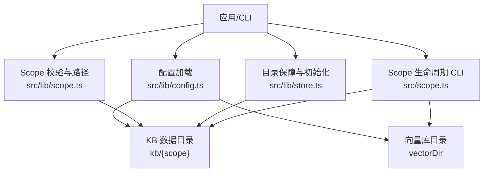
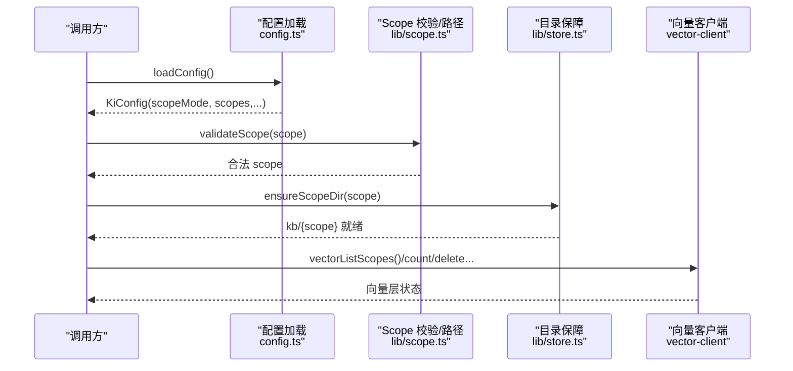
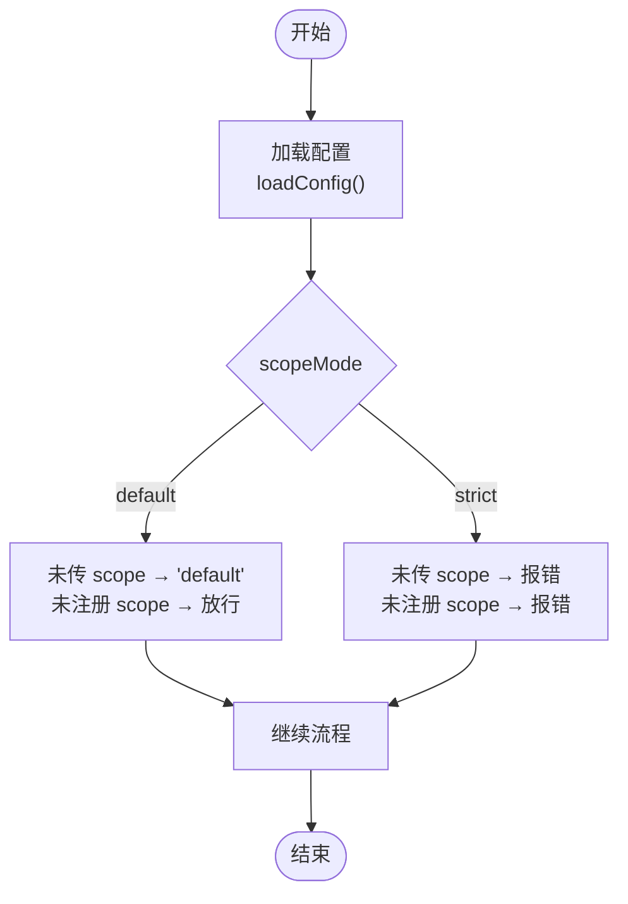
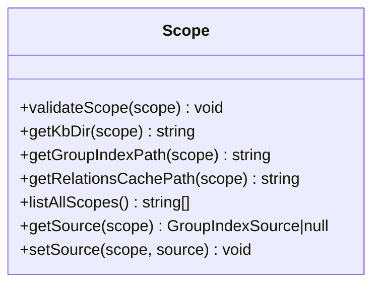
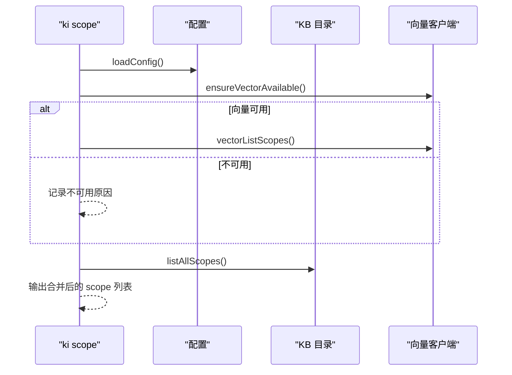
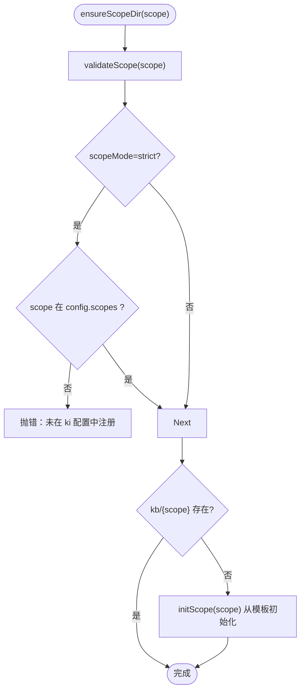
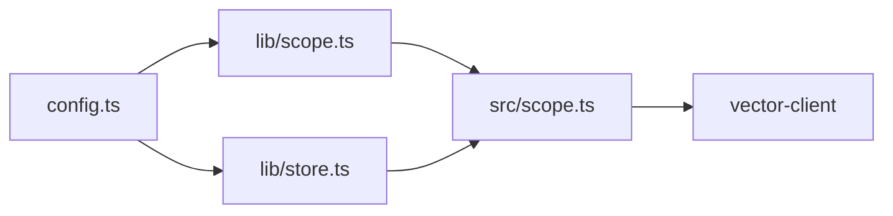

# Scope映射扩展

<cite>
**本文引用的文件**
- [src/lib/config.ts](file://src/lib/config.ts)
- [src/lib/scope.ts](file://src/lib/scope.ts)
- [src/scope.ts](file://src/scope.ts)
- [src/lib/store.ts](file://src/lib/store.ts)
- [docs/configuration.md](file://docs/configuration.md)
- [test/scope-isolation.test.ts](file://test/scope-isolation.test.ts)
- [test/scope-mode.test.ts](file://test/scope-mode.test.ts)
- [test/test-config.ts](file://test/test-config.ts)
- [.e2e-run/ki-config.yaml](file://.e2e-run/ki-config.yaml)
</cite>

## 目录
1. [简介](#简介)
2. [项目结构](#项目结构)
3. [核心组件](#核心组件)
4. [架构总览](#架构总览)
5. [详细组件分析](#详细组件分析)
6. [依赖关系分析](#依赖关系分析)
7. [性能与缓存](#性能与缓存)
8. [故障排查指南](#故障排查指南)
9. [结论](#结论)
10. [附录：配置语法与示例](#附录配置语法与示例)

## 简介
本文件面向 knowledge-indexer 的 Scope 映射扩展，系统性说明 Scope 隔离机制的工作原理、重要性以及通过配置文件实现“项目到 Scope”的动态映射方法。文档覆盖配置语法、匹配规则与优先级机制，提供基于文件路径、Git 仓库、用户身份等场景的映射实践；并给出性能考虑、缓存策略、动态更新机制与故障排查建议，帮助在多项目环境中正确配置与管理 Scope。

## 项目结构
Scope 相关能力由以下模块协同实现：
- 配置加载与解析：src/lib/config.ts（含 scopeMode、scopes、路径展开、默认值）
- Scope 校验与路径构造：src/lib/scope.ts（validateScope、getKbDir、listAllScopes、group-index/source 读写）
- Scope 生命周期 CLI：src/scope.ts（list/delete/clear）
- Scope 初始化与目录保障：src/lib/store.ts（ensureScopeDir、initScope）
- 文档与示例：docs/configuration.md、.e2e-run/ki-config.yaml
- 测试用例：test/scope-isolation.test.ts、test/scope-mode.test.ts、test/test-config.ts

图表来源
- [src/lib/config.ts:148-359](file://src/lib/config.ts#L148-L359)
- [src/lib/scope.ts:30-77](file://src/lib/scope.ts#L30-L77)
- [src/scope.ts:94-132](file://src/scope.ts#L94-L132)
- [src/lib/store.ts:168-200](file://src/lib/store.ts#L168-L200)

章节来源
- [src/lib/config.ts:148-359](file://src/lib/config.ts#L148-L359)
- [src/lib/scope.ts:30-77](file://src/lib/scope.ts#L30-L77)
- [src/scope.ts:94-132](file://src/scope.ts#L94-L132)
- [src/lib/store.ts:168-200](file://src/lib/store.ts#L168-L200)

## 核心组件
- 配置系统（config.ts）
  - 支持 YAML/JSON，查找顺序：--config > KI_CONFIG_PATH > ~/.ki/config.yaml|yml|json > 内置默认
  - 解析 scopeMode（default/strict）、scopes（scope→kbDir/wikiSync/clean/import）
  - 提供 resolveScope、getScopeDataDir、removeScopeFromConfigFile 等工具
- Scope 校验与路径（lib/scope.ts）
  - validateScope：仅允许字母、数字、连字符、下划线，拒绝路径遍历
  - getKbDir/getGroupIndexPath/getRelationsCachePath：按 scope 定位 KB 数据
  - listAllScopes：扫描 dataDir 与 config.scopes，返回已初始化的 scope 集合
- 生命周期 CLI（src/scope.ts）
  - list：合并 KB 层、向量层、config.scopes 中的 scope 列表，标注存在性与文档数
  - delete：删除向量 + KB 目录 + 配置条目（需 --yes）
  - clear：清空向量或 KB 内容（可按 tag 过滤）
- 目录保障（lib/store.ts）
  - ensureScopeDir：在 strict 模式下强制白名单校验；否则自动创建新 scope 目录
  - initScope：从模板初始化 group-index.json、relations-cache.json 等

章节来源
- [src/lib/config.ts:148-359](file://src/lib/config.ts#L148-L359)
- [src/lib/scope.ts:30-77](file://src/lib/scope.ts#L30-L77)
- [src/scope.ts:94-132](file://src/scope.ts#L94-L132)
- [src/lib/store.ts:168-200](file://src/lib/store.ts#L168-L200)

## 架构总览
Scope 隔离的核心在于“以 scope 为键的多副本存储”，每个 scope 拥有独立的 KB 目录与向量元数据，互不干扰。配置层负责将外部“项目标识”映射到内部 scope 名称，并通过 scopeMode 控制是否允许未注册 scope。

图表来源
- [src/lib/config.ts:148-359](file://src/lib/config.ts#L148-L359)
- [src/lib/scope.ts:30-77](file://src/lib/scope.ts#L30-L77)
- [src/lib/store.ts:168-200](file://src/lib/store.ts#L168-L200)
- [src/scope.ts:94-132](file://src/scope.ts#L94-L132)

## 详细组件分析

### 配置加载与 Scope 护栏（config.ts）
- 配置文件查找与解析：YAML/JSON 统一处理，路径展开支持 $HOME/~/相对路径
- scopeMode 语义：
  - default：未传 scope 时落 default；未注册 scope 也放行（自动创建）
  - strict：必须显式传入 scope，且必须在 config.scopes 白名单中，否则报错
- scopes 映射：
  - kbDir：scope 级 KB 基础目录，实际数据位于 kbDir/kb/{scope}，未配置回退到 dataDir/{scope}
  - wikiSync/clean/import：scope 级导入与清洗行为开关
- 辅助函数：
  - resolveScope：根据 scopeMode 决定缺省/未注册 scope 的处理
  - getScopeDataDir：计算 scope 的实际数据目录
  - removeScopeFromConfigFile：删除 scopes 条目并刷新缓存

图表来源
- [src/lib/config.ts:288-359](file://src/lib/config.ts#L288-L359)
- [src/lib/config.ts:444-459](file://src/lib/config.ts#L444-L459)

章节来源
- [src/lib/config.ts:148-359](file://src/lib/config.ts#L148-L359)
- [src/lib/config.ts:444-459](file://src/lib/config.ts#L444-L459)

### Scope 校验与路径构造（lib/scope.ts）
- validateScope：正则 /^[a-zA-Z0-9_-]+$/，空或非法字符抛出 ScopeError（EMPTY_SCOPE/INVALID_SCOPE）
- getKbDir：优先使用 scopes[scope].kbDir/kb/{scope}，否则 dataDir/{scope}
- listAllScopes：扫描 dataDir 下包含 relations-cache.json 的目录，并合并 config.scopes 中存在的 scope
- group-index/source：读取/写入 source 块，记录导入源与切分参数

图表来源
- [src/lib/scope.ts:30-77](file://src/lib/scope.ts#L30-L77)
- [src/lib/scope.ts:174-198](file://src/lib/scope.ts#L174-L198)
- [src/lib/scope.ts:92-102](file://src/lib/scope.ts#L92-L102)
- [src/lib/scope.ts:205-229](file://src/lib/scope.ts#L205-L229)

章节来源
- [src/lib/scope.ts:30-77](file://src/lib/scope.ts#L30-L77)
- [src/lib/scope.ts:174-198](file://src/lib/scope.ts#L174-L198)
- [src/lib/scope.ts:92-102](file://src/lib/scope.ts#L92-L102)
- [src/lib/scope.ts:205-229](file://src/lib/scope.ts#L205-L229)

### Scope 生命周期 CLI（src/scope.ts）
- list：合并 KB 层、向量层、config.scopes 中的 scope，输出存在性标记与文档数
- delete：删除向量文档、KB 目录、配置条目（需 --yes）
- clear：清空向量或 KB 内容（可按 tag 过滤），保留 scope 与配置

图表来源
- [src/scope.ts:94-132](file://src/scope.ts#L94-L132)
- [src/scope.ts:145-179](file://src/scope.ts#L145-L179)
- [src/scope.ts:192-221](file://src/scope.ts#L192-L221)

章节来源
- [src/scope.ts:94-132](file://src/scope.ts#L94-L132)
- [src/scope.ts:145-179](file://src/scope.ts#L145-L179)
- [src/scope.ts:192-221](file://src/scope.ts#L192-L221)

### 目录保障与初始化（lib/store.ts）
- ensureScopeDir：
  - 先 validateScope
  - strict 模式且 _configPath 存在但 scope 未注册 → 抛错
  - 目录不存在则 initScope 从模板初始化
- initScope：复制 _template 下的模板文件，生成 group-index.json、relations-cache.json 等
- readGroupIndex：读取并迁移旧格式 roots→groups，同时迁移 relations-cache 的旧 key

图表来源
- [src/lib/store.ts:168-200](file://src/lib/store.ts#L168-L200)
- [src/lib/scope.ts:30-77](file://src/lib/scope.ts#L30-L77)

章节来源
- [src/lib/store.ts:168-200](file://src/lib/store.ts#L168-L200)

## 依赖关系分析
- 配置层（config.ts）被所有模块引用，提供 scopeMode、scopes、路径解析
- lib/scope.ts 依赖 config.ts 获取 dataDir/scopes，提供路径与枚举
- src/scope.ts 依赖 lib/scope.ts 与 vector-client，实现 CLI 操作
- lib/store.ts 依赖 lib/scope.ts 与 constants，负责目录与模板初始化

图表来源
- [src/lib/config.ts:148-359](file://src/lib/config.ts#L148-L359)
- [src/lib/scope.ts:30-77](file://src/lib/scope.ts#L30-L77)
- [src/scope.ts:94-132](file://src/scope.ts#L94-L132)
- [src/lib/store.ts:168-200](file://src/lib/store.ts#L168-L200)

章节来源
- [src/lib/config.ts:148-359](file://src/lib/config.ts#L148-L359)
- [src/lib/scope.ts:30-77](file://src/lib/scope.ts#L30-L77)
- [src/scope.ts:94-132](file://src/scope.ts#L94-L132)
- [src/lib/store.ts:168-200](file://src/lib/store.ts#L168-L200)

## 性能与缓存
- 配置缓存：loadConfig 进程内缓存一次，避免重复 IO；修改配置后需重启服务或调用 resetConfigCache
- 向量层：所有 scope 共享 collection，通过 metadata 隔离；list/delete/clear 均走向量客户端
- 磁盘 I/O：listAllScopes 会扫描 dataDir 并读取 relations-cache.json，建议在批量操作中复用结果
- 建议：
  - 多项目环境建议使用 strict 模式，减少误用未注册 scope 的风险
  - 对频繁访问的 scope 保持其 KB 目录与 relations-cache 稳定，避免频繁重建
  - 向量库 schema 变更需重建 collection，注意影响范围

章节来源
- [src/lib/config.ts:141-181](file://src/lib/config.ts#L141-L181)
- [src/lib/scope.ts:174-198](file://src/lib/scope.ts#L174-L198)
- [docs/configuration.md:59-66](file://docs/configuration.md#L59-L66)

## 故障排查指南
- 常见错误
  - EMPTY_SCOPE：scope 为空或未传（strict 模式必须显式传入）
  - INVALID_SCOPE：包含非法字符或路径遍历字符（如 /、..）
  - unknown scope：strict 模式下 scope 未在 config.scopes 注册
  - 向量服务不可用：list/delete/clear 需要向量服务可用，否则会失败并提示原因
- 诊断步骤
  - 检查配置文件是否存在与可读：ki config init 可生成模板
  - 确认 scopeMode 与 scopes 白名单是否正确
  - 使用 ki scope list 查看两层（KB/向量）的 scope 存在性
  - 若删除/清理失败，确保 --yes 与向量服务可用
- 参考测试
  - 隔离性验证：相同 Group/Relation 在不同 scope 下独立存储与查询
  - 模式语义验证：default/strict 下 ensureScopeDir 的行为差异

章节来源
- [src/lib/scope.ts:30-43](file://src/lib/scope.ts#L30-L43)
- [src/lib/config.ts:444-459](file://src/lib/config.ts#L444-L459)
- [src/scope.ts:94-132](file://src/scope.ts#L94-L132)
- [test/scope-isolation.test.ts:50-153](file://test/scope-isolation.test.ts#L50-L153)
- [test/scope-mode.test.ts:43-97](file://test/scope-mode.test.ts#L43-L97)

## 结论
knowledge-indexer 的 Scope 映射扩展通过“配置驱动 + 严格护栏”的方式，实现了多项目的物理隔离与灵活映射。借助 scopeMode 与 scopes 配置，可在不同环境下平衡易用性与安全性；配合 CLI 的生命周期管理，便于运维与排障。推荐在生产环境采用 strict 模式，并在配置中明确每个项目的 scope 与 KB 目录映射，确保数据边界清晰、可追溯。

## 附录：配置语法与示例
- 配置文件位置与优先级：见 docs/configuration.md
- 顶层字段：dataDir、backupDir、vectorDir、embedding、scopeMode、scopes、mcp
- scopes 映射：
  - kbDir：scope 级 KB 基础目录，实际数据位于 kbDir/kb/{scope}
  - wikiSync/clean/import：scope 级导入与清洗行为
- 示例：
  - e2e 配置：.e2e-run/ki-config.yaml 展示了 dataDir/vectorDir/embedding/scopeMode/scopes 的基本用法
  - 完整示例：docs/configuration.md 提供了完整的 YAML 示例

章节来源
- [docs/configuration.md:27-120](file://docs/configuration.md#L27-L120)
- [docs/configuration.md:180-227](file://docs/configuration.md#L180-L227)
- [.e2e-run/ki-config.yaml:1-18](file://.e2e-run/ki-config.yaml#L1-L18)