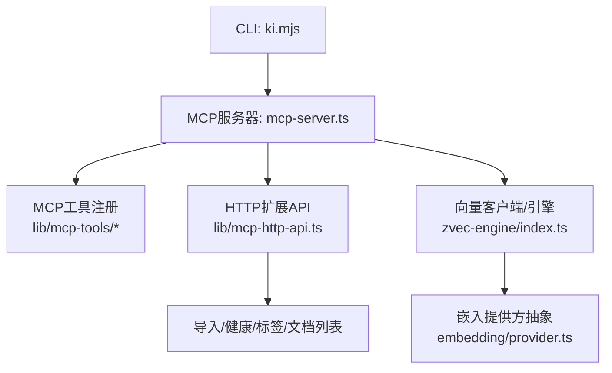
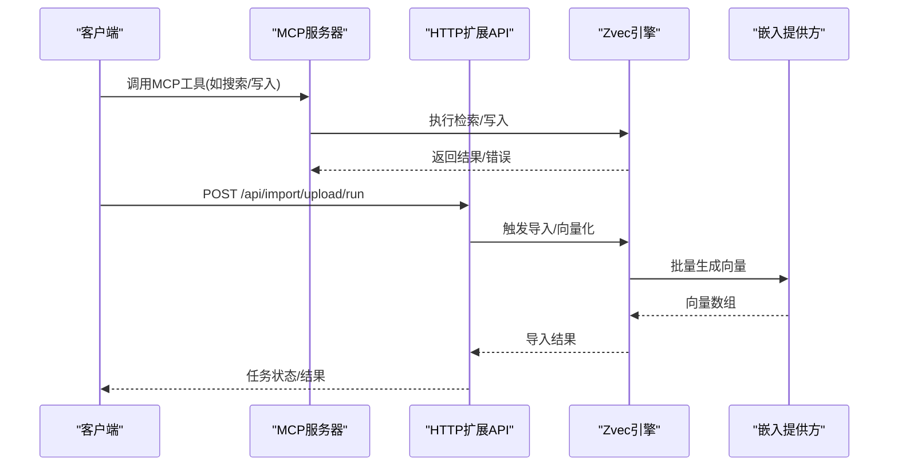
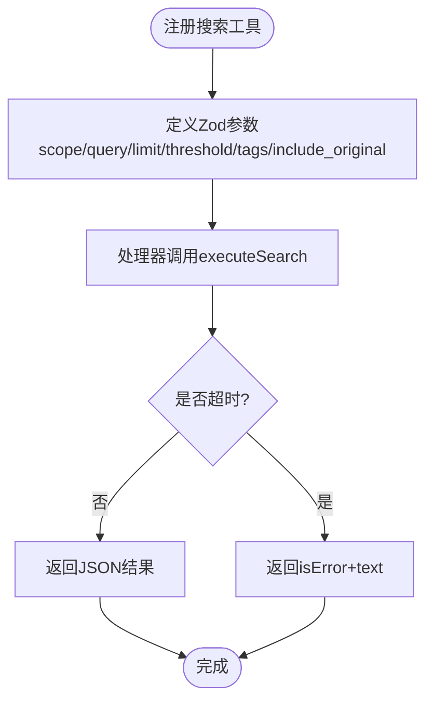
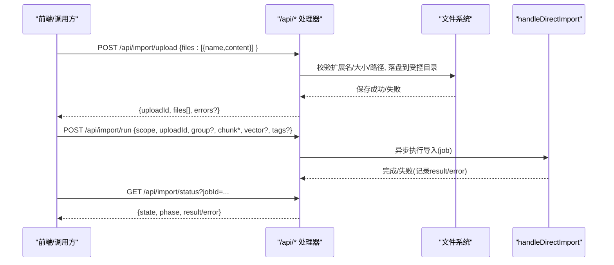
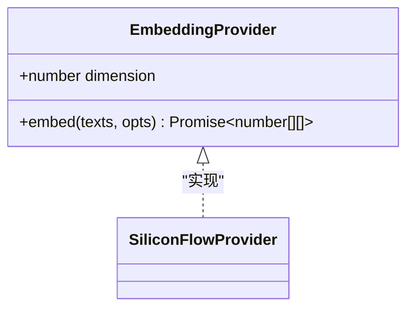
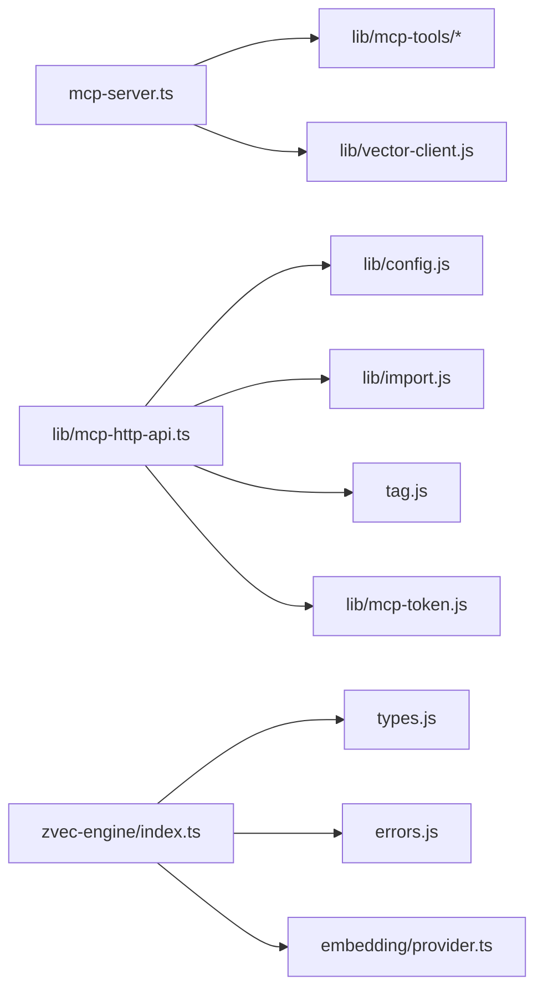

# 扩展开发指南

<cite>
**本文引用的文件**
- [README.md](file://README.md)
- [package.json](file://package.json)
- [mcp-server.ts](file://src/mcp-server.ts)
- [mcp-http-api.ts](file://src/lib/mcp-http-api.ts)
- [search.ts（MCP工具）](file://src/lib/mcp-tools/search.ts)
- [provider.ts（Embedding抽象）](file://src/zvec-engine/embedding/provider.ts)
- [index.ts（zvec引擎门面）](file://src/zvec-engine/index.ts)
- [config.ts（配置示例片段）](file://src/config.ts)
- [test-config.ts（测试配置）](file://test/test-config.ts)
- [error-handling.md](file://docs/error-handling.md)
</cite>

## 目录
1. [简介](#简介)
2. [项目结构](#项目结构)
3. [核心组件](#核心组件)
4. [架构总览](#架构总览)
5. [详细组件分析](#详细组件分析)
6. [依赖关系分析](#依赖关系分析)
7. [性能与优化](#性能与优化)
8. [故障排查指南](#故障排查指南)
9. [结论](#结论)
10. [附录：扩展示例与清单](#附录扩展示例与清单)

## 简介
本指南面向希望在 knowledge-indexer（kisearch）中开发扩展的工程师，覆盖从环境搭建、代码组织、测试策略到发布流程的完整工作流；并聚焦扩展点最佳实践（接口设计、错误处理、性能优化、兼容性），提供多种扩展示例（MCP工具、HTTP API、向量嵌入提供方等），以及调试、日志、监控指标建议、代码审查清单、质量保证与版本管理策略。目标是帮助开发者快速上手并产出高质量扩展。

## 项目结构
- 入口与命令：通过 bin/ki.mjs 暴露 CLI，内部由 src/mcp-server.ts 统一启动 MCP Server（stdio/http），并在 HTTP 模式下挂载 /api/* 扩展路由。
- 扩展点：
  - MCP 工具注册：在 mcp-server.ts 中集中注册各工具（搜索、写入、索引管理等）。
  - HTTP API 扩展：在 src/lib/mcp-http-api.ts 中实现 /api/health、/api/tags、/api/doc/list、/api/import/* 等。
  - 向量嵌入提供方：通过 src/zvec-engine/embedding/provider.ts 定义的 EmbeddingProvider 接口扩展不同厂商。
  - 引擎门面：src/zvec-engine/index.ts 对外暴露类型化能力与异常契约，便于上层稳定集成。
- 配置与环境：src/config.ts 提供配置样例（embedding、scopeMode 等），test/test-config.ts 提供测试隔离配置。
- 文档与错误：docs/error-handling.md 汇总常见错误与恢复步骤。

图表来源
- [mcp-server.ts:54-70](file://src/mcp-server.ts#L54-L70)
- [mcp-http-api.ts:216-271](file://src/lib/mcp-http-api.ts#L216-L271)
- [index.ts:12-45](file://src/zvec-engine/index.ts#L12-L45)
- [provider.ts:20-28](file://src/zvec-engine/embedding/provider.ts#L20-L28)

章节来源
- [README.md:35-103](file://README.md#L35-L103)
- [package.json:1-68](file://package.json#L1-L68)

## 核心组件
- MCP 服务器与工具注册：构建 McpServer 实例并注册全部工具，支持 stdio 与 HTTP 共享单例模式，内置鉴权与预检。
- HTTP 扩展 API：在 /api/* 下提供健康检查、标签/文档列表、导入上传/运行/状态查询等能力，具备 scope 授权校验与限流保护。
- 向量引擎门面：导出 ZvecEngine、类型与异常契约，屏蔽 Worker/Embedding 内部细节，保证上层稳定调用。
- 嵌入提供方抽象：定义 EmbeddingProvider 接口（维度、embed 方法、批大小、重试、超时、进度回调），便于替换不同厂商。
- 配置与测试：提供默认配置样例与测试隔离配置，确保本地开发与测试可独立运行。

章节来源
- [mcp-server.ts:54-70](file://src/mcp-server.ts#L54-L70)
- [mcp-http-api.ts:216-271](file://src/lib/mcp-http-api.ts#L216-L271)
- [index.ts:12-45](file://src/zvec-engine/index.ts#L12-L45)
- [provider.ts:20-28](file://src/zvec-engine/embedding/provider.ts#L20-L28)
- [config.ts:88-104](file://src/config.ts#L88-L104)
- [test-config.ts:24-43](file://test/test-config.ts#L24-L43)

## 架构总览
下图展示了扩展点在系统中的位置与交互：MCP 工具与 HTTP API 作为扩展入口，调用底层向量引擎与嵌入提供方；配置与鉴权贯穿请求链路。

图表来源
- [mcp-server.ts:54-70](file://src/mcp-server.ts#L54-L70)
- [mcp-http-api.ts:216-271](file://src/lib/mcp-http-api.ts#L216-L271)
- [index.ts:12-45](file://src/zvec-engine/index.ts#L12-L45)
- [provider.ts:20-28](file://src/zvec-engine/embedding/provider.ts#L20-L28)

## 详细组件分析

### MCP 工具扩展（以搜索为例）
- 扩展点：在 lib/mcp-tools 下新增或修改工具注册函数，使用 Zod 定义输入参数，并通过 server.tool 注册。
- 关键要点：
  - 参数校验：使用 Zod 描述必填/可选字段与默认值。
  - 超时控制：通过 withTimeout 包装耗时操作，避免阻塞。
  - 错误返回：统一以 isError + text 形式返回，不抛异常。
  - 作用域：scope 缺省为 default，strict 模式下必须显式传入。

图表来源
- [search.ts（MCP工具）:6-49](file://src/lib/mcp-tools/search.ts#L6-L49)

章节来源
- [search.ts（MCP工具）:6-49](file://src/lib/mcp-tools/search.ts#L6-L49)

### HTTP API 扩展（导入链路）
- 扩展点：在 lib/mcp-http-api.ts 中新增路由处理器，复用鉴权、scope 校验、限流与缓存机制。
- 关键要点：
  - 鉴权：非回环地址需 Bearer Token，支持全权临时 Token 或多 Token 存储。
  - Scope 越权：对带 scope 的只读接口进行授权集合校验。
  - 导入：POST /api/import/upload → run → status，异步 job 内存 Map 管理，TTL 清理。
  - 安全：文件名白名单、路径穿越防护、文件大小限制。

图表来源
- [mcp-http-api.ts:371-565](file://src/lib/mcp-http-api.ts#L371-L565)

章节来源
- [mcp-http-api.ts:216-271](file://src/lib/mcp-http-api.ts#L216-L271)
- [mcp-http-api.ts:371-565](file://src/lib/mcp-http-api.ts#L371-L565)

### 向量嵌入提供方扩展
- 扩展点：实现 src/zvec-engine/embedding/provider.ts 中的 EmbeddingProvider 接口。
- 关键要点：
  - dimension：必须与引擎配置的 collection.dimension 一致。
  - embed：支持 retries、batchSize、timeoutMs、onProgress。
  - 错误：小批失败时抛出携带范围信息的错误，便于上层重试与定位。

图表来源
- [provider.ts:20-28](file://src/zvec-engine/embedding/provider.ts#L20-L28)
- [index.ts:43-45](file://src/zvec-engine/index.ts#L43-L45)

章节来源
- [provider.ts:20-28](file://src/zvec-engine/embedding/provider.ts#L20-L28)
- [index.ts:12-45](file://src/zvec-engine/index.ts#L12-L45)

### 引擎门面与类型契约
- 扩展点：通过 zvec-engine/index.ts 导出的类型与异常契约进行稳定集成。
- 关键要点：
  - 仅导出必要类型与异常，隐藏 Worker/Embedding 内部细节。
  - 异常分类清晰（维度不匹配、无效Schema/Filter/搜索、集合不存在/锁定/损坏等）。

章节来源
- [index.ts:12-45](file://src/zvec-engine/index.ts#L12-L45)

## 依赖关系分析
- 模块耦合：
  - mcp-server.ts 依赖 lib/mcp-tools/* 注册工具，依赖 lib/vector-client.js 管理引擎生命周期。
  - mcp-http-api.ts 依赖 config、import、tag、token 等模块，提供 HTTP 扩展能力。
  - zvec-engine/index.ts 聚合 engine/types/errors/embedding 的公开面。
- 外部依赖：
  - @modelcontextprotocol/sdk：MCP 协议实现。
  - @zvec/zvec：向量引擎 SDK。
  - commander/jiti/yaml/zod：命令行、运行时执行、配置解析、参数校验。

图表来源
- [mcp-server.ts:54-70](file://src/mcp-server.ts#L54-L70)
- [mcp-http-api.ts:216-271](file://src/lib/mcp-http-api.ts#L216-L271)
- [index.ts:12-45](file://src/zvec-engine/index.ts#L12-L45)

章节来源
- [package.json:42-49](file://package.json#L42-L49)
- [mcp-server.ts:54-70](file://src/mcp-server.ts#L54-L70)
- [mcp-http-api.ts:216-271](file://src/lib/mcp-http-api.ts#L216-L271)
- [index.ts:12-45](file://src/zvec-engine/index.ts#L12-L45)

## 性能与优化
- 批量与分片：
  - 嵌入提供方支持 batchSize 与 retries，合理设置以避免限流与提升吞吐。
  - 导入链路采用异步 job 与内存 Map 管理，避免阻塞 HTTP 请求。
- 缓存与过滤：
  - /api/doc/list 对 relations-cache 进行变更检测与缓存，减少重复读取。
  - 标签与分组过滤在前端/服务端协同优化，减少不必要的数据传输。
- 资源释放：
  - 长驻进程启用向量库空闲释放锁，避免多实例争抢导致的降级。
  - 进程退出时统一关闭引擎，释放 worker 线程与锁。

章节来源
- [provider.ts:9-18](file://src/zvec-engine/embedding/provider.ts#L9-L18)
- [mcp-http-api.ts:154-199](file://src/lib/mcp-http-api.ts#L154-L199)
- [mcp-server.ts:680-685](file://src/mcp-server.ts#L680-L685)

## 故障排查指南
- 常见问题与恢复：
  - 非法 scope：拒绝访问，防止路径遍历或跨 scope 污染。
  - 数据文件缺失/损坏：relations-cache/group-index 缺失或损坏时，重新初始化或从备份恢复。
  - 增量导入相关：删除失败不影响新写入，记录 warning 继续。
  - 展示参数无效：如 query-group 的 mode 取值错误会报错并提示有效值。
- 推荐排障顺序：参数完整性 → scope 注册 → 输入路径 → 运行时数据文件 → 工作流顺序。
- 常见恢复口诀：参数先补齐、路径先确认、scope 先注册、索引先生成、再做下一步。

章节来源
- [error-handling.md:13-146](file://docs/error-handling.md#L13-L146)

## 结论
knowledge-indexer 提供了清晰的扩展点与稳定的契约：MCP 工具注册、HTTP API 扩展、向量嵌入提供方抽象、引擎门面类型与异常。遵循本文的工作流与最佳实践，开发者可以高效地实现可扩展、可观测、高性能的知识索引功能。

## 附录：扩展示例与清单

### 扩展示例一：新增 MCP 工具
- 目标：新增一个“列出所有 scope”的工具。
- 步骤：
  1) 在 lib/mcp-tools 下新建 tool 文件，使用 Zod 定义参数，调用对应业务逻辑。
  2) 在 mcp-server.ts 中引入并注册该工具。
  3) 编写单元测试，覆盖正常与异常分支。
  4) 通过 ki mcp 启动验证工具可用性。
- 参考路径：[search.ts（MCP工具）:6-49](file://src/lib/mcp-tools/search.ts#L6-L49)、[mcp-server.ts:54-70](file://src/mcp-server.ts#L54-L70)

### 扩展示例二：新增 HTTP API 端点
- 目标：新增 /api/stats 统计接口，返回当前 scope 下的文档数与标签数。
- 步骤：
  1) 在 lib/mcp-http-api.ts 中添加路由处理函数，复用鉴权与 scope 校验。
  2) 实现统计逻辑（读取 relations-cache、tag 列表等）。
  3) 增加单元测试，模拟鉴权与越权场景。
  4) 通过 curl 或前端调用验证。
- 参考路径：[mcp-http-api.ts:216-271](file://src/lib/mcp-http-api.ts#L216-L271)

### 扩展示例三：接入新的嵌入提供方
- 目标：接入一个新的 OpenAI 兼容提供商。
- 步骤：
  1) 实现 EmbeddingProvider 接口（dimension、embed），处理重试、分批、超时与进度回调。
  2) 在配置中指定 provider/baseURL/model/dimension/apiKey。
  3) 通过引擎门面类型与异常契约进行集成。
  4) 编写端到端测试，验证维度一致性与错误恢复。
- 参考路径：[provider.ts:20-28](file://src/zvec-engine/embedding/provider.ts#L20-L28)、[config.ts:88-104](file://src/config.ts#L88-L104)、[index.ts:12-45](file://src/zvec-engine/index.ts#L12-L45)

### 调试方法
- 启动预检：ki mcp 启动前自动执行健康检查，失败项拒绝启动。
- 日志输出：stderr 用于诊断信息（预检报告、鉴权提示、错误堆栈等）。
- 状态查看：ki mcp --status 查看 HTTP 单例运行状态。
- 停止服务：ki mcp stop 一键关闭本机所有实例并清理 lock。

章节来源
- [mcp-server.ts:660-685](file://src/mcp-server.ts#L660-L685)
- [mcp-server.ts:542-587](file://src/mcp-server.ts#L542-L587)

### 监控指标建议
- 导入任务：job 数量、成功率、平均耗时、失败原因分布。
- 向量嵌入：批次大小、重试次数、超时率、QPS。
- 引擎健康：open/close 次数、worker 可用率、集合状态。
- API 层：/api/* 请求量、延迟、鉴权失败率、越权拦截次数。

### 代码审查清单
- 接口契约：是否严格遵循 MCP 工具返回格式与异常约定。
- 鉴权与安全：是否进行 scope 越权校验、路径穿越防护、大小限制。
- 错误处理：是否提供明确错误码与提示信息，是否可恢复。
- 性能：是否使用批量/分页/缓存，是否避免阻塞主线程。
- 可测试性：是否提供测试配置与隔离环境，是否覆盖边界条件。
- 可维护性：命名清晰、职责单一、注释充分。

### 质量保证标准
- 单元测试覆盖率：核心逻辑 ≥ 80%。
- 端到端测试：关键流程（导入、检索、写入）至少一条 E2E。
- 静态检查：TypeScript 编译通过，无未知 flag。
- 回归测试：变更影响范围评估，必要时补充用例。

### 版本管理策略
- 语义化版本：主版本（破坏性变更）、次版本（新功能）、修订号（缺陷修复）。
- 发布脚本：scripts/release.sh 用于打包与发布。
- 依赖升级：定期评估 @zvec/zvec、@modelcontextprotocol/sdk 等依赖版本，注意兼容性。
- 变更日志：记录重要变更、弃用说明与迁移指引。

章节来源
- [package.json:9-33](file://package.json#L9-L33)