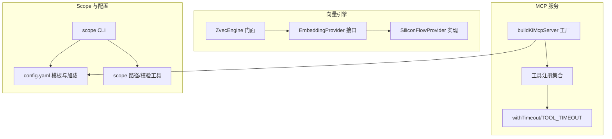
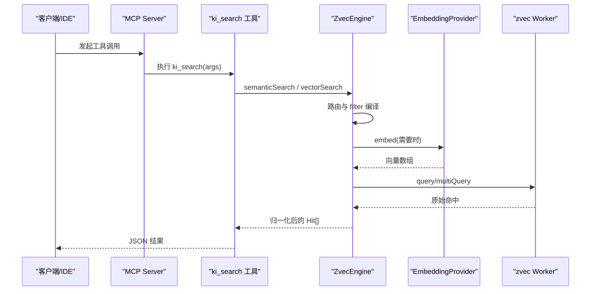
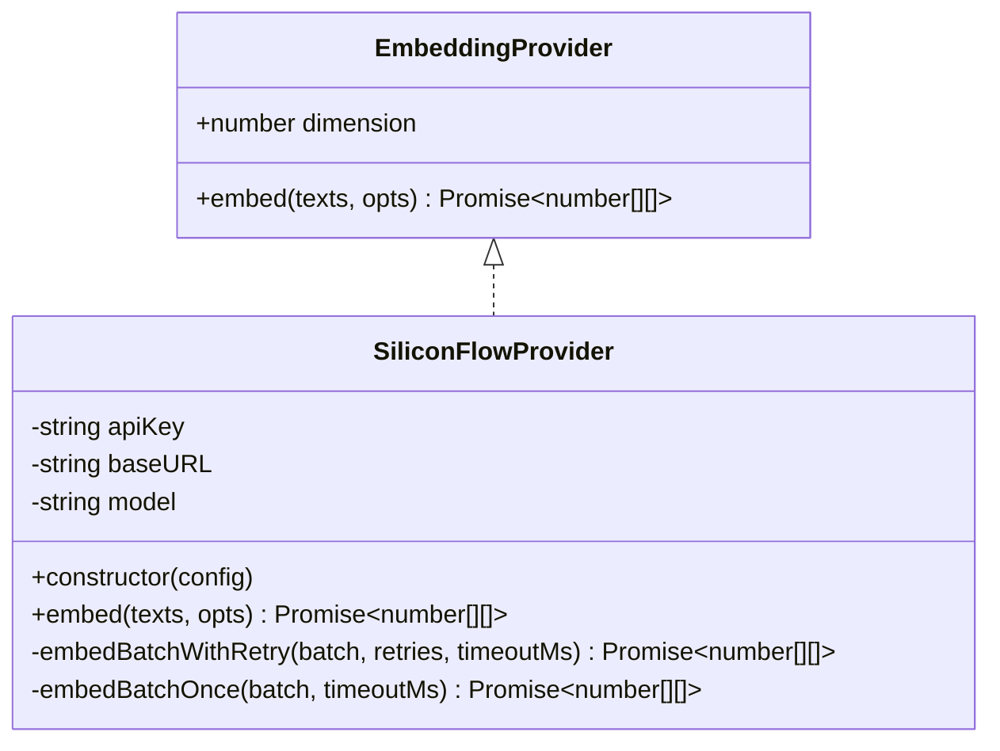
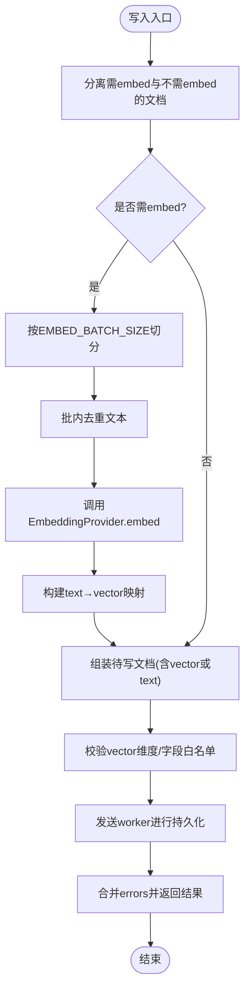
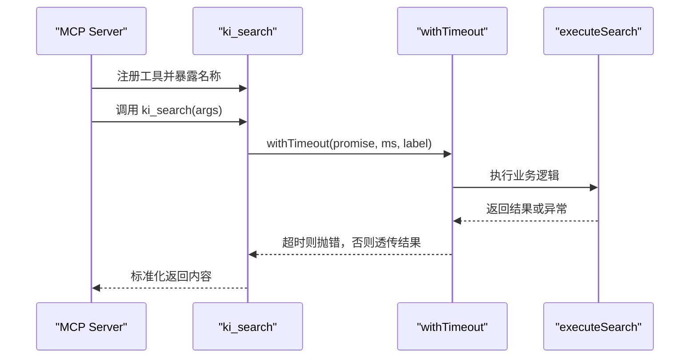
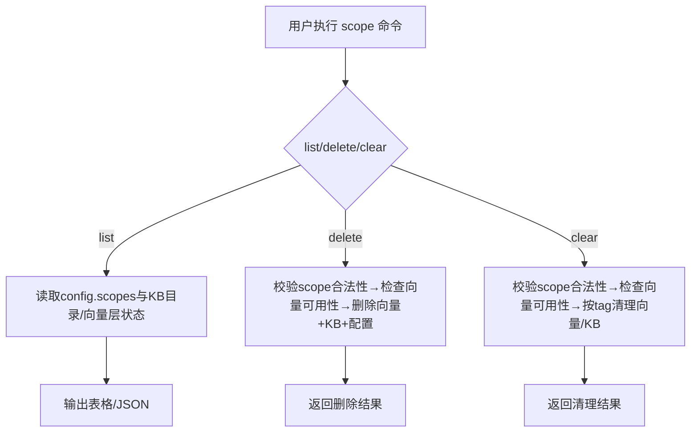
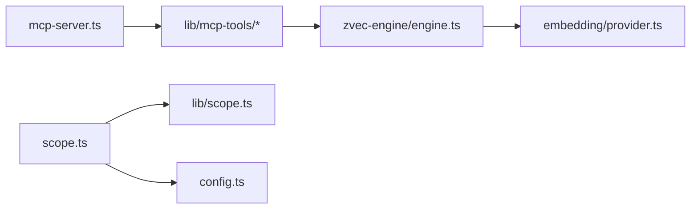

# 扩展点设计

<cite>
**本文引用的文件**
- [src/zvec-engine/embedding/provider.ts](file://src/zvec-engine/embedding/provider.ts)
- [src/zvec-engine/embedding/siliconflow.ts](file://src/zvec-engine/embedding/siliconflow.ts)
- [src/zvec-engine/engine.ts](file://src/zvec-engine/engine.ts)
- [src/mcp-server.ts](file://src/mcp-server.ts)
- [src/lib/mcp-tools/util.ts](file://src/lib/mcp-tools/util.ts)
- [src/lib/mcp-tools/search.ts](file://src/lib/mcp-tools/search.ts)
- [src/scope.ts](file://src/scope.ts)
- [src/lib/scope.ts](file://src/lib/scope.ts)
- [src/config.ts](file://src/config.ts)
</cite>

## 目录
1. [简介](#简介)
2. [项目结构](#项目结构)
3. [核心组件](#核心组件)
4. [架构总览](#架构总览)
5. [详细组件分析](#详细组件分析)
6. [依赖关系分析](#依赖关系分析)
7. [性能考量](#性能考量)
8. [故障排查指南](#故障排查指南)
9. [结论](#结论)
10. [附录：扩展示例与最佳实践](#附录扩展示例与最佳实践)

## 简介
本文件面向二次开发者，系统化说明 knowledge-indexer 的插件化扩展点设计与实现，重点覆盖：
- Embedding 提供商扩展（接口、生命周期、重试与批处理）
- MCP 工具扩展（注册机制、超时保护、参数校验）
- Scope 映射扩展（配置驱动、路径解析、CLI 管理）
并提供常见扩展示例与最佳实践，帮助快速完成功能定制。

## 项目结构
围绕扩展点的关键代码分布在以下模块：
- 向量引擎与 Embedding 抽象：src/zvec-engine/...
- MCP 服务与工具注册：src/mcp-server.ts 与 src/lib/mcp-tools/*
- Scope 管理与配置：src/scope.ts、src/lib/scope.ts、src/config.ts

图表来源
- [src/zvec-engine/embedding/provider.ts:20-28](file://src/zvec-engine/embedding/provider.ts#L20-L28)
- [src/zvec-engine/embedding/siliconflow.ts:43-75](file://src/zvec-engine/embedding/siliconflow.ts#L43-L75)
- [src/zvec-engine/engine.ts:68-131](file://src/zvec-engine/engine.ts#L68-L131)
- [src/mcp-server.ts:54-71](file://src/mcp-server.ts#L54-L71)
- [src/lib/mcp-tools/util.ts:24-42](file://src/lib/mcp-tools/util.ts#L24-L42)
- [src/config.ts:70-118](file://src/config.ts#L70-L118)
- [src/scope.ts:94-132](file://src/scope.ts#L94-L132)
- [src/lib/scope.ts:49-67](file://src/lib/scope.ts#L49-L67)

章节来源
- [src/zvec-engine/embedding/provider.ts:20-28](file://src/zvec-engine/embedding/provider.ts#L20-L28)
- [src/zvec-engine/embedding/siliconflow.ts:43-75](file://src/zvec-engine/embedding/siliconflow.ts#L43-L75)
- [src/zvec-engine/engine.ts:68-131](file://src/zvec-engine/engine.ts#L68-L131)
- [src/mcp-server.ts:54-71](file://src/mcp-server.ts#L54-L71)
- [src/lib/mcp-tools/util.ts:24-42](file://src/lib/mcp-tools/util.ts#L24-L42)
- [src/config.ts:70-118](file://src/config.ts#L70-L118)
- [src/scope.ts:94-132](file://src/scope.ts#L94-L132)
- [src/lib/scope.ts:49-67](file://src/lib/scope.ts#L49-L67)

## 核心组件
- EmbeddingProvider 抽象：定义维度与 embed 方法，统一文本到向量的转换契约。
- SiliconFlowProvider：OpenAI 兼容的参考实现，包含重试、退避、批处理、进度回调等能力。
- ZvecEngine：编排写入与检索流程，负责将文本按小批调用 EmbeddingProvider，并转换为 Float32Array 下发至 worker。
- MCP Server：集中注册工具，提供 stdio/HTTP 两种传输模式；每个工具通过 withTimeout 防止长驻进程阻塞。
- Scope 体系：通过配置文件声明 scope 及其 KB 目录映射，CLI 提供 list/delete/clear 等生命周期操作。

章节来源
- [src/zvec-engine/embedding/provider.ts:20-28](file://src/zvec-engine/embedding/provider.ts#L20-L28)
- [src/zvec-engine/embedding/siliconflow.ts:43-75](file://src/zvec-engine/embedding/siliconflow.ts#L43-L75)
- [src/zvec-engine/engine.ts:330-449](file://src/zvec-engine/engine.ts#L330-L449)
- [src/mcp-server.ts:54-71](file://src/mcp-server.ts#L54-L71)
- [src/lib/mcp-tools/util.ts:24-42](file://src/lib/mcp-tools/util.ts#L24-L42)
- [src/scope.ts:94-132](file://src/scope.ts#L94-L132)
- [src/lib/scope.ts:49-67](file://src/lib/scope.ts#L49-L67)

## 架构总览
下图展示了从 MCP 工具调用到向量引擎写入/检索的完整链路，以及 Embedding 提供商在其中的位置。

图表来源
- [src/mcp-server.ts:54-71](file://src/mcp-server.ts#L54-L71)
- [src/lib/mcp-tools/search.ts:6-49](file://src/lib/mcp-tools/search.ts#L6-L49)
- [src/zvec-engine/engine.ts:298-312](file://src/zvec-engine/engine.ts#L298-L312)
- [src/zvec-engine/engine.ts:454-495](file://src/zvec-engine/engine.ts#L454-L495)
- [src/zvec-engine/embedding/provider.ts:20-28](file://src/zvec-engine/embedding/provider.ts#L20-L28)

## 详细组件分析

### Embedding 提供商扩展点
- 接口规范
  - dimension：输出向量维度，必须与集合维度一致。
  - embed(texts, opts)：批量文本转向量，支持 retries、batchSize、timeoutMs、onProgress。
- 生命周期
  - 构造期：校验 apiKey/baseURL/model/dimension，失败抛出配置错误。
  - 运行期：按批次调用外部 API，支持指数退避与 Retry-After 解析，非可重试错误立即返回。
  - 销毁期：无显式资源释放，由上层控制实例生命周期。
- 错误与重试
  - 4xx（除 429）与响应结构错误不可重试；网络错误与 5xx/429 可重试。
  - 超时以 AbortController 控制，抛出带 code=TIMEOUT 的错误。
- 数据流
  - 输入 texts → 分批 → HTTP 请求 → 排序对齐 index → 校验 embedding.length === dimension → 返回向量数组。

图表来源
- [src/zvec-engine/embedding/provider.ts:20-28](file://src/zvec-engine/embedding/provider.ts#L20-L28)
- [src/zvec-engine/embedding/siliconflow.ts:43-75](file://src/zvec-engine/embedding/siliconflow.ts#L43-L75)
- [src/zvec-engine/embedding/siliconflow.ts:104-202](file://src/zvec-engine/embedding/siliconflow.ts#L104-L202)

章节来源
- [src/zvec-engine/embedding/provider.ts:20-28](file://src/zvec-engine/embedding/provider.ts#L20-L28)
- [src/zvec-engine/embedding/siliconflow.ts:43-75](file://src/zvec-engine/embedding/siliconflow.ts#L43-L75)
- [src/zvec-engine/embedding/siliconflow.ts:104-202](file://src/zvec-engine/embedding/siliconflow.ts#L104-L202)

### ZvecEngine 与 Embedding 集成
- 写入路径
  - 将需 embed 的文档按 EMBED_BATCH_SIZE 切分，去重后调用 provider.embed。
  - 将向量转为 Float32Array 后下发至 worker，失败项记录 errors，成功项正常写入。
- 检索路径
  - 路由选择查询类型，必要时调用 provider.embed 生成查询向量，注入 filterSql 后下发 worker。
- 维度一致性
  - 写入前校验向量维度与集合维度一致，不一致抛 DimensionMismatchError。

图表来源
- [src/zvec-engine/engine.ts:330-449](file://src/zvec-engine/engine.ts#L330-L449)

章节来源
- [src/zvec-engine/engine.ts:330-449](file://src/zvec-engine/engine.ts#L330-L449)

### MCP 工具扩展点
- 注册机制
  - 所有工具通过 buildKiMcpServer 集中注册，新增工具只需实现 registerXxxTool(server) 并在工厂中调用。
- 超时保护
  - 工具处理器使用 withTimeout 包裹业务逻辑，避免长驻进程被长时间任务阻塞。
  - 预设 READ/WRITE/BULK 三类超时阈值，便于不同复杂度任务差异化控制。
- 参数校验
  - 使用 zod 定义参数 schema，确保必填、范围、默认值等约束。
- 示例：ki_search
  - 封装 executeSearch，传入 scope/query/limit/threshold/tags/include_original 等参数，并以 WRITE 超时保护。

图表来源
- [src/mcp-server.ts:54-71](file://src/mcp-server.ts#L54-L71)
- [src/lib/mcp-tools/search.ts:6-49](file://src/lib/mcp-tools/search.ts#L6-L49)
- [src/lib/mcp-tools/util.ts:24-42](file://src/lib/mcp-tools/util.ts#L24-L42)

章节来源
- [src/mcp-server.ts:54-71](file://src/mcp-server.ts#L54-L71)
- [src/lib/mcp-tools/search.ts:6-49](file://src/lib/mcp-tools/search.ts#L6-L49)
- [src/lib/mcp-tools/util.ts:24-42](file://src/lib/mcp-tools/util.ts#L24-L42)

### Scope 映射扩展点
- 配置驱动
  - config.yaml 中 scopes 字段声明 scope 与其 kbDir 映射；未配置 kbDir 的数据落在 dataDir/{scope}。
- 路径解析
  - getKbDir(scope) 优先读取配置的 kbDir，否则回退到 dataDir/{scope}。
  - 提供 group-index.json 的路径访问与迁移能力。
- CLI 管理
  - scope list：列出两层（KB/向量）并集，标注存在层与是否已注册。
  - scope delete：删除向量文档、KB 目录、移除配置条目（需 --yes）。
  - scope clear：清空向量文档与 KB 目录内容（可按 tag 过滤仅清向量层）。

图表来源
- [src/scope.ts:94-132](file://src/scope.ts#L94-L132)
- [src/scope.ts:145-179](file://src/scope.ts#L145-L179)
- [src/scope.ts:192-221](file://src/scope.ts#L192-L221)
- [src/lib/scope.ts:49-67](file://src/lib/scope.ts#L49-L67)
- [src/config.ts:106-118](file://src/config.ts#L106-L118)

章节来源
- [src/scope.ts:94-132](file://src/scope.ts#L94-L132)
- [src/scope.ts:145-179](file://src/scope.ts#L145-L179)
- [src/scope.ts:192-221](file://src/scope.ts#L192-L221)
- [src/lib/scope.ts:49-67](file://src/lib/scope.ts#L49-L67)
- [src/config.ts:106-118](file://src/config.ts#L106-L118)

## 依赖关系分析
- 耦合性
  - ZvecEngine 强依赖 EmbeddingProvider 接口，松耦合于具体实现。
  - MCP Server 通过工具函数注册解耦各工具实现，新增工具不影响已有逻辑。
  - Scope 管理依赖配置与文件系统，CLI 与库函数职责清晰。
- 外部依赖
  - EmbeddingProvider 依赖外部 HTTP 服务（如 SiliconFlow），具备重试与超时保护。
  - MCP 工具依赖 zvec 引擎与向量存储，通过 withTimeout 降低长耗时风险。
- 潜在循环依赖
  - 当前模块边界清晰，未见循环引用；engine 与 provider 为单向依赖。

图表来源
- [src/mcp-server.ts:54-71](file://src/mcp-server.ts#L54-L71)
- [src/zvec-engine/engine.ts:68-131](file://src/zvec-engine/engine.ts#L68-L131)
- [src/zvec-engine/embedding/provider.ts:20-28](file://src/zvec-engine/embedding/provider.ts#L20-L28)
- [src/scope.ts:94-132](file://src/scope.ts#L94-L132)
- [src/lib/scope.ts:49-67](file://src/lib/scope.ts#L49-L67)
- [src/config.ts:106-118](file://src/config.ts#L106-L118)

章节来源
- [src/mcp-server.ts:54-71](file://src/mcp-server.ts#L54-L71)
- [src/zvec-engine/engine.ts:68-131](file://src/zvec-engine/engine.ts#L68-L131)
- [src/zvec-engine/embedding/provider.ts:20-28](file://src/zvec-engine/embedding/provider.ts#L20-L28)
- [src/scope.ts:94-132](file://src/scope.ts#L94-L132)
- [src/lib/scope.ts:49-67](file://src/lib/scope.ts#L49-L67)
- [src/config.ts:106-118](file://src/config.ts#L106-L118)

## 性能考量
- Embedding 批处理与去重
  - 引擎侧按 EMBED_BATCH_SIZE 切分，批内对相同文本去重，减少重复 HTTP 调用。
  - 失败粒度为小批，局部抖动不影响整体写入。
- 超时与空闲释放
  - MCP 工具设置 READ/WRITE/BULK 超时，避免长驻进程阻塞。
  - 向量引擎空闲超时自动释放锁，允许多实例共享与错开使用。
- 维度一致性
  - 写入前严格校验向量维度，避免后续索引损坏。

[本节为通用指导，不直接分析具体文件]

## 故障排查指南
- Embedding 失败
  - 检查 provider 配置（apiKey/baseURL/model/dimension），确认维度与集合一致。
  - 关注错误码：NETWORK/TIMEOUT/HTTP_4xx/HTTP_5xx，结合重试策略调整 batchSize/timeoutMs。
- MCP 工具超时
  - 根据任务类型选择合适的超时阈值（READ/WRITE/BULK），必要时拆分任务或优化下游。
- Scope 操作失败
  - 确认 scope 名称合法（仅字母、数字、连字符、下划线）。
  - 向量服务不可用时，delete/clear 会拒绝执行以避免两层不一致。

章节来源
- [src/zvec-engine/embedding/siliconflow.ts:104-202](file://src/zvec-engine/embedding/siliconflow.ts#L104-L202)
- [src/lib/mcp-tools/util.ts:24-42](file://src/lib/mcp-tools/util.ts#L24-L42)
- [src/scope.ts:145-179](file://src/scope.ts#L145-L179)
- [src/lib/scope.ts:30-43](file://src/lib/scope.ts#L30-L43)

## 结论
knowledge-indexer 通过清晰的接口与模块化设计，提供了可扩展的 Embedding 提供商、MCP 工具与 Scope 映射机制。开发者可基于现有扩展点快速实现自定义能力，同时借助内置的重试、超时、维度校验与 CLI 管理保障稳定性与可维护性。

[本节为总结，不直接分析具体文件]

## 附录：扩展示例与最佳实践

### 自定义 Embedding 提供商
- 步骤
  - 实现 EmbeddingProvider 接口，提供 dimension 与 embed 方法。
  - 在构造期校验必要配置（如密钥、端点、模型、维度）。
  - 在 embed 中实现批处理、重试、超时与进度回调。
- 注意事项
  - 保证返回向量长度等于 dimension。
  - 合理设置 batchSize 与 timeoutMs，避免触发限流或超时。
  - 区分可重试与不可重试错误，提升鲁棒性。

章节来源
- [src/zvec-engine/embedding/provider.ts:20-28](file://src/zvec-engine/embedding/provider.ts#L20-L28)
- [src/zvec-engine/embedding/siliconflow.ts:43-75](file://src/zvec-engine/embedding/siliconflow.ts#L43-L75)
- [src/zvec-engine/embedding/siliconflow.ts:104-202](file://src/zvec-engine/embedding/siliconflow.ts#L104-L202)

### 新增 MCP 工具
- 步骤
  - 在 src/lib/mcp-tools 下新建工具文件，导出 registerXxxTool(server)。
  - 使用 zod 定义参数 schema，用 withTimeout 包裹业务逻辑。
  - 在 buildKiMcpServer 中引入并注册新工具。
- 注意事项
  - 明确工具职责与超时阈值（READ/WRITE/BULK）。
  - 错误返回使用 isError 与 content 字段，便于上层识别。
  - 避免在工具中持有长连接或全局状态，保持无副作用。

章节来源
- [src/mcp-server.ts:54-71](file://src/mcp-server.ts#L54-L71)
- [src/lib/mcp-tools/search.ts:6-49](file://src/lib/mcp-tools/search.ts#L6-L49)
- [src/lib/mcp-tools/util.ts:24-42](file://src/lib/mcp-tools/util.ts#L24-L42)

### 配置 Scope 映射
- 步骤
  - 在 config.yaml 的 scopes 中添加 scope 条目，指定 kbDir（可选）。
  - 使用 ki scope list 查看 scope 在 KB 与向量层的存在情况。
  - 使用 ki scope delete/clear 进行破坏性操作（需 --yes）。
- 注意事项
  - scope 名称仅允许字母、数字、连字符、下划线。
  - 向量服务不可用时，delete/clear 会拒绝执行以避免不一致。
  - 按 tag 清理仅影响向量层，不会动 KB 目录。

章节来源
- [src/config.ts:106-118](file://src/config.ts#L106-L118)
- [src/scope.ts:94-132](file://src/scope.ts#L94-L132)
- [src/scope.ts:145-179](file://src/scope.ts#L145-L179)
- [src/scope.ts:192-221](file://src/scope.ts#L192-L221)
- [src/lib/scope.ts:30-43](file://src/lib/scope.ts#L30-L43)