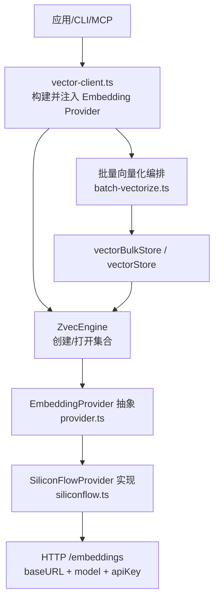
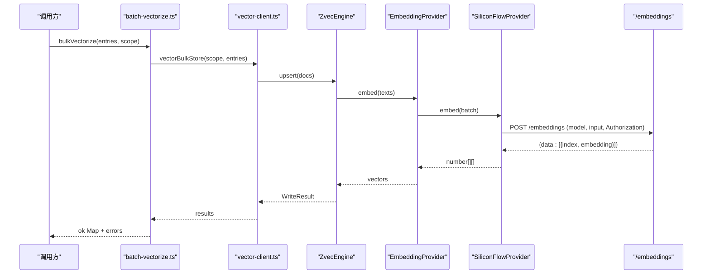
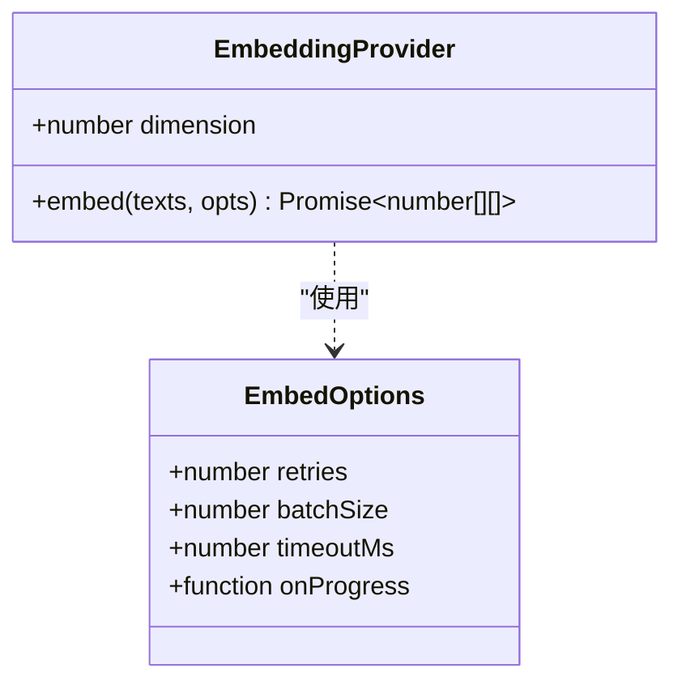
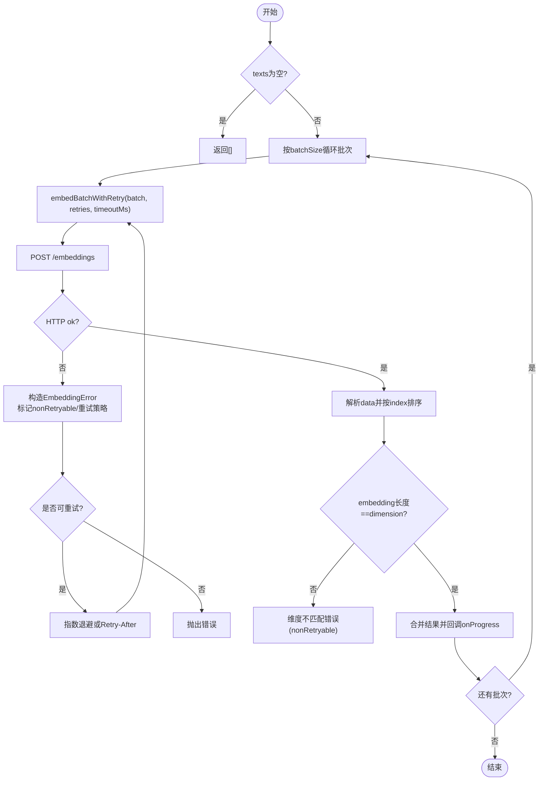
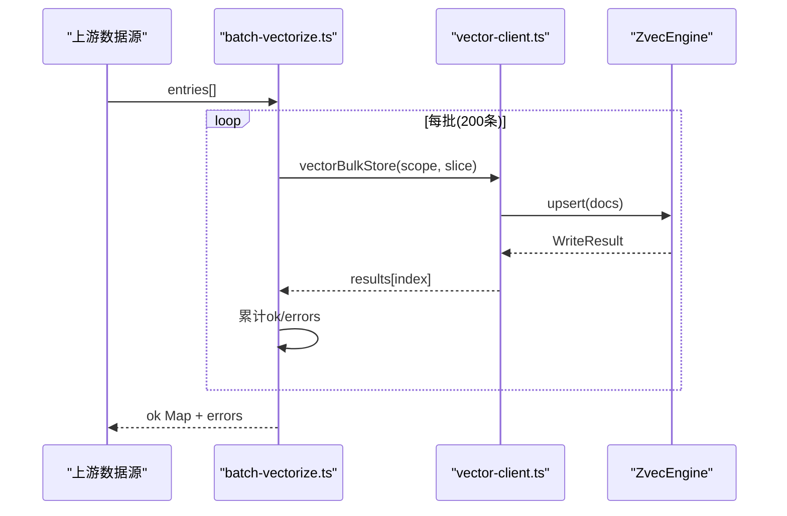
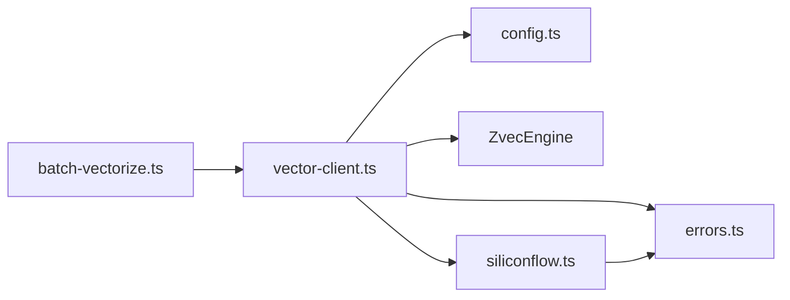

# Embedding集成

<cite>
**本文引用的文件**
- [src/zvec-engine/embedding/provider.ts](file://src/zvec-engine/embedding/provider.ts)
- [src/zvec-engine/embedding/siliconflow.ts](file://src/zvec-engine/embedding/siliconflow.ts)
- [src/lib/vector-client.ts](file://src/lib/vector-client.ts)
- [src/lib/batch-vectorize.ts](file://src/lib/batch-vectorize.ts)
- [src/config.ts](file://src/config.ts)
- [src/zvec-engine/errors.ts](file://src/zvec-engine/errors.ts)
- [test/zvec-engine-embedding.test.mjs](file://test/zvec-engine-embedding.test.mjs)
- [docs/configuration.md](file://docs/configuration.md)
</cite>

## 目录
1. [简介](#简介)
2. [项目结构](#项目结构)
3. [核心组件](#核心组件)
4. [架构总览](#架构总览)
5. [详细组件分析](#详细组件分析)
6. [依赖关系分析](#依赖关系分析)
7. [性能考量](#性能考量)
8. [故障排查指南](#故障排查指南)
9. [结论](#结论)
10. [附录](#附录)

## 简介
本文件面向 knowledge-indexer 的 Embedding 集成模块，系统性说明 Embedding 提供商抽象、SiliconFlowProvider 的具体实现与扩展方式，向量化配置项（baseURL、model、dimension、apiKey）的使用方法，批量向量化处理流程（文本预处理、分块策略、并发控制），以及不同提供商适配要点（API调用模式、错误处理、重试机制）。同时给出性能优化建议与常见问题解决方案。

## 项目结构
Embedding 相关代码主要分布在以下位置：
- 抽象接口与默认实现：src/zvec-engine/embedding/
- 向量客户端与引擎装配：src/lib/vector-client.ts
- 批量向量化编排：src/lib/batch-vectorize.ts
- 配置模板与字段说明：src/config.ts、docs/configuration.md
- 错误类型定义：src/zvec-engine/errors.ts
- 单元测试覆盖：test/zvec-engine-embedding.test.mjs

图表来源
- [src/lib/vector-client.ts:247-303](file://src/lib/vector-client.ts#L247-L303)
- [src/zvec-engine/embedding/provider.ts:9-28](file://src/zvec-engine/embedding/provider.ts#L9-L28)
- [src/zvec-engine/embedding/siliconflow.ts:43-102](file://src/zvec-engine/embedding/siliconflow.ts#L43-L102)
- [src/lib/batch-vectorize.ts:132-182](file://src/lib/batch-vectorize.ts#L132-L182)

章节来源
- [src/lib/vector-client.ts:247-303](file://src/lib/vector-client.ts#L247-L303)
- [src/zvec-engine/embedding/provider.ts:9-28](file://src/zvec-engine/embedding/provider.ts#L9-L28)
- [src/zvec-engine/embedding/siliconflow.ts:43-102](file://src/zvec-engine/embedding/siliconflow.ts#L43-L102)
- [src/lib/batch-vectorize.ts:132-182](file://src/lib/batch-vectorize.ts#L132-L182)

## 核心组件
- EmbeddingProvider 抽象：统一 embed(texts, opts) 契约，要求返回与 texts 等长的向量数组，且每条向量维度等于 dimension；支持 retries、batchSize、timeoutMs、onProgress 等选项。
- SiliconFlowProvider：基于 OpenAI 兼容 /embeddings 接口的具体实现，负责认证、批处理、超时、重试、响应校验与对齐。
- vector-client：从配置加载 embedding 参数，构造 SiliconFlowProvider 并注入 ZvecEngine；提供单条/批量存储、检索、删除等能力。
- batch-vectorize：将上层条目转换为 content，按批次调用 vectorBulkStore，完成“嵌入+写入”的一体化流程。

章节来源
- [src/zvec-engine/embedding/provider.ts:9-28](file://src/zvec-engine/embedding/provider.ts#L9-L28)
- [src/zvec-engine/embedding/siliconflow.ts:43-102](file://src/zvec-engine/embedding/siliconflow.ts#L43-L102)
- [src/lib/vector-client.ts:247-303](file://src/lib/vector-client.ts#L247-L303)
- [src/lib/batch-vectorize.ts:44-69](file://src/lib/batch-vectorize.ts#L44-L69)

## 架构总览
Embedding 在系统中的角色是“文本到向量”的可插拔服务。vector-client 负责从配置读取 baseURL/model/dimension/apiKey，实例化 SiliconFlowProvider，并将其注入 ZvecEngine。批量向量化由 batch-vectorize 驱动，内部以固定批次大小分批提交，减少内存峰值并便于进度反馈。

图表来源
- [src/lib/batch-vectorize.ts:132-182](file://src/lib/batch-vectorize.ts#L132-L182)
- [src/lib/vector-client.ts:547-590](file://src/lib/vector-client.ts#L547-L590)
- [src/zvec-engine/embedding/siliconflow.ts:130-202](file://src/zvec-engine/embedding/siliconflow.ts#L130-L202)

## 详细组件分析

### EmbeddingProvider 抽象
- 目标：屏蔽不同提供商差异，向上层暴露统一的 embed 方法。
- 关键约定：
  - dimension：输出向量维度，必须与集合维度一致。
  - embed(texts, opts)：返回长度与 texts 相同，每条向量长度为 dimension。
  - 失败粒度：小批失败抛出 EmbeddingError，携带该批范围信息，便于重试与定位。
  - 可配置：retries、batchSize、timeoutMs、onProgress。

图表来源
- [src/zvec-engine/embedding/provider.ts:9-28](file://src/zvec-engine/embedding/provider.ts#L9-L28)

章节来源
- [src/zvec-engine/embedding/provider.ts:9-28](file://src/zvec-engine/embedding/provider.ts#L9-L28)

### SiliconFlowProvider 实现
- 配置校验：
  - apiKey：必填，优先从配置传入，否则回退环境变量 SILICONFLOW_API_KEY；缺失抛 EmbeddingConfigError。
  - baseURL：必须以 https:// 开头，自动去除尾部斜杠。
  - dimension：正整数，用于后续响应维度校验。
- 批处理与重试：
  - 批间串行，避免触发限流；每批独立重试。
  - 指数退避 + Retry-After 优先；4xx（非429）不重试；网络错误/超时可重试。
- 响应处理：
  - 校验 data 长度与输入一致。
  - 按 index 排序对齐输入顺序。
  - 校验 embedding 为数组且长度等于 dimension。
- 超时控制：
  - 通过 AbortController 设置单次请求超时，超时抛 EmbeddingError(code=TIMEOUT)。

图表来源
- [src/zvec-engine/embedding/siliconflow.ts:77-202](file://src/zvec-engine/embedding/siliconflow.ts#L77-L202)

章节来源
- [src/zvec-engine/embedding/siliconflow.ts:43-202](file://src/zvec-engine/embedding/siliconflow.ts#L43-L202)
- [src/zvec-engine/errors.ts:56-62](file://src/zvec-engine/errors.ts#L56-L62)

### 向量化配置选项
- baseURL：API 端点，决定实际对接的提供商；必须以 https:// 开头。
- model：模型名称，随请求体发送。
- dimension：向量维度，需与集合维度一致；用于响应维度校验。
- apiKey：密钥，支持明文或环境变量引用；缺失时 fail-loud。

配置来源与示例见配置文件模板与文档。

章节来源
- [src/config.ts:88-99](file://src/config.ts#L88-L99)
- [docs/configuration.md:67-88](file://docs/configuration.md#L67-L88)

### 批量向量化处理流程
- 文本预处理：
  - 通过 buildVectorizeContent(entry) 直接取 entry.text，不再拼接摘要/关键词/路径前缀。
- 分块策略：
  - vectorBulkStore 接收一批 entries；batch-vectorize 内部以固定批次大小（200）分批提交，便于进度反馈与降低单次负载。
- 并发控制：
  - 批间串行，避免触发提供商限流；每批内部一次性提交给底层引擎，由引擎侧执行嵌入与写入。
- 进度与错误：
  - 多批场景下输出批级进度；单条失败记录到 errors，不中断整体。

图表来源
- [src/lib/batch-vectorize.ts:129-182](file://src/lib/batch-vectorize.ts#L129-L182)
- [src/lib/vector-client.ts:547-590](file://src/lib/vector-client.ts#L547-L590)

章节来源
- [src/lib/batch-vectorize.ts:44-69](file://src/lib/batch-vectorize.ts#L44-L69)
- [src/lib/batch-vectorize.ts:129-182](file://src/lib/batch-vectorize.ts#L129-L182)

### 不同提供商适配指南
- API 调用模式：
  - 当前实现基于 OpenAI 兼容 /embeddings 接口（POST，body包含 model、input）。
  - 若更换 baseURL 指向其他兼容提供商，无需修改代码即可接入。
- 错误处理与重试：
  - 5xx/429/网络错误：可重试，采用指数退避，优先使用 Retry-After。
  - 4xx（非429）：不可重试，直接抛错。
  - 响应结构异常（data长度不符、embedding非数组、维度不匹配）：不可重试。
- 扩展新提供商：
  - 实现 EmbeddingProvider 接口，遵循 dimension 与 embed 契约。
  - 复用 EmbeddingError/EmbeddingConfigError 进行错误分类。
  - 在 vector-client 中新增 provider 选择逻辑，或保持仅通过 baseURL 切换。

章节来源
- [src/zvec-engine/embedding/siliconflow.ts:104-202](file://src/zvec-engine/embedding/siliconflow.ts#L104-L202)
- [src/zvec-engine/errors.ts:56-62](file://src/zvec-engine/errors.ts#L56-L62)
- [src/lib/vector-client.ts:247-266](file://src/lib/vector-client.ts#L247-L266)

## 依赖关系分析
- vector-client 依赖：
  - 配置加载：loadConfig/getEmbeddingConfig，读取 embedding.baseURL/model/dimension/apiKey。
  - 引擎封装：ZvecEngine.create/open/upsert/hybridSearch/delete 等。
  - 错误类型：CollectionLockedException 等。
- SiliconFlowProvider 依赖：
  - 错误类型：EmbeddingError/EmbeddingConfigError。
  - 外部依赖：fetch（可通过 fetchImpl 注入以便测试）。
- batch-vectorize 依赖：
  - vector-client 的 vectorStore/vectorBulkStore/vectorDelete。
  - 进度日志：logProgress。

图表来源
- [src/lib/vector-client.ts:247-303](file://src/lib/vector-client.ts#L247-L303)
- [src/zvec-engine/embedding/siliconflow.ts:13-14](file://src/zvec-engine/embedding/siliconflow.ts#L13-L14)
- [src/lib/batch-vectorize.ts:17-21](file://src/lib/batch-vectorize.ts#L17-L21)

章节来源
- [src/lib/vector-client.ts:247-303](file://src/lib/vector-client.ts#L247-L303)
- [src/zvec-engine/embedding/siliconflow.ts:13-14](file://src/zvec-engine/embedding/siliconflow.ts#L13-L14)
- [src/lib/batch-vectorize.ts:17-21](file://src/lib/batch-vectorize.ts#L17-L21)

## 性能考量
- 批大小调优：
  - SiliconFlowProvider 默认 batch size 64，可根据提供商限流策略调整。
  - batch-vectorize 默认 200 条/批，适合批量写入，兼顾内存与进度反馈。
- 重试与退避：
  - 指数退避上限约 8000ms；优先使用 Retry-After，避免雪崩。
- 超时控制：
  - 单次请求默认 30000ms，可按网络状况调整。
- 并发与锁：
  - 批间串行，避免触发限流；向量库操作经 withEngine 包装，具备空闲释放锁与自愈重试。
- 文本长度限制：
  - vector-store 对 text 有最大长度限制（例如 50000 字符），超长需在上层切分。

[本节为通用指导，不直接分析具体文件]

## 故障排查指南
- 常见错误与定位：
  - 缺少 apiKey：构造 SiliconFlowProvider 时报 EmbeddingConfigError；检查配置或环境变量。
  - baseURL 非 https：构造时报错；修正为 https 开头的地址。
  - 维度不匹配：响应 embedding 长度与 dimension 不一致；检查模型与集合维度配置。
  - 4xx 非 429：不可重试，检查鉴权与权限。
  - 429 限流：优先使用 Retry-After；必要时降低 batch size 或增加重试次数。
  - 超时：AbortError 转为 TIMEOUT；检查网络与超时阈值。
  - 向量库被占用：提示停止常驻进程或等待锁释放；必要时重建向量库。
- 诊断步骤：
  - 确认 embedding 配置正确（baseURL/model/dimension/apiKey）。
  - 查看错误码与 data.nonRetryable 标志，判断是否应重试。
  - 对于批量导入，关注每批进度与 errors 明细，定位失败条目。
  - 若出现 worker 不可用，系统会自动重开一次重试；持续失败需检查磁盘与进程状态。

章节来源
- [src/zvec-engine/embedding/siliconflow.ts:104-202](file://src/zvec-engine/embedding/siliconflow.ts#L104-L202)
- [src/lib/vector-client.ts:74-86](file://src/lib/vector-client.ts#L74-L86)
- [test/zvec-engine-embedding.test.mjs:54-218](file://test/zvec-engine-embedding.test.mjs#L54-L218)

## 结论
本模块通过 EmbeddingProvider 抽象解耦了不同提供商的实现细节，SiliconFlowProvider 提供了健壮的重试、超时与响应校验机制。vector-client 将配置与引擎装配集中管理，batch-vectorize 提供高效稳定的批量向量化流程。通过合理的批大小、重试策略与并发控制，可在保证稳定性的前提下提升吞吐。未来扩展新提供商只需实现统一接口并在配置层接入即可。

[本节为总结性内容，不直接分析具体文件]

## 附录
- 配置模板生成命令与字段说明请参考配置文件模板与文档。
- 单元测试覆盖了构造校验、批处理、重试、超时、维度校验、乱序对齐等关键场景，可作为行为参考。

章节来源
- [src/config.ts:128-177](file://src/config.ts#L128-L177)
- [docs/configuration.md:67-88](file://docs/configuration.md#L67-L88)
- [test/zvec-engine-embedding.test.mjs:54-218](file://test/zvec-engine-embedding.test.mjs#L54-L218)