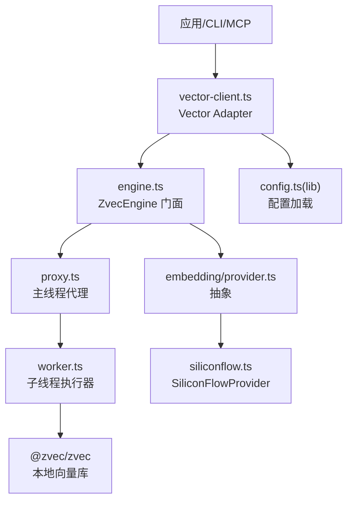
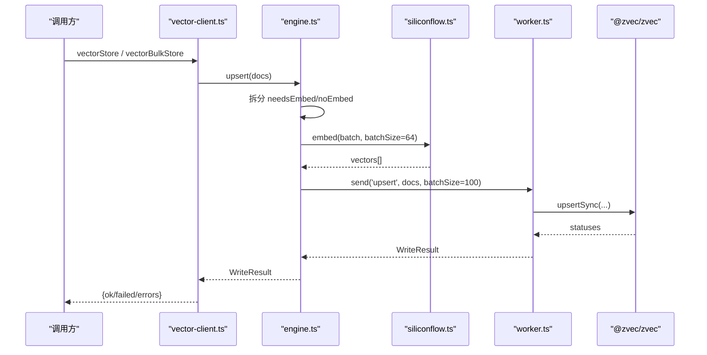
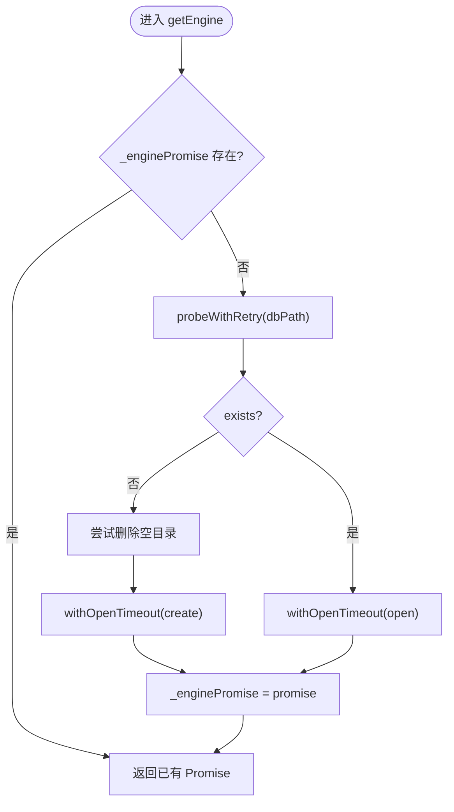
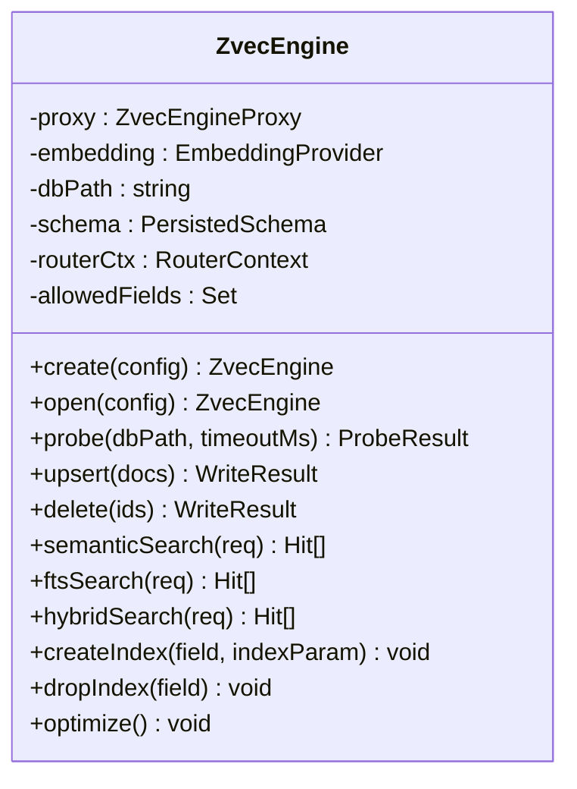
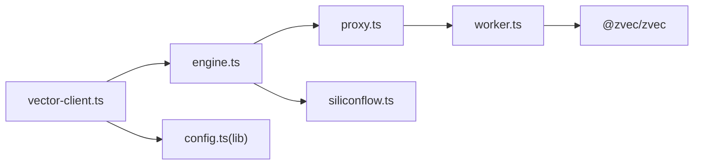

# 向量化处理

<cite>
**本文引用的文件**
- [vector-client.ts](file://src/lib/vector-client.ts)
- [batch-vectorize.ts](file://src/lib/batch-vectorize.ts)
- [engine.ts](file://src/zvec-engine/engine.ts)
- [proxy.ts](file://src/zvec-engine/proxy.ts)
- [worker.ts](file://src/zvec-engine/worker.ts)
- [provider.ts](file://src/zvec-engine/embedding/provider.ts)
- [siliconflow.ts](file://src/zvec-engine/embedding/siliconflow.ts)
- [config.ts（lib）](file://src/lib/config.ts)
- [errors.ts](file://src/zvec-engine/errors.ts)
- [types.ts](file://src/zvec-engine/types.ts)
</cite>

## 目录
1. [简介](#简介)
2. [项目结构](#项目结构)
3. [核心组件](#核心组件)
4. [架构总览](#架构总览)
5. [详细组件分析](#详细组件分析)
6. [依赖关系分析](#依赖关系分析)
7. [性能与调优](#性能与调优)
8. [故障排查指南](#故障排查指南)
9. [结论](#结论)

## 简介
本模块为 knowledge-indexer 的向量化处理子系统，负责将文本数据转换为向量并持久化到 zvec 引擎，同时提供语义检索、混合检索、批量写入、错误重试、并发控制以及与 Embedding 提供商的集成。文档面向使用者与维护者，既解释整体架构，也深入到关键实现细节，帮助理解向量数据的生成、存储与管理机制。

## 项目结构
向量化处理由三层组成：
- 适配层（Vector Adapter）：对外暴露稳定接口，封装连接管理、撞锁重试、空闲释放锁、超时保护等。
- 引擎层（ZvecEngine）：编排 embedding、过滤编译、路由检索、写入批处理、索引操作等。
- 执行层（Worker + zvec）：在独立 worker_threads 中持有唯一集合句柄，串行处理请求，调用原生 zvec 能力。

图表来源
- [vector-client.ts:1-120](file://src/lib/vector-client.ts#L1-L120)
- [engine.ts:1-120](file://src/zvec-engine/engine.ts#L1-L120)
- [proxy.ts:1-120](file://src/zvec-engine/proxy.ts#L1-L120)
- [worker.ts:1-120](file://src/zvec-engine/worker.ts#L1-L120)
- [provider.ts:1-29](file://src/zvec-engine/embedding/provider.ts#L1-L29)
- [siliconflow.ts:1-80](file://src/zvec-engine/embedding/siliconflow.ts#L1-L80)
- [config.ts（lib）:120-140](file://src/lib/config.ts#L120-L140)

章节来源
- [vector-client.ts:1-120](file://src/lib/vector-client.ts#L1-L120)
- [engine.ts:1-120](file://src/zvec-engine/engine.ts#L1-L120)
- [config.ts（lib）:120-140](file://src/lib/config.ts#L120-L140)

## 核心组件
- Vector Adapter（vector-client.ts）：进程内单例 Engine 管理、撞锁重试、空闲释放锁、open/create 超时、可用性检测、检索与存储 API、scope/tag 过滤、doc id 幂等生成。
- ZvecEngine（engine.ts）：创建/打开集合、写入编排（embed 分批、去重、维度校验、白名单）、检索路由（语义/FTS/混合）、索引与优化、生命周期管理。
- Proxy（proxy.ts）：主线程侧 Worker 管理，消息队列、状态机、drain/close/terminate、crash 处理、Transferable 零拷贝。
- Worker（worker.ts）：子线程执行器，维护唯一集合句柄，串行处理请求，分批写入并让出事件循环以支持查询插队。
- Embedding Provider（provider.ts + siliconflow.ts）：Embedding 抽象与 SiliconFlow 实现，含分批、重试（指数退避、Retry-After）、超时、维度一致性校验、乱序对齐。
- 配置（config.ts lib）：加载 YAML/JSON 配置，解析 vectorDir、embedding.provider/baseURL/model/dimension/apiKey、scopeMode 等。

章节来源
- [vector-client.ts:120-340](file://src/lib/vector-client.ts#L120-L340)
- [engine.ts:240-450](file://src/zvec-engine/engine.ts#L240-L450)
- [proxy.ts:110-180](file://src/zvec-engine/proxy.ts#L110-L180)
- [worker.ts:280-340](file://src/zvec-engine/worker.ts#L280-L340)
- [siliconflow.ts:77-130](file://src/zvec-engine/embedding/siliconflow.ts#L77-L130)
- [config.ts（lib）:220-290](file://src/lib/config.ts#L220-L290)

## 架构总览
向量数据从“文本”到“可检索”的关键路径：
- 写入路径：文本 → 生成 docId（幂等）→ 构建字段（tag/scope/group）→ 引擎按需 embed（分批、去重）→ 转换 Float32Array → 批量写入 zvec（分批+setImmediate）→ 返回结果。
- 检索路径：queryText/fts/filter → 路由（语义/FTS/混合）→ 必要时 embed → 构造 query/multiQuery → 执行查询 → 归一化为 Hit。

图表来源
- [vector-client.ts:510-590](file://src/lib/vector-client.ts#L510-L590)
- [engine.ts:330-450](file://src/zvec-engine/engine.ts#L330-L450)
- [siliconflow.ts:77-130](file://src/zvec-engine/embedding/siliconflow.ts#L77-L130)
- [worker.ts:286-331](file://src/zvec-engine/worker.ts#L286-L331)

## 详细组件分析

### Vector Adapter（vector-client.ts）
- 连接管理
  - 进程内单例 _enginePromise，首次 probe 不存在则 create，存在则 open；失败时重置缓存以便自愈。
  - 撞锁重试：probeWithRetry 检测到 locked 时等待并重试，避免多实例争用导致立即失败。
  - 空闲释放锁：enableIdleClose 仅用于常驻 MCP，空闲超时后 closeEngine 释放 LOCK，下次调用惰性 reopen。
  - 超时保护：withOpenTimeout 限制 create/open 耗时，防止底层挂死导致上层永久 pending。
- 并发与在途保护
  - serializeEngineOp 串行化所有涉及原生 open/probe/close 的操作，避免同进程并发触发原生竞态。
  - withEngine 包装所有 engine 使用，计数 _inFlightOps 防止 idle close 竞态，并在 worker 不可用时自动重试一次。
- 数据模型与过滤
  - 固定 collection 名与字段：dense/content/tag/scope/group；tag 统一小写；docId = sha256(text+scope+tag) 截32位，保证幂等。
  - buildScopeTagFilter 组合 scope== 与 tag OR 条件，支持空 tag 表示不限 tag。
- 检索与存储
  - vectorSearch：hybridSearch(queryText, fts, topk, filter)，阈值过滤。
  - vectorStore/vectorBulkStore：幂等 upsert，批量结果映射为逐项 success/error。
  - vectorDelete/vectorListDocs/vectorFetchDocs/vectorListScopes/vectorListTags/vectorCountScope/vectorDeleteScope：管理面能力。
- 可用性检测
  - ensureVectorAvailable：优先复用已打开 engine；否则 probe dbPath，区分 LOCKED/CORRUPTED/PROBE_ERROR。

图表来源
- [vector-client.ts:185-340](file://src/lib/vector-client.ts#L185-L340)

章节来源
- [vector-client.ts:70-120](file://src/lib/vector-client.ts#L70-L120)
- [vector-client.ts:185-340](file://src/lib/vector-client.ts#L185-L340)
- [vector-client.ts:470-590](file://src/lib/vector-client.ts#L470-L590)
- [vector-client.ts:620-754](file://src/lib/vector-client.ts#L620-L754)

### ZvecEngine（engine.ts）
- 写入编排
  - 拆分 needsEmbed/noEmbed；needsEmbed 按 EMBED_BATCH_SIZE(64) 切分，批内去重减少重复 HTTP 调用。
  - 调用 provider.embed 获取向量，失败批次标记 EMBEDDING_FAILED，成功批次继续写入。
  - 组装待写文档，校验维度、fields 白名单，转 Float32Array 后发送 batch size=100 写入。
- 检索编排
  - compileFilter 编译 Filter；routeSearch 决定 query/multiQuery；需要时 embed 并注入 vector。
  - 通过 proxy.send 执行 query/multiQuery，toHit 归一化 score 与 fields。
- 索引与优化
  - createIndex/dropIndex/optimize 直接转发至 worker。
- 生命周期
  - create/open/tryOpen/probe/close/destroy/isHealthy/isLocked/isOpen。

图表来源
- [engine.ts:68-132](file://src/zvec-engine/engine.ts#L68-L132)
- [engine.ts:240-326](file://src/zvec-engine/engine.ts#L240-L326)

章节来源
- [engine.ts:68-132](file://src/zvec-engine/engine.ts#L68-L132)
- [engine.ts:240-450](file://src/zvec-engine/engine.ts#L240-L450)
- [engine.ts:454-509](file://src/zvec-engine/engine.ts#L454-L509)

### Proxy（proxy.ts）
- 职责：spawn 专用 worker，维护状态机（init/opening/open/closing/closed/crashed/failed），postMessage 请求队列，close drain 在途请求，terminate 强制回收。
- 传输：collectTransferables 收集 Float32Array 等 Transferable，实现零拷贝传递。
- 健壮性：error/exit 事件统一转为 WorkerCrashedError，rejectAllPending 清理在途 Promise。

章节来源
- [proxy.ts:44-180](file://src/zvec-engine/proxy.ts#L44-L180)
- [proxy.ts:188-277](file://src/zvec-engine/proxy.ts#L188-L277)

### Worker（worker.ts）
- 职责：维护唯一 collection 句柄，串行处理消息；写入分批（默认 100）并在批间 setImmediate 让出事件循环，使查询能插队。
- 生命周期：handleCreate/handleOpen/handleClose/handleDestroy；info 返回 schema、metric、docCount 等。
- 写入/删除/取回/listIds/query/multiQuery：均基于 zvec 同步 API，错误映射为 WriteResult.errors。

章节来源
- [worker.ts:118-163](file://src/zvec-engine/worker.ts#L118-L163)
- [worker.ts:286-331](file://src/zvec-engine/worker.ts#L286-L331)
- [worker.ts:350-436](file://src/zvec-engine/worker.ts#L350-L436)

### Embedding Provider（provider.ts + siliconflow.ts）
- 抽象：EmbeddingProvider.dimension、embed(texts, opts)。
- SiliconFlowProvider：
  - 分批：默认 batchSize=64，逐批串行调用以避免限流。
  - 重试：5xx/429/网络错误可重试，非 429 的 4xx 不重试；支持 Retry-After 优先于指数退避。
  - 超时：AbortController 控制单批超时，抛出 EmbeddingError(code=TIMEOUT)。
  - 校验：响应 data 长度、embedding 类型与维度必须匹配，否则抛 EmbeddingError(nonRetryable)。
  - 顺序：按 index 排序对齐输入顺序，防御 provider 乱序返回。

章节来源
- [provider.ts:9-28](file://src/zvec-engine/embedding/provider.ts#L9-L28)
- [siliconflow.ts:43-102](file://src/zvec-engine/embedding/siliconflow.ts#L43-L102)
- [siliconflow.ts:104-202](file://src/zvec-engine/embedding/siliconflow.ts#L104-L202)

### 批量向量化（batch-vectorize.ts）
- vectorizeOne：单条向量化，内部调用 vectorStore。
- batchVectorize：串行逐条（兼容旧路径）。
- bulkVectorize：推荐路径，一次 vectorBulkStore 写入全部条目，共享一次 engine 与批量 embed；按 200 条分批提交，批间输出进度。

章节来源
- [batch-vectorize.ts:44-95](file://src/lib/batch-vectorize.ts#L44-L95)
- [batch-vectorize.ts:129-183](file://src/lib/batch-vectorize.ts#L129-L183)

## 依赖关系分析
- 耦合与内聚
  - vector-client 与 engine 强耦合（API 契约），但通过 withEngine 隔离异常与重试。
  - engine 与 provider 松耦合（接口抽象），便于替换其他 OpenAI 兼容提供商。
  - proxy/worker 通过 worker-protocol 解耦主/子线程通信。
- 外部依赖
  - @zvec/zvec：本地向量库，提供集合创建、写入、查询、索引等操作。
  - fetch：HTTP 客户端，用于调用 Embedding 服务。
- 潜在环与风险
  - 无循环依赖；但需注意同进程并发 open/probe/close 会触发原生竞态，已通过 serializeEngineOp 规避。

图表来源
- [vector-client.ts:185-340](file://src/lib/vector-client.ts#L185-L340)
- [engine.ts:68-132](file://src/zvec-engine/engine.ts#L68-L132)
- [proxy.ts:56-120](file://src/zvec-engine/proxy.ts#L56-L120)
- [worker.ts:118-163](file://src/zvec-engine/worker.ts#L118-L163)
- [siliconflow.ts:43-102](file://src/zvec-engine/embedding/siliconflow.ts#L43-L102)
- [config.ts（lib）:120-140](file://src/lib/config.ts#L120-L140)

章节来源
- [engine.ts:68-132](file://src/zvec-engine/engine.ts#L68-L132)
- [proxy.ts:56-120](file://src/zvec-engine/proxy.ts#L56-L120)
- [worker.ts:118-163](file://src/zvec-engine/worker.ts#L118-L163)

## 性能与调优
- 嵌入阶段
  - 批大小：EMBED_BATCH_SIZE=64，与 SiliconFlowProvider 默认一致，最小失败单元对应一次 HTTP 调用。
  - 去重：批内相同 text 只 embed 一次，显著减少重复调用（多 tag 场景尤为明显）。
  - 重试策略：指数退避 + Retry-After 优先；超时 30s 默认，可按需调整。
- 写入阶段
  - 批大小：DEFAULT_WRITE_BATCH_SIZE=100，worker 内分批写入并在批间 setImmediate 让出，降低对查询的阻塞。
  - 批量向量化：bulkVectorize 使用 200 条/批，适合大批量导入。
- 连接与并发
  - 进程内单例 Engine，避免重复 open 开销。
  - serializeEngineOp 串行化 probe/create/open/close，避免原生竞态。
  - 空闲释放锁：常驻 MCP 启用 enableIdleClose，空闲超时释放 LOCK，CLI 短命令不启用。
- 配置建议
  - dimension 必须与 collection.dimension 一致，否则抛 DimensionMismatchError。
  - apiKey 必填且来自配置（明文或 ${VAR}），不做隐式回退，避免跨厂商误用密钥。
  - scopeMode 可选 strict/default，strict 下必须显式传入已注册 scope。

章节来源
- [engine.ts:330-450](file://src/zvec-engine/engine.ts#L330-L450)
- [worker.ts:286-331](file://src/zvec-engine/worker.ts#L286-L331)
- [siliconflow.ts:77-130](file://src/zvec-engine/embedding/siliconflow.ts#L77-L130)
- [vector-client.ts:120-180](file://src/lib/vector-client.ts#L120-L180)
- [config.ts（lib）:220-290](file://src/lib/config.ts#L220-L290)

## 故障排查指南
- 向量库被占用（LOCKED）
  - 现象：ensureVectorAvailable/code='LOCKED'；getEngine 抛 CollectionLockedException。
  - 处置：停止 ki mcp/server 或其他 ki 命令；等待锁释放；若异常退出残留，执行 rebuild-vector 或 restore --rebuild-vector。
- 向量库损坏（CORRUPTED）
  - 现象：probe 返回 healthy=false；ensureVectorAvailable/code='CORRUPTED'。
  - 处置：执行 ki restore <scope> --from-snapshot 重建。
- Embedding 失败
  - 现象：EmbeddingError，可能 code=TIMEOUT/NETWORK/HTTP_xxx，data.nonRetryable 指示是否可重试。
  - 处置：检查网络、apiKey、baseURL、model、dimension；增大 retries/timeoutMs；关注 Retry-After。
- 维度不一致
  - 现象：DimensionMismatchError（collection dimension 与向量维度不符）。
  - 处置：修正 embedding.dimension 或重建集合。
- Worker 不可用
  - 现象：WorkerUnavailableError/WorkerCrashedError；message 含 "worker not open"。
  - 处置：withEngine 会自动重试一次；若持续失败，检查进程资源与磁盘状态。
- 更新约束（Z-03）
  - 现象：InconsistentUpdateError（update 缺 dense vector 或仅传 vector 未传 text 且集合有 FTS）。
  - 处置：提供 vector 或 text 以重嵌；确保 FTS 与向量一致。

章节来源
- [vector-client.ts:70-120](file://src/lib/vector-client.ts#L70-L120)
- [vector-client.ts:420-467](file://src/lib/vector-client.ts#L420-L467)
- [engine.ts:250-274](file://src/zvec-engine/engine.ts#L250-L274)
- [errors.ts:32-75](file://src/zvec-engine/errors.ts#L32-L75)

## 结论
该向量化处理模块通过清晰的层次划分与严格的并发/超时/重试策略，实现了高可用的文本向量化与检索能力。Vector Adapter 提供了稳定的进程内连接管理与降级策略；ZvecEngine 将 embedding、过滤、路由与写入有机编排；Worker 与 zvec 协同保证本地向量库的高效执行。配合合理的配置与调优，可在大规模知识库场景下稳定运行。