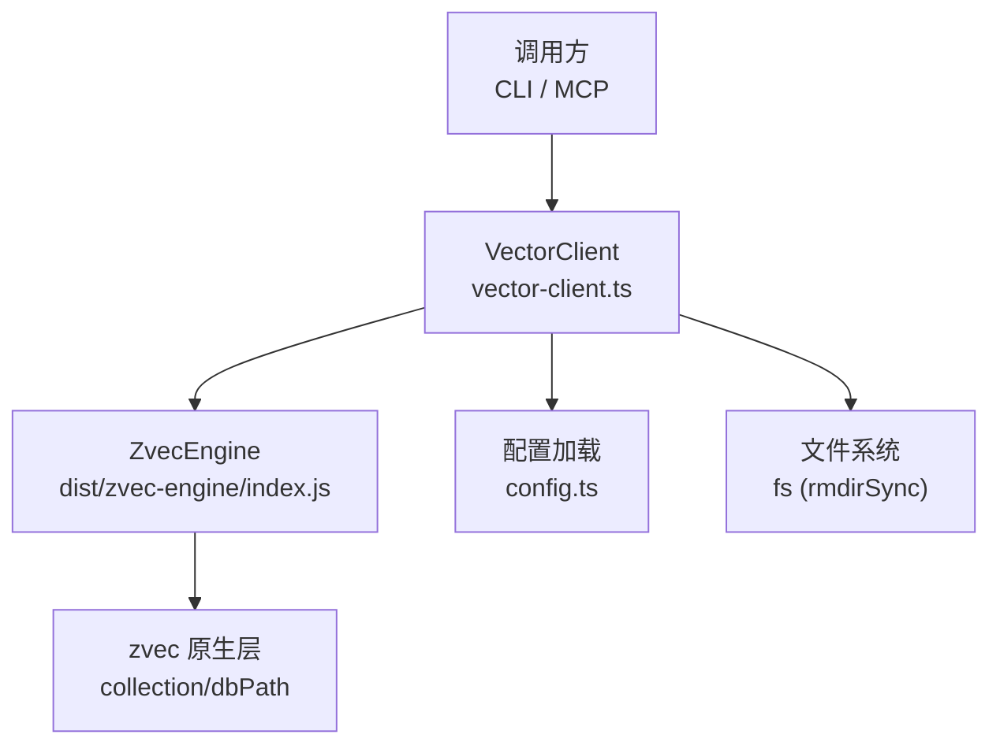
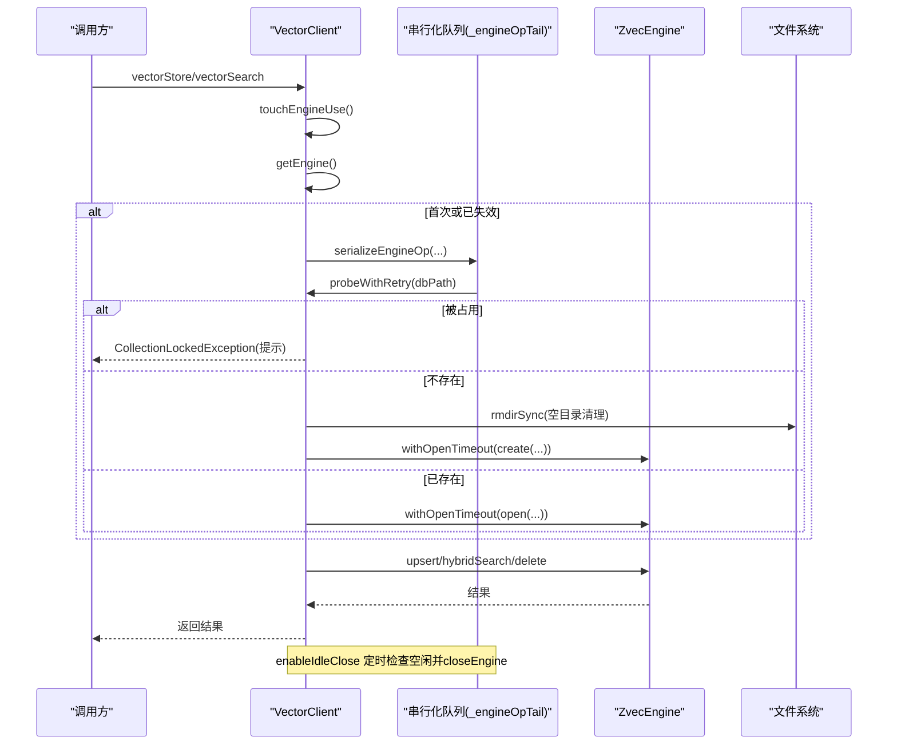
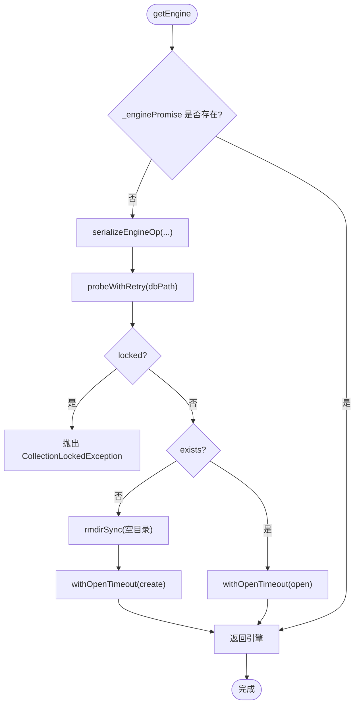
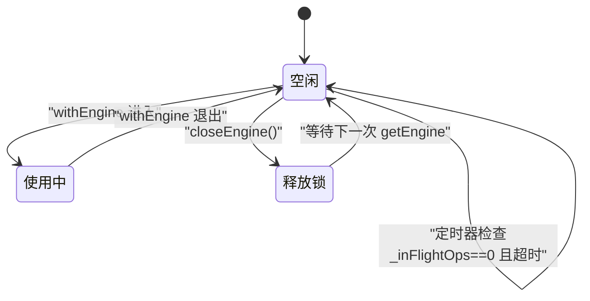
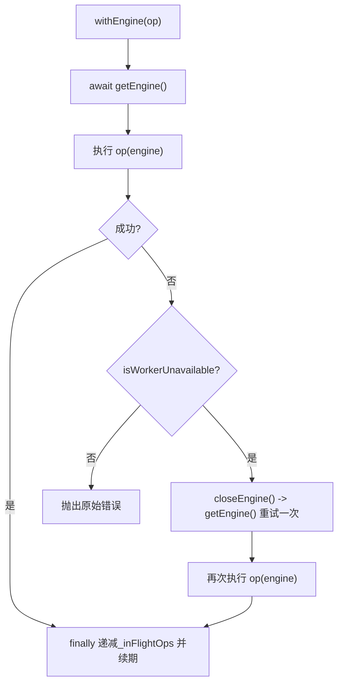
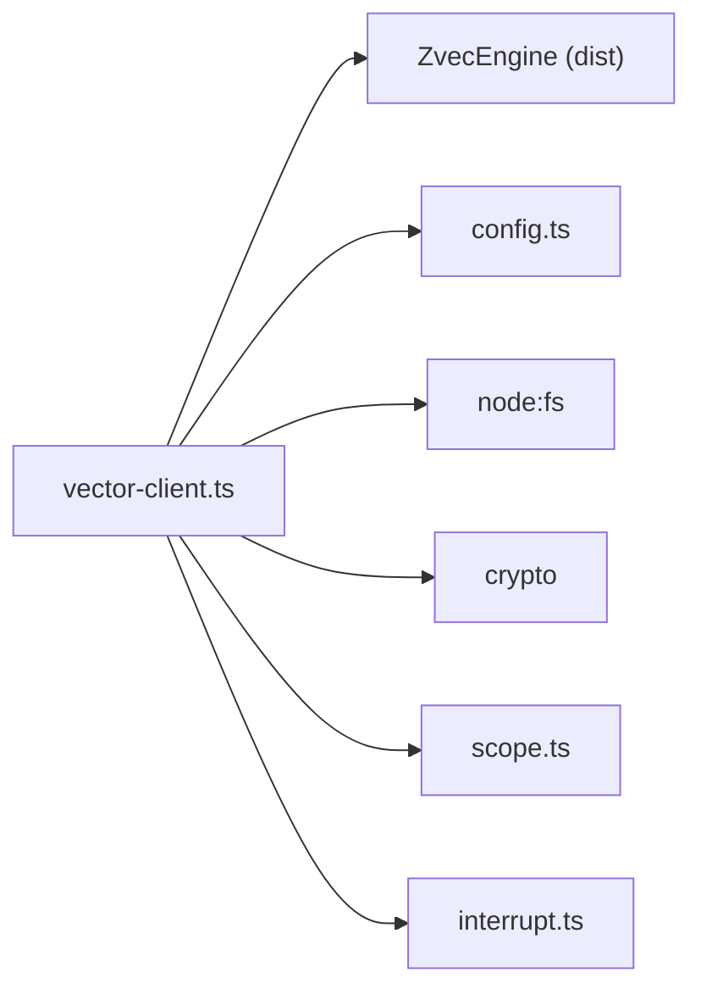

# 向量客户端核心

<cite>
**本文引用的文件**
- [src/lib/vector-client.ts](file://src/lib/vector-client.ts)
- [src/lib/config.ts](file://src/lib/config.ts)
- [test/vector-idle-race.test.ts](file://test/vector-idle-race.test.ts)
- [docs/configuration.md](file://docs/configuration.md)
</cite>

## 目录
1. [简介](#简介)
2. [项目结构](#项目结构)
3. [核心组件](#核心组件)
4. [架构总览](#架构总览)
5. [详细组件分析](#详细组件分析)
6. [依赖关系分析](#依赖关系分析)
7. [性能与调优](#性能与调优)
8. [故障排查指南](#故障排查指南)
9. [结论](#结论)

## 简介
本模块为 knowledge-indexer 的“向量客户端”（VectorClient）核心实现，封装底层 ZvecEngine（worker proxy），向上层 CLI/MCP 提供一致的异步检索/存储接口。其设计重点包括：
- 引擎单例管理：进程内唯一 ZvecEngine 实例，惰性创建、可关闭并重置缓存。
- 连接池机制：通过串行化队列避免原生 open/create 竞态，配合超时保护保证自愈能力。
- 生命周期控制：支持空闲释放锁（enableIdleClose），常驻服务场景下自动释放 LOCK，让多实例共享同一向量库。
- 错误处理与自愈：撞锁重试（probeWithRetry）、打开超时（withOpenTimeout）、worker 不可用检测与自愈重试（isWorkerUnavailable + withEngine）。
- 配置与调优：embedding、维度、向量库路径等由配置文件集中管理；提供关键可调参数与排障建议。

## 项目结构
向量客户端位于 src/lib/vector-client.ts，主要职责：
- 暴露对外 API：vectorSearch、vectorStore、vectorBulkStore、vectorDelete、ensureVectorAvailable、getEngine/closeEngine 等。
- 内部基础设施：引擎单例、串行化队列、空闲释放锁、错误自愈包装器。
- 配置组装：从 config.ts 加载 vectorDir、embedding 配置，构建 create/open 参数。

图表来源
- [src/lib/vector-client.ts:16-33](file://src/lib/vector-client.ts#L16-L33)
- [src/lib/config.ts:148-175](file://src/lib/config.ts#L148-L175)

章节来源
- [src/lib/vector-client.ts:1-150](file://src/lib/vector-client.ts#L1-L150)
- [src/lib/config.ts:110-175](file://src/lib/config.ts#L110-L175)

## 核心组件
- 引擎单例与缓存：_enginePromise 持有 Promise<ZvecEngine>，首次 getEngine() 时创建或打开，失败则清空缓存以允许下次重试。
- 串行化队列：_engineOpTail 确保 probe/create/open/close 等涉及原生 open 的操作串行执行，避免同进程并发导致的永久阻塞。
- 空闲释放锁：enableIdleClose(idleMs) 启动定时器，当无在途操作且超过 idle 时间后自动 closeEngine，释放 LOCK，供其他进程抢占。
- 错误自愈：withEngine 包装所有引擎使用，捕获 worker 不可用异常后自动 closeEngine 并重试一次；probeWithRetry 对 locked 状态进行退避重试；withOpenTimeout 限制 open/create 耗时。

章节来源
- [src/lib/vector-client.ts:183-216](file://src/lib/vector-client.ts#L183-L216)
- [src/lib/vector-client.ts:314-362](file://src/lib/vector-client.ts#L314-L362)
- [src/lib/vector-client.ts:373-407](file://src/lib/vector-client.ts#L373-L407)

## 架构总览
下图展示了 VectorClient 的关键流程：获取引擎、串行化、超时保护、空闲释放锁、以及自愈重试。

图表来源
- [src/lib/vector-client.ts:93-104](file://src/lib/vector-client.ts#L93-L104)
- [src/lib/vector-client.ts:164-181](file://src/lib/vector-client.ts#L164-L181)
- [src/lib/vector-client.ts:203-216](file://src/lib/vector-client.ts#L203-L216)
- [src/lib/vector-client.ts:314-340](file://src/lib/vector-client.ts#L314-L340)

## 详细组件分析

### 引擎单例管理与进程内缓存
- _enginePromise：缓存当前正在创建/打开或已打开的引擎 Promise。若失败会被置空，以便后续重试。
- getEngine：首次访问时进入串行化块，先 probeWithRetry 判断是否被占用或不存在；不存在则清理空目录并 create，否则 open；均带 withOpenTimeout 保护。
- closeEngine：先置空缓存再串行化关闭，避免竞态拿到正在关闭的旧引擎；close 会 drain 在途请求并释放 LOCK。

图表来源
- [src/lib/vector-client.ts:314-340](file://src/lib/vector-client.ts#L314-L340)
- [src/lib/vector-client.ts:346-362](file://src/lib/vector-client.ts#L346-L362)

章节来源
- [src/lib/vector-client.ts:183-216](file://src/lib/vector-client.ts#L183-L216)
- [src/lib/vector-client.ts:314-362](file://src/lib/vector-client.ts#L314-L362)

### 串行化队列 _engineOpTail
- 目的：防止同进程并发执行 zvec 原生 open/create/close 导致的高概率永久阻塞（约 62%）。
- 机制：所有涉及原生的操作通过 serializeEngineOp 排队执行；队尾吞掉异常，避免一次失败阻断后续排队。
- 覆盖范围：probe、create、open、close 均经此队列。

章节来源
- [src/lib/vector-client.ts:187-197](file://src/lib/vector-client.ts#L187-L197)
- [src/lib/vector-client.ts:319-335](file://src/lib/vector-client.ts#L319-L335)
- [src/lib/vector-client.ts:352-360](file://src/lib/vector-client.ts#L352-L360)

### 空闲释放锁 enableIdleClose
- 适用场景：常驻 MCP 服务，多个实例共享同一向量库。空闲超时后自动 closeEngine 释放 LOCK，其他实例可抢占。
- 工作机制：
  - 启用后记录最后使用时间 _lastUseAt，周期性检查空闲条件：_inFlightOps === 0 且超过 idleMs。
  - 满足条件即触发 closeEngine，释放 LOCK；下次调用时惰性 reopen。
  - 在途保护：withEngine 在进入时 _inFlightOps++，完成后 finally 中递减并续期 _lastUseAt，避免 embedding 网络阶段被误判为空闲。
- 安全要点：close 底层 drain 在途请求，不会中断正在执行的写入/检索；idle 判定加入 _inFlightOps 计数修复竞态。

图表来源
- [src/lib/vector-client.ts:146-181](file://src/lib/vector-client.ts#L146-L181)
- [src/lib/vector-client.ts:389-407](file://src/lib/vector-client.ts#L389-L407)

章节来源
- [src/lib/vector-client.ts:146-181](file://src/lib/vector-client.ts#L146-L181)
- [src/lib/vector-client.ts:389-407](file://src/lib/vector-client.ts#L389-L407)
- [test/vector-idle-race.test.ts:54-78](file://test/vector-idle-race.test.ts#L54-L78)

### 错误处理与自愈机制
- 撞锁重试 probeWithRetry：检测到 locked 时按固定间隔重试最多 N 次，避免立即失败，提升共享向量库下的成功率。
- 打开超时 withOpenTimeout：限制 create/open 的最大耗时，超时后中断本次调用并释放可能迟到的孤儿 engine，保证自愈能力不被挂死。
- Worker 不可用检测 isWorkerUnavailable：基于 duck-typing 判断（err.name === 'WorkerUnavailableError' 或消息含 "worker not open"），兼容不同构建产物。
- withEngine 自愈：捕获 worker 不可用异常后，closeEngine 并重新 getEngine 重试一次，兜底残余竞态。

图表来源
- [src/lib/vector-client.ts:93-104](file://src/lib/vector-client.ts#L93-L104)
- [src/lib/vector-client.ts:203-216](file://src/lib/vector-client.ts#L203-L216)
- [src/lib/vector-client.ts:373-377](file://src/lib/vector-client.ts#L373-L377)
- [src/lib/vector-client.ts:389-407](file://src/lib/vector-client.ts#L389-L407)

章节来源
- [src/lib/vector-client.ts:93-104](file://src/lib/vector-client.ts#L93-L104)
- [src/lib/vector-client.ts:203-216](file://src/lib/vector-client.ts#L203-L216)
- [src/lib/vector-client.ts:373-407](file://src/lib/vector-client.ts#L373-L407)

### 数据模型与字段策略
- 文档 ID：generateDocId(text, scope, tag) 使用 sha256(text+scope+tag) 前 32 位，保证幂等 upsert 与多标签独立存储。
- 标量字段：tag、scope、group 均为 STRING 并索引；content 作为 FTS 字段（jieba 分词）。
- 过滤：buildScopeTagFilter 将 scope 必等与 tag 列表 OR 组合，支持不传 tags 时搜索全部 tag。

章节来源
- [src/lib/vector-client.ts:225-242](file://src/lib/vector-client.ts#L225-L242)
- [src/lib/vector-client.ts:271-294](file://src/lib/vector-client.ts#L271-L294)
- [src/lib/vector-client.ts:621-628](file://src/lib/vector-client.ts#L621-L628)

### 可用性检测 ensureVectorAvailable
- 若已有 _enginePromise，直接 await 其 settle，避免重复 probe 造成误报“被自身占用”。
- 否则串行化 probeWithRetry，根据 locked/exists/healthy 返回可用性与原因码（LOCKED/CORRUPTED/PROBE_ERROR）。

章节来源
- [src/lib/vector-client.ts:420-467](file://src/lib/vector-client.ts#L420-L467)

## 依赖关系分析
- 外部依赖：
  - ZvecEngine（dist 构建产物）：提供 probe/create/open/upsert/search/delete/listIds/fetch 等能力。
  - fs：用于清理空目录（rmdirSync）。
  - crypto：生成 doc id。
- 内部依赖：
  - config.ts：loadConfig/getVectorDir/getEmbeddingConfig，提供 vectorDir、embedding 配置。
  - scope.ts：validateScope（管理命令仅做字符校验）。
  - interrupt.ts：interruptGuidance（中断引导提示）。

图表来源
- [src/lib/vector-client.ts:16-33](file://src/lib/vector-client.ts#L16-L33)
- [src/lib/config.ts:148-175](file://src/lib/config.ts#L148-L175)

章节来源
- [src/lib/vector-client.ts:16-33](file://src/lib/vector-client.ts#L16-L33)
- [src/lib/config.ts:148-175](file://src/lib/config.ts#L148-L175)

## 性能与调优
- 关键可调参数
  - 撞锁重试间隔与次数：LOCK_RETRY_INTERVAL_MS、LOCK_RETRY_MAX（默认 2s、3 次）。
  - 打开超时：ENGINE_OPEN_TIMEOUT_MS（默认 20s），防止原生挂死影响自愈。
  - 文本长度上限：MAX_TEXT_LENGTH（默认 50,000 字符）。
  - 扫描限制：LIST_ALL_LIMIT（默认 10,000），listIds 分页上限。
  - 空闲释放窗口：enableIdleClose(idleMs)，常驻服务推荐设置合理值（如数百毫秒至数秒）。
- 性能建议
  - 批量写入优先使用 vectorBulkStore，减少多次往返。
  - 合理设置 limit/threshold，避免全量扫描。
  - 大库统计/枚举建议使用 scanLimit 控制扫描范围。
  - 常驻服务开启 enableIdleClose，避免长期持锁影响其他实例。
- 配置项（来自配置文档）
  - vectorDir：向量库目录，schema 创建后不可改，增字段需重建。
  - embedding.provider/baseURL/model/dimension/apiKey：嵌入模型与维度必须与 collection.dimension 一致。
  - scopeMode：default/strict，严格模式下仅允许白名单 scope。

章节来源
- [src/lib/vector-client.ts:120-144](file://src/lib/vector-client.ts#L120-L144)
- [src/lib/vector-client.ts:200-216](file://src/lib/vector-client.ts#L200-L216)
- [src/lib/vector-client.ts:519-521](file://src/lib/vector-client.ts#L519-L521)
- [src/lib/vector-client.ts:615-616](file://src/lib/vector-client.ts#L615-L616)
- [docs/configuration.md:59-88](file://docs/configuration.md#L59-L88)
- [docs/configuration.md:90-128](file://docs/configuration.md#L90-L128)

## 故障排查指南
- 常见错误与定位
  - 向量库被占用（LOCKED）：多进程共享导致，等待对方释放或调整空闲释放策略；查看 ensureVectorAvailable 返回 reason/code。
  - 向量库损坏（CORRUPTED）：建议执行 ki restore <scope> --from-snapshot 重建。
  - 打开超时：检查磁盘状态与向量库目录；确认未出现原生挂死；必要时增大 ENGINE_OPEN_TIMEOUT_MS。
  - Worker 不可用：通常因空闲释放锁与 in-flight 竞态导致；withEngine 会自动重试；若持续出现，检查 enableIdleClose 设置与 in-flight 逻辑。
- 排查步骤
  - 使用 ensureVectorAvailable(scope) 快速诊断可用性与原因码。
  - 检查日志中的撞锁重试信息（[kisearch] 向量库被其他进程占用...）。
  - 对于导入/删除等写操作，关注 withEngine 包装后的重试行为。
  - 对大库操作，适当降低 scanLimit 或分批处理。
- 回归测试参考
  - vector-idle-race.test.ts 验证了 idle 窗口小于 embedding 耗时时，在途操作不会被中断，且无 "worker not open" 错误。

章节来源
- [src/lib/vector-client.ts:420-467](file://src/lib/vector-client.ts#L420-L467)
- [src/lib/vector-client.ts:93-104](file://src/lib/vector-client.ts#L93-L104)
- [src/lib/vector-client.ts:373-407](file://src/lib/vector-client.ts#L373-L407)
- [test/vector-idle-race.test.ts:54-78](file://test/vector-idle-race.test.ts#L54-L78)

## 结论
VectorClient 通过引擎单例、串行化队列、超时保护与空闲释放锁，实现了高可用的向量库访问能力；结合撞锁重试与 worker 不可用自愈，有效应对多进程共享与网络波动等复杂场景。配合合理的配置与调优参数，可在 CLI 短命令与常驻 MCP 服务两种模式下稳定运行。建议在常驻服务中启用 enableIdleClose，并根据业务规模调整超时与扫描限制，以获得最佳性能与稳定性。