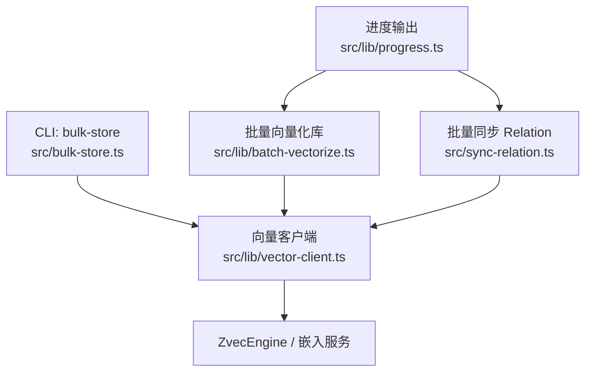
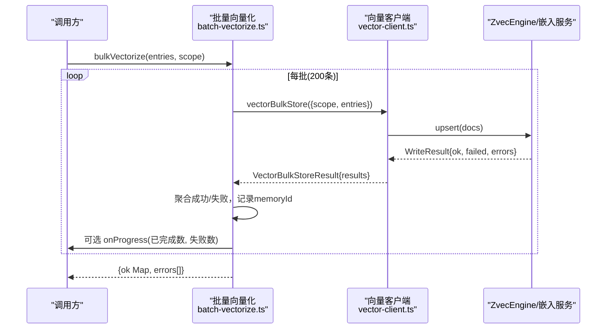
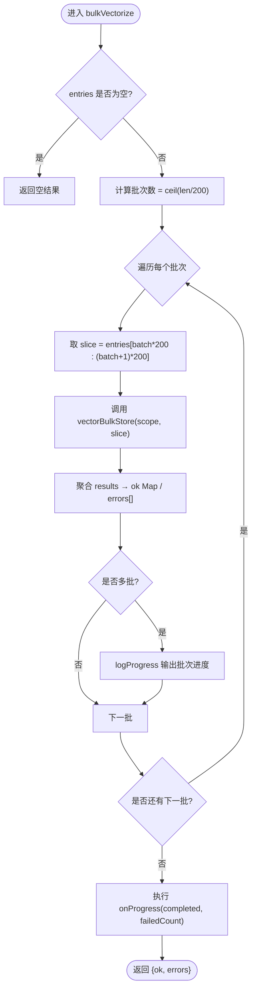
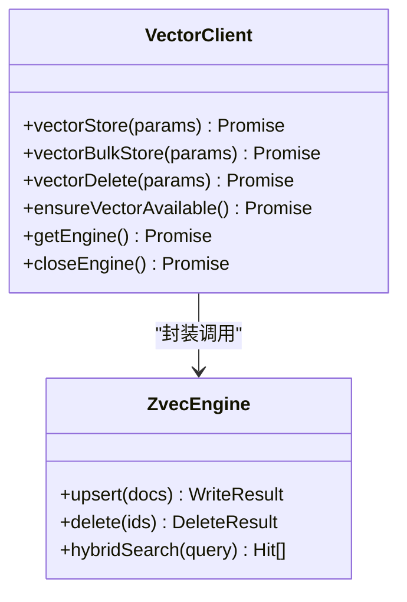
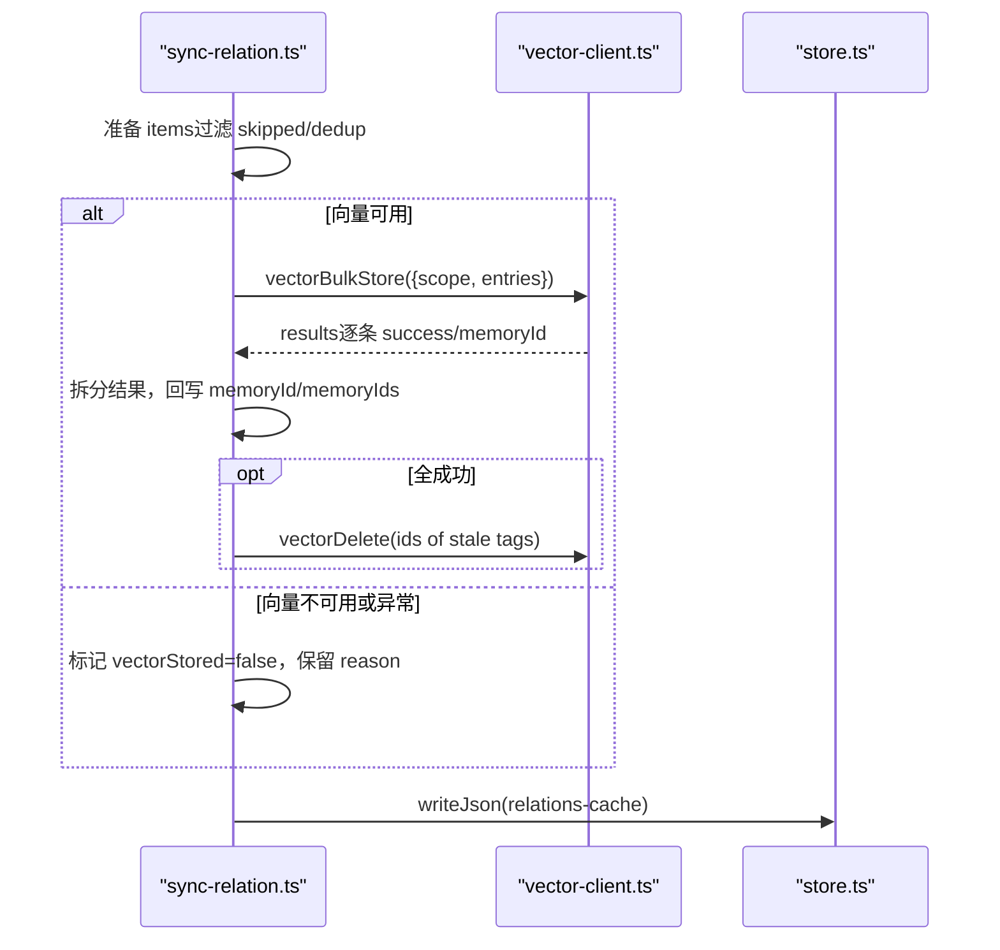
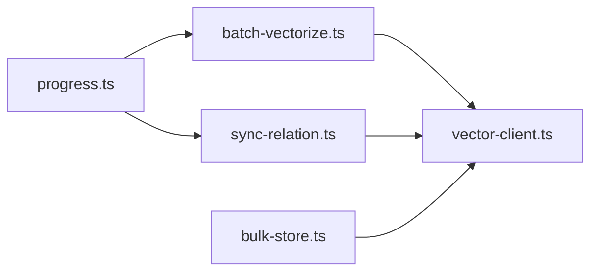

# 批量向量化处理

<cite>
**本文引用的文件**
- [batch-vectorize.ts](file://src/lib/batch-vectorize.ts)
- [vector-client.ts](file://src/lib/vector-client.ts)
- [bulk-store.ts](file://src/bulk-store.ts)
- [sync-relation.ts](file://src/sync-relation.ts)
- [progress.ts](file://src/lib/progress.ts)
- [backup-restore.md](file://docs/backup-restore.md)
- [error-handling.md](file://docs/error-handling.md)
- [cli.md](file://docs/cli.md)
- [DESIGN.md](file://.requirements/2026-06-18-向量存储与KB写入并行化优化/design/DESIGN.md)
- [REF_S03_VectorAdapter_DESIGN.md](file://.requirements/2026-07-17-KiSearch-zvec-node-mcp/design/REF_S03_VectorAdapter_DESIGN.md)
- [sync-relation-bulk-vector.test.ts](file://test/sync-relation-bulk-vector.test.ts)
</cite>

## 目录
1. [简介](#简介)
2. [项目结构](#项目结构)
3. [核心组件](#核心组件)
4. [架构总览](#架构总览)
5. [详细组件分析](#详细组件分析)
6. [依赖关系分析](#依赖关系分析)
7. [性能考量](#性能考量)
8. [故障排查指南](#故障排查指南)
9. [结论](#结论)
10. [附录](#附录)

## 简介
本文件聚焦 knowledge-indexer 的“批量向量化处理”模块，系统性说明其任务队列管理、并发控制、进度跟踪机制；详解 vectorBulkStore 的幂等 upsert、错误处理与结果聚合；总结批大小调优、内存管理与网络请求合并等性能策略；给出大规模数据导入的最佳实践（预处理、错误恢复、监控指标）以及重试与断点续传能力。

## 项目结构
批量向量化相关代码主要分布在以下位置：
- 批量编排与分片：src/lib/batch-vectorize.ts
- 向量客户端与引擎封装：src/lib/vector-client.ts
- CLI 批量存储入口：src/bulk-store.ts
- 批量同步 Relation 流程（含向量阶段）：src/sync-relation.ts
- 控制台进度输出：src/lib/progress.ts
- 设计文档与迁移说明：.requirements 下的设计文档
- 测试用例：test/sync-relation-bulk-vector.test.ts

图表来源
- [bulk-store.ts:1-110](file://src/bulk-store.ts#L1-L110)
- [batch-vectorize.ts:1-183](file://src/lib/batch-vectorize.ts#L1-L183)
- [vector-client.ts:1-754](file://src/lib/vector-client.ts#L1-L754)
- [sync-relation.ts:379-748](file://src/sync-relation.ts#L379-L748)
- [progress.ts:1-62](file://src/lib/progress.ts#L1-L62)

章节来源
- [bulk-store.ts:1-110](file://src/bulk-store.ts#L1-L110)
- [batch-vectorize.ts:1-183](file://src/lib/batch-vectorize.ts#L1-L183)
- [vector-client.ts:1-754](file://src/lib/vector-client.ts#L1-L754)
- [sync-relation.ts:379-748](file://src/sync-relation.ts#L379-L748)
- [progress.ts:1-62](file://src/lib/progress.ts#L1-L62)

## 核心组件
- 批量向量化库（batch-vectorize.ts）
  - 提供 vectorizeOne、batchVectorize（串行）、bulkVectorize（分批调用 vectorBulkStore）三种模式。
  - 内置批大小常量 VECTORIZE_BATCH_SIZE=200，支持批间进度回调与最终 onProgress 汇总。
- 向量客户端（vector-client.ts）
  - 统一封装 ZvecEngine 的 upsert/delete/search/list 等操作。
  - 实现 docId 确定性生成（sha256(text+scope+tag)），保证幂等 upsert。
  - 提供 ensureVectorAvailable、withEngine 在途保护、空闲释放锁、撞锁重试等健壮性机制。
- CLI 批量存储（bulk-store.ts）
  - 读取 JSON 输入并校验，调用 vectorBulkStore，返回结构化结果。
- 批量同步 Relation（sync-relation.ts）
  - 将 KB 写入与向量写入解耦，支持一次 embedding + 一次 worker upsert 的批量路径。
  - 对部分失败场景进行“不删旧向量”的数据守恒处理，并维护逐条与顶层 vectorStored 语义。
- 进度输出（progress.ts）
  - 控制台进度条与阶段提示，非 TTY 时逐行输出，避免污染 stdout。

章节来源
- [batch-vectorize.ts:23-183](file://src/lib/batch-vectorize.ts#L23-L183)
- [vector-client.ts:225-590](file://src/lib/vector-client.ts#L225-L590)
- [bulk-store.ts:28-78](file://src/bulk-store.ts#L28-L78)
- [sync-relation.ts:379-748](file://src/sync-relation.ts#L379-L748)
- [progress.ts:14-62](file://src/lib/progress.ts#L14-L62)

## 架构总览
批量向量化采用“上层编排 + 底层引擎”的分层架构：
- 上层（batch-vectorize.ts、sync-relation.ts）负责：
  - 任务切分（按固定批大小）
  - 进度上报（logProgress/onProgress）
  - 错误聚合（errors 列表、逐条 success 标记）
  - 幂等与去重（docId 由内容+scope+tag 决定）
- 下层（vector-client.ts）负责：
  - 引擎生命周期（getEngine/closeEngine）
  - 并发安全（engineOpTail 串行化 open/create/probe）
  - 可用性检测与自愈（ensureVectorAvailable、withEngine 重试）
  - 批量 upsert（vectorBulkStore）与删除（vectorDelete）

图表来源
- [batch-vectorize.ts:129-183](file://src/lib/batch-vectorize.ts#L129-L183)
- [vector-client.ts:547-590](file://src/lib/vector-client.ts#L547-L590)

章节来源
- [batch-vectorize.ts:129-183](file://src/lib/batch-vectorize.ts#L129-L183)
- [vector-client.ts:547-590](file://src/lib/vector-client.ts#L547-L590)

## 详细组件分析

### 批量向量化库（batch-vectorize.ts）
- 单条向量化 vectorizeOne
  - 构造 content（entry.text），调用 vectorStore，返回 docId。
- 串行批量 batchVectorize
  - 适合增量小批量场景，逐条调用 vectorizeOne，收集 ok/errors。
- 批量向量化 bulkVectorize
  - 以 200 为批大小切片 entries，循环调用 vectorBulkStore。
  - 每批完成后统计成功/失败，累积到 ok Map 与 errors 列表。
  - 多批时通过 logProgress 输出批次进度；最终通过 options.onProgress 一次性回调完成集合。

图表来源
- [batch-vectorize.ts:129-183](file://src/lib/batch-vectorize.ts#L129-L183)

章节来源
- [batch-vectorize.ts:23-183](file://src/lib/batch-vectorize.ts#L23-L183)

### 向量客户端（vector-client.ts）
- 幂等 upsert
  - docId = sha256(text + scope + tag) 截 32，相同内容在同一 scope/tag 下产生相同 id，重复写入覆盖，天然幂等。
- 批量存储 vectorBulkStore
  - 将 entries 映射为 docs（含 fields: tag, scope, group），调用 engine.upsert。
  - 根据 WriteResult.errors 组装逐条 BulkStoreItemResult（index, memoryId, success, error）。
- 删除 vectorDelete
  - 按 ids 批量删除，返回 deleted 数量与 errors。
- 可用性检测 ensureVectorAvailable
  - 若已有 engine 单例则复用状态；否则 probe dbPath，区分 LOCKED/CORRUPTED/PROBE_ERROR。
- 并发与自愈
  - withEngine：在途计数 _inFlightOps 防止空闲释放锁误杀；worker 不可用时自动 closeEngine 并重试一次。
  - serializeEngineOp：所有 probe/open/create/close 串行化，避免原生竞态导致永久阻塞。
  - 撞锁重试 probeWithRetry：检测到 locked 时等待后重试，最多 3 次。

图表来源
- [vector-client.ts:225-590](file://src/lib/vector-client.ts#L225-L590)
- [vector-client.ts:314-407](file://src/lib/vector-client.ts#L314-L407)

章节来源
- [vector-client.ts:225-590](file://src/lib/vector-client.ts#L225-L590)
- [vector-client.ts:314-407](file://src/lib/vector-client.ts#L314-L407)

### CLI 批量存储（bulk-store.ts）
- 解析命令行参数，校验 scope，检查向量服务可用性。
- 读取 JSON 输入文件，校验数组结构与 text 字段。
- 调用 vectorBulkStore，返回结构化结果（total/succeeded/failed/results）。
- CLI 结束时关闭 engine，确保进程可退出。

章节来源
- [bulk-store.ts:28-78](file://src/bulk-store.ts#L28-L78)
- [bulk-store.ts:82-110](file://src/bulk-store.ts#L82-L110)

### 批量同步 Relation（sync-relation.ts）
- 批量路径 executeBulkSyncRelation
  - 阶段1：准备 items，过滤 skipped/dedup。
  - 阶段2：若启用向量，调用 vectorBulkStore 一次 embed + 一次 upsert。
  - 阶段3：拆分结果，回写 memoryId/memoryIds；对旧 tag 向量进行清理（全成功时）。
  - 阶段4：writeJson 落盘 relations-cache。
- 错误处理与数据守恒
  - 部分失败不清理旧向量，避免“删旧丢新”。
  - 顶层 vectorStored 仅在全部 active item 完全成功时为 true。
- 与 KB 通道解耦
  - 向量失败不影响 KB 写入，两通道独立。

图表来源
- [sync-relation.ts:379-748](file://src/sync-relation.ts#L379-L748)

章节来源
- [sync-relation.ts:379-748](file://src/sync-relation.ts#L379-L748)

### 进度跟踪（progress.ts）
- 控制台进度条（apt install 风格），非 TTY 时逐行输出，避免污染 stdout JSON。
- 提供 logPhaseStart/logPhaseDone/logInfo/logWarn/logSummary 等辅助函数。
- 在 bulkVectorize 中用于多批场景的批次进度反馈。

章节来源
- [progress.ts:14-62](file://src/lib/progress.ts#L14-L62)

## 依赖关系分析
- batch-vectorize.ts 依赖 vector-client.ts 的 vectorStore/vectorBulkStore/vectorDelete。
- sync-relation.ts 依赖 vector-client.ts 的 ensureVectorAvailable/vectorBulkStore/vectorDelete。
- bulk-store.ts 依赖 vector-client.ts 的 vectorBulkStore/ensureVectorAvailable/closeEngine。
- progress.ts 被 batch-vectorize.ts 与 sync-relation.ts 使用，仅用于控制台输出。

图表来源
- [batch-vectorize.ts:17-19](file://src/lib/batch-vectorize.ts#L17-L19)
- [sync-relation.ts:379-748](file://src/sync-relation.ts#L379-L748)
- [bulk-store.ts:19-24](file://src/bulk-store.ts#L19-L24)
- [progress.ts:14-62](file://src/lib/progress.ts#L14-L62)

章节来源
- [batch-vectorize.ts:17-19](file://src/lib/batch-vectorize.ts#L17-L19)
- [sync-relation.ts:379-748](file://src/sync-relation.ts#L379-L748)
- [bulk-store.ts:19-24](file://src/bulk-store.ts#L19-L24)
- [progress.ts:14-62](file://src/lib/progress.ts#L14-L62)

## 性能考量
- 批大小调优
  - 默认 VECTORIZE_BATCH_SIZE=200，平衡单次网络负载与中间进度可见性。可根据网络延迟与模型服务吞吐调整。
- 内存管理
  - 分批切片避免一次性加载超大数组；onProgress 回调允许调用方按需持久化进度，降低内存压力。
- 网络请求合并
  - vectorBulkStore 将多条文本合并为一次 upsert，减少 HTTP/嵌入调用次数。
  - 引擎层 open/create/probe/close 经 serializeEngineOp 串行化，避免原生竞态导致的阻塞。
- 并发控制
  - withEngine 在途计数防止空闲释放锁误杀；enableIdleClose 供常驻 MCP 空闲超时释放锁，让其他实例错开使用。
  - 撞锁重试 probeWithRetry 在多实例共享向量库时提升鲁棒性。
- 幂等与去重
  - docId 由 text+scope+tag 确定，重复写入覆盖，天然幂等，避免重复条目。

章节来源
- [batch-vectorize.ts:129-183](file://src/lib/batch-vectorize.ts#L129-L183)
- [vector-client.ts:120-144](file://src/lib/vector-client.ts#L120-L144)
- [vector-client.ts:183-216](file://src/lib/vector-client.ts#L183-L216)
- [vector-client.ts:225-242](file://src/lib/vector-client.ts#L225-L242)
- [vector-client.ts:314-407](file://src/lib/vector-client.ts#L314-L407)

## 故障排查指南
- 向量服务不可用
  - ensureVectorAvailable 返回 code: LOCKED/CORRUPTED/PROBE_ERROR，按提示处理（停止占用进程、重建向量库等）。
- 部分失败处理
  - 部分失败不清理旧向量，避免“删旧丢新”；逐条 vectorReason 透出原因，顶层 vectorStored=false。
- 恢复与重建
  - 使用 ki restore --from-snapshot 还原 scope；必要时 --rebuild-vector 重建向量索引。
- 常见排障顺序
  - 参数完整性 → scope 注册 → 输入路径存在性 → 运行时数据文件完整性 → 工作流顺序。

章节来源
- [vector-client.ts:420-467](file://src/lib/vector-client.ts#L420-L467)
- [sync-relation.ts:727-748](file://src/sync-relation.ts#L727-L748)
- [backup-restore.md:120-239](file://docs/backup-restore.md#L120-L239)
- [error-handling.md:130-153](file://docs/error-handling.md#L130-L153)

## 结论
该批量向量化模块通过“分批 + 幂等 upsert + 引擎自愈”的组合，实现了高吞吐、强一致性与可观测性的平衡。上层编排关注任务切分与结果聚合，下层引擎负责并发安全与资源管理。配合进度回调与快照恢复，可在大规模数据导入场景中稳定运行并提供可恢复性保障。

## 附录

### 批量存储接口 vectorBulkStore 实现原理
- 幂等 upsert
  - docId = sha256(text+scope+tag) 截 32，相同内容在同 scope/tag 下幂等覆盖。
- 错误处理
  - WriteResult.errors 按 doc id 定位，组装为逐条 BulkStoreItemResult（success/error）。
- 结果聚合
  - 返回 total/succeeded/failed/results，便于上层统计与展示。

章节来源
- [vector-client.ts:225-242](file://src/lib/vector-client.ts#L225-L242)
- [vector-client.ts:547-590](file://src/lib/vector-client.ts#L547-L590)

### 批量处理的性能优化策略
- 批大小调优
  - 默认 200，可按网络与模型服务特性调整。
- 内存管理
  - 分批切片 + onProgress 回调，支持增量保存进度，降低峰值内存。
- 网络请求合并
  - 批量 upsert 减少 HTTP/嵌入调用次数；引擎操作串行化避免原生竞态。

章节来源
- [batch-vectorize.ts:129-183](file://src/lib/batch-vectorize.ts#L129-L183)
- [vector-client.ts:183-216](file://src/lib/vector-client.ts#L183-L216)

### 批量导入最佳实践
- 数据预处理
  - 清洗文本长度（MAX_TEXT_LENGTH 限制），规范化 tag（小写）。
- 错误恢复
  - 捕获 vectorBulkStore 异常，记录 errors；部分失败不清理旧向量。
- 监控指标
  - 使用 logProgress 输出批次进度；结合 onProgress 累计 completed/failedCount。

章节来源
- [vector-client.ts:513-542](file://src/lib/vector-client.ts#L513-L542)
- [progress.ts:36-49](file://src/lib/progress.ts#L36-L49)
- [batch-vectorize.ts:169-179](file://src/lib/batch-vectorize.ts#L169-L179)

### 大规模数据处理的重试与断点续传
- 重试机制
  - 撞锁重试 probeWithRetry（最多 3 次，间隔 2s）；withEngine 在 worker 不可用时自动重试一次。
  - 打开/创建引擎带超时 ENGINE_OPEN_TIMEOUT_MS，避免永久挂起。
- 断点续传
  - 当前进度文件逻辑已随增量直连废弃移除；可通过 onProgress 自定义持久化进度（completed paths 与 failedCount）。
  - 结合 ki restore --from-snapshot 与 --rebuild-vector 实现整体恢复与向量重建。

章节来源
- [vector-client.ts:93-104](file://src/lib/vector-client.ts#L93-L104)
- [vector-client.ts:199-216](file://src/lib/vector-client.ts#L199-L216)
- [backup-restore.md:120-239](file://docs/backup-restore.md#L120-L239)
- [cli.md:1309-1370](file://docs/cli.md#L1309-L1370)

### 测试与验证要点
- 全成功：memoryId/memoryIds 回写、旧 tag 向量清理、顶层 vectorStored=true。
- 部分失败：不清理旧向量、逐条 vectorReason、顶层 vectorStored=false。
- 同批重复 relation：后一条覆盖前一条，前一条不独立写向量。
- 向量服务不可用：KB 层不阻塞，逐条 vectorStored=false。

章节来源
- [sync-relation-bulk-vector.test.ts:107-200](file://test/sync-relation-bulk-vector.test.ts#L107-L200)