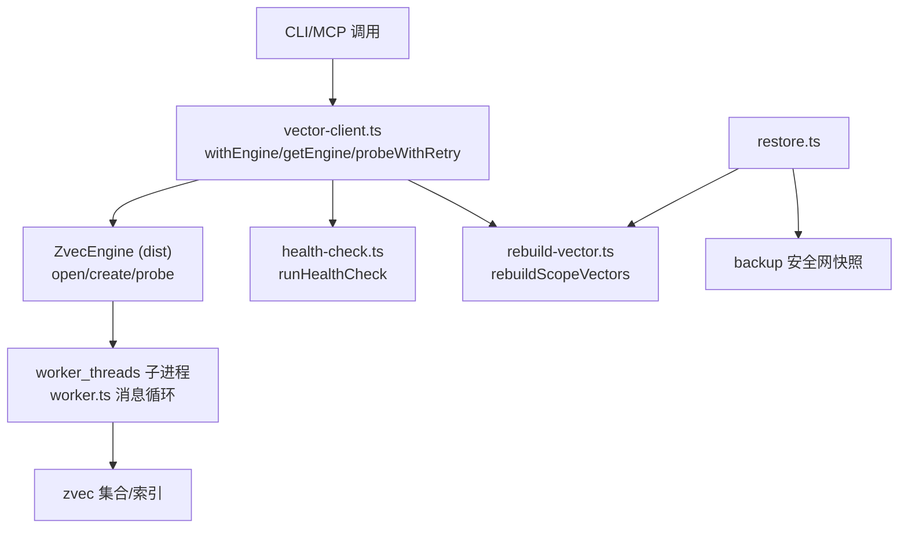
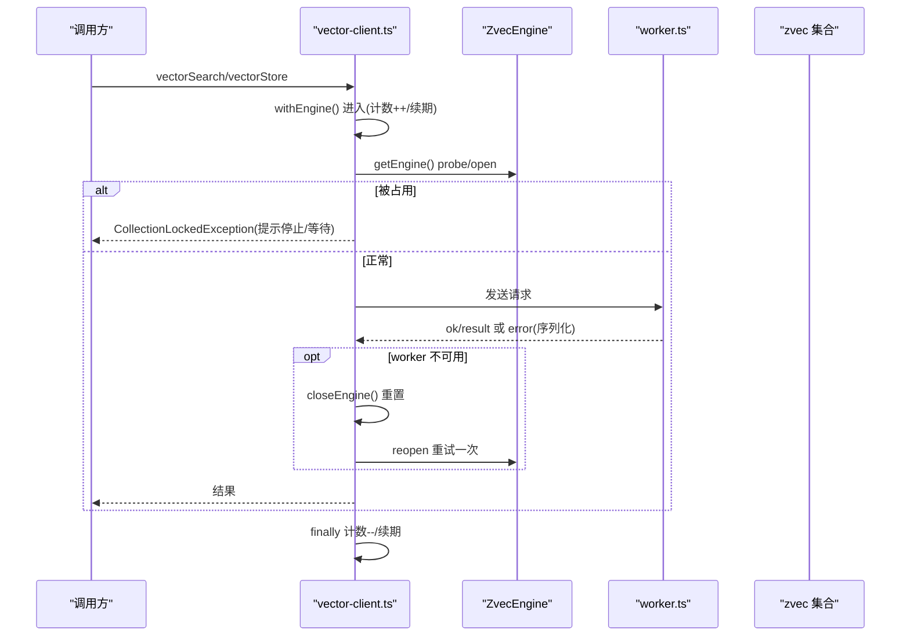
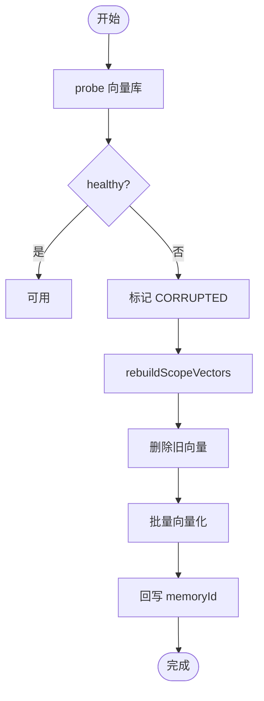
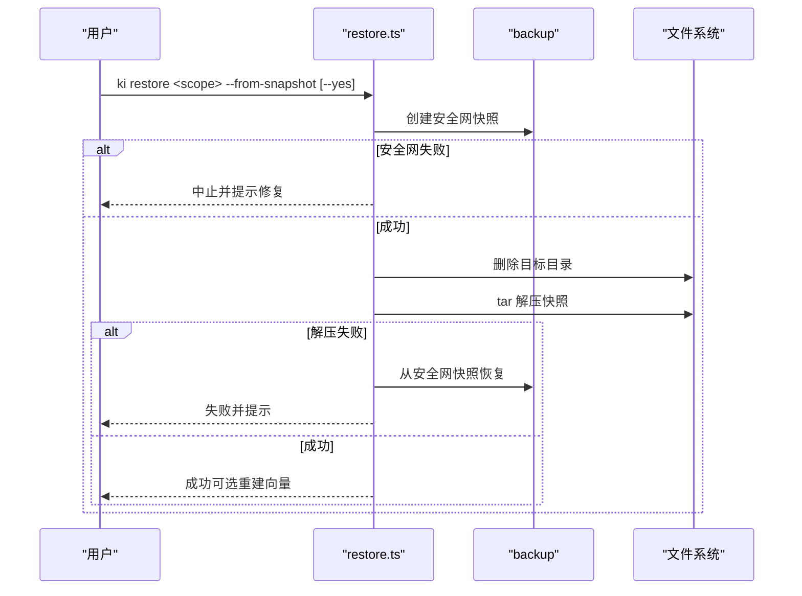
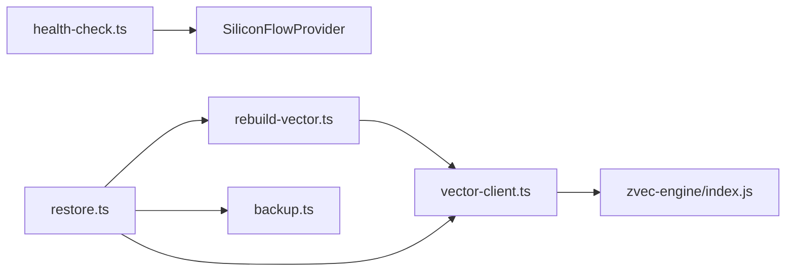

# 错误处理与恢复

<cite>
**本文引用的文件**
- [errors.ts](file://src/zvec-engine/errors.ts)
- [worker.ts](file://src/zvec-engine/worker.ts)
- [vector-client.ts](file://src/lib/vector-client.ts)
- [health-check.ts](file://src/lib/health-check.ts)
- [rebuild-vector.ts](file://src/lib/rebuild-vector.ts)
- [restore.ts](file://src/restore.ts)
- [error-handling.test.ts](file://test/error-handling.test.ts)
- [mcp-daemon.test.ts](file://test/mcp-daemon.test.ts)
- [search-retrieval.md](file://.gitnexus/wiki/search-retrieval.md)
- [backup-restore.md](file://docs/backup-restore.md)
- [cli.md](file://docs/cli.md)
- [AGENTS.md](file://AGENTS.md)
</cite>

## 目录
1. [简介](#简介)
2. [项目结构](#项目结构)
3. [核心组件](#核心组件)
4. [架构总览](#架构总览)
5. [详细组件分析](#详细组件分析)
6. [依赖关系分析](#依赖关系分析)
7. [性能考虑](#性能考虑)
8. [故障诊断指南](#故障诊断指南)
9. [结论](#结论)
10. [附录](#附录)

## 简介
本文件聚焦 knowledge-indexer 的错误处理与恢复机制，覆盖以下目标：
- 错误类型识别与处理策略：CollectionLockedException、WorkerUnavailableError、NetworkError（含上游 embedding 网络异常）等。
- 自愈机制：自动重试、超时保护、空闲释放锁、在途操作保护、状态恢复。
- 向量库损坏检测与修复：健康检查、数据验证、重建策略。
- 故障诊断工具与方法：日志分析、状态检查、问题定位技巧。
- 生产容错设计与灾难恢复：快照还原、安全网快照、幂等重建、可观测性。

## 项目结构
围绕错误与恢复的关键路径分布在如下模块：
- 引擎层错误定义与跨线程序列化：zvec-engine/errors.ts、worker.ts
- 向量适配器与自愈：lib/vector-client.ts
- 健康检查与诊断：lib/health-check.ts
- 向量重建与恢复：lib/rebuild-vector.ts、src/restore.ts
- 测试与行为验证：test/error-handling.test.ts、test/mcp-daemon.test.ts
- 文档与使用指引：docs/backup-restore.md、docs/cli.md、.gitnexus/wiki/search-retrieval.md

图示来源
- [vector-client.ts:314-467](file://src/lib/vector-client.ts#L314-L467)
- [worker.ts:62-87](file://src/zvec-engine/worker.ts#L62-L87)
- [health-check.ts:148-213](file://src/lib/health-check.ts#L148-L213)
- [rebuild-vector.ts:246-323](file://src/lib/rebuild-vector.ts#L246-L323)
- [restore.ts:123-283](file://src/restore.ts#L123-L283)

章节来源
- [vector-client.ts:1-754](file://src/lib/vector-client.ts#L1-L754)
- [worker.ts:48-87](file://src/zvec-engine/worker.ts#L48-L87)
- [health-check.ts:1-234](file://src/lib/health-check.ts#L1-L234)
- [rebuild-vector.ts:1-324](file://src/lib/rebuild-vector.ts#L1-L324)
- [restore.ts:1-450](file://src/restore.ts#L1-L450)

## 核心组件
- 类型化异常体系：统一基类 ZvecEngineError 及细分错误（集合生命周期、Worker 相关、Schema/Embedding 等），支持跨线程反序列化。
- 向量适配器（Vector Adapter）：封装 open/create/probe、撞锁重试、空闲释放锁、在途操作计数、worker 不可用自愈重试、打开超时保护。
- 健康检查：配置、目录、embedding 连通性/密钥/维度、collection 存在性、scopes.default 的只读诊断。
- 向量重建：从已还原 KB 重建三类向量并回写 memoryId，保证一致性。
- 恢复流程：非交互式确认、安全网快照、解压失败自动回滚、可选重建向量。

章节来源
- [errors.ts:17-99](file://src/zvec-engine/errors.ts#L17-L99)
- [vector-client.ts:71-144](file://src/lib/vector-client.ts#L71-L144)
- [vector-client.ts:164-216](file://src/lib/vector-client.ts#L164-L216)
- [vector-client.ts:314-467](file://src/lib/vector-client.ts#L314-L467)
- [health-check.ts:148-213](file://src/lib/health-check.ts#L148-L213)
- [rebuild-vector.ts:246-323](file://src/lib/rebuild-vector.ts#L246-L323)
- [restore.ts:47-62](file://src/restore.ts#L47-L62)
- [restore.ts:123-283](file://src/restore.ts#L123-L283)

## 架构总览
下图展示一次向量检索/写入在错误与恢复视角下的关键路径：

图示来源
- [vector-client.ts:389-407](file://src/lib/vector-client.ts#L389-L407)
- [vector-client.ts:314-340](file://src/lib/vector-client.ts#L314-L340)
- [worker.ts:62-87](file://src/zvec-engine/worker.ts#L62-L87)

## 详细组件分析

### 错误类型与识别
- 集合生命周期错误：CollectionNotFoundError、CollectionLockedException、CollectionCorruptedException、CollectionAlreadyExistsError。
- Worker 相关错误：WorkerSpawnError、WorkerCrashedError、WorkerUnavailableError、WorkerProtocolError、CloseTimeoutError。
- Schema/Embedding 错误：DimensionMismatchError、InvalidSchemaError、InvalidDocInputError、InvalidSearchError、InvalidFilterError、SchemaMismatchError、InconsistentUpdateError、EmbeddingError、EmbeddingConfigError。
- 跨线程传递：worker 捕获异常后序列化为 SerializedError，主线程按 ERROR_CONSTRUCTORS 反序列化为具体类型，便于上层分支处理。

章节来源
- [errors.ts:17-99](file://src/zvec-engine/errors.ts#L17-L99)
- [worker.ts:62-87](file://src/zvec-engine/worker.ts#L62-L87)

### CollectionLockedException 处理
- 触发点：getEngine 中 probeWithRetry 检测到 locked 直接抛出；ensureVectorAvailable 返回 LOCKED 并给出处置提示。
- 自愈策略：
  - 撞锁重试：probeWithRetry 最多重试若干次，间隔固定时长，避免瞬时拥塞放大。
  - 空闲释放锁：常驻 MCP 启用 enableIdleClose，空闲超时后 closeEngine 释放 LOCK，让其他实例/CLI 错开使用。
  - 串行化：所有涉及原生 open/probe/close 的操作经 serializeEngineOp/_engineOpTail 排队，避免同进程并发导致的永久阻塞。
- 用户提示：lockedHint 提供“先停服务/稍后重试/重建向量”的可执行建议。

章节来源
- [vector-client.ts:71-104](file://src/lib/vector-client.ts#L71-L104)
- [vector-client.ts:164-181](file://src/lib/vector-client.ts#L164-L181)
- [vector-client.ts:187-216](file://src/lib/vector-client.ts#L187-L216)
- [vector-client.ts:314-340](file://src/lib/vector-client.ts#L314-L340)
- [vector-client.ts:420-467](file://src/lib/vector-client.ts#L420-L467)

### WorkerUnavailableError 处理
- 触发场景：idle close 竞态导致 worker closed，后续 proxy.send 报“worker not open”。
- 自愈策略：withEngine 捕获该错误 → closeEngine 重置 → 重开引擎并重试一次。
- 在途保护：_inFlightOps 计数确保 idle timer 在有进行中的操作时不释放锁；embedding 网络阶段也被计入在途。

章节来源
- [vector-client.ts:367-407](file://src/lib/vector-client.ts#L367-L407)
- [AGENTS.md:516-529](file://AGENTS.md#L516-L529)

### NetworkError 与 Embedding 异常
- 健康检查将 embedding 三合一为 URL 连通性、密钥有效性、维度匹配，区分 TIMEOUT/NETWORK/HTTP_401/403/维度不匹配等。
- 客户端侧对未知错误映射：TypeError 视为 NETWORK_ERROR；Problem Details 响应携带 code/status/traceId；非 JSON 降级为 INTERNAL_ERROR。
- 重试策略：embedding 层对 429 支持 Retry-After（秒/HTTP 日期）与指数退避；4xx 非 429 不重试直接抛错；维度不匹配为不可重试。

章节来源
- [health-check.ts:52-142](file://src/lib/health-check.ts#L52-L142)
- [health-check.ts:148-213](file://src/lib/health-check.ts#L148-L213)
- [zvec-studio/apps/frontend/src/lib/error-mapper.test.ts:41-110](file://zvec-studio/apps/frontend/src/lib/error-mapper.test.ts#L41-L110)
- [test/zvec-engine-embedding.test.mjs:119-224](file://test/zvec-engine-embedding.test.mjs#L119-L224)

### 向量库损坏检测与修复
- 健康检查：runHealthCheck 检查 collection 目录是否存在且非空；embedding 连通性/密钥/维度；配置与目录权限。
- 可用性检测：ensureVectorAvailable 若 probe 发现 exists && !healthy 则标记 CORRUPTED 并提示重建。
- 重建策略：rebuildScopeVectors 清空旧向量→批量向量化→回写 memoryId→更新 relations-cache.json；restore 支持 --rebuild-vector 一键完成。

图示来源
- [vector-client.ts:420-467](file://src/lib/vector-client.ts#L420-L467)
- [rebuild-vector.ts:246-323](file://src/lib/rebuild-vector.ts#L246-L323)

章节来源
- [health-check.ts:148-213](file://src/lib/health-check.ts#L148-L213)
- [vector-client.ts:420-467](file://src/lib/vector-client.ts#L420-L467)
- [rebuild-vector.ts:246-323](file://src/lib/rebuild-vector.ts#L246-L323)

### 自愈机制：自动重试、超时、状态恢复
- 撞锁重试：probeWithRetry 带最大重试次数与固定间隔，避免瞬时拥塞。
- 打开超时：withOpenTimeout 限制 create/open 耗时，超时关闭孤儿 engine 并报错，后续调用可自愈重试。
- 空闲释放锁：enableIdleClose 在 MCP 常驻模式下，空闲超时后释放锁，提升多实例共享向量库的吞吐。
- 在途保护：withEngine 在进入/退出时维护 _inFlightOps，防止 idle close 打断进行中操作。
- Worker 不可用自愈：捕获 WorkerUnavailableError → closeEngine → 重开并重试一次。

章节来源
- [vector-client.ts:93-104](file://src/lib/vector-client.ts#L93-L104)
- [vector-client.ts:164-216](file://src/lib/vector-client.ts#L164-L216)
- [vector-client.ts:389-407](file://src/lib/vector-client.ts#L389-L407)

### 恢复流程与安全网
- 非交互确认：未加 --yes 仅输出总览并以 CONFIRMATION_REQUIRED 退出，不执行任何还原。
- 安全网快照：还原前创建当前状态快照到受管 backupDir；若安全网快照失败，阻断还原，避免数据丢失窗口。
- 自动回滚：tar 解压失败时尝试从安全网快照恢复原始数据，并给出明确错误信息。
- 向量重建：可选 --rebuild-vector 在还原后重建内容/关系/路径向量，并清除中断引导。

图示来源
- [restore.ts:47-62](file://src/restore.ts#L47-L62)
- [restore.ts:123-283](file://src/restore.ts#L123-L283)
- [restore.ts:387-416](file://src/restore.ts#L387-L416)

章节来源
- [restore.ts:47-62](file://src/restore.ts#L47-L62)
- [restore.ts:123-283](file://src/restore.ts#L123-L283)
- [restore.ts:387-416](file://src/restore.ts#L387-L416)

### 测试与行为验证
- 参数校验与边界：非法 scope、损坏 group-index.json、缺失 relations-cache、导入源不存在等均有断言覆盖。
- MCP 启动存活探测：daemon 启动失败不再假成功；healthz 就绪探测；--status 回退到 lock 中的 host/port。

章节来源
- [error-handling.test.ts:45-173](file://test/error-handling.test.ts#L45-L173)
- [mcp-daemon.test.ts:94-173](file://test/mcp-daemon.test.ts#L94-L173)

## 依赖关系分析
- vector-client 依赖 zvec-engine（dist）提供的 ZvecEngine、错误类型与探针能力。
- health-check 复用 SiliconFlowProvider 的错误语义，拆分三项健康指标。
- rebuild-vector 依赖 vector-client 的批量存储与删除能力，以及 config/scope 的路径解析。
- restore 依赖 backup、rebuild-vector、vector-client 的 closeEngine，形成“备份—还原—重建”闭环。

图示来源
- [vector-client.ts:21-33](file://src/lib/vector-client.ts#L21-L33)
- [health-check.ts:15-18](file://src/lib/health-check.ts#L15-L18)
- [rebuild-vector.ts:17-25](file://src/lib/rebuild-vector.ts#L17-L25)
- [restore.ts:18-34](file://src/restore.ts#L18-L34)

章节来源
- [vector-client.ts:1-754](file://src/lib/vector-client.ts#L1-L754)
- [health-check.ts:1-234](file://src/lib/health-check.ts#L1-L234)
- [rebuild-vector.ts:1-324](file://src/lib/rebuild-vector.ts#L1-L324)
- [restore.ts:1-450](file://src/restore.ts#L1-L450)

## 性能考虑
- 打开/关闭串行化：serializeEngineOp 避免同进程并发 open/probe/close 导致的原生阻塞风险。
- 空闲释放锁：常驻 MCP 通过 idleMs 控制释放时机，减少锁竞争，提高多实例并发度。
- 打开超时：ENGINE_OPEN_TIMEOUT_MS 防止底层挂死导致自愈失效。
- 批量向量化：rebuildScopeVectors 采用批量 upsert，降低往返开销。
- 扫描限制：listIds 默认 LIST_ALL_LIMIT 避免大库全量扫描带来的性能压力。

章节来源
- [vector-client.ts:187-216](file://src/lib/vector-client.ts#L187-L216)
- [vector-client.ts:164-181](file://src/lib/vector-client.ts#L164-L181)
- [rebuild-vector.ts:280-323](file://src/lib/rebuild-vector.ts#L280-L323)

## 故障诊断指南
- 健康检查：运行 ki doctor 或 MCP 启动预检，查看配置文件、目录权限、apiKey、embedding 连通性/密钥/维度、collection 存在性、scopes.default。
- 可用性检测：ensureVectorAvailable 返回 available/code/reason，区分 LOCKED/CORRUPTED/PROBE_ERROR。
- 日志与输出：
  - CLI 命令以 JSON 形式输出 {ok, error, code?}，便于脚本解析。
  - 撞锁/损坏/重建等关键路径会输出 stderr 提示，包含可执行恢复步骤。
- 常见症状与对策：
  - 向量库被占用：停止 MCP/server，等待锁释放或执行重建。
  - 向量库损坏：执行 ki restore --from-snapshot 或 --rebuild-vector。
  - embedding 失败：检查 baseURL/apiKey/dimension，参考健康检查报告。
- 运维建议：
  - 定期备份：使用 ki backup 或外部 rsync/tar。
  - 恢复演练：在非生产环境验证 restore + rebuild-vector 流程。
  - 监控：关注 healthz 就绪、MCP 启动失败告警、向量重建错误条目。

章节来源
- [health-check.ts:148-213](file://src/lib/health-check.ts#L148-L213)
- [vector-client.ts:420-467](file://src/lib/vector-client.ts#L420-L467)
- [backup-restore.md:120-239](file://docs/backup-restore.md#L120-L239)
- [cli.md:1309-1370](file://docs/cli.md#L1309-L1370)

## 结论
knowledge-indexer 通过类型化异常、向量适配器的自愈包装、健康检查与恢复流程，构建了面向生产的高可用错误处理与恢复体系。针对锁冲突、worker 不可用、网络异常、向量库损坏等典型问题，提供了自动重试、超时保护、空闲释放锁、安全网快照与幂等重建等机制，配合 CLI 的非交互确认与结构化输出，便于自动化与可观测性落地。

## 附录
- 快速命令参考：
  - 列出备份：ki restore <scope>
  - 从快照还原：ki restore <scope> --from-snapshot --yes
  - 还原后重建向量：ki restore <scope> --from-snapshot --yes --rebuild-vector
  - 仅重建向量：ki restore <scope> --rebuild-vector
- 设计要点回顾：
  - 单例引擎 + 串行化队列，避免原生竞态。
  - 在途保护 + 空闲释放锁，兼顾常驻服务与 CLI 短命令。
  - 健康检查三合一，embedding 错误细粒度分类。
  - 恢复流程具备安全网与自动回滚，保障数据一致性。

章节来源
- [cli.md:1309-1370](file://docs/cli.md#L1309-L1370)
- [backup-restore.md:120-239](file://docs/backup-restore.md#L120-L239)
- [search-retrieval.md:95-116](file://.gitnexus/wiki/search-retrieval.md#L95-L116)