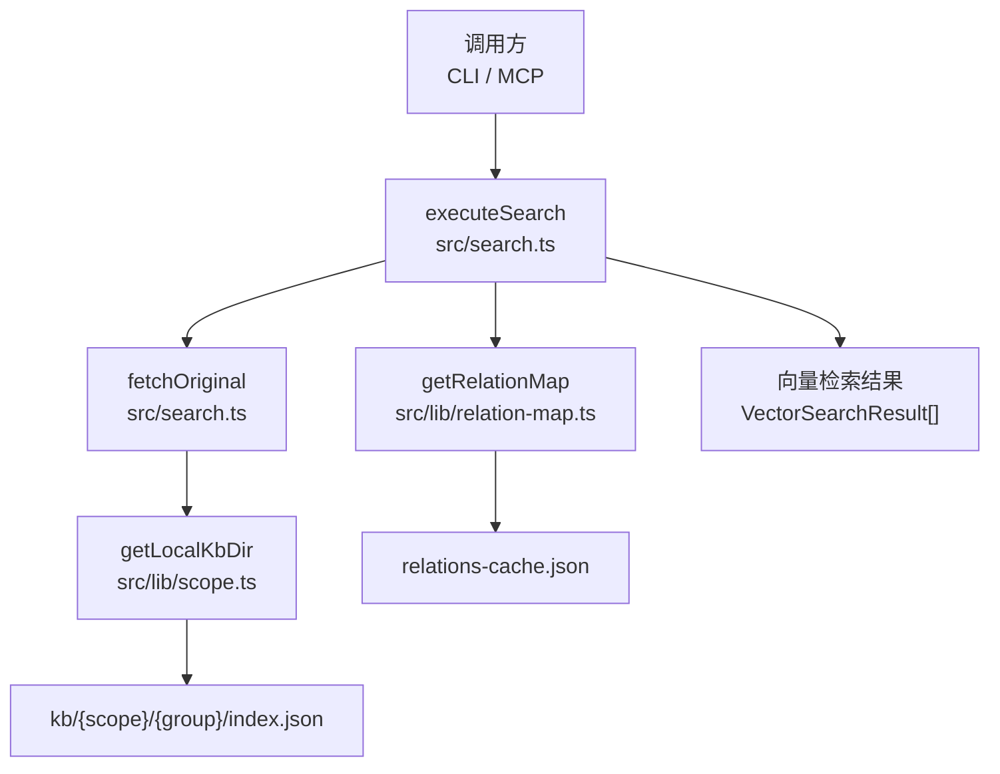
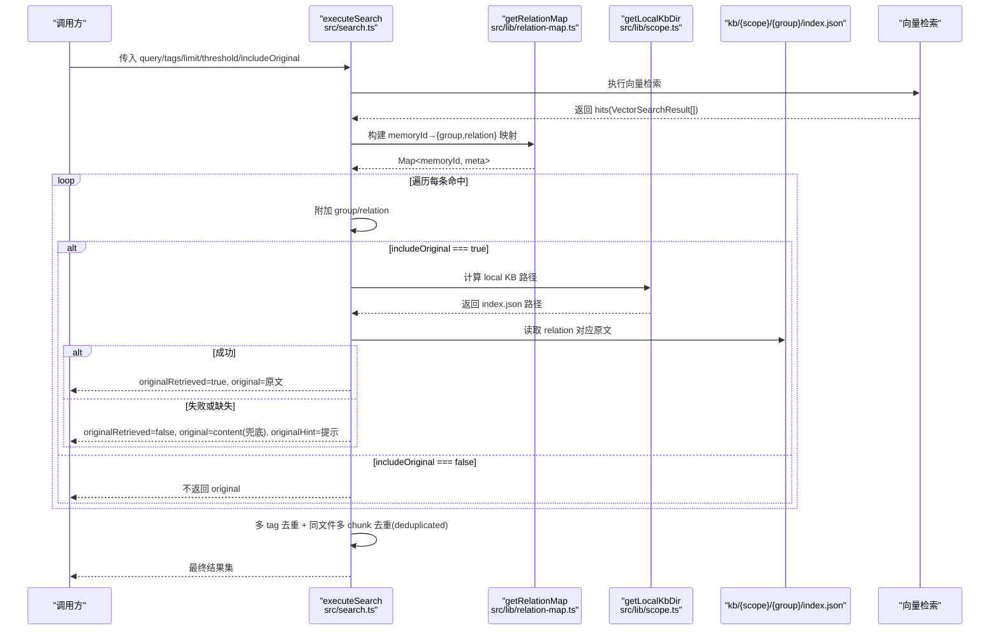
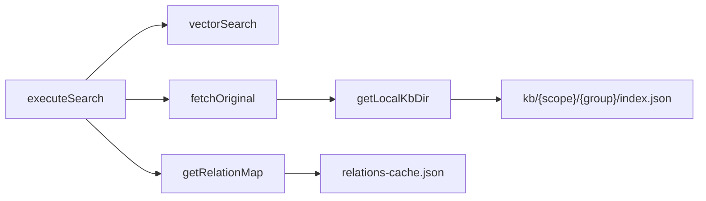

# 原文定位与获取

<cite>
**本文引用的文件**
- [src/search.ts](file://src/search.ts)
- [src/lib/scope.ts](file://src/lib/scope.ts)
- [src/lib/relation-map.ts](file://src/lib/relation-map.ts)
- [src/lib/mcp-tools/search.ts](file://src/lib/mcp-tools/search.ts)
- [test/search-original.test.ts](file://test/search-original.test.ts)
- [docs/cli.md](file://docs/cli.md)
- [.gitnexus/wiki/search-retrieval.md](file://.gitnexus/wiki/search-retrieval.md)
</cite>

## 目录
1. [简介](#简介)
2. [项目结构](#项目结构)
3. [核心组件](#核心组件)
4. [架构总览](#架构总览)
5. [详细组件分析](#详细组件分析)
6. [依赖关系分析](#依赖关系分析)
7. [性能考量](#性能考量)
8. [故障排查指南](#故障排查指南)
9. [结论](#结论)

## 简介
本文聚焦 knowledge-indexer 的“原文定位与获取”机制，围绕 fetchOriginal 函数的实现原理、group/relation 路径解析、local KB 文件读取与内容获取、includeOriginal 控制逻辑、失败降级策略（向量文档兜底与错误提示）、以及错误处理与性能优化进行系统化说明。目标是帮助读者在不深入源码的情况下，也能理解并正确使用该能力。

## 项目结构
与原文定位与获取直接相关的代码主要分布在以下模块：
- 搜索入口与原文召回：src/search.ts
- Group/Scope 路径构造与 local KB 目录解析：src/lib/scope.ts
- memoryId → (group, relation) 反查映射与缓存：src/lib/relation-map.ts
- MCP 工具封装与 include_original 参数透传：src/lib/mcp-tools/search.ts
- 行为契约与示例文档：docs/cli.md、.gitnexus/wiki/search-retrieval.md
- 单元测试覆盖：test/search-original.test.ts

图表来源
- [src/search.ts:70-196](file://src/search.ts#L70-L196)
- [src/lib/relation-map.ts:48-78](file://src/lib/relation-map.ts#L48-L78)
- [src/lib/scope.ts:74-77](file://src/lib/scope.ts#L74-L77)

章节来源
- [src/search.ts:1-248](file://src/search.ts#L1-L248)
- [src/lib/scope.ts:1-200](file://src/lib/scope.ts#L1-L200)
- [src/lib/relation-map.ts:1-120](file://src/lib/relation-map.ts#L1-L120)
- [src/lib/mcp-tools/search.ts:1-50](file://src/lib/mcp-tools/search.ts#L1-L50)
- [docs/cli.md:475-524](file://docs/cli.md#L475-L524)
- [.gitnexus/wiki/search-retrieval.md:253-282](file://.gitnexus/wiki/search-retrieval.md#L253-L282)

## 核心组件
- fetchOriginal(scope, group, relation)
  - 从 local KB 按 (group, relation) 读取文件级原文；若缺失或读取异常，返回空原文与精简 hint。
- executeSearch(params)
  - 执行向量检索，按 memoryId 反查 relations-cache 得到 group/relation，再根据 includeOriginal 决定是否拉取原文。
  - 支持多 tag 去重、同一文件多 chunk 命中去重（deduplicated）。
- getRelationMap(scope)
  - 构建 memoryId → {group, relation} 的反查映射，带 TTL 与 mtime/size 失效策略。
- getLocalKbDir(scope, groupPath)
  - 计算 kb/{scope}/{group}/index.json 的路径，作为 local KB 原文存储位置。

章节来源
- [src/search.ts:54-68](file://src/search.ts#L54-L68)
- [src/search.ts:70-196](file://src/search.ts#L70-L196)
- [src/lib/relation-map.ts:48-78](file://src/lib/relation-map.ts#L48-L78)
- [src/lib/scope.ts:74-77](file://src/lib/scope.ts#L74-L77)

## 架构总览
下图展示了从调用到原文获取的完整流程，包括反查定位、本地文件读取、失败降级与去重逻辑。

图表来源
- [src/search.ts:70-196](file://src/search.ts#L70-L196)
- [src/lib/relation-map.ts:48-78](file://src/lib/relation-map.ts#L48-L78)
- [src/lib/scope.ts:74-77](file://src/lib/scope.ts#L74-L77)

## 详细组件分析

### fetchOriginal 实现原理
- 输入：scope、group、relation
- 步骤：
  1) 通过 getLocalKbDir 计算 local KB 路径 kb/{scope}/{group}/index.json
  2) 读取 JSON，以 relation 为 key 取出原文
  3) 若存在原文，返回 { original }
  4) 若不存在，返回 { original: '', hint: '原文不可用：本地 KB 缺失 relation ...' }
  5) 若读取异常（如权限、损坏），返回 { original: '', hint: '原文不可用：本地 KB 读取异常' }
- 设计要点：
  - 失败时不抛错，而是返回空原文与精简 hint，便于上层统一降级
  - hint 中给出可操作建议（sync-relation 或 rebuild-vector）

章节来源
- [src/search.ts:54-68](file://src/search.ts#L54-L68)
- [src/lib/scope.ts:74-77](file://src/lib/scope.ts#L74-L77)

### group/relation 路径解析与文件内容获取
- group/relation 来源：
  - 向量检索结果携带 memoryId
  - getRelationMap 将 memoryId 映射到 {group, relation}
  - relation 即文件级标识（文件名去扩展名），用于在 local KB 的 index.json 中定位原文
- 文件内容获取：
  - 使用 getLocalKbDir(scope, group) 得到 index.json 路径
  - 以 relation 为键读取原文字符串
- 数据源约定：
  - local KB 的 index.json 保存的是“未清洗”的原始内容（含 BOM/frontmatter 等），保证原文保真

章节来源
- [src/lib/relation-map.ts:80-114](file://src/lib/relation-map.ts#L80-L114)
- [src/lib/scope.ts:74-77](file://src/lib/scope.ts#L74-L77)
- [test/import-scheme-d.test.ts:70-90](file://test/import-scheme-d.test.ts#L70-L90)

### includeOriginal 控制逻辑与返回性能
- 默认关闭：includeOriginal 默认 false，避免不必要的 IO 开销
- 显式开启：CLI --original 或 MCP include_original=true 才触发原文拉取
- 去重策略：
  - 多 tag 命中时，同一 (group, relation) 仅保留最高分的一条
  - 同一文件多 chunk 命中时，第一条携带 original，后续标记 deduplicated=true 且不重复返回 original
- 性能考虑：
  - 仅在需要时读取 local KB，减少磁盘 IO
  - 去重降低重复返回的体积与下游处理成本

章节来源
- [src/search.ts:125-196](file://src/search.ts#L125-L196)
- [docs/cli.md:475-524](file://docs/cli.md#L475-L524)

### 原文获取失败时的降级策略
- 触发条件：
  - local KB 缺失 relation
  - 无法定位本地 KB（relation 反查缺失）
  - 读取异常（权限、损坏等）
- 降级行为：
  - originalRetrieved=false
  - original 使用向量文档 content 作为兜底
  - originalHint 提供精简提示（例如提示尝试 sync-relation 或 rebuild-vector）
- 语义一致性：
  - 无论何种失败原因，均保证返回结构化字段，便于消费方统一处理

章节来源
- [src/search.ts:137-155](file://src/search.ts#L137-L155)
- [.gitnexus/wiki/search-retrieval.md:253-282](file://.gitnexus/wiki/search-retrieval.md#L253-L282)

### 错误处理机制
- 文件缺失：
  - local KB 缺失 relation → 返回空原文与 hint
- 权限异常/IO 异常：
  - 读取异常 → 返回空原文与 hint（不抛错）
- 网络错误：
  - 本模块不涉及网络请求；向量服务可用性由 ensureVectorAvailable 前置检测，不可用时返回 degraded 错误
- 反查映射异常：
  - relations-cache 缺失或损坏 → 返回空映射，search 降级为不带 group/relation 的结果

章节来源
- [src/search.ts:54-68](file://src/search.ts#L54-L68)
- [src/search.ts:84-92](file://src/search.ts#L84-L92)
- [src/lib/relation-map.ts:80-114](file://src/lib/relation-map.ts#L80-L114)

### 配置与使用方式
- CLI：ki search <query> [--original]
  - 默认不返回原文；加 --original 才返回 local KB 原文
- MCP：ki_search(include_original)
  - 默认 false；显式传入 true 才返回原文
- 输出字段：
  - group、relation 用于定位
  - originalRetrieved 表示是否成功获取原文
  - original 为原文或降级后的 content
  - originalHint 为失败提示
  - deduplicated 表示同一文件多 chunk 命中去重

章节来源
- [docs/cli.md:475-524](file://docs/cli.md#L475-L524)
- [src/lib/mcp-tools/search.ts:6-31](file://src/lib/mcp-tools/search.ts#L6-L31)
- [.gitnexus/wiki/search-retrieval.md:253-282](file://.gitnexus/wiki/search-retrieval.md#L253-L282)

## 依赖关系分析
- executeSearch 依赖：
  - vectorSearch/vectorListTags：向量检索能力
  - getRelationMap：memoryId → (group, relation) 反查
  - fetchOriginal：local KB 原文读取
  - getLocalKbDir：local KB 路径构造
- 关键耦合点：
  - relations-cache.json 的结构变化会影响反查映射构建
  - local KB index.json 的键名必须与 relation 一致（文件名去扩展名）

图表来源
- [src/search.ts:70-196](file://src/search.ts#L70-L196)
- [src/lib/relation-map.ts:48-78](file://src/lib/relation-map.ts#L48-L78)
- [src/lib/scope.ts:74-77](file://src/lib/scope.ts#L74-L77)

章节来源
- [src/search.ts:70-196](file://src/search.ts#L70-L196)
- [src/lib/relation-map.ts:48-78](file://src/lib/relation-map.ts#L48-L78)
- [src/lib/scope.ts:74-77](file://src/lib/scope.ts#L74-L77)

## 性能考量
- 默认关闭原文返回：减少 IO 与响应体大小
- 反查映射缓存：
  - 基于 mtime/size 与 TTL（默认 10 分钟）的懒构建与失效策略
  - 首次构建 O(N)，后续 O(1) 查询
- 去重：
  - 多 tag 去重保留最高分
  - 同文件多 chunk 命中去重，避免重复返回原文
- 建议：
  - 高频查询场景保持 includeOriginal=false
  - 仅在需要溯源时开启 --original/include_original

章节来源
- [src/lib/relation-map.ts:8-17](file://src/lib/relation-map.ts#L8-L17)
- [src/search.ts:159-196](file://src/search.ts#L159-L196)

## 故障排查指南
- 现象：搜索结果无 original 或 originalRetrieved=false
  - 检查是否开启 --original/include_original
  - 检查 local KB 是否存在对应 relation 的原文
  - 检查 relations-cache 是否正确关联 memoryId 与 relation
- 现象：提示“原文不可用：本地 KB 缺失 relation …”
  - 执行 sync-relation 重新写入关系
  - 或执行 rebuild-vector 重建向量索引
- 现象：提示“原文不可用：本地 KB 读取异常”
  - 检查文件权限与完整性
  - 确认 index.json 格式正确且可读
- 现象：向量检索不可用
  - 检查向量服务状态与连接
  - 查看 ensureVectorAvailable 返回的 reason

章节来源
- [src/search.ts:54-68](file://src/search.ts#L54-L68)
- [src/search.ts:84-92](file://src/search.ts#L84-L92)
- [test/search-original.test.ts:105-130](file://test/search-original.test.ts#L105-L130)

## 结论
knowledge-indexer 的原文定位与获取机制以 fetchOriginal 为核心，结合 relations-cache 的反查映射与 local KB 的文件级原文存储，实现了“按需召回、失败降级、去重优化”的完整链路。通过 includeOriginal 的显式开关，系统在性能与可追溯性之间取得平衡；统一的错误处理与精简提示，使调用方可稳定地消费结果并进行后续修复。推荐在生产环境中默认关闭原文返回，仅在需要溯源时开启，并结合 sync-relation 与 rebuild-vector 保障数据一致性。