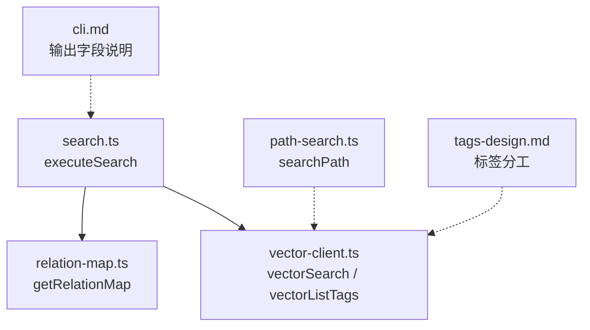
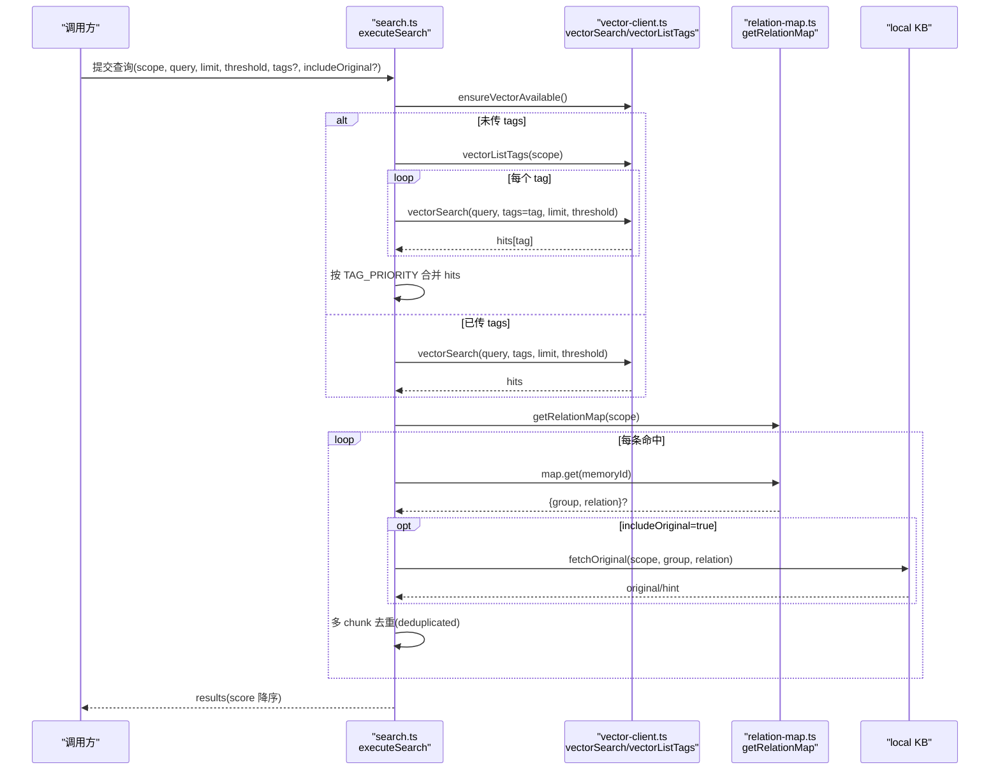
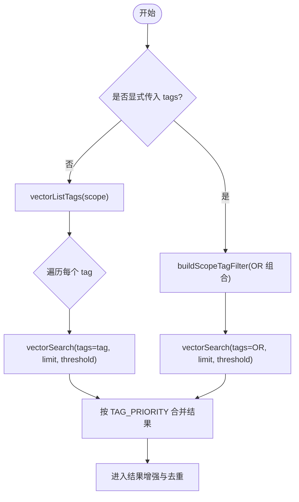
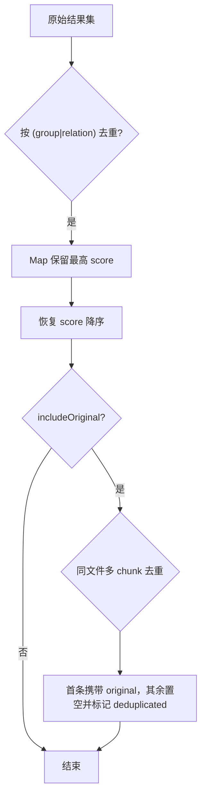
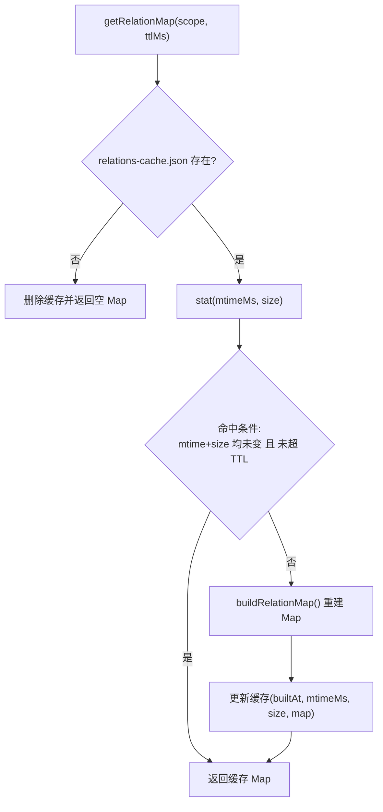
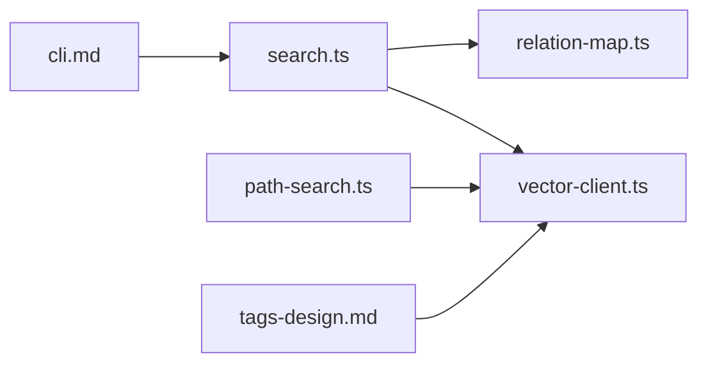

# 多路召回机制

<cite>
**本文引用的文件**
- [src/search.ts](file://src/search.ts)
- [src/lib/vector-client.ts](file://src/lib/vector-client.ts)
- [src/lib/relation-map.ts](file://src/lib/relation-map.ts)
- [src/lib/path-search.ts](file://src/lib/path-search.ts)
- [docs/tags-design.md](file://docs/tags-design.md)
- [docs/cli.md](file://docs/cli.md)
- [test/relation-map.test.ts](file://test/relation-map.test.ts)
</cite>

## 目录
1. [简介](#简介)
2. [项目结构](#项目结构)
3. [核心组件](#核心组件)
4. [架构总览](#架构总览)
5. [详细组件分析](#详细组件分析)
6. [依赖关系分析](#依赖关系分析)
7. [性能考量与调优建议](#性能考量与调优建议)
8. [故障排查指南](#故障排查指南)
9. [结论](#结论)

## 简介
本文件面向 knowledge-indexer 的多路召回机制，系统性说明“双路径查询系统”的实现原理：索引直查（基于 Group/Relation 的精准定位）与语义检索（向量+全文混合检索）如何协同工作；按 tag 分查的策略（ki-search > ki-relation > ki-path 优先级、多 tag OR 组合）；向量搜索的并发执行、结果聚合与去重；relation-map 缓存的作用与 TTL 管理；以及 memoryId 到 group/relation 的反查过程。文末给出配置优化与性能调优建议，帮助在生产环境中获得更稳定、更低延迟的召回效果。

## 项目结构
围绕多路召回的关键代码集中在以下模块：
- 搜索编排与结果组装：src/search.ts
- 向量客户端与混合检索封装：src/lib/vector-client.ts
- memoryId → group/relation 反查映射与缓存：src/lib/relation-map.ts
- 路径/关系名称的语义兜底检索：src/lib/path-search.ts
- 标签体系设计与使用约定：docs/tags-design.md
- CLI 输出字段与行为说明：docs/cli.md

图表来源
- [src/search.ts:70-196](file://src/search.ts#L70-L196)
- [src/lib/vector-client.ts:477-506](file://src/lib/vector-client.ts#L477-L506)
- [src/lib/relation-map.ts:48-78](file://src/lib/relation-map.ts#L48-L78)
- [src/lib/path-search.ts:47-87](file://src/lib/path-search.ts#L47-L87)
- [docs/tags-design.md:1-108](file://docs/tags-design.md#L1-L108)
- [docs/cli.md:511-524](file://docs/cli.md#L511-L524)

章节来源
- [src/search.ts:70-196](file://src/search.ts#L70-L196)
- [src/lib/vector-client.ts:477-506](file://src/lib/vector-client.ts#L477-L506)
- [src/lib/relation-map.ts:48-78](file://src/lib/relation-map.ts#L48-L78)
- [src/lib/path-search.ts:47-87](file://src/lib/path-search.ts#L47-L87)
- [docs/tags-design.md:1-108](file://docs/tags-design.md#L1-L108)
- [docs/cli.md:511-524](file://docs/cli.md#L511-L524)

## 核心组件
- 搜索编排器（executeSearch）：负责 scope 校验、向量可用性检测、按 tag 分查或单 tag 过滤、结果增强（group/relation）、原文召回与去重、最终排序返回。
- 向量客户端（vector-client）：封装 ZvecEngine，提供 hybridSearch（语义+FTS+RRF）、scope/tag 过滤、tag 枚举、文档增删改查、空闲释放锁与撞锁重试等。
- 反查映射（relation-map）：构建 memoryId → {group, relation} 的内存 Map，带 mtime/size/TTL 失效策略，避免重复 IO。
- 路径/关系语义兜底（path-search）：在精确匹配失败时，通过 ki-path/ki-relation 标签进行语义近似匹配，阈值默认 0，由下游做存在性校验。

章节来源
- [src/search.ts:70-196](file://src/search.ts#L70-L196)
- [src/lib/vector-client.ts:477-506](file://src/lib/vector-client.ts#L477-L506)
- [src/lib/relation-map.ts:48-78](file://src/lib/relation-map.ts#L48-L78)
- [src/lib/path-search.ts:47-87](file://src/lib/path-search.ts#L47-L87)

## 架构总览
下图展示了多路召回的整体流程：入口接收查询后，先判断是否显式传入 tags；未传则枚举当前 scope 下的所有 tag，分别对每个 tag 发起向量检索，再按 TAG_PRIORITY 合并；命中后通过 relation-map 反查 group/relation，可选地拉取 local KB 原文并进行多 chunk 去重；最后统一按 score 降序返回。

图表来源
- [src/search.ts:70-196](file://src/search.ts#L70-L196)
- [src/lib/vector-client.ts:477-506](file://src/lib/vector-client.ts#L477-L506)
- [src/lib/relation-map.ts:48-78](file://src/lib/relation-map.ts#L48-L78)

## 详细组件分析

### 双路径查询系统：索引直查与语义检索协同
- 索引直查：当已知 Group/Relation 时，可通过 path-search 对 ki-path/ki-relation 进行语义近似匹配，作为精确匹配的兜底。该路径强调“快速定位”，适合导航与模糊匹配场景。
- 语义检索：通过 vectorSearch 走 hybridSearch（语义向量 + FTS 关键词 + RRF 融合），支持按 scope/tag 过滤，适合自由文本的自然语言查询。
- 协同方式：search.ts 在 executeSearch 中统一编排两条路径——优先语义检索，必要时可结合 path-search 的兜底能力；同时利用 relation-map 将向量结果映射回 Group/Relation，支撑原文召回与展示。

章节来源
- [src/lib/path-search.ts:47-87](file://src/lib/path-search.ts#L47-L87)
- [src/lib/vector-client.ts:477-506](file://src/lib/vector-client.ts#L477-L506)
- [src/search.ts:70-196](file://src/search.ts#L70-L196)

### 按 tag 分查策略：TAG_PRIORITY 与多 tag OR
- 标签分工：
  - ki-search：通用语义搜索，内容自由文本，适合用户手动或批量导入的知识片段。
  - ki-relation：Relation 关系索引，content 纯化仅含关系名，Group 归属经结构化 group 字段存储，避免误匹配。
  - ki-path：路径层级索引，content 为路径本身，用于 Group 路径模糊匹配。
- 优先级排序：默认不传 tags 时，按 ki-search > ki-relation > ki-path 的顺序依次检索，每 tag 最多取 limit 条，再按优先级拼接，保证“内容优先”。
- 多 tag OR：显式传入 tags（逗号分隔）时，vectorSearch 内部以 OR 组合过滤，一次请求覆盖多个 tag。

图表来源
- [src/search.ts:94-121](file://src/search.ts#L94-L121)
- [src/lib/vector-client.ts:621-628](file://src/lib/vector-client.ts#L621-L628)
- [docs/tags-design.md:1-108](file://docs/tags-design.md#L1-L108)

章节来源
- [src/search.ts:94-121](file://src/search.ts#L94-L121)
- [src/lib/vector-client.ts:621-628](file://src/lib/vector-client.ts#L621-L628)
- [docs/tags-design.md:1-108](file://docs/tags-design.md#L1-L108)

### 向量搜索的并发执行、结果聚合与去重
- 并发执行：当前实现按 tag 顺序串行调用 vectorSearch（for...of）。若需进一步提升吞吐，可在上层对 perTag 的 vectorSearch 调用使用 Promise.all 并发执行，并在合并阶段保持 TAG_PRIORITY 顺序。
- 结果聚合：未传 tags 时，逐 tag 检索并收集 hits，随后按 TAG_PRIORITY 排序合并；显式 tags 时直接一次 OR 过滤检索。
- 去重机制：
  - 多 tag 去重：同一 (group, relation) 可能因多 tag 写入产生多条命中，保留 score 最高的一条。
  - 多 chunk 去重：同一文件多 chunk 命中时，仅首条携带 original，其余标记 deduplicated，避免重复返回原文。

图表来源
- [src/search.ts:159-194](file://src/search.ts#L159-L194)

章节来源
- [src/search.ts:159-194](file://src/search.ts#L159-L194)

### relation-map 缓存与 TTL 管理
- 作用：将 memoryId 映射到 {group, relation}，供 search 结果增强与原文定位。首次构建 O(N)，后续 O(1)。
- 缓存策略：
  - 文件级 mtime/size 变化立即失效，避免 sync-relation/import 后读到陈旧映射。
  - TTL 过期（默认 10 分钟）兜底失效，防止极端情况下文件原地改写但 mtime/size 不变。
  - 文件缺失或损坏时返回空 Map，search 降级为不带附加字段。
- 测试验证：包含 TTL 过期重建、scope 隔离等用例。

图表来源
- [src/lib/relation-map.ts:48-78](file://src/lib/relation-map.ts#L48-L78)
- [test/relation-map.test.ts:159-164](file://test/relation-map.test.ts#L159-L164)

章节来源
- [src/lib/relation-map.ts:48-78](file://src/lib/relation-map.ts#L48-L78)
- [test/relation-map.test.ts:159-164](file://test/relation-map.test.ts#L159-L164)

### memoryId 到 group/relation 的反查过程
- 反查来源：relations-cache.json 中的 hot_relations，支持方案 D 的多值 memoryIds 与旧数据单值 memoryId 的回退。
- 反查用途：
  - 附加 group/relation 到搜索结果，便于展示与定位。
  - 在 includeOriginal=true 时，按 group/relation 从 local KB 读取文件级原文；失败时降级返回向量 content 并提示。
- 多 chunk 处理：同一文件多 chunk 命中时，仅首条携带 original，其余标记 deduplicated，避免重复返回。

章节来源
- [src/lib/relation-map.ts:80-114](file://src/lib/relation-map.ts#L80-L114)
- [src/search.ts:123-194](file://src/search.ts#L123-L194)
- [docs/cli.md:511-524](file://docs/cli.md#L511-L524)

## 依赖关系分析
- search.ts 依赖 vector-client.ts 提供向量检索能力，依赖 relation-map.ts 提供 memoryId 反查。
- vector-client.ts 依赖 ZvecEngine（dist 产物），提供 hybridSearch、filter 构建、engine 生命周期管理（空闲释放锁、撞锁重试）。
- path-search.ts 复用 vectorSearch 进行 ki-path/ki-relation 的语义兜底，阈值默认 0，由下游做存在性校验。
- tags-design.md 定义了三类标签的职责与写入/消费路径，确保语义空间隔离。

图表来源
- [src/search.ts:70-196](file://src/search.ts#L70-L196)
- [src/lib/vector-client.ts:477-506](file://src/lib/vector-client.ts#L477-L506)
- [src/lib/relation-map.ts:48-78](file://src/lib/relation-map.ts#L48-L78)
- [src/lib/path-search.ts:47-87](file://src/lib/path-search.ts#L47-L87)
- [docs/tags-design.md:1-108](file://docs/tags-design.md#L1-L108)
- [docs/cli.md:511-524](file://docs/cli.md#L511-L524)

章节来源
- [src/search.ts:70-196](file://src/search.ts#L70-L196)
- [src/lib/vector-client.ts:477-506](file://src/lib/vector-client.ts#L477-L506)
- [src/lib/relation-map.ts:48-78](file://src/lib/relation-map.ts#L48-L78)
- [src/lib/path-search.ts:47-87](file://src/lib/path-search.ts#L47-L87)
- [docs/tags-design.md:1-108](file://docs/tags-design.md#L1-L108)
- [docs/cli.md:511-524](file://docs/cli.md#L511-L524)

## 性能考量与调优建议
- 并发优化：
  - 当前 perTag 的 vectorSearch 为串行循环。对于多 tag 场景，可在上层使用 Promise.all 并发执行各 tag 的检索，并在合并阶段维持 TAG_PRIORITY 顺序，显著降低端到端延迟。
  - vector-client 内部已提供空闲释放锁与撞锁重试，常驻 MCP 场景下可减少锁竞争带来的等待。
- 阈值与召回平衡：
  - threshold 控制最低分数阈值，过高会漏召回，过低会增加噪声。建议根据业务场景逐步调优，并结合下游存在性校验（如 path-search 的二次校验）提升质量。
- 标签选择：
  - 明确查询意图：内容类查询优先 ki-search；关系名/路径名查询优先 ki-relation/ki-path。合理选择标签可降低无关召回。
- 原文召回开关：
  - includeOriginal 仅在需要时开启，避免额外的 local KB IO 开销。
- 缓存与失效：
  - relation-map 的 TTL 默认 10 分钟，适用于大多数场景；高频写入环境可适当缩短 TTL 以提升一致性。
- 引擎生命周期：
  - CLI 模式每次调用结束后关闭 engine，避免进程无法退出；常驻 MCP 模式启用空闲释放锁，减少锁占用时间。

[本节为通用指导，无需特定文件引用]

## 故障排查指南
- 向量服务不可用：
  - ensureVectorAvailable 会检测锁定/损坏/异常，并返回 code 与 reason。常见原因包括被其他进程占用、向量库损坏、worker 不可用等。
  - 处理建议：停止占用进程、稍后重试、执行 rebuild-vector 或 restore 重建。
- 原文不可用：
  - 当 local KB 缺失 relation 或读取异常时，search 会降级返回向量 content，并附带 hint 提示。
  - 处理建议：执行 sync-relation 或 rebuild-vector 补建索引与原文。
- 多 chunk 重复：
  - 同一文件多 chunk 命中时，除首条外其余标记 deduplicated，避免重复返回原文。
  - 处理建议：消费方根据 deduplicated 字段区分是否需要再次展示。
- 缓存不一致：
  - relations-cache.json 变更或 TTL 过期会触发重建；若仍出现陈旧映射，检查 mtime/size 是否正确更新。

章节来源
- [src/lib/vector-client.ts:420-467](file://src/lib/vector-client.ts#L420-L467)
- [src/search.ts:54-68](file://src/search.ts#L54-L68)
- [src/search.ts:179-194](file://src/search.ts#L179-L194)
- [src/lib/relation-map.ts:48-78](file://src/lib/relation-map.ts#L48-L78)

## 结论
knowledge-indexer 的多路召回机制通过“索引直查 + 语义检索”的双路径设计，结合按 tag 分查与优先级排序、多 tag OR 组合、结果聚合与去重、memoryId 反查与原文召回，实现了高召回率与高可用性的平衡。relation-map 的 TTL/mtime/size 失效策略保障了反查的一致性与性能。生产环境中，建议根据查询意图选择合适的标签、合理设置阈值与原文召回开关，并在多 tag 场景下考虑并发优化，以获得更低的延迟与更高的稳定性。

[本节为总结，无需特定文件引用]