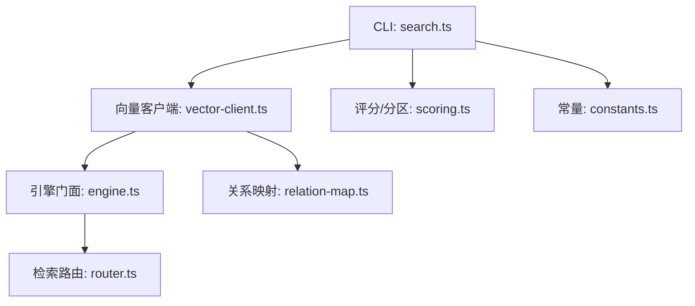
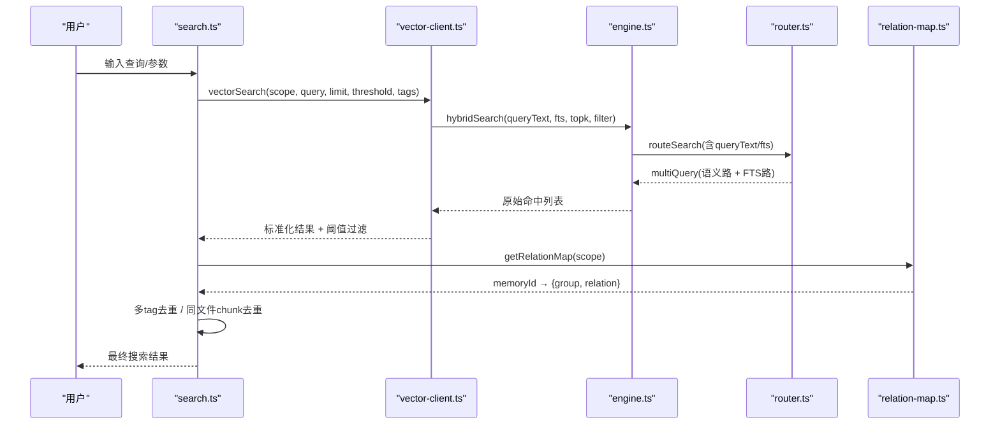
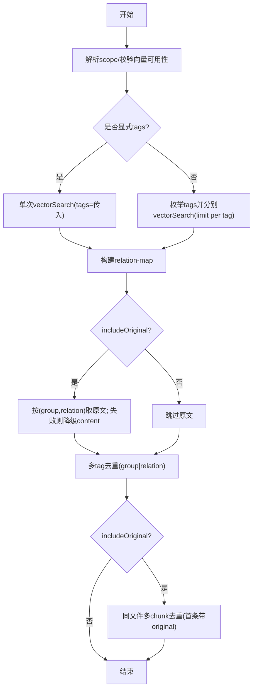
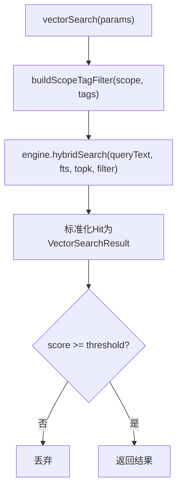
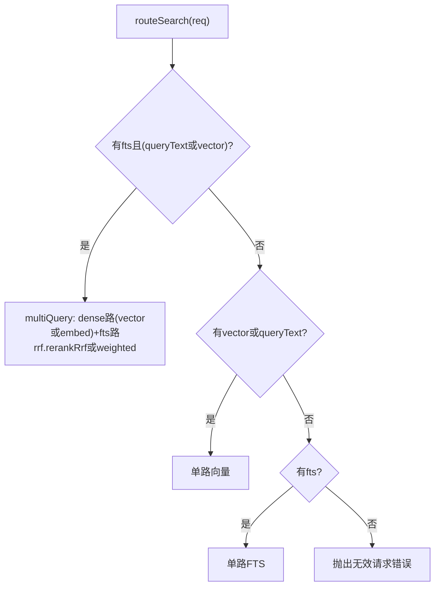
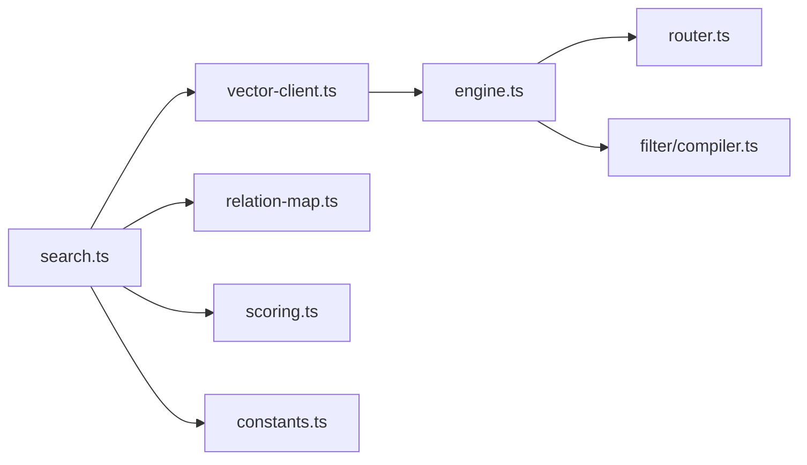

# 搜索执行流程

<cite>
**本文引用的文件**
- [src/search.ts](file://src/search.ts)
- [src/lib/vector-client.ts](file://src/lib/vector-client.ts)
- [src/zvec-engine/engine.ts](file://src/zvec-engine/engine.ts)
- [src/zvec-engine/search/router.ts](file://src/zvec-engine/search/router.ts)
- [src/lib/relation-map.ts](file://src/lib/relation-map.ts)
- [src/lib/scoring.ts](file://src/lib/scoring.ts)
- [src/lib/constants.ts](file://src/lib/constants.ts)
</cite>

## 目录
1. [简介](#简介)
2. [项目结构](#项目结构)
3. [核心组件](#核心组件)
4. [架构总览](#架构总览)
5. [详细组件分析](#详细组件分析)
6. [依赖关系分析](#依赖关系分析)
7. [性能考虑](#性能考虑)
8. [故障排查指南](#故障排查指南)
9. [结论](#结论)
10. [附录：参数与示例](#附录参数与示例)

## 简介
本文面向 knowledge-indexer 的“搜索执行流程”，完整描述从用户查询到结果返回的处理链路，包括查询解析、标签过滤、混合检索、结果排序、原文定位与上下文增强。重点解释双路径查询机制（索引直查与语义检索协同）、RRF 融合排序、结果去重与上下文增强机制，并提供搜索参数配置、性能优化技巧与常见查询模式的实现指引。

## 项目结构
搜索相关代码主要分布在以下模块：
- CLI/入口层：负责参数解析、调用搜索执行、输出结果
- 向量客户端层：封装引擎能力，提供检索、存储、可用性检测等
- 引擎层：路由请求、嵌入生成、混合检索、归一化
- 辅助层：关系映射反查、评分与分区、常量定义

图表来源
- [src/search.ts:70-199](file://src/search.ts#L70-L199)
- [src/lib/vector-client.ts:477-506](file://src/lib/vector-client.ts#L477-L506)
- [src/zvec-engine/engine.ts:454-495](file://src/zvec-engine/engine.ts#L454-L495)
- [src/zvec-engine/search/router.ts:43-127](file://src/zvec-engine/search/router.ts#L43-L127)
- [src/lib/relation-map.ts:48-78](file://src/lib/relation-map.ts#L48-L78)
- [src/lib/scoring.ts:90-117](file://src/lib/scoring.ts#L90-L117)
- [src/lib/constants.ts:55-75](file://src/lib/constants.ts#L55-L75)

章节来源
- [src/search.ts:70-199](file://src/search.ts#L70-L199)
- [src/lib/vector-client.ts:477-506](file://src/lib/vector-client.ts#L477-L506)
- [src/zvec-engine/engine.ts:454-495](file://src/zvec-engine/engine.ts#L454-L495)
- [src/zvec-engine/search/router.ts:43-127](file://src/zvec-engine/search/router.ts#L43-L127)
- [src/lib/relation-map.ts:48-78](file://src/lib/relation-map.ts#L48-L78)
- [src/lib/scoring.ts:90-117](file://src/lib/scoring.ts#L90-L117)
- [src/lib/constants.ts:55-75](file://src/lib/constants.ts#L55-L75)

## 核心组件
- 搜索入口 executeSearch：解析 scope、校验向量服务可用性、按 tag 分查或单查、召回后附加 group/relation、可选召回原文、多 tag 去重、同文件多 chunk 去重
- 向量客户端 vectorSearch：构建 scope+tag 过滤，调用引擎 hybridSearch，阈值过滤，标准化返回
- 引擎 engine.search：路由请求（router），必要时生成 embedding，注入 filterSql，发送 worker，归一化为 Hit
- 检索路由 router.routeSearch：根据是否提供 queryText/vector/fts 选择单路向量、单路 FTS 或两路 RRF 混合
- 关系映射 getRelationMap：TTL 缓存 memoryId→{group,relation}，用于原文定位
- 评分与分区 scoring：提供冷热分区、边界衰减等通用能力（供上层复用）
- 常量 constants：默认标签集、内部保留标签、分区默认参数等

章节来源
- [src/search.ts:70-199](file://src/search.ts#L70-L199)
- [src/lib/vector-client.ts:477-506](file://src/lib/vector-client.ts#L477-L506)
- [src/zvec-engine/engine.ts:454-495](file://src/zvec-engine/engine.ts#L454-L495)
- [src/zvec-engine/search/router.ts:43-127](file://src/zvec-engine/search/router.ts#L43-L127)
- [src/lib/relation-map.ts:48-78](file://src/lib/relation-map.ts#L48-L78)
- [src/lib/scoring.ts:90-117](file://src/lib/scoring.ts#L90-L117)
- [src/lib/constants.ts:55-75](file://src/lib/constants.ts#L55-L75)

## 架构总览
下图展示一次搜索从 CLI 到引擎再到结果返回的端到端流程，包含双路径混合检索与 RRF 融合。

图表来源
- [src/search.ts:70-199](file://src/search.ts#L70-L199)
- [src/lib/vector-client.ts:477-506](file://src/lib/vector-client.ts#L477-L506)
- [src/zvec-engine/engine.ts:454-495](file://src/zvec-engine/engine.ts#L454-L495)
- [src/zvec-engine/search/router.ts:43-127](file://src/zvec-engine/search/router.ts#L43-L127)
- [src/lib/relation-map.ts:48-78](file://src/lib/relation-map.ts#L48-L78)

## 详细组件分析

### 搜索入口：executeSearch
- 作用：统一编排搜索生命周期，处理 scope 解析、向量可用性检测、标签策略、原文召回、去重与排序
- 关键逻辑
  - 若显式传入 tags：单次查询；否则枚举所有 tag 并分别查询，按优先级合并（ki-search > ki-relation > ki-path）
  - 通过 relation-map 将 memoryId 映射为 group/relation，便于原文定位
  - 可选开启 includeOriginal：从本地 KB 读取文件级原文；失败时降级为向量文档内容并提示
  - 多 tag 去重：同一 (group, relation) 仅保留最高分
  - 同文件多 chunk 去重：同一文件多次命中时，仅首次携带 original，其余标记 deduplicated

图表来源
- [src/search.ts:70-199](file://src/search.ts#L70-L199)
- [src/lib/relation-map.ts:48-78](file://src/lib/relation-map.ts#L48-L78)

章节来源
- [src/search.ts:70-199](file://src/search.ts#L70-L199)
- [src/lib/relation-map.ts:48-78](file://src/lib/relation-map.ts#L48-L78)

### 向量客户端：vectorSearch
- 作用：构造 scope+tag 过滤条件，调用引擎 hybridSearch，并将底层 Hit 标准化为 VectorSearchResult
- 关键点
  - buildScopeTagFilter：强制 scope 相等，tags 非空时以 OR 组合，忽略大小写
  - 阈值过滤：score < threshold 的结果被丢弃
  - 字段映射：memoryId、content、score、tag、group

图表来源
- [src/lib/vector-client.ts:477-506](file://src/lib/vector-client.ts#L477-L506)
- [src/lib/vector-client.ts:621-628](file://src/lib/vector-client.ts#L621-L628)

章节来源
- [src/lib/vector-client.ts:477-506](file://src/lib/vector-client.ts#L477-L506)
- [src/lib/vector-client.ts:621-628](file://src/lib/vector-client.ts#L621-L628)

### 引擎检索：engine.search 与路由 router
- engine.search
  - 编译 filter 为 SQL 片段
  - 调用 router.routeSearch 决定单路/多路
  - 需要时进行 embedding（主线程），填充 dense 路向量
  - 发送 worker 获取原始命中，再归一化为 Hit
- router.routeSearch（退化矩阵）
  - 同时存在 fts 与 queryText/vector → 两路 RRF 混合（hybrid）
  - 仅有 vector/queryText → 单路向量
  - 仅有 fts → 单路 FTS
  - 三者皆缺 → 报错
  - queryText 与 vector 互斥

图表来源
- [src/zvec-engine/search/router.ts:43-127](file://src/zvec-engine/search/router.ts#L43-L127)
- [src/zvec-engine/engine.ts:454-495](file://src/zvec-engine/engine.ts#L454-L495)

章节来源
- [src/zvec-engine/search/router.ts:43-127](file://src/zvec-engine/search/router.ts#L43-L127)
- [src/zvec-engine/engine.ts:454-495](file://src/zvec-engine/engine.ts#L454-L495)

### RRF 融合排序工作原理
- 触发条件：当同时提供 fts 与 queryText/vector 时，路由生成 multiQuery，启用 RRF 融合
- 工作方式
  - 两路独立召回：dense 向量路与 FTS 文本匹配路
  - 对每路结果计算 rank = 1/(k + r)，其中 k 为 rankConstant（默认 60），r 为排名位置
  - 将两路 rank 相加得到融合得分，按融合得分降序排列
  - 支持 weighted 模式：为 dense 路与 fts 路分别指定权重，加权求和
- 效果：兼顾语义相关性与关键词精确匹配，提升召回质量与鲁棒性

章节来源
- [src/zvec-engine/search/router.ts:74-100](file://src/zvec-engine/search/router.ts#L74-L100)

### 结果去重与上下文增强
- 多 tag 去重：同一 (group, relation) 只保留最高分条目，避免同一文档因多 tag 写入重复出现
- 同文件多 chunk 去重：同一文件多次命中时，仅第一条携带 original，后续标记 deduplicated，避免重复返回原文
- 上下文增强：通过 relation-map 将 memoryId 映射为 group/relation，结合 fetchOriginal 可召回文件级原文，形成“命中→定位→原文”的闭环

章节来源
- [src/search.ts:159-194](file://src/search.ts#L159-L194)
- [src/lib/relation-map.ts:48-78](file://src/lib/relation-map.ts#L48-L78)

### 双路径查询机制的实现
- 路径一：语义检索（dense 向量）——由 queryText 经 embedding 生成向量，走 dense 路
- 路径二：索引直查（FTS 关键词）——由 fts 字符串走 FTS 路
- 协同方式：两路并行召回，RRF 融合排序，最终输出统一结果集
- 退化策略：缺少任一能力自动退化为单路，保证可用性

章节来源
- [src/zvec-engine/search/router.ts:43-127](file://src/zvec-engine/search/router.ts#L43-L127)
- [src/zvec-engine/engine.ts:454-495](file://src/zvec-engine/engine.ts#L454-L495)

## 依赖关系分析
- search.ts 依赖 vector-client.ts、relation-map.ts、scoring.ts（间接）、constants.ts（间接）
- vector-client.ts 依赖 engine.ts（通过 dist 导入）、config/scope/interrupt
- engine.ts 依赖 router.ts、filter/compiler.ts、embedding/provider、proxy
- router.ts 依赖 types、worker-protocol、errors
- relation-map.ts 依赖 scope（路径）、scoring（类型）

图表来源
- [src/search.ts:70-199](file://src/search.ts#L70-L199)
- [src/lib/vector-client.ts:477-506](file://src/lib/vector-client.ts#L477-L506)
- [src/zvec-engine/engine.ts:454-495](file://src/zvec-engine/engine.ts#L454-L495)
- [src/zvec-engine/search/router.ts:43-127](file://src/zvec-engine/search/router.ts#L43-L127)
- [src/lib/relation-map.ts:48-78](file://src/lib/relation-map.ts#L48-L78)
- [src/lib/scoring.ts:90-117](file://src/lib/scoring.ts#L90-L117)
- [src/lib/constants.ts:55-75](file://src/lib/constants.ts#L55-L75)

章节来源
- [src/search.ts:70-199](file://src/search.ts#L70-L199)
- [src/lib/vector-client.ts:477-506](file://src/lib/vector-client.ts#L477-L506)
- [src/zvec-engine/engine.ts:454-495](file://src/zvec-engine/engine.ts#L454-L495)
- [src/zvec-engine/search/router.ts:43-127](file://src/zvec-engine/search/router.ts#L43-L127)
- [src/lib/relation-map.ts:48-78](file://src/lib/relation-map.ts#L48-L78)
- [src/lib/scoring.ts:90-117](file://src/lib/scoring.ts#L90-L117)
- [src/lib/constants.ts:55-75](file://src/lib/constants.ts#L55-L75)

## 性能考虑
- 标签分查与优先级合并：不传 tags 时按 tag 分查，每个 tag 最多取 limit 条，减少单次扫描量；按优先级合并提升内容相关性
- 阈值过滤：在客户端层提前过滤低分结果，降低下游处理开销
- 去重策略：多 tag 去重与同文件 chunk 去重避免冗余返回，减少 I/O 与渲染成本
- 原文召回开关：默认关闭，按需开启，避免不必要的文件读取
- 引擎侧优化：embedding 小批处理、批内去重、worker 串行化与空闲释放锁、撞锁重试，保障高并发稳定性
- 建议
  - 合理设置 limit 与 threshold，平衡召回率与延迟
  - 使用 tags 精准限定范围，避免全库扫描
  - 大库场景优先使用 FTS 关键词缩小候选集，再叠加语义检索

[本节为通用指导，无需具体文件引用]

## 故障排查指南
- 向量服务不可用
  - 现象：ensureVectorAvailable 返回不可用，可能因锁占用、损坏或探测异常
  - 处置：查看 reason/code，按提示停止冲突进程、等待锁释放或重建向量库
- 撞锁与重试
  - 现象：向量库被其他进程占用
  - 机制：probeWithRetry 等待并重试，避免立即失败
- 原文不可用
  - 现象：fetchOriginal 失败或 relation 缺失
  - 行为：降级返回向量文档 content，并附带 originalHint 提示
- 参数非法
  - 现象：threshold/limit 非法导致静默丢结果
  - 防护：CLI 层数值解析带警告与回退，避免 NaN 传播

章节来源
- [src/lib/vector-client.ts:420-467](file://src/lib/vector-client.ts#L420-L467)
- [src/lib/vector-client.ts:93-104](file://src/lib/vector-client.ts#L93-L104)
- [src/search.ts:54-68](file://src/search.ts#L54-L68)
- [src/search.ts:223-235](file://src/search.ts#L223-L235)

## 结论
knowledge-indexer 的搜索执行流程通过“语义检索 + FTS 关键词”的双路径混合检索与 RRF 融合排序，实现了高召回与高相关性的平衡。配合标签过滤、结果去重、原文定位与上下文增强，既保证了准确性，又提升了用户体验。通过合理的参数配置与性能优化策略，可在不同规模的知识库中稳定高效地提供服务。

[本节为总结，无需具体文件引用]

## 附录：参数与示例
- 搜索参数
  - scope：项目隔离标识（default/strict 模式）
  - query：自然语言查询文本
  - limit：返回条数上限
  - threshold：相似度阈值（低于该值的结果将被过滤）
  - tags：过滤标签（逗号分隔，OR 组合；不传则搜索全部并按优先级合并）
  - original：是否返回 local KB 文件级原文（默认不返回）
- 常见查询模式
  - 纯语义检索：仅 query，不传 tags，使用默认标签集合
  - 关键词精确匹配：传入 fts（由引擎内部使用），适合短词/术语
  - 混合检索：同时提供 query 与 fts，启用 RRF 融合
  - 标签限定：传入 tags 限定范围，如 ki-relation 或自定义 tag
- 性能调优建议
  - 设置合适的 threshold 过滤低分结果
  - 使用 tags 缩小范围，减少扫描量
  - 在大库上优先使用 FTS 关键词预筛，再叠加语义检索
  - 按需开启 original，避免频繁文件读取

章节来源
- [src/search.ts:206-235](file://src/search.ts#L206-L235)
- [src/lib/vector-client.ts:477-506](file://src/lib/vector-client.ts#L477-L506)
- [src/zvec-engine/search/router.ts:74-100](file://src/zvec-engine/search/router.ts#L74-L100)
- [src/lib/constants.ts:55-75](file://src/lib/constants.ts#L55-L75)