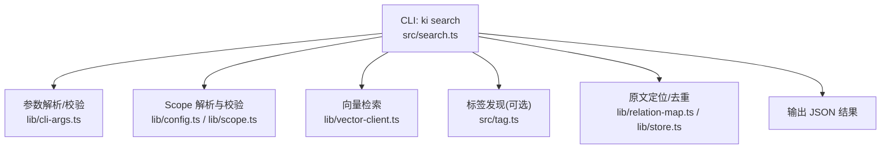
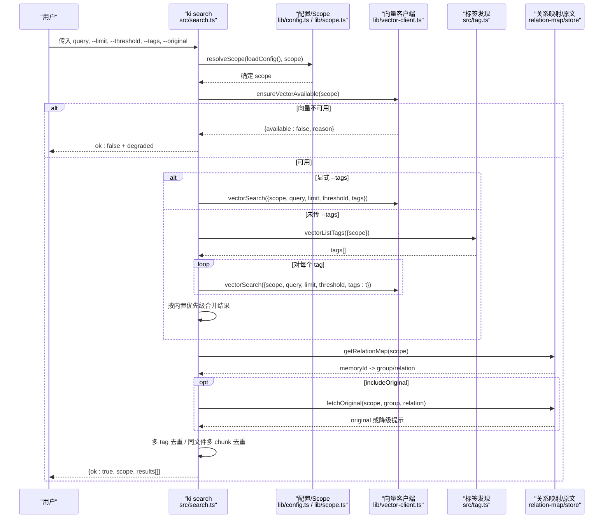
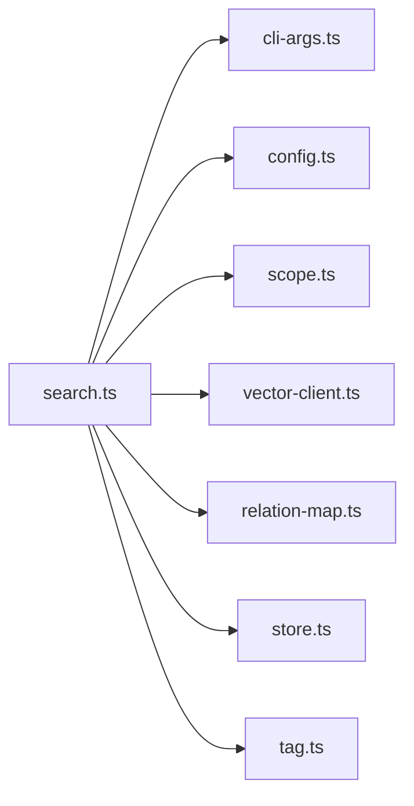

# 查询解析与预处理

<cite>
**本文引用的文件**
- [src/search.ts](file://src/search.ts)
- [src/lib/cli-args.ts](file://src/lib/cli-args.ts)
- [src/lib/config.ts](file://src/lib/config.ts)
- [src/lib/scope.ts](file://src/lib/scope.ts)
- [src/tag.ts](file://src/tag.ts)
- [docs/cli.md](file://docs/cli.md)
- [docs/configuration.md](file://docs/configuration.md)
- [test/search-original.test.ts](file://test/search-original.test.ts)
</cite>

## 目录
1. [简介](#简介)
2. [项目结构](#项目结构)
3. [核心组件](#核心组件)
4. [架构总览](#架构总览)
5. [详细组件分析](#详细组件分析)
6. [依赖关系分析](#依赖关系分析)
7. [性能考量](#性能考量)
8. [故障排查指南](#故障排查指南)
9. [结论](#结论)
10. [附录：配置选项与使用示例](#附录配置选项与使用示例)

## 简介
本章节聚焦 knowledge-indexer 的“查询解析与预处理”阶段，覆盖从 CLI 参数接收、scope 范围解析、查询文本清洗与标准化，到标签过滤机制、类型转换、默认值设置与错误处理策略。同时给出查询预处理的配置项与使用示例（阈值、限制条数、标签组合规则），帮助使用者正确构造 ki search 查询并理解其内部行为。

## 项目结构
查询解析与预处理涉及以下关键模块：
- CLI 入口与参数解析：search.ts（ki search）、tag.ts（ki tag list）
- 公共参数校验与数值解析：lib/cli-args.ts
- Scope 解析与校验：lib/config.ts（resolveScope）、lib/scope.ts（validateScope）
- 向量检索与标签发现：lib/vector-client.ts（被 search.ts 调用）
- 文档与原文定位：lib/relation-map.ts、lib/store.ts（search.ts 中 fetchOriginal）
- 文档与配置说明：docs/cli.md、docs/configuration.md

图表来源
- [src/search.ts:204-237](file://src/search.ts#L204-L237)
- [src/lib/cli-args.ts:77-151](file://src/lib/cli-args.ts#L77-L151)
- [src/lib/config.ts:444-459](file://src/lib/config.ts#L444-L459)
- [src/lib/scope.ts:30-43](file://src/lib/scope.ts#L30-L43)
- [src/tag.ts:58-72](file://src/tag.ts#L58-L72)

章节来源
- [src/search.ts:204-237](file://src/search.ts#L204-L237)
- [src/lib/cli-args.ts:77-151](file://src/lib/cli-args.ts#L77-L151)
- [src/lib/config.ts:444-459](file://src/lib/config.ts#L444-L459)
- [src/lib/scope.ts:30-43](file://src/lib/scope.ts#L30-L43)
- [src/tag.ts:58-72](file://src/tag.ts#L58-L72)

## 核心组件
- 查询入口 executeSearch：负责 scope 解析、向量服务可用性检测、显式 tags 或全量 tag 搜索、结果增强（group/relation）、原文召回与多 chunk 去重、最终结果返回。
- CLI 参数解析：commander 定义位置参数 query 与 -q/--query；--limit、--threshold、--tags、--original；非法数值通过 parseIntArg/parseFloatArg 回退默认并告警。
- Scope 解析与校验：resolveScope 根据 scopeMode 决定 default/strict 模式；validateScope 校验 scope 字符集与安全。
- 标签过滤机制：显式 --tags 时单次查询（OR 组合）；未传 --tags 时先 vectorListTags 获取所有 tag，按 tag 分别查询，再按内置优先级排序合并。
- 原文召回与去重：includeOriginal 为 true 时才尝试读取 local KB 原文；同一文件多 chunk 命中仅首条携带 original，后续标记 deduplicated。

章节来源
- [src/search.ts:70-199](file://src/search.ts#L70-L199)
- [src/search.ts:204-237](file://src/search.ts#L204-L237)
- [src/lib/config.ts:444-459](file://src/lib/config.ts#L444-L459)
- [src/lib/scope.ts:30-43](file://src/lib/scope.ts#L30-L43)
- [docs/cli.md:475-509](file://docs/cli.md#L475-L509)

## 架构总览
下图展示一次 ki search 请求从 CLI 到向量检索、再到结果增强的完整流程，包括标签选择分支、原文召回与去重。

图表来源
- [src/search.ts:70-199](file://src/search.ts#L70-L199)
- [src/search.ts:204-237](file://src/search.ts#L204-L237)
- [src/tag.ts:58-72](file://src/tag.ts#L58-L72)

## 详细组件分析

### CLI 参数解析与类型转换
- 位置参数与 -q/--query：两者均可提供查询文本，位置参数优先；均未提供时报错退出。
- --limit：整数型参数，使用 parseIntArg 解析；非法值回退默认 10，且最小值为 1；超限会警告并限制。
- --threshold：浮点型参数，使用 parseFloatArg 解析；非法值回退 undefined（不过滤）。
- --tags：字符串，逗号分隔多个 tag，进入 OR 组合逻辑。
- --original：布尔开关，控制是否返回 local KB 文件级原文。

错误处理策略：
- 未知参数：由 detectUnknownFlags 在需要时进行未知 flag 检测与建议（适用于手写 argv 的命令）。
- 数值非法：parseIntArg/parseFloatArg 将向 stderr 输出警告并回退默认值，避免静默失败。

章节来源
- [src/search.ts:204-237](file://src/search.ts#L204-L237)
- [src/lib/cli-args.ts:77-151](file://src/lib/cli-args.ts#L77-L151)
- [docs/cli.md:475-509](file://docs/cli.md#L475-L509)

### Scope 范围解析与校验
- resolveScope：
  - default 模式：缺省 scope 回退为 'default'，任意合法 scope 放行。
  - strict 模式：必须显式传入非空 scope，且必须在 config.scopes 白名单内，否则抛错。
- validateScope：校验 scope 仅包含字母、数字、连字符、下划线，拒绝路径遍历字符；非法时抛出带 code 的错误。

章节来源
- [src/lib/config.ts:444-459](file://src/lib/config.ts#L444-L459)
- [src/lib/scope.ts:30-43](file://src/lib/scope.ts#L30-L43)

### 查询文本清洗与预处理
- 查询文本本身在搜索入口不做复杂清洗；实际内容清洗发生在导入阶段（clean rules），搜索阶段仅做参数校验与传递。
- 若需了解导入阶段的清洗规则（如剥离 BOM、frontmatter、HTML 注释、代码块等），请参考配置文档中的 clean 规则。

章节来源
- [docs/configuration.md:130-162](file://docs/configuration.md#L130-L162)

### 标签过滤机制与默认全量搜索
- 显式 --tags：单次 vectorSearch，支持逗号分隔的多 tag，内部以 OR 组合过滤。
- 未传 --tags：先 vectorListTags 获取该 scope 下的全部 tag，然后对每个 tag 执行 vectorSearch（每 tag 最多取 limit 条），最后按内置优先级合并：
  - 优先级顺序：ki-search > ki-relation > ki-path > 其他自定义 tag。
  - 合并后保持 score 降序。
- Multi-tag 去重：同一 (group, relation) 因多 tag 写入产生多条命中时，保留 score 最高的一条。

章节来源
- [src/search.ts:20-29](file://src/search.ts#L20-L29)
- [src/search.ts:94-121](file://src/search.ts#L94-L121)
- [src/search.ts:159-177](file://src/search.ts#L159-L177)
- [docs/cli.md:475-509](file://docs/cli.md#L475-L509)

### 原文召回与多 chunk 去重
- includeOriginal 默认 false；仅在显式开启时尝试从 local KB 按 (group, relation) 取文件级原文。
- 原文不可用时的降级策略：
  - 若 relation 反查缺失或 local KB 无对应原文，则 originalRetrieved=false，original 字段使用向量 content 兜底，并附带 originalHint 提示。
- 同一文件多 chunk 命中去重：
  - 当 includeOriginal=true 时，同一文件多 chunk 命中仅第一条携带 original，后续命中删除 original 并标记 deduplicated=true，避免重复返回。

章节来源
- [src/search.ts:123-199](file://src/search.ts#L123-L199)
- [test/search-original.test.ts:104-145](file://test/search-original.test.ts#L104-L145)

### 错误处理与健壮性
- 向量服务不可用：ensureVectorAvailable 返回不可用原因，executeSearch 直接返回 ok:false 并标记 degraded。
- 非法 scope：validateScope 抛出 ScopeError；strict 模式下未注册 scope 会抛错。
- 数值参数非法：parseIntArg/parseFloatArg 输出警告并回退默认，避免 NaN 导致结果异常。
- 原文不可用：fetchOriginal 失败返回空原文与精简 hint，不中断整体流程。

章节来源
- [src/search.ts:79-92](file://src/search.ts#L79-L92)
- [src/lib/scope.ts:30-43](file://src/lib/scope.ts#L30-L43)
- [src/lib/cli-args.ts:117-151](file://src/lib/cli-args.ts#L117-L151)
- [src/search.ts:135-157](file://src/search.ts#L135-L157)

## 依赖关系分析

图表来源
- [src/search.ts:11-18](file://src/search.ts#L11-L18)

章节来源
- [src/search.ts:11-18](file://src/search.ts#L11-L18)

## 性能考量
- 标签分查策略：未传 --tags 时对每个 tag 单独查询，每 tag 最多取 limit 条，减少单次查询负载；随后按优先级合并，提升相关性。
- 关系映射缓存：getRelationMap 带 TTL 与 mtime 检测，首次构建后复用，避免重复 IO。
- 原文召回按需触发：includeOriginal 默认关闭，仅在需要时读取 local KB，降低常规查询开销。
- 去重优化：Multi-tag 去重与同文件多 chunk 去重均在内存中进行，避免冗余结果传输。

[本节为通用性能讨论，无需具体文件引用]

## 故障排查指南
- 向量服务不可用：检查 ensureVectorAvailable 返回的 reason；确认 embedding 配置与网络可达。
- 未找到 scope：在 strict 模式下确保 scope 已在 config.scopes 中注册；在 default 模式下可省略 scope。
- 查询结果为空：
  - 检查 --limit 与 --threshold 是否过严；
  - 检查 --tags 是否正确；
  - 确认知识库已导入且向量索引存在。
- 原文不可用：确认 local KB 中存在对应 relation；必要时执行 sync-relation 或 rebuild-vector。

章节来源
- [src/search.ts:79-92](file://src/search.ts#L79-L92)
- [src/lib/config.ts:444-459](file://src/lib/config.ts#L444-L459)
- [src/search.ts:135-157](file://src/search.ts#L135-L157)

## 结论
查询解析与预处理阶段通过严格的参数校验、灵活的 scope 解析、智能的标签过滤与原文召回机制，提供了稳定、可控且高性能的语义检索体验。合理使用 --limit、--threshold、--tags 与 --original，并结合 clean 配置，可在不同场景下获得最佳检索效果。

[本节为总结性内容，无需具体文件引用]

## 附录：配置选项与使用示例
- CLI 参数
  - <query>：自然语言查询文本（必填；位置参数优先于 -q/--query）
  - -s, --scope：项目隔离标识（default 模式可省略，strict 模式必填）
  - --limit：返回条数上限（默认 10，最小 1）
  - --threshold：相似度阈值（默认 0 不过滤；非法值回退并警告）
  - --tags：过滤标签（逗号分隔，OR 组合；不传则搜索全部 tag）
  - --original：返回 local KB 文件级原文（默认不返回）

- 标签组合规则
  - 显式 --tags：单次查询，OR 组合
  - 未传 --tags：按 tag 分查，每 tag 最多 limit 条，按优先级合并（ki-search > ki-relation > ki-path > 其他）

- 阈值与限制
  - --threshold 为浮点数，非法值回退 undefined（不过滤）
  - --limit 为整数，非法值回退 10，最小值 1

- 使用示例
  - 基础查询：ki search "仪表盘配置" -s monitor
  - 限制条数与阈值：ki search "告警规则" --limit 5 --threshold 0.05
  - 标签过滤：ki search "通知渠道" --tags "ki-search,ki-relation"
  - 返回原文：ki search "API 网关" --original

章节来源
- [docs/cli.md:475-509](file://docs/cli.md#L475-L509)
- [src/search.ts:204-237](file://src/search.ts#L204-L237)
- [src/lib/cli-args.ts:117-151](file://src/lib/cli-args.ts#L117-L151)