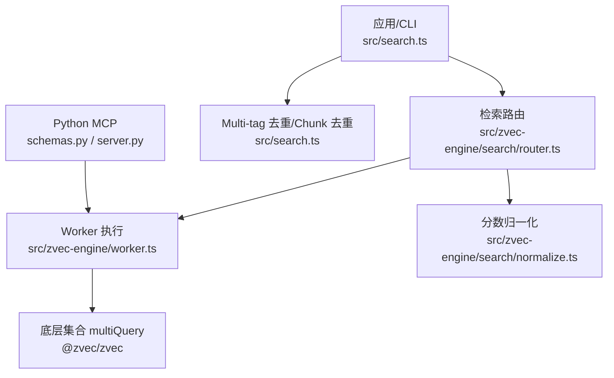
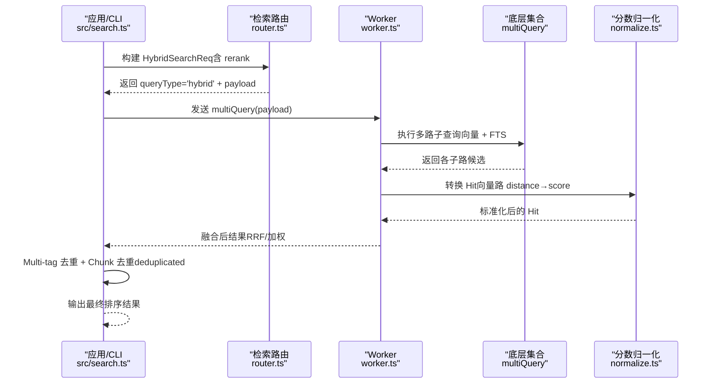
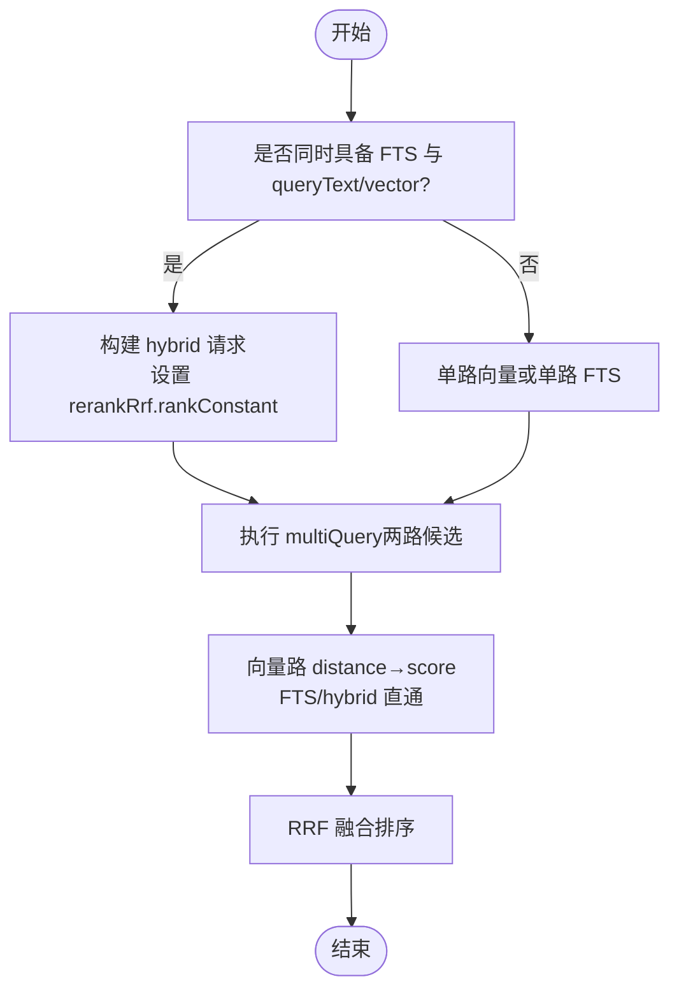
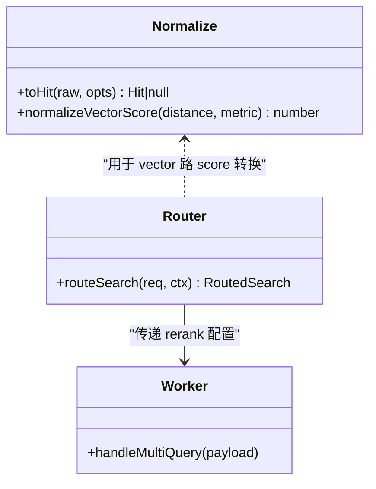
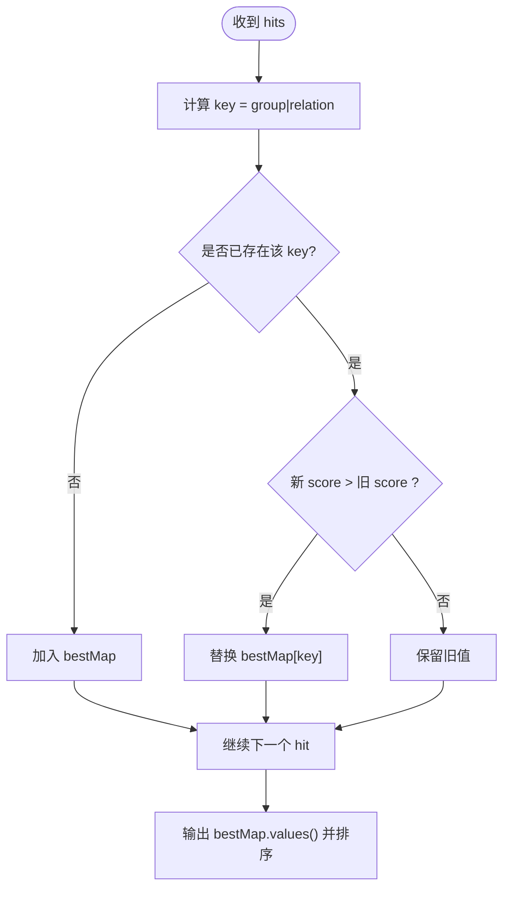
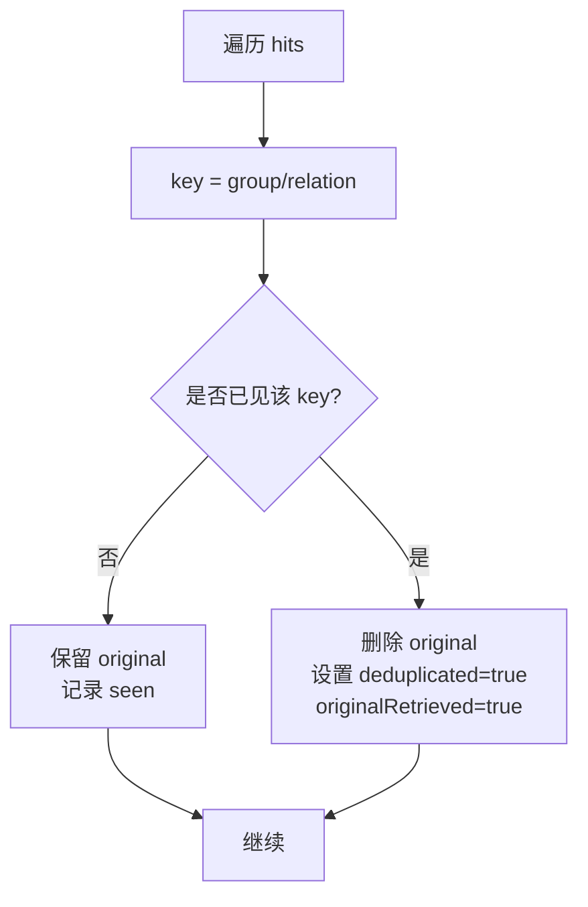
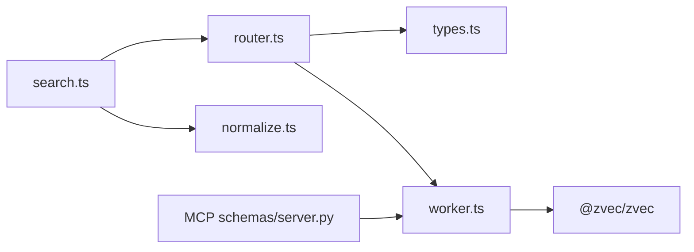

# 结果排序与融合

<cite>
**本文引用的文件**
- [src/search.ts](file://src/search.ts)
- [src/zvec-engine/search/router.ts](file://src/zvec-engine/search/router.ts)
- [src/zvec-engine/search/normalize.ts](file://src/zvec-engine/search/normalize.ts)
- [src/zvec-engine/types.ts](file://src/zvec-engine/types.ts)
- [src/zvec-engine/worker.ts](file://src/zvec-engine/worker.ts)
- [src/lib/path-search.ts](file://src/lib/path-search.ts)
- [src/lib/vector-client.ts](file://src/lib/vector-client.ts)
- [zvec-mcp-server/src/zvec_mcp/schemas.py](file://zvec-mcp-server/src/zvec_mcp/schemas.py)
- [zvec-mcp-server/src/zvec_mcp/server.py](file://zvec-mcp-server/src/zvec_mcp/server.py)
- [src/sync-relation.ts](file://src/sync-relation.ts)
- [test/search-original.test.ts](file://test/search-original.test.ts)
- [docs/cli.md](file://docs/cli.md)
</cite>

## 目录
1. [简介](#简介)
2. [项目结构](#项目结构)
3. [核心组件](#核心组件)
4. [架构总览](#架构总览)
5. [详细组件分析](#详细组件分析)
6. [依赖关系分析](#依赖关系分析)
7. [性能考量](#性能考量)
8. [故障排查指南](#故障排查指南)
9. [结论](#结论)
10. [附录](#附录)

## 简介
本文件聚焦 knowledge-indexer 的“结果排序与融合机制”，围绕以下目标展开：
- RRF（Reciprocal Rank Fusion）融合排序算法的实现原理与应用场景
- 不同召回路径结果的分数归一化、权重分配与最终排序逻辑
- Multi-tag 去重机制：同一 (group, relation) 键的 score 比较与最佳结果保留策略
- Chunk 级去重实现：同一文件多 chunk 命中处理与 deduplicated 标记
- 排序算法参数配置与效果评估方法

## 项目结构
检索与排序相关代码主要分布在 Node 侧引擎与上层搜索编排层，以及 Python MCP 服务暴露的多向量检索能力：
- Node 侧
  - 路由与融合：search/router.ts、search/normalize.ts、types.ts
  - Worker 执行：worker.ts（调用底层 multiQuery 并传入 rerank 配置）
  - 上层编排：search.ts（Multi-tag 去重、chunk 去重、原文返回）
  - 辅助：vector-client.ts、path-search.ts（说明 hybrid 走 RRF 融合分）
- Python MCP 侧
  - schemas.py：定义 topk/topn/reranker_type/weights/rank_constant/metric_type 等参数
  - server.py：根据 reranker_type 选择加权或 RRF 融合

**图示来源**
- [src/zvec-engine/search/router.ts:43-127](file://src/zvec-engine/search/router.ts#L43-L127)
- [src/zvec-engine/worker.ts:142-148](file://src/zvec-engine/worker.ts#L142-L148)
- [src/zvec-engine/search/normalize.ts:1-64](file://src/zvec-engine/search/normalize.ts#L1-L64)
- [src/search.ts:70-196](file://src/search.ts#L70-L196)
- [zvec-mcp-server/src/zvec_mcp/schemas.py:299-340](file://zvec-mcp-server/src/zvec_mcp/schemas.py#L299-L340)
- [zvec-mcp-server/src/zvec_mcp/server.py:801-827](file://zvec-mcp-server/src/zvec_mcp/server.py#L801-L827)

**章节来源**
- [src/zvec-engine/search/router.ts:43-127](file://src/zvec-engine/search/router.ts#L43-L127)
- [src/zvec-engine/worker.ts:142-148](file://src/zvec-engine/worker.ts#L142-L148)
- [src/zvec-engine/search/normalize.ts:1-64](file://src/zvec-engine/search/normalize.ts#L1-L64)
- [src/search.ts:70-196](file://src/search.ts#L70-L196)
- [zvec-mcp-server/src/zvec_mcp/schemas.py:299-340](file://zvec-mcp-server/src/zvec_mcp/schemas.py#L299-L340)
- [zvec-mcp-server/src/zvec_mcp/server.py:801-827](file://zvec-mcp-server/src/zvec_mcp/server.py#L801-L827)

## 核心组件
- 检索路由与融合入口
  - router.ts：决定单路向量、单路 FTS、混合两路（向量+FTS），并在混合时注入 rerank 配置（RRF 或 weighted）。
  - worker.ts：将路由结果下发到底层 multiQuery，并传递 rerankRrf/rerankWeighted。
- 分数归一化
  - normalize.ts：向量路使用 COSINE 距离转 score；FTS/hybrid 直通原始分数。
- 上层编排与去重
  - search.ts：按 tag 优先级聚合、Multi-tag 去重（同 group/relation 取最高分）、同一文件多 chunk 去重（deduplicated 标记）、可选返回 local KB 原文。
- Python MCP 多向量检索
  - schemas.py/server.py：暴露 topk/topn/reranker_type/weights/rank_constant/metric_type 等参数，支持加权与 RRF 两种融合策略。

**章节来源**
- [src/zvec-engine/search/router.ts:43-127](file://src/zvec-engine/search/router.ts#L43-L127)
- [src/zvec-engine/worker.ts:142-148](file://src/zvec-engine/worker.ts#L142-L148)
- [src/zvec-engine/search/normalize.ts:1-64](file://src/zvec-engine/search/normalize.ts#L1-L64)
- [src/search.ts:70-196](file://src/search.ts#L70-L196)
- [zvec-mcp-server/src/zvec_mcp/schemas.py:299-340](file://zvec-mcp-server/src/zvec_mcp/schemas.py#L299-L340)
- [zvec-mcp-server/src/zvec_mcp/server.py:801-827](file://zvec-mcp-server/src/zvec_mcp/server.py#L801-L827)

## 架构总览
下图展示一次混合检索从请求到融合排序的关键流程，包括路由决策、子查询并行、RRF/加权融合、分数归一化与上层去重。

**图示来源**
- [src/zvec-engine/search/router.ts:74-100](file://src/zvec-engine/search/router.ts#L74-L100)
- [src/zvec-engine/worker.ts:421-423](file://src/zvec-engine/worker.ts#L421-L423)
- [src/zvec-engine/search/normalize.ts:38-63](file://src/zvec-engine/search/normalize.ts#L38-L63)
- [src/search.ts:123-196](file://src/search.ts#L123-L196)

## 详细组件分析

### RRF（Reciprocal Rank Fusion）融合排序
- 触发条件
  - 当同时存在 FTS 与 queryText/vector 时，router 以 hybrid 模式构造 multiQuery，并设置 rerankRrf.rankConstant（默认 60）。
- 参数说明
  - rankConstant：控制排名衰减强度，越大则头部优势越弱。
  - 在 Python MCP 中，rank_constant 通过 schemas 暴露并可由调用方指定。
- 行为特征
  - 仅基于“秩次”进行融合，不依赖跨路分数尺度差异，适合不同度量/量纲的路径合并。
  - 文档 CLI 提示：hybrid 检索为“向量语义 + 全文 BM25”两路融合，阈值建议 0.02~0.03（受 rankConstant=60 影响）。

**图示来源**
- [src/zvec-engine/search/router.ts:74-100](file://src/zvec-engine/search/router.ts#L74-L100)
- [src/zvec-engine/search/normalize.ts:38-63](file://src/zvec-engine/search/normalize.ts#L38-L63)
- [docs/cli.md:525-537](file://docs/cli.md#L525-L537)

**章节来源**
- [src/zvec-engine/search/router.ts:74-100](file://src/zvec-engine/search/router.ts#L74-L100)
- [src/zvec-engine/types.ts:118-136](file://src/zvec-engine/types.ts#L118-L136)
- [src/zvec-engine/worker.ts:421-423](file://src/zvec-engine/worker.ts#L421-L423)
- [zvec-mcp-server/src/zvec_mcp/schemas.py:317-329](file://zvec-mcp-server/src/zvec_mcp/schemas.py#L317-L329)
- [docs/cli.md:525-537](file://docs/cli.md#L525-L537)

### 分数归一化与权重分配
- 向量路（COSINE）
  - 将距离 distance ∈ [0,2] 转换为 score = 1/(1+distance)，值域约 [1/3, 1]。
- FTS 路
  - 直接使用 BM25 原值（越大越相关），不做转换。
- Hybrid 路
  - 经 RRF 或加权融合后得到最终 score，不再二次转换。
- 权重分配（加权融合）
  - 当 reranker_type 为 weighted 时，需为每个字段提供权重；未提供时按字段顺序映射权重数组。
  - Python MCP 允许显式传入 weights，Node 侧路由亦支持将权重转为数组传给底层。

**图示来源**
- [src/zvec-engine/search/normalize.ts:16-63](file://src/zvec-engine/search/normalize.ts#L16-L63)
- [src/zvec-engine/search/router.ts:176-190](file://src/zvec-engine/search/router.ts#L176-L190)
- [src/zvec-engine/worker.ts:421-423](file://src/zvec-engine/worker.ts#L421-L423)

**章节来源**
- [src/zvec-engine/search/normalize.ts:1-64](file://src/zvec-engine/search/normalize.ts#L1-L64)
- [src/zvec-engine/search/router.ts:176-190](file://src/zvec-engine/search/router.ts#L176-L190)
- [zvec-mcp-server/src/zvec_mcp/server.py:817-827](file://zvec-mcp-server/src/zvec_mcp/server.py#L817-L827)

### Multi-tag 去重机制
- 背景
  - sync-relation 会为每个自定义 tag 写入独立的 content 向量，导致同一文档可能因多 tag 被多次召回。
- 策略
  - 在 search.ts 中对 results 按 (group, relation) 作为 key 去重，保留 score 最高的条目。
  - 去重后保持 score 降序排列。
- 关联写入端去重
  - sync-relation.ts 在同批内对重复 (group, relation) 做覆盖式去重，避免孤儿向量与误删。

**图示来源**
- [src/search.ts:159-177](file://src/search.ts#L159-L177)
- [src/sync-relation.ts:569-605](file://src/sync-relation.ts#L569-L605)

**章节来源**
- [src/search.ts:159-177](file://src/search.ts#L159-L177)
- [src/sync-relation.ts:569-605](file://src/sync-relation.ts#L569-L605)

### Chunk 级去重与 deduplicated 标记
- 场景
  - 同一文件被切分为多个 chunk，检索时可能命中多条，但只需返回一次原文。
- 策略
  - 当开启 includeOriginal 时，按 (group/relation) 作为文件级 key 去重：第一条携带 original，后续命中删除 original 并设置 deduplicated=true，originalRetrieved 仍为 true。
- 测试验证
  - 测试用例断言“同一文件多 chunk 命中 → 第一条带原文，后续 deduplicated”。

**图示来源**
- [src/search.ts:179-194](file://src/search.ts#L179-L194)
- [test/search-original.test.ts:134-134](file://test/search-original.test.ts#L134-L134)

**章节来源**
- [src/search.ts:179-194](file://src/search.ts#L179-L194)
- [test/search-original.test.ts:134-134](file://test/search-original.test.ts#L134-L134)

### 标签优先级与聚合
- 默认搜索全部时，按 ki-search > ki-relation > ki-path 的优先级分别查询，再拼接结果。
- 若显式传入 tags，则单次查询并按 threshold 过滤。

**章节来源**
- [src/search.ts:21-29](file://src/search.ts#L21-L29)
- [src/search.ts:94-121](file://src/search.ts#L94-L121)

### 路径搜索中的 RRF 融合分
- path-search.ts 明确说明底层走 hybridSearch（RRF 融合分），且阈值语义与 mem 版不同（mem 用余弦阈值 0.75，vector 版使用 RRF 融合分）。

**章节来源**
- [src/lib/path-search.ts:9-44](file://src/lib/path-search.ts#L9-L44)

### Python MCP 多向量检索与融合
- 参数
  - topk：每路候选数
  - topn：融合后返回条数
  - reranker_type：weighted 或 rrf
  - weights：加权融合时各字段权重
  - rank_constant：RRF 融合常数
  - metric_type：加权融合时的相似度度量类型
- 行为
  - 根据 reranker_type 选择加权或 RRF 融合；未传 weights 时默认等权。

**章节来源**
- [zvec-mcp-server/src/zvec_mcp/schemas.py:299-340](file://zvec-mcp-server/src/zvec_mcp/schemas.py#L299-L340)
- [zvec-mcp-server/src/zvec_mcp/server.py:801-827](file://zvec-mcp-server/src/zvec_mcp/server.py#L801-L827)

## 依赖关系分析
- 耦合关系
  - search.ts 依赖 router.ts 的 hybrid 路由与 worker.ts 的 multiQuery 能力；依赖 normalize.ts 的分数归一化契约。
  - router.ts 依赖 types.ts 的 HybridSearchReq 与 Hit 定义。
  - worker.ts 依赖底层 @zvec/zvec 的 multiQuerySync，并透传 rerank 配置。
- 外部依赖
  - Python MCP 通过 schemas/server 暴露融合能力，供上层服务调用。

**图示来源**
- [src/search.ts:70-196](file://src/search.ts#L70-L196)
- [src/zvec-engine/search/router.ts:43-127](file://src/zvec-engine/search/router.ts#L43-L127)
- [src/zvec-engine/types.ts:118-151](file://src/zvec-engine/types.ts#L118-L151)
- [src/zvec-engine/worker.ts:142-148](file://src/zvec-engine/worker.ts#L142-L148)
- [zvec-mcp-server/src/zvec_mcp/schemas.py:299-340](file://zvec-mcp-server/src/zvec_mcp/schemas.py#L299-L340)

**章节来源**
- [src/search.ts:70-196](file://src/search.ts#L70-L196)
- [src/zvec-engine/search/router.ts:43-127](file://src/zvec-engine/search/router.ts#L43-L127)
- [src/zvec-engine/types.ts:118-151](file://src/zvec-engine/types.ts#L118-L151)
- [src/zvec-engine/worker.ts:142-148](file://src/zvec-engine/worker.ts#L142-L148)
- [zvec-mcp-server/src/zvec_mcp/schemas.py:299-340](file://zvec-mcp-server/src/zvec_mcp/schemas.py#L299-L340)

## 性能考量
- 融合策略选择
  - RRF：无需跨路分数对齐，调参简单，适合异构度量/量纲的融合。
  - Weighted：需要合理权重与归一化，适合分数可比且已知字段重要性的场景。
- 阈值与 topk
  - hybrid 检索的 RRF 融合分上限受 rankConstant 与 topk 影响；CLI 建议阈值区间 0.02~0.03，超过理论上限会过滤掉所有结果。
- 去重开销
  - Multi-tag 与 chunk 去重均为 O(N) 哈希表操作，开销可控。
- 归一化成本
  - 向量路仅做一次 distance→score 转换，成本极低。

[本节为通用指导，不直接分析具体文件]

## 故障排查指南
- 向量不可用
  - executeSearch 会在向量服务不可用时返回 degraded 错误信息，便于快速定位。
- 原文不可用
  - fetchOriginal 失败时降级为返回向量 content，并附带 hint 提示。
- 阈值导致空结果
  - 若 threshold 设置过高（超过 RRF 理论上限），将无命中；应下调至 0.02~0.03 区间并结合数据校准。
- 多 chunk 重复
  - 确认 includeOriginal 开启时，后续命中会被标记 deduplicated；消费方可据此跳过重复原文。

**章节来源**
- [src/search.ts:84-92](file://src/search.ts#L84-L92)
- [src/search.ts:54-68](file://src/search.ts#L54-L68)
- [docs/cli.md:525-537](file://docs/cli.md#L525-L537)
- [src/search.ts:179-194](file://src/search.ts#L179-L194)

## 结论
- 本项目在 Node 侧通过 router/worker/normalize 实现了混合检索与 RRF/加权融合，并在上层 search.ts 完成 Multi-tag 与 chunk 级去重，保证结果既相关又简洁。
- Python MCP 提供了可配置的融合能力（topk/topn/reranker_type/weights/rank_constant/metric_type），便于在不同场景下灵活切换融合策略。
- 推荐实践：
  - 优先使用 RRF 融合（rankConstant=60），配合 CLI 阈值 0.02~0.03 进行过滤；
  - 如需强调某一路贡献，可使用加权融合并显式配置权重；
  - 开启 includeOriginal 以获得文件级原文，注意 deduplicated 标记以避免重复。

[本节为总结性内容，不直接分析具体文件]

## 附录
- 关键参数速查
  - RRF：rank_constant（默认 60）
  - 加权融合：weights（字段权重）、metric_type（相似度度量）
  - 检索规模：topk（每路候选）、topn（融合后返回条数）
  - 过滤：threshold（融合分阈值）

[本节为补充说明，不直接分析具体文件]