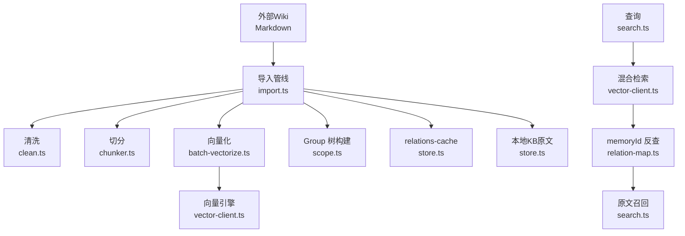
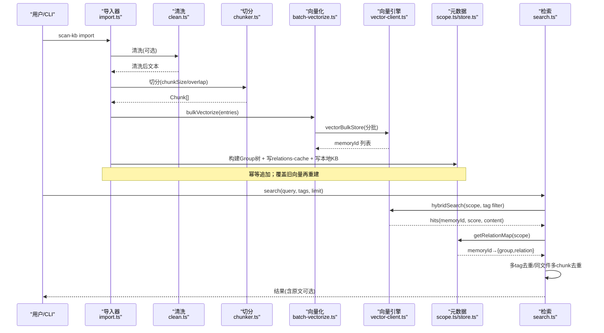
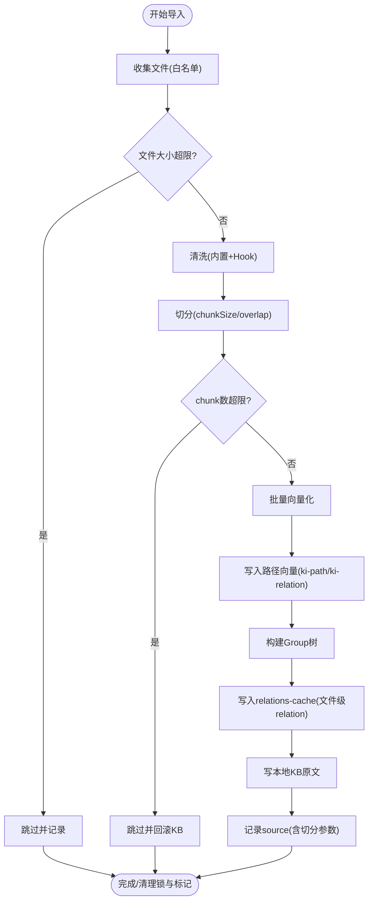
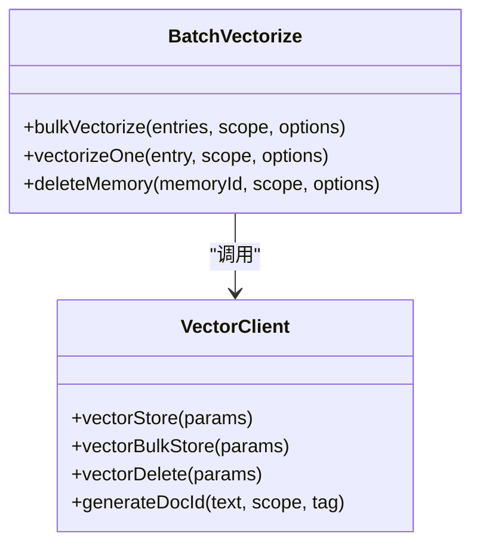
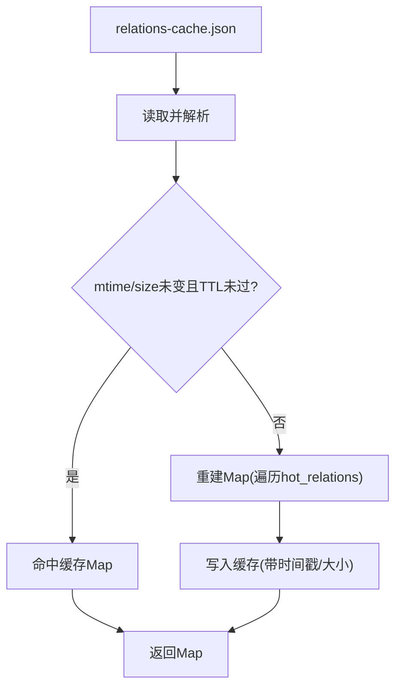
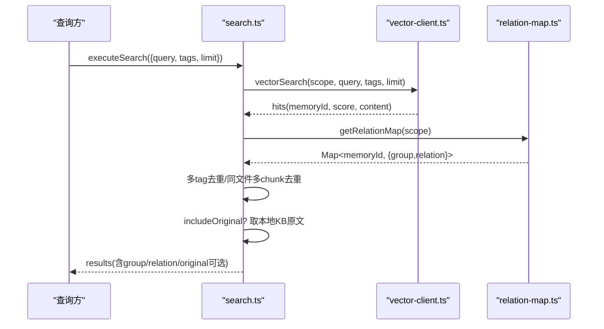
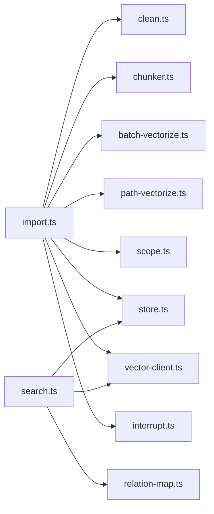

# 数据流处理

<cite>
**本文引用的文件**
- [README.md](file://README.md)
- [src/config.ts](file://src/config.ts)
- [src/lib/import.ts](file://src/lib/import.ts)
- [src/search.ts](file://src/search.ts)
- [src/lib/batch-vectorize.ts](file://src/lib/batch-vectorize.ts)
- [src/lib/vector-client.ts](file://src/lib/vector-client.ts)
- [src/lib/scope.ts](file://src/lib/scope.ts)
- [src/lib/chunker.ts](file://src/lib/chunker.ts)
- [src/lib/path-vectorize.ts](file://src/lib/path-vectorize.ts)
- [src/lib/relation-map.ts](file://src/lib/relation-map.ts)
- [src/lib/clean.ts](file://src/lib/clean.ts)
- [src/lib/ai-results.ts](file://src/lib/ai-results.ts)
- [src/lib/store.ts](file://src/lib/store.ts)
- [src/lib/interrupt.ts](file://src/lib/interrupt.ts)
</cite>

## 目录
1. [简介](#简介)
2. [项目结构](#项目结构)
3. [核心组件](#核心组件)
4. [架构总览](#架构总览)
5. [详细组件分析](#详细组件分析)
6. [依赖关系分析](#依赖关系分析)
7. [性能考量](#性能考量)
8. [故障排查指南](#故障排查指南)
9. [结论](#结论)
10. [附录](#附录)

## 简介
本文件面向开发者，系统化阐述 knowledge-indexer 从“外部 Wiki 导入”到“检索返回原文”的端到端数据流。内容覆盖：
- 外部 Markdown 知识库扫描与切分
- 清洗、向量化、路径向量写入
- Group 树构建与 relations-cache 元数据管理
- 本地 KB 原文持久化
- 语义检索（混合检索）与结果定位、原文召回
- 批量处理、增量更新、错误恢复与中断保护

## 项目结构
知识索引系统围绕“导入管线 + 向量引擎 + 元数据索引 + 检索服务”组织：
- 导入管线：scan-kb import → 清洗 → 切分 → 向量化 → 写本地 KB → 写 relations-cache → 记录 source
- 向量层：vector-client 封装 zvec 引擎，提供存储、检索、删除、统计等能力
- 元数据：scope/group/index/cache 文件，relation-map 缓存 memoryId→group/relation
- 检索：search 执行混合检索，按 memoryId 反查并可选返回原文

图表来源
- [src/lib/import.ts:214-559](file://src/lib/import.ts#L214-L559)
- [src/lib/vector-client.ts:477-506](file://src/lib/vector-client.ts#L477-L506)
- [src/search.ts:70-199](file://src/search.ts#L70-L199)

章节来源
- [README.md:35-103](file://README.md#L35-L103)
- [src/lib/import.ts:214-559](file://src/lib/import.ts#L214-L559)
- [src/search.ts:70-199](file://src/search.ts#L70-L199)

## 核心组件
- 导入器（import.ts）：统一入口，负责文件收集、清洗、切分、向量化、Group 树构建、relations-cache 写入、source 记录、中断与并发控制
- 向量客户端（vector-client.ts）：封装 zvec 引擎，提供单条/批量存储、检索、删除、统计、锁与空闲释放
- 批量化（batch-vectorize.ts）：批量 embed+upsert，支持分批提交与进度回调
- 路径向量（path-vectorize.ts）：为 group 路径和 relation 名称建立辅助向量索引
- 切分器（chunker.ts）：固定长度+段落边界优先的递归切分，限制单文件 chunk 数
- 清洗器（clean.ts）：内置规则与外部 hook 管道，仅作用于向量化输入，local KB 存原文
- 元数据（scope.ts, store.ts, relation-map.ts）：Group 树、relations-cache、memoryId 反查映射与 TTL 缓存
- 检索（search.ts）：混合检索、标签优先级、去重、原文召回

章节来源
- [src/lib/import.ts:214-559](file://src/lib/import.ts#L214-L559)
- [src/lib/vector-client.ts:477-506](file://src/lib/vector-client.ts#L477-L506)
- [src/lib/batch-vectorize.ts:132-182](file://src/lib/batch-vectorize.ts#L132-L182)
- [src/lib/path-vectorize.ts:75-116](file://src/lib/path-vectorize.ts#L75-L116)
- [src/lib/chunker.ts:57-92](file://src/lib/chunker.ts#L57-L92)
- [src/lib/clean.ts:48-130](file://src/lib/clean.ts#L48-L130)
- [src/lib/scope.ts:151-167](file://src/lib/scope.ts#L151-L167)
- [src/lib/store.ts:55-62](file://src/lib/store.ts#L55-L62)
- [src/lib/relation-map.ts:48-78](file://src/lib/relation-map.ts#L48-L78)
- [src/search.ts:70-199](file://src/search.ts#L70-L199)

## 架构总览
下图展示从导入到检索的关键调用链与数据转换点：

图表来源
- [src/lib/import.ts:214-559](file://src/lib/import.ts#L214-L559)
- [src/lib/batch-vectorize.ts:132-182](file://src/lib/batch-vectorize.ts#L132-L182)
- [src/lib/vector-client.ts:547-590](file://src/lib/vector-client.ts#L547-L590)
- [src/search.ts:70-199](file://src/search.ts#L70-L199)

## 详细组件分析

### 导入管线（外部 Wiki → 本地 KB + 向量 + 元数据）
- 文件收集与白名单校验：默认 .md，可配置扩展；跳过非白名单并汇总提示
- 大小与冲突检查：超限文件跳过；同名不同源 relation 冲突时跳过，同名同源幂等覆盖
- 清洗与 Hook：内置规则（BOM/frontmatter/HTML注释/mermaid/代码块/路径剥离/空行折叠），外部 hook 顺序执行，失败回滚 local KB
- 切分：固定长度+段落边界优先，限制单文件最大 chunk 数，避免向量爆炸
- 向量化：批量 embed+upsert，分批提交（默认每批 200），失败条目记录不中断整体
- 路径向量：为每个 chunk 写 ki-relation，为每个 group 写 ki-path，便于路径/关系语义兜底
- 文档级自定义标签：可为每个导入文件写多条 tag 向量，使 -t <tag> 可召回
- Group 树构建：确保 groupPath 完整存在，父节点自动创建
- relations-cache 写入：文件级 relation 聚合，memoryIds 回填（方案 D 多值）
- 本地 KB 原文：按 groupPath/relation 落盘 index.json，供检索原文召回
- Source 记录：持久化 dir/chunkSize/chunkOverlap，用于后续增量/重建
- 中断与并发：SIGINT/SIGTERM 捕获写中断标记；.import.lock 防并发导入；成功完成后清理

图表来源
- [src/lib/import.ts:214-559](file://src/lib/import.ts#L214-L559)
- [src/lib/chunker.ts:57-92](file://src/lib/chunker.ts#L57-L92)
- [src/lib/path-vectorize.ts:75-116](file://src/lib/path-vectorize.ts#L75-L116)
- [src/lib/scope.ts:151-167](file://src/lib/scope.ts#L151-L167)
- [src/lib/store.ts:55-62](file://src/lib/store.ts#L55-L62)

章节来源
- [src/lib/import.ts:214-559](file://src/lib/import.ts#L214-L559)
- [src/lib/clean.ts:48-130](file://src/lib/clean.ts#L48-L130)
- [src/lib/chunker.ts:57-92](file://src/lib/chunker.ts#L57-L92)
- [src/lib/path-vectorize.ts:75-116](file://src/lib/path-vectorize.ts#L75-L116)
- [src/lib/scope.ts:151-167](file://src/lib/scope.ts#L151-L167)
- [src/lib/store.ts:55-62](file://src/lib/store.ts#L55-L62)
- [src/lib/interrupt.ts:93-130](file://src/lib/interrupt.ts#L93-L130)

### 向量化与批量处理
- 单条 vs 批量：推荐 bulkVectorize，一次 engine 共享，减少启动/网络开销
- 分批策略：按 200 条一批提交，避免一次性过大；批间输出进度
- 失败隔离：逐条结果 success/error 区分，errors 记录但不中断整体
- 路径向量：按 scope 分组批量写入，消除重复 embed
- 文档级标签：为每个文件按自定义 tag 各写一条，docId 由 text+scope+tag 生成，保证独立

图表来源
- [src/lib/batch-vectorize.ts:52-117](file://src/lib/batch-vectorize.ts#L52-L117)
- [src/lib/batch-vectorize.ts:132-182](file://src/lib/batch-vectorize.ts#L132-L182)
- [src/lib/vector-client.ts:513-590](file://src/lib/vector-client.ts#L513-L590)

章节来源
- [src/lib/batch-vectorize.ts:132-182](file://src/lib/batch-vectorize.ts#L132-L182)
- [src/lib/vector-client.ts:513-590](file://src/lib/vector-client.ts#L513-L590)

### 元数据管理与缓存
- GroupIndex：维护 groups 树结构，支持旧格式迁移（roots→groups）
- RelationsCache：hot_relations 列表，文件级 relation 挂 memoryIds 多值
- RelationMap：内存缓存 memoryId→{group,relation}，TTL+mtime+size 失效策略
- WAL 写入：JSON 写入采用临时文件+原子 rename，保障一致性

图表来源
- [src/lib/relation-map.ts:48-78](file://src/lib/relation-map.ts#L48-L78)
- [src/lib/store.ts:55-62](file://src/lib/store.ts#L55-L62)
- [src/lib/scope.ts:151-167](file://src/lib/scope.ts#L151-L167)

章节来源
- [src/lib/relation-map.ts:48-78](file://src/lib/relation-map.ts#L48-L78)
- [src/lib/store.ts:55-62](file://src/lib/store.ts#L55-L62)
- [src/lib/scope.ts:151-167](file://src/lib/scope.ts#L151-L167)

### 检索流程与结果返回
- 标签优先级：默认搜索全部时，ki-search 内容优先，其次 ki-relation/ki-path
- 混合检索：hybridSearch(queryText, fts, topk, filter)，score 越大越相关
- 原文召回：按 memoryId 反查 relations-cache 得到 group/relation，再从本地 KB 取原文；缺失则降级返回向量 content 并提示
- 去重策略：同一 (group,relation) 多 tag 命中只保留最高分；同一文件多 chunk 命中仅首条携带 original
- 资源释放：CLI 每次调用结束关闭引擎，避免进程无法退出

图表来源
- [src/search.ts:70-199](file://src/search.ts#L70-L199)
- [src/lib/vector-client.ts:477-506](file://src/lib/vector-client.ts#L477-L506)
- [src/lib/relation-map.ts:48-78](file://src/lib/relation-map.ts#L48-L78)

章节来源
- [src/search.ts:70-199](file://src/search.ts#L70-L199)
- [src/lib/vector-client.ts:477-506](file://src/lib/vector-client.ts#L477-L506)
- [src/lib/relation-map.ts:48-78](file://src/lib/relation-map.ts#L48-L78)

### 增量更新与幂等机制
- 幂等追加：同 sourcePath 覆盖更新；同名不同 sourcePath 视为冲突跳过；新文件直接导入
- 覆盖旧向量：若 scope 已存在向量，先删除再重建，避免孤儿向量
- Source 记录：dir/chunkSize/chunkOverlap 持久化，便于后续重建或增量对齐
- 中断恢复：中断标记记录已完成/总数，向量命令前置检测给出引导

章节来源
- [src/lib/import.ts:319-333](file://src/lib/import.ts#L319-L333)
- [src/lib/import.ts:423-433](file://src/lib/import.ts#L423-L433)
- [src/lib/import.ts:527-534](file://src/lib/import.ts#L527-L534)
- [src/lib/interrupt.ts:71-78](file://src/lib/interrupt.ts#L71-L78)

### 错误恢复与健壮性
- 向量库锁与空闲释放：撞锁重试、空闲超时释放锁，错开共享向量库
- Worker 不可用自愈：检测到 worker closed 等异常，重置 engine 并重试
- JSON 损坏恢复：readJson 抛出明确错误，建议从备份或模板恢复
- 导入中断保护：信号捕获写中断标记，清理锁；SIGKILL 残留锁自动清理

章节来源
- [src/lib/vector-client.ts:93-104](file://src/lib/vector-client.ts#L93-L104)
- [src/lib/vector-client.ts:164-181](file://src/lib/vector-client.ts#L164-L181)
- [src/lib/vector-client.ts:389-407](file://src/lib/vector-client.ts#L389-L407)
- [src/lib/store.ts:23-49](file://src/lib/store.ts#L23-L49)
- [src/lib/interrupt.ts:93-130](file://src/lib/interrupt.ts#L93-L130)

## 依赖关系分析
- import.ts 依赖：
  - clean.ts（清洗）、chunker.ts（切分）、batch-vectorize.ts（向量化）、path-vectorize.ts（路径向量）
  - scope.ts（Group 树、source 记录）、store.ts（WAL 写入、初始化）、vector-client.ts（向量操作）
  - interrupt.ts（中断与并发锁）、progress.ts（进度日志）
- search.ts 依赖：
  - vector-client.ts（混合检索）、relation-map.ts（memoryId 反查）、store.ts（本地 KB 读取）

图表来源
- [src/lib/import.ts:214-559](file://src/lib/import.ts#L214-L559)
- [src/search.ts:70-199](file://src/search.ts#L70-L199)

章节来源
- [src/lib/import.ts:214-559](file://src/lib/import.ts#L214-L559)
- [src/search.ts:70-199](file://src/search.ts#L70-L199)

## 性能考量
- 批量向量化：200 条/批，减少 engine 启动与网络往返
- 路径向量分组：按 scope 分组批量写入，避免重复 embed
- 标签优先级：默认全量搜索时按 tag 分查并排序，提升命中率与相关性
- 内存缓存：relation-map 使用 TTL+mtime+size 策略，降低频繁 IO
- 向量库锁：空闲释放锁，支持多实例共享，避免阻塞
- 原文召回：仅在显式开启时执行，避免不必要 IO

[本节为通用指导，无需特定文件引用]

## 故障排查指南
- 向量库被占用：查看提示，等待锁释放或停止其他进程；必要时重建向量库
- 向量库损坏：根据提示执行 restore --rebuild-vector 或从快照恢复
- 导入中断：查看中断标记，执行 rebuild-vector 或 restore 恢复
- JSON 损坏：根据错误信息从备份或 _template 恢复
- 原文不可用：检查本地 KB 是否存在对应 relation；必要时重新导入或重建向量

章节来源
- [src/lib/vector-client.ts:74-86](file://src/lib/vector-client.ts#L74-L86)
- [src/lib/vector-client.ts:420-467](file://src/lib/vector-client.ts#L420-L467)
- [src/lib/interrupt.ts:71-78](file://src/lib/interrupt.ts#L71-L78)
- [src/lib/store.ts:23-49](file://src/lib/store.ts#L23-L49)
- [src/search.ts:54-68](file://src/search.ts#L54-L68)

## 结论
knowledge-indexer 通过“结构化索引 + 向量语义检索”的双路径设计，实现了从外部 Wiki 导入到检索返回原文的完整闭环。系统在批量处理、增量更新、错误恢复等方面具备高健壮性与可扩展性，适合大规模知识索引与检索场景。

[本节为总结，无需特定文件引用]

## 附录
- 快速开始与 CLI 参考见 README
- 配置管理见 config.ts
- 工作流与最佳实践见 docs/workflows.md

章节来源
- [README.md:105-217](file://README.md#L105-L217)
- [src/config.ts:128-177](file://src/config.ts#L128-L177)