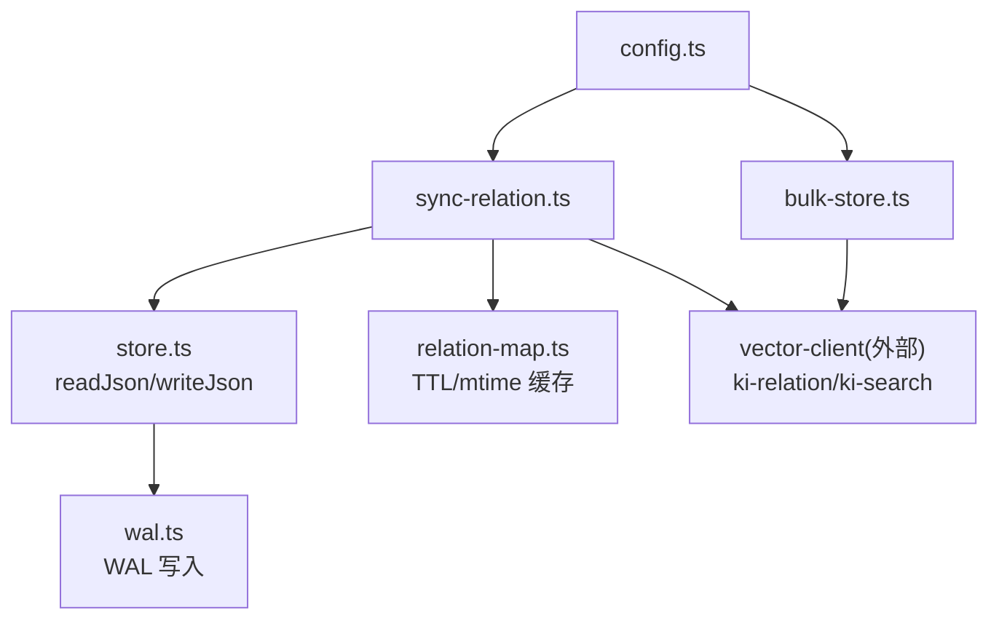
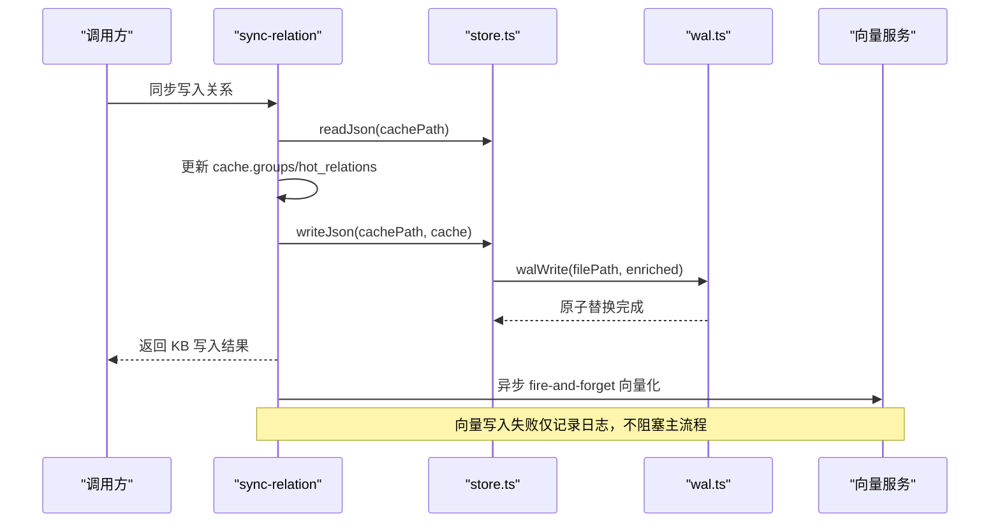
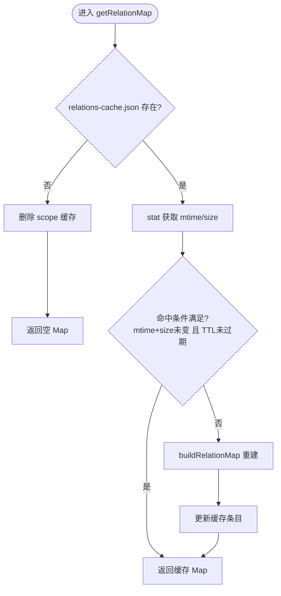
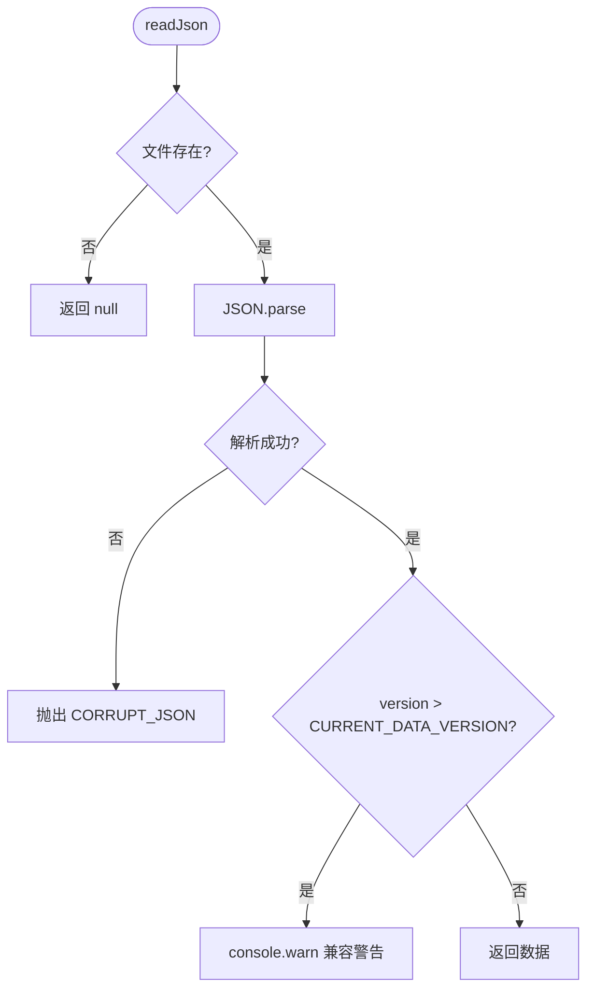
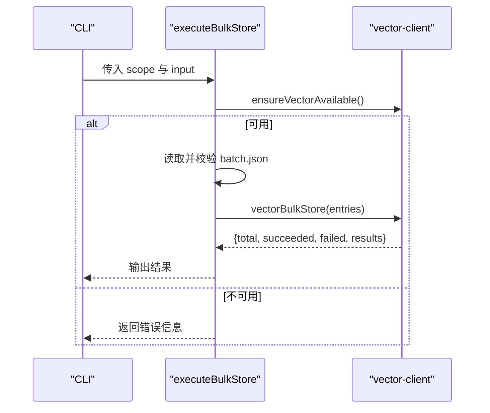
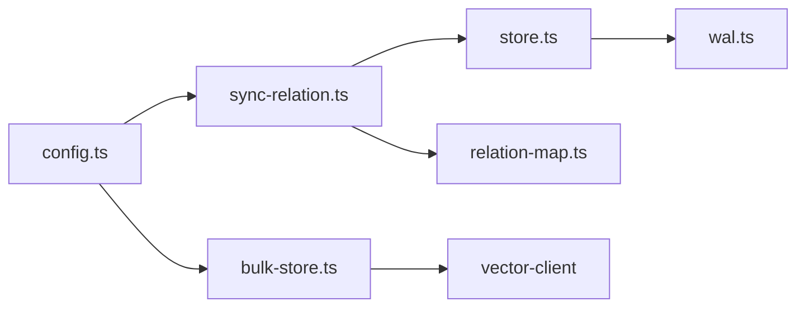

# 数据缓存机制

<cite>
**本文引用的文件**
- [src/lib/relation-map.ts](file://src/lib/relation-map.ts)
- [src/lib/wal.ts](file://src/lib/wal.ts)
- [src/lib/store.ts](file://src/lib/store.ts)
- [src/sync-relation.ts](file://src/sync-relation.ts)
- [src/bulk-store.ts](file://src/bulk-store.ts)
- [src/lib/config.ts](file://src/lib/config.ts)
- [test/relation-map.test.ts](file://test/relation-map.test.ts)
- [test/lib.test.ts](file://test/lib.test.ts)
</cite>

## 目录
1. [简介](#简介)
2. [项目结构](#项目结构)
3. [核心组件](#核心组件)
4. [架构总览](#架构总览)
5. [详细组件分析](#详细组件分析)
6. [依赖关系分析](#依赖关系分析)
7. [性能考量](#性能考量)
8. [故障排查指南](#故障排查指南)
9. [结论](#结论)
10. [附录](#附录)

## 简介
本文件聚焦 knowledge-indexer 的数据缓存机制，围绕以下目标展开：
- 关系映射缓存：memoryId → { group, relation } 的反查映射及其 TTL/mtime 失效策略。
- 批量存储优化：bulk-store 与向量写入的批处理、并发与失败隔离。
- WAL 写入保证：原子写、跨进程锁、中断残留清理。
- 缓存一致性：脏数据检测、失效与同步策略（mtime/size/TTL）。
- 批量操作优化：批大小调优、内存管理与 I/O 优化建议。
- 监控指标与故障恢复：可观测性要点与恢复路径。

## 项目结构
与数据缓存相关的关键模块分布如下：
- 关系映射缓存：src/lib/relation-map.ts
- WAL 持久化：src/lib/wal.ts
- JSON 存储层与 scope 初始化：src/lib/store.ts
- 关系同步入口（含 WAL 写回与向量化）：src/sync-relation.ts
- 批量存储 CLI：src/bulk-store.ts
- 配置加载与默认路径：src/lib/config.ts
- 测试用例覆盖：test/relation-map.test.ts、test/lib.test.ts



图表来源
- [src/sync-relation.ts:920-953](file://src/sync-relation.ts#L920-L953)
- [src/lib/store.ts:23-62](file://src/lib/store.ts#L23-L62)
- [src/lib/wal.ts:92-112](file://src/lib/wal.ts#L92-L112)
- [src/lib/relation-map.ts:48-78](file://src/lib/relation-map.ts#L48-L78)
- [src/bulk-store.ts:32-78](file://src/bulk-store.ts#L32-L78)
- [src/lib/config.ts:148-175](file://src/lib/config.ts#L148-L175)

章节来源
- [src/lib/relation-map.ts:1-120](file://src/lib/relation-map.ts#L1-L120)
- [src/lib/wal.ts:1-143](file://src/lib/wal.ts#L1-L143)
- [src/lib/store.ts:1-267](file://src/lib/store.ts#L1-L267)
- [src/sync-relation.ts:920-953](file://src/sync-relation.ts#L920-L953)
- [src/bulk-store.ts:1-110](file://src/bulk-store.ts#L1-L110)
- [src/lib/config.ts:1-509](file://src/lib/config.ts#L1-L509)

## 核心组件
- 关系映射缓存（relation-map）
  - 作用：为 search 结果提供 memoryId → { group, relation } 的反查能力，用于定位原文。
  - 策略：模块级单例 Map<scope, 缓存条目>；命中条件为 mtime + size 未变且未超 TTL（默认 10 分钟）；文件缺失或损坏返回空 Map 降级。
  - 失效：mtime/size 变化立即重建；TTL 过期兜底重建；支持测试注入小 TTL。
- WAL 写入（wal）
  - 作用：确保 JSON 文件原子写入，避免并发覆盖与中断损坏。
  - 机制：跨进程写锁（.lock）、写临时文件（.tmp）、原子 rename、释放锁；支持陈旧锁抢占与超时保护；提供残留清理工具。
- JSON 存储层（store）
  - 作用：统一 readJson/writeJson，自动附加 version 与 updatedAt；负责 scope 初始化与旧格式迁移。
  - 集成：writeJson 调用 walWrite；readJson 对损坏 JSON 抛出结构化错误并给出恢复建议。
- 批量存储（bulk-store）
  - 作用：批量将文本存入向量索引（ki-relation/ki-search），CLI 封装与参数校验。
  - 流程：读取输入 JSON 数组 → 校验字段 → vectorBulkStore → 返回成功/失败统计。
- 配置加载（config）
  - 作用：加载 ki 配置（YAML/JSON），提供 dataDir/vectorDir/embedding/scopeMode 等；进程内缓存配置，避免重复 IO。

章节来源
- [src/lib/relation-map.ts:1-120](file://src/lib/relation-map.ts#L1-L120)
- [src/lib/wal.ts:1-143](file://src/lib/wal.ts#L1-L143)
- [src/lib/store.ts:1-267](file://src/lib/store.ts#L1-L267)
- [src/bulk-store.ts:1-110](file://src/bulk-store.ts#L1-L110)
- [src/lib/config.ts:1-509](file://src/lib/config.ts#L1-L509)

## 架构总览
知识索引的双通道设计：
- KB 通道：relations-cache.json + local KB + wiki，读延迟 <30ms，由 sync-relation 同步写入并通过 writeJson 使用 WAL 持久化。
- 向量通道：mem CLI（ki-relation + ki-search），语义检索，单次 2-10s；通过 bulk-store 或 vectorWriteBack 异步/并行执行，不阻塞 KB 返回。



图表来源
- [src/sync-relation.ts:920-953](file://src/sync-relation.ts#L920-L953)
- [src/lib/store.ts:55-62](file://src/lib/store.ts#L55-L62)
- [src/lib/wal.ts:92-112](file://src/lib/wal.ts#L92-L112)

## 详细组件分析

### 关系映射缓存（relation-map）
- 数据结构
  - 模块级缓存：Map<scope, ScopeCacheEntry>，包含 builtAt、mtimeMs、size、map。
  - 反查映射：Map<memoryId, { group, relation }>，支持多值 memoryIds 与旧单值 memoryId 兼容。
- 缓存策略
  - 命中：mtime + size 均未变且未超过 TTL（默认 10 分钟）。
  - 失效：文件被写入（mtime/size 变化）→ 立即重建；TTL 过期 → 重建；文件缺失/损坏 → 返回空 Map。
  - 懒构建：首次访问 O(N)，后续 O(1)。
- 测试覆盖
  - 无 memoryId 条目跳过、文件不存在/损坏降级、mtime 变化立即失效、TTL 过期重建。



图表来源
- [src/lib/relation-map.ts:48-78](file://src/lib/relation-map.ts#L48-L78)
- [src/lib/relation-map.ts:80-114](file://src/lib/relation-map.ts#L80-L114)

章节来源
- [src/lib/relation-map.ts:1-120](file://src/lib/relation-map.ts#L1-L120)
- [test/relation-map.test.ts:1-157](file://test/relation-map.test.ts#L1-L157)

### WAL 写入保证（wal）
- 原子写流程
  - 获取跨进程写锁（.lock），写临时文件（.tmp），原子 rename 到目标文件，释放锁。
- 并发保护
  - 使用 O_CREAT|O_EXCL 创建锁文件；若已存在则检查锁年龄，陈旧锁可抢占；自旋等待间隔 50ms，最长 10s 超时后抢占以避免死锁。
- 中断残留清理
  - cleanupTmpFiles 清理 .tmp 与陈旧 .lock，保障系统健壮性。
- 同步语义说明
  - 同步实现，在 MCP 长驻进程中可能短暂冻结事件循环；正常争用窗口毫秒级，极端情况秒级。

```mermaid
sequenceDiagram
participant P1 as "进程A"
participant P2 as "进程B"
participant FS as "文件系统"
P1->>FS : 尝试创建 .lock (O_CREAT|O_EXCL)
alt 成功
P1->>FS : 写 .tmp
P1->>FS : rename(tmp -> target)
P1->>FS : 删除 .lock
else EEXIST
P2->>P2 : 检查锁年龄
alt 陈旧锁
P2->>FS : 删除旧锁
P2->>FS : 重试创建 .lock
else 非陈旧
P2->>P2 : 自旋等待 50ms
P2->>FS : 重试创建 .lock
end
```

图表来源
- [src/lib/wal.ts:37-71](file://src/lib/wal.ts#L37-L71)
- [src/lib/wal.ts:92-112](file://src/lib/wal.ts#L92-L112)
- [src/lib/wal.ts:121-142](file://src/lib/wal.ts#L121-L142)

章节来源
- [src/lib/wal.ts:1-143](file://src/lib/wal.ts#L1-L143)
- [test/lib.test.ts:46-85](file://test/lib.test.ts#L46-L85)

### JSON 存储层（store）
- readJson
  - 文件不存在返回 null；解析失败抛出 CORRUPT_JSON 错误，提示从备份恢复或重新初始化。
  - 版本检查：高于当前版本时警告但不抛错，保持向前兼容。
- writeJson
  - 自动附加 version 与 updatedAt，调用 walWrite 进行原子持久化。
- scope 初始化与迁移
  - ensureScopeDir：strict 模式下校验 scope 白名单；新 scope 从 _template 初始化。
  - readGroupIndex：自动迁移旧格式（roots → groups），并迁移 relations-cache.json 中旧 key。



图表来源
- [src/lib/store.ts:23-49](file://src/lib/store.ts#L23-L49)
- [src/lib/store.ts:55-62](file://src/lib/store.ts#L55-L62)
- [src/lib/store.ts:73-92](file://src/lib/store.ts#L73-L92)
- [src/lib/store.ts:101-159](file://src/lib/store.ts#L101-L159)

章节来源
- [src/lib/store.ts:1-267](file://src/lib/store.ts#L1-L267)

### 批量存储（bulk-store）
- 功能
  - 批量将文本存入向量索引，输入为 JSON 数组，每项包含 text 与可选 tags。
- 流程
  - 校验 scope 与向量服务可用性 → 读取并校验输入文件 → vectorBulkStore → 返回统计结果。
- CLI
  - 命令名 bulk-store，支持 --scope 与 --input；每次调用后关闭引擎以释放资源。



图表来源
- [src/bulk-store.ts:32-78](file://src/bulk-store.ts#L32-L78)
- [src/bulk-store.ts:82-99](file://src/bulk-store.ts#L82-L99)

章节来源
- [src/bulk-store.ts:1-110](file://src/bulk-store.ts#L1-L110)

### 配置加载（config）
- 配置文件查找优先级：命令行 --config → $HOME/.ki/config.yaml/yml/json → 内置默认值。
- 默认路径：dataDir 默认 ~/.ki/kb，backupDir 默认 ~/.ki/backup，vectorDir 默认 ~/.ki/vector。
- 进程内缓存：loadConfig 只读一次，resetConfigCache 用于测试重置。
- scope 护栏：default 模式放行任意 scope；strict 模式强制显式且须注册。

章节来源
- [src/lib/config.ts:1-509](file://src/lib/config.ts#L1-L509)

## 依赖关系分析
- sync-relation 依赖 store.ts 进行读写，store.ts 依赖 wal.ts 进行原子写。
- relation-map 依赖 scope.ts 获取缓存路径，独立于 WAL，专注于查询侧缓存。
- bulk-store 依赖 vector-client 进行向量写入，与 KB 通道解耦。
- config.ts 为各模块提供路径与模式配置，影响数据落盘位置与行为。



图表来源
- [src/sync-relation.ts:920-953](file://src/sync-relation.ts#L920-L953)
- [src/lib/store.ts:1-267](file://src/lib/store.ts#L1-L267)
- [src/lib/wal.ts:1-143](file://src/lib/wal.ts#L1-L143)
- [src/lib/relation-map.ts:1-120](file://src/lib/relation-map.ts#L1-L120)
- [src/bulk-store.ts:1-110](file://src/bulk-store.ts#L1-L110)
- [src/lib/config.ts:1-509](file://src/lib/config.ts#L1-L509)

章节来源
- [src/sync-relation.ts:920-953](file://src/sync-relation.ts#L920-L953)
- [src/lib/store.ts:1-267](file://src/lib/store.ts#L1-L267)
- [src/lib/wal.ts:1-143](file://src/lib/wal.ts#L1-L143)
- [src/lib/relation-map.ts:1-120](file://src/lib/relation-map.ts#L1-L120)
- [src/bulk-store.ts:1-110](file://src/bulk-store.ts#L1-L110)
- [src/lib/config.ts:1-509](file://src/lib/config.ts#L1-L509)

## 性能考量
- 关系映射缓存
  - 命中条件严格（mtime + size + TTL），避免重复 IO；首次构建 O(N)，后续 O(1)。
  - 建议：在高并发搜索场景下，合理设置 TTL（默认 10 分钟）以平衡一致性与性能。
- WAL 写入
  - 原子写避免损坏，但锁争用可能导致短暂阻塞；建议在高频写入场景下合并写入批次，减少锁竞争。
- 批量存储
  - 向量写入耗时较长（2-10s/次），应使用 bulk-store 聚合请求，降低网络与进程启动开销。
  - 建议：根据内存与向量服务吞吐调整批大小，避免过大导致内存峰值过高。
- 配置加载
  - 进程内缓存避免重复解析；在测试环境中可通过 resetConfigCache 控制缓存生命周期。

[本节为通用性能讨论，无需特定文件引用]

## 故障排查指南
- JSON 损坏
  - 现象：readJson 抛出 CORRUPT_JSON。
  - 处理：从备份恢复或从 _template 重新初始化对应 scope。
- WAL 锁争用
  - 现象：写入阻塞时间过长。
  - 处理：检查是否存在异常进程持有陈旧锁；使用 cleanupTmpFiles 清理残留；优化写入频率。
- 关系映射不一致
  - 现象：search 结果无法反查 group/relation。
  - 处理：确认 relations-cache.json 是否被正确写入（WAL 保证）；检查 mtime/size 是否变化；必要时清空 relation-map 缓存。
- 向量服务不可用
  - 现象：bulk-store 返回不可用错误。
  - 处理：检查 mem 服务状态；重试或降级为仅 KB 写入。

章节来源
- [src/lib/store.ts:23-49](file://src/lib/store.ts#L23-L49)
- [src/lib/wal.ts:37-71](file://src/lib/wal.ts#L37-L71)
- [src/lib/wal.ts:121-142](file://src/lib/wal.ts#L121-L142)
- [src/bulk-store.ts:32-78](file://src/bulk-store.ts#L32-L78)

## 结论
knowledge-indexer 的数据缓存机制通过关系映射缓存、WAL 原子写与批量存储优化，实现了高可靠、高性能的知识索引写入与查询。关系映射缓存采用 TTL/mtime/size 三重失效策略，确保查询侧高效与一致；WAL 保证写入原子性与并发安全；批量存储解耦向量通道，提升整体吞吐。结合配置加载与故障恢复机制，系统在复杂环境下具备良好稳定性与可维护性。

[本节为总结性内容，无需特定文件引用]

## 附录
- 关键路径参考
  - 关系映射缓存：[src/lib/relation-map.ts:48-78](file://src/lib/relation-map.ts#L48-L78)
  - WAL 写入：[src/lib/wal.ts:92-112](file://src/lib/wal.ts#L92-L112)
  - JSON 存储层：[src/lib/store.ts:55-62](file://src/lib/store.ts#L55-L62)
  - 批量存储：[src/bulk-store.ts:32-78](file://src/bulk-store.ts#L32-L78)
  - 配置加载：[src/lib/config.ts:148-175](file://src/lib/config.ts#L148-L175)

[本节为附录，无需特定文件引用]