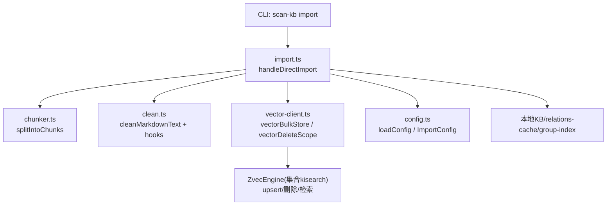
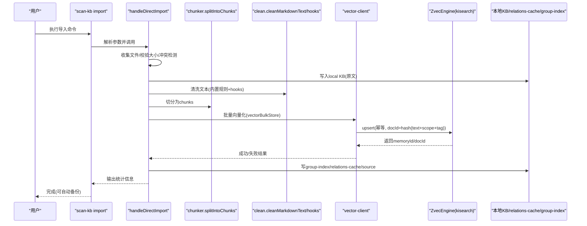
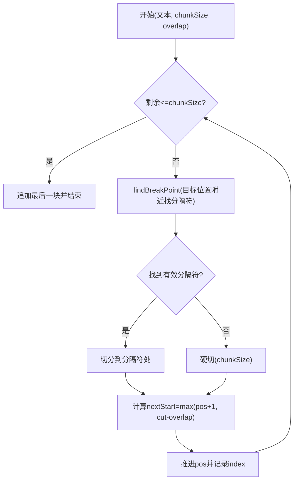
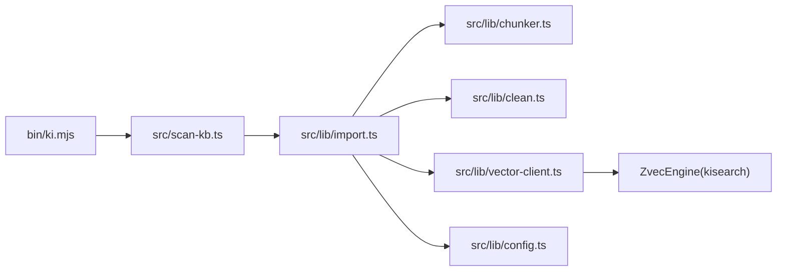

# 知识导入流程

<cite>
**本文引用的文件**
- [src/lib/import.ts](file://src/lib/import.ts)
- [src/lib/chunker.ts](file://src/lib/chunker.ts)
- [src/lib/clean.ts](file://src/lib/clean.ts)
- [src/scan-kb.ts](file://src/scan-kb.ts)
- [src/lib/vector-client.ts](file://src/lib/vector-client.ts)
- [src/lib/config.ts](file://src/lib/config.ts)
- [docs/build-kb.md](file://docs/build-kb.md)
- [docs/cli.md](file://docs/cli.md)
- [bin/ki.mjs](file://bin/ki.mjs)
- [test/chunker.test.ts](file://test/chunker.test.ts)
</cite>

## 目录
1. [简介](#简介)
2. [项目结构](#项目结构)
3. [核心组件](#核心组件)
4. [架构总览](#架构总览)
5. [详细组件分析](#详细组件分析)
6. [依赖关系分析](#依赖关系分析)
7. [性能考量](#性能考量)
8. [故障排查指南](#故障排查指南)
9. [结论](#结论)
10. [附录](#附录)

## 简介
本文件面向 knowledge-indexer 的“外部 Wiki 直接导入”能力，完整描述从文件扫描、格式解析、自动切分、数据清洗、向量化到索引构建的端到端流程。重点解释幂等追加机制（重复执行即增量）、chunk 切分算法与重叠策略、数据清洗规则与钩子、以及向量层 upsert 的幂等性。同时提供常用命令示例与配置选项说明，帮助开发者快速理解并正确使用知识库构建流程。

## 项目结构
本次文档聚焦以下关键模块：
- CLI 入口与参数解析：scan-kb import
- 直导主流程：handleDirectImport
- 切分器：splitIntoChunks
- 数据清洗：cleanMarkdownText + 外部 hooks
- 向量客户端：vectorBulkStore / vectorDeleteScope / ensureVectorAvailable
- 配置加载：loadConfig / getEmbeddingConfig / ImportConfig
- 文档与示例：build-kb.md、cli.md、bin/ki.mjs

图表来源
- [src/scan-kb.ts:35-77](file://src/scan-kb.ts#L35-L77)
- [src/lib/import.ts:214-559](file://src/lib/import.ts#L214-L559)
- [src/lib/chunker.ts:57-92](file://src/lib/chunker.ts#L57-L92)
- [src/lib/clean.ts:48-130](file://src/lib/clean.ts#L48-L130)
- [src/lib/vector-client.ts:547-590](file://src/lib/vector-client.ts#L547-L590)
- [src/lib/config.ts:148-175](file://src/lib/config.ts#L148-L175)

章节来源
- [src/scan-kb.ts:35-77](file://src/scan-kb.ts#L35-L77)
- [src/lib/import.ts:214-559](file://src/lib/import.ts#L214-L559)
- [docs/build-kb.md:95-161](file://docs/build-kb.md#L95-L161)
- [docs/cli.md:28-75](file://docs/cli.md#L28-L75)
- [bin/ki.mjs:75-113](file://bin/ki.mjs#L75-L113)

## 核心组件
- 统一导入入口：scan-kb import 子命令负责参数解析、调用 handleDirectImport，并在成功后触发自动备份。
- 直导主流程：handleDirectImport 实现“原文直导 + 自动切分 + 幂等追加”，包含文件收集、大小限制、relation 冲突检测、local KB 写入、清洗、切分、向量化、Group 树构建、relations-cache 写入、source 块记录等阶段。
- 切分器：splitIntoChunks 基于固定长度阈值与段落边界优先策略进行递归切分，支持 overlap 重叠保护上下文。
- 数据清洗：cleanMarkdownText 内置多类规则（BOM、frontmatter、HTML注释、Mermaid、代码块剥离、路径剥离、孤儿标题清理等），并支持外部清洗 hook 管道；失败时回滚 local KB。
- 向量客户端：封装 ZvecEngine，提供批量 upsert、按 scope 删除、可用性探测、docId 生成（含 tag 参与）等能力，保证幂等写入。
- 配置系统：加载 YAML/JSON 配置，解析 embedding、scope.import（extensions、maxFileSize）等，支持进程内缓存与默认值。

章节来源
- [src/scan-kb.ts:35-77](file://src/scan-kb.ts#L35-L77)
- [src/lib/import.ts:214-559](file://src/lib/import.ts#L214-L559)
- [src/lib/chunker.ts:57-92](file://src/lib/chunker.ts#L57-L92)
- [src/lib/clean.ts:48-130](file://src/lib/clean.ts#L48-L130)
- [src/lib/vector-client.ts:240-242](file://src/lib/vector-client.ts#L240-L242)
- [src/lib/vector-client.ts:547-590](file://src/lib/vector-client.ts#L547-L590)
- [src/lib/config.ts:148-175](file://src/lib/config.ts#L148-L175)

## 架构总览
下图展示一次完整的“外部 Wiki 直接导入”端到端时序：

图表来源
- [src/scan-kb.ts:35-77](file://src/scan-kb.ts#L35-L77)
- [src/lib/import.ts:214-559](file://src/lib/import.ts#L214-L559)
- [src/lib/chunker.ts:57-92](file://src/lib/chunker.ts#L57-L92)
- [src/lib/clean.ts:48-130](file://src/lib/clean.ts#L48-L130)
- [src/lib/vector-client.ts:547-590](file://src/lib/vector-client.ts#L547-L590)

## 详细组件分析

### 文件扫描与格式白名单
- 递归扫描 sourceDir 下的 Markdown 文件，默认仅接受 .md（可通过 scopes.<scope>.import.extensions 配置扩展）。
- 跳过隐藏目录与 node_modules；非白名单文件会被跳过并汇总提示。
- 单文件导入模式：当 sourceDir 指向单个 .md 文件时，仅处理该文件，且仍需命中 extensions 白名单。

章节来源
- [src/lib/import.ts:169-194](file://src/lib/import.ts#L169-L194)
- [src/lib/import.ts:270-283](file://src/lib/import.ts#L270-L283)
- [src/lib/config.ts:86-90](file://src/lib/config.ts#L86-L90)

### 自动切分与重叠策略
- 切分触发条件为字符长度阈值（默认 1000），与段落数无关；份数 ≈ ceil(字符数 / chunkSize)。
- 切分点偏好：\n\n > \n > 。 > ； > 硬切；在目标位置附近向后搜索窗口内寻找最佳分隔符。
- 重叠策略：相邻 chunk 尾部保留 overlap 字符（默认 150），确保跨 chunk 上下文不丢失；推进逻辑保证 nextStart = max(pos+1, cut-overlap)，避免死循环。
- 单文件 chunk 上限：MAX_CHUNKS_PER_FILE = 500，超限则跳过该文件并回滚 local KB。

图表来源
- [src/lib/chunker.ts:35-51](file://src/lib/chunker.ts#L35-L51)
- [src/lib/chunker.ts:57-92](file://src/lib/chunker.ts#L57-L92)
- [test/chunker.test.ts:39-80](file://test/chunker.test.ts#L39-L80)

章节来源
- [src/lib/chunker.ts:57-92](file://src/lib/chunker.ts#L57-L92)
- [test/chunker.test.ts:17-99](file://test/chunker.test.ts#L17-L99)

### 数据清洗与外部 Hook
- 内置规则：BOM 剥离、控制字符/NFC 规范化、frontmatter 整块删除、HTML 注释、Mermaid 块、代码块剥离（短示例保留 ≤15 行）、路径剥离（file://、markdown 链接、行号引用、裸代码路径、空 inline code、孤儿标题清理）、折叠多余空行。
- 外部 Hook：顺序执行 sh -c 命令，stdin→stdout 管道，超时保护（默认 10s），失败跳过并记录 failedHooks；全部失败则视为清洗失败，回滚已写的 local KB 并将文件计入 skipped。
- 清洗版本：CLEAN_VERSION 用于后续一致性检查（防增量/全量不一致）。

章节来源
- [src/lib/clean.ts:48-130](file://src/lib/clean.ts#L48-L130)
- [src/lib/clean.ts:155-228](file://src/lib/clean.ts#L155-L228)
- [src/lib/import.ts:336-357](file://src/lib/import.ts#L336-L357)

### 幂等追加机制与增量更新
- 幂等语义：同 sourcePath 重导 → 覆盖更新；同名不同 sourcePath → 跳过；新文件 → 正常导入。因此重复执行同一命令即同步变更（新增/更新/删除由上层 diff 或手动操作驱动）。
- 向量层幂等：docId = sha256(text + scope + tag) 截 32，相同 text/scope/tag 产生相同 docId，upsert 天然幂等。
- 覆盖导入：若 scope 已有向量数据，导入前会先删除旧向量再重建，避免孤儿向量残留。
- 增量更新：通过幂等追加承载；对修改过的文件重新切分并向量化，删除的文件不再出现；无需 git commit 依赖（commit 字段改为可选）。

章节来源
- [src/lib/import.ts:319-332](file://src/lib/import.ts#L319-L332)
- [src/lib/vector-client.ts:240-242](file://src/lib/vector-client.ts#L240-L242)
- [src/lib/import.ts:423-433](file://src/lib/import.ts#L423-L433)
- [AGENTS.md:59-74](file://AGENTS.md#L59-L74)

### 向量化与索引构建
- 批量向量化：将每个 chunk 作为一条文本，调用 vectorBulkStore 批量 upsert；同时为每个 chunk 写入 ki-relation 向量，为每个 group 写入 ki-path 向量。
- Group 树构建：根据 groupPath 自动创建/确认 Group 节点，并记录涉及的 Group 集合。
- relations-cache 写入：文件级 relation 聚合（同 group 下相同 relation 名合并），持久化 memoryIds（多值）与 sourcePath；自定义标签向量成功后回填至 relation.tags/memoryIds。
- source 块记录：记录 dir、chunkSize、chunkOverlap 等切分参数，供后续一致性与增量使用。

章节来源
- [src/lib/import.ts:389-444](file://src/lib/import.ts#L389-L444)
- [src/lib/import.ts:482-523](file://src/lib/import.ts#L482-L523)
- [src/lib/import.ts:526-534](file://src/lib/import.ts#L526-L534)
- [src/lib/vector-client.ts:547-590](file://src/lib/vector-client.ts#L547-L590)

### 中断防护与自愈
- 导入锁：同 scope 并发导入互斥，防止竞争；SIGINT/SIGTERM 捕获后写中断标记并清锁，便于恢复。
- 向量库撞锁重试：probe/open 检测到 locked 时等待并重试，避免共享向量库时的瞬时冲突。
- 空闲释放锁：常驻 MCP 场景启用空闲超时释放锁，CLI 每调用结束关闭引擎，避免长期占用。

章节来源
- [src/lib/import.ts:236-260](file://src/lib/import.ts#L236-L260)
- [src/lib/vector-client.ts:88-104](file://src/lib/vector-client.ts#L88-L104)
- [src/lib/vector-client.ts:146-181](file://src/lib/vector-client.ts#L146-L181)
- [src/lib/vector-client.ts:314-365](file://src/lib/vector-client.ts#L314-L365)

## 依赖关系分析
- CLI 层：bin/ki.mjs 暴露命令；scan-kb.ts 定义 import 子命令与参数。
- 业务层：import.ts 协调文件扫描、清洗、切分、向量化、索引写入。
- 工具层：chunker.ts 提供切分；clean.ts 提供清洗与 hooks；vector-client.ts 封装 ZvecEngine。
- 配置层：config.ts 提供配置加载与默认值，影响 extensions、maxFileSize、embedding 等。

图表来源
- [bin/ki.mjs:75-113](file://bin/ki.mjs#L75-L113)
- [src/scan-kb.ts:35-77](file://src/scan-kb.ts#L35-L77)
- [src/lib/import.ts:214-559](file://src/lib/import.ts#L214-L559)
- [src/lib/chunker.ts:57-92](file://src/lib/chunker.ts#L57-L92)
- [src/lib/clean.ts:48-130](file://src/lib/clean.ts#L48-L130)
- [src/lib/vector-client.ts:547-590](file://src/lib/vector-client.ts#L547-L590)
- [src/lib/config.ts:148-175](file://src/lib/config.ts#L148-L175)

章节来源
- [bin/ki.mjs:75-113](file://bin/ki.mjs#L75-L113)
- [src/scan-kb.ts:35-77](file://src/scan-kb.ts#L35-L77)
- [src/lib/import.ts:214-559](file://src/lib/import.ts#L214-L559)

## 性能考量
- 切分效率：内存中递归切分，无落盘开销；段落边界优先减少碎片。
- 批量向量化：vectorBulkStore 批量 upsert，减少网络往返；超时动态计算（基础 60s + 条目×10s）。
- 覆盖导入优化：先删除旧向量再重建，避免孤儿向量导致的查询噪声。
- 并发与锁：导入锁避免同 scope 并发；向量库撞锁重试与空闲释放锁提升共享场景稳定性。
- 大文件防护：文件大小上限与 chunk 数量上限双重保护，防止单文件导致资源爆炸。

[本节为通用性能讨论，不直接分析具体文件]

## 故障排查指南
- 向量库被占用：提示包含锁定原因与恢复步骤（停止常驻服务、等待锁释放、rebuild-vector/restore 重建）。
- 导入中断：SIGINT/SIGTERM 会写中断标记并清锁；恢复时可重新导入或执行 rebuild-vector。
- 清洗失败：所有 hooks 失败则回滚 local KB 并跳过该文件；检查 hook 命令与超时。
- 切分超限：超过 MAX_CHUNKS_PER_FILE 会跳过并提示增大 chunk-size 或手动拆分。
- 配置问题：embedding.apiKey 缺失会 fail-loud；YAML/JSON 配置读取失败会报错。

章节来源
- [src/lib/vector-client.ts:71-86](file://src/lib/vector-client.ts#L71-L86)
- [src/lib/vector-client.ts:420-467](file://src/lib/vector-client.ts#L420-L467)
- [src/lib/import.ts:236-260](file://src/lib/import.ts#L236-L260)
- [src/lib/clean.ts:177-228](file://src/lib/clean.ts#L177-L228)
- [src/lib/chunker.ts:25-26](file://src/lib/chunker.ts#L25-L26)
- [src/lib/config.ts:247-266](file://src/lib/config.ts#L247-L266)

## 结论
knowledge-indexer 的外部 Wiki 直接导入以“幂等追加”为核心设计，结合稳健的切分与清洗机制、向量层的 upsert 幂等性，实现了稳定可靠的增量更新体验。通过 CLI 简化参数与自动化流程，开发者可以便捷地完成从源文件到可检索知识库的构建。建议在生产环境中合理配置 chunk-size/overlap、文件大小上限与清洗规则，并结合备份/恢复策略保障数据安全。

[本节为总结性内容，不直接分析具体文件]

## 附录

### 常用导入命令示例
- 首次导入（自动切分、向量化）：
  - ki scan-kb import --scope my-project --source /path/to/wiki --group wiki
- 非向量化模式（仅写 KB 层）：
  - ki scan-kb import --scope my-project --source /path/to/wiki --group wiki --no-vector
- 自定义切分参数：
  - ki scan-kb import --scope my-project --source /path/to/wiki --group wiki --chunk-size 1200 --chunk-overlap 200
- 关闭清洗或覆盖内置规则：
  - ki scan-kb import --scope my-project --source /path/to/wiki --group wiki --no-clean
  - ki scan-kb import --scope my-project --source /path/to/wiki --group wiki --clean-rules bom,frontmatter,codeBlock

章节来源
- [docs/cli.md:28-75](file://docs/cli.md#L28-L75)
- [docs/build-kb.md:111-161](file://docs/build-kb.md#L111-L161)
- [bin/ki.mjs:75-113](file://bin/ki.mjs#L75-L113)

### 配置选项说明
- scopes.<scope>.import.extensions：导入格式白名单（默认 [.md]）
- scopes.<scope>.import.maxFileSize：单文件大小上限（字节，默认 1MB）
- embedding.provider/baseURL/model/dimension/apiKey：向量嵌入配置
- clean.enabled/rules/hooks：数据清洗总开关、内置规则覆盖、外部清洗钩子

章节来源
- [src/lib/config.ts:86-90](file://src/lib/config.ts#L86-L90)
- [src/lib/config.ts:110-137](file://src/lib/config.ts#L110-L137)
- [src/lib/config.ts:148-175](file://src/lib/config.ts#L148-L175)