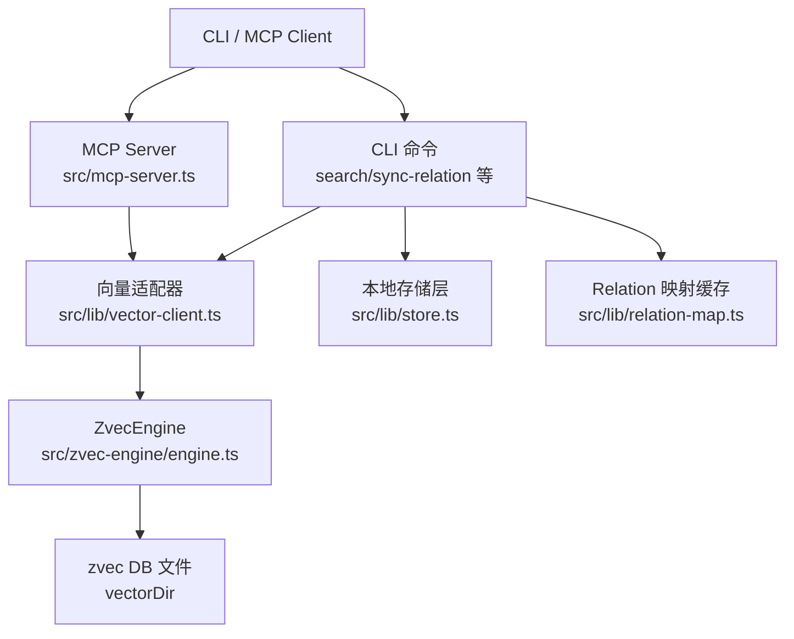
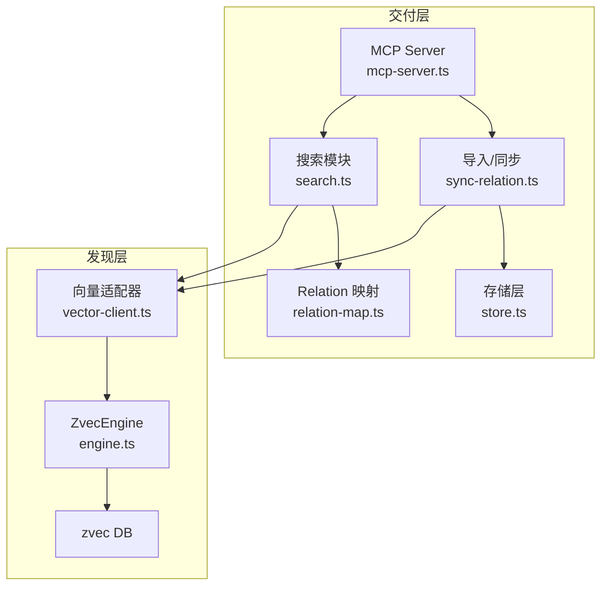
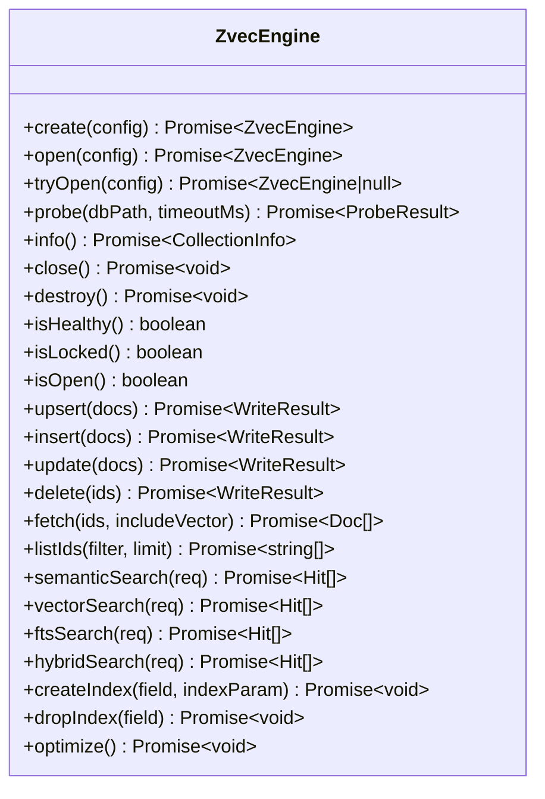
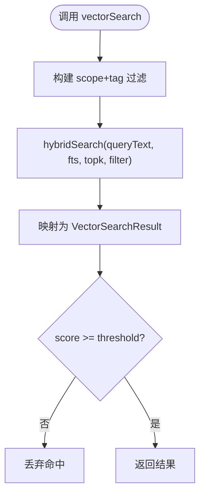
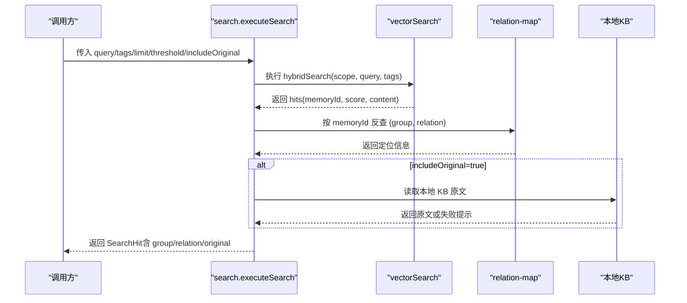
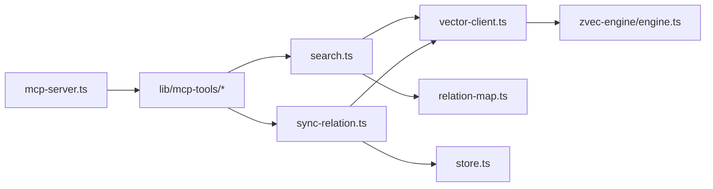
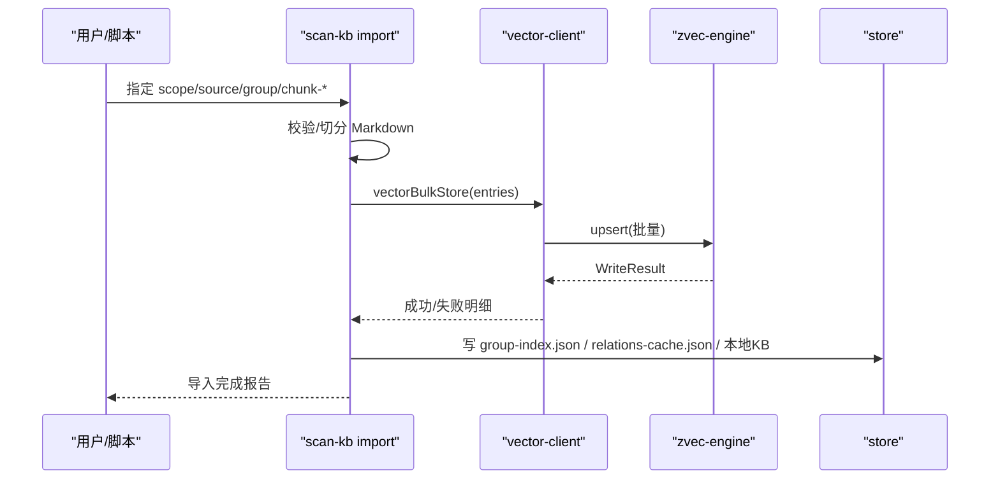
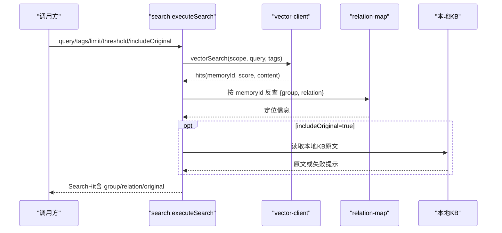

# 架构总览

<cite>
**本文引用的文件**
- [README.md](file://README.md)
- [package.json](file://package.json)
- [src/config.ts](file://src/config.ts)
- [src/search.ts](file://src/search.ts)
- [src/mcp-server.ts](file://src/mcp-server.ts)
- [src/zvec-engine/engine.ts](file://src/zvec-engine/engine.ts)
- [src/lib/vector-client.ts](file://src/lib/vector-client.ts)
- [src/lib/relation-map.ts](file://src/lib/relation-map.ts)
- [src/lib/store.ts](file://src/lib/store.ts)
- [src/sync-relation.ts](file://src/sync-relation.ts)
- [src/lib/mcp-tools/search.ts](file://src/lib/mcp-tools/search.ts)
- [src/lib/mcp-tools/sync-relation.ts](file://src/lib/mcp-tools/sync-relation.ts)
- [docs/architecture.md](file://docs/architecture.md)
</cite>

## 目录
1. [简介](#简介)
2. [项目结构](#项目结构)
3. [核心组件](#核心组件)
4. [架构总览](#架构总览)
5. [详细组件分析](#详细组件分析)
6. [依赖关系分析](#依赖关系分析)
7. [性能与扩展性](#性能与扩展性)
8. [故障排查指南](#故障排查指南)
9. [结论](#结论)
10. [附录：关键数据流时序图](#附录关键数据流时序图)

## 简介
本仓库为 AI Agent 提供“结构化知识索引 + 向量语义检索”的能力，通过 MCP 协议对外暴露工具（同时支持 CLI）。系统采用分层设计：
- 发现层（zvec 向量引擎）：负责语义召回、BM25 全文、RRF 融合排序与长期持久化。
- 交付层（kisearch）：负责 Group 树导航、Relation 热缓存、原文全文交付与 MCP/CLI 服务编排。

该文档面向开发者，帮助快速理解整体架构、数据流向、扩展点与集成方式，并给出架构图与关键设计决策说明。

**章节来源**
- [README.md:35-46](file://README.md#L35-L46)

## 项目结构
- 入口与命令
  - bin/ki.mjs：CLI 入口（由 package.json 的 bin 字段声明）。
  - src/mcp-server.ts：MCP Server 启动与工具注册、HTTP/stdio 模式、鉴权与守护进程管理。
- 发现层（zvec 引擎）
  - src/zvec-engine/engine.ts：ZvecEngine 门面，封装创建/打开/写入/检索/生命周期；内部通过 proxy 与 worker 通信。
  - src/lib/vector-client.ts：向量适配器（S-03），统一 collection、scope/tag 隔离、hybridSearch、批量存储、可用性检测与空闲释放锁。
- 交付层（kisearch）
  - src/search.ts：语义检索主流程，按 memoryId 反查 relations-cache 定位 group/relation，可选返回本地 KB 原文。
  - src/sync-relation.ts：Relation 同步与批量写入，维护 Group 树、relations-cache、本地 KB，并批量向量化。
  - src/lib/store.ts：JSON 存储层（WAL 写入）、group-index/relations-cache 初始化与迁移。
  - src/lib/relation-map.ts：memoryId → {group, relation} 的反查映射（带 TTL 缓存）。
  - src/lib/config.ts：配置加载、默认路径、embedding/vectorDir/scopeMode/MCP HTTP 默认值等。
  - src/lib/mcp-tools/*：MCP 工具注册（search、sync-relation 等）。
- 文档与示例
  - docs/architecture.md：架构说明与流程图。
  - README.md：快速开始、特性、MCP 集成、导入流程等。

**图表来源**
- [src/mcp-server.ts:49-71](file://src/mcp-server.ts#L49-L71)
- [src/lib/vector-client.ts:120-127](file://src/lib/vector-client.ts#L120-L127)
- [src/zvec-engine/engine.ts:68-93](file://src/zvec-engine/engine.ts#L68-L93)
- [src/lib/store.ts:19-62](file://src/lib/store.ts#L19-L62)
- [src/lib/relation-map.ts:48-77](file://src/lib/relation-map.ts#L48-L77)

**章节来源**
- [package.json:1-68](file://package.json#L1-L68)
- [docs/architecture.md:11-35](file://docs/architecture.md#L11-L35)

## 核心组件
- ZvecEngine（发现层）
  - 职责：创建/打开集合、写入（upsert/insert/update/delete）、检索（semantic/vector/fts/hybrid）、索引管理、健康探测。
  - 关键点：批处理嵌入、维度校验、白名单字段、worker 线程安全、probe 超时与损坏恢复。
- Vector Adapter（向量适配器）
  - 职责：单 collection 多 scope/tag 隔离、hybridSearch、批量存储、可用性检测、撞锁重试与空闲释放锁。
  - 关键点：doc id = sha256(text+scope+tag)，content 兼作 FTS，TTL/并发保护。
- 搜索模块（交付层）
  - 职责：执行 hybridSearch，按 memoryId 反查 relations-cache 附加 group/relation，可选返回本地 KB 原文，多 tag 去重与优先级。
- 存储层（交付层）
  - 职责：group-index.json、relations-cache.json、本地 KB index.json 的 WAL 写入、版本兼容、模板初始化与迁移。
- MCP 服务
  - 职责：注册 11 个工具（query_group、get_module_info、sync_relation、bulk_sync_relation、manage_index、search、store、bulk_store、delete_relation、scope_list、tag_list），支持 stdio/HTTP、Token 鉴权、守护进程与状态查询。

**章节来源**
- [src/zvec-engine/engine.ts:68-509](file://src/zvec-engine/engine.ts#L68-L509)
- [src/lib/vector-client.ts:120-754](file://src/lib/vector-client.ts#L120-L754)
- [src/search.ts:20-200](file://src/search.ts#L20-L200)
- [src/lib/store.ts:19-267](file://src/lib/store.ts#L19-L267)
- [src/mcp-server.ts:49-71](file://src/mcp-server.ts#L49-L71)

## 架构总览
系统分为两层：
- 发现层（zvec 向量引擎）：提供混合检索能力（语义 + BM25 + RRF），持久化到 zvec DB。
- 交付层（kisearch）：组织 Group 树与 Relation 缓存，提供原文交付与 MCP/CLI 工具。

**图表来源**
- [src/mcp-server.ts:49-71](file://src/mcp-server.ts#L49-L71)
- [src/search.ts:70-200](file://src/search.ts#L70-L200)
- [src/sync-relation.ts:407-787](file://src/sync-relation.ts#L407-L787)
- [src/lib/vector-client.ts:477-506](file://src/lib/vector-client.ts#L477-L506)
- [src/zvec-engine/engine.ts:296-312](file://src/zvec-engine/engine.ts#L296-L312)

**章节来源**
- [docs/architecture.md:11-35](file://docs/architecture.md#L11-L35)
- [README.md:35-46](file://README.md#L35-L46)

## 详细组件分析

### 向量引擎（ZvecEngine）
- 工厂与生命周期
  - create/open/probe：创建或打开集合，probe 支持超时与损坏判定。
  - close/destroy/isHealthy/isLocked/isOpen：资源管理与健康检查。
- 写入
  - upsert/insert/update/delete：按是否需 embed 切分，批内去重，失败粒度控制，维度与字段白名单校验。
- 检索
  - semanticSearch/vectorSearch/ftsSearch/hybridSearch：路由到具体实现，必要时 embed，注入 filterSql，归一化为 Hit。
- 索引
  - createIndex/dropIndex/optimize：索引生命周期管理。

**图表来源**
- [src/zvec-engine/engine.ts:95-326](file://src/zvec-engine/engine.ts#L95-L326)

**章节来源**
- [src/zvec-engine/engine.ts:68-509](file://src/zvec-engine/engine.ts#L68-L509)

### 向量适配器（vector-client）
- 单例与并发
  - getEngine/closeEngine：进程内唯一 engine 实例，串行化 probe/create/open，避免原生竞态阻塞。
  - enableIdleClose：常驻模式下空闲超时自动释放锁，错开共享向量库。
- 检索与存储
  - vectorSearch：hybridSearch（queryText + fts + RRF），按 scope/tag 过滤，阈值过滤。
  - vectorStore/vectorBulkStore：幂等 upsert，doc id 含 scope+tag，content 兼 FTS。
  - ensureVectorAvailable：可用性检测（LOCKED/CORRUPTED/PROBE_ERROR），中断引导提示。
- 管理面
  - vectorListDocs/vectorFetchDocs/vectorListScopes/vectorListTags/vectorCountScope/vectorDeleteScope：扫描、统计、删除。

**图表来源**
- [src/lib/vector-client.ts:477-506](file://src/lib/vector-client.ts#L477-L506)

**章节来源**
- [src/lib/vector-client.ts:120-754](file://src/lib/vector-client.ts#L120-L754)

### 搜索模块（search）
- 标签优先级与多 tag 搜索
  - 默认搜全部时按 ki-search > ki-relation > ki-path 优先级合并；显式 tags 则 OR 组合。
- 原文召回
  - 通过 memoryId 反查 relations-cache 获取 group/relation，再读取本地 KB 原文；失败降级为向量 content 并提示。
- 去重
  - 同一 (group, relation) 多 tag 重复命中保留最高 score；同一文件多 chunk 命中仅首次返回原文。

**图表来源**
- [src/search.ts:70-200](file://src/search.ts#L70-L200)
- [src/lib/relation-map.ts:48-77](file://src/lib/relation-map.ts#L48-L77)
- [src/lib/vector-client.ts:477-506](file://src/lib/vector-client.ts#L477-L506)

**章节来源**
- [src/search.ts:20-200](file://src/search.ts#L20-L200)
- [src/lib/relation-map.ts:1-120](file://src/lib/relation-map.ts#L1-L120)

### 存储层（store）
- JSON 读写
  - readJson/writeJson：版本检查、WAL 写入、updatedAt 时间戳。
- Scope 初始化与迁移
  - ensureScopeDir/initScope：从 _template 初始化新 scope，strict 模式白名单校验。
  - readGroupIndex：自动迁移旧格式（roots→groups），relations-cache key 前缀迁移。

**章节来源**
- [src/lib/store.ts:19-267](file://src/lib/store.ts#L19-L267)

### MCP 服务（mcp-server）
- 工具注册
  - buildKiMcpServer：注册 11 个工具（query_group、get_module_info、sync_relation、bulk_sync_relation、manage_index、search、store、bulk_store、delete_relation、scope_list、tag_list）。
- 运行模式
  - stdio：单客户端单进程；HTTP：共享单例、Token 鉴权、守护进程、状态查询、重启。
- 启动守卫
  - 预检（health check）、冲突检测（stdio vs HTTP）、空闲释放锁、版本守卫。

**章节来源**
- [src/mcp-server.ts:49-71](file://src/mcp-server.ts#L49-L71)
- [src/mcp-server.ts:492-734](file://src/mcp-server.ts#L492-L734)

### 导入与同步（sync-relation）
- 批量同步
  - executeBulkSyncRelation：阶段化流程（改 cache + 收集 entries → 批量 embed/upsert → 拆分结果回写 memoryId/memoryIds → 落盘 cache → wiki 写回）。
  - 去重与容错：同批重复覆盖、部分失败保留旧向量、聚合删除 stale 向量。
- 非向量化模式
  - vector=false 时仅写 KB 层，不产生 memoryId。

**章节来源**
- [src/sync-relation.ts:407-787](file://src/sync-relation.ts#L407-L787)

## 依赖关系分析
- 组件耦合
  - MCP Server 依赖 vector-client 与 search/sync-relation 工具；search 依赖 vector-client 与 relation-map；sync-relation 依赖 store 与 vector-client。
- 外部依赖
  - @zvec/zvec：底层 Rust 向量引擎（通过 dist/zvec-engine 加载）。
  - @modelcontextprotocol/sdk：MCP 协议实现。
  - commander/yaml/zod：CLI 参数解析、YAML 配置、工具参数校验。

**图表来源**
- [src/mcp-server.ts:49-71](file://src/mcp-server.ts#L49-L71)
- [src/lib/mcp-tools/search.ts:1-50](file://src/lib/mcp-tools/search.ts#L1-L50)
- [src/lib/mcp-tools/sync-relation.ts:1-44](file://src/lib/mcp-tools/sync-relation.ts#L1-L44)
- [src/search.ts:70-200](file://src/search.ts#L70-L200)
- [src/sync-relation.ts:407-787](file://src/sync-relation.ts#L407-L787)
- [src/lib/vector-client.ts:120-754](file://src/lib/vector-client.ts#L120-L754)
- [src/zvec-engine/engine.ts:68-509](file://src/zvec-engine/engine.ts#L68-L509)

**章节来源**
- [package.json:42-49](file://package.json#L42-L49)

## 性能与扩展性
- 性能要点
  - 批量嵌入与写入：一次 embedding HTTP + 一次 worker upsert，减少网络与序列化开销。
  - 撞锁重试与空闲释放锁：多实例共享向量库，错开使用互不影响。
  - 多 tag 去重与优先级：减少冗余命中，提升召回质量。
- 扩展点
  - Embedding Provider：可替换为任意 OpenAI 兼容提供商（baseURL/model/dimension）。
  - Tag 体系：ki-search/ki-relation/ki-path 三层标签，支持自定义 tag。
  - Scope 隔离：default/strict 模式，严格白名单控制访问。
  - MCP 工具：可按需新增工具，复用现有 server 构建与传输通道。

**章节来源**
- [src/lib/vector-client.ts:120-181](file://src/lib/vector-client.ts#L120-L181)
- [src/lib/vector-client.ts:247-266](file://src/lib/vector-client.ts#L247-L266)
- [src/lib/config.ts:110-137](file://src/lib/config.ts#L110-L137)
- [src/lib/config.ts:444-459](file://src/lib/config.ts#L444-L459)

## 故障排查指南
- 向量库被占用或损坏
  - 现象：ensureVectorAvailable 返回 LOCKED/CORRUPTED。
  - 处置：停止占用进程、等待空闲释放、执行 rebuild-vector 或 restore 重建。
- 原文不可用
  - 现象：search 返回 originalHint 提示本地 KB 缺失或无法定位。
  - 处置：执行 sync-relation 或 rebuild-vector 恢复。
- MCP 启动失败
  - 现象：健康检查失败（缺 API Key、维度不匹配）。
  - 处置：执行 ki doctor 修复配置，或重新生成 Token。

**章节来源**
- [src/lib/vector-client.ts:420-467](file://src/lib/vector-client.ts#L420-L467)
- [src/search.ts:54-68](file://src/search.ts#L54-L68)
- [src/mcp-server.ts:660-678](file://src/mcp-server.ts#L660-L678)

## 结论
knowledge-indexer 以“发现层 + 交付层”的分层架构，将 zvec 向量引擎的混合检索能力与 kisearch 的结构化索引、原文交付有机结合。通过 MCP 暴露工具，Agent 既能精准定位原文，又能语义兜底召回。系统在批量写入、撞锁共享、标签优先级等方面做了工程化优化，具备良好扩展性与可维护性。

## 附录：关键数据流时序图

### 知识导入（scan-kb import）

**图表来源**
- [src/sync-relation.ts:407-787](file://src/sync-relation.ts#L407-L787)
- [src/lib/vector-client.ts:547-590](file://src/lib/vector-client.ts#L547-L590)
- [src/lib/store.ts:19-62](file://src/lib/store.ts#L19-L62)

### 检索返回（ki search）

**图表来源**
- [src/search.ts:70-200](file://src/search.ts#L70-L200)
- [src/lib/vector-client.ts:477-506](file://src/lib/vector-client.ts#L477-L506)
- [src/lib/relation-map.ts:48-77](file://src/lib/relation-map.ts#L48-L77)