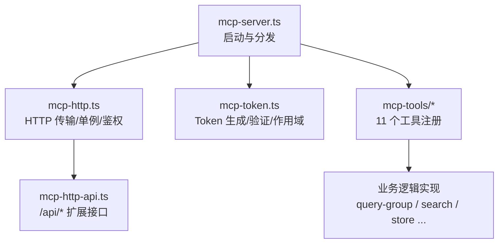
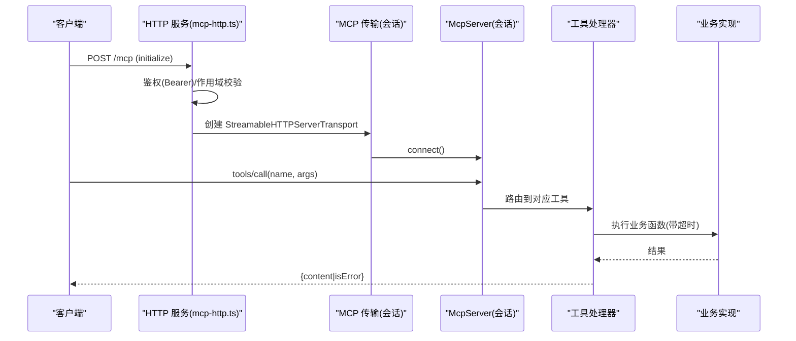
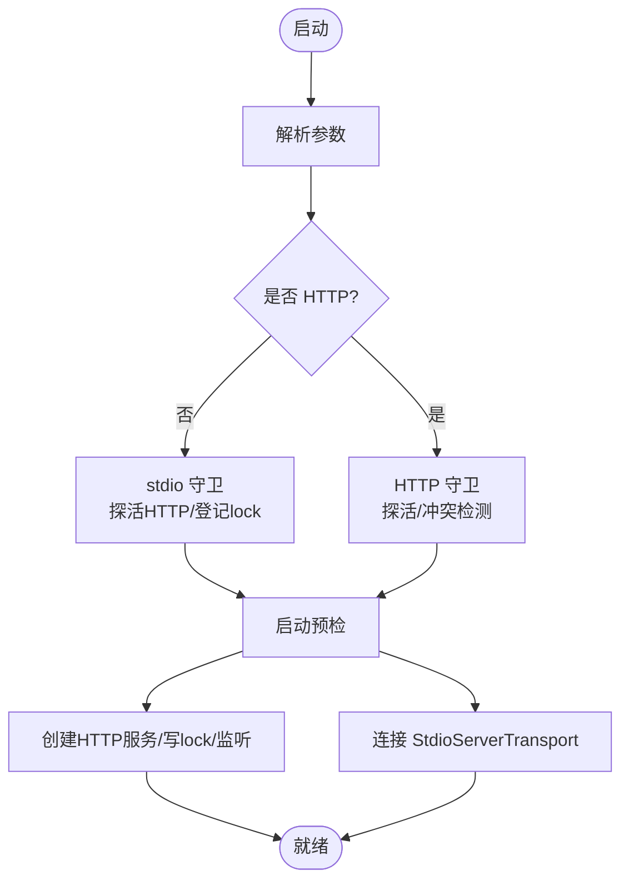
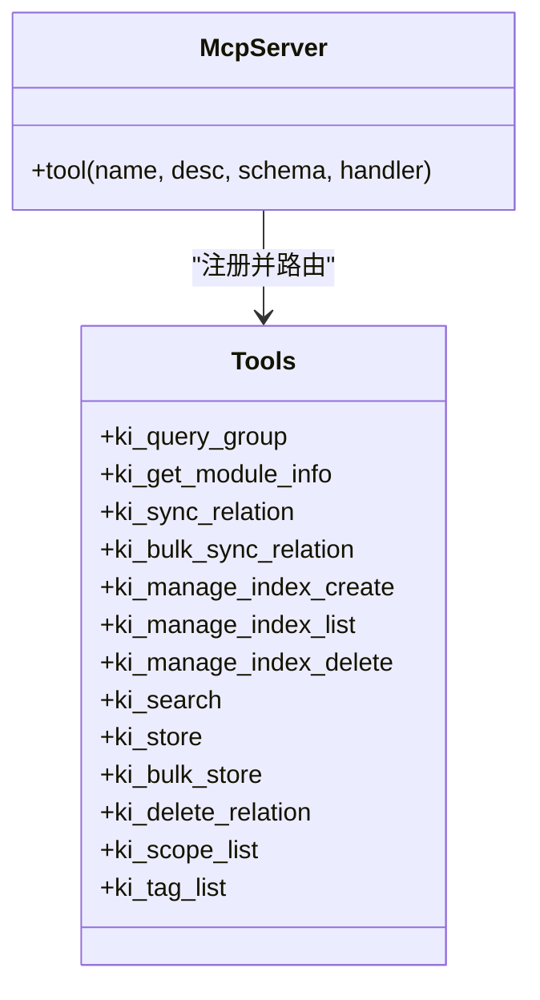
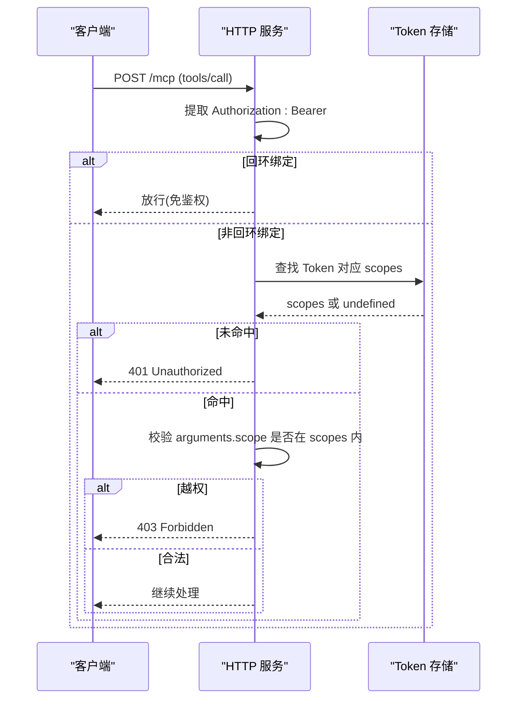
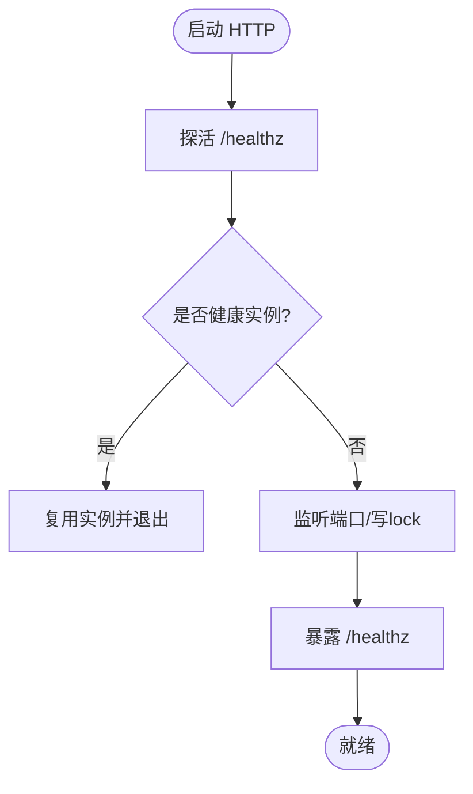
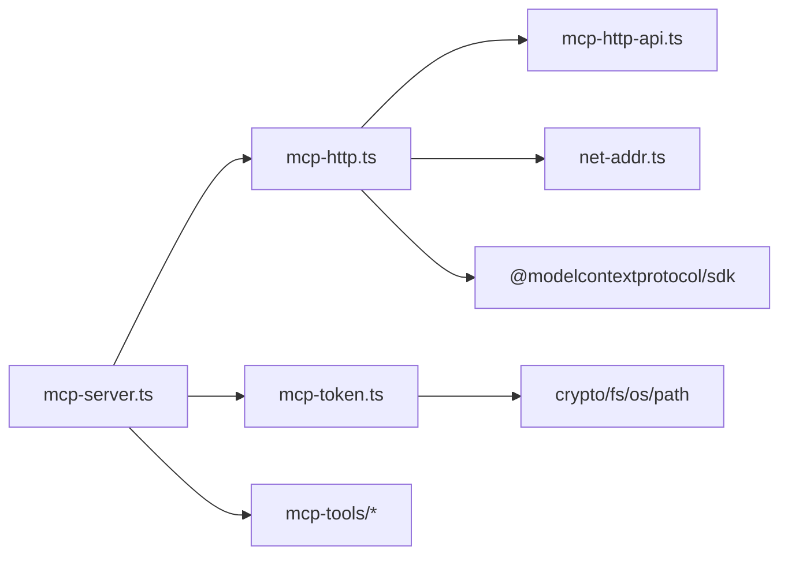

# MCP服务器组件

<cite>
**本文引用的文件**
- [src/mcp-server.ts](file://src/mcp-server.ts)
- [src/lib/mcp-http.ts](file://src/lib/mcp-http.ts)
- [src/lib/mcp-token.ts](file://src/lib/mcp-token.ts)
- [src/lib/mcp-http-api.ts](file://src/lib/mcp-http-api.ts)
- [src/lib/mcp-tools/query-group.ts](file://src/lib/mcp-tools/query-group.ts)
- [src/lib/mcp-tools/get-module-info.ts](file://src/lib/mcp-tools/get-module-info.ts)
- [src/lib/mcp-tools/sync-relation.ts](file://src/lib/mcp-tools/sync-relation.ts)
- [src/lib/mcp-tools/manage-index.ts](file://src/lib/mcp-tools/manage-index.ts)
- [src/lib/mcp-tools/search.ts](file://src/lib/mcp-tools/search.ts)
- [src/lib/mcp-tools/store.ts](file://src/lib/mcp-tools/store.ts)
- [src/lib/mcp-tools/bulk-store.ts](file://src/lib/mcp-tools/bulk-store.ts)
- [src/lib/mcp-tools/delete-relation.ts](file://src/lib/mcp-tools/delete-relation.ts)
- [src/lib/mcp-tools/scope-list.ts](file://src/lib/mcp-tools/scope-list.ts)
- [src/lib/mcp-tools/tag-list.ts](file://src/lib/mcp-tools/tag-list.ts)
- [docs/cli.md](file://docs/cli.md)
</cite>

## 目录
1. [简介](#简介)
2. [项目结构](#项目结构)
3. [核心组件](#核心组件)
4. [架构总览](#架构总览)
5. [详细组件分析](#详细组件分析)
6. [依赖关系分析](#依赖关系分析)
7. [性能考量](#性能考量)
8. [故障排查指南](#故障排查指南)
9. [结论](#结论)
10. [附录：配置与使用示例](#附录配置与使用示例)

## 简介
本组件为知识索引器（ki）提供 MCP（Model Context Protocol）服务能力，支持两种运行模式：
- stdio 模式：单客户端、单进程，通过标准输入输出进行 JSON-RPC 通信，适合 IDE 或 Agent 直接调用。
- HTTP 模式：基于 Streamable HTTP 的共享单例服务，多 IDE/Agent 可复用同一进程访问向量库，避免锁冲突；默认回环绑定免鉴权，非回环绑定强制 Bearer Token 鉴权。

此外，组件内置 Token 鉴权系统（多 Token + scope 授权）、守护进程管理、端口复用与健康检查等能力，并提供 11 个核心工具的统一注册与生命周期管理。

## 项目结构
MCP 服务器由入口启动器、HTTP 传输层、Token 鉴权模块、扩展 API 路由以及工具注册模块组成。整体组织方式以“职责分层 + 功能内聚”为主：
- 启动与分发：src/mcp-server.ts
- HTTP 传输与单例守护：src/lib/mcp-http.ts
- Token 存储与 RBAC：src/lib/mcp-token.ts
- 扩展 API（导入/健康/文档列表等）：src/lib/mcp-http-api.ts
- 工具注册（11 个核心工具）：src/lib/mcp-tools/*

图表来源
- [src/mcp-server.ts:49-71](file://src/mcp-server.ts#L49-L71)
- [src/lib/mcp-http.ts:344-499](file://src/lib/mcp-http.ts#L344-L499)
- [src/lib/mcp-token.ts:20-50](file://src/lib/mcp-token.ts#L20-L50)
- [src/lib/mcp-http-api.ts:216-272](file://src/lib/mcp-http-api.ts#L216-L272)

章节来源
- [src/mcp-server.ts:49-71](file://src/mcp-server.ts#L49-L71)
- [src/lib/mcp-http.ts:344-499](file://src/lib/mcp-http.ts#L344-L499)
- [src/lib/mcp-token.ts:20-50](file://src/lib/mcp-token.ts#L20-L50)
- [src/lib/mcp-http-api.ts:216-272](file://src/lib/mcp-http-api.ts#L216-L272)

## 核心组件
- 启动器（mcp-server.ts）
  - 解析 CLI 参数，区分 stdio/HTTP 模式，执行守卫（预检、实例冲突检测），构建并连接传输。
  - 提供 token 子命令（generate/list/update/delete）、restart、stop、--status 等运维能力。
- HTTP 传输与守护（mcp-http.ts）
  - 基于 Node http 与 SDK 的 StreamableHTTPServerTransport 实现 MCP over HTTP。
  - 会话级 McpServer 工厂、空闲回收、最大会话数限制、DNS rebinding 保护、静态页面服务。
  - 健康检查 /healthz、错误描述、单例 lock 文件管理。
- Token 鉴权（mcp-token.ts）
  - 多 Token 存储（~/.ki/mcp-tokens.json），原子写、损坏保护、常量时间比较。
  - scope 授权集合（all 或具体列表），RBAC 校验函数。
- 扩展 API（mcp-http-api.ts）
  - /api/health、/api/tags、/api/doc/list、/api/import/* 等，复用鉴权与作用域控制。
- 工具注册（mcp-tools/*）
  - 统一 Zod schema + withTimeout 包装 + 业务函数调用，返回结构化结果。

章节来源
- [src/mcp-server.ts:49-71](file://src/mcp-server.ts#L49-L71)
- [src/lib/mcp-http.ts:344-499](file://src/lib/mcp-http.ts#L344-L499)
- [src/lib/mcp-token.ts:20-50](file://src/lib/mcp-token.ts#L20-L50)
- [src/lib/mcp-http-api.ts:216-272](file://src/lib/mcp-http-api.ts#L216-L272)

## 架构总览
下图展示从请求到工具执行的端到端流程，涵盖鉴权、作用域校验、会话管理与工具调用。

图表来源
- [src/lib/mcp-http.ts:454-577](file://src/lib/mcp-http.ts#L454-L577)
- [src/mcp-server.ts:49-71](file://src/mcp-server.ts#L49-L71)

章节来源
- [src/lib/mcp-http.ts:454-577](file://src/lib/mcp-http.ts#L454-L577)
- [src/mcp-server.ts:49-71](file://src/mcp-server.ts#L49-L71)

## 详细组件分析

### 启动流程与两种运行模式
- 参数解析与分发
  - 支持 --http、--host、--port、--token、--allowed-hosts、--web、--daemon、--status、stop、restart、token 子命令。
  - 非 HTTP 模式下禁止 --daemon（stdio 无法后台）。
- 守卫与预检
  - HTTP 模式：探活已有健康实例则复用退出；检测 stdio 实例冲突（避免向量库锁争用）。
  - stdio 模式：若存在健康 HTTP 单例则拒绝启动，引导迁移 URL 接入；登记自身 stdio lock。
  - 启动预检：runHealthCheck，失败则拒绝启动。
- 模式差异
  - stdio：单客户端单进程，StdioServerTransport，进程退出时释放引擎与锁。
  - HTTP：StreamableHTTPServerTransport，每会话新建 McpServer，共享模块级 engine；支持守护进程、端口复用、健康检查、静态页面。

图表来源
- [src/mcp-server.ts:492-734](file://src/mcp-server.ts#L492-L734)
- [src/lib/mcp-http.ts:676-766](file://src/lib/mcp-http.ts#L676-L766)

章节来源
- [src/mcp-server.ts:492-734](file://src/mcp-server.ts#L492-L734)
- [src/lib/mcp-http.ts:676-766](file://src/lib/mcp-http.ts#L676-L766)

### 工具注册机制与生命周期
- 统一注册工厂
  - buildKiMcpServer 集中注册全部工具，每个工具一个 registerXxxTool(server) 函数。
  - 工具参数使用 Zod schema 定义，自动产出 JSON Schema；Handler 内调用 withTimeout 包装业务函数。
- 11 个核心工具
  - ki_query_group：查询 Group 树 + Relations + 词云，支持向量兜底。
  - ki_get_module_info：读取指定 Group 下 Relation 的本地 KB Markdown。
  - ki_sync_relation：写入/更新 Relation + 本地 KB（可选向量化）。
  - ki_bulk_sync_relation：批量同步关系（同模式注册）。
  - ki_manage_index_create：创建 Group 节点。
  - ki_manage_index_list：列出 scope（按授权过滤）。
  - ki_manage_index_delete：删除空节点（受限删除）。
  - ki_search：语义检索知识库内容。
  - ki_store：存储文本到向量索引。
  - ki_bulk_store：批量存储文本到向量索引。
  - ki_delete_relation：删除 Relation 及其关联数据。
  - ki_scope_list：列出所有 scope（按授权过滤）。
  - ki_tag_list：列出指定 scope 下的 tag。
- 生命周期
  - 注册阶段：server.tool(name, desc, schema, handler)。
  - 调用阶段：tools/call → 路由 → Handler → withTimeout → 业务函数 → 返回结构化结果。
  - 异常处理：Handler 捕获异常并以 isError 形式返回，不导致进程崩溃。

图表来源
- [src/mcp-server.ts:49-71](file://src/mcp-server.ts#L49-L71)
- [src/lib/mcp-tools/query-group.ts:6-53](file://src/lib/mcp-tools/query-group.ts#L6-L53)
- [src/lib/mcp-tools/manage-index.ts:13-112](file://src/lib/mcp-tools/manage-index.ts#L13-L112)

章节来源
- [src/mcp-server.ts:49-71](file://src/mcp-server.ts#L49-L71)
- [src/lib/mcp-tools/query-group.ts:6-53](file://src/lib/mcp-tools/query-group.ts#L6-L53)
- [src/lib/mcp-tools/manage-index.ts:13-112](file://src/lib/mcp-tools/manage-index.ts#L13-L112)

### Token 鉴权系统
- Token 生成与管理
  - generate：生成 Token 明文与短 ID，落盘 ~/.ki/mcp-tokens.json（0600 权限），记录 scopes 与 createdAt。
  - list：列出所有 Token（含明文与授权 scope，用户明确要求）。
  - update：修改指定 Token 的授权 scope。
  - delete：删除 Token，立即失效。
- 验证与作用域管理
  - 非回环绑定强制鉴权：Bearer Token 匹配（全权临时 Token 或存储中的 Token）。
  - 作用域校验：findScopeViolation 对 tools/call 的 arguments.scope 做越权拦截；枚举类工具（ki_scope_list、ki_manage_index_list）走工具层按 authScopes 过滤。
  - 常量时间比较：tokenMatches 与 findTokenScopes 使用 timingSafeEqual，防止时序侧信道。
- 安全策略
  - 回环绑定免鉴权；非回环绑定必须可鉴权（否则拒绝启动）。
  - DNS rebinding 保护：allowedHosts 白名单。
  - 会话上限与空闲回收：防止资源耗尽。

图表来源
- [src/lib/mcp-http.ts:454-526](file://src/lib/mcp-http.ts#L454-L526)
- [src/lib/mcp-token.ts:245-259](file://src/lib/mcp-token.ts#L245-L259)

章节来源
- [src/lib/mcp-http.ts:454-526](file://src/lib/mcp-http.ts#L454-L526)
- [src/lib/mcp-token.ts:245-259](file://src/lib/mcp-token.ts#L245-L259)

### HTTP 模式的守护进程、端口复用与健康检查
- 守护进程
  - --daemon/-d：以 detached 方式拉起新进程，父进程立即退出；restart 会先 stop 再后台重启。
  - lock 文件：~/.ki/mcp-http.lock 记录 pid/host/port/web，便于状态查看与清理。
- 端口复用
  - 启动前探活 /healthz，命中健康 kisearch 实例则复用退出，避免重复监听。
  - 监听错误友好提示（EADDRINUSE/EACCES 等）。
- 健康检查
  - /healthz 返回 ok/name/pid/version/host/port/authFailures。
  - --status 综合报告：HTTP lock、stdio 实例、Token 数量、健康状态。

图表来源
- [src/lib/mcp-http.ts:676-766](file://src/lib/mcp-http.ts#L676-L766)
- [src/lib/mcp-http.ts:195-230](file://src/lib/mcp-http.ts#L195-L230)

章节来源
- [src/lib/mcp-http.ts:676-766](file://src/lib/mcp-http.ts#L676-L766)
- [src/lib/mcp-http.ts:195-230](file://src/lib/mcp-http.ts#L195-L230)

## 依赖关系分析
- mcp-server.ts 依赖：
  - @modelcontextprotocol/sdk（McpServer、StdioServerTransport、StreamableHTTPServerTransport）
  - 工具注册模块（mcp-tools/*）
  - HTTP 传输与守护（mcp-http.ts）
  - Token 鉴权（mcp-token.ts）
  - 健康检查与版本守卫（health-check.js、version-guard.js）
- mcp-http.ts 依赖：
  - Node http、crypto、fs、os、path
  - mcp-token.ts（findTokenScopes、ALL_SCOPES）
  - net-addr.ts（地址判定）
  - 延迟加载 mcp-http-api.ts
- mcp-token.ts 依赖：
  - fs、os、path、crypto（随机数、常量时间比较）
- mcp-http-api.ts 依赖：
  - config、import、tag、health-check、scope 等内部模块

图表来源
- [src/mcp-server.ts:49-71](file://src/mcp-server.ts#L49-L71)
- [src/lib/mcp-http.ts:344-499](file://src/lib/mcp-http.ts#L344-L499)
- [src/lib/mcp-token.ts:20-50](file://src/lib/mcp-token.ts#L20-L50)
- [src/lib/mcp-http-api.ts:216-272](file://src/lib/mcp-http-api.ts#L216-L272)

章节来源
- [src/mcp-server.ts:49-71](file://src/mcp-server.ts#L49-L71)
- [src/lib/mcp-http.ts:344-499](file://src/lib/mcp-http.ts#L344-L499)
- [src/lib/mcp-token.ts:20-50](file://src/lib/mcp-token.ts#L20-L50)
- [src/lib/mcp-http-api.ts:216-272](file://src/lib/mcp-http-api.ts#L216-L272)

## 性能考量
- 会话管理
  - 最大并发会话数限制（默认 256），空闲会话定期回收（默认 30 分钟）。
- 超时控制
  - 工具调用统一 by withTimeout，读写/批量分别设置不同超时，避免长任务阻塞。
- 资源释放
  - stdio 模式：transport.onclose 触发关闭引擎与进程退出。
  - HTTP 模式：优雅退出关闭所有会话、断开连接、释放向量库锁。
- I/O 与缓存
  - /api/doc/list 对 relations-cache 做内存缓存（mtime/size 变化失效）。
  - 上传与导入受控目录与大小限制，防止滥用。

[本节为通用性能讨论，无需特定文件引用]

## 故障排查指南
- 常见错误与定位
  - 端口占用：describeListenError 给出 EADDRINUSE/EACCES 等提示，建议更换端口或排查占用进程。
  - 鉴权失败：/healthz 返回 authFailures；stderr 限流打印失败原因（缺少 Bearer/Token 无效）。
  - 作用域越权：403 Forbidden，服务端日志包含被拦截的 scope（响应体脱敏）。
  - stdio 与 HTTP 冲突：检测到存活 stdio 实例时拒绝启动 HTTP，需迁移 URL 接入或关闭 stdio。
- 诊断命令
  - ki mcp --status：查看 HTTP lock、stdio 实例、Token 数量与健康状态。
  - ki mcp stop：一键关闭本机所有 ki mcp 实例并清理残留 lock。
  - ki mcp restart：停止现有实例后后台重启（仅 HTTP 模式）。
  - ki mcp token list/update/delete：管理 Token 与授权 scope。

章节来源
- [src/lib/mcp-http.ts:609-670](file://src/lib/mcp-http.ts#L609-L670)
- [src/mcp-server.ts:542-593](file://src/mcp-server.ts#L542-L593)
- [docs/cli.md:914-929](file://docs/cli.md#L914-L929)

## 结论
MCP 服务器组件通过统一的启动器、HTTP 传输层、Token 鉴权系统与工具注册机制，提供了稳定、可扩展的知识库访问能力。stdio 模式适合简单场景，HTTP 模式适合多 IDE/Agent 共享与生产部署。结合守护进程、端口复用与健康检查，形成完整的运维闭环。11 个核心工具覆盖查询、写入、搜索、存储、管理等关键能力，并通过 RBAC 与作用域控制保障安全。

[本节为总结性内容，无需特定文件引用]

## 附录：配置与使用示例
- 常用命令
  - ki mcp：stdio 模式（默认，经多实例冲突守卫）。
  - ki mcp --http：HTTP 模式，默认 127.0.0.1:7423（回环免鉴权）。
  - ki mcp --http --host 0.0.0.0：对外监听（远程/跨机共享），需鉴权。
  - ki mcp --http --web：HTTP 模式 + 前端页面。
  - ki mcp --http --daemon：后台常驻运行。
  - ki mcp restart：重启 HTTP 单例（幂等）。
  - ki mcp --status：只读查看 HTTP 单例运行状态。
  - ki mcp stop：关闭本机所有 ki mcp 实例并清理残留 lock。
  - ki mcp token generate --scope <...>：生成授权 Token（必须指定 scope）。
  - ki mcp token list/update/delete：管理 Token。

章节来源
- [docs/cli.md:914-929](file://docs/cli.md#L914-L929)