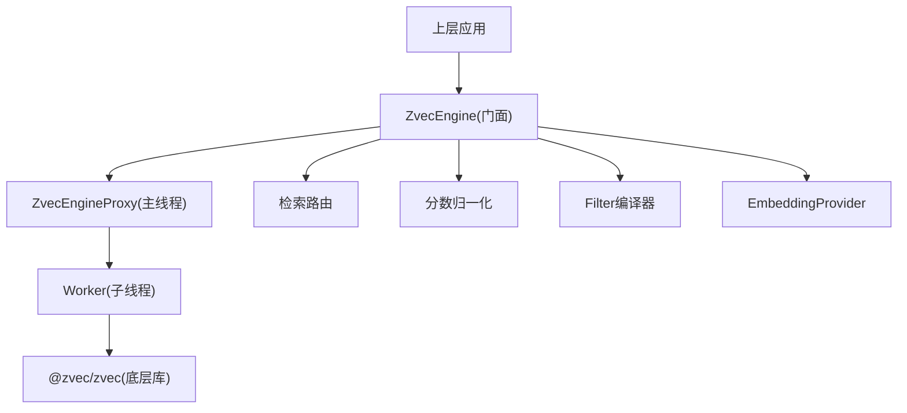
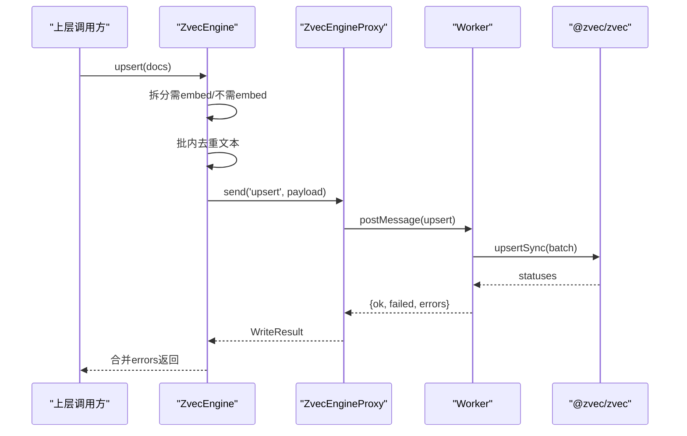
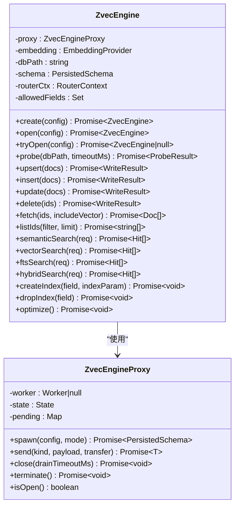
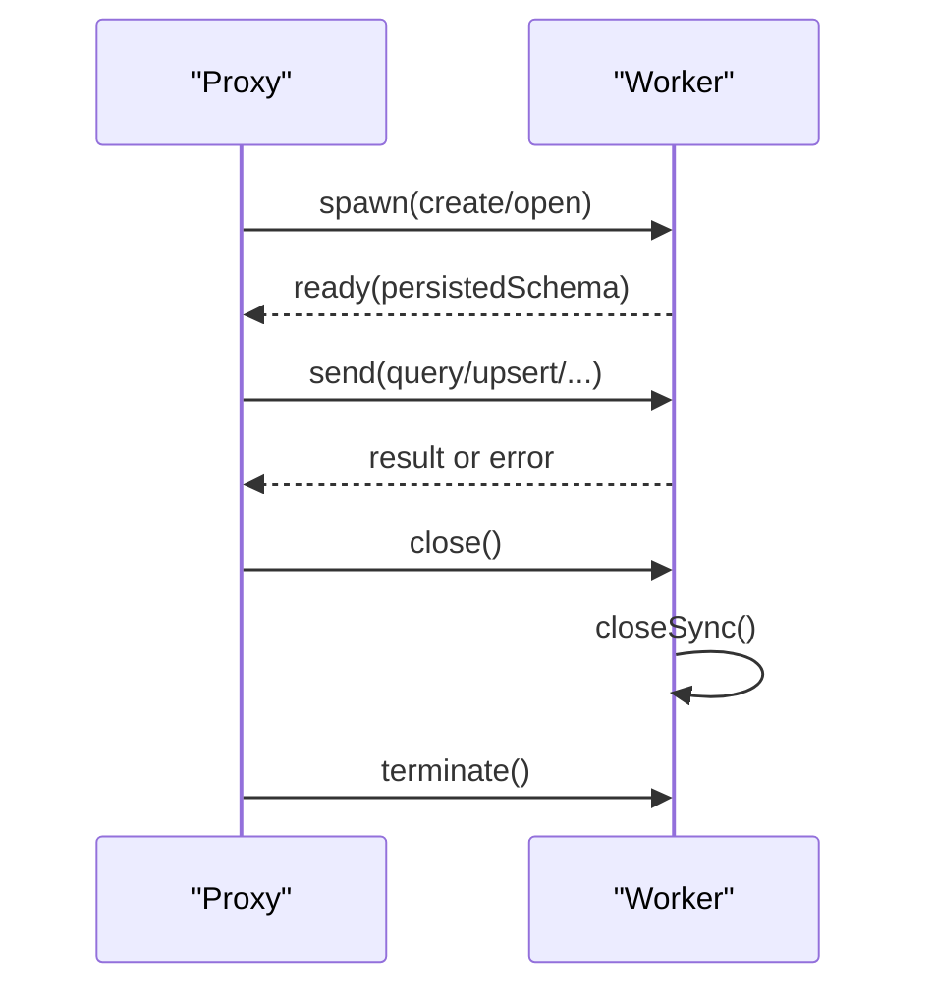
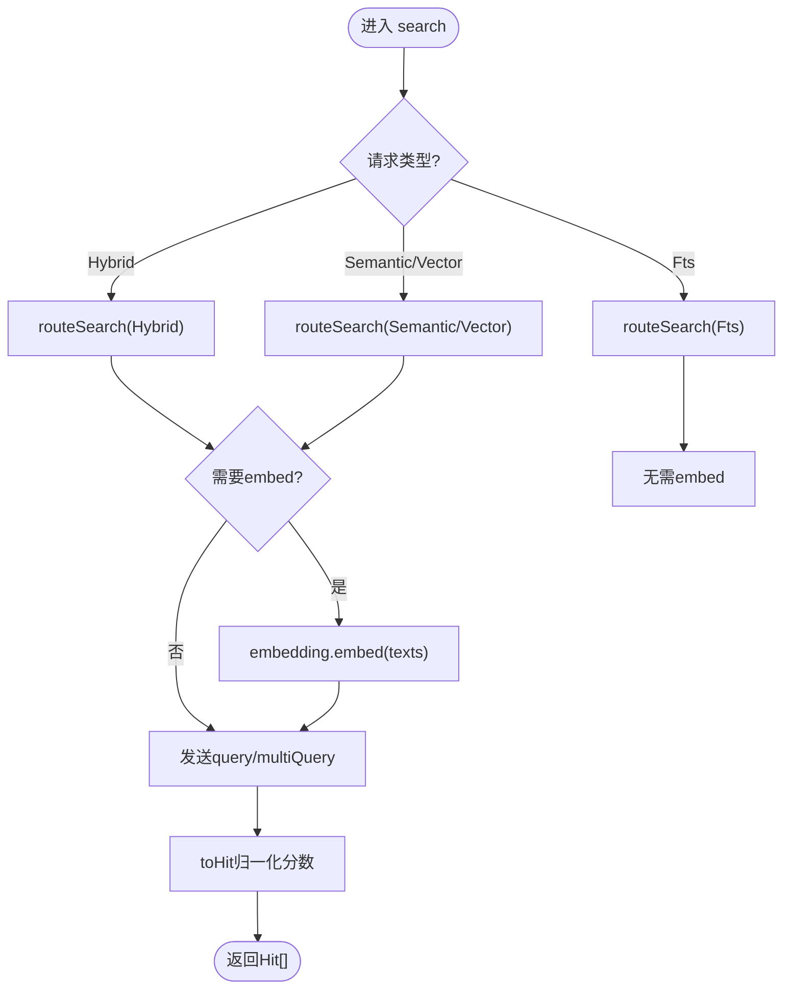
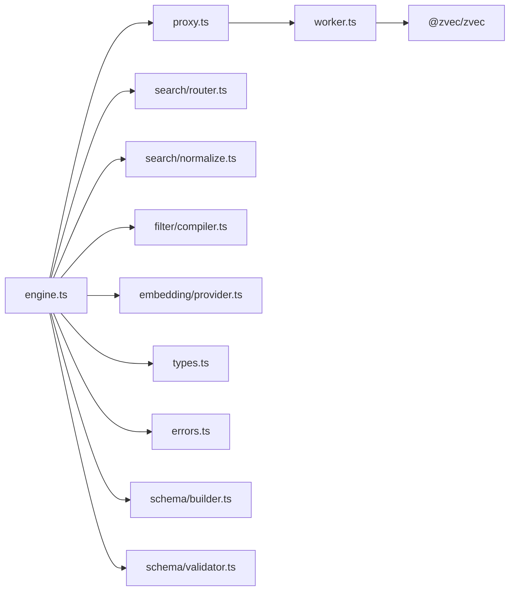

# 向量引擎

<cite>
**本文引用的文件**
- [src/zvec-engine/index.ts](file://src/zvec-engine/index.ts)
- [src/zvec-engine/engine.ts](file://src/zvec-engine/engine.ts)
- [src/zvec-engine/types.ts](file://src/zvec-engine/types.ts)
- [src/zvec-engine/proxy.ts](file://src/zvec-engine/proxy.ts)
- [src/zvec-engine/worker.ts](file://src/zvec-engine/worker.ts)
- [src/zvec-engine/worker-protocol.ts](file://src/zvec-engine/worker-protocol.ts)
- [src/zvec-engine/embedding/provider.ts](file://src/zvec-engine/embedding/provider.ts)
- [src/zvec-engine/embedding/siliconflow.ts](file://src/zvec-engine/embedding/siliconflow.ts)
- [src/zvec-engine/search/router.ts](file://src/zvec-engine/search/router.ts)
- [src/zvec-engine/search/normalize.ts](file://src/zvec-engine/search/normalize.ts)
- [src/zvec-engine/filter/compiler.ts](file://src/zvec-engine/filter/compiler.ts)
- [src/zvec-engine/schema/builder.ts](file://src/zvec-engine/schema/builder.ts)
- [src/zvec-engine/schema/validator.ts](file://src/zvec-engine/schema/validator.ts)
- [src/zvec-engine/errors.ts](file://src/zvec-engine/errors.ts)
</cite>

## 目录
1. [简介](#简介)
2. [项目结构](#项目结构)
3. [核心组件](#核心组件)
4. [架构总览](#架构总览)
5. [详细组件分析](#详细组件分析)
6. [依赖关系分析](#依赖关系分析)
7. [性能考量](#性能考量)
8. [故障诊断与错误处理](#故障诊断与错误处理)
9. [配置选项与最佳实践](#配置选项与最佳实践)
10. [与上层搜索模块的集成](#与上层搜索模块的集成)
11. [结论](#结论)

## 简介
本文件为 ZvecEngine 向量引擎的全面技术文档，覆盖以下主题：
- 封装设计与单例模式（通过代理与进程隔离实现）
- 进程间通信机制与 Worker 线程管理
- 混合检索实现细节（向量检索、全文检索、结果融合）
- 错误处理策略与异常恢复机制
- Embedding 提供商插件架构与扩展方式
- 性能监控指标与优化建议
- 引擎配置选项与故障诊断方法
- 与上层搜索模块的集成接口与调用示例

## 项目结构
ZvecEngine 位于 src/zvec-engine 下，采用“门面 + 协议 + 工作线程”的分层设计：
- 门面层：engine.ts 暴露统一 API（create/open/upsert/query 等）
- 协议层：worker-protocol.ts 定义主线程与 worker 的消息格式、序列化与传输
- 工作线程：worker.ts 持有唯一集合句柄，串行执行底层 zvec 操作
- 代理层：proxy.ts 负责 spawn/close/terminate、消息路由、超时与崩溃处理
- 检索路由：search/router.ts 将高层请求映射到单路或多路查询
- 归一化：search/normalize.ts 将不同来源分数归一化为统一 Hit.score
- 过滤器：filter/compiler.ts 将结构化 Filter 编译为类 SQL 字符串
- Schema：schema/builder.ts 与 schema/validator.ts 负责构建与校验集合模式
- Embedding：embedding/provider.ts 抽象接口，siliconflow.ts 提供默认实现
- 类型与错误：types.ts 与 errors.ts 定义公共类型与类型化异常

图表来源
- [src/zvec-engine/engine.ts:68-131](file://src/zvec-engine/engine.ts#L68-L131)
- [src/zvec-engine/proxy.ts:44-126](file://src/zvec-engine/proxy.ts#L44-L126)
- [src/zvec-engine/worker.ts:62-163](file://src/zvec-engine/worker.ts#L62-L163)
- [src/zvec-engine/search/router.ts:43-127](file://src/zvec-engine/search/router.ts#L43-L127)
- [src/zvec-engine/search/normalize.ts:38-63](file://src/zvec-engine/search/normalize.ts#L38-L63)
- [src/zvec-engine/filter/compiler.ts:31-78](file://src/zvec-engine/filter/compiler.ts#L31-L78)
- [src/zvec-engine/embedding/provider.ts:20-28](file://src/zvec-engine/embedding/provider.ts#L20-L28)

章节来源
- [src/zvec-engine/index.ts:1-62](file://src/zvec-engine/index.ts#L1-L62)
- [src/zvec-engine/engine.ts:1-131](file://src/zvec-engine/engine.ts#L1-L131)

## 核心组件
- ZvecEngine：对外门面，负责配置校验、生命周期、写入编排、检索编排、索引维护。
- ZvecEngineProxy：主线程侧代理，创建并管理 worker 线程，发送/接收消息，处理超时与崩溃。
- Worker：子线程入口，持有唯一集合句柄，串行处理 create/open/query/write/delete/fetch/listIds/optimize/index 等操作。
- EmbeddingProvider：抽象接口，SiliconFlowProvider 为参考实现，支持重试、退避、进度回调。
- Search Router：根据请求参数选择单路或两路（向量+FTS）检索，必要时触发 embed。
- Filter Compiler：将结构化 filter 编译为安全类 SQL 字符串，防注入与 DoS。
- Schema Builder/Validator：构建 zvec 集合模式，校验 create/open 配置一致性。
- Errors：统一的类型化异常体系，支持跨线程序列化/反序列化。

章节来源
- [src/zvec-engine/engine.ts:68-509](file://src/zvec-engine/engine.ts#L68-L509)
- [src/zvec-engine/proxy.ts:44-277](file://src/zvec-engine/proxy.ts#L44-L277)
- [src/zvec-engine/worker.ts:62-504](file://src/zvec-engine/worker.ts#L62-L504)
- [src/zvec-engine/embedding/provider.ts:9-28](file://src/zvec-engine/embedding/provider.ts#L9-L28)
- [src/zvec-engine/embedding/siliconflow.ts:43-203](file://src/zvec-engine/embedding/siliconflow.ts#L43-L203)
- [src/zvec-engine/search/router.ts:43-191](file://src/zvec-engine/search/router.ts#L43-L191)
- [src/zvec-engine/filter/compiler.ts:21-102](file://src/zvec-engine/filter/compiler.ts#L21-L102)
- [src/zvec-engine/schema/builder.ts:38-100](file://src/zvec-engine/schema/builder.ts#L38-L100)
- [src/zvec-engine/schema/validator.ts:34-223](file://src/zvec-engine/schema/validator.ts#L34-L223)
- [src/zvec-engine/errors.ts:17-99](file://src/zvec-engine/errors.ts#L17-L99)

## 架构总览
ZvecEngine 采用“主线程门面 + 子线程 Actor”的架构：
- 主线程负责业务编排（embed、路由、过滤、归一化）、配置校验、错误分类。
- 子线程持有唯一集合句柄，串行执行所有 I/O 操作，避免并发竞争。
- 通过 worker-protocol 进行消息传递，使用 Float32Array + transfer list 零拷贝传输向量。
- 通过类型化异常在跨线程边界保持错误语义一致。

图表来源
- [src/zvec-engine/engine.ts:330-450](file://src/zvec-engine/engine.ts#L330-L450)
- [src/zvec-engine/proxy.ts:114-126](file://src/zvec-engine/proxy.ts#L114-L126)
- [src/zvec-engine/worker.ts:286-331](file://src/zvec-engine/worker.ts#L286-L331)

章节来源
- [src/zvec-engine/engine.ts:330-495](file://src/zvec-engine/engine.ts#L330-L495)
- [src/zvec-engine/proxy.ts:114-177](file://src/zvec-engine/proxy.ts#L114-L177)
- [src/zvec-engine/worker.ts:286-436](file://src/zvec-engine/worker.ts#L286-L436)

## 详细组件分析

### ZvecEngine 门面与单例模式
- 工厂方法 create/open/tryOpen：
  - create：校验配置 → 启动 proxy.spawn('create') → 返回引擎实例。
  - open：预检路径存在性 → spawn('open') → 校验持久化 schema 与断言。
  - tryOpen：捕获异常返回 null，便于上层做自愈判断。
- 单例模式：每个 ZvecEngineProxy 对应一个 worker 线程，该 worker 持有唯一集合句柄；engine 内部不直接持有底层句柄，而是通过 proxy 访问，从而保证“每进程每集合单例”。
- 生命周期：close/destroy/isHealthy/isLocked/isOpen/probe。probe 支持无句柄探测集合状态（不存在/被锁/健康/损坏），带超时保护。

图表来源
- [src/zvec-engine/engine.ts:68-239](file://src/zvec-engine/engine.ts#L68-L239)
- [src/zvec-engine/proxy.ts:44-181](file://src/zvec-engine/proxy.ts#L44-L181)

章节来源
- [src/zvec-engine/engine.ts:95-239](file://src/zvec-engine/engine.ts#L95-L239)
- [src/zvec-engine/proxy.ts:56-181](file://src/zvec-engine/proxy.ts#L56-L181)

### 进程间通信与 Worker 线程管理
- 消息协议：
  - 请求包含 id、kind、payload；响应包含 ok/result 或 error。
  - 向量数据以 Float32Array 形式通过 transfer list 零拷贝传输。
  - 错误序列化为 SerializedError，主线程侧按名称重建类型化异常。
- 生命周期管理：
  - spawn：创建 worker，监听 message/error/exit，等待 ready。
  - close：drain 在途请求 → 发送 close 消息（worker 内 closeSync 释放 LOCK）→ terminate。
  - destroy：委托 worker 执行 closeSync → ZVecDestroy → terminate。
  - crash：error/exit 事件标记 crashed，拒绝所有 pending，通知监听器。
- 超时与健壮性：
  - drain 超时抛出 CloseTimeoutError。
  - probe 使用 Promise.race 防止阻塞。
  - 关闭探针临时 proxy 时加 2s 上限，避免挂死。

图表来源
- [src/zvec-engine/proxy.ts:56-177](file://src/zvec-engine/proxy.ts#L56-L177)
- [src/zvec-engine/worker.ts:62-163](file://src/zvec-engine/worker.ts#L62-L163)
- [src/zvec-engine/worker-protocol.ts:78-136](file://src/zvec-engine/worker-protocol.ts#L78-L136)

章节来源
- [src/zvec-engine/proxy.ts:56-277](file://src/zvec-engine/proxy.ts#L56-L277)
- [src/zvec-engine/worker.ts:62-211](file://src/zvec-engine/worker.ts#L62-L211)
- [src/zvec-engine/worker-protocol.ts:17-202](file://src/zvec-engine/worker-protocol.ts#L17-L202)

### 混合检索实现细节
- 路由规则：
  - 有 FTS 且有 queryText/vector → multiQuery 两路 RRF/加权融合（queryType='hybrid'）。
  - 缺 FTS → 退单路向量（queryType='vector'）。
  - 缺 queryText/vector → 退单路 FTS（queryType='fts'）。
  - 三者皆缺 → InvalidSearchError；queryText 与 vector 互斥。
- 嵌入时机：
  - 需要 embed 的路径在主线程调用 embedding.embed，产出 Float32Array 注入 payload。
- 分数归一化：
  - vector 路（COSINE）：score = 1/(1+distance)，distance ∈ [0,2] → score ∈ [1/3,1]。
  - fts/hybrid 路：score 直通 BM25/RRF/加权分。
  - distance 异常 clamp 或丢弃 NaN/undefined。

图表来源
- [src/zvec-engine/search/router.ts:43-127](file://src/zvec-engine/search/router.ts#L43-L127)
- [src/zvec-engine/engine.ts:454-495](file://src/zvec-engine/engine.ts#L454-L495)
- [src/zvec-engine/search/normalize.ts:38-63](file://src/zvec-engine/search/normalize.ts#L38-L63)

章节来源
- [src/zvec-engine/search/router.ts:43-191](file://src/zvec-engine/search/router.ts#L43-L191)
- [src/zvec-engine/engine.ts:454-495](file://src/zvec-engine/engine.ts#L454-L495)
- [src/zvec-engine/search/normalize.ts:16-63](file://src/zvec-engine/search/normalize.ts#L16-L63)

### 错误处理策略与异常恢复
- 类型化异常体系：
  - 基类 ZvecEngineError 携带 code/data/cause，跨线程可序列化/反序列化。
  - 分类：Schema/配置类、集合生命周期类、Embedding 类、Worker 类。
- 关键策略：
  - update 联动规则：若集合配置了 FTS，仅传 vector 不传 text 会抛 InconsistentUpdateError，避免 FTS 索引与向量不一致。
  - 写入失败粒度：embed 失败按小批记录 errors[]，成功项继续写入；zvec 写失败逐条记录。
  - 崩溃恢复：worker 崩溃后标记不可用，后续调用立即失败；上层可通过 tryOpen/probe 检测并重建。
  - 探针保护：probe 对空目录快速判定 NOT_FOUND，避免误判 locked；超时判定 locked。

章节来源
- [src/zvec-engine/errors.ts:17-99](file://src/zvec-engine/errors.ts#L17-L99)
- [src/zvec-engine/engine.ts:251-274](file://src/zvec-engine/engine.ts#L251-L274)
- [src/zvec-engine/engine.ts:330-450](file://src/zvec-engine/engine.ts#L330-L450)
- [src/zvec-engine/engine.ts:151-199](file://src/zvec-engine/engine.ts#L151-L199)
- [src/zvec-engine/proxy.ts:244-277](file://src/zvec-engine/proxy.ts#L244-L277)

### Embedding 提供商插件架构与扩展
- 抽象接口：
  - EmbeddingProvider.dimension 必须与集合维度一致。
  - embed(texts, opts) 返回 number[][]，支持 retries、batchSize、timeoutMs、onProgress。
- 默认实现 SiliconFlowProvider：
  - 从环境变量或配置读取 apiKey，baseURL 必须以 https:// 开头。
  - 批间串行，指数退避 + Retry-After 优先，4xx（非429）不重试。
  - 响应校验：data 长度、index 排序对齐输入顺序、embedding 类型与维度校验。
- 扩展方式：
  - 实现 EmbeddingProvider 接口，确保 dimension 与集合一致。
  - 在 engine.create/open 时传入自定义 provider。
  - 利用 batchSize 控制失败粒度与限流；onProgress 用于上报进度。

章节来源
- [src/zvec-engine/embedding/provider.ts:9-28](file://src/zvec-engine/embedding/provider.ts#L9-L28)
- [src/zvec-engine/embedding/siliconflow.ts:43-203](file://src/zvec-engine/embedding/siliconflow.ts#L43-L203)
- [src/zvec-engine/engine.ts:330-450](file://src/zvec-engine/engine.ts#L330-L450)

### 过滤器与 Schema 构建/校验
- 过滤器编译：
  - 支持 and/or/not 组合，叶子节点比较操作符包括 ==、!=、>、<、>=、<=。
  - 字段白名单限制，值类型校验，嵌套深度上限 32 防 DoS。
- Schema 构建：
  - denseField 映射为 HNSW 向量索引，metric=COSINE。
  - scalarFields 可选 INVERT 倒排索引；fts 字段映射为 FTS 索引，tokenizer 强制显式。
- 配置校验：
  - create：集合名合法、维度一致、metric 限定、字段重名检查、fts 配置完整、路径存在性。
  - open：embedding 维度与持久化维度一致、metric 限定、schemaAssert 逐项比对。
  - zvec 原始错误映射为类型化异常（locked/not found/corrupted）。

章节来源
- [src/zvec-engine/filter/compiler.ts:21-102](file://src/zvec-engine/filter/compiler.ts#L21-L102)
- [src/zvec-engine/schema/builder.ts:38-100](file://src/zvec-engine/schema/builder.ts#L38-L100)
- [src/zvec-engine/schema/validator.ts:34-223](file://src/zvec-engine/schema/validator.ts#L34-L223)

## 依赖关系分析
- 耦合度：
  - engine 与 proxy/worker 强耦合（生命周期与消息协议），但通过协议解耦具体实现。
  - router/normalize/filter 与 engine 松耦合，易于替换或扩展。
  - embedding provider 与 engine 通过接口解耦，可插拔。
- 外部依赖：
  - @zvec/zvec：底层向量存储与检索库。
  - Node worker_threads：进程隔离与并行计算。
  - fetch：HTTP 客户端（SiliconFlowProvider）。
- 潜在循环依赖：
  - 当前模块划分清晰，未见循环 import。

图表来源
- [src/zvec-engine/engine.ts:13-60](file://src/zvec-engine/engine.ts#L13-L60)
- [src/zvec-engine/proxy.ts:14-33](file://src/zvec-engine/proxy.ts#L14-L33)
- [src/zvec-engine/worker.ts:17-46](file://src/zvec-engine/worker.ts#L17-L46)

章节来源
- [src/zvec-engine/engine.ts:13-60](file://src/zvec-engine/engine.ts#L13-L60)
- [src/zvec-engine/proxy.ts:14-33](file://src/zvec-engine/proxy.ts#L14-L33)
- [src/zvec-engine/worker.ts:17-46](file://src/zvec-engine/worker.ts#L17-L46)

## 性能考量
- 写入优化：
  - 批大小：DEFAULT_WRITE_BATCH_SIZE=100，worker 内分批插入并让出事件循环，减少阻塞。
  - Embed 批大小：EMBED_BATCH_SIZE=64，与 SiliconFlowProvider 默认批次对齐，失败粒度最小化。
  - 批内去重：相同 text 只 embed 一次，复用向量，减少重复 HTTP 调用。
- 检索优化：
  - 路由退化：缺 FTS 退单路向量，减少不必要开销。
  - 分数归一化：COSINE 距离转换稳定，避免极端值影响排序。
- 内存与传输：
  - Float32Array + transfer list 零拷贝传输向量，降低序列化成本。
  - collectTransferables 去重 buffer，避免重复 transfer。
- 监控指标建议：
  - 写入：ok/failed 计数、errors 分布（EMBEDDING_FAILED、ID_CONFLICT、NOT_FOUND、ZVEC_WRITE_ERROR）。
  - 检索：topk、queryType 分布、embed 耗时、归一化后 score 分布。
  - 资源：worker 存活状态、pending 队列长度、drain 耗时。
  - Embedding：batchSize、retries、timeoutMs、网络错误率、429/5xx 比例。
- 优化建议：
  - 调整 EMBED_BATCH_SIZE 与 provider batchSize 匹配，平衡吞吐与失败粒度。
  - 对高频文本启用批内去重，显著减少重复 embed。
  - 合理设置 topk 与 outputFields，减少数据传输。
  - 使用 includeVector=false 默认关闭向量回传，按需开启。
  - 定期 optimize 维护索引性能。

[本节为通用指导，不直接分析具体文件]

## 故障诊断与错误处理
- 常见问题定位：
  - 集合不存在：CollectionNotFoundError，检查 dbPath 与 open 配置。
  - 集合被锁：CollectionLockedException，使用 probe 检测 locked 状态，等待其他进程释放。
  - 集合损坏：CollectionCorruptedException，考虑重建或修复。
  - 维度不匹配：DimensionMismatchError，核对 embedding.dimension 与集合 dimension。
  - 更新不一致：InconsistentUpdateError，确保 update 提供 vector 或 text（当配置 FTS）。
  - Worker 崩溃：WorkerCrashedError，检查 worker 日志与底层 zvec 错误。
- 诊断步骤：
  - 使用 tryOpen 快速判断是否可用。
  - 使用 probe 获取 exists/locked/healthy 状态。
  - 检查 WriteResult.errors 与 Hit 列表，定位失败条目与召回质量。
  - 查看 Embedding 重试与超时配置，调整 retries/timeoutMs。
- 恢复策略：
  - 对 CollectionLockedException：等待并重试，或切换只读模式。
  - 对 CollectionCorruptedException：重建集合。
  - 对 WorkerCrashedError：重建 proxy/worker，必要时重启进程。

章节来源
- [src/zvec-engine/engine.ts:151-199](file://src/zvec-engine/engine.ts#L151-L199)
- [src/zvec-engine/schema/validator.ts:197-223](file://src/zvec-engine/schema/validator.ts#L197-L223)
- [src/zvec-engine/errors.ts:51-75](file://src/zvec-engine/errors.ts#L51-L75)

## 配置选项与最佳实践
- 集合配置（ZvecEngineConfig.collection）：
  - name：集合名，字母开头，≥3字符，仅字母数字下划线。
  - denseField：向量字段名。
  - dimension：向量维度，必须与 embedding.dimension 一致。
  - metric：仅支持 COSINE。
  - denseDataType：FP32 或 FP16。
  - scalarFields：标量字段定义，可选 indexed=true 建立倒排索引。
  - fts：全文检索配置，field 必须为 STRING，tokenizer 必填（推荐 jieba）。
- 打开配置（ZvecEngineOpenConfig）：
  - dbPath：绝对路径，必须存在。
  - collectionName：集合名。
  - readOnly：只读模式。
  - schemaAssert：断言维度、metric、scalarFields、fts 一致性。
- Embedding 配置（SiliconFlowProviderConfig）：
  - apiKey：从环境变量或配置注入。
  - baseURL：必须以 https:// 开头。
  - model：模型名称。
  - dimension：输出维度，必须与集合维度一致。
  - fetchImpl：可注入 mock fetch 用于测试。
- 最佳实践：
  - 始终使用绝对路径，避免相对路径导致的歧义。
  - 严格校验 schemaAssert，确保多进程/多版本一致性。
  - 合理设置 topk、outputFields、includeVector，减少带宽与内存占用。
  - 对高频文本启用批内去重，提升效率。
  - 监控 Embedding 重试与超时，避免雪崩。

章节来源
- [src/zvec-engine/types.ts:41-71](file://src/zvec-engine/types.ts#L41-L71)
- [src/zvec-engine/schema/validator.ts:34-133](file://src/zvec-engine/schema/validator.ts#L34-L133)
- [src/zvec-engine/embedding/siliconflow.ts:16-75](file://src/zvec-engine/embedding/siliconflow.ts#L16-L75)

## 与上层搜索模块的集成
- 集成接口：
  - 写入：upsert/insert/update/delete/fetch/listIds。
  - 检索：semanticSearch/vectorSearch/ftsSearch/hybridSearch。
  - 索引：createIndex/dropIndex/optimize。
  - 生命周期：info/close/destroy/isHealthy/isLocked/isOpen/probe。
- 调用示例（概念流程）：
  - 创建引擎：ZvecEngine.create({ dbPath, collection, embedding })。
  - 写入文档：engine.upsert([{ id, text/vector, fields }])。
  - 语义检索：engine.semanticSearch({ queryText, topk, filter })。
  - 混合检索：engine.hybridSearch({ queryText, fts, rerank: { type: 'rrf'|'weighted', weights } })。
  - 探测状态：const state = await ZvecEngine.probe(dbPath)。
- 注意事项：
  - 确保 embedding.dimension 与集合 dimension 一致。
  - 若配置 FTS，update 需提供 vector 或 text，避免索引不一致。
  - 使用 filter 时，字段必须在 scalarFields 中声明。
  - 对高并发场景，合理设置 batch 与 topk，避免过载。

章节来源
- [src/zvec-engine/engine.ts:95-326](file://src/zvec-engine/engine.ts#L95-L326)
- [src/zvec-engine/types.ts:75-187](file://src/zvec-engine/types.ts#L75-L187)

## 结论
ZvecEngine 通过“门面 + 代理 + 工作线程”的架构实现了高内聚、低耦合的向量检索能力。其设计重点包括：
- 严格的配置校验与模式断言，保障数据一致性。
- 进程隔离与串行执行，避免并发竞争与资源泄漏。
- 灵活的混合检索与分数归一化，支持语义与关键词融合。
- 完善的错误处理与恢复机制，提升系统健壮性。
- 可扩展的 Embedding 插件架构，适配多种后端服务。
- 明确的性能优化点与监控指标，便于调优与运维。

[本节为总结性内容，不直接分析具体文件]