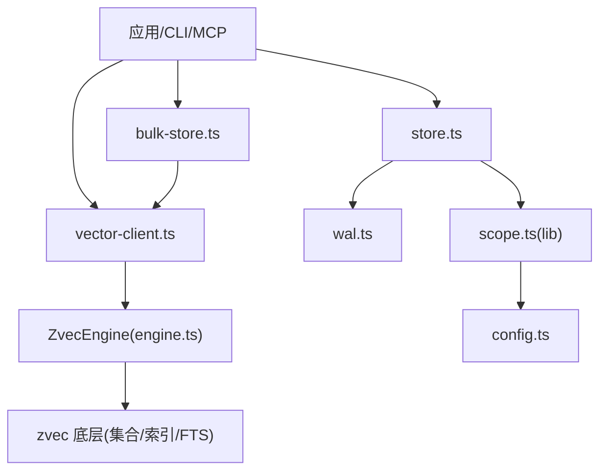
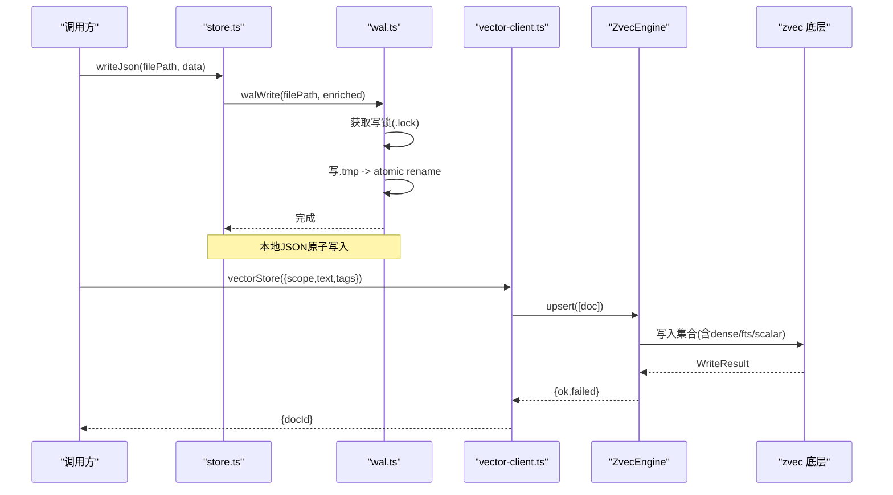
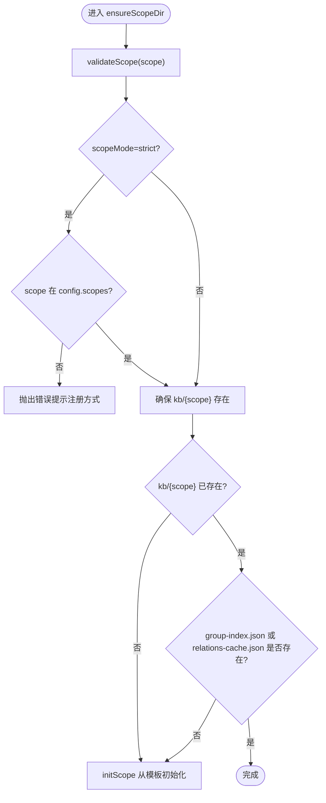
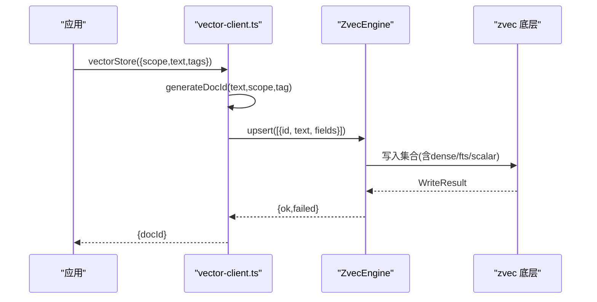
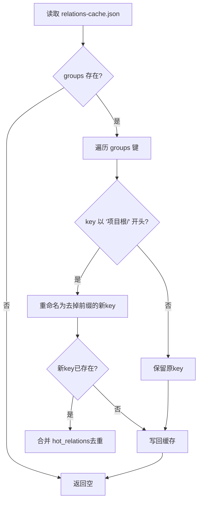
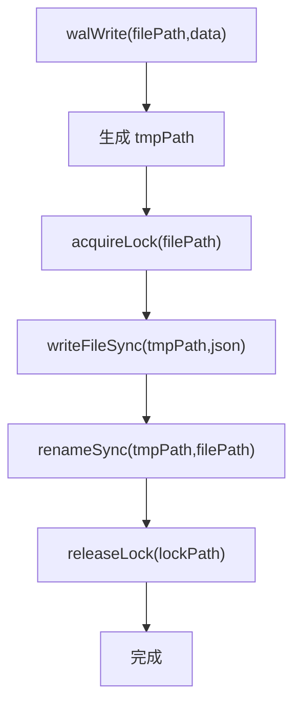
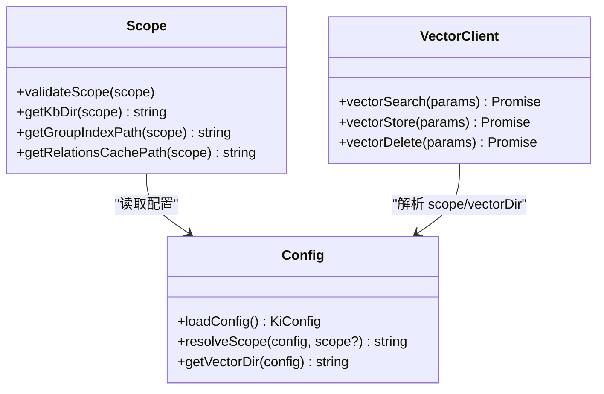
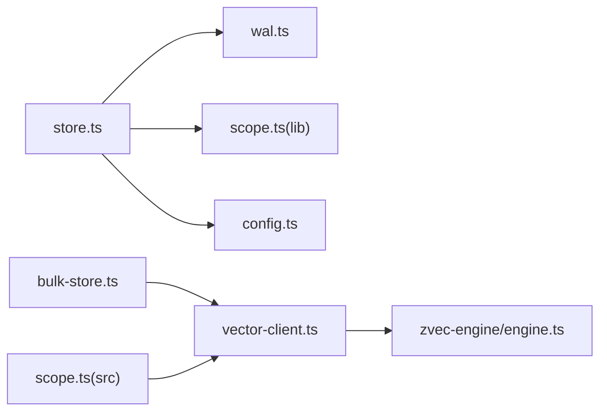

# 存储层

<cite>
**本文引用的文件列表**
- [src/lib/store.ts](file://src/lib/store.ts)
- [src/lib/wal.ts](file://src/lib/wal.ts)
- [src/lib/scope.ts](file://src/lib/scope.ts)
- [src/lib/config.ts](file://src/lib/config.ts)
- [src/lib/vector-client.ts](file://src/lib/vector-client.ts)
- [src/zvec-engine/engine.ts](file://src/zvec-engine/engine.ts)
- [src/zvec-engine/index.ts](file://src/zvec-engine/index.ts)
- [src/bulk-store.ts](file://src/bulk-store.ts)
- [src/scope.ts](file://src/scope.ts)
</cite>

## 目录
1. [简介](#简介)
2. [项目结构](#项目结构)
3. [核心组件](#核心组件)
4. [架构总览](#架构总览)
5. [详细组件分析](#详细组件分析)
6. [依赖关系分析](#依赖关系分析)
7. [性能与批量优化](#性能与批量优化)
8. [故障排查指南](#故障排查指南)
9. [结论](#结论)
10. [附录：数据格式规范与迁移指南](#附录数据格式规范与迁移指南)

## 简介
本章节面向“存储层”的完整设计说明，覆盖本地 KB 文件存储结构、向量数据库持久化机制（写入/更新/删除）、关系缓存系统、WAL 一致性保障、Scope 隔离机制、批量操作优化与性能调优建议，以及数据存储格式规范与迁移策略。目标是让读者在不深入源码的情况下也能理解并正确使用该存储子系统。

## 项目结构
存储层由以下关键模块组成：
- 本地 KB 文件存储与初始化：负责 kb/{scope} 目录结构、group-index.json、relations-cache.json 的读写与迁移
- WAL 写入机制：原子写入、跨进程写锁、临时文件清理
- 向量客户端与引擎：封装 ZvecEngine，提供 upsert/delete/list/search 等能力，实现 scope/tag 过滤与混合检索
- Scope 管理：校验、路径解析、模式控制（default/strict）
- 配置系统：统一加载 dataDir/vectorDir/embedding/scopeMode 等配置项
- 批量导入 CLI：批量文本到向量索引的入口

图表来源
- [src/lib/vector-client.ts:1-150](file://src/lib/vector-client.ts#L1-L150)
- [src/zvec-engine/engine.ts:1-120](file://src/zvec-engine/engine.ts#L1-L120)
- [src/lib/store.ts:1-120](file://src/lib/store.ts#L1-L120)
- [src/lib/wal.ts:1-120](file://src/lib/wal.ts#L1-L120)
- [src/lib/scope.ts:1-120](file://src/lib/scope.ts#L1-L120)
- [src/lib/config.ts:1-120](file://src/lib/config.ts#L1-L120)
- [src/bulk-store.ts:1-110](file://src/bulk-store.ts#L1-L110)

章节来源
- [src/lib/store.ts:1-267](file://src/lib/store.ts#L1-L267)
- [src/lib/wal.ts:1-143](file://src/lib/wal.ts#L1-L143)
- [src/lib/scope.ts:1-230](file://src/lib/scope.ts#L1-L230)
- [src/lib/config.ts:1-509](file://src/lib/config.ts#L1-L509)
- [src/lib/vector-client.ts:1-754](file://src/lib/vector-client.ts#L1-L754)
- [src/zvec-engine/engine.ts:1-569](file://src/zvec-engine/engine.ts#L1-L569)
- [src/bulk-store.ts:1-110](file://src/bulk-store.ts#L1-L110)

## 核心组件
- 本地 KB 存储与迁移：readJson/writeJson、ensureScopeDir/initScope、group-index 与 relations-cache 的读取与自动迁移
- WAL 写入：跨进程写锁、.tmp 原子 rename、陈旧锁清理
- 向量客户端：engine 单例、空闲释放锁、撞锁重试、upsert/delete/list/search、docId 生成与幂等
- 配置与 Scope：默认路径、scopeMode(default/strict)、scope 白名单校验、路径构造
- 批量导入：批量 JSON 输入校验、调用 vectorBulkStore 并输出结果

章节来源
- [src/lib/store.ts:18-159](file://src/lib/store.ts#L18-L159)
- [src/lib/wal.ts:31-143](file://src/lib/wal.ts#L31-L143)
- [src/lib/vector-client.ts:218-340](file://src/lib/vector-client.ts#L218-L340)
- [src/lib/config.ts:148-175](file://src/lib/config.ts#L148-L175)
- [src/bulk-store.ts:32-110](file://src/bulk-store.ts#L32-L110)

## 架构总览
存储层采用“本地文件 + 向量库”的双层持久化：
- 本地 KB 层：以 JSON 文件为主，使用 WAL 保证原子性与并发安全；通过 group-index.json 维护 Group 树，relations-cache.json 维护热点关系与统计
- 向量层：基于 zvec 引擎，按 scope/tag 进行标量字段隔离，支持语义+关键词混合检索；文档 id 由 text+scope+tag 哈希得到，天然幂等

图表来源
- [src/lib/store.ts:51-62](file://src/lib/store.ts#L51-L62)
- [src/lib/wal.ts:92-112](file://src/lib/wal.ts#L92-L112)
- [src/lib/vector-client.ts:513-542](file://src/lib/vector-client.ts#L513-L542)
- [src/zvec-engine/engine.ts:243-279](file://src/zvec-engine/engine.ts#L243-L279)

## 详细组件分析

### 本地 KB 文件存储结构与组织
- 目录布局
  - 每个 scope 对应一个 kb/{scope} 目录
  - 关键文件：group-index.json（Group 树与 source 信息）、relations-cache.json（热点关系与统计）
- 初始化与校验
  - ensureScopeDir：校验 scope、在 strict 模式下检查注册白名单、不存在则从 _template 初始化
  - initScope：复制模板文件并设置 scope 与 updatedAt
- 读取与迁移
  - readGroupIndex：读取 group-index.json，若检测到旧格式（roots → groups）自动迁移并写回；同时迁移 relations-cache.json 中旧 key 前缀
  - readJson/writeJson：读时做 version 兼容检查；写时自动注入 version 与 updatedAt，并通过 WAL 写入

图表来源
- [src/lib/store.ts:168-223](file://src/lib/store.ts#L168-L223)
- [src/lib/store.ts:229-266](file://src/lib/store.ts#L229-L266)
- [src/lib/scope.ts:30-53](file://src/lib/scope.ts#L30-L53)
- [src/lib/config.ts:444-459](file://src/lib/config.ts#L444-L459)

章节来源
- [src/lib/store.ts:18-159](file://src/lib/store.ts#L18-L159)
- [src/lib/store.ts:168-266](file://src/lib/store.ts#L168-L266)
- [src/lib/scope.ts:45-77](file://src/lib/scope.ts#L45-L77)

### 向量数据库持久化机制（写入/更新/删除）
- 写入（upsert）
  - 单条：vectorStore 计算 docId = sha256(text+scope+tag)，调用 engine.upsert
  - 批量：vectorBulkStore 将 entries 映射为 docs，批量 upsert，返回逐项结果
  - 失败粒度：embedding 阶段按小批（EMBED_BATCH_SIZE）处理，失败仅标记对应批次
- 更新（update）
  - 要求 dense vector 必填（或提供 text 重嵌），否则抛 InconsistentUpdateError
  - 若开启 FTS，禁止只传 vector 不传 text，避免 FTS 不一致
- 删除（delete）
  - 按 doc ids 删除；管理命令可批量删除某 scope/tag 下的全部文档（循环 listIds + delete）
- 文档 ID 与幂等
  - docId 由 text+scope+tag 生成，重复写入覆盖，天然幂等
  - tag 参与 id 生成后，存量向量需全量 re-import 或 rebuild-vector 迁移

图表来源
- [src/lib/vector-client.ts:240-242](file://src/lib/vector-client.ts#L240-L242)
- [src/lib/vector-client.ts:513-542](file://src/lib/vector-client.ts#L513-L542)
- [src/zvec-engine/engine.ts:243-279](file://src/zvec-engine/engine.ts#L243-L279)

章节来源
- [src/lib/vector-client.ts:508-590](file://src/lib/vector-client.ts#L508-L590)
- [src/zvec-engine/engine.ts:330-450](file://src/zvec-engine/engine.ts#L330-L450)

### 关系缓存系统（relations-cache.json）
- 作用：记录 Group 下热点关系（hot_relations）与统计信息，用于快速展示与检索增强
- 迁移：当 group-index.json 从 roots 迁移到 groups 时，relations-cache.json 中以“项目根/”开头的旧 key 会被重命名或合并到新 key
- 读取：通过 getRelationsCachePath 定位文件，读取 groups 结构并统计 hot_relations 数量

图表来源
- [src/lib/store.ts:94-159](file://src/lib/store.ts#L94-L159)
- [src/scope.ts:67-83](file://src/scope.ts#L67-L83)

章节来源
- [src/lib/store.ts:94-159](file://src/lib/store.ts#L94-L159)
- [src/scope.ts:67-83](file://src/scope.ts#L67-L83)

### WAL（Write-Ahead Log）机制与一致性
- 目标：保证 JSON 文件原子写入与并发安全，避免多进程/多 MCP 工具并发写造成静默覆盖
- 流程：
  - 获取跨进程写锁（.lock），自旋等待或抢占陈旧锁
  - 写 .tmp 临时文件，再 atomic rename 为目标文件
  - 释放锁；支持清理残留 .tmp 与陈旧 .lock
- 注意：同步阻塞语义，在 MCP 长驻进程中可能短暂冻结事件循环；正常争用窗口毫秒级

图表来源
- [src/lib/wal.ts:92-112](file://src/lib/wal.ts#L92-L112)
- [src/lib/wal.ts:37-76](file://src/lib/wal.ts#L37-L76)
- [src/lib/wal.ts:121-143](file://src/lib/wal.ts#L121-L143)

章节来源
- [src/lib/wal.ts:1-143](file://src/lib/wal.ts#L1-L143)

### Scope 隔离机制与数据访问控制
- Scope 校验：仅允许字母、数字、连字符、下划线，拒绝路径遍历字符
- 路径解析：getKbDir 优先使用 scopes[scope].kbDir，fallback 到 dataDir/scope
- 模式控制：
  - default：缺省 scope 为 'default'，任意值放行
  - strict：必须显式传入且必须在 config.scopes 白名单内，否则 fail-loud
- 向量层隔离：通过标量字段 scope/tag 过滤，查询/写入均按 scope 限定
- 管理命令：list/delete/clear 支持两层（KB/向量）并集视图与破坏性操作的二次确认

图表来源
- [src/lib/scope.ts:30-77](file://src/lib/scope.ts#L30-L77)
- [src/lib/config.ts:444-459](file://src/lib/config.ts#L444-L459)
- [src/lib/vector-client.ts:477-506](file://src/lib/vector-client.ts#L477-L506)

章节来源
- [src/lib/scope.ts:30-77](file://src/lib/scope.ts#L30-L77)
- [src/lib/config.ts:444-459](file://src/lib/config.ts#L444-L459)
- [src/scope.ts:94-132](file://src/scope.ts#L94-L132)

## 依赖关系分析
- store.ts 依赖 wal.ts、scope.ts、config.ts 完成本地文件的原子写入与 scope 初始化
- vector-client.ts 依赖 zvec-engine/engine.ts 提供向量能力，并依赖 config.ts 解析 embedding/vectorDir
- bulk-store.ts 作为 CLI 入口，调用 vector-client.ts 执行批量存储
- scope.ts（lib）提供路径与类型定义，scope.ts（src）提供 CLI 生命周期管理

图表来源
- [src/lib/store.ts:1-15](file://src/lib/store.ts#L1-L15)
- [src/lib/vector-client.ts:16-33](file://src/lib/vector-client.ts#L16-L33)
- [src/bulk-store.ts:19-24](file://src/bulk-store.ts#L19-L24)
- [src/scope.ts:19-30](file://src/scope.ts#L19-L30)

章节来源
- [src/lib/store.ts:1-15](file://src/lib/store.ts#L1-L15)
- [src/lib/vector-client.ts:16-33](file://src/lib/vector-client.ts#L16-L33)
- [src/bulk-store.ts:19-24](file://src/bulk-store.ts#L19-L24)
- [src/scope.ts:19-30](file://src/scope.ts#L19-L30)

## 性能与批量优化
- 批量写入
  - vectorBulkStore 将多条 entries 转为 docs 一次性 upsert，减少网络与序列化开销
  - 失败粒度：embedding 阶段按 EMBED_BATCH_SIZE 切分，失败不影响成功批次
- 嵌入优化
  - 批内去重：相同 text 只 embed 一次，复用向量给同文本的多 doc（如多 tag 场景）
- 引擎并发与锁
  - 进程内 probe/open/close 串行化，避免原生竞态导致永久阻塞
  - 空闲释放锁：常驻 MCP 启用 idle close，CLI 每调用结束关闭 engine，避免锁长期占用
- 扫描限制
  - listIds 默认上限 LIST_ALL_LIMIT，大库下注意 truncated 标志

章节来源
- [src/lib/vector-client.ts:120-144](file://src/lib/vector-client.ts#L120-L144)
- [src/lib/vector-client.ts:183-216](file://src/lib/vector-client.ts#L183-L216)
- [src/zvec-engine/engine.ts:62-67](file://src/zvec-engine/engine.ts#L62-L67)
- [src/zvec-engine/engine.ts:330-384](file://src/zvec-engine/engine.ts#L330-L384)

## 故障排查指南
- 向量库被占用或损坏
  - 现象：ensureVectorAvailable 返回 LOCKED/CORRUPTED
  - 处置：停止其他 ki 进程；等待锁释放；执行 rebuild-vector 或 restore --from-snapshot
- 向量服务不可用
  - 现象：ensureVectorAvailable 返回 PROBE_ERROR
  - 处置：检查 embedding.apiKey 与 baseURL；确认 zvec 目录权限与磁盘状态
- 并发写冲突
  - 现象：WAL 写锁等待超时或陈旧锁
  - 处置：检查是否有异常退出的进程；执行 cleanupTmpFiles 清理残留
- 数据损坏
  - 现象：readJson 解析失败（CORRUPT_JSON）
  - 处置：从备份恢复或从 _template 重新初始化 scope

章节来源
- [src/lib/vector-client.ts:71-86](file://src/lib/vector-client.ts#L71-L86)
- [src/lib/vector-client.ts:420-467](file://src/lib/vector-client.ts#L420-L467)
- [src/lib/wal.ts:121-143](file://src/lib/wal.ts#L121-L143)
- [src/lib/store.ts:23-49](file://src/lib/store.ts#L23-L49)

## 结论
存储层通过“本地 JSON + WAL”与“向量库 + 标量字段隔离”的组合，实现了高可靠、可扩展的知识库存储方案。WAL 保证了原子写入与并发安全；向量层提供了强大的语义检索能力；Scope 机制确保了多租户/多项目的数据隔离；批量与嵌入优化提升了吞吐与稳定性。配合完善的迁移与故障恢复机制，适合在生产环境中稳定运行。

## 附录：数据格式规范与迁移指南

### 本地 KB 文件格式
- group-index.json
  - 字段：version、scope、groups、updatedAt、source（可选）
  - 迁移：旧格式 roots → groups 自动迁移；relations-cache.json 旧 key 前缀“项目根/”重命名或合并
- relations-cache.json
  - 字段：scope、updatedAt、groups（包含 hot_relations 等）
  - 用途：统计与热点关系展示

章节来源
- [src/lib/store.ts:67-92](file://src/lib/store.ts#L67-L92)
- [src/lib/store.ts:94-159](file://src/lib/store.ts#L94-L159)
- [src/lib/scope.ts:106-146](file://src/lib/scope.ts#L106-L146)

### 向量库数据模型
- 集合名：kisearch
- 字段：
  - dense：向量字段（维度来自 embedding.dimension）
  - content：FTS 字段（jieba 分词）
  - tag：标量 STRING，写入时转小写
  - scope：标量 STRING，用于隔离
  - group：标量 STRING（可选）
- 文档 ID：sha256(text+scope+tag) 截 32，幂等 upsert

章节来源
- [src/lib/vector-client.ts:120-127](file://src/lib/vector-client.ts#L120-L127)
- [src/lib/vector-client.ts:240-242](file://src/lib/vector-client.ts#L240-L242)
- [src/lib/vector-client.ts:271-294](file://src/lib/vector-client.ts#L271-L294)

### 迁移指南
- 向量层 tag 参与 docId 生成后的影响
  - 存量向量 docId 与新 scheme 失配，原文召回与精确删除不可靠
  - 建议：发布后全量 re-import 或执行 rebuild-vector 迁移
- 本地 KB 层迁移
  - group-index.json：roots → groups 自动迁移
  - relations-cache.json：旧 key 前缀“项目根/”重命名或合并
  - 若检测到旧数据路径（kbDir 语义变更），给出警告并建议迁移

章节来源
- [src/lib/vector-client.ts:225-239](file://src/lib/vector-client.ts#L225-L239)
- [src/lib/store.ts:67-92](file://src/lib/store.ts#L67-L92)
- [src/lib/store.ts:94-159](file://src/lib/store.ts#L94-L159)
- [src/lib/store.ts:210-223](file://src/lib/store.ts#L210-L223)