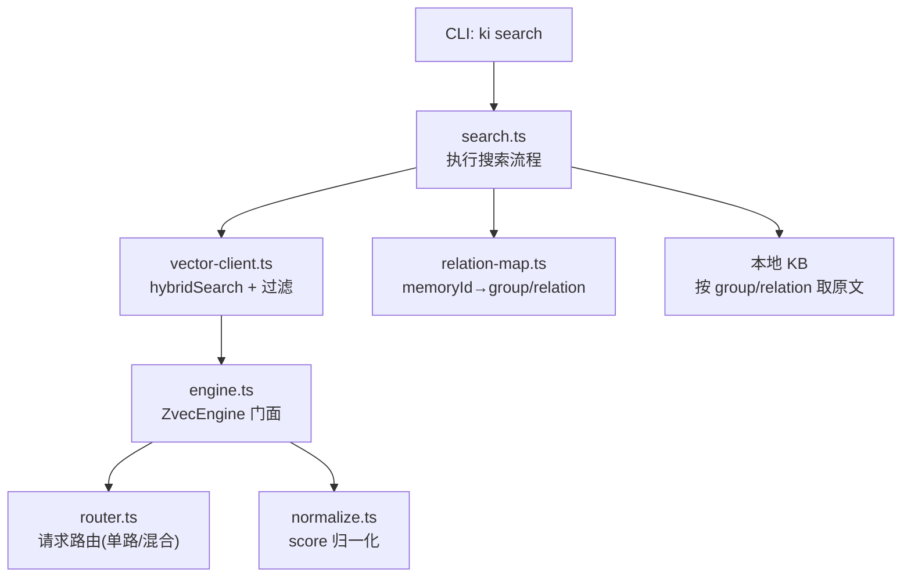
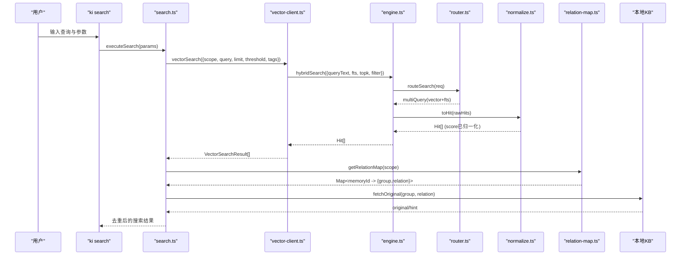
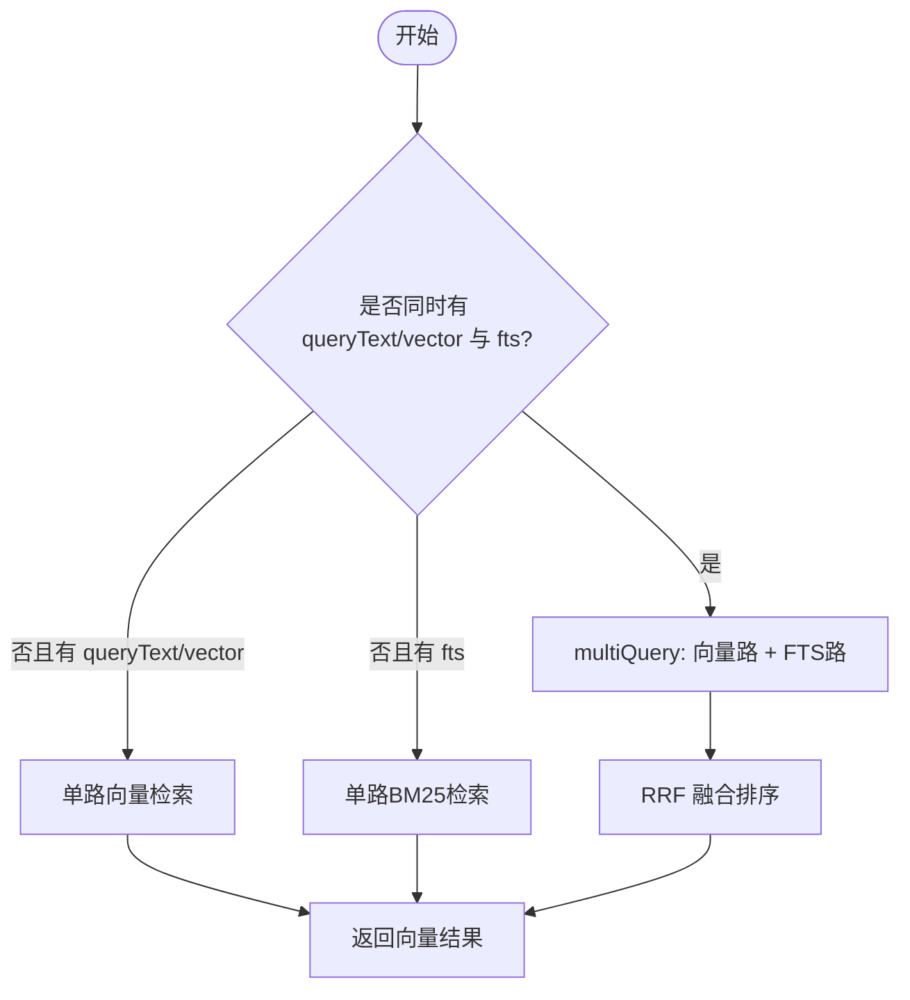
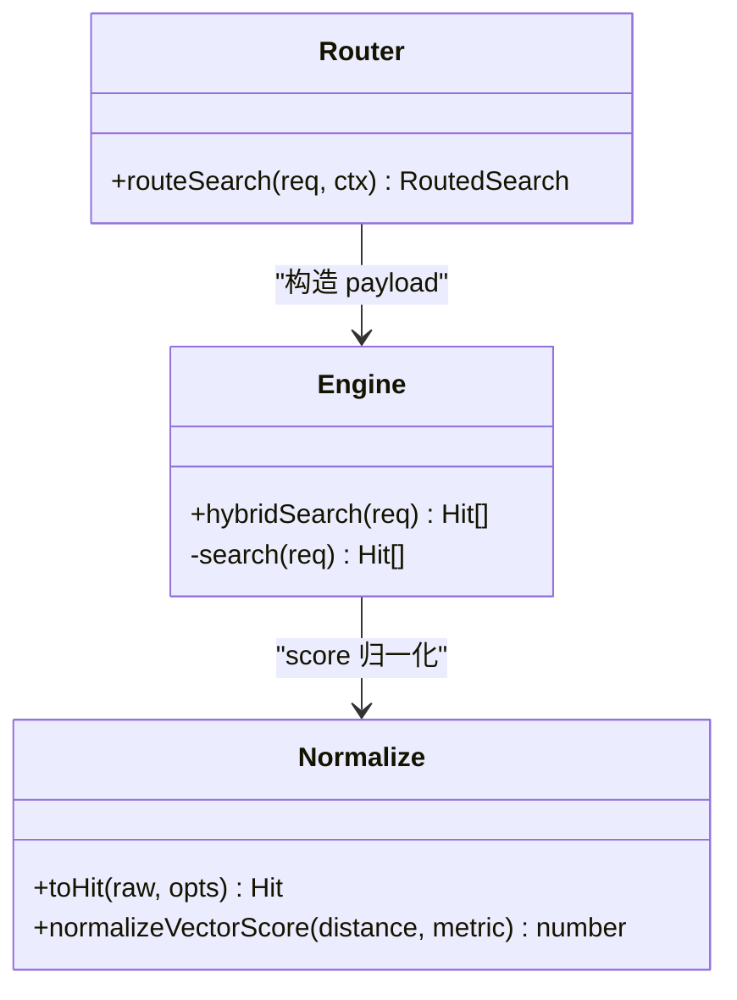
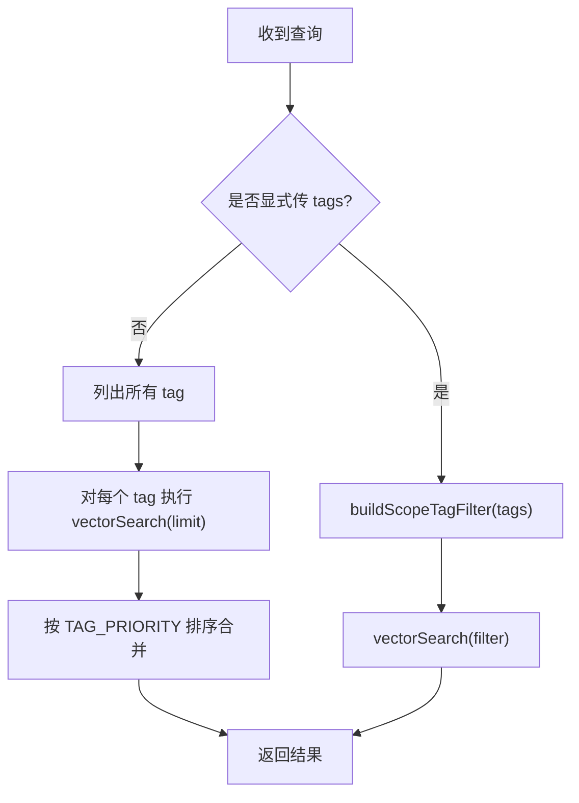
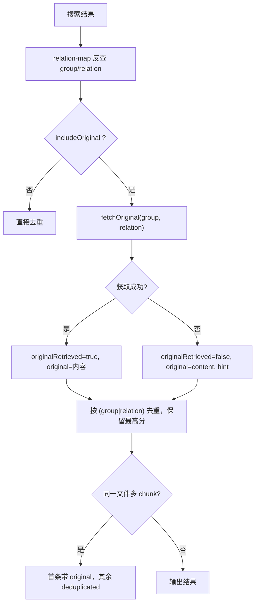
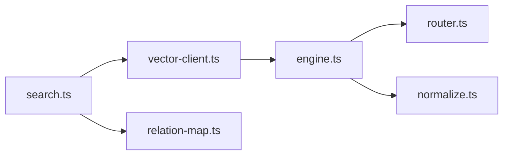

# 搜索模块

<cite>
**本文引用的文件**
- [src/search.ts](file://src/search.ts)
- [src/lib/vector-client.ts](file://src/lib/vector-client.ts)
- [src/zvec-engine/engine.ts](file://src/zvec-engine/engine.ts)
- [src/zvec-engine/search/router.ts](file://src/zvec-engine/search/router.ts)
- [src/zvec-engine/search/normalize.ts](file://src/zvec-engine/search/normalize.ts)
- [src/lib/relation-map.ts](file://src/lib/relation-map.ts)
- [docs/cli.md](file://docs/cli.md)
- [bin/ki.mjs](file://bin/ki.mjs)
</cite>

## 目录
1. [简介](#简介)
2. [项目结构](#项目结构)
3. [核心组件](#核心组件)
4. [架构总览](#架构总览)
5. [详细组件分析](#详细组件分析)
6. [依赖关系分析](#依赖关系分析)
7. [性能考虑](#性能考虑)
8. [故障排查指南](#故障排查指南)
9. [结论](#结论)
10. [附录：API 与使用示例](#附录api-与使用示例)

## 简介
本模块提供知识库的语义检索能力，采用“双路径查询机制”：优先走向量语义召回（稠密向量相似度），同时以 BM25 全文检索作为兜底；两路结果通过 RRF（Reciprocal Rank Fusion）融合排序，得到最终命中列表。此外，模块支持标签过滤、原文定位与多 chunk 去重，并提供 CLI/MCP 两种调用方式。

## 项目结构
搜索相关代码主要分布在以下位置：
- CLI 入口与编排：src/search.ts
- 向量客户端封装：src/lib/vector-client.ts
- 引擎路由与归一化：src/zvec-engine/search/router.ts、src/zvec-engine/search/normalize.ts
- 引擎门面与生命周期：src/zvec-engine/engine.ts
- 原文定位映射：src/lib/relation-map.ts
- 文档与命令说明：docs/cli.md、bin/ki.mjs

**图表来源**
- [src/search.ts:70-196](file://src/search.ts#L70-L196)
- [src/lib/vector-client.ts:477-506](file://src/lib/vector-client.ts#L477-L506)
- [src/zvec-engine/engine.ts:454-495](file://src/zvec-engine/engine.ts#L454-L495)
- [src/zvec-engine/search/router.ts:43-127](file://src/zvec-engine/search/router.ts#L43-L127)
- [src/zvec-engine/search/normalize.ts:16-63](file://src/zvec-engine/search/normalize.ts#L16-L63)
- [src/lib/relation-map.ts:48-78](file://src/lib/relation-map.ts#L48-L78)

**章节来源**
- [src/search.ts:1-248](file://src/search.ts#L1-L248)
- [src/lib/vector-client.ts:1-754](file://src/lib/vector-client.ts#L1-L754)
- [src/zvec-engine/engine.ts:1-569](file://src/zvec-engine/engine.ts#L1-L569)
- [src/zvec-engine/search/router.ts:1-191](file://src/zvec-engine/search/router.ts#L1-L191)
- [src/zvec-engine/search/normalize.ts:1-64](file://src/zvec-engine/search/normalize.ts#L1-L64)
- [src/lib/relation-map.ts:1-120](file://src/lib/relation-map.ts#L1-L120)
- [docs/cli.md:475-539](file://docs/cli.md#L475-L539)
- [bin/ki.mjs:75-113](file://bin/ki.mjs#L75-L113)

## 核心组件
- 搜索编排器（search.ts）：负责 scope/tag 解析、向量检索、原文定位、多 tag 去重与多 chunk 去重。
- 向量客户端（vector-client.ts）：封装 ZvecEngine，构建 hybridSearch 请求（queryText + fts + filter），并处理锁重试、空闲释放等工程细节。
- 引擎路由（router.ts）：根据是否传入 queryText/vector/fts 决定走单路向量、单路 FTS 或混合两路（RRF）。
- 分数归一化（normalize.ts）：将 COSINE 距离转换为相关性分数，FTS/Hybrid 分数直通。
- 原文定位（relation-map.ts）：基于 relations-cache.json 将 memoryId 反查为 group 与 relation，用于原文读取与去重。

**章节来源**
- [src/search.ts:20-47](file://src/search.ts#L20-L47)
- [src/lib/vector-client.ts:118-127](file://src/lib/vector-client.ts#L118-L127)
- [src/zvec-engine/search/router.ts:43-127](file://src/zvec-engine/search/router.ts#L43-L127)
- [src/zvec-engine/search/normalize.ts:16-63](file://src/zvec-engine/search/normalize.ts#L16-L63)
- [src/lib/relation-map.ts:23-28](file://src/lib/relation-map.ts#L23-L28)

## 架构总览
搜索请求从 CLI 进入，经 search.ts 组装参数后调用 vector-client.ts 的 hybridSearch；引擎内部 router.ts 判定是否需要 embed 文本，并将请求下发到 worker；worker 返回原始命中，engine 侧 normalize.ts 做分数归一化；search.ts 再结合 relation-map.ts 进行原文定位与去重，最终输出结果。

**图表来源**
- [src/search.ts:70-196](file://src/search.ts#L70-L196)
- [src/lib/vector-client.ts:477-506](file://src/lib/vector-client.ts#L477-L506)
- [src/zvec-engine/engine.ts:454-495](file://src/zvec-engine/engine.ts#L454-L495)
- [src/zvec-engine/search/router.ts:74-100](file://src/zvec-engine/search/router.ts#L74-L100)
- [src/zvec-engine/search/normalize.ts:38-63](file://src/zvec-engine/search/normalize.ts#L38-L63)
- [src/lib/relation-map.ts:48-78](file://src/lib/relation-map.ts#L48-L78)

## 详细组件分析

### 双路径查询机制（索引直查与语义检索兜底）
- 语义检索：通过 queryText 生成稠密向量，在 dense 字段上计算余弦相似度，返回候选集。
- 全文检索：通过 fts 字段（jieba 分词）进行 BM25 关键词匹配，返回候选集。
- 融合策略：当同时存在 queryText/vector 与 fts 时，走 multiQuery 两路召回，并使用 RRF 融合排序；若缺少任一，则退化为单路向量或单路 FTS。

**图表来源**
- [src/zvec-engine/search/router.ts:74-127](file://src/zvec-engine/search/router.ts#L74-L127)
- [src/zvec-engine/engine.ts:454-495](file://src/zvec-engine/engine.ts#L454-L495)

**章节来源**
- [src/zvec-engine/search/router.ts:43-127](file://src/zvec-engine/search/router.ts#L43-L127)
- [src/zvec-engine/engine.ts:454-495](file://src/zvec-engine/engine.ts#L454-L495)

### 混合检索算法（向量相似度、BM25、RRF 融合）
- 向量相似度：COSINE 距离归一化为 score = 1/(1+distance)，值域约 [1/3, 1]。
- BM25 全文：zvec 内部实现，分数越大越相关，不做转换。
- RRF 融合：对两路结果的排名位置进行倒数秩融合，rankConstant 默认 60；文档中建议阈值区间 0.02~0.03，因 RRF 上限约 0.033。

**图表来源**
- [src/zvec-engine/search/router.ts:43-127](file://src/zvec-engine/search/router.ts#L43-L127)
- [src/zvec-engine/search/normalize.ts:16-63](file://src/zvec-engine/search/normalize.ts#L16-L63)
- [src/zvec-engine/engine.ts:454-495](file://src/zvec-engine/engine.ts#L454-L495)

**章节来源**
- [src/zvec-engine/search/normalize.ts:16-63](file://src/zvec-engine/search/normalize.ts#L16-L63)
- [docs/cli.md:525-539](file://docs/cli.md#L525-L539)

### 标签过滤系统（优先级规则与匹配逻辑）
- 标签匹配：tags 为空时搜索全部；传入单个或多标签时以 OR 组合过滤（buildScopeTagFilter）。
- 默认搜索全部时的优先级：ki-search > ki-relation > ki-path；每个 tag 最多返回 limit 条，再按优先级合并。
- 标签大小写不敏感：写入与查询均转小写。

**图表来源**
- [src/search.ts:94-121](file://src/search.ts#L94-L121)
- [src/lib/vector-client.ts:621-628](file://src/lib/vector-client.ts#L621-L628)

**章节来源**
- [src/search.ts:20-29](file://src/search.ts#L20-L29)
- [src/search.ts:94-121](file://src/search.ts#L94-L121)
- [src/lib/vector-client.ts:218-223](file://src/lib/vector-client.ts#L218-L223)
- [src/lib/vector-client.ts:621-628](file://src/lib/vector-client.ts#L621-L628)

### 原文定位机制与结果去重策略
- 原文定位：通过 relation-map.ts 将 memoryId 反查为 group 与 relation，再从本地 KB 读取文件级原文；失败时降级返回向量 content 并提示。
- 多 tag 去重：同一 (group, relation) 可能因多 tag 写入产生多条命中，保留 score 最高的一条。
- 多 chunk 去重：同一文件多个 chunk 命中时，仅第一条携带 original，后续标记 deduplicated 并省略 original。

**图表来源**
- [src/search.ts:123-196](file://src/search.ts#L123-L196)
- [src/lib/relation-map.ts:48-78](file://src/lib/relation-map.ts#L48-L78)

**章节来源**
- [src/search.ts:123-196](file://src/search.ts#L123-L196)
- [src/lib/relation-map.ts:48-78](file://src/lib/relation-map.ts#L48-L78)

### 查询性能优化技巧
- 共享向量库与锁管理：支持撞锁重试与空闲释放锁，避免常驻 MCP 与 CLI 短命令争用导致阻塞。
- 引擎串行化：probe/create/open/close 等操作串行队列，防止原生并发竞态导致的永久阻塞。
- Embedding 批处理与去重：按固定批次调用 embedding provider，并在批内按 text 去重减少重复网络调用。
- 阈值过滤：通过 threshold 过滤低分命中，缓解混合检索召回过宽的问题。
- 缓存：relations-cache.json 的反查映射带 TTL 与 mtime/size 失效策略，降低 IO 开销。

**章节来源**
- [src/lib/vector-client.ts:88-104](file://src/lib/vector-client.ts#L88-L104)
- [src/lib/vector-client.ts:146-181](file://src/lib/vector-client.ts#L146-L181)
- [src/lib/vector-client.ts:187-216](file://src/lib/vector-client.ts#L187-L216)
- [src/zvec-engine/engine.ts:330-384](file://src/zvec-engine/engine.ts#L330-L384)
- [src/lib/relation-map.ts:8-17](file://src/lib/relation-map.ts#L8-L17)

### 常见查询场景的最佳实践
- 精确术语匹配：使用 --tags 指定 ki-relation 或 ki-path 缩小范围，提升命中率。
- 宽泛主题检索：使用默认搜索全部 tag，配合 --threshold 过滤低分结果（建议 0.02~0.03）。
- 需要原文：开启 --original，以便下游展示文件级原文并进行多 chunk 去重。
- 大库扫描：tag list 与 doc list 受 scanLimit 限制，注意 truncated 标志。

**章节来源**
- [docs/cli.md:475-539](file://docs/cli.md#L475-L539)

## 依赖关系分析
- search.ts 依赖 vector-client.ts 进行检索，依赖 relation-map.ts 进行原文定位。
- vector-client.ts 依赖 engine.ts 提供的 hybridSearch/semanticSearch/ftsSearch。
- engine.ts 依赖 router.ts 进行请求路由，依赖 normalize.ts 进行分数归一化。
- 配置与 scope 由 lib/config.ts 与 lib/scope.ts 提供（被 vector-client.ts 与 search.ts 引用）。

**图表来源**
- [src/search.ts:11-18](file://src/search.ts#L11-L18)
- [src/lib/vector-client.ts:21-31](file://src/lib/vector-client.ts#L21-L31)
- [src/zvec-engine/engine.ts:27-32](file://src/zvec-engine/engine.ts#L27-L32)

**章节来源**
- [src/search.ts:11-18](file://src/search.ts#L11-L18)
- [src/lib/vector-client.ts:21-31](file://src/lib/vector-client.ts#L21-L31)
- [src/zvec-engine/engine.ts:27-32](file://src/zvec-engine/engine.ts#L27-L32)

## 性能考虑
- 向量库锁竞争：通过撞锁重试与空闲释放锁，确保多进程共享向量库时的稳定性。
- 嵌入成本：embedding 批处理与批内去重显著减少网络开销。
- 阈值调优：RRF 融合分通常较小（0.0x 级别），合理设置 threshold 可平衡召回与精度。
- 缓存命中：relation-map 的 TTL 与 mtime/size 校验减少频繁 IO。

[本节为通用指导，无需具体文件引用]

## 故障排查指南
- 向量服务不可用：ensureVectorAvailable 会返回 code（LOCKED/CORRUPTED/PROBE_ERROR）与原因提示，按提示执行重建或等待锁释放。
- 锁冲突：出现 locked 时，检查是否有其他 ki mcp/server 或导入任务运行；必要时等待或清理残留。
- 损坏恢复：若向量库损坏，执行 restore/rebuild-vector 重建。
- 原文不可用：当 local KB 缺失 relation 或读取异常时，search.ts 会降级返回向量 content 并给出 hint。

**章节来源**
- [src/lib/vector-client.ts:420-467](file://src/lib/vector-client.ts#L420-L467)
- [src/search.ts:137-155](file://src/search.ts#L137-L155)

## 结论
该搜索模块通过“向量语义 + BM25 全文”的双路径召回与 RRF 融合排序，兼顾了语义理解与关键词匹配的鲁棒性；配合标签过滤、原文定位与多级去重，满足复杂知识检索需求。工程层面通过锁管理、批处理与缓存等手段保障高可用与高性能。

[本节为总结，无需具体文件引用]

## 附录：API 与使用示例
- CLI 命令：ki search
  - 参数：--scope、--query/-q、--limit、--threshold、--tags、--original
  - 示例：ki search "仪表盘配置" -s monitor
  - 输出包含 memoryId、content、score、tag、group、relation 等字段；开启 --original 后可获得文件级原文与去重标记。

- MCP 工具（参考 zvec-mcp-server）：
  - vector_query：单向量相似度检索
  - multi_vector_query：多向量检索 + 重排（weighted/rrf）

- 关键接口路径（源码）：
  - CLI 入口与参数解析：bin/ki.mjs
  - 搜索编排：src/search.ts
  - 向量检索封装：src/lib/vector-client.ts
  - 引擎路由与归一化：src/zvec-engine/search/router.ts、src/zvec-engine/search/normalize.ts

**章节来源**
- [docs/cli.md:475-539](file://docs/cli.md#L475-L539)
- [bin/ki.mjs:75-113](file://bin/ki.mjs#L75-L113)
- [src/search.ts:206-237](file://src/search.ts#L206-L237)
- [src/lib/vector-client.ts:477-506](file://src/lib/vector-client.ts#L477-L506)