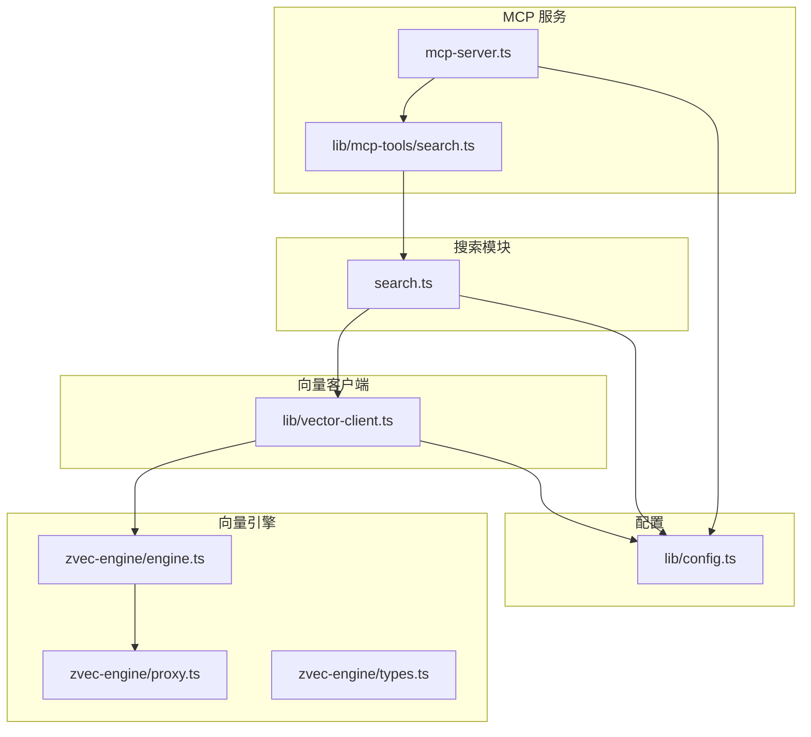
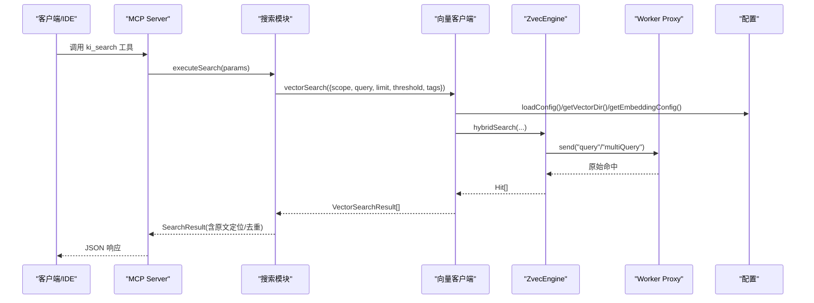
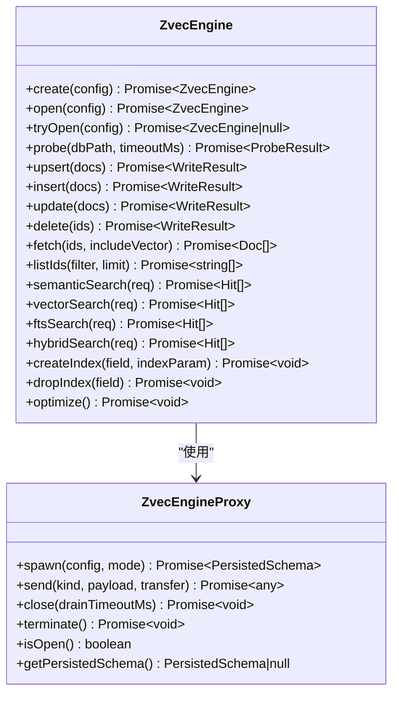
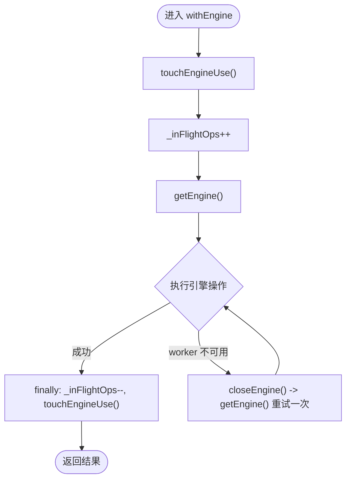
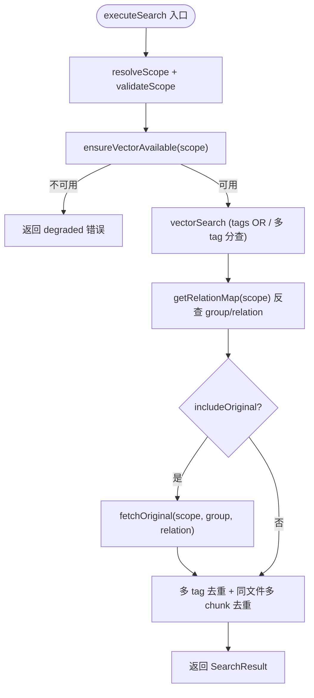
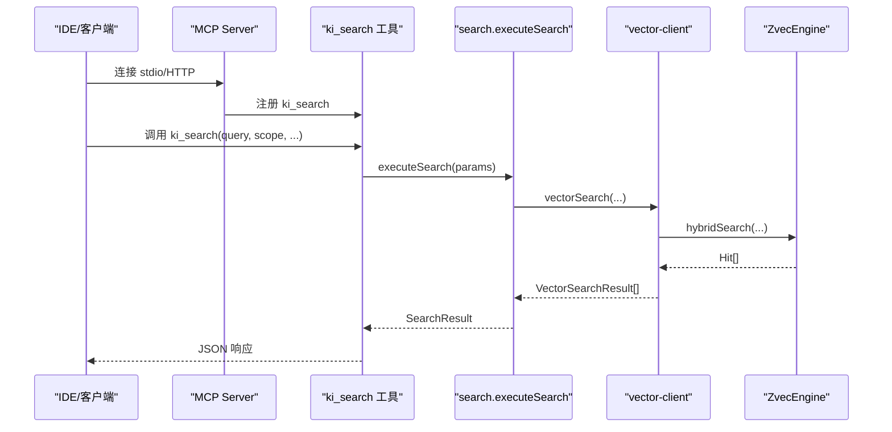
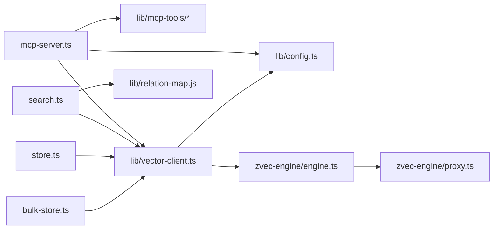
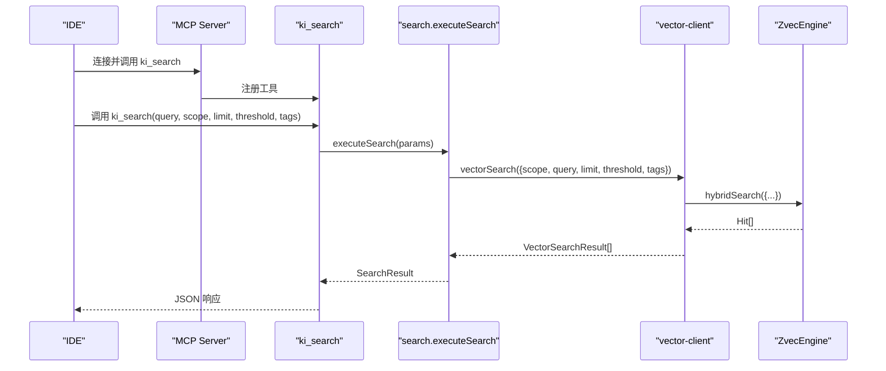
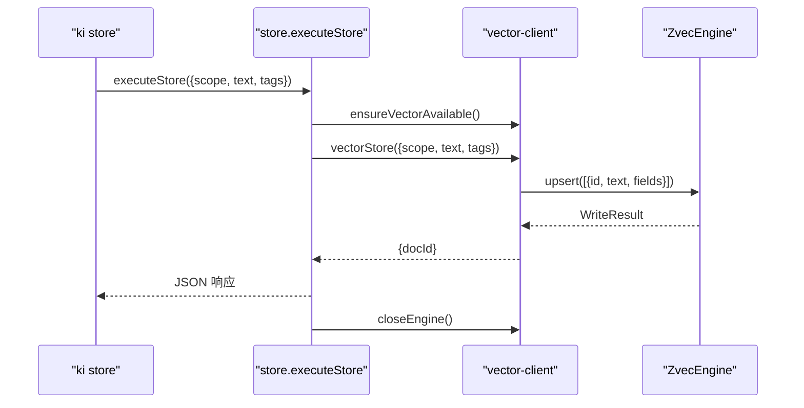
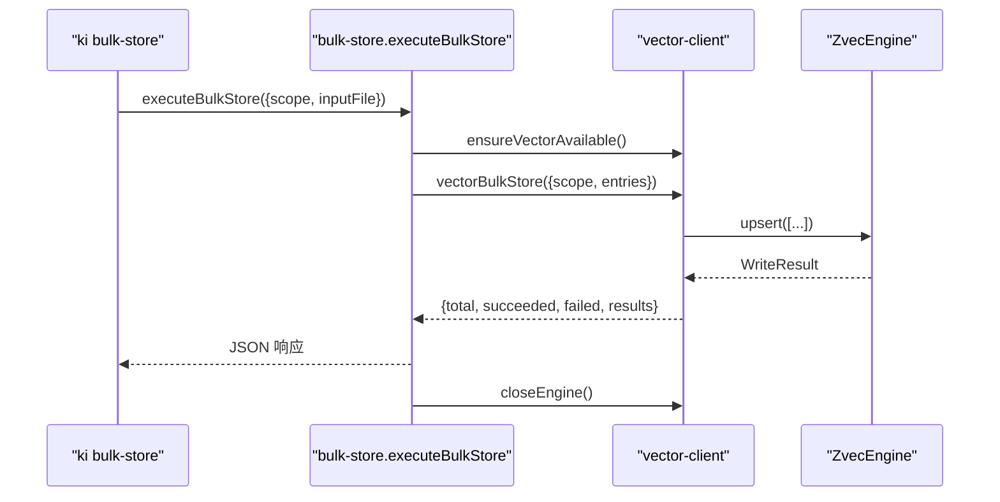

# 核心组件关系

<cite>
**本文引用的文件**
- [src/zvec-engine/index.ts](file://src/zvec-engine/index.ts)
- [src/zvec-engine/engine.ts](file://src/zvec-engine/engine.ts)
- [src/zvec-engine/proxy.ts](file://src/zvec-engine/proxy.ts)
- [src/zvec-engine/types.ts](file://src/zvec-engine/types.ts)
- [src/lib/vector-client.ts](file://src/lib/vector-client.ts)
- [src/search.ts](file://src/search.ts)
- [src/mcp-server.ts](file://src/mcp-server.ts)
- [src/lib/config.ts](file://src/lib/config.ts)
- [src/store.ts](file://src/store.ts)
- [src/bulk-store.ts](file://src/bulk-store.ts)
- [src/lib/mcp-tools/search.ts](file://src/lib/mcp-tools/search.ts)
</cite>

## 目录
1. [简介](#简介)
2. [项目结构](#项目结构)
3. [核心组件](#核心组件)
4. [架构总览](#架构总览)
5. [详细组件分析](#详细组件分析)
6. [依赖关系分析](#依赖关系分析)
7. [性能考量](#性能考量)
8. [故障排查指南](#故障排查指南)
9. [结论](#结论)
10. [附录：调用时序与协作示例](#附录调用时序与协作示例)

## 简介
本文件聚焦 knowledge-indexer 的核心组件关系，围绕“向量引擎、搜索模块、存储层、MCP 服务”四大核心展开，说明它们之间的依赖关系、消息传递机制、数据流转过程与错误处理策略。同时总结单例模式、工厂模式等设计模式的应用场景，并通过类图与时序图帮助开发者理解系统的模块化设计与协作方式。

## 项目结构
knowledge-indexer 采用分层与职责分离的组织方式：
- 向量引擎层（zvec-engine）：封装底层 worker 与原生操作，提供 create/open/检索/写入/生命周期管理。
- 向量客户端层（lib/vector-client）：面向 CLI/MCP 的异步接口，负责配置解析、engine 单例、撞锁重试、空闲释放锁、过滤构建、结果归一化。
- 搜索模块（search）：组合向量检索、关系映射、原文召回、多 tag 去重等上层业务逻辑。
- MCP 服务（mcp-server）：注册工具、启动 stdio/HTTP 传输、鉴权、健康检查、进程守护与资源清理。
- 配置中心（lib/config）：统一加载 YAML/JSON 配置，解析 scope/embedding/vectorDir 等关键路径与策略。
- CLI 命令（store/bulk-store）：基于 vector-client 暴露命令行能力。

图表来源
- [src/mcp-server.ts:54-70](file://src/mcp-server.ts#L54-L70)
- [src/lib/mcp-tools/search.ts:6-49](file://src/lib/mcp-tools/search.ts#L6-L49)
- [src/search.ts:70-199](file://src/search.ts#L70-L199)
- [src/lib/vector-client.ts:314-340](file://src/lib/vector-client.ts#L314-L340)
- [src/zvec-engine/engine.ts:97-131](file://src/zvec-engine/engine.ts#L97-L131)
- [src/zvec-engine/proxy.ts:56-109](file://src/zvec-engine/proxy.ts#L56-L109)
- [src/lib/config.ts:148-175](file://src/lib/config.ts#L148-L175)

章节来源
- [src/mcp-server.ts:54-70](file://src/mcp-server.ts#L54-L70)
- [src/lib/mcp-tools/search.ts:6-49](file://src/lib/mcp-tools/search.ts#L6-L49)
- [src/search.ts:70-199](file://src/search.ts#L70-L199)
- [src/lib/vector-client.ts:314-340](file://src/lib/vector-client.ts#L314-L340)
- [src/zvec-engine/engine.ts:97-131](file://src/zvec-engine/engine.ts#L97-L131)
- [src/zvec-engine/proxy.ts:56-109](file://src/zvec-engine/proxy.ts#L56-L109)
- [src/lib/config.ts:148-175](file://src/lib/config.ts#L148-L175)

## 核心组件
- 向量引擎（ZvecEngine）：通过工厂方法 create/open 创建实例，内部使用 proxy 与 worker 通信，实现嵌入、写入、检索、索引管理等。
- 向量客户端（vector-client）：对外暴露 vectorSearch/vectorStore/vectorBulkStore 等接口；维护进程内 engine 单例；处理撞锁重试、空闲释放锁、scope/tag 过滤、结果归一化。
- 搜索模块（search）：组合 vectorSearch、relation-map、原文召回、多 tag 去重、阈值过滤等，输出统一的搜索结果。
- MCP 服务（mcp-server）：注册 ki_search 等工具，支持 stdio/HTTP 两种传输；在 HTTP 模式下提供鉴权、健康检查、进程守护；在 stdio 模式下与 IDE 交互。
- 配置（config）：集中管理 dataDir/backupDir/vectorDir/embedding/scopeMode/scopes/mcp.http 等，提供 resolveScope/getVectorDir/getEmbeddingConfig 等辅助函数。
- CLI 命令（store/bulk-store）：基于 vector-client 提供文本存储与批量存储能力，并在 per-call 结束时关闭 engine。

章节来源
- [src/zvec-engine/engine.ts:97-131](file://src/zvec-engine/engine.ts#L97-L131)
- [src/lib/vector-client.ts:477-506](file://src/lib/vector-client.ts#L477-L506)
- [src/search.ts:70-199](file://src/search.ts#L70-L199)
- [src/mcp-server.ts:54-70](file://src/mcp-server.ts#L54-L70)
- [src/lib/config.ts:148-175](file://src/lib/config.ts#L148-L175)
- [src/store.ts:23-51](file://src/store.ts#L23-L51)
- [src/bulk-store.ts:32-78](file://src/bulk-store.ts#L32-L78)

## 架构总览
系统以“MCP 服务”为入口，将用户请求路由到“搜索模块”，后者调用“向量客户端”进行检索或存储，最终由“向量引擎”完成实际的向量化、索引与查询。配置模块贯穿各层，提供路径、范围隔离与嵌入模型参数。

图表来源
- [src/mcp-server.ts:54-70](file://src/mcp-server.ts#L54-L70)
- [src/lib/mcp-tools/search.ts:6-49](file://src/lib/mcp-tools/search.ts#L6-L49)
- [src/search.ts:70-199](file://src/search.ts#L70-L199)
- [src/lib/vector-client.ts:477-506](file://src/lib/vector-client.ts#L477-L506)
- [src/zvec-engine/engine.ts:454-495](file://src/zvec-engine/engine.ts#L454-L495)
- [src/zvec-engine/proxy.ts:114-126](file://src/zvec-engine/proxy.ts#L114-L126)
- [src/lib/config.ts:148-175](file://src/lib/config.ts#L148-L175)

## 详细组件分析

### 向量引擎（ZvecEngine）
- 工厂模式：create/open 静态方法负责校验配置、创建/打开集合、返回引擎实例；tryOpen 用于布尔可用性判断。
- 工作线程代理：proxy 负责 spawn worker、消息路由、状态机（init/opening/open/closing/closed/crashed/failed）、crash 处理与 drain。
- 写入编排：按是否需要 embed 切分文档，批大小控制失败粒度，字段白名单校验，维度一致性校验。
- 检索编排：router 选择 query/multiQuery，必要时在主线程执行 embedding，注入 filterSql，归一化为 Hit。
- 生命周期：close/destroy/isHealthy/isLocked/isOpen/probe 提供完整生命周期管理。

图表来源
- [src/zvec-engine/engine.ts:97-131](file://src/zvec-engine/engine.ts#L97-L131)
- [src/zvec-engine/engine.ts:243-294](file://src/zvec-engine/engine.ts#L243-L294)
- [src/zvec-engine/engine.ts:454-495](file://src/zvec-engine/engine.ts#L454-L495)
- [src/zvec-engine/proxy.ts:56-109](file://src/zvec-engine/proxy.ts#L56-L109)
- [src/zvec-engine/proxy.ts:114-177](file://src/zvec-engine/proxy.ts#L114-L177)
- [src/zvec-engine/types.ts:41-61](file://src/zvec-engine/types.ts#L41-L61)

章节来源
- [src/zvec-engine/engine.ts:97-131](file://src/zvec-engine/engine.ts#L97-L131)
- [src/zvec-engine/engine.ts:243-294](file://src/zvec-engine/engine.ts#L243-L294)
- [src/zvec-engine/engine.ts:454-495](file://src/zvec-engine/engine.ts#L454-L495)
- [src/zvec-engine/proxy.ts:56-109](file://src/zvec-engine/proxy.ts#L56-L109)
- [src/zvec-engine/proxy.ts:114-177](file://src/zvec-engine/proxy.ts#L114-L177)
- [src/zvec-engine/types.ts:41-61](file://src/zvec-engine/types.ts#L41-L61)

### 向量客户端（vector-client）
- 单例模式：进程内缓存 _enginePromise，确保同一进程共享一个 engine 实例，避免重复 open 导致的锁冲突。
- 撞锁重试：probeWithRetry 检测 locked 时等待并重试，使多实例可错开共享向量库。
- 空闲释放锁：enableIdleClose 在常驻 MCP 中启用定时器，空闲超时后 closeEngine 释放 LOCK，让其他实例抢占。
- 过滤构建：buildScopeTagFilter 将 scope 必等与 tag OR 组合成 Filter，支持大小写忽略（tag 小写化）。
- 结果归一化：vectorSearch 将 Hit 转换为 VectorSearchResult，并支持阈值过滤。

图表来源
- [src/lib/vector-client.ts:389-407](file://src/lib/vector-client.ts#L389-L407)
- [src/lib/vector-client.ts:314-340](file://src/lib/vector-client.ts#L314-L340)
- [src/lib/vector-client.ts:420-467](file://src/lib/vector-client.ts#L420-L467)
- [src/lib/vector-client.ts:477-506](file://src/lib/vector-client.ts#L477-L506)

章节来源
- [src/lib/vector-client.ts:314-340](file://src/lib/vector-client.ts#L314-L340)
- [src/lib/vector-client.ts:389-407](file://src/lib/vector-client.ts#L389-L407)
- [src/lib/vector-client.ts:420-467](file://src/lib/vector-client.ts#L420-L467)
- [src/lib/vector-client.ts:477-506](file://src/lib/vector-client.ts#L477-L506)

### 搜索模块（search）
- 流程：解析 scope → 检测向量可用性 → 执行 vectorSearch（支持显式 tags 或多 tag 分查）→ 反查 relation-map 获取 group/relation → 可选原文召回 → 多 tag 去重 → 同文件多 chunk 去重。
- 降级策略：原文不可用时以向量 content 兜底，并附带提示。
- 优先级：默认搜索全部时按 TAG_PRIORITY 排序（ki-search > ki-relation > ki-path）。

图表来源
- [src/search.ts:70-199](file://src/search.ts#L70-L199)

章节来源
- [src/search.ts:70-199](file://src/search.ts#L70-L199)

### MCP 服务（mcp-server）
- 工具注册：buildKiMcpServer 注册 search、store、bulk-store、manage-index、sync-relation 等工具。
- 传输模式：stdio（默认，单客户端单进程）与 HTTP（共享单例，支持鉴权、健康检查、前端页面）。
- 进程守护：restart/stop/status 子命令管理 HTTP 单例；stdio 守卫防止与 HTTP 单例争抢向量库锁。
- 安全：非回环绑定强制 Token 鉴权；allowedHosts 防护 DNS rebinding。

图表来源
- [src/mcp-server.ts:54-70](file://src/mcp-server.ts#L54-L70)
- [src/lib/mcp-tools/search.ts:6-49](file://src/lib/mcp-tools/search.ts#L6-L49)
- [src/search.ts:70-199](file://src/search.ts#L70-L199)
- [src/lib/vector-client.ts:477-506](file://src/lib/vector-client.ts#L477-L506)
- [src/zvec-engine/engine.ts:454-495](file://src/zvec-engine/engine.ts#L454-L495)

章节来源
- [src/mcp-server.ts:54-70](file://src/mcp-server.ts#L54-L70)
- [src/lib/mcp-tools/search.ts:6-49](file://src/lib/mcp-tools/search.ts#L6-L49)

### 配置模块（config）
- 加载策略：优先 --config，其次 ~/.ki/config.yaml/yml/json，最后内置默认值。
- 路径解析：$HOME/~/ 展开，相对路径相对于配置文件所在目录。
- 关键项：dataDir/backupDir/vectorDir/embedding/scopeMode/scopes/mcp.http。
- 护栏：resolveScope 在 strict 模式下强制显式且注册的 scope。

章节来源
- [src/lib/config.ts:148-175](file://src/lib/config.ts#L148-L175)
- [src/lib/config.ts:244-359](file://src/lib/config.ts#L244-L359)
- [src/lib/config.ts:419-459](file://src/lib/config.ts#L419-L459)

### CLI 命令（store/bulk-store）
- store：单条存储，per-call 结束后关闭 engine。
- bulk-store：批量存储，读取 JSON 数组，逐项校验，返回逐条结果。

章节来源
- [src/store.ts:23-51](file://src/store.ts#L23-L51)
- [src/bulk-store.ts:32-78](file://src/bulk-store.ts#L32-L78)

## 依赖关系分析
- mcp-server 依赖 lib/mcp-tools/* 注册工具，依赖 vector-client 的生命周期管理（closeEngine/enableIdleClose），依赖 config 与 health-check/version-guard。
- search 依赖 vector-client 的检索与可用性检测，依赖 relation-map 与 store（读本地 KB）。
- vector-client 依赖 zvec-engine（dist 产物）与 config/scope/interrupt。
- zvec-engine 依赖 proxy（worker 通信）、filter/compiler、search/router、schema/validator、types/errors。

图表来源
- [src/mcp-server.ts:54-70](file://src/mcp-server.ts#L54-L70)
- [src/search.ts:70-199](file://src/search.ts#L70-L199)
- [src/lib/vector-client.ts:314-340](file://src/lib/vector-client.ts#L314-L340)
- [src/zvec-engine/engine.ts:97-131](file://src/zvec-engine/engine.ts#L97-L131)
- [src/zvec-engine/proxy.ts:56-109](file://src/zvec-engine/proxy.ts#L56-L109)
- [src/store.ts:23-51](file://src/store.ts#L23-L51)
- [src/bulk-store.ts:32-78](file://src/bulk-store.ts#L32-L78)

章节来源
- [src/mcp-server.ts:54-70](file://src/mcp-server.ts#L54-L70)
- [src/search.ts:70-199](file://src/search.ts#L70-L199)
- [src/lib/vector-client.ts:314-340](file://src/lib/vector-client.ts#L314-L340)
- [src/zvec-engine/engine.ts:97-131](file://src/zvec-engine/engine.ts#L97-L131)
- [src/zvec-engine/proxy.ts:56-109](file://src/zvec-engine/proxy.ts#L56-L109)
- [src/store.ts:23-51](file://src/store.ts#L23-L51)
- [src/bulk-store.ts:32-78](file://src/bulk-store.ts#L32-L78)

## 性能考量
- 嵌入批大小：engine 内部按 EMBED_BATCH_SIZE=64 切分，失败粒度最小化，减少网络抖动影响。
- 撞锁重试：vector-client 对 locked 状态进行有限次重试，提升多实例共享时的成功率。
- 空闲释放锁：常驻 MCP 启用空闲释放，降低锁竞争，提高并发利用率。
- 序列化引擎操作：_engineOpTail 串行化 probe/create/open/close，避免原生竞态导致永久阻塞。
- 超时保护：withOpenTimeout 限制 open 时间，避免挂死。

[本节为通用指导，不直接分析具体文件]

## 故障排查指南
- 向量库被占用：ensureVectorAvailable 返回 code='LOCKED'，提示停止其他进程或等待释放；CLI 会打印引导信息。
- 向量库损坏：code='CORRUPTED'，建议重建向量库。
- Worker 不可用：isWorkerUnavailable 识别 worker not open 等错误，自动重置并重试一次。
- 配置缺失：embedding.apiKey 未配置时 fail-loud，避免跨提供商误用密钥。
- 启动预检：mcp-server 启动前运行健康检查，失败则拒绝启动。

章节来源
- [src/lib/vector-client.ts:420-467](file://src/lib/vector-client.ts#L420-L467)
- [src/lib/vector-client.ts:373-377](file://src/lib/vector-client.ts#L373-L377)
- [src/lib/vector-client.ts:247-266](file://src/lib/vector-client.ts#L247-L266)
- [src/mcp-server.ts:660-678](file://src/mcp-server.ts#L660-L678)

## 结论
knowledge-indexer 通过清晰的层次划分与职责边界，实现了可扩展的知识检索与存储能力。向量引擎提供稳定的底层能力，向量客户端封装了单例、重试、空闲释放等工程实践，搜索模块整合业务逻辑，MCP 服务提供统一的接入面。配置模块贯穿全局，保障一致性与可维护性。整体设计兼顾性能、健壮性与易用性。

[本节为总结，不直接分析具体文件]

## 附录：调用时序与协作示例

### 搜索调用时序（MCP → 搜索 → 向量引擎）

图表来源
- [src/mcp-server.ts:54-70](file://src/mcp-server.ts#L54-L70)
- [src/lib/mcp-tools/search.ts:6-49](file://src/lib/mcp-tools/search.ts#L6-L49)
- [src/search.ts:70-199](file://src/search.ts#L70-L199)
- [src/lib/vector-client.ts:477-506](file://src/lib/vector-client.ts#L477-L506)
- [src/zvec-engine/engine.ts:454-495](file://src/zvec-engine/engine.ts#L454-L495)

### 存储调用时序（CLI → 向量客户端 → 向量引擎）

图表来源
- [src/store.ts:23-51](file://src/store.ts#L23-L51)
- [src/lib/vector-client.ts:513-542](file://src/lib/vector-client.ts#L513-L542)
- [src/zvec-engine/engine.ts:243-294](file://src/zvec-engine/engine.ts#L243-L294)

### 批量存储调用时序

图表来源
- [src/bulk-store.ts:32-78](file://src/bulk-store.ts#L32-L78)
- [src/lib/vector-client.ts:547-590](file://src/lib/vector-client.ts#L547-L590)
- [src/zvec-engine/engine.ts:243-294](file://src/zvec-engine/engine.ts#L243-L294)