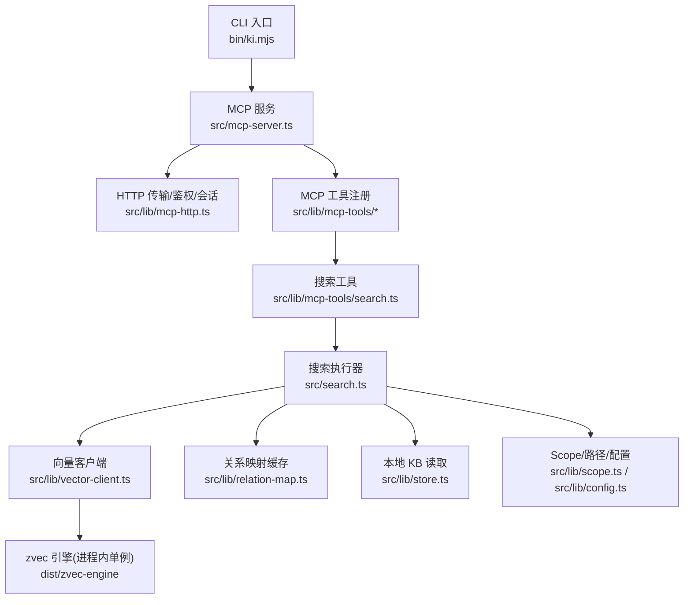
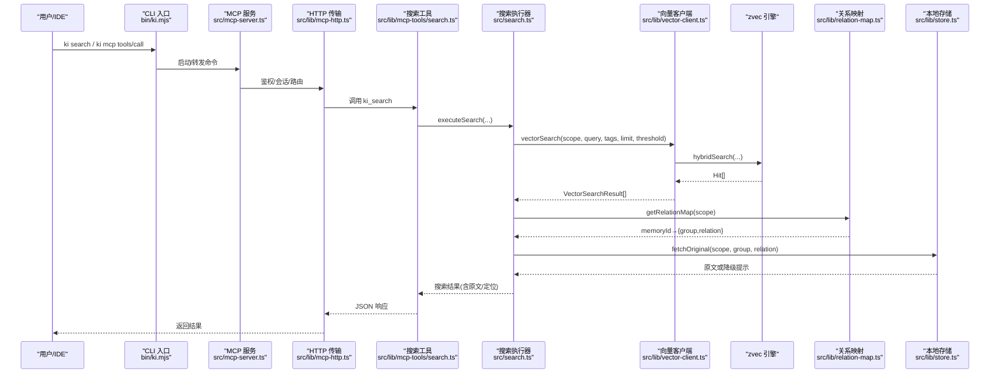
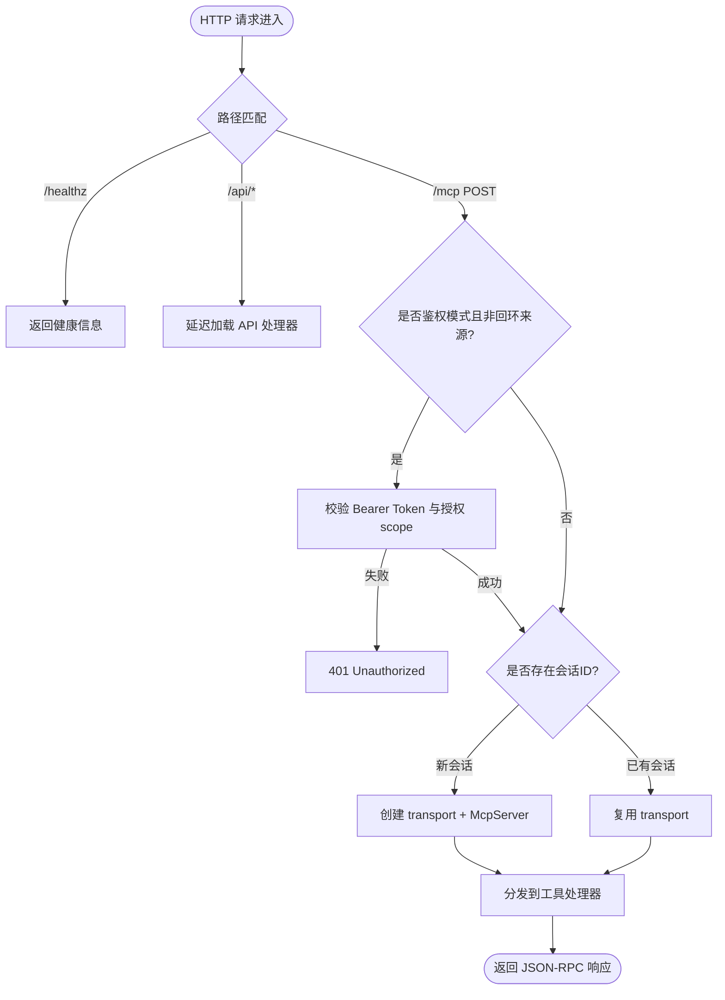
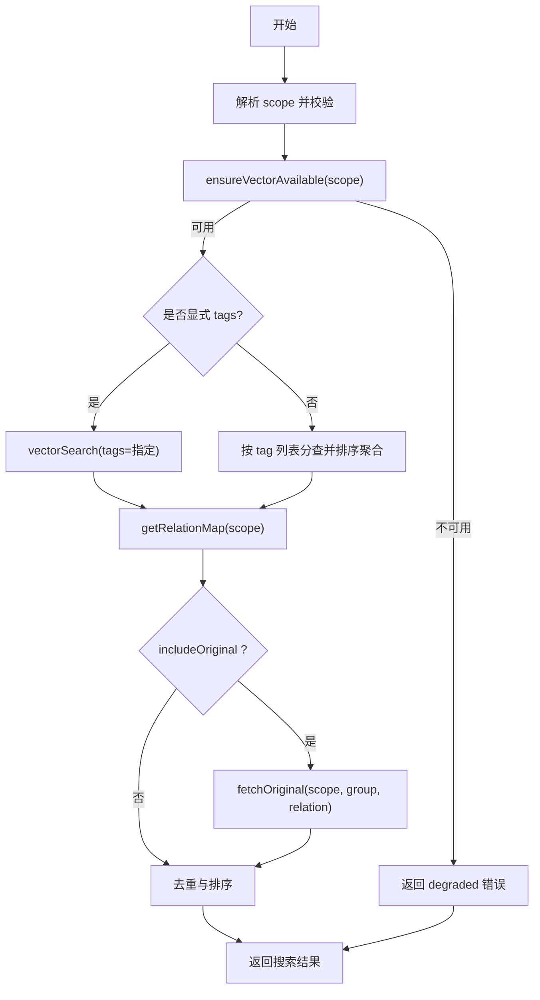
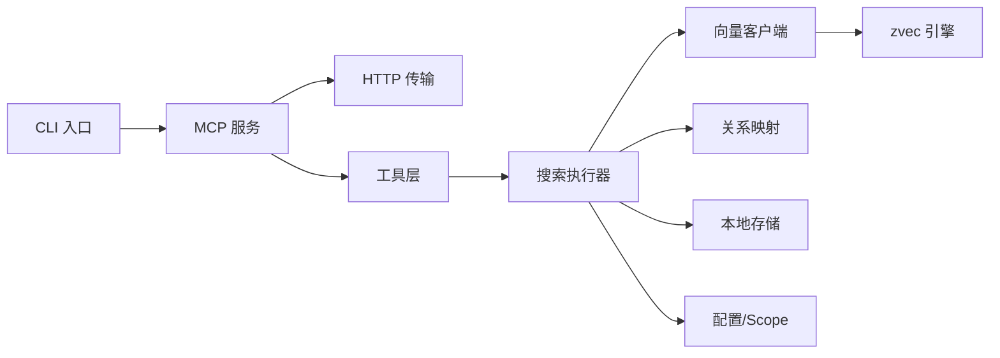
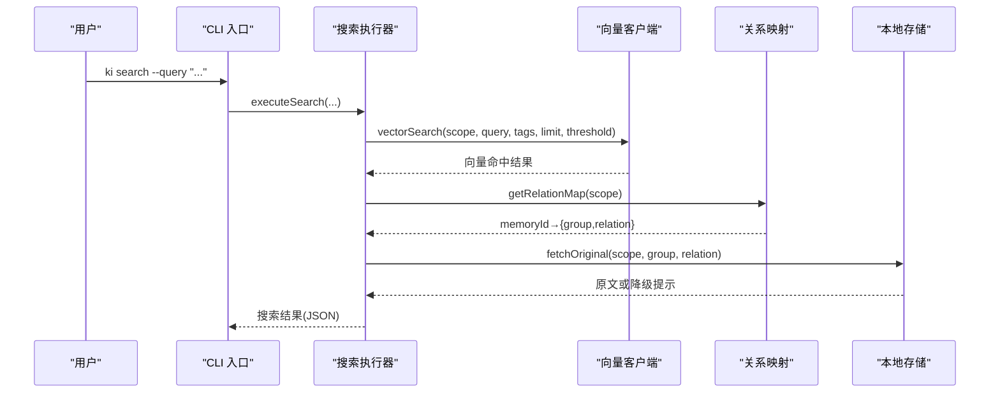
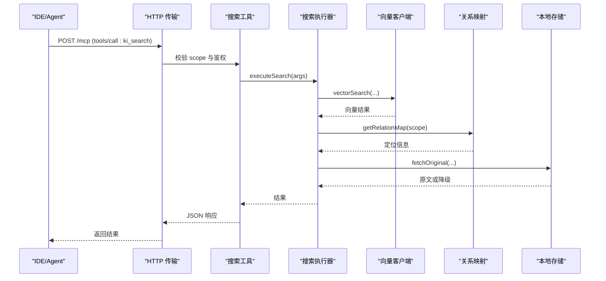
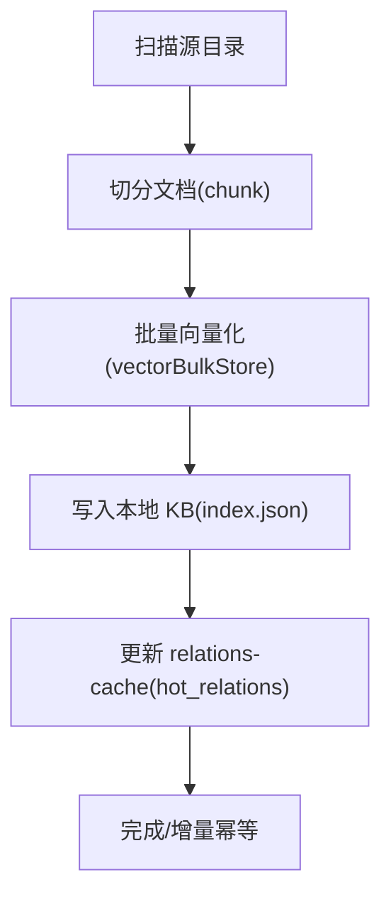

# 组件交互模式

<cite>
**本文引用的文件**
- [bin/ki.mjs](file://bin/ki.mjs)
- [src/mcp-server.ts](file://src/mcp-server.ts)
- [src/lib/mcp-http.ts](file://src/lib/mcp-http.ts)
- [src/lib/vector-client.ts](file://src/lib/vector-client.ts)
- [src/search.ts](file://src/search.ts)
- [src/lib/relation-map.ts](file://src/lib/relation-map.ts)
- [src/lib/store.ts](file://src/lib/store.ts)
- [src/lib/scope.ts](file://src/lib/scope.ts)
- [src/lib/config.ts](file://src/lib/config.ts)
- [src/lib/mcp-tools/search.ts](file://src/lib/mcp-tools/search.ts)
</cite>

## 目录
1. [简介](#简介)
2. [项目结构](#项目结构)
3. [核心组件](#核心组件)
4. [架构总览](#架构总览)
5. [详细组件分析](#详细组件分析)
6. [依赖关系分析](#依赖关系分析)
7. [性能与并发特性](#性能与并发特性)
8. [故障排查指南](#故障排查指南)
9. [结论](#结论)
10. [附录：典型调用链路与时序图](#附录典型调用链路与时序图)

## 简介
本文件聚焦 kisearch（知识索引系统）的“组件交互模式”，围绕以下目标展开：
- 说明各核心组件之间的依赖关系与调用时序
- 解释消息传递机制与数据流转过程
- 描述错误传播策略与异常处理模式
- 说明单例模式与工厂模式在组件协作中的应用
- 详细介绍异步操作的处理方式与资源管理机制
- 展示组件间的解耦设计与接口契约
- 提供完整的调用链路图和时序图，帮助开发者理解整体架构
- 展示典型业务场景下的组件协作示例

## 项目结构
kisearch 采用“命令入口 + MCP 服务 + 向量引擎适配层 + 本地存储/配置”的分层组织：
- CLI 入口：统一分发命令到具体实现脚本
- MCP 服务：stdio/HTTP 两种传输，注册工具并路由到业务逻辑
- 向量客户端：封装 zvec 引擎，提供检索、存储、管理面能力
- 本地存储与配置：scope/kb 路径、group-index/relations-cache、WAL 写入、配置加载
- 工具层：MCP 工具按职责拆分，复用搜索、同步、管理等核心函数

图表来源
- [bin/ki.mjs:29-49](file://bin/ki.mjs#L29-L49)
- [src/mcp-server.ts:54-71](file://src/mcp-server.ts#L54-L71)
- [src/lib/mcp-http.ts:344-607](file://src/lib/mcp-http.ts#L344-L607)
- [src/lib/mcp-tools/search.ts:6-49](file://src/lib/mcp-tools/search.ts#L6-L49)
- [src/search.ts:70-199](file://src/search.ts#L70-L199)
- [src/lib/vector-client.ts:314-340](file://src/lib/vector-client.ts#L314-L340)
- [src/lib/relation-map.ts:48-78](file://src/lib/relation-map.ts#L48-L78)
- [src/lib/store.ts:23-62](file://src/lib/store.ts#L23-L62)
- [src/lib/scope.ts:49-77](file://src/lib/scope.ts#L49-L77)
- [src/lib/config.ts:148-175](file://src/lib/config.ts#L148-L175)

章节来源
- [bin/ki.mjs:29-49](file://bin/ki.mjs#L29-L49)
- [src/mcp-server.ts:54-71](file://src/mcp-server.ts#L54-L71)

## 核心组件
- CLI 入口（ki.mjs）：解析命令与参数，转发到对应脚本；支持守护进程模式与信号透传
- MCP 服务（mcp-server.ts）：构建 McpServer，注册全部工具；支持 stdio 与 HTTP 共享单例
- HTTP 传输（mcp-http.ts）：Streamable HTTP 传输、鉴权、会话管理、静态页面、健康检查、锁文件
- 向量客户端（vector-client.ts）：ZvecEngine 封装，提供检索/存储/删除/枚举等能力；进程内单例、空闲释放锁、撞锁重试
- 搜索执行器（search.ts）：语义检索主流程，含标签优先级、原文召回、去重、降级
- 关系映射（relation-map.ts）：memoryId → {group, relation} 反查映射，带 TTL 与 mtime/size 失效
- 本地存储（store.ts）：JSON 读写、WAL 写入、scope 初始化、旧格式迁移
- Scope/配置（scope.ts / config.ts）：scope 校验、路径构造、配置加载与默认值、scope 护栏模式

章节来源
- [bin/ki.mjs:29-49](file://bin/ki.mjs#L29-L49)
- [src/mcp-server.ts:54-71](file://src/mcp-server.ts#L54-L71)
- [src/lib/mcp-http.ts:344-607](file://src/lib/mcp-http.ts#L344-L607)
- [src/lib/vector-client.ts:314-340](file://src/lib/vector-client.ts#L314-L340)
- [src/search.ts:70-199](file://src/search.ts#L70-L199)
- [src/lib/relation-map.ts:48-78](file://src/lib/relation-map.ts#L48-L78)
- [src/lib/store.ts:23-62](file://src/lib/store.ts#L23-L62)
- [src/lib/scope.ts:49-77](file://src/lib/scope.ts#L49-L77)
- [src/lib/config.ts:148-175](file://src/lib/config.ts#L148-L175)

## 架构总览
系统以“请求驱动”的方式组织交互：
- 外部通过 CLI 或 MCP 协议发起请求
- MCP 服务负责鉴权与会话，将工具调用路由到具体业务逻辑
- 搜索/同步等核心逻辑调用向量客户端进行混合检索与存储
- 结果通过 relations-cache 定位 group/relation，必要时回读本地 KB 原文
- 所有持久化写操作通过 WAL 保证原子性；向量库通过单例+空闲释放锁实现多实例错开共享

图表来源
- [bin/ki.mjs:29-49](file://bin/ki.mjs#L29-L49)
- [src/mcp-server.ts:54-71](file://src/mcp-server.ts#L54-L71)
- [src/lib/mcp-http.ts:412-577](file://src/lib/mcp-http.ts#L412-L577)
- [src/lib/mcp-tools/search.ts:6-49](file://src/lib/mcp-tools/search.ts#L6-L49)
- [src/search.ts:70-199](file://src/search.ts#L70-L199)
- [src/lib/vector-client.ts:477-506](file://src/lib/vector-client.ts#L477-L506)
- [src/lib/relation-map.ts:48-78](file://src/lib/relation-map.ts#L48-L78)
- [src/lib/store.ts:23-62](file://src/lib/store.ts#L23-L62)

## 详细组件分析

### MCP 服务与 HTTP 传输
- 单例与工厂：buildKiMcpServer 作为工厂，每个 HTTP 会话创建独立 McpServer，但共享 vector-client 的模块级单例 engine
- 鉴权与会话：非回环绑定强制 Bearer Token；会话空闲回收、最大会话数保护；/healthz 暴露健康信息
- 幂等启动：先探活已有健康实例则复用退出；写 lock 文件便于诊断与重启
- 安全边界：tools/call 的 scope 越权校验集中在 HTTP 层，避免分散到工具层

图表来源
- [src/lib/mcp-http.ts:412-577](file://src/lib/mcp-http.ts#L412-L577)
- [src/mcp-server.ts:54-71](file://src/mcp-server.ts#L54-L71)

章节来源
- [src/mcp-server.ts:54-71](file://src/mcp-server.ts#L54-L71)
- [src/lib/mcp-http.ts:344-607](file://src/lib/mcp-http.ts#L344-L607)

### 搜索执行器与向量客户端
- 搜索流程：scope 解析 → 可用性检测 → 标签分查/合并 → 向量检索 → 关系映射反查 → 原文召回 → 去重与降级
- 向量客户端：进程内单例 engine，串行化 probe/open/close，空闲释放锁，撞锁重试；hybridSearch 融合语义+FTS+RRF
- 原文召回：优先从 local KB 读取文件级原文；缺失时降级为向量 content 并给出提示
- 标签优先级：默认全量搜索时按 ki-search > ki-relation > ki-path 顺序聚合

图表来源
- [src/search.ts:70-199](file://src/search.ts#L70-L199)
- [src/lib/vector-client.ts:420-467](file://src/lib/vector-client.ts#L420-L467)
- [src/lib/vector-client.ts:477-506](file://src/lib/vector-client.ts#L477-L506)
- [src/lib/relation-map.ts:48-78](file://src/lib/relation-map.ts#L48-L78)
- [src/lib/store.ts:23-62](file://src/lib/store.ts#L23-L62)

章节来源
- [src/search.ts:70-199](file://src/search.ts#L70-L199)
- [src/lib/vector-client.ts:420-467](file://src/lib/vector-client.ts#L420-L467)
- [src/lib/vector-client.ts:477-506](file://src/lib/vector-client.ts#L477-L506)
- [src/lib/relation-map.ts:48-78](file://src/lib/relation-map.ts#L48-L78)
- [src/lib/store.ts:23-62](file://src/lib/store.ts#L23-L62)

### 本地存储与 WAL
- JSON 读写：readJson 解析并做 version 兼容检查；writeJson 自动注入 version 与 updatedAt，并通过 WAL 写入
- Scope 初始化：ensureScopeDir 根据 scopeMode 校验并初始化 kb/{scope}；initScope 从模板复制 group-index.json 与 relations-cache.json
- 旧格式迁移：自动迁移 roots→groups，并清理 relations-cache 旧 key

章节来源
- [src/lib/store.ts:23-62](file://src/lib/store.ts#L23-L62)
- [src/lib/store.ts:168-267](file://src/lib/store.ts#L168-L267)

### Scope 与配置
- Scope 校验：validateScope 限制字符集，防止路径穿越；getKbDir/getGroupIndexPath/getRelationsCachePath 构造路径
- 配置加载：loadConfig 支持 YAML/JSON，路径展开与默认值；resolveScope 实现 default/strict 模式护栏
- 嵌入配置：embedding.provider/baseURL/model/dimension/apiKey 解析，apiKey 支持 ${VAR} 引用

章节来源
- [src/lib/scope.ts:30-77](file://src/lib/scope.ts#L30-L77)
- [src/lib/config.ts:148-175](file://src/lib/config.ts#L148-L175)
- [src/lib/config.ts:244-359](file://src/lib/config.ts#L244-L359)
- [src/lib/config.ts:444-459](file://src/lib/config.ts#L444-L459)

## 依赖关系分析
- CLI 入口依赖命令映射，将子进程任务委派给具体脚本
- MCP 服务依赖工具注册与 HTTP 传输；工具层依赖搜索执行器
- 搜索执行器依赖向量客户端、关系映射、本地存储与配置
- 向量客户端依赖 zvec 引擎（编译产物 dist），并提供进程内单例与空闲释放锁
- 本地存储依赖 WAL 与 scope 路径构造
- 配置模块被多处复用，确保路径与模式一致

图表来源
- [bin/ki.mjs:29-49](file://bin/ki.mjs#L29-L49)
- [src/mcp-server.ts:54-71](file://src/mcp-server.ts#L54-L71)
- [src/lib/mcp-http.ts:344-607](file://src/lib/mcp-http.ts#L344-L607)
- [src/lib/mcp-tools/search.ts:6-49](file://src/lib/mcp-tools/search.ts#L6-L49)
- [src/search.ts:70-199](file://src/search.ts#L70-L199)
- [src/lib/vector-client.ts:314-340](file://src/lib/vector-client.ts#L314-L340)
- [src/lib/relation-map.ts:48-78](file://src/lib/relation-map.ts#L48-L78)
- [src/lib/store.ts:23-62](file://src/lib/store.ts#L23-L62)
- [src/lib/scope.ts:49-77](file://src/lib/scope.ts#L49-L77)
- [src/lib/config.ts:148-175](file://src/lib/config.ts#L148-L175)

章节来源
- [bin/ki.mjs:29-49](file://bin/ki.mjs#L29-L49)
- [src/mcp-server.ts:54-71](file://src/mcp-server.ts#L54-L71)
- [src/lib/mcp-http.ts:344-607](file://src/lib/mcp-http.ts#L344-L607)
- [src/lib/mcp-tools/search.ts:6-49](file://src/lib/mcp-tools/search.ts#L6-L49)
- [src/search.ts:70-199](file://src/search.ts#L70-L199)
- [src/lib/vector-client.ts:314-340](file://src/lib/vector-client.ts#L314-L340)
- [src/lib/relation-map.ts:48-78](file://src/lib/relation-map.ts#L48-L78)
- [src/lib/store.ts:23-62](file://src/lib/store.ts#L23-L62)
- [src/lib/scope.ts:49-77](file://src/lib/scope.ts#L49-L77)
- [src/lib/config.ts:148-175](file://src/lib/config.ts#L148-L175)

## 性能与并发特性
- 向量引擎单例：进程内唯一 engine，减少重复 open 开销；probe/open/close 串行化避免原生竞态
- 空闲释放锁：常驻 MCP 启用 idle close，空闲超时后自动释放 LOCK，使多 stdio 实例/CLI 错开共享
- 撞锁重试：检测到 locked 时等待并重试，提升多实例共存时的成功率
- 会话管理：HTTP 模式限制最大会话数，定期回收空闲会话，避免内存泄漏
- 标签聚合：默认全量搜索按标签优先级聚合，减少噪声并提升命中率
- 原文召回优化：同一文件多 chunk 命中去重，避免重复返回原文

[本节为通用性能讨论，不直接分析具体文件]

## 故障排查指南
- 向量库占用/损坏：ensureVectorAvailable 返回 LOCKED/CORRUPTED，提示重建或恢复；vector-client 提供可操作处置文案
- 启动预检失败：mcp-server 启动前执行健康检查，失败项拒绝启动；stderr 输出报告
- 鉴权失败：HTTP 层记录鉴权失败次数与原因，/healthz 暴露计数；客户端需核对 Authorization 头
- 端口冲突：describeListenError 将底层错误翻译为用户可读提示；建议更换端口或排查占用进程
- 原文不可用：search 降级返回向量 content，并附带 originalHint 引导修复（如 rebuild-vector）

章节来源
- [src/lib/vector-client.ts:420-467](file://src/lib/vector-client.ts#L420-L467)
- [src/mcp-server.ts:660-678](file://src/mcp-server.ts#L660-L678)
- [src/lib/mcp-http.ts:358-372](file://src/lib/mcp-http.ts#L358-L372)
- [src/lib/mcp-http.ts:609-630](file://src/lib/mcp-http.ts#L609-L630)
- [src/search.ts:137-155](file://src/search.ts#L137-L155)

## 结论
kisearch 通过清晰的组件分层与严格的接口契约，实现了高内聚、低耦合的知识索引与检索能力。MCP 服务提供统一的工具访问面，向量客户端封装复杂引擎细节，搜索执行器串联检索、定位与原文召回，本地存储保障数据一致性。单例与工厂模式贯穿服务生命周期与资源管理，空闲释放锁与撞锁重试提升了多实例共存下的稳定性。结合 WAL 写入与预检机制，系统在易用性与健壮性之间取得平衡。

[本节为总结，不直接分析具体文件]

## 附录：典型调用链路与时序图

### 典型场景一：语义检索（ki search）

图表来源
- [bin/ki.mjs:29-49](file://bin/ki.mjs#L29-L49)
- [src/search.ts:70-199](file://src/search.ts#L70-L199)
- [src/lib/vector-client.ts:477-506](file://src/lib/vector-client.ts#L477-L506)
- [src/lib/relation-map.ts:48-78](file://src/lib/relation-map.ts#L48-L78)
- [src/lib/store.ts:23-62](file://src/lib/store.ts#L23-L62)

### 典型场景二：MCP 工具调用（ki_search）

图表来源
- [src/lib/mcp-http.ts:412-577](file://src/lib/mcp-http.ts#L412-L577)
- [src/lib/mcp-tools/search.ts:6-49](file://src/lib/mcp-tools/search.ts#L6-L49)
- [src/search.ts:70-199](file://src/search.ts#L70-L199)
- [src/lib/vector-client.ts:477-506](file://src/lib/vector-client.ts#L477-L506)
- [src/lib/relation-map.ts:48-78](file://src/lib/relation-map.ts#L48-L78)
- [src/lib/store.ts:23-62](file://src/lib/store.ts#L23-L62)

### 典型场景三：导入与向量化（scan-kb import）

图表来源
- [src/lib/vector-client.ts:547-590](file://src/lib/vector-client.ts#L547-L590)
- [src/lib/store.ts:168-267](file://src/lib/store.ts#L168-L267)