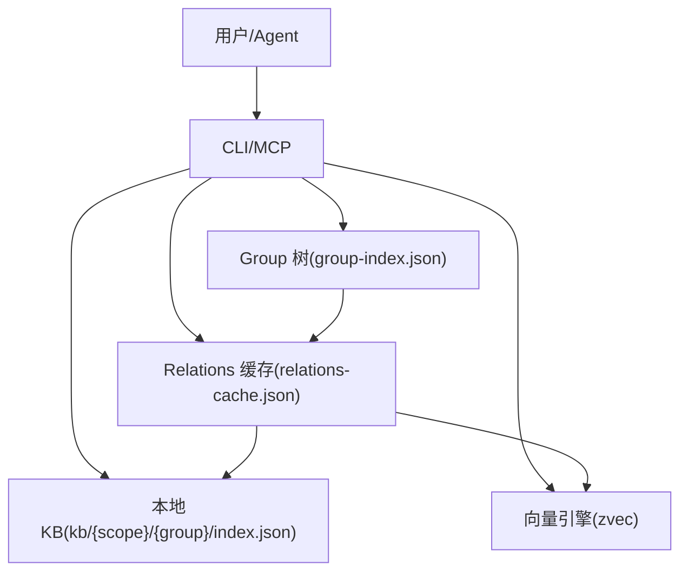
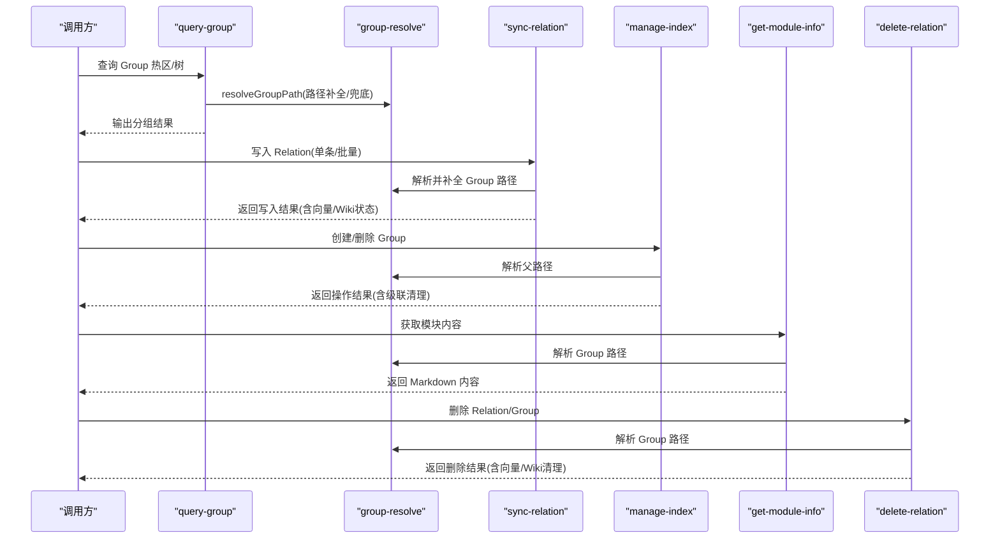
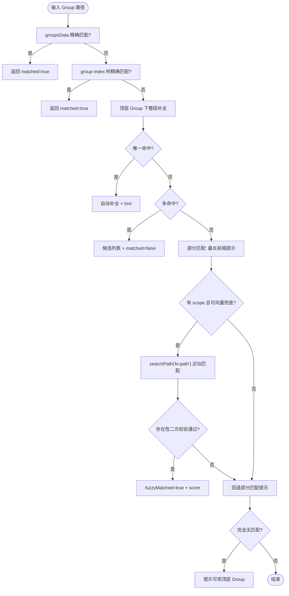
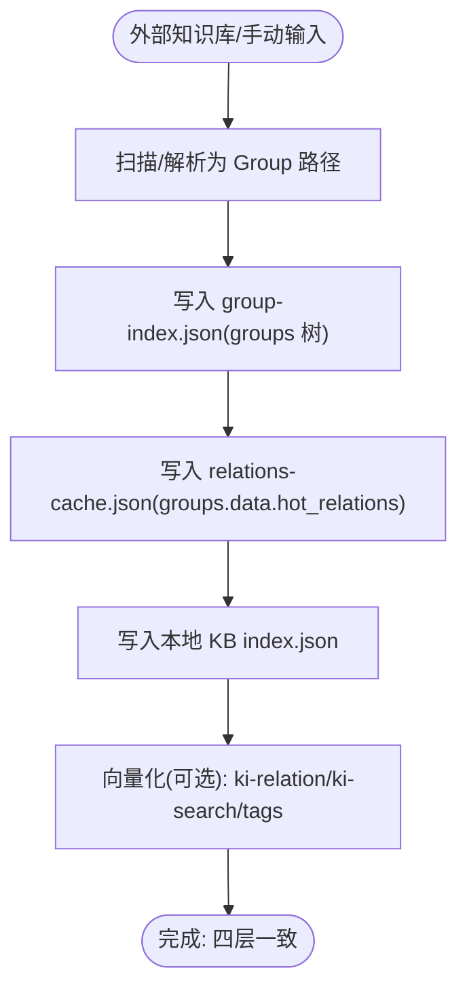
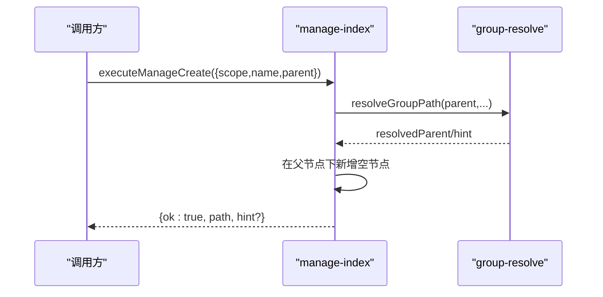
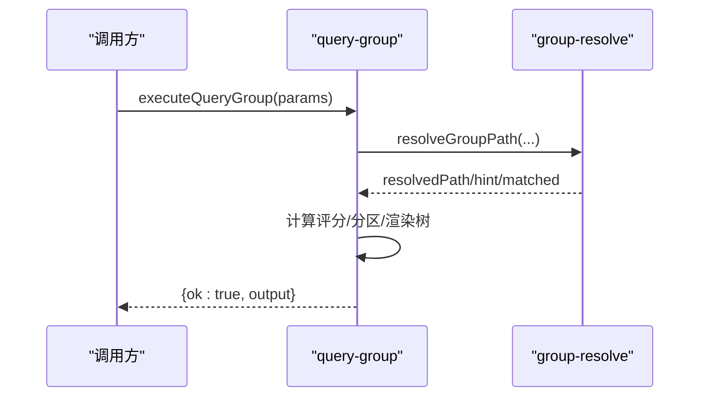
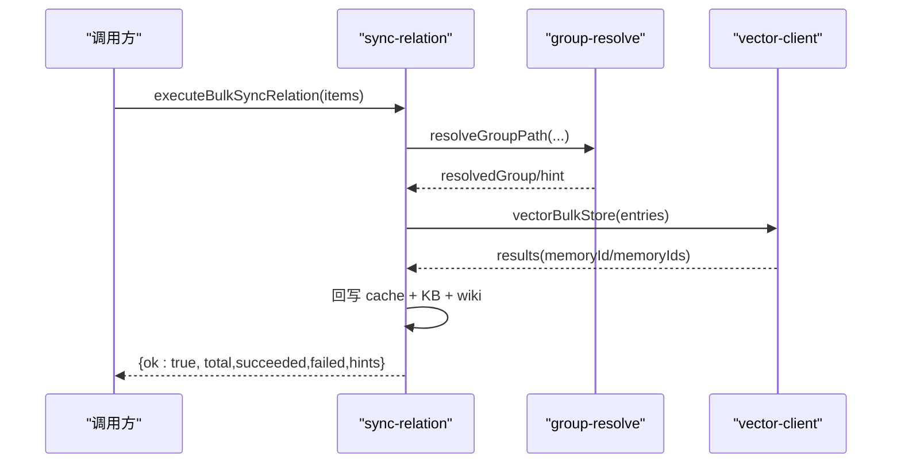
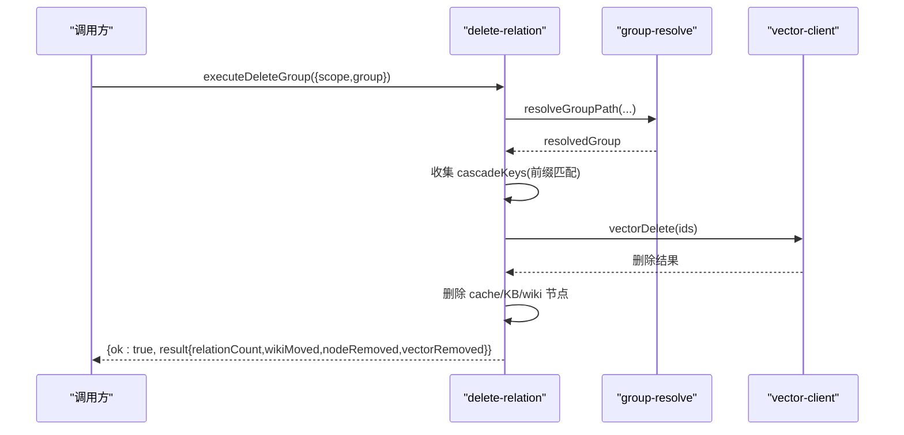
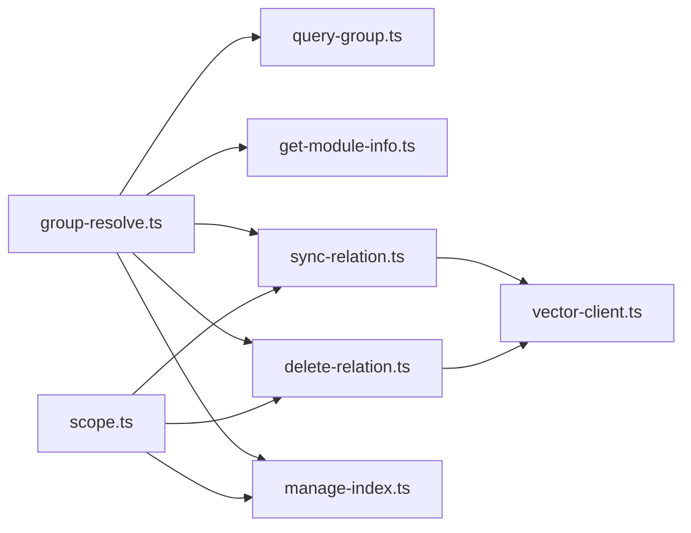

# Group树结构

<cite>
**本文引用的文件**
- [src/lib/group-resolve.ts](file://src/lib/group-resolve.ts)
- [src/query-group.ts](file://src/query-group.ts)
- [src/manage-index.ts](file://src/manage-index.ts)
- [src/sync-relation.ts](file://src/sync-relation.ts)
- [src/delete-relation.ts](file://src/delete-relation.ts)
- [src/get-module-info.ts](file://src/get-module-info.ts)
- [src/lib/scope.ts](file://src/lib/scope.ts)
- [docs/architecture.md](file://docs/architecture.md)
- [test/fixtures/mock-wiki/核心概念/Group 树结构.md](file://test/fixtures/mock-wiki/核心概念/Group 树结构.md)
</cite>

## 目录
1. [简介](#简介)
2. [项目结构与角色定位](#项目结构与角色定位)
3. [核心组件](#核心组件)
4. [架构总览](#架构总览)
5. [详细组件分析](#详细组件分析)
6. [依赖关系分析](#依赖关系分析)
7. [性能与优化](#性能与优化)
8. [故障排查指南](#故障排查指南)
9. [结论](#结论)
10. [附录：API参考与示例](#附录api参考与示例)

## 简介
Group 是 knowledge-indexer 的知识分类单元，以树形结构组织在 group-index.json 中。通过 Group 树，系统能把知识按层次化方式组织、检索与管理，配合 Relations 缓存、本地 KB 与向量索引，形成“结构化导航 + 原文交付 + 语义检索”的完整能力。本文聚焦 Group 的概念、路径表示、构建过程、CRUD 操作、与 Relation 的关系、使用示例与性能优化策略，既适合初学者理解层次化组织，也为高级用户提供 API 参考与调优建议。

**章节来源**
- [test/fixtures/mock-wiki/核心概念/Group 树结构.md:1-42](file://test/fixtures/mock-wiki/核心概念/Group 树结构.md#L1-L42)
- [docs/architecture.md:1-81](file://docs/architecture.md#L1-L81)

## 项目结构与角色定位
- Group 树（group-index.json）：描述知识的层级结构，键为节点名，值为子节点对象。
- Relations 缓存（relations-cache.json）：每个 Group 下的 hot_relations 数组，记录知识条目及其评分、分区等。
- 本地 KB（kb/{scope}/{group}/index.json）：存储 Markdown 原文，供 get-module-info 读取。
- 向量索引（zvec DB）：ki-path、ki-relation、ki-search 等标签的向量记忆，用于语义检索与兜底。

**图表来源**
- [docs/architecture.md:11-49](file://docs/architecture.md#L11-L49)

**章节来源**
- [docs/architecture.md:36-81](file://docs/architecture.md#L36-L81)

## 核心组件
- 路径解析与自动补全：src/lib/group-resolve.ts
- 查询与展示：src/query-group.ts
- 索引管理（创建/删除/列表）：src/manage-index.ts
- 写入与批量同步：src/sync-relation.ts
- 删除与级联清理：src/delete-relation.ts
- 模块信息获取：src/get-module-info.ts
- Scope 与路径工具：src/lib/scope.ts

**章节来源**
- [src/lib/group-resolve.ts:1-220](file://src/lib/group-resolve.ts#L1-L220)
- [src/query-group.ts:1-784](file://src/query-group.ts#L1-L784)
- [src/manage-index.ts:1-646](file://src/manage-index.ts#L1-L646)
- [src/sync-relation.ts:1-800](file://src/sync-relation.ts#L1-L800)
- [src/delete-relation.ts:1-662](file://src/delete-relation.ts#L1-L662)
- [src/get-module-info.ts:1-208](file://src/get-module-info.ts#L1-L208)
- [src/lib/scope.ts:1-230](file://src/lib/scope.ts#L1-L230)

## 架构总览
Group 树作为知识组织的骨架，贯穿导入、查询、更新、删除全流程。路径解析模块提供容错与自动补全；写入流程保证 cache、KB、向量、Wiki 四层一致；删除流程支持单条与目录级联清理。

**图表来源**
- [src/query-group.ts:611-746](file://src/query-group.ts#L611-L746)
- [src/sync-relation.ts:407-787](file://src/sync-relation.ts#L407-L787)
- [src/manage-index.ts:82-137](file://src/manage-index.ts#L82-L137)
- [src/get-module-info.ts:61-168](file://src/get-module-info.ts#L61-L168)
- [src/delete-relation.ts:83-176](file://src/delete-relation.ts#L83-L176)

## 详细组件分析

### Group 路径表示与命名规范
- 路径语法：斜杠分隔的路径段，如 “API/用户认证/OAuth”。顶层 Group 为第一段，子 Group 逐级拼接。
- 命名规范：
  - Group 节点名不应包含非法字符（由校验逻辑保障）。
  - Relation 名称需通过安全校验，拒绝包含 “/”、“\”、“..”，避免破坏 Wiki 文件路径。
- 路径解析策略（九步匹配）：
  1) 直接匹配 groupsData（relations-cache 中有该路径的数据）
  2) 树中直接查找（group-index 中存在）
  3) 整段补全（在每个顶层 Group 下拼接后匹配）
  4) 唯一命中 → 自动补全
  5) 多个命中 → 候选提示
  6) 部分匹配 → 最长存在前缀提示
  7) 向量语义兜底（传入 scope 时启用，二次校验存在性）
  8) 回退部分匹配提示
  9) 完全无匹配 → 可用顶层 Group 列表提示

**图表来源**
- [src/lib/group-resolve.ts:117-219](file://src/lib/group-resolve.ts#L117-L219)

**章节来源**
- [test/fixtures/mock-wiki/核心概念/Group 树结构.md:21-26](file://test/fixtures/mock-wiki/核心概念/Group 树结构.md#L21-L26)
- [src/lib/group-resolve.ts:29-94](file://src/lib/group-resolve.ts#L29-L94)
- [src/lib/group-resolve.ts:117-219](file://src/lib/group-resolve.ts#L117-L219)

### Group 树的构建过程（从文件系统到内存结构）
- 导入阶段：scan-kb/import 将外部知识库扫描结果映射为 Group 树与 Relations 缓存，同时持久化 source 块（dir、chunkSize、chunkOverlap），便于后续 Wiki 写回。
- 自动补建：sync-relation 在写入 Relation 时，若 Group 路径缺失节点，会自动在 group-index 树中补建缺失节点，确保路径完整。
- 迁移兼容：旧格式 roots → groups 自动迁移，保证历史数据可读。

**图表来源**
- [src/sync-relation.ts:129-221](file://src/sync-relation.ts#L129-L221)
- [src/sync-relation.ts:407-787](file://src/sync-relation.ts#L407-L787)
- [src/lib/scope.ts:117-146](file://src/lib/scope.ts#L117-L146)

**章节来源**
- [src/lib/scope.ts:81-102](file://src/lib/scope.ts#L81-L102)
- [src/sync-relation.ts:94-125](file://src/sync-relation.ts#L94-L125)
- [src/lib/scope.ts:148-167](file://src/lib/scope.ts#L148-L167)

### Group 的 CRUD 操作

#### 创建（Create）
- CLI：manage-index create --name <name> [--parent <path>]
- 行为：
  - 校验 name 不含 “/”
  - 解析父路径（支持自动补全）
  - 在 group-index 树中新增空节点
  - 返回新路径与提示（如有）

**图表来源**
- [src/manage-index.ts:82-137](file://src/manage-index.ts#L82-L137)

**章节来源**
- [src/manage-index.ts:82-137](file://src/manage-index.ts#L82-L137)

#### 查询（Read）
- CLI：query-group --scope <scope> [--groups <g1,g2>] [--mode hot|warm|cold|emerging|full]
- 行为：
  - 加载 group-index.json 与 relations-cache.json
  - 解析 Group 路径（自动补全/兜底）
  - 计算评分与分区（hot/warm/cold/emerging）
  - 输出树视图、热门 Relation、统计信息

**图表来源**
- [src/query-group.ts:611-746](file://src/query-group.ts#L611-L746)
- [src/lib/group-resolve.ts:117-219](file://src/lib/group-resolve.ts#L117-L219)

**章节来源**
- [src/query-group.ts:598-746](file://src/query-group.ts#L598-L746)

#### 更新（Update）
- 写入 Relation：sync-relation 单条或批量模式
  - 自动补建 Group 路径节点
  - 写入 relations-cache（hot_relations）、本地 KB、向量层（可选）
  - 批量模式一次 embedding + 一次 upsert，提升吞吐
- 更新评分：get-module-info 读取时 recordUse，动态调整分区

**图表来源**
- [src/sync-relation.ts:407-787](file://src/sync-relation.ts#L407-L787)
- [src/get-module-info.ts:149-168](file://src/get-module-info.ts#L149-L168)

**章节来源**
- [src/sync-relation.ts:129-221](file://src/sync-relation.ts#L129-L221)
- [src/sync-relation.ts:407-787](file://src/sync-relation.ts#L407-L787)
- [src/get-module-info.ts:61-168](file://src/get-module-info.ts#L61-L168)

#### 删除（Delete）
- 单条删除：delete-relation 删除 Relation（cache、KB、wiki、向量）
- 目录级删除：executeDeleteGroup 删除整个 Group（含子 Group 的 cache/KB/向量/wiki，并移除 group-index 节点）
- 空节点删除：manage-index delete（MCP 仅支持空节点，非空需 CLI 带 --force）

**图表来源**
- [src/delete-relation.ts:207-310](file://src/delete-relation.ts#L207-L310)
- [src/manage-index.ts:185-298](file://src/manage-index.ts#L185-L298)

**章节来源**
- [src/delete-relation.ts:83-176](file://src/delete-relation.ts#L83-L176)
- [src/delete-relation.ts:207-310](file://src/delete-relation.ts#L207-L310)
- [src/manage-index.ts:185-298](file://src/manage-index.ts#L185-L298)

### Group 与 Relation 的关系
- Group 是容器，Relation 是具体知识条目。每个 Group 下有 hot_relations 数组，记录文本、评分、使用次数、向量 ID 等。
- 通过 Group 进行知识的分类和组织，便于 Agent 先缩小范围再精准检索。
- 路径解析与自动补全降低用户输入噪声，提高命中率。

**章节来源**
- [src/query-group.ts:31-43](file://src/query-group.ts#L31-L43)
- [src/sync-relation.ts:43-68](file://src/sync-relation.ts#L43-L68)
- [src/get-module-info.ts:29-41](file://src/get-module-info.ts#L29-L41)

## 依赖关系分析
- group-resolve.ts 被 query-group、get-module-info、sync-relation、delete-relation、manage-index 复用，提供路径解析与自动补全。
- scope.ts 提供路径构造、source 块读写、GroupIndex 类型与迁移。
- sync-relation.ts 与 vector-client.ts 协作实现批量向量化写入。
- delete-relation.ts 与 vector-client.ts 协作实现向量删除与兜底。

**图表来源**
- [src/lib/group-resolve.ts:1-220](file://src/lib/group-resolve.ts#L1-L220)
- [src/lib/scope.ts:1-230](file://src/lib/scope.ts#L1-L230)
- [src/sync-relation.ts:1-800](file://src/sync-relation.ts#L1-L800)
- [src/delete-relation.ts:1-662](file://src/delete-relation.ts#L1-L662)

**章节来源**
- [src/lib/group-resolve.ts:1-220](file://src/lib/group-resolve.ts#L1-L220)
- [src/lib/scope.ts:1-230](file://src/lib/scope.ts#L1-L230)

## 性能与优化
- 批量向量化写入：sync-relation 的 executeBulkSyncRelation 一次 embedding HTTP + 一次 worker upsert，减少网络往返与串行开销。
- 评分与分区：scoring.ts 的密度评分与 hybridPartition 抗尺度变化，boundaryDecay 淘汰冷门，提升查询效率。
- 路径解析降级：九步匹配策略最大化容忍噪声，减少失败重试。
- 向量兜底阈值：RRF 融合分阈值改为 0，接受 top-1，由下游做存在性二次校验，平衡召回与精度。
- 级联删除聚合：删除 Group 时聚合 memoryIds 一次 vectorDelete，避免多次调用稀释性能。

**章节来源**
- [src/sync-relation.ts:407-787](file://src/sync-relation.ts#L407-L787)
- [src/lib/group-resolve.ts:117-219](file://src/lib/group-resolve.ts#L117-L219)
- [src/delete-relation.ts:249-267](file://src/delete-relation.ts#L249-L267)

## 故障排查指南
- Group 未匹配：检查路径是否存在于 group-index 树或 groupsData；查看 resolveGroupPath 返回的 hint 与 candidates。
- Relation 不存在：确认 Group 路径正确，检查 relations-cache 中是否有对应 hot_relations；必要时使用 searchPath 兜底。
- 向量服务不可用：批量写入会标记 vectorStored=false 并记录 reason；不影响 KB 层写入。
- 删除失败：目录级删除需确保 resolvedGroup 非空；检查 cache/KB/wiki/向量是否一致；必要时重建向量索引。

**章节来源**
- [src/lib/group-resolve.ts:117-219](file://src/lib/group-resolve.ts#L117-L219)
- [src/get-module-info.ts:61-168](file://src/get-module-info.ts#L61-L168)
- [src/sync-relation.ts:607-745](file://src/sync-relation.ts#L607-L745)
- [src/delete-relation.ts:207-310](file://src/delete-relation.ts#L207-L310)

## 结论
Group 树是 knowledge-indexer 知识组织的核心骨架，通过路径解析、自动补全、评分分区、批量向量化与级联删除，实现了高效、可靠、可扩展的知识管理能力。结合 Relations 缓存、本地 KB 与向量索引，系统既能满足初学者的直观导航需求，也能支撑高级用户的批量操作与性能调优。

## 附录：API参考与示例

### 常用命令与参数
- query-group
  - 用途：查询 Group 热区、树视图、统计
  - 关键参数：--scope、--groups、--mode、--depth、--hot-count
- manage-index
  - 用途：创建/删除 Group、列出 scopes
  - 关键参数：--action、--name、--parent、--force
- sync-relation
  - 用途：写入 Relation（单条/批量），可选向量化
  - 关键参数：--scope、--group、--relation、--module-info、--input
- delete-relation
  - 用途：删除 Relation 或整个 Group
  - 关键参数：--scope、--group、--relation、--input

**章节来源**
- [src/query-group.ts:750-784](file://src/query-group.ts#L750-L784)
- [src/manage-index.ts:415-646](file://src/manage-index.ts#L415-L646)
- [src/sync-relation.ts:1-14](file://src/sync-relation.ts#L1-L14)
- [src/delete-relation.ts:598-662](file://src/delete-relation.ts#L598-L662)

### 设计合理的 Group 树结构示例
- 顶层 Group：API、部署指南、核心概念
- 子 Group：API/用户认证、API/数据查询
- 深层 Group：API/用户认证/OAuth
- 建议：
  - 保持层级不超过 4 层，便于浏览与维护
  - 命名简洁明确，避免歧义
  - 定期使用 query-group 查看热区与冷区，优化结构

**章节来源**
- [test/fixtures/mock-wiki/核心概念/Group 树结构.md:7-26](file://test/fixtures/mock-wiki/核心概念/Group 树结构.md#L7-L26)

### 批量操作示例
- 批量写入：准备 JSON 文件 items 数组，每项包含 group、relation、module_info，执行 sync-relation 批量模式
- 批量删除：准备 JSON 文件 items 数组，每项包含 group、relation，执行 delete-relation 批量模式

**章节来源**
- [src/sync-relation.ts:223-339](file://src/sync-relation.ts#L223-L339)
- [src/delete-relation.ts:551-594](file://src/delete-relation.ts#L551-L594)