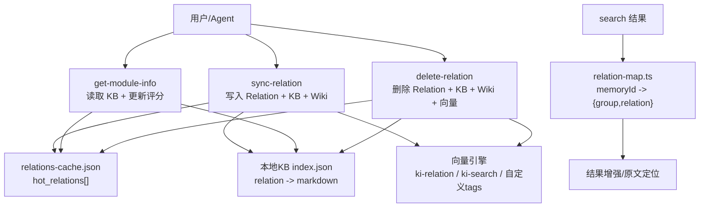
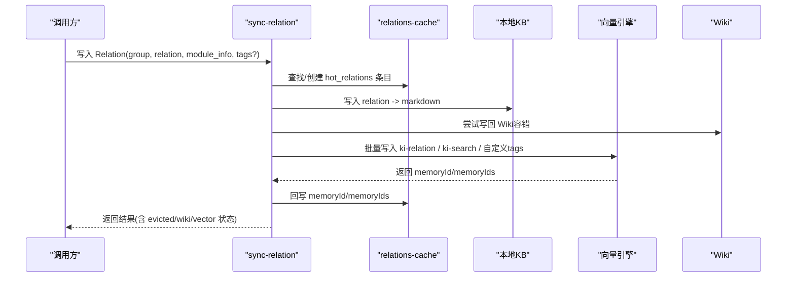
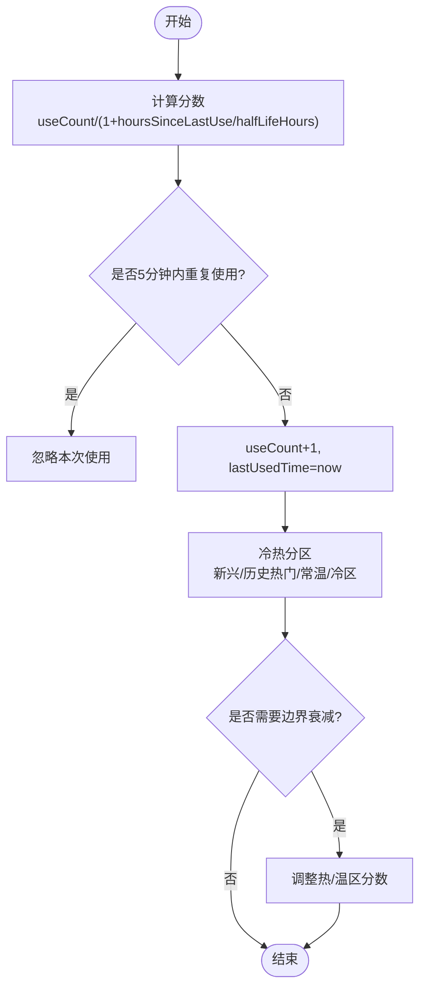
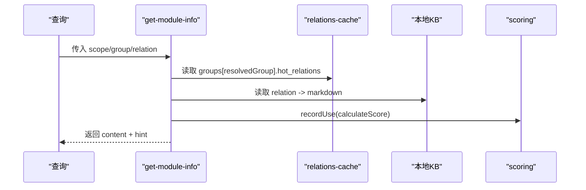
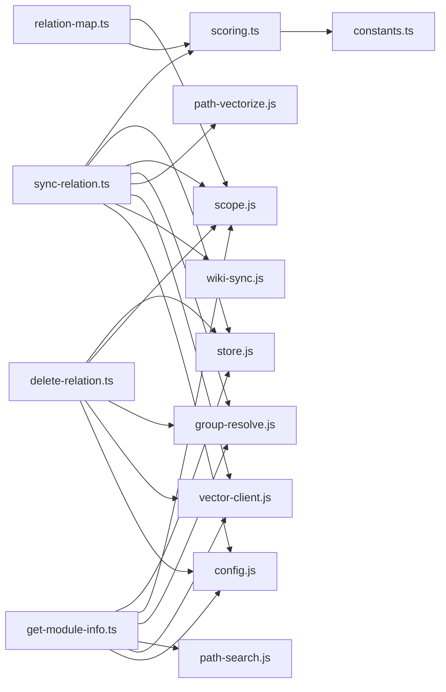

# Relation关系模型

<cite>
**本文引用的文件**
- [scoring.ts](file://src/lib/scoring.ts)
- [relation-map.ts](file://src/lib/relation-map.ts)
- [sync-relation.ts](file://src/sync-relation.ts)
- [delete-relation.ts](file://src/delete-relation.ts)
- [get-module-info.ts](file://src/get-module-info.ts)
- [constants.ts](file://src/lib/constants.ts)
- [architecture.md](file://docs/architecture.md)
- [manage-index.md](file://docs/manage-index.md)
- [cli.md](file://docs/cli.md)
</cite>

## 目录
1. [简介](#简介)
2. [项目结构](#项目结构)
3. [核心组件](#核心组件)
4. [架构总览](#架构总览)
5. [详细组件分析](#详细组件分析)
6. [依赖关系分析](#依赖关系分析)
7. [性能考虑](#性能考虑)
8. [故障排查指南](#故障排查指南)
9. [结论](#结论)
10. [附录：使用示例与存储格式](#附录使用示例与存储格式)

## 简介
Relation 是 knowledge-indexer 中“知识条目”与“原文/向量片段”之间的关联实体。它把一段可检索、可回读的“模块信息”（通常是 Markdown）与其在 Group 下的语义位置绑定，并记录其被使用的热度、来源路径以及对应的向量 ID，从而支撑搜索命中后的原文定位与结果增强。

- 概念层面：Relation = “知识条目名 + 所属 Group + 评分/热度 + 原文索引 + 向量映射”。
- 设计目标：让“热门知识”就近可用；当本地未命中时，通过记忆系统召回后回写为本地 Relation；支持批量写入、向量化、Wiki 同步与删除清理。

## 项目结构
Relation 相关能力分布在以下模块：
- 类型与评分：src/lib/scoring.ts
- 反查映射（memoryId → group/relation）：src/lib/relation-map.ts
- 写入与批量同步：src/sync-relation.ts
- 删除与回收：src/delete-relation.ts
- 读取与评分更新：src/get-module-info.ts
- 常量与默认配置：src/lib/constants.ts
- 文档与流程说明：docs/architecture.md, docs/manage-index.md, docs/cli.md

图表来源
- [sync-relation.ts:129-221](file://src/sync-relation.ts#L129-L221)
- [get-module-info.ts:61-168](file://src/get-module-info.ts#L61-L168)
- [delete-relation.ts:83-176](file://src/delete-relation.ts#L83-L176)
- [relation-map.ts:48-114](file://src/lib/relation-map.ts#L48-L114)

章节来源
- [scoring.ts:19-36](file://src/lib/scoring.ts#L19-L36)
- [relation-map.ts:1-17](file://src/lib/relation-map.ts#L1-L17)
- [sync-relation.ts:1-39](file://src/sync-relation.ts#L1-L39)
- [delete-relation.ts:1-16](file://src/delete-relation.ts#L1-L16)
- [get-module-info.ts:1-26](file://src/get-module-info.ts#L1-L26)
- [constants.ts:19-50](file://src/lib/constants.ts#L19-L50)
- [architecture.md:83-127](file://docs/architecture.md#L83-L127)

## 核心组件
- Relation 数据模型：定义于 scoring.ts，包含 id、text、score、useCount、lastUsedTime、isImported、memoryId/memoryIds、sourcePath、tags 等字段。
- 评分与冷热分区：calculateScore、recordUse、hybridPartition、boundaryDecay 等函数维护 Relation 的热度与分区。
- 反查映射：relation-map.ts 提供 memoryId → {group, relation} 的缓存映射，用于搜索结果增强。
- 写入与批量同步：sync-relation.ts 实现单条/批量写入 Relation、本地 KB、Wiki 同步与向量写入。
- 删除与回收：delete-relation.ts 实现 Relation 及关联数据的删除（cache、KB、wiki、向量）。
- 读取与评分更新：get-module-info.ts 读取 KB 内容并更新 Relation 评分。

章节来源
- [scoring.ts:19-36](file://src/lib/scoring.ts#L19-L36)
- [scoring.ts:44-79](file://src/lib/scoring.ts#L44-L79)
- [scoring.ts:90-117](file://src/lib/scoring.ts#L90-L117)
- [relation-map.ts:23-28](file://src/lib/relation-map.ts#L23-L28)
- [sync-relation.ts:129-221](file://src/sync-relation.ts#L129-L221)
- [delete-relation.ts:83-176](file://src/delete-relation.ts#L83-L176)
- [get-module-info.ts:61-168](file://src/get-module-info.ts#L61-L168)

## 架构总览
Relation 的生命周期贯穿“创建/更新 → 查询 → 删除”，并与 Group、本地 KB、向量引擎、Wiki 协同工作。

图表来源
- [sync-relation.ts:407-787](file://src/sync-relation.ts#L407-L787)
- [sync-relation.ts:129-221](file://src/sync-relation.ts#L129-L221)

章节来源
- [architecture.md:109-127](file://docs/architecture.md#L109-L127)
- [cli.md:842-870](file://docs/cli.md#L842-L870)

## 详细组件分析

### Relation 数据模型与字段约束
- id：唯一标识，按 rel_XXX 自增生成。
- text：Relation 名称（即 KB 中的键），来自 --relation 或文件名。
- score：基于 useCount 与 lastUsedTime 计算的分数，用于排序与淘汰。
- useCount：使用次数，受防刷间隔与上限限制。
- lastUsedTime：最近使用时间，参与评分计算。
- isImported：是否由导入流程产生。
- memoryId：主内容向量 ID（兼容旧数据）。
- memoryIds：文件级 Relation 的全部 chunk 向量 ID 列表（方案 D）。
- sourcePath：相对 source.dir 的 posix 路径，用于幂等判定。
- tags：文档级自定义标签数组，持久化到 KB 层，供重建向量时恢复 tag 向量。

章节来源
- [scoring.ts:19-36](file://src/lib/scoring.ts#L19-L36)
- [architecture.md:83-101](file://docs/architecture.md#L83-L101)

### 评分与冷热分区
- calculateScore：根据使用次数与距上次使用时间计算分数。
- recordUse：5分钟防刷 + 最大使用次数上限，避免刷分。
- hybridPartition：新兴热区 + 历史热门 + 常温/冷区划分，带上限截断。
- boundaryDecay：新内容进入热区时对边界进行衰减，保持稳定性。

图表来源
- [scoring.ts:44-79](file://src/lib/scoring.ts#L44-L79)
- [scoring.ts:90-117](file://src/lib/scoring.ts#L90-L117)
- [scoring.ts:222-274](file://src/lib/scoring.ts#L222-L274)

章节来源
- [scoring.ts:44-79](file://src/lib/scoring.ts#L44-L79)
- [scoring.ts:90-117](file://src/lib/scoring.ts#L90-L117)
- [scoring.ts:222-274](file://src/lib/scoring.ts#L222-L274)
- [constants.ts:19-50](file://src/lib/constants.ts#L19-L50)

### 与 Group 的关系与组织
- Group 是 Relation 的组织维度，每个 Group 维护一组 hot_relations。
- sync-relation 会自动补全 Group 树节点，确保路径存在。
- get-module-info 支持模糊匹配 Group 路径，提升易用性。
- delete-relation 支持整组删除（级联子组），并清理 cache/KB/Wiki/向量。

章节来源
- [sync-relation.ts:94-125](file://src/sync-relation.ts#L94-L125)
- [get-module-info.ts:76-83](file://src/get-module-info.ts#L76-L83)
- [delete-relation.ts:203-310](file://src/delete-relation.ts#L203-L310)

### 生命周期：创建、更新、查询、删除
- 创建/更新：
  - 单条模式：syncSingleRelation 查找/创建 Relation，必要时淘汰最低分，写入 KB，可选 Wiki 同步与向量写入。
  - 批量模式：executeBulkSyncRelation 收集 entries 一次 embedding + 一次 upsert，拆分结果回写 memoryId/memoryIds，统一落盘 cache。
- 查询：
  - get-module-info 读取 KB 内容，同时 recordUse 更新评分与分数。
  - search 结果通过 relation-map 反查附加 group/relation 信息。
- 删除：
  - executeDeleteRelation 删除 cache/KB/Wiki/向量（优先 memoryIds，失败则 search 兜底）。
  - executeDeleteGroup 级联删除整个 Group 及其子组。

图表来源
- [get-module-info.ts:61-168](file://src/get-module-info.ts#L61-L168)
- [scoring.ts:44-79](file://src/lib/scoring.ts#L44-L79)

章节来源
- [sync-relation.ts:129-221](file://src/sync-relation.ts#L129-L221)
- [sync-relation.ts:407-787](file://src/sync-relation.ts#L407-L787)
- [get-module-info.ts:61-168](file://src/get-module-info.ts#L61-L168)
- [delete-relation.ts:83-176](file://src/delete-relation.ts#L83-L176)

### 存储格式与序列化
- relations-cache.json：
  - 顶层 version、scope、partition_config、groups、updatedAt。
  - groups[group] 包含 hot_relations[]、keywords、max_hot_count。
  - 每条 Relation 包含 id/text/score/useCount/lastUsedTime/isImported/memoryId/memoryIds/sourcePath/tags。
- 本地 KB index.json：
  - 以 relation.text 为键，Markdown 内容为值。
- 向量层：
  - ki-relation（路径向量）、ki-search（内容向量）、自定义 tags（各一条内容向量）。
  - 批量写入一次 embed + 一次 upsert，返回 memoryId/memoryIds 回写到 cache。

章节来源
- [sync-relation.ts:49-55](file://src/sync-relation.ts#L49-L55)
- [sync-relation.ts:204-216](file://src/sync-relation.ts#L204-L216)
- [sync-relation.ts:439-547](file://src/sync-relation.ts#L439-L547)
- [architecture.md:83-101](file://docs/architecture.md#L83-L101)

### 使用示例
- 单条写入：
  - 命令参数：--scope、--group、--relation、--module-info、--tags（可选）。
  - 行为：自动补全 Group 路径、写入 cache/KB、可选 Wiki 同步、可选向量化。
- 批量写入：
  - 输入 JSON items 数组，支持 tags。
  - 默认向量化（一次 embed + 一次 upsert），--no-vector 仅写 KB。
  - 同批重复 (group, relation) 去重，后一条覆盖前一条。
- 查询：
  - 通过 get-module-info 获取 Markdown 内容，并更新评分。
- 删除：
  - 单条删除：删除 cache/KB/Wiki/向量（优先 memoryIds，失败 search 兜底）。
  - 目录删除：级联删除 Group 及其子组，移动 wiki 到回收站，删除 group-index 节点。

章节来源
- [manage-index.md:131-208](file://docs/manage-index.md#L131-L208)
- [cli.md:842-870](file://docs/cli.md#L842-L870)
- [sync-relation.ts:245-339](file://src/sync-relation.ts#L245-L339)
- [delete-relation.ts:558-594](file://src/delete-relation.ts#L558-L594)

## 依赖关系分析
- Relation 类型依赖 constants 的分区配置与默认标签集。
- sync-relation 依赖 store/scope/group-resolve/path-vectorize/vector-client/wiki-sync/config。
- get-module-info 依赖 store/scope/group-resolve/path-search/vector-client/config。
- delete-relation 依赖 store/scope/group-resolve/vector-client/config。
- relation-map 依赖 scope 的路径工具与 scoring 的类型。

图表来源
- [sync-relation.ts:16-35](file://src/sync-relation.ts#L16-L35)
- [get-module-info.ts:11-25](file://src/get-module-info.ts#L11-L25)
- [delete-relation.ts:18-30](file://src/delete-relation.ts#L18-L30)
- [relation-map.ts:19-21](file://src/lib/relation-map.ts#L19-L21)

章节来源
- [sync-relation.ts:16-35](file://src/sync-relation.ts#L16-L35)
- [get-module-info.ts:11-25](file://src/get-module-info.ts#L11-L25)
- [delete-relation.ts:18-30](file://src/delete-relation.ts#L18-L30)
- [relation-map.ts:19-21](file://src/lib/relation-map.ts#L19-L21)

## 性能考虑
- 批量向量化：
  - 一次 HTTP embedding + 一次 worker upsert，显著减少往返与串行开销。
  - 同批重复 (group, relation) 去重，避免孤儿向量与误删。
- 缓存机制：
  - relation-map 使用 mtime/size/TTL 三级失效策略，首次构建 O(N)，后续 O(1)。
- 评分防刷与上限：
  - 5分钟防刷与最大使用次数，防止热点膨胀。
- 边界衰减：
  - 新内容进入热区时对边界分数衰减，维持稳定性。
- 删除优化：
  - 聚合 memoryIds 批量删除，失败时 search 兜底，保证一致性。

章节来源
- [sync-relation.ts:394-406](file://src/sync-relation.ts#L394-L406)
- [sync-relation.ts:569-605](file://src/sync-relation.ts#L569-L605)
- [relation-map.ts:8-17](file://src/lib/relation-map.ts#L8-L17)
- [scoring.ts:61-79](file://src/lib/scoring.ts#L61-L79)
- [scoring.ts:222-274](file://src/lib/scoring.ts#L222-L274)
- [delete-relation.ts:383-422](file://src/delete-relation.ts#L383-L422)

## 故障排查指南
- 写入失败：
  - 检查 input 文件格式与必填字段（group/relation/module_info）。
  - 非法 relation 名称（含 "/"、"\\"、".."）会被拒绝。
  - 向量服务不可用会标记 vectorStored=false 并给出 reason。
- 查询失败：
  - relations-cache.json 不存在需先写入 Relation。
  - Group 未匹配需提供正确路径或使用模糊匹配提示。
  - 本地 KB 缺失需重新写入或检查导入完整性。
- 删除失败：
  - memoryIds 删除失败会尝试 search 兜底，若仍失败需检查向量服务状态。
  - 目录删除需确保 resolvedGroup 非空，避免误删根目录。

章节来源
- [sync-relation.ts:274-339](file://src/sync-relation.ts#L274-L339)
- [sync-relation.ts:607-745](file://src/sync-relation.ts#L607-L745)
- [get-module-info.ts:72-168](file://src/get-module-info.ts#L72-L168)
- [delete-relation.ts:83-176](file://src/delete-relation.ts#L83-L176)
- [delete-relation.ts:383-473](file://src/delete-relation.ts#L383-L473)

## 结论
Relation 作为知识条目与原文/向量的桥梁，提供了稳定的热度管理、灵活的分组组织、高效的批量操作与健壮的删除清理机制。通过 relations-cache、本地 KB、向量引擎与 Wiki 的协同，实现了从“创建—查询—增强—删除”的完整闭环。对于初学者，可从单条写入与查询入手；对于高级开发者，建议关注批量向量化、缓存失效策略与边界衰减对稳定性的影响。

## 附录：使用示例与存储格式

### 典型操作流程
- 创建 Relation：
  - 使用 sync-relation 单条或批量写入，自动补全 Group、写入 KB、可选 Wiki 同步与向量化。
- 查询 Relation：
  - 使用 get-module-info 获取 Markdown 内容，并更新评分。
- 删除 Relation：
  - 使用 delete-relation 删除 cache/KB/Wiki/向量，支持目录级删除。

章节来源
- [manage-index.md:131-208](file://docs/manage-index.md#L131-L208)
- [cli.md:842-870](file://docs/cli.md#L842-L870)
- [sync-relation.ts:129-221](file://src/sync-relation.ts#L129-L221)
- [get-module-info.ts:61-168](file://src/get-module-info.ts#L61-L168)
- [delete-relation.ts:83-176](file://src/delete-relation.ts#L83-L176)

### 存储结构要点
- relations-cache.json：
  - groups[group].hot_relations[] 存储 Relation 列表。
  - 每条 Relation 包含 id/text/score/useCount/lastUsedTime/isImported/memoryId/memoryIds/sourcePath/tags。
- 本地 KB index.json：
  - relation.text -> markdown 内容。
- 向量层：
  - ki-relation、ki-search、自定义 tags 分别对应不同向量。
  - 批量写入返回 memoryId/memoryIds 回写到 cache。

章节来源
- [architecture.md:83-101](file://docs/architecture.md#L83-L101)
- [sync-relation.ts:439-547](file://src/sync-relation.ts#L439-L547)
- [sync-relation.ts:204-216](file://src/sync-relation.ts#L204-L216)