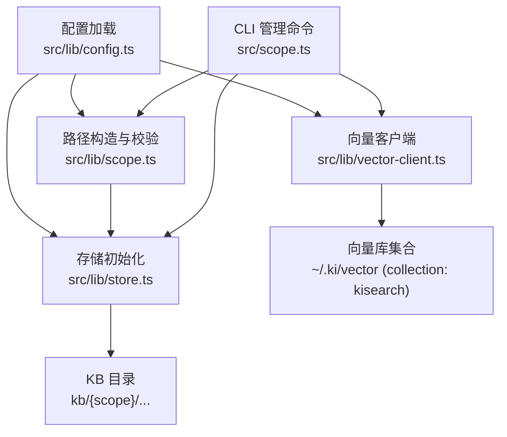
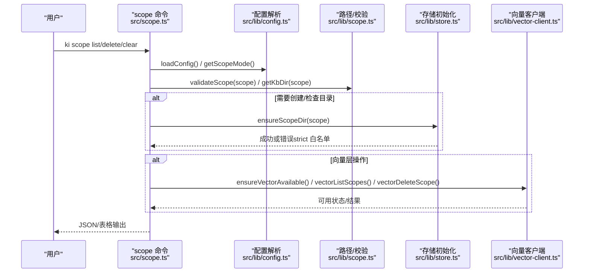
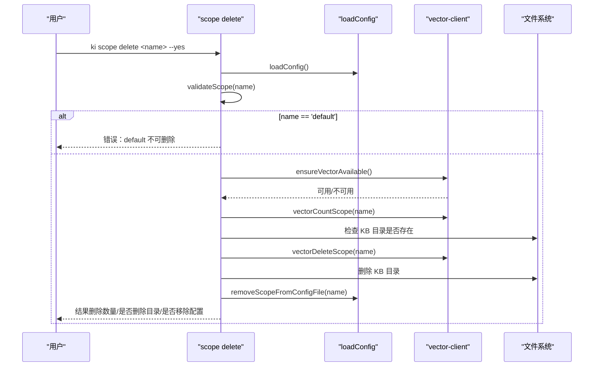
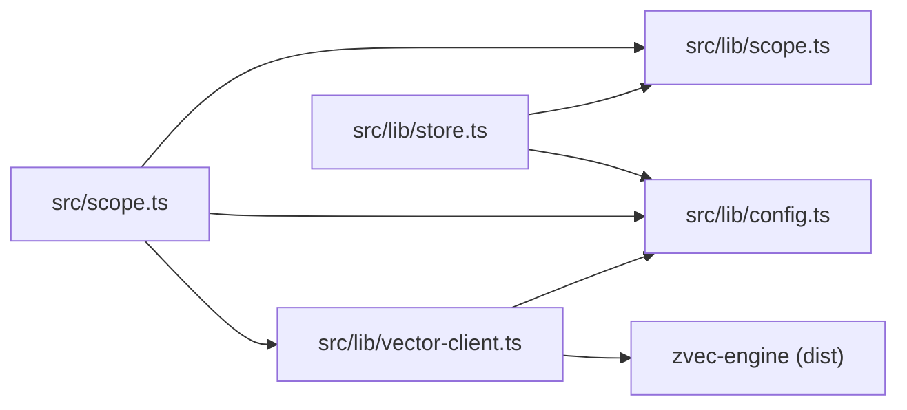

# Scope隔离机制

<cite>
**本文引用的文件**
- [src/scope.ts](file://src/scope.ts)
- [src/lib/scope.ts](file://src/lib/scope.ts)
- [src/lib/config.ts](file://src/lib/config.ts)
- [src/lib/vector-client.ts](file://src/lib/vector-client.ts)
- [src/lib/store.ts](file://src/lib/store.ts)
- [test/scope-mode.test.ts](file://test/scope-mode.test.ts)
- [test/scope-doc.test.ts](file://test/scope-doc.test.ts)
- [test/scope-isolation.test.ts](file://test/scope-isolation.test.ts)
- [docs/configuration.md](file://docs/configuration.md)
</cite>

## 目录
1. [简介](#简介)
2. [项目结构](#项目结构)
3. [核心组件](#核心组件)
4. [架构总览](#架构总览)
5. [详细组件分析](#详细组件分析)
6. [依赖关系分析](#依赖关系分析)
7. [性能与可用性](#性能与可用性)
8. [故障排查指南](#故障排查指南)
9. [结论](#结论)
10. [附录：使用示例与最佳实践](#附录使用示例与最佳实践)

## 简介
本文件系统性阐述 knowledge-indexer（ki）的 Scope 隔离机制，覆盖以下要点：
- Scope 的概念与设计理念：默认 scope 与自定义 scope 的区别、scopeMode 的 default/strict 模式及其影响范围。
- 物理隔离策略：KB 目录隔离、向量数据库隔离、配置文件隔离的实现方式。
- Scope 生命周期管理：创建、列出、清理、删除操作的行为与边界。
- 多项目环境下的数据隔离策略与最佳实践。
- 面向初学者的概念说明与面向高级用户的实现细节、排障指引。

## 项目结构
Scope 隔离涉及配置解析、路径构造、存储初始化、向量层过滤与管理命令五个层面。关键文件职责如下：
- 配置与模式：src/lib/config.ts（加载配置、scopeMode、scopes 映射、resolveScope）
- 路径与校验：src/lib/scope.ts（validateScope、getKbDir、listAllScopes、group-index/source 读写）
- 存储初始化：src/lib/store.ts（ensureScopeDir、initScope、WAL 写入、旧格式迁移）
- 向量层：src/lib/vector-client.ts（单 collection + scope/tag 字段过滤、文档 id 生成、删除/统计/枚举）
- 管理命令：src/scope.ts（scope list/delete/clear 的 CLI 与执行逻辑）
- 测试与文档：test/* 验证行为；docs/configuration.md 提供配置项说明

图表来源
- [src/lib/config.ts:148-359](file://src/lib/config.ts#L148-L359)
- [src/lib/scope.ts:30-77](file://src/lib/scope.ts#L30-L77)
- [src/lib/store.ts:168-267](file://src/lib/store.ts#L168-L267)
- [src/lib/vector-client.ts:271-303](file://src/lib/vector-client.ts#L271-L303)
- [src/scope.ts:94-132](file://src/scope.ts#L94-L132)

章节来源
- [src/lib/config.ts:148-359](file://src/lib/config.ts#L148-L359)
- [src/lib/scope.ts:30-77](file://src/lib/scope.ts#L30-L77)
- [src/lib/store.ts:168-267](file://src/lib/store.ts#L168-L267)
- [src/lib/vector-client.ts:271-303](file://src/lib/vector-client.ts#L271-L303)
- [src/scope.ts:94-132](file://src/scope.ts#L94-L132)

## 核心组件
- 配置与模式解析
  - 支持 YAML/JSON 配置文件，优先级：命令行 > 环境变量 > 用户目录默认 > 内置默认。
  - scopeMode：'default' | 'strict'，缺省为 'default'。
  - scopes：scope → 配置对象映射，包含 kbDir、wikiSync、clean、import 等。
  - resolveScope：在 strict 模式下强制白名单校验，default 模式下未传 scope 时回退为 'default'。
- 路径与校验
  - validateScope：仅允许字母、数字、连字符、下划线，拒绝路径遍历。
  - getKbDir：优先使用 scopes.<scope>.kbDir（自动拼接 kb/{scope}），否则回退到 dataDir/{scope}。
  - listAllScopes：扫描 dataDir 下含 relations-cache.json 的目录，并合并 config.scopes 中已注册且有缓存的 scope。
- 存储初始化
  - ensureScopeDir：strict 模式下若未在 scopes 注册则拒绝；default 模式放行并自动从模板初始化。
  - initScope：复制 _template 中的 group-index.json 与 relations-cache.json，设置 scope 与时间戳。
- 向量层隔离
  - 单 collection（kisearch），通过标量字段 scope/tag/group 进行隔离。
  - 文档 id = sha256(text + scope + tag) 截 32，保证同 scope+text+tag 幂等 upsert。
  - 查询/删除/统计均按 scope 过滤，确保跨 scope 不串读/串写。
- 管理命令
  - scope list：合并 KB 层与向量层 scope 并集，标注存在层与是否注册。
  - scope delete：删除向量层文档、删除 KB 目录、移除配置条目（需 --yes）。
  - scope clear：清空向量层（可带 tags），可选清空 KB 目录内容（保留目录与配置）。

章节来源
- [src/lib/config.ts:119-128](file://src/lib/config.ts#L119-L128)
- [src/lib/config.ts:288-359](file://src/lib/config.ts#L288-L359)
- [src/lib/config.ts:433-459](file://src/lib/config.ts#L433-L459)
- [src/lib/scope.ts:30-77](file://src/lib/scope.ts#L30-L77)
- [src/lib/scope.ts:174-198](file://src/lib/scope.ts#L174-L198)
- [src/lib/store.ts:168-267](file://src/lib/store.ts#L168-L267)
- [src/lib/vector-client.ts:225-242](file://src/lib/vector-client.ts#L225-L242)
- [src/scope.ts:94-132](file://src/scope.ts#L94-L132)
- [src/scope.ts:145-179](file://src/scope.ts#L145-L179)
- [src/scope.ts:192-221](file://src/scope.ts#L192-L221)

## 架构总览
下图展示 Scope 隔离在“配置—路径—存储—向量—命令”五层的协作关系。

图表来源
- [src/scope.ts:94-132](file://src/scope.ts#L94-L132)
- [src/lib/config.ts:148-175](file://src/lib/config.ts#L148-L175)
- [src/lib/scope.ts:30-77](file://src/lib/scope.ts#L30-L77)
- [src/lib/store.ts:168-205](file://src/lib/store.ts#L168-L205)
- [src/lib/vector-client.ts:420-467](file://src/lib/vector-client.ts#L420-L467)

## 详细组件分析

### 配置与 scopeMode 模式
- default 模式
  - 允许任意 scope 名（合法字符即可），未显式传入 scope 时回退为 'default'。
  - 适合快速实验、临时项目或多租户共享实例。
- strict 模式
  - 必须显式传入非空 scope，且必须在 config.scopes 白名单内，否则报错。
  - 适合生产环境，防止误用未注册 scope，强化治理。
- 配置项
  - scopeMode：'default' | 'strict'，缺省 'default'。
  - scopes：<scope>: { kbDir, wikiSync, clean, import }。
  - vectorDir：zvec collection 目录（默认 ~/.ki/vector）。
  - embedding：provider/baseURL/model/dimension/apiKey。

章节来源
- [src/lib/config.ts:119-128](file://src/lib/config.ts#L119-L128)
- [src/lib/config.ts:288-359](file://src/lib/config.ts#L288-L359)
- [src/lib/config.ts:433-459](file://src/lib/config.ts#L433-L459)
- [docs/configuration.md:90-120](file://docs/configuration.md#L90-L120)

### 物理隔离策略

#### KB 目录隔离
- 每个 scope 拥有独立的数据目录：
  - 优先使用 scopes.<scope>.kbDir（程序自动拼接 kb/{scope}）。
  - 未配置 kbDir 时回退到 dataDir/{scope}。
- 目录内包含：
  - group-index.json：Group 树索引与 source 块。
  - relations-cache.json：Relation 缓存（评分/淘汰/分区）。
  - 本地 KB 原文：{groupPath}/index.json。
- 列表与发现：
  - listAllScopes 扫描 dataDir 下含 relations-cache.json 的目录，并与 config.scopes 合并。

章节来源
- [src/lib/scope.ts:49-77](file://src/lib/scope.ts#L49-L77)
- [src/lib/scope.ts:174-198](file://src/lib/scope.ts#L174-L198)
- [docs/backup-restore.md:46-69](file://docs/backup-restore.md#L46-L69)

#### 向量数据库隔离
- 单 collection（kisearch），通过标量字段隔离：
  - scope：STRING 字段，查询/删除/统计均按 scope 过滤。
  - tag：STRING 字段，写入统一转小写，支持多标签（不同 tag 对应不同 docId）。
  - group：STRING 字段，记录归属 Group 路径。
- 文档 id 生成：
  - docId = sha256(text + scope + tag) 截 32，保证幂等 upsert。
- 管理接口：
  - vectorListScopes：枚举所有出现过的 scope（受扫描限制）。
  - vectorCountScope：统计指定 scope（可选 tag）文档数。
  - vectorDeleteScope：批量删除指定 scope（可选 tag）文档。

章节来源
- [src/lib/vector-client.ts:120-127](file://src/lib/vector-client.ts#L120-L127)
- [src/lib/vector-client.ts:225-242](file://src/lib/vector-client.ts#L225-L242)
- [src/lib/vector-client.ts:477-506](file://src/lib/vector-client.ts#L477-L506)
- [src/lib/vector-client.ts:674-753](file://src/lib/vector-client.ts#L674-L753)

#### 配置文件隔离
- 配置文件位置优先级：
  - --config 参数 > KI_CONFIG_PATH 环境变量 > ~/.ki/config.yaml/yml/json > 内置默认。
- 作用范围：
  - 控制 dataDir、vectorDir、embedding、scopeMode、scopes 等。
  - 通过 removeScopeFromConfigFile 可在删除 scope 时同步移除配置条目（YAML 保留注释/格式）。

章节来源
- [src/lib/config.ts:148-205](file://src/lib/config.ts#L148-L205)
- [src/lib/config.ts:476-508](file://src/lib/config.ts#L476-L508)
- [docs/configuration.md:7-37](file://docs/configuration.md#L7-L37)

### Scope 生命周期管理

#### 创建
- ensureScopeDir：
  - strict 模式：未注册 scope 直接拒绝，不创建目录。
  - default 模式：放行，若目录不存在则从 _template 初始化。
- initScope：
  - 复制 group-index.json 与 relations-cache.json，设置 scope 与 updatedAt。

章节来源
- [src/lib/store.ts:168-205](file://src/lib/store.ts#L168-L205)
- [src/lib/store.ts:229-267](file://src/lib/store.ts#L229-L267)
- [test/scope-mode.test.ts:49-69](file://test/scope-mode.test.ts#L49-L69)

#### 列出
- scope list：
  - 合并 KB 层（dataDir 扫描）与向量层（vectorListScopes）以及 config.scopes 注册表。
  - 标注每个 scope 是否存在于 KB、向量层，以及是否注册。
  - 无 apiKey 时向量层降级，仍返回 KB 层信息。

章节来源
- [src/scope.ts:94-132](file://src/scope.ts#L94-L132)
- [test/scope-doc.test.ts:165-191](file://test/scope-doc.test.ts#L165-L191)

#### 清理
- scope clear：
  - 清空向量层（可按 tags 过滤），可选清空 KB 目录内容（保留目录与配置）。
  - 破坏性操作需 --yes 确认；无向量服务时拒绝执行。

章节来源
- [src/scope.ts:192-221](file://src/scope.ts#L192-L221)
- [test/scope-doc.test.ts:290-305](file://test/scope-doc.test.ts#L290-L305)

#### 删除
- scope delete：
  - 删除向量层文档、删除 KB 目录、移除配置条目（尽力而为）。
  - default scope 不可删除；破坏性操作需 --yes 确认；无向量服务时拒绝执行。

章节来源
- [src/scope.ts:145-179](file://src/scope.ts#L145-L179)
- [test/scope-doc.test.ts:199-212](file://test/scope-doc.test.ts#L199-L212)

### 使用流程时序图（以 scope delete 为例）

图表来源
- [src/scope.ts:145-179](file://src/scope.ts#L145-L179)
- [src/lib/config.ts:476-508](file://src/lib/config.ts#L476-L508)
- [src/lib/vector-client.ts:420-467](file://src/lib/vector-client.ts#L420-L467)

## 依赖关系分析
- 模块耦合
  - src/scope.ts 依赖 src/lib/scope.ts（路径/校验）、src/lib/config.ts（配置）、src/lib/vector-client.ts（向量层）。
  - src/lib/store.ts 依赖 src/lib/scope.ts（路径）、src/lib/config.ts（模式）、src/lib/wal.js（持久化）。
  - src/lib/vector-client.ts 依赖 src/lib/config.ts（向量目录/嵌入配置）、src/lib/scope.ts（校验）。
- 外部依赖
  - zvec-engine：底层向量引擎（单进程独占锁、collection 管理）。
  - YAML/JSON 解析器：配置文件读取。
- 潜在循环依赖
  - 当前设计通过分层避免循环：命令层→lib 层→存储/向量层，无相互导入。

图表来源
- [src/scope.ts:19-30](file://src/scope.ts#L19-L30)
- [src/lib/store.ts:10-15](file://src/lib/store.ts#L10-L15)
- [src/lib/vector-client.ts:16-33](file://src/lib/vector-client.ts#L16-L33)

章节来源
- [src/scope.ts:19-30](file://src/scope.ts#L19-L30)
- [src/lib/store.ts:10-15](file://src/lib/store.ts#L10-L15)
- [src/lib/vector-client.ts:16-33](file://src/lib/vector-client.ts#L16-L33)

## 性能与可用性
- 向量层并发与锁
  - 单进程独占锁，支持撞锁重试与空闲释放锁（常驻 MCP 场景）。
  - open/create 串行化队列，避免原生竞态导致永久阻塞。
- 扫描限制
  - vectorListScopes/vectorListTags/vectorCountScope 受 LIST_ALL_LIMIT（默认 10000）约束，大库下为近似结果。
- 文本长度限制
  - vectorStore/vectorBulkStore 对 text 长度有上限（MAX_TEXT_LENGTH），超限抛错。
- 失败自愈
  - worker 不可用时自动重置 engine 并重试一次；损坏提示重建。

章节来源
- [src/lib/vector-client.ts:88-104](file://src/lib/vector-client.ts#L88-L104)
- [src/lib/vector-client.ts:137-144](file://src/lib/vector-client.ts#L137-L144)
- [src/lib/vector-client.ts:187-216](file://src/lib/vector-client.ts#L187-L216)
- [src/lib/vector-client.ts:389-407](file://src/lib/vector-client.ts#L389-L407)
- [src/lib/vector-client.ts:674-726](file://src/lib/vector-client.ts#L674-L726)
- [src/lib/vector-client.ts:519-521](file://src/lib/vector-client.ts#L519-L521)

## 故障排查指南
- 向量服务不可用
  - 现象：ensureVectorAvailable 返回不可用，常见原因为被占用/损坏/检测异常。
  - 处理：停止其他 ki 进程；等待锁释放；如损坏执行重建；必要时恢复快照。
- strict 模式报错
  - 现象：未传 scope 或未在白名单内时报错。
  - 处理：显式传入 scope；或在配置 scopes 中添加该 scope。
- 删除/清理失败
  - 现象：缺少 --yes 或向量服务不可用。
  - 处理：添加 --yes；确保向量服务可用；查看预览信息（requireConfirm/willDelete）。
- KB 目录不一致
  - 现象：KB 层与向量层 scope 不一致。
  - 处理：使用 scope list 对比两层；必要时执行 scope clear 或 rebuild-vector。

章节来源
- [src/lib/vector-client.ts:420-467](file://src/lib/vector-client.ts#L420-L467)
- [src/lib/config.ts:444-459](file://src/lib/config.ts#L444-L459)
- [src/scope.ts:145-179](file://src/scope.ts#L145-L179)
- [src/scope.ts:192-221](file://src/scope.ts#L192-L221)

## 结论
ki 的 Scope 隔离通过“配置—路径—存储—向量—命令”多层协同实现：
- 默认与严格模式满足不同场景的安全与灵活性需求。
- KB 目录与向量层分别实现物理隔离，并通过 scope/tag/group 字段精确过滤。
- 生命周期管理提供安全的创建、列出、清理、删除能力，配合 --yes 防护破坏性操作。
- 在多项目环境中，建议采用 strict 模式与 scopes 白名单，结合独立的 vectorDir 与 dataDir 实现强隔离。

## 附录：使用示例与最佳实践

### 配置示例（多项目隔离）
- 推荐将每个项目配置为独立 scope，并在 strict 模式下启用白名单。
- 为不同项目设置独立的 vectorDir 与 dataDir，避免共享资源冲突。

章节来源
- [docs/configuration.md:90-120](file://docs/configuration.md#L90-L120)
- [docs/configuration.md:180-200](file://docs/configuration.md#L180-L200)

### 常用命令
- 列出 scope：ki scope list [--json]
- 清理 scope：ki scope clear <name> [--tags t1,t2] --yes
- 删除 scope：ki scope delete <name> --yes

章节来源
- [src/scope.ts:236-292](file://src/scope.ts#L236-L292)

### 多项目数据隔离策略
- 使用 strict 模式，将所有项目 scope 预先注册到 config.scopes。
- 为每个项目配置独立的 dataDir 与 vectorDir，确保磁盘与向量库完全隔离。
- 定期备份：ki backup <scope>，并按需恢复。

章节来源
- [docs/backup-restore.md:72-100](file://docs/backup-restore.md#L72-L100)

### 验证隔离效果（参考测试）
- 相同 Group/Relation 名称在不同 scope 下独立存储，互不影响。
- 删除/导入等操作在各 scope 间互不串扰。

章节来源
- [test/scope-isolation.test.ts:50-153](file://test/scope-isolation.test.ts#L50-L153)