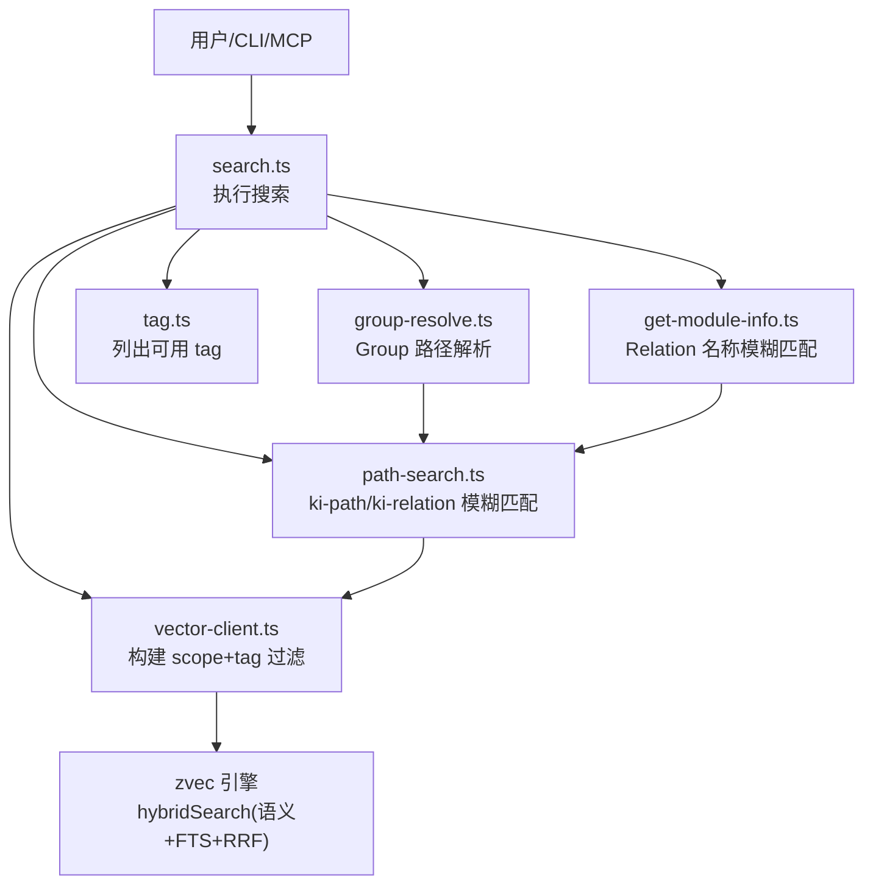
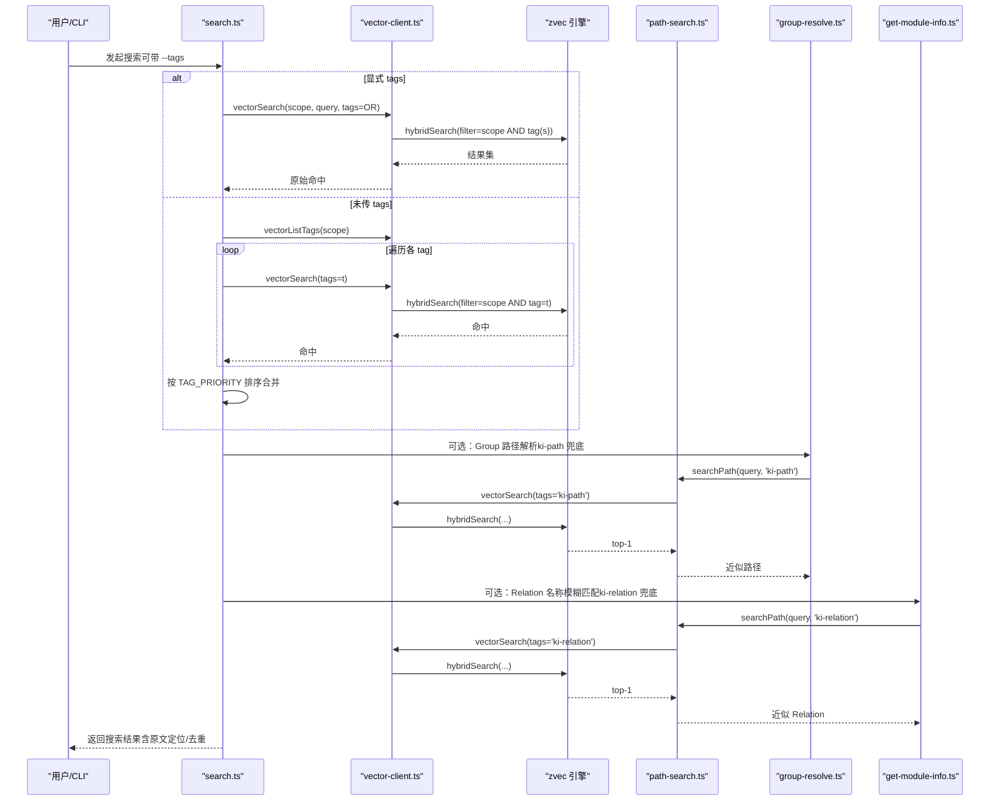
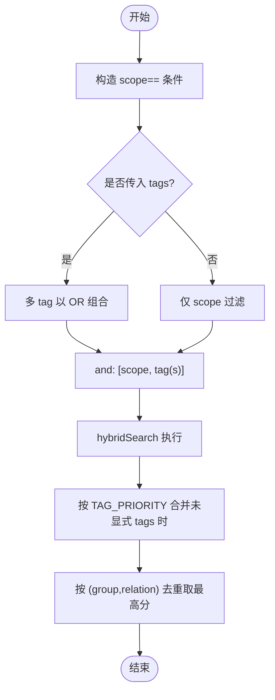
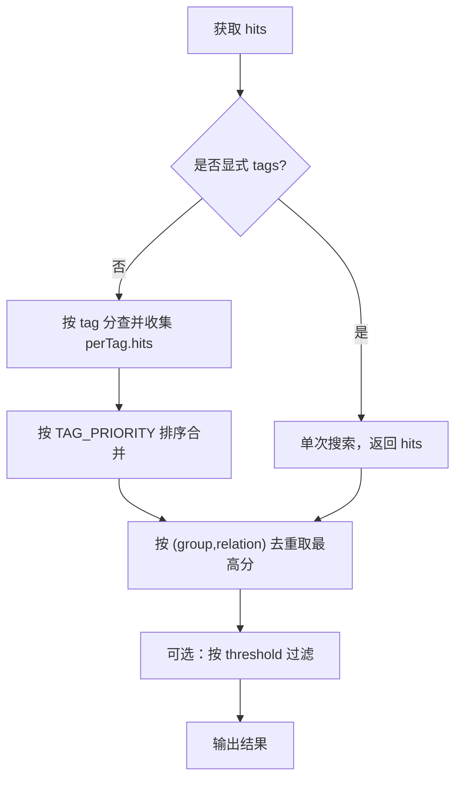
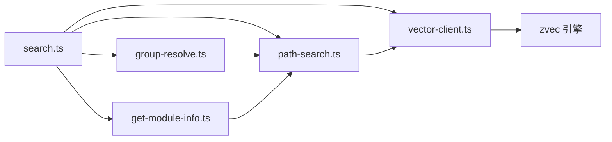

# 三层标签系统

<cite>
**本文引用的文件**
- [src/search.ts](file://src/search.ts)
- [src/lib/vector-client.ts](file://src/lib/vector-client.ts)
- [src/lib/path-search.ts](file://src/lib/path-search.ts)
- [src/lib/group-resolve.ts](file://src/lib/group-resolve.ts)
- [src/get-module-info.ts](file://src/get-module-info.ts)
- [src/tag.ts](file://src/tag.ts)
- [docs/tags-design.md](file://docs/tags-design.md)
- [src/lib/scoring.ts](file://src/lib/scoring.ts)
</cite>

## 目录
1. [简介](#简介)
2. [项目结构](#项目结构)
3. [核心组件](#核心组件)
4. [架构总览](#架构总览)
5. [详细组件分析](#详细组件分析)
6. [依赖关系分析](#依赖关系分析)
7. [性能考量](#性能考量)
8. [故障排查指南](#故障排查指南)
9. [结论](#结论)
10. [附录：API与使用示例](#附录api与使用示例)

## 简介
本文件系统化阐述 knowledge-indexer 的三层标签体系：ki-path、ki-relation、ki-search。三者基于向量引擎的 metadata 字段 tag 实现“物理隔离”，分别承担路径层级索引、Relation 名称索引与通用语义搜索职责，并通过统一的过滤、优先级与去重机制协同工作，最终服务于 ki search CLI、MCP 工具以及内部的路径/关系解析能力。

## 项目结构
围绕三层标签的关键代码分布在以下模块：
- 标签发现与统计：tag.ts（只读枚举 scope 下的 tag）
- 检索入口与优先级：search.ts（默认按 ki-search 优先，其次 ki-relation / ki-path）
- 向量客户端与过滤：vector-client.ts（构建 scope+tag 过滤、多 tag OR 组合、hybridSearch）
- 路径/关系模糊匹配：path-search.ts（统一封装 ki-path / ki-relation 的向量搜索）
- Group 路径解析：group-resolve.ts（精确匹配 + 补全 + 向量兜底）
- Relation 查询：get-module-info.ts（Relation 名称模糊匹配）
- 设计文档：tags-design.md（三类标签的职责、写入/消费链路、隔离设计）

图表来源
- [src/search.ts:20-121](file://src/search.ts#L20-L121)
- [src/lib/vector-client.ts:477-506](file://src/lib/vector-client.ts#L477-L506)
- [src/lib/path-search.ts:47-87](file://src/lib/path-search.ts#L47-L87)
- [src/lib/group-resolve.ts:117-219](file://src/lib/group-resolve.ts#L117-L219)
- [src/get-module-info.ts:61-168](file://src/get-module-info.ts#L61-L168)
- [src/tag.ts:34-72](file://src/tag.ts#L34-L72)

章节来源
- [docs/tags-design.md:1-15](file://docs/tags-design.md#L1-L15)
- [src/search.ts:20-121](file://src/search.ts#L20-L121)
- [src/lib/vector-client.ts:477-506](file://src/lib/vector-client.ts#L477-L506)

## 核心组件
- 三层标签定义与职责
  - ki-path：路径层级索引，用于 group-resolve 与 query-group 的路径模糊匹配
  - ki-relation：Relation 名称索引，用于 get-module-info 的关系名称模糊匹配
  - ki-search：通用语义搜索，面向 ki search CLI 与 MCP 的通用内容检索
- 标签隔离与过滤
  - 通过 vector-client 的 buildScopeTagFilter 将 scope 与 tag 以 AND/OR 组合为底层 filter
  - 多 tag 以逗号分隔传入时，等价于 OR 组合召回
- 搜索优先级与合并
  - 不显式传 tags 时，按 tag 分查并依据 TAG_PRIORITY 排序（ki-search > ki-relation > ki-path）
  - 同一 (group, relation) 的多 tag 重复命中会保留最高分的一条
- 路径/关系模糊匹配
  - path-search 统一封装 ki-path / ki-relation 的向量搜索，返回提取后的路径/名称
  - group-resolve 与 get-module-info 在精确匹配失败后走向量兜底

章节来源
- [docs/tags-design.md:17-129](file://docs/tags-design.md#L17-L129)
- [src/lib/vector-client.ts:618-628](file://src/lib/vector-client.ts#L618-L628)
- [src/search.ts:20-121](file://src/search.ts#L20-L121)
- [src/lib/path-search.ts:47-116](file://src/lib/path-search.ts#L47-L116)
- [src/lib/group-resolve.ts:117-219](file://src/lib/group-resolve.ts#L117-L219)
- [src/get-module-info.ts:61-168](file://src/get-module-info.ts#L61-L168)

## 架构总览
三层标签在写入与查询阶段均通过 metadata 字段 tag 进行硬隔离；查询侧支持多 tag OR 组合与优先级排序；路径/关系解析采用“精确匹配 + 补全 + 向量兜底”的分层策略。

图表来源
- [src/search.ts:70-196](file://src/search.ts#L70-L196)
- [src/lib/vector-client.ts:477-506](file://src/lib/vector-client.ts#L477-L506)
- [src/lib/path-search.ts:47-87](file://src/lib/path-search.ts#L47-L87)
- [src/lib/group-resolve.ts:117-219](file://src/lib/group-resolve.ts#L117-L219)
- [src/get-module-info.ts:61-168](file://src/get-module-info.ts#L61-L168)

## 详细组件分析

### 标签类型与作用
- ki-path
  - 作用：存储 Group 路径层级，供 group-resolve/query-group 做路径模糊匹配
  - 写入：import 链路批量写入，每个 Group 一条
  - 查询：searchPath(tag='ki-path')，阈值默认 0（RRF 融合分），由下游做存在性校验
- ki-relation
  - 作用：存储 Relation 名称，供 get-module-info 做名称模糊匹配
  - 写入：import/sync-relation 写入，content 纯化避免 BM25 误匹配
  - 查询：searchPath(tag='ki-relation')，同样 RRF 融合分，下游二次校验
- ki-search
  - 作用：通用语义搜索，面向 ki search CLI 与 MCP
  - 写入：batch-vectorize/sync-relation/store/bulk-store/mcp-tools 等
  - 查询：默认搜索范围，支持 --tags 过滤

章节来源
- [docs/tags-design.md:17-129](file://docs/tags-design.md#L17-L129)
- [src/lib/path-search.ts:47-116](file://src/lib/path-search.ts#L47-L116)
- [src/search.ts:70-121](file://src/search.ts#L70-L121)

### 过滤机制：AND、OR 与优先级
- 过滤规则
  - scope 必等：filter.field = 'scope', op = '=='
  - tag 非空时：单 tag 直接等于；多 tag 以 or 组合多个 == 条件
  - 最终 filter = { and: [scopeCond, tagFilter] }
- 优先级
  - 未显式传 tags 时，先枚举所有 tag，再对每个 tag 单独检索，最后按 TAG_PRIORITY 排序合并
  - TAG_PRIORITY = ['ki-search', 'ki-relation', 'ki-path']
- 多 tag OR 组合
  - 显式传入 --tags a,b 时，等价于 tag=a OR tag=b 的过滤条件
  - 同一文档因多 tag 写入会产生多条命中，后续会按 (group, relation) 去重并保留最高分

图表来源
- [src/lib/vector-client.ts:618-628](file://src/lib/vector-client.ts#L618-L628)
- [src/search.ts:20-121](file://src/search.ts#L20-L121)
- [src/search.ts:159-177](file://src/search.ts#L159-L177)

章节来源
- [src/lib/vector-client.ts:618-628](file://src/lib/vector-client.ts#L618-L628)
- [src/search.ts:20-121](file://src/search.ts#L20-L121)
- [src/search.ts:159-177](file://src/search.ts#L159-L177)

### 评分与排序影响
- 向量侧
  - hybridSearch 返回 RRF 融合分或加权融合分，score 越大越相关
  - 可通过 threshold 参数过滤低于阈值的命中
- 业务侧
  - 未显式传 tags 时，按 TAG_PRIORITY 排序合并，ki-search 内容优先
  - 同一 (group, relation) 的多 tag 重复命中去重，保留 score 最高的一条
- 使用密度评分（Relation 热度）
  - recordUse/calculateScore 维护 useCount 与 lastUsedTime，结合半衰期计算分数
  - hybridPartition 将结果分区为 hot/warm/cold，支持边界衰减

图表来源
- [src/search.ts:70-121](file://src/search.ts#L70-L121)
- [src/search.ts:159-177](file://src/search.ts#L159-L177)
- [src/lib/scoring.ts:44-79](file://src/lib/scoring.ts#L44-L79)
- [src/lib/scoring.ts:90-117](file://src/lib/scoring.ts#L90-L117)

章节来源
- [src/search.ts:70-121](file://src/search.ts#L70-L121)
- [src/search.ts:159-177](file://src/search.ts#L159-L177)
- [src/lib/scoring.ts:44-117](file://src/lib/scoring.ts#L44-L117)

### 持久化存储与索引机制
- 存储模型
  - 单一 collection，scope/tag/group/content 作为标量/文本字段
  - docId = sha256(text + scope + tag) 截 32，幂等 upsert
  - tag 为单值 STRING 字段，多 tag 通过同内容多 doc 实现
- 索引与检索
  - dense 向量字段 + content 的 FTS（jieba 分词）+ hybridSearch（语义+关键词+RRF）
  - tag/scope/group 建立标量索引，查询时硬过滤
- 删除与清理
  - vectorDelete 按 doc id 删除；vectorDeleteScope 循环删除指定 scope/tag 下全部文档

章节来源
- [src/lib/vector-client.ts:225-242](file://src/lib/vector-client.ts#L225-L242)
- [src/lib/vector-client.ts:271-294](file://src/lib/vector-client.ts#L271-L294)
- [src/lib/vector-client.ts:477-506](file://src/lib/vector-client.ts#L477-L506)
- [src/lib/vector-client.ts:597-608](file://src/lib/vector-client.ts#L597-L608)
- [src/lib/vector-client.ts:732-753](file://src/lib/vector-client.ts#L732-L753)

### 使用示例与最佳实践
- 创建与写入
  - 通用内容：ki store / bulk-store / MCP ki_store → tags: 'ki-search'
  - 路径索引：import 批量写入 → tags: 'ki-path'
  - 关系索引：import/sync-relation → tags: 'ki-relation'
- 查询与过滤
  - 默认搜索：ki search <query> → 默认搜索 ki-search
  - 指定标签：ki search --tags ki-path,ki-relation <query> → OR 组合
  - 路径/关系模糊匹配：group-resolve/get-module-info 自动走 searchPath
- 最佳实践
  - 命名规范：tag 小写化，避免大小写不一致导致过滤失效
  - 层次化设计：ki-path 用空格分隔层级，便于还原为 Group 路径
  - 性能优化：合理设置 limit/threshold；大库下使用 scan-limit 控制 tag 枚举成本；必要时显式 --tags 缩小范围

章节来源
- [docs/tags-design.md:17-129](file://docs/tags-design.md#L17-L129)
- [src/search.ts:204-237](file://src/search.ts#L204-L237)
- [src/lib/path-search.ts:47-116](file://src/lib/path-search.ts#L47-L116)
- [src/lib/vector-client.ts:218-223](file://src/lib/vector-client.ts#L218-L223)

### AI Agent 集成与检索精度提升
- 通过 ki-search 提供通用语义检索能力，Agent 可将自然语言问题转为向量查询
- 利用 ki-path/ki-relation 进行结构化上下文增强（如限定到某 Group 或 Relation）
- 借助 --tags 精准过滤与优先级排序，减少噪声，提升召回质量
- 结合原文召回（includeOriginal）与去重逻辑，提高答案的可追溯性与可读性

章节来源
- [src/search.ts:70-196](file://src/search.ts#L70-L196)
- [docs/tags-design.md:98-129](file://docs/tags-design.md#L98-L129)

## 依赖关系分析
- 组件耦合
  - search.ts 依赖 vector-client.ts 完成检索与过滤，依赖 path-search.ts 与 group-resolve.ts 做路径/关系兜底
  - path-search.ts 依赖 vector-client.ts 的 vectorSearch
  - group-resolve.ts 与 get-module-info.ts 依赖 path-search.ts 进行模糊匹配
- 外部依赖
  - zvec 引擎：hybridSearch、listIds、upsert/delete 等
  - embedding provider：SiliconFlowProvider（维度、baseURL、apiKey 来自配置）

图表来源
- [src/search.ts:70-196](file://src/search.ts#L70-L196)
- [src/lib/path-search.ts:47-87](file://src/lib/path-search.ts#L47-L87)
- [src/lib/group-resolve.ts:117-219](file://src/lib/group-resolve.ts#L117-L219)
- [src/get-module-info.ts:61-168](file://src/get-module-info.ts#L61-L168)
- [src/lib/vector-client.ts:477-506](file://src/lib/vector-client.ts#L477-L506)

章节来源
- [src/search.ts:70-196](file://src/search.ts#L70-L196)
- [src/lib/path-search.ts:47-87](file://src/lib/path-search.ts#L47-L87)
- [src/lib/group-resolve.ts:117-219](file://src/lib/group-resolve.ts#L117-L219)
- [src/get-module-info.ts:61-168](file://src/get-module-info.ts#L61-L168)
- [src/lib/vector-client.ts:477-506](file://src/lib/vector-client.ts#L477-L506)

## 性能考量
- 扫描与枚举
  - vectorListTags 受 scanLimit 约束，超出结果为近似（truncated:true）
- 过滤与召回
  - 显式 --tags 可显著缩小搜索空间；未传 tags 时会枚举所有 tag 并分查
- 去重与排序
  - 多 tag 重复命中按 (group, relation) 去重，降低冗余
- 资源管理
  - CLI per-call 调用后 closeEngine 释放 LOCK；常驻 MCP 启用空闲释放锁，避免长时间占用

章节来源
- [src/tag.ts:34-72](file://src/tag.ts#L34-L72)
- [src/lib/vector-client.ts:688-717](file://src/lib/vector-client.ts#L688-L717)
- [src/search.ts:159-177](file://src/search.ts#L159-L177)
- [src/search.ts:234-236](file://src/search.ts#L234-L236)
- [src/lib/vector-client.ts:164-181](file://src/lib/vector-client.ts#L164-L181)

## 故障排查指南
- 向量服务不可用
  - ensureVectorAvailable 检测锁定/损坏/异常，返回 code 与提示
  - 常见原因：其他进程占用、数据库损坏、worker 不可用
- 搜索无结果
  - 检查 --tags 是否正确；确认数据已写入对应 tag
  - 调整 threshold 或 limit；确认 scope 正确
- 原文不可用
  - includeOriginal 开启时，若本地 KB 缺失 relation，将降级返回向量 content 并给出 hint
- 标签污染
  - 确保写入时显式传递正确的 tag；ki-search 必须显式 tags:'ki-search'

章节来源
- [src/lib/vector-client.ts:420-467](file://src/lib/vector-client.ts#L420-L467)
- [src/search.ts:135-155](file://src/search.ts#L135-L155)
- [docs/tags-design.md:118-121](file://docs/tags-design.md#L118-L121)

## 结论
三层标签体系通过清晰的职责划分、严格的过滤与优先级机制，以及稳健的模糊匹配与去重策略，实现了知识分类与检索的高精度与高可用性。配合原文召回与使用密度评分，既能满足日常检索需求，也能支撑 AI Agent 的高效集成。

## 附录：API与使用示例
- 列出可用标签
  - 命令：ki tag list [--scope <scope>] [--scan-limit <n>]
  - 说明：只读枚举当前 scope 下出现过的 tag 及其数量
- 执行搜索
  - 命令：ki search <query> [--limit <n>] [--threshold <t>] [--tags <a,b>] [--original]
  - 行为：默认搜索 ki-search；--tags 支持多 tag OR；--original 返回本地 KB 原文（如可用）
- 路径/关系模糊匹配
  - 路径：group-resolve 在精确匹配失败后调用 searchPath('ki-path')
  - 关系：get-module-info 在精确匹配失败后调用 searchPath('ki-relation')
- 写入示例
  - 通用内容：ki store / bulk-store / MCP ki_store → tags:'ki-search'
  - 路径索引：import 批量写入 → tags:'ki-path'
  - 关系索引：import/sync-relation → tags:'ki-relation'

章节来源
- [src/tag.ts:58-72](file://src/tag.ts#L58-L72)
- [src/search.ts:204-237](file://src/search.ts#L204-L237)
- [src/lib/path-search.ts:47-116](file://src/lib/path-search.ts#L47-L116)
- [src/lib/group-resolve.ts:117-219](file://src/lib/group-resolve.ts#L117-L219)
- [src/get-module-info.ts:61-168](file://src/get-module-info.ts#L61-L168)
- [docs/tags-design.md:17-129](file://docs/tags-design.md#L17-L129)