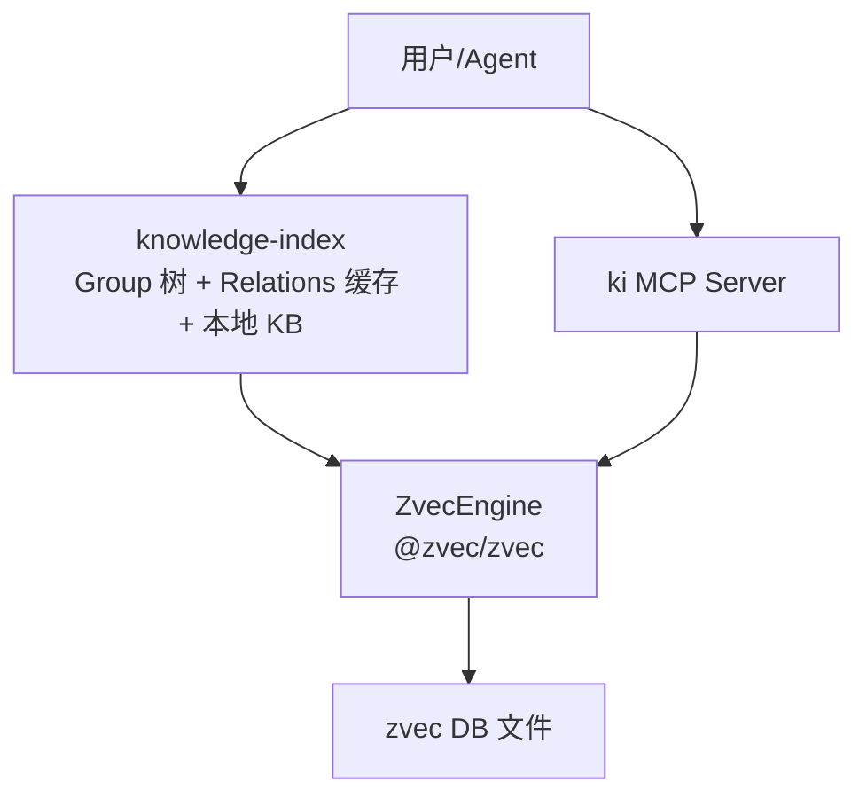
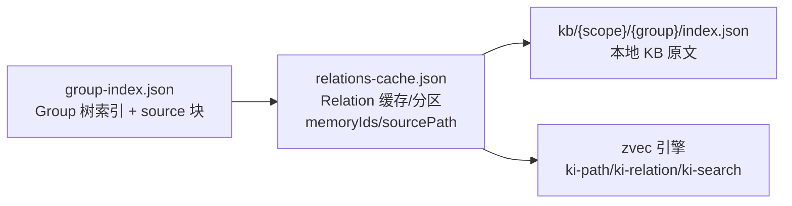
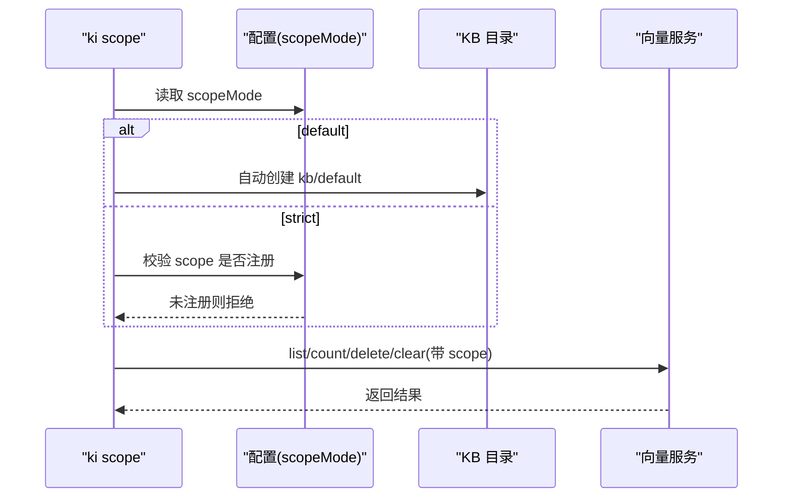
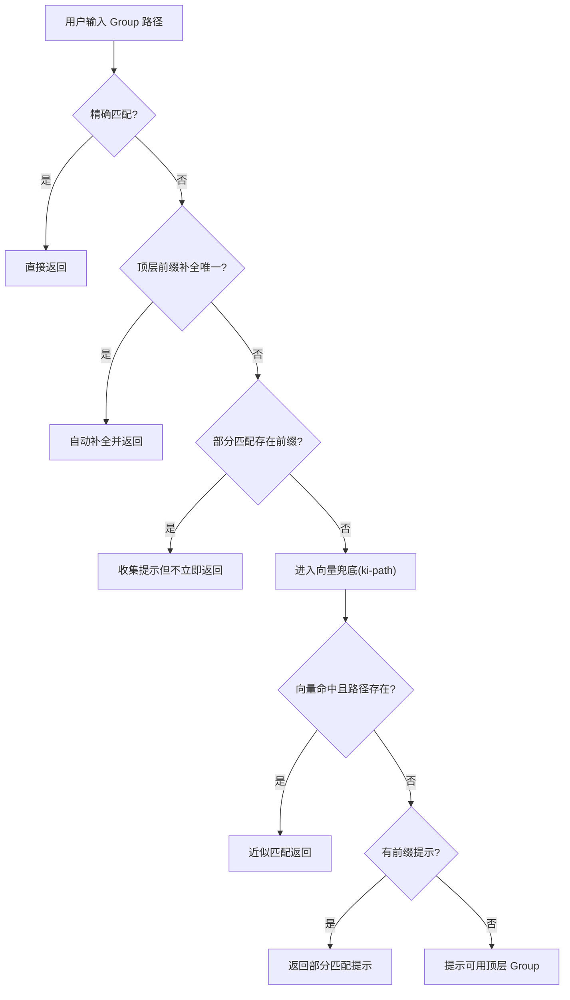
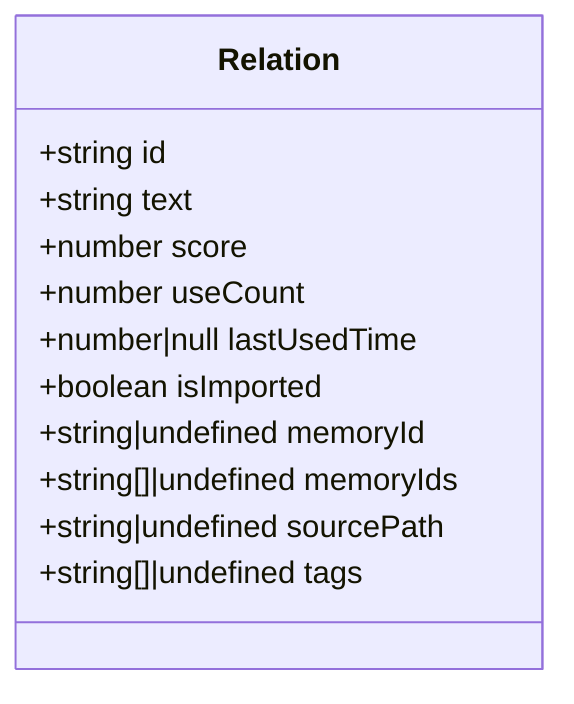
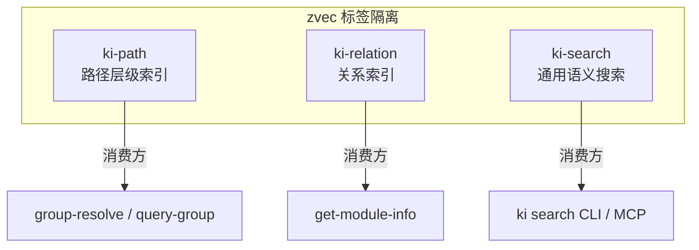
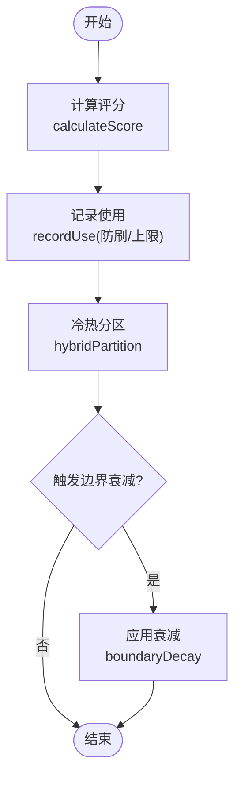
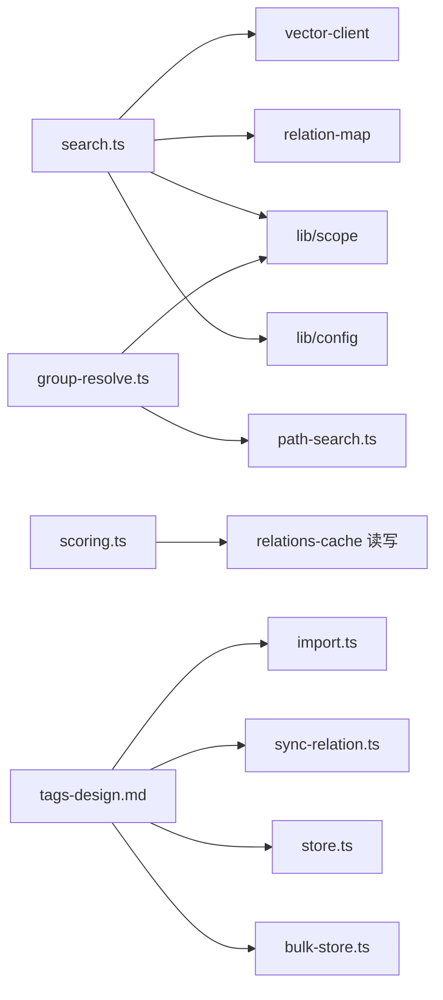

# 核心概念

<cite>
**本文引用的文件**
- [src/scope.ts](file://src/scope.ts)
- [src/lib/scope.ts](file://src/lib/scope.ts)
- [src/config.ts](file://src/config.ts)
- [src/lib/scoring.ts](file://src/lib/scoring.ts)
- [src/lib/relation-map.ts](file://src/lib/relation-map.ts)
- [src/lib/group-resolve.ts](file://src/lib/group-resolve.ts)
- [src/search.ts](file://src/search.ts)
- [src/lib/path-search.ts](file://src/lib/path-search.ts)
- [docs/tags-design.md](file://docs/tags-design.md)
- [docs/architecture.md](file://docs/architecture.md)
- [docs/manage-index.md](file://docs/manage-index.md)
- [_template/relations-cache.json](file://_template/relations-cache.json)
- [test/fixtures/mock-wiki/核心概念/Scope 隔离机制.md](file://test/fixtures/mock-wiki/核心概念/Scope 隔离机制.md)
- [test/fixtures/mock-wiki/核心概念/Group 树结构.md](file://test/fixtures/mock-wiki/核心概念/Group 树结构.md)
</cite>

## 目录
1. [引言](#引言)
2. [项目结构](#项目结构)
3. [核心组件](#核心组件)
4. [架构总览](#架构总览)
5. [详细组件分析](#详细组件分析)
6. [依赖关系分析](#依赖关系分析)
7. [性能考量](#性能考量)
8. [故障排查指南](#故障排查指南)
9. [结论](#结论)
10. [附录：使用示例与最佳实践](#附录使用示例与最佳实践)

## 引言
本章节面向初学者与高级用户，系统化阐述 knowledge-indexer 的核心概念：Scope 隔离机制、Group 树结构、Relation 关系模型、三层标签体系（ki-search、ki-path、ki-relation），以及记忆库的冷热治理、评分衰减与使用计数。文档以源码为依据，提供可视化图示与可操作的最佳实践。

## 项目结构
knowledge-indexer 围绕“本地知识索引 + 向量检索”的双通道设计：
- 本地 KB 层：group-index.json、relations-cache.json、kb/{scope}/{group}/index.json
- 向量语义层：zvec 引擎，通过 metadata tags 实现 ki-path / ki-relation / ki-search 三类数据物理隔离
- CLI/MCP：search、query-group、sync-relation、store、bulk-store 等命令统一入口

图表来源
- [docs/architecture.md:11-26](file://docs/architecture.md#L11-L26)

章节来源
- [docs/architecture.md:11-26](file://docs/architecture.md#L11-L26)
- [docs/manage-index.md:12-34](file://docs/manage-index.md#L12-L34)

## 核心组件
- Scope 隔离：基于 scopeMode 控制默认/严格模式，KB 与向量两层物理隔离
- Group 树：group-index.json 中的 groups 层级结构，支持自动补全与向量兜底
- Relation 模型：relations-cache.json 中 hot_relations 条目，含 memoryId/memoryIds、sourcePath、score、useCount、lastUsedTime、tags
- 三层标签：ki-path（路径索引）、ki-relation（关系索引）、ki-search（通用搜索）
- 记忆库治理：hybridPartition 分区、boundaryDecay 边界衰减、recordUse 防刷与上限、calculateScore 评分

章节来源
- [src/lib/scope.ts:1-230](file://src/lib/scope.ts#L1-L230)
- [src/lib/scoring.ts:1-275](file://src/lib/scoring.ts#L1-L275)
- [src/lib/relation-map.ts:1-120](file://src/lib/relation-map.ts#L1-L120)
- [docs/tags-design.md:1-227](file://docs/tags-design.md#L1-L227)
- [_template/relations-cache.json:1-19](file://_template/relations-cache.json#L1-L19)

## 架构总览
知识索引系统由三层文件系统与向量引擎组成：
- Layer 1：Group 树索引（group-index.json）
- Layer 2：Relations 缓存（relations-cache.json，含评分/淘汰/分区）
- Layer 3：本地 KB（kb/{scope}/{group}/index.json，Markdown 原文）
- 向量层：zvec 引擎，按 tags 隔离三类数据

图表来源
- [docs/architecture.md:38-60](file://docs/architecture.md#L38-L60)

章节来源
- [docs/architecture.md:38-60](file://docs/architecture.md#L38-L60)

## 详细组件分析

### Scope 隔离机制
- scopeMode：default（未传 --scope 时静默落 default，自动创建）或 strict（必须显式传入已注册 scope，否则报错）
- 物理隔离：每个 scope 独立目录 kb/{scope}/，包含 group-index.json、relations-cache.json；向量层通过 metadata.scope 隔离
- 校验规则：仅允许字母、数字、连字符、下划线，禁止路径遍历字符
- 生命周期管理：list/delete/clear 支持跨两层（KB + 向量）一致清理

图表来源
- [src/scope.ts:94-132](file://src/scope.ts#L94-L132)
- [src/lib/scope.ts:30-53](file://src/lib/scope.ts#L30-L53)
- [src/config.ts:101-105](file://src/config.ts#L101-L105)

章节来源
- [src/scope.ts:1-303](file://src/scope.ts#L1-L303)
- [src/lib/scope.ts:1-230](file://src/lib/scope.ts#L1-L230)
- [src/config.ts:101-105](file://src/config.ts#L101-L105)
- [docs/manage-index.md:279-306](file://docs/manage-index.md#L279-L306)
- [test/fixtures/mock-wiki/核心概念/Scope 隔离机制.md:1-26](file://test/fixtures/mock-wiki/核心概念/Scope 隔离机制.md#L1-L26)

### Group 树结构与层次化知识管理
- 数据结构：version 2 的 groups 树，顶层 Group → 子 Group → 深层 Group
- 路径表示：如 API/用户认证/OAuth
- 自动补全：resolveGroupPath 四层查找 + 向量兜底（ki-path）
- source 块：记录导入来源 dir、chunkSize/chunkOverlap，用于 Wiki 写回定位与幂等增量更新

图表来源
- [src/lib/group-resolve.ts:117-219](file://src/lib/group-resolve.ts#L117-L219)
- [src/lib/path-search.ts:47-87](file://src/lib/path-search.ts#L47-L87)

章节来源
- [test/fixtures/mock-wiki/核心概念/Group 树结构.md:1-42](file://test/fixtures/mock-wiki/核心概念/Group 树结构.md#L1-L42)
- [src/lib/group-resolve.ts:1-220](file://src/lib/group-resolve.ts#L1-L220)
- [src/lib/path-search.ts:1-116](file://src/lib/path-search.ts#L1-L116)

### Relation 关系模型
- 位置：relations-cache.json 的 hot_relations 数组
- 关键字段：
  - id：关系标识
  - text：关系名称（文件级 relation 名）
  - score：评分（基于 useCount 与 lastUsedTime）
  - useCount：使用计数（防刷与上限）
  - lastUsedTime：最近使用时间
  - isImported：是否来自导入
  - memoryId/memoryIds：关联到向量存储的 ID（单值/多值兼容）
  - sourcePath：相对 source.dir 的 posix 路径，用于幂等判定
  - tags：文档级自定义标签（持久化到 KB 层，供 rebuild-vector/restore 恢复 tag 向量）

图表来源
- [src/lib/scoring.ts:19-36](file://src/lib/scoring.ts#L19-L36)
- [docs/architecture.md:83-100](file://docs/architecture.md#L83-L100)

章节来源
- [src/lib/scoring.ts:19-36](file://src/lib/scoring.ts#L19-L36)
- [docs/architecture.md:83-100](file://docs/architecture.md#L83-L100)
- [src/lib/relation-map.ts:1-120](file://src/lib/relation-map.ts#L1-L120)

### 三层标签系统（ki-search、ki-path、ki-relation）
- ki-path：路径层级索引，用于 group-resolve/query-group 的路径模糊匹配
- ki-relation：关系索引，用于 get-module-info 的关系名称模糊匹配
- ki-search：通用语义搜索，ki search CLI/MCP 的默认数据源
- 写入隔离：metadata.tags 字段硬隔离
- 查询隔离：filter 限定 tags，避免污染

图表来源
- [docs/tags-design.md:133-156](file://docs/tags-design.md#L133-L156)

章节来源
- [docs/tags-design.md:1-227](file://docs/tags-design.md#L1-L227)
- [src/search.ts:20-24](file://src/search.ts#L20-L24)
- [src/lib/path-search.ts:1-116](file://src/lib/path-search.ts#L1-L116)

### 记忆库：冷热治理、评分衰减与使用计数
- 评分计算：score = useCount / (1 + hoursSinceLastUse / halfLifeHours)
- 使用记录：recordUse 防刷（5分钟间隔）+ 上限（MAX_USE_COUNT）
- 冷热分区：hybridPartition 新兴热区保留席位 + 历史热门按评分填充 + 温冷按比例分配 + 上限截断
- 边界衰减：boundaryDecay 当新内容进入热区时，对热/温边界分数进行衰减调整

图表来源
- [src/lib/scoring.ts:44-79](file://src/lib/scoring.ts#L44-L79)
- [src/lib/scoring.ts:90-117](file://src/lib/scoring.ts#L90-L117)
- [src/lib/scoring.ts:222-274](file://src/lib/scoring.ts#L222-L274)

章节来源
- [src/lib/scoring.ts:1-275](file://src/lib/scoring.ts#L1-L275)
- [_template/relations-cache.json:1-19](file://_template/relations-cache.json#L1-L19)

## 依赖关系分析
- search.ts 依赖：
  - vector-client（向量检索）
  - relation-map（memoryId 反查）
  - scope（路径解析与本地 KB 访问）
  - config（scope 解析）
- group-resolve.ts 依赖：
  - path-search（向量兜底）
  - scope（GroupIndex 类型）
- scoring.ts 被 relations-cache 读写流程调用，驱动分区与衰减
- tags-design.md 定义标签体系，贯穿 import/sync-relation/store/bulk-store/search

图表来源
- [src/search.ts:11-18](file://src/search.ts#L11-L18)
- [src/lib/group-resolve.ts:7-8](file://src/lib/group-resolve.ts#L7-L8)
- [src/lib/scoring.ts:11-15](file://src/lib/scoring.ts#L11-L15)
- [docs/tags-design.md:212-227](file://docs/tags-design.md#L212-L227)

章节来源
- [src/search.ts:1-248](file://src/search.ts#L1-L248)
- [src/lib/group-resolve.ts:1-220](file://src/lib/group-resolve.ts#L1-L220)
- [src/lib/scoring.ts:1-275](file://src/lib/scoring.ts#L1-L275)
- [docs/tags-design.md:212-227](file://docs/tags-design.md#L212-L227)

## 性能考量
- 向量检索：RRF 融合分，阈值默认 0，由下游存在性校验兜底质量
- 标签过滤：metadata tags 硬过滤，避免客户端后处理开销
- 缓存策略：relation-map 带 TTL+mtime+size 失效，首次构建 O(N)，后续 O(1)
- 防刷与上限：recordUse 限制高频使用计数，避免评分膨胀
- 分区上限：maxHotCount/maxWarmCount/maxColdCount 控制内存占用

[本节为通用性能讨论，不直接分析具体文件]

## 故障排查指南
- 向量服务不可用：search 返回 degraded，需检查 zvec 服务状态
- scope 非法：validateScope 抛出 ScopeError，检查 scope 命名规范
- 原文不可用：fetchOriginal 失败时降级返回向量 content，提示重建或同步
- 标签污染：确保写入时显式设置 tags，避免混入内部标签
- 缓存陈旧：relation-map 基于 mtime+size+TTL 失效，必要时清除缓存

章节来源
- [src/search.ts:84-92](file://src/search.ts#L84-L92)
- [src/lib/scope.ts:30-43](file://src/lib/scope.ts#L30-L43)
- [src/search.ts:54-68](file://src/search.ts#L54-L68)
- [src/lib/relation-map.ts:54-78](file://src/lib/relation-map.ts#L54-L78)

## 结论
knowledge-indexer 通过 Scope 隔离、Group 树导航、Relation 关系模型、三层标签体系与记忆库冷热治理，构建了高效、可扩展的知识索引与检索系统。其设计兼顾易用性与技术深度，适合从入门到高级的多层次使用场景。

[本节为总结性内容，不直接分析具体文件]

## 附录：使用示例与最佳实践

### Scope 隔离
- 示例：在 default 模式下省略 --scope，自动落 default；strict 模式下必须显式传入已注册 scope
- 最佳实践：生产环境推荐 strict 模式，避免误写；定期使用 ki scope list 检查两层一致性

章节来源
- [src/config.ts:101-105](file://src/config.ts#L101-L105)
- [src/scope.ts:94-132](file://src/scope.ts#L94-L132)

### Group 树导航
- 示例：输入“告警系统”自动补全为“BK-Monitor-Wiki/告警系统设计”
- 最佳实践：保持 Group 命名简洁明确；利用向量兜底提升容错率

章节来源
- [src/lib/group-resolve.ts:117-219](file://src/lib/group-resolve.ts#L117-L219)
- [test/fixtures/mock-wiki/核心概念/Group 树结构.md:21-26](file://test/fixtures/mock-wiki/核心概念/Group 树结构.md#L21-L26)

### Relation 关系模型
- 示例：导入文件生成文件级 relation，memoryIds 指向全部 chunk；sourcePath 用于幂等覆盖
- 最佳实践：使用 scan-kb import 批量导入；sync-relation 手动补充模块说明

章节来源
- [docs/architecture.md:83-100](file://docs/architecture.md#L83-L100)
- [src/lib/relation-map.ts:80-114](file://src/lib/relation-map.ts#L80-L114)

### 三层标签体系
- 示例：ki search 默认搜索 ki-search；ki path/relation 用于内部匹配
- 最佳实践：写入时显式设置 tags；避免自定义标签与内部标签冲突

章节来源
- [docs/tags-design.md:1-227](file://docs/tags-design.md#L1-L227)
- [src/search.ts:20-24](file://src/search.ts#L20-L24)

### 记忆库治理
- 示例：高频使用条目进入 hot，低频进入 cold；recentHours 内使用过的新兴条目优先保留
- 最佳实践：合理配置 decayStep/halfLifeHours；监控 hot/warm/cold 分布

章节来源
- [src/lib/scoring.ts:44-79](file://src/lib/scoring.ts#L44-L79)
- [src/lib/scoring.ts:90-117](file://src/lib/scoring.ts#L90-L117)
- [_template/relations-cache.json:4-16](file://_template/relations-cache.json#L4-L16)