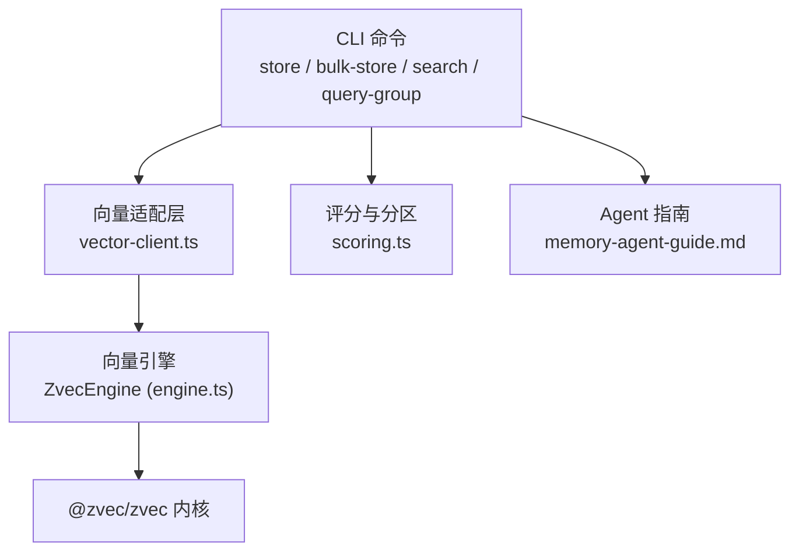
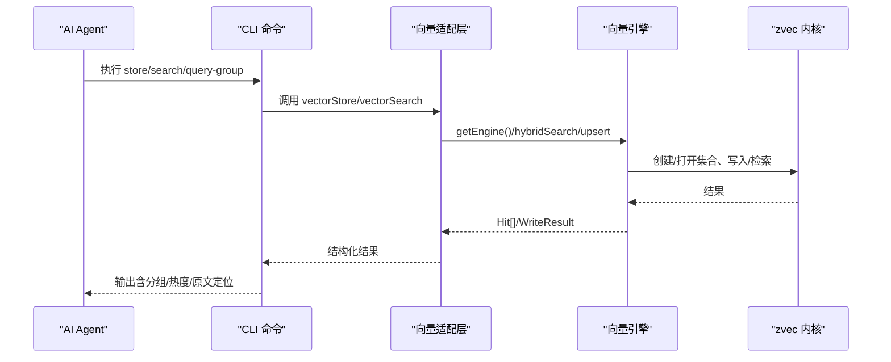
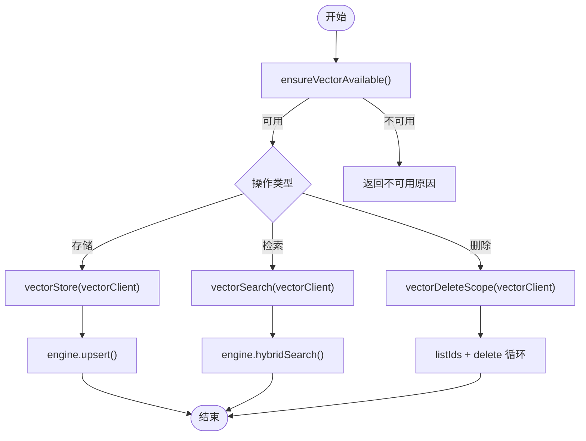
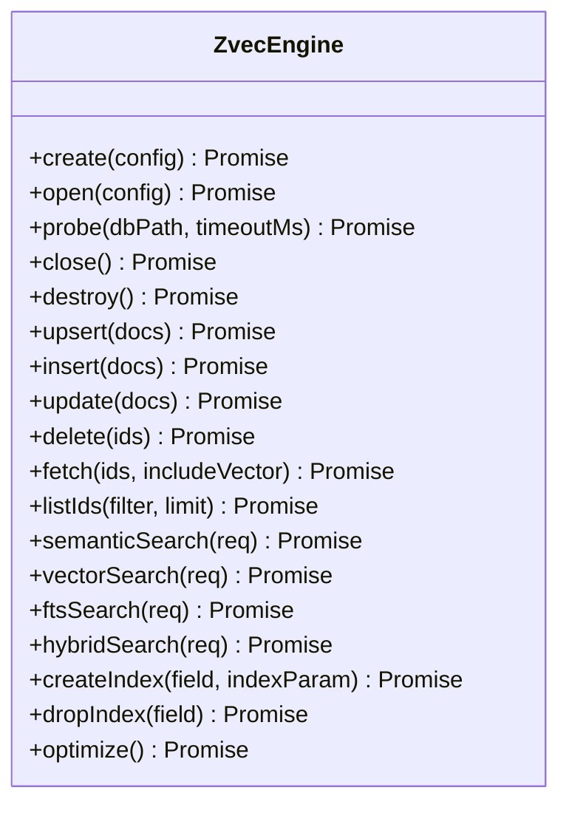
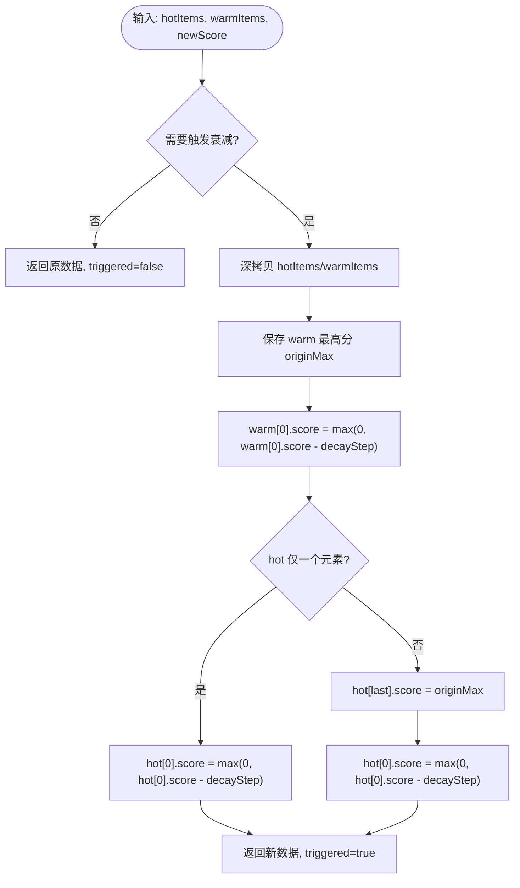
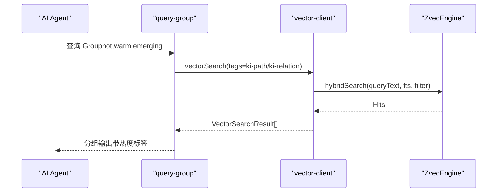
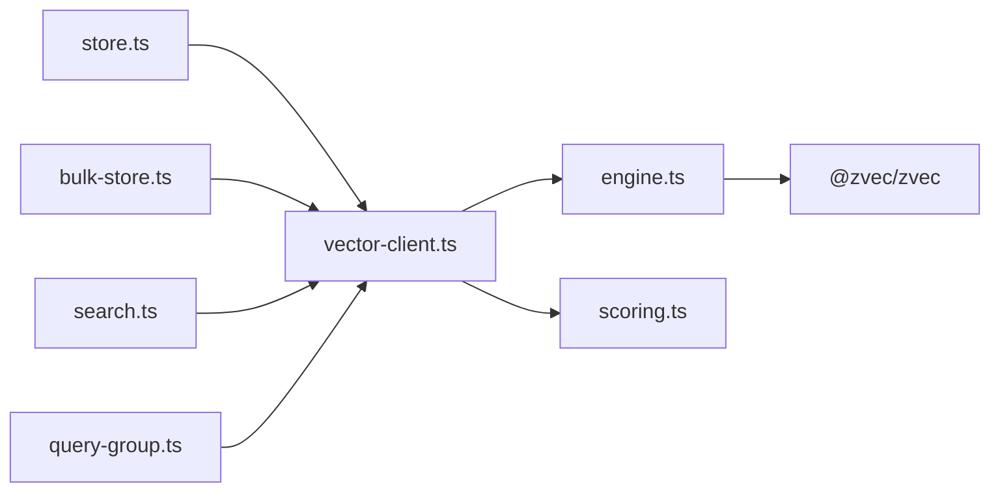

# 记忆库系统

<cite>
**本文引用的文件**
- [store.ts](file://src/store.ts)
- [bulk-store.ts](file://src/bulk-store.ts)
- [search.ts](file://src/search.ts)
- [query-group.ts](file://src/query-group.ts)
- [vector-client.ts](file://src/lib/vector-client.ts)
- [engine.ts](file://src/zvec-engine/engine.ts)
- [scoring.ts](file://src/lib/scoring.ts)
- [memory-agent-guide.md](file://docs/memory-agent-guide.md)
- [memory-storage-strategy.md](file://memories/memory-storage-strategy.md)
- [vector-engine-mem.md](file://docs/vector-engine-mem.md)
</cite>

## 目录
1. [简介](#简介)
2. [项目结构](#项目结构)
3. [核心组件](#核心组件)
4. [架构总览](#架构总览)
5. [详细组件分析](#详细组件分析)
6. [依赖关系分析](#依赖关系分析)
7. [性能考量](#性能考量)
8. [故障排查指南](#故障排查指南)
9. [结论](#结论)
10. [附录：使用示例与最佳实践](#附录使用示例与最佳实践)

## 简介
本文件系统化阐述 knowledge-indexer 项目的“记忆库”能力，覆盖概念、冷热治理、存储结构、生命周期管理、向量检索集成、AI Agent 工作流应用以及性能优化策略。记忆库在 AI Agent 中承担“短期/长期记忆”的载体角色：短期记忆用于会话内上下文保持，长期记忆通过持久化索引实现跨会话知识积累与经验学习。本项目以“本地 Group 树 + 向量索引（zvec）+ 评分与分区（hot/warm/cold/emerging）”为核心，提供高召回、低延迟的记忆读写与查询体验。

## 项目结构
记忆库相关代码主要分布在以下位置：
- CLI 入口与编排：store.ts、bulk-store.ts、search.ts、query-group.ts
- 向量适配层：lib/vector-client.ts（封装 ZvecEngine，提供 store/search/bulk/delete 等 API）
- 向量引擎：zvec-engine/engine.ts（创建/打开集合、写入、混合检索、生命周期）
- 评分与分区：lib/scoring.ts（计算 score、记录使用、冷热分区、边界衰减）
- Agent 使用指南：docs/memory-agent-guide.md（记忆写入、查询三步走、归档策略）
- 存储策略备忘：memories/memory-storage-strategy.md（内置记忆 vs ki 记忆分流）

图表来源
- [store.ts:1-91](file://src/store.ts#L1-L91)
- [bulk-store.ts:1-110](file://src/bulk-store.ts#L1-L110)
- [search.ts:1-248](file://src/search.ts#L1-L248)
- [query-group.ts:1-784](file://src/query-group.ts#L1-L784)
- [vector-client.ts:1-754](file://src/lib/vector-client.ts#L1-L754)
- [engine.ts:1-569](file://src/zvec-engine/engine.ts#L1-L569)
- [scoring.ts:1-275](file://src/lib/scoring.ts#L1-L275)
- [memory-agent-guide.md:1-530](file://docs/memory-agent-guide.md#L1-L530)

章节来源
- [store.ts:1-91](file://src/store.ts#L1-L91)
- [bulk-store.ts:1-110](file://src/bulk-store.ts#L1-L110)
- [search.ts:1-248](file://src/search.ts#L1-L248)
- [query-group.ts:1-784](file://src/query-group.ts#L1-L784)
- [vector-client.ts:1-754](file://src/lib/vector-client.ts#L1-L754)
- [engine.ts:1-569](file://src/zvec-engine/engine.ts#L1-L569)
- [scoring.ts:1-275](file://src/lib/scoring.ts#L1-L275)
- [memory-agent-guide.md:1-530](file://docs/memory-agent-guide.md#L1-L530)

## 核心组件
- 向量适配层（vector-client.ts）
  - 统一对外暴露 vectorStore/vectorBulkStore/vectorSearch/vectorDeleteScope 等接口
  - 负责 scope/tag 过滤、docId 生成、可用性检测、空闲释放锁、撞锁重试、错误自愈
- 向量引擎（engine.ts）
  - 基于 zvec Rust 内核，提供 create/open/probe/close、upsert/insert/update/delete、hybridSearch/semanticSearch/ftsSearch
  - 内部按 EMBED_BATCH_SIZE 切分 embed 批次，失败粒度控制到小批，避免整批失败
- 评分与分区（scoring.ts）
  - calculateScore：useCount/(1+hoursSinceLastUse/halfLifeHours)
  - recordUse：防刷（5分钟间隔）、上限封顶
  - hybridPartition/partitionByScore：新兴热区保留席位、历史热区填充、常温/冷区比例切分、上限截断
  - boundaryDecay：新内容进入热区时触发边界衰减，平滑过渡
- CLI 编排
  - store.ts：单条存储（幂等 upsert），返回 docId
  - bulk-store.ts：批量存储，逐项结果汇总
  - search.ts：语义检索，支持 tag 优先级、原文召回、多 tag 去重
  - query-group.ts：Group 维度展示与分区输出，支持 hot/warm/cold/emerging/full

章节来源
- [vector-client.ts:1-754](file://src/lib/vector-client.ts#L1-L754)
- [engine.ts:1-569](file://src/zvec-engine/engine.ts#L1-L569)
- [scoring.ts:1-275](file://src/lib/scoring.ts#L1-L275)
- [store.ts:1-91](file://src/store.ts#L1-L91)
- [bulk-store.ts:1-110](file://src/bulk-store.ts#L1-L110)
- [search.ts:1-248](file://src/search.ts#L1-L248)
- [query-group.ts:1-784](file://src/query-group.ts#L1-L784)

## 架构总览
记忆库由“本地索引 + 向量索引 + 评分分区 + Agent 工作流”构成。Agent 通过 CLI 或 MCP 调用完成记忆的创建、更新、查询与清理；向量层提供高召回混合检索；评分分区将内容划分为热/温/冷/新兴，支撑高效展示与治理。

图表来源
- [store.ts:1-91](file://src/store.ts#L1-L91)
- [search.ts:1-248](file://src/search.ts#L1-L248)
- [vector-client.ts:1-754](file://src/lib/vector-client.ts#L1-L754)
- [engine.ts:1-569](file://src/zvec-engine/engine.ts#L1-L569)

## 详细组件分析

### 向量适配层（vector-client.ts）
- 职责
  - 封装 ZvecEngine，提供进程内缓存的单例 engine，支持空闲释放锁与撞锁重试
  - 构建 scope/tag/group 过滤条件，统一 tag 小写化
  - 生成 docId：sha256(text + scope + tag) 前缀，保证幂等 upsert
  - 可用性检测 ensureVectorAvailable：区分 LOCKED/CORRUPTED/PROBE_ERROR
  - 批量删除 vectorDeleteScope：循环分批，无进展保护
- 关键流程
  - 存储：vectorStore → withEngine → engine.upsert
  - 检索：vectorSearch → withEngine → engine.hybridSearch
  - 删除：vectorDeleteScope → listIds + delete 循环
  - 管理：listDocs/listTags/countScope/listScopes

图表来源
- [vector-client.ts:1-754](file://src/lib/vector-client.ts#L1-L754)

章节来源
- [vector-client.ts:1-754](file://src/lib/vector-client.ts#L1-L754)

### 向量引擎（engine.ts）
- 职责
  - 生命周期：create/open/probe/close/destroy
  - 写入：upsert/insert/update/delete，自动 embed 文本为 dense 向量
  - 检索：semanticSearch/vectorSearch/ftsSearch/hybridSearch，支持 filter 编译与路由
  - 索引：createIndex/dropIndex/optimize
- 关键机制
  - Embedding 小批处理：EMBED_BATCH_SIZE=64，失败粒度控制到小批
  - 字段白名单校验、维度校验、FTS 一致性校验
  - probe 超时与空目录预检，避免误判 locked

图表来源
- [engine.ts:1-569](file://src/zvec-engine/engine.ts#L1-L569)

章节来源
- [engine.ts:1-569](file://src/zvec-engine/engine.ts#L1-L569)

### 评分与分区（scoring.ts）
- 评分函数
  - calculateScore：useCount/(1+hoursSinceLastUse/halfLifeHours)，体现时间衰减
  - recordUse：防刷（MIN_RECORD_INTERVAL_MINUTES=5）、上限 MAX_USE_COUNT
- 分区算法
  - hybridPartition：Relation 版封装，识别 emerging（recentHours 内使用过）
  - partitionByScore：通用分区，新兴席位优先，历史热区按评分填充，常温/冷区按比例切分，支持 maxHotCount/maxWarmCount/maxColdCount 截断
- 边界衰减
  - boundaryDecay：新内容进入热区时，对热区最低分与最高分进行衰减，平滑过渡

图表来源
- [scoring.ts:1-275](file://src/lib/scoring.ts#L1-L275)

章节来源
- [scoring.ts:1-275](file://src/lib/scoring.ts#L1-L275)

### CLI 编排与 Agent 工作流
- store.ts：单条存储，scope 解析与校验，向量服务可用性检查，返回 docId
- bulk-store.ts：批量存储，JSON 输入校验，逐项结果汇总
- search.ts：语义检索，tag 优先级（ki-search > ki-relation > ki-path），原文召回（local KB），多 tag 去重
- query-group.ts：Group 维度展示，分区标签（热/常温/冷/新兴），full 模式递归子 Group，语义兜底（ki-path/ki-relation）
- memory-agent-guide.md：Agent 记忆规则（自动召回、查询三步走、写入与更新、归档策略、禁忌清单）

图表来源
- [query-group.ts:1-784](file://src/query-group.ts#L1-L784)
- [vector-client.ts:1-754](file://src/lib/vector-client.ts#L1-L754)
- [engine.ts:1-569](file://src/zvec-engine/engine.ts#L1-L569)

章节来源
- [store.ts:1-91](file://src/store.ts#L1-L91)
- [bulk-store.ts:1-110](file://src/bulk-store.ts#L1-L110)
- [search.ts:1-248](file://src/search.ts#L1-L248)
- [query-group.ts:1-784](file://src/query-group.ts#L1-L784)
- [memory-agent-guide.md:1-530](file://docs/memory-agent-guide.md#L1-L530)

## 依赖关系分析
- 耦合与内聚
  - vector-client.ts 对内聚合 engine.ts 的能力，对外提供稳定 API，降低上层耦合
  - scoring.ts 纯函数设计，便于在不同模块复用（query-group、relations-cache 重建等）
  - CLI 模块仅依赖 vector-client.ts 与 scoring.ts，职责清晰
- 外部依赖
  - @zvec/zvec（Rust 内核）：高性能向量数据库，提供 dense/FTS/RRF 融合
  - SiliconFlowProvider：Embedding 提供商，配置来自配置文件
- 潜在风险
  - 并发 open/create 需串行化（serializeEngineOp）避免原生竞态
  - 向量库损坏或锁占用需引导恢复（rebuild-vector/restore）

图表来源
- [store.ts:1-91](file://src/store.ts#L1-L91)
- [bulk-store.ts:1-110](file://src/bulk-store.ts#L1-L110)
- [search.ts:1-248](file://src/search.ts#L1-L248)
- [query-group.ts:1-784](file://src/query-group.ts#L1-L784)
- [vector-client.ts:1-754](file://src/lib/vector-client.ts#L1-L754)
- [engine.ts:1-569](file://src/zvec-engine/engine.ts#L1-L569)
- [scoring.ts:1-275](file://src/lib/scoring.ts#L1-L275)

章节来源
- [vector-client.ts:1-754](file://src/lib/vector-client.ts#L1-L754)
- [engine.ts:1-569](file://src/zvec-engine/engine.ts#L1-L569)
- [scoring.ts:1-275](file://src/lib/scoring.ts#L1-L275)

## 性能考量
- 批量处理
  - vectorBulkStore：批量 upsert，逐项结果汇总，失败项隔离
  - engine.writeDocs：embed 小批（EMBED_BATCH_SIZE=64），失败粒度控制到小批
- 缓存机制
  - 进程内 engine 单例，减少重复 open 开销
  - 空闲释放锁（enableIdleClose）：常驻 MCP 场景下，空闲超时自动 closeEngine，让其他实例错开抢锁
- 内存管理
  - 列表扫描受 LIST_ALL_LIMIT（10000）约束，避免全量加载
  - 去重与过滤：search.ts 多 tag 去重、同一文件多 chunk 去重
- 检索优化
  - hybridSearch：dense + FTS + RRF 融合，提升召回与排序质量
  - tag 优先级：ki-search > ki-relation > ki-path，确保内容优先

章节来源
- [vector-client.ts:1-754](file://src/lib/vector-client.ts#L1-L754)
- [engine.ts:1-569](file://src/zvec-engine/engine.ts#L1-L569)
- [search.ts:1-248](file://src/search.ts#L1-L248)

## 故障排查指南
- 向量服务不可用
  - 现象：ensureVectorAvailable 返回 LOCKED/CORRUPTED/PROBE_ERROR
  - 处置：停止冲突进程、等待锁释放、执行 rebuild-vector 或 restore 重建
- 向量库损坏
  - 现象：probe 返回 healthy=false
  - 处置：执行 ki restore <scope> --from-snapshot 重建
- 导入中断
  - 现象：crash residue、already exists
  - 处置：执行 ki rebuild-vector 或 ki restore <scope> --from-snapshot --rebuild-vector
- 进程无法退出
  - 现象：CLI 命令结束后进程挂起
  - 处置：确保每调用后执行 closeEngine（CLI 已内置）

章节来源
- [vector-client.ts:1-754](file://src/lib/vector-client.ts#L1-L754)
- [engine.ts:1-569](file://src/zvec-engine/engine.ts#L1-L569)

## 结论
记忆库系统通过“本地索引 + 向量索引 + 评分分区 + Agent 工作流”形成闭环，既满足 AI Agent 的短期上下文保持，又支撑长期知识积累与经验学习。冷热治理机制（评分、衰减、分区）确保热门内容快速可见，同时避免冷内容淹没。向量检索集成（hybridSearch + RRF）提供高召回与低延迟。配合批量处理、缓存与内存管理，系统在大规模场景下仍保持稳定与高效。

## 附录：使用示例与最佳实践
- 存储记忆
  - 单条：ki store --scope <scope> --text "内容" [--tags "tag"]
  - 批量：ki bulk-store --scope <scope> --input batch.json
- 查询记忆
  - 语义检索：ki search --scope <scope> --query "自然语言" [--limit 10] [--threshold 0.0] [--tags "tag"]
  - Group 查询：ki query-group --scope <scope> --groups "路径" --mode hot,warm,emerging
- 更新与归档
  - 更新：ki sync-relation --scope <scope> --group "路径" --relation "名称" --module-info "内容"
  - 归档：近期工作超 7 天移入 archive.md；当前状态超 30 天标记过期并归档
- 最佳实践
  - 使用 tag 隔离不同用途（ki-search/ki-path/ki-relation）
  - 合理设置阈值与 limit，避免过多无关结果
  - 定期重建向量索引（rebuild-vector）以修复异常
  - Agent 遵循记忆写入与查询三步走，避免冗余与错误沉淀

章节来源
- [store.ts:1-91](file://src/store.ts#L1-L91)
- [bulk-store.ts:1-110](file://src/bulk-store.ts#L1-L110)
- [search.ts:1-248](file://src/search.ts#L1-L248)
- [query-group.ts:1-784](file://src/query-group.ts#L1-L784)
- [memory-agent-guide.md:1-530](file://docs/memory-agent-guide.md#L1-L530)
- [memory-storage-strategy.md:1-14](file://memories/memory-storage-strategy.md#L1-L14)
- [vector-engine-mem.md:1-257](file://docs/vector-engine-mem.md#L1-L257)