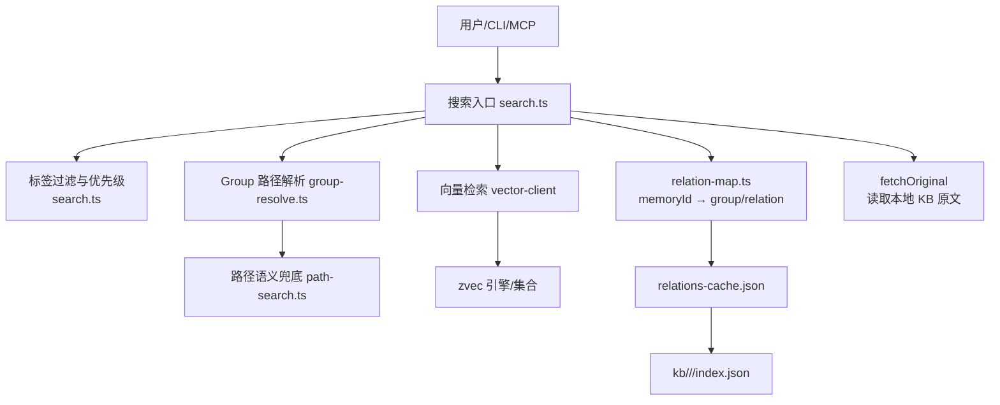
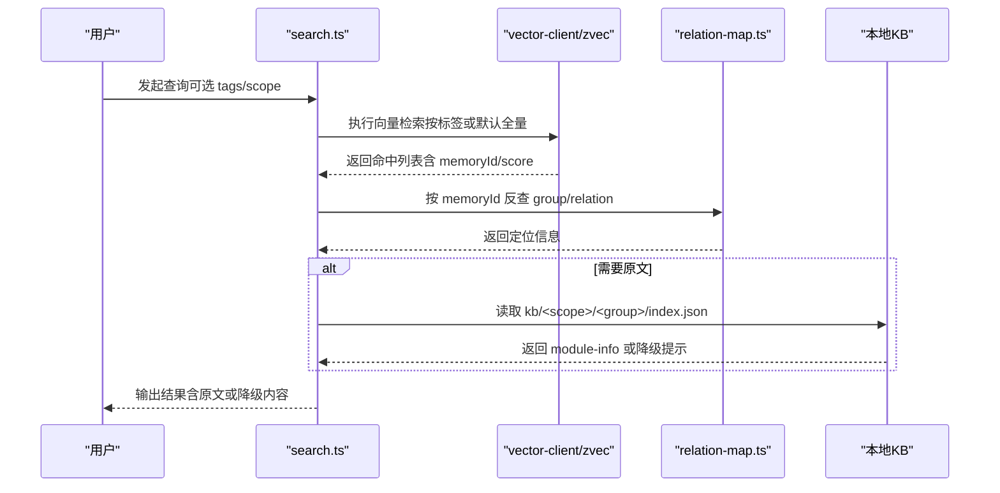
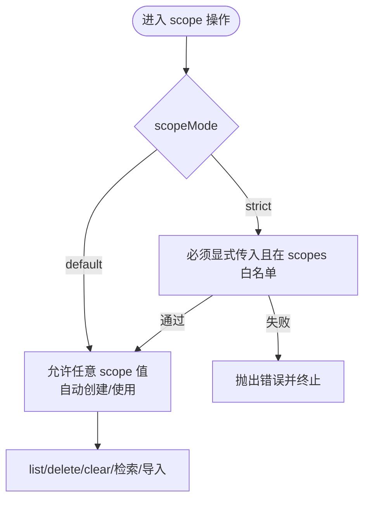
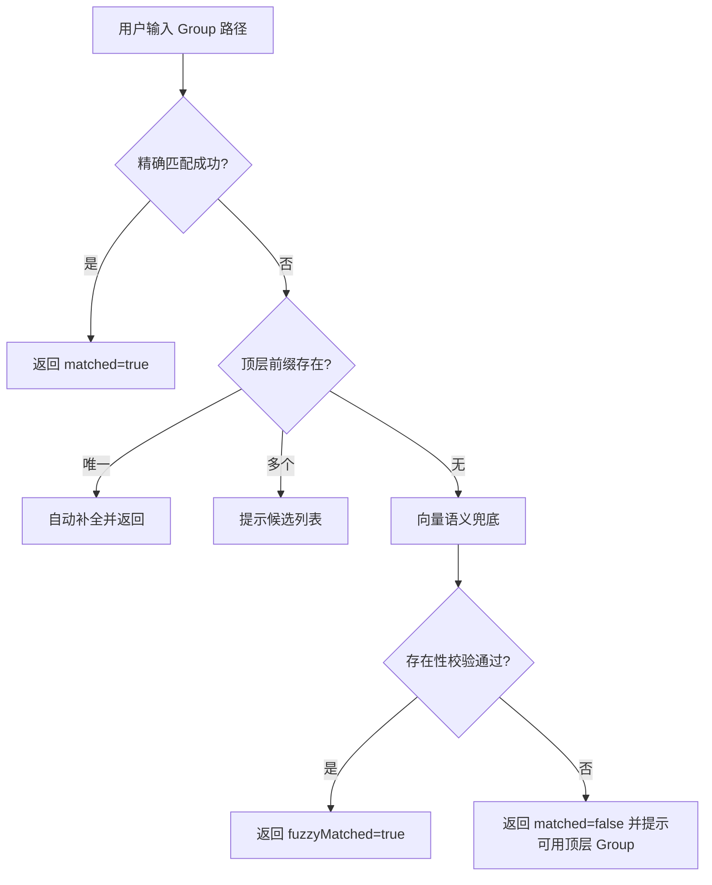
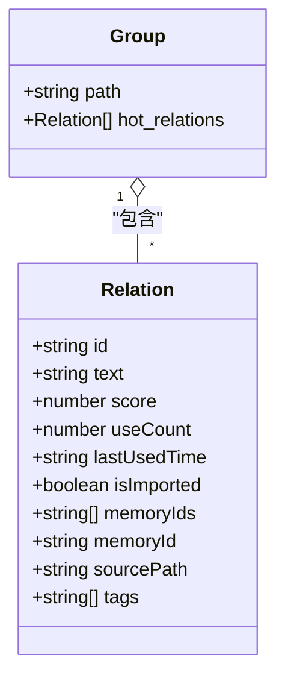
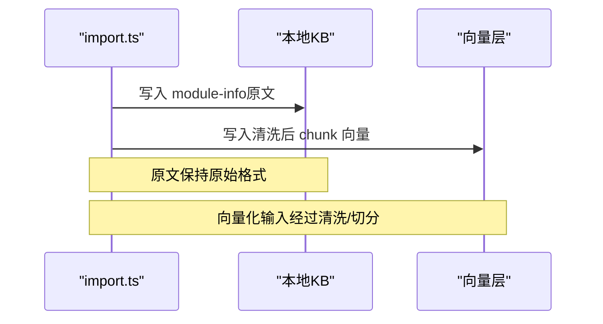
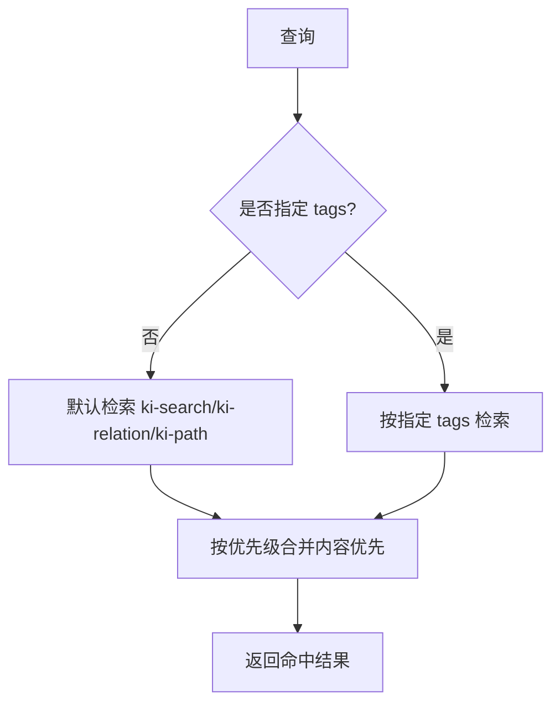
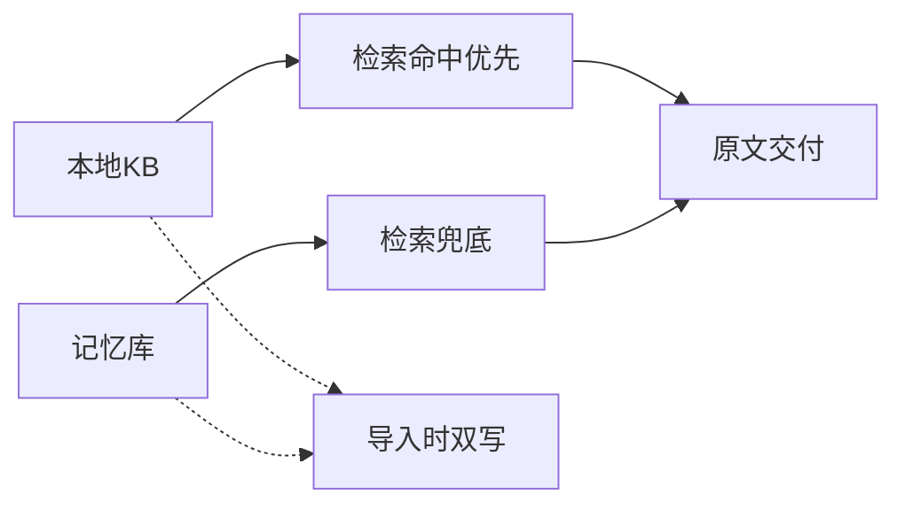
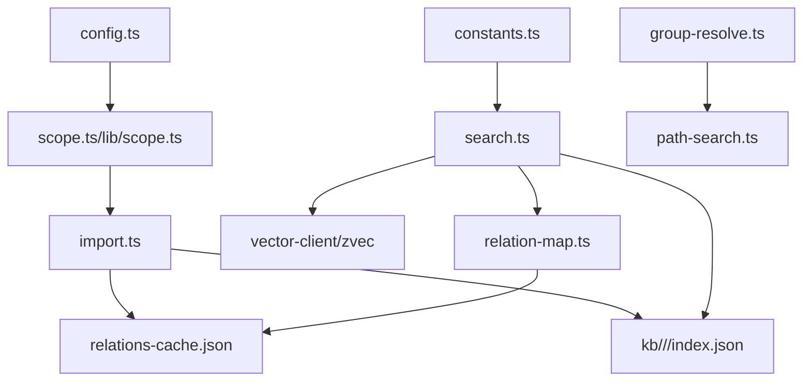

# 核心概念解析

<cite>
**本文引用的文件**
- [README.md](file://README.md)
- [src/scope.ts](file://src/scope.ts)
- [src/lib/scope.ts](file://src/lib/scope.ts)
- [src/lib/config.ts](file://src/lib/config.ts)
- [src/search.ts](file://src/search.ts)
- [src/tag.ts](file://src/tag.ts)
- [src/lib/group-resolve.ts](file://src/lib/group-resolve.ts)
- [src/lib/path-search.ts](file://src/lib/path-search.ts)
- [src/lib/relation-map.ts](file://src/lib/relation-map.ts)
- [src/lib/import.ts](file://src/lib/import.ts)
- [src/lib/constants.ts](file://src/lib/constants.ts)
- [memories/memory-storage-strategy.md](file://memories/memory-storage-strategy.md)
</cite>

## 目录
1. [引言](#引言)
2. [项目结构](#项目结构)
3. [核心概念总览](#核心概念总览)
4. [架构概览](#架构概览)
5. [详细概念解析](#详细概念解析)
6. [依赖关系分析](#依赖关系分析)
7. [性能与行为特征](#性能与行为特征)
8. [故障排查指南](#故障排查指南)
9. [结论](#结论)
10. [附录：配置与使用示例](#附录配置与使用示例)

## 引言
本文件面向初学者与高级用户，系统化解析 knowledge-indexer 的核心概念：scope（项目隔离标识）、Group（知识分组路径）、Relation（可被检索的知识条目）、module-info（Markdown 原文说明）、标签体系（ki-search/ki-path/ki-relation 三层标签）以及记忆库机制。文档结合源码实现，给出定义、作用、使用方式、与其他概念的关系，并提供具体配置与使用场景，帮助读者在理解基础概念的同时掌握深入的技术细节。

## 项目结构
knowledge-indexer 以“本地知识库 + 向量检索”为核心，围绕 scope 进行物理隔离，通过 Group 树组织知识，Relation 作为最小可检索单元，配合三层标签实现混合检索与精准定位。导入流程将 Markdown 原文写入本地 KB，同时生成向量索引；检索时优先返回原文，失败则降级为向量片段。

图表来源
- [src/search.ts:20-196](file://src/search.ts#L20-L196)
- [src/lib/group-resolve.ts:96-219](file://src/lib/group-resolve.ts#L96-L219)
- [src/lib/path-search.ts:38-87](file://src/lib/path-search.ts#L38-L87)
- [src/lib/relation-map.ts:42-78](file://src/lib/relation-map.ts#L42-L78)
- [src/lib/import.ts:214-563](file://src/lib/import.ts#L214-L563)

章节来源
- [README.md:82-103](file://README.md#L82-L103)

## 核心概念总览
- scope：项目隔离标识，控制数据落盘位置、向量集合范围与访问策略（default/strict）。
- Group：知识分组路径，如“项目/模块/子模块”，用于组织 Relation 与导航。
- Relation：某个 Group 下可被检索的知识条目，携带 memoryId/sourcePath/tags 等元信息。
- module-info：Relation 对应的 Markdown 原文说明，保存在本地 KB 中，供检索结果直接交付。
- 标签体系：ki-search（内容向量）、ki-path（路径向量）、ki-relation（关系名称向量），支持分层过滤与优先级排序。
- 记忆库机制：跨会话持续积累的知识，带评分衰减与冷热治理；与本地 KB 分工协作，形成闭环。

章节来源
- [README.md:82-103](file://README.md#L82-L103)
- [src/lib/constants.ts:55-60](file://src/lib/constants.ts#L55-L60)
- [memories/memory-storage-strategy.md:1-14](file://memories/memory-storage-strategy.md#L1-L14)

## 架构概览
系统由 CLI/MCP 入口、本地 KB、向量引擎 zvec、以及若干辅助模块组成。导入阶段将 Markdown 切分并写入向量层，同时将原文写入本地 KB；检索阶段按标签优先级召回，再通过 memoryId 反查定位原文。

图表来源
- [src/search.ts:70-196](file://src/search.ts#L70-L196)
- [src/lib/relation-map.ts:42-78](file://src/lib/relation-map.ts#L42-L78)
- [src/lib/import.ts:646-663](file://src/lib/import.ts#L646-L663)

## 详细概念解析

### scope（项目隔离标识）
- 定义：用于隔离不同项目或租户的知识空间，决定数据目录、向量集合范围与访问策略。
- 作用：
  - 物理隔离：每个 scope 对应独立的数据目录与 relations-cache。
  - 策略护栏：default 模式自动创建/放行；strict 模式要求显式传入且必须在 scopes 白名单内。
  - 生命周期管理：支持 list/delete/clear，清理向量与 KB 目录，维护一致性。
- 使用方式：
  - CLI：ki scope list/delete/clear；ki search --scope <name>；ki tag list --scope <name>。
  - 配置：config.yaml 的 scopes.<name>.kbDir、wikiSync、clean、import 等。
- 与其他概念关系：
  - Group 与 Relation 均隶属于特定 scope。
  - 向量检索与标签过滤均在 scope 范围内生效。
  - 记忆库策略与 scope 无关，但可通过 scope 限定上下文。

图表来源
- [src/lib/config.ts:470-485](file://src/lib/config.ts#L470-L485)
- [src/scope.ts:94-134](file://src/scope.ts#L94-L134)
- [src/scope.ts:147-181](file://src/scope.ts#L147-L181)
- [src/scope.ts:194-223](file://src/scope.ts#L194-L223)

章节来源
- [src/lib/config.ts:125-136](file://src/lib/config.ts#L125-L136)
- [src/lib/config.ts:408-485](file://src/lib/config.ts#L408-L485)
- [src/scope.ts:34-83](file://src/scope.ts#L34-L83)
- [src/scope.ts:94-223](file://src/scope.ts#L94-L223)

### Group（知识分组路径）
- 定义：知识的层级化分组路径，如“项目/告警系统设计/告警处理服务”。
- 作用：
  - 组织 Relation 与导航，便于先缩小范围再检索。
  - 支持自动补全与向量兜底，提升用户体验。
- 使用方式：
  - 导入时根据 source 推导 groupPath（缺省时按顶层子目录名或 scope name）。
  - 查询时支持精确匹配、整段补全、部分匹配与向量近似匹配。
- 与其他概念关系：
  - Relation 属于某个 Group。
  - ki-path 标签存储 Group 路径向量，用于模糊匹配。
  - 本地 KB 按 Group 组织 index.json，存放 module-info。

图表来源
- [src/lib/group-resolve.ts:96-219](file://src/lib/group-resolve.ts#L96-L219)
- [src/lib/path-search.ts:38-87](file://src/lib/path-search.ts#L38-L87)

章节来源
- [src/lib/group-resolve.ts:12-25](file://src/lib/group-resolve.ts#L12-L25)
- [src/lib/group-resolve.ts:96-219](file://src/lib/group-resolve.ts#L96-L219)
- [src/lib/path-search.ts:99-115](file://src/lib/path-search.ts#L99-L115)

### Relation（可被检索的知识条目）
- 定义：某个 Group 下的最小可检索单元，包含 text、memoryId/memoryIds、sourcePath、tags 等元信息。
- 作用：
  - 承载向量化内容与定位信息，支撑检索与原文召回。
  - 支持多 chunk 聚合（memoryIds 多值）与自定义标签。
- 使用方式：
  - 导入时生成 file-level relation，记录 sourcePath 与 memoryIds。
  - 检索后通过 memoryId 反查 group/relation，定位原文。
- 与其他概念关系：
  - 隶属于 Group，关联 module-info（本地 KB）。
  - 通过 ki-relation 标签参与路径/关系语义检索。
  - 可附加自定义标签，增强定向召回。

图表来源
- [src/lib/import.ts:572-637](file://src/lib/import.ts#L572-L637)
- [src/lib/relation-map.ts:23-28](file://src/lib/relation-map.ts#L23-L28)

章节来源
- [src/lib/import.ts:572-637](file://src/lib/import.ts#L572-L637)
- [src/lib/relation-map.ts:42-78](file://src/lib/relation-map.ts#L42-L78)

### module-info（Markdown 原文说明）
- 定义：Relation 对应的完整 Markdown 原文，保存在本地 KB 的 group/index.json 中。
- 作用：
  - 提供原文交付能力，避免仅返回片段导致信息缺失。
  - 与向量检索互补：向量负责召回，本地 KB 负责原文。
- 使用方式：
  - 导入时直接写入 local KB（未清洗），向量化时使用清洗后的文本。
  - 检索时通过 group/relation 定位并读取原文；失败则降级为向量 content。
- 与其他概念关系：
  - 与 Relation 一一对应（file-level）。
  - 受 Group 组织约束。
  - 检索流程中作为最终交付物。

图表来源
- [src/lib/import.ts:337-369](file://src/lib/import.ts#L337-L369)
- [src/lib/import.ts:646-663](file://src/lib/import.ts#L646-L663)

章节来源
- [src/lib/import.ts:337-369](file://src/lib/import.ts#L337-L369)
- [src/lib/import.ts:646-663](file://src/lib/import.ts#L646-L663)

### 标签体系（ki-search / ki-path / ki-relation）
- 定义：
  - ki-search：内容向量，用于自然语言检索。
  - ki-path：路径向量，用于 Group 路径的语义模糊匹配。
  - ki-relation：关系名称向量，用于 Relation 名称的语义匹配。
- 作用：
  - 分层过滤与优先级排序，提升检索准确率与效率。
  - 支持自定义标签，扩展召回维度。
- 使用方式：
  - 默认搜索全部三类标签，按优先级合并结果。
  - 可通过 --tags 指定过滤条件（逗号分隔，OR 组合）。
  - 导入时为每个 chunk 写入 ki-relation，为每个 Group 写入 ki-path。
- 与其他概念关系：
  - 与 Relation/Group 紧密耦合，分别描述内容与路径。
  - 自定义标签可附加到 Relation，增强定向召回。

图表来源
- [src/search.ts:20-29](file://src/search.ts#L20-L29)
- [src/search.ts:94-121](file://src/search.ts#L94-L121)
- [src/lib/constants.ts:55-60](file://src/lib/constants.ts#L55-L60)
- [src/lib/import.ts:393-412](file://src/lib/import.ts#L393-L412)

章节来源
- [src/search.ts:20-29](file://src/search.ts#L20-L29)
- [src/search.ts:94-121](file://src/search.ts#L94-L121)
- [src/lib/constants.ts:55-60](file://src/lib/constants.ts#L55-L60)
- [src/lib/import.ts:393-412](file://src/lib/import.ts#L393-L412)

### 记忆库机制
- 定义：跨会话持续积累的知识，带评分衰减与冷热治理，适合长期沉淀与复用。
- 作用：
  - 与本地 KB 分工协作：本地 KB 保存完整原文，记忆系统保存摘要/标签/关键词/长期记忆。
  - 查询时本地命中优先，记忆检索兜底；写入时双写形成闭环。
- 使用方式：
  - 平台内置记忆（update_memory）用于简洁通用偏好。
  - 复杂知识（模块架构、API 设计）走 ki-search。
  - 项目背景、进度、偏好等存入 rules/ai-codekb-memory.md。
- 与其他概念关系：
  - 与 scope/Group/Relation 协同工作，但不替代本地 KB。
  - 可作为检索兜底，补充本地未覆盖的知识。

图表来源
- [memories/memory-storage-strategy.md:1-14](file://memories/memory-storage-strategy.md#L1-L14)
- [docs/architecture.md:159-169](file://docs/architecture.md#L159-L169)

章节来源
- [memories/memory-storage-strategy.md:1-14](file://memories/memory-storage-strategy.md#L1-L14)
- [docs/architecture.md:159-169](file://docs/architecture.md#L159-L169)

## 依赖关系分析
- scope 依赖 config 解析与校验，决定数据目录与访问策略。
- Group 解析依赖 group-index 树与 path-search 向量兜底。
- Relation 依赖 import 流程生成 memoryIds，search 通过 relation-map 反查。
- 标签体系贯穿导入与检索，影响向量写入与召回优先级。
- 记忆库与本地 KB 并行协作，形成检索闭环。

图表来源
- [src/lib/config.ts:156-183](file://src/lib/config.ts#L156-L183)
- [src/lib/scope.ts:49-77](file://src/lib/scope.ts#L49-L77)
- [src/lib/import.ts:214-563](file://src/lib/import.ts#L214-L563)
- [src/search.ts:70-196](file://src/search.ts#L70-L196)
- [src/lib/group-resolve.ts:96-219](file://src/lib/group-resolve.ts#L96-L219)
- [src/lib/path-search.ts:38-87](file://src/lib/path-search.ts#L38-L87)
- [src/lib/constants.ts:55-60](file://src/lib/constants.ts#L55-L60)

章节来源
- [src/lib/config.ts:156-183](file://src/lib/config.ts#L156-L183)
- [src/lib/scope.ts:49-77](file://src/lib/scope.ts#L49-L77)
- [src/lib/import.ts:214-563](file://src/lib/import.ts#L214-L563)
- [src/search.ts:70-196](file://src/search.ts#L70-L196)
- [src/lib/group-resolve.ts:96-219](file://src/lib/group-resolve.ts#L96-L219)
- [src/lib/path-search.ts:38-87](file://src/lib/path-search.ts#L38-L87)
- [src/lib/constants.ts:55-60](file://src/lib/constants.ts#L55-L60)

## 性能与行为特征
- 导入性能：
  - 批量向量化与路径向量写入，支持覆盖导入与旧向量删除重建。
  - 文件级 relation 聚合，避免重复写入。
  - 清洗与外部 hooks 失败回滚，保证一致性。
- 检索性能：
  - 标签优先级合并，减少无效召回。
  - relation-map 带 TTL+mtime/size 缓存，首次构建 O(N)，后续 O(1)。
  - Multi-tag 去重，保留最高分结果。
- 原文交付：
  - 优先读取本地 KB，失败降级为向量 content 并提示。
  - 同一文件多 chunk 命中去重，避免重复返回原文。

章节来源
- [src/lib/import.ts:423-448](file://src/lib/import.ts#L423-L448)
- [src/lib/import.ts:450-484](file://src/lib/import.ts#L450-L484)
- [src/lib/relation-map.ts:8-17](file://src/lib/relation-map.ts#L8-L17)
- [src/search.ts:159-194](file://src/search.ts#L159-L194)

## 故障排查指南
- scope 相关：
  - strict 模式下未传或未注册 scope：检查 config.scopes 白名单。
  - 向量服务不可用：检查 ensureVectorAvailable 返回原因。
- 导入相关：
  - 文件格式不支持：检查 extensions 白名单。
  - 文件过大或 chunk 超限：调整 maxFileSizeBytes/chunkSize。
  - relation 冲突：同 group 下同名不同 sourcePath 会跳过。
- 检索相关：
  - 原文不可用：检查本地 KB 是否存在 relation，或执行 sync-relation/restore。
  - 向量兜底失败：检查 path-search 异常日志，确认服务可用性。
- 标签相关：
  - 自定义标签无效：检查是否使用了内部保留标签（ki-search/ki-relation/ki-path）。

章节来源
- [src/lib/config.ts:470-485](file://src/lib/config.ts#L470-L485)
- [src/scope.ts:147-181](file://src/scope.ts#L147-L181)
- [src/lib/import.ts:266-287](file://src/lib/import.ts#L266-L287)
- [src/lib/import.ts:314-336](file://src/lib/import.ts#L314-L336)
- [src/search.ts:54-68](file://src/search.ts#L54-L68)
- [src/lib/path-search.ts:82-87](file://src/lib/path-search.ts#L82-L87)
- [src/lib/constants.ts:59-75](file://src/lib/constants.ts#L59-L75)

## 结论
knowledge-indexer 通过 scope 隔离、Group 组织、Relation 检索、module-info 原文交付与三层标签体系，构建了高效、可靠的知识索引与检索系统。导入流程确保数据一致性与幂等性，检索流程兼顾准确率与用户体验。记忆库机制与本地 KB 分工协作，形成完整的知识闭环。建议在生产环境中合理配置 scopeMode、标签策略与清洗规则，以获得最佳性能与稳定性。

## 附录：配置与使用示例
- 配置示例（config.yaml）：
  - dataDir/backupDir/vectorDir：设置数据与向量目录。
  - embedding.provider/baseURL/model/dimension/apiKey：配置嵌入模型。
  - scopeMode：选择 default 或 strict。
  - scopes.<name>.kbDir/wikiSync/clean/import：按 scope 定制行为。
- 使用示例：
  - 导入：ki import --scope <name> --source-dir <dir> [--group <path>] [--chunk-size N] [--chunk-overlap N] [--tags t1,t2] [--no-vector]。
  - 检索：ki search --scope <name> --query "自然语言查询" [--limit N] [--threshold T] [--tags t1,t2] [--original]。
  - 标签发现：ki tag list --scope <name> [--scan-limit N]。
  - scope 管理：ki scope list/delete/clear --yes。

章节来源
- [src/lib/config.ts:252-385](file://src/lib/config.ts#L252-L385)
- [src/lib/import.ts:214-563](file://src/lib/import.ts#L214-L563)
- [src/search.ts:204-237](file://src/search.ts#L204-L237)
- [src/tag.ts:55-72](file://src/tag.ts#L55-L72)
- [src/scope.ts:235-294](file://src/scope.ts#L235-L294)