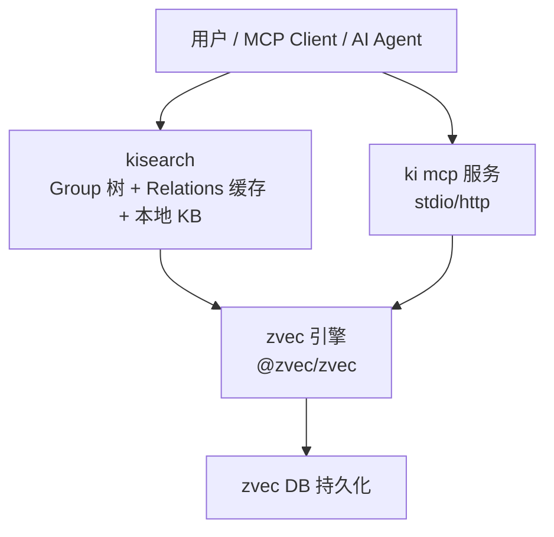
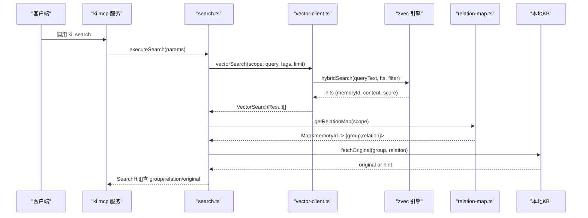
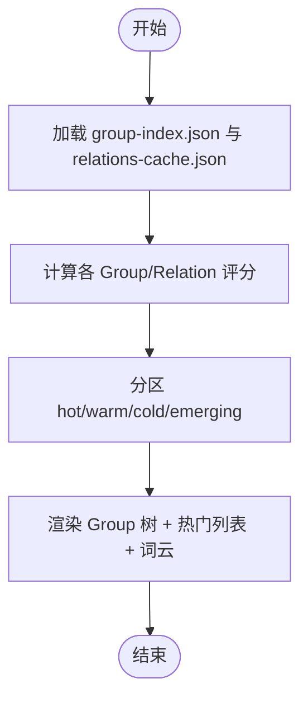
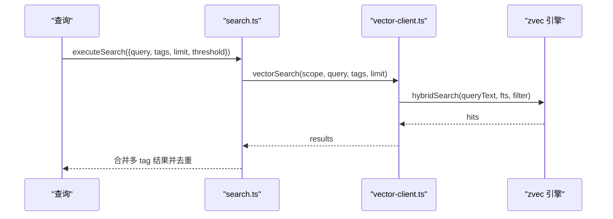
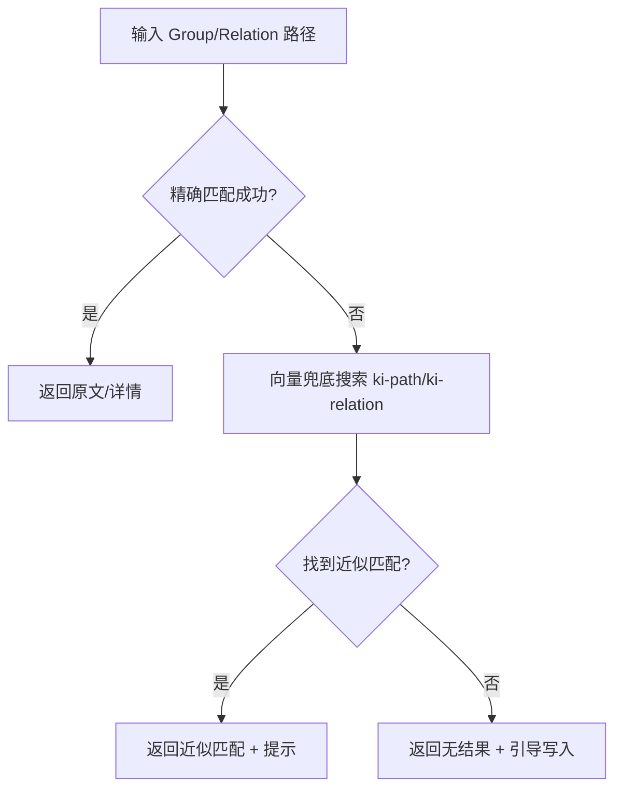
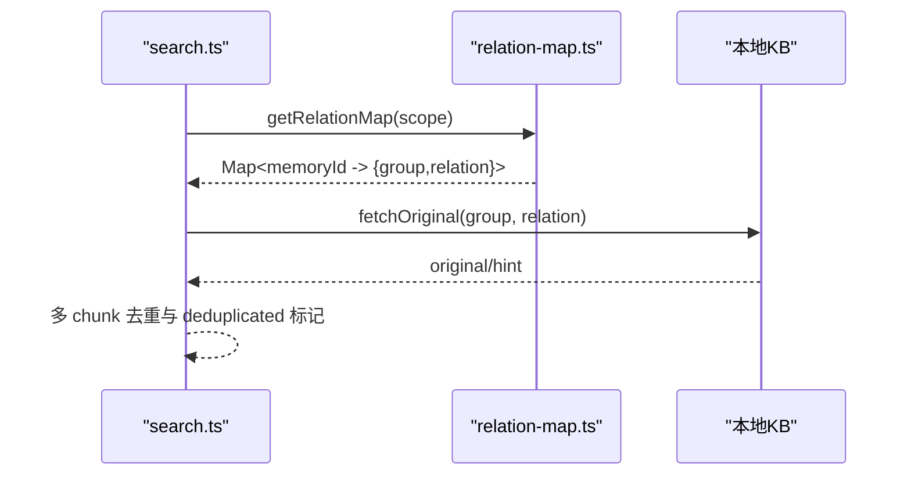
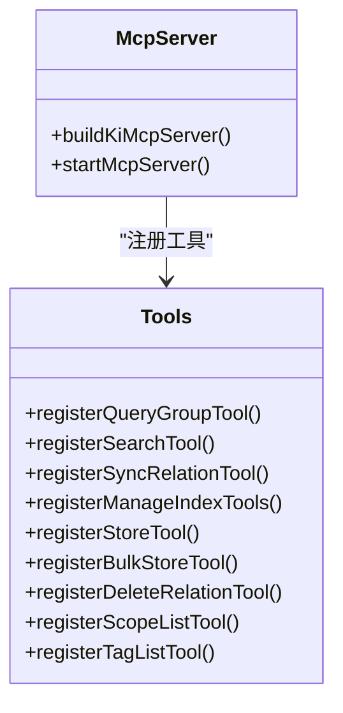
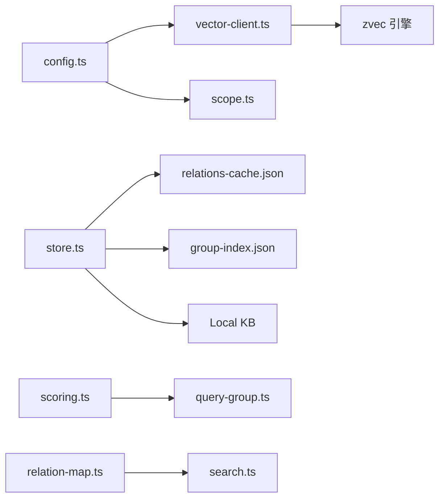

# 核心特性详解

<cite>
**本文引用的文件**
- [README.md](file://README.md)
- [package.json](file://package.json)
- [src/search.ts](file://src/search.ts)
- [src/query-group.ts](file://src/query-group.ts)
- [src/mcp-server.ts](file://src/mcp-server.ts)
- [src/lib/vector-client.ts](file://src/lib/vector-client.ts)
- [src/lib/scoring.ts](file://src/lib/scoring.ts)
- [src/lib/relation-map.ts](file://src/lib/relation-map.ts)
- [src/lib/config.ts](file://src/lib/config.ts)
- [src/sync-relation.ts](file://src/sync-relation.ts)
- [src/manage-index.ts](file://src/manage-index.ts)
- [src/delete-relation.ts](file://src/delete-relation.ts)
- [src/get-module-info.ts](file://src/get-module-info.ts)
- [test/manage-index.test.ts](file://test/manage-index.test.ts)
- [test/zvec-engine.test.mjs](file://test/zvec-engine.test.mjs)
- [test/mcp-daemon.test.ts](file://test/mcp-daemon.test.ts)
- [docs/architecture.md](file://docs/architecture.md)
</cite>

## 目录
1. [简介](#简介)
2. [项目结构](#项目结构)
3. [核心组件](#核心组件)
4. [架构总览](#架构总览)
5. [详细特性分析](#详细特性分析)
6. [依赖关系分析](#依赖关系分析)
7. [性能优化建议](#性能优化建议)
8. [故障排查指南](#故障排查指南)
9. [结论](#结论)
10. [附录：常用命令与示例](#附录：常用命令与示例)

## 简介
knowledge-indexer（CLI 命令 ki）为 AI Agent 提供“结构化知识索引 + 向量语义检索”的完整能力。它不是常规 RAG 的无序 chunk 检索，而是以 Group 树与 Relation 结构化视图组织知识，叠加 zvec 混合检索引擎（语义 + BM25 + RRF），让 Agent 既能“语义搜到”，也能“按索引直查原文”。同时提供 CLI 与 MCP 双通道，便于在 IDE、Agent 或 Web 前端中统一接入。

与常规 RAG 的关键差异：
- 知识组织：Group 树 + Relation 结构化索引，有归属有层级
- 检索结果：命中时可直接交付原文全文，而非片段
- 查询路径：双路径——已知索引直接精准定位原文；未知则走向量语义兜底
- 符号检索：BM25 全文支持类名/方法名精确召回
- 状态管理：冷热治理 + 评分衰减 + 使用计数，热点优先
- 跨会话：长期记忆库持续积累
- 写入校验：scope 隔离 + WAL 原子写入 + 幂等覆盖更新

**章节来源**
- [README.md:35-103](file://README.md#L35-L103)

## 项目结构
- 入口与命令：bin/ki.mjs 暴露 ki 命令；package.json 定义脚本与依赖
- 业务层：src/*.ts 实现 CLI 命令与 MCP Server；lib/* 提供配置、存储、评分、向量适配等基础设施
- 向量引擎：src/zvec-engine/* 封装 zvec 引擎（嵌入、过滤、搜索、worker 协议）
- 文档与测试：docs/* 说明架构与工作流；test/* 覆盖核心逻辑与端到端场景

**图表来源**
- [docs/architecture.md:11-26](file://docs/architecture.md#L11-L26)

**章节来源**
- [package.json:1-68](file://package.json#L1-L68)
- [docs/architecture.md:1-50](file://docs/architecture.md#L1-L50)

## 核心组件
- 结构化索引与导航：Group 树、Relation 热缓存、关键词词云、分区展示（hot/warm/cold/emerging）
- 混合检索（Hybrid）：语义向量 + BM25 全文 + RRF 融合排序；camelCase 符号可精确召回
- 双路径查询：索引直查（已知路径 → 原文）+ 语义检索（自然语言 → 向量 → 反查原文）
- 原文交付：search 结果按 memoryId 反查定位 group/relation，返回本地 KB 原文
- 三层标签：ki-search（内容）/ ki-relation（关系）/ ki-path（路径），默认按优先级限流
- 向量语义兜底：精确匹配失败时自动走向量模糊定位并提示近似匹配
- TypeScript 直接执行：jiti 运行时，无需编译；Node ≥ 18
- CLI + MCP 双通道：19 个 CLI 命令；ki mcp 暴露 11 个工具（stdio / HTTP 共享单例）

**章节来源**
- [README.md:82-103](file://README.md#L82-L103)
- [src/search.ts:20-47](file://src/search.ts#L20-L47)
- [src/query-group.ts:1-11](file://src/query-group.ts#L1-L11)
- [src/mcp-server.ts:54-70](file://src/mcp-server.ts#L54-L70)

## 架构总览
kisearch 由“发现层（zvec 向量引擎）+ 交付层（Group 树导航、Relation 热缓存、原文交付）”组成。MCP 作为统一接入面，暴露工具供 Agent 调用；CLI 用于构建与管理知识库。

**图表来源**
- [src/search.ts:70-199](file://src/search.ts#L70-L199)
- [src/lib/vector-client.ts:504-533](file://src/lib/vector-client.ts#L504-L533)
- [src/lib/relation-map.ts:48-78](file://src/lib/relation-map.ts#L48-L78)

**章节来源**
- [src/search.ts:70-199](file://src/search.ts#L70-L199)
- [src/lib/vector-client.ts:504-533](file://src/lib/vector-client.ts#L504-L533)
- [src/lib/relation-map.ts:48-78](file://src/lib/relation-map.ts#L48-L78)

## 详细特性分析

### 特性一：结构化知识索引（Group 树导航、Relation 热缓存、关键词词云）
- 工作原理
  - Group 树：通过 group-index.json 维护分组层级；relations-cache.json 维护每个 Group 下的 hot_relations、keywords、max_hot_count
  - 评分与分区：基于 useCount 与 lastUsedTime 计算分数，划分 hot/warm/cold/emerging，支持阈值与上限截断
  - 词云：keywords 字段聚合 Group 级高频词，便于快速概览
- 技术实现
  - 评分函数 calculateScore 与 partitionByScore 提供通用冷热分区能力
  - query-group 负责读取 Group 树与缓存，渲染树形视图与热门列表
  - manage-index 支持 Group CRUD 与批量删除（前缀匹配子组）
- 配置选项
  - partition_config：recentHours、halfLifeHours、hotPercent、warmPercent、reservedEmerging、minHotCount、maxHotCount、maxWarmCount、maxColdCount
- 使用示例
  - 查看 Group 树与热门：ki query-group --scope <scope> --mode hot,warm,cold,emerging,full
  - 创建/删除 Group：ki manage-index create | delete
- 与常规 RAG 的差异
  - 非无序 chunk，而是有层级、有热度、可导航的结构化索引

**图表来源**
- [src/query-group.ts:77-147](file://src/query-group.ts#L77-L147)
- [src/lib/scoring.ts:136-209](file://src/lib/scoring.ts#L136-L209)

**章节来源**
- [src/query-group.ts:57-147](file://src/query-group.ts#L57-L147)
- [src/lib/scoring.ts:44-209](file://src/lib/scoring.ts#L44-L209)
- [src/manage-index.ts:329-365](file://src/manage-index.ts#L329-L365)
- [test/manage-index.test.ts:107-129](file://test/manage-index.test.ts#L107-L129)

### 特性二：混合检索（Hybrid）
- 工作原理
  - 语义向量 + BM25 全文 + RRF 融合排序；tag 与 scope 过滤；camelCase 符号可精确召回
- 技术实现
  - vector-client.ts 封装 ZvecEngine.hybridSearch，构造 scope/tag 过滤条件
  - search.ts 对多 tag 分查并按优先级合并（ki-search > ki-relation > ki-path）
- 配置选项
  - limit、threshold、tags（逗号分隔多标签 OR）
- 使用示例
  - ki search --scope <scope> --query "自然语言查询" --limit 10 --threshold 0.0 --tags "ki-search,ki-relation"
- 与常规 RAG 的差异
  - 不仅语义召回，还结合 FTS 与 RRF，提升符号与中文召回质量

**图表来源**
- [src/search.ts:94-121](file://src/search.ts#L94-L121)
- [src/lib/vector-client.ts:504-533](file://src/lib/vector-client.ts#L504-L533)

**章节来源**
- [src/search.ts:20-47](file://src/search.ts#L20-L47)
- [src/lib/vector-client.ts:504-533](file://src/lib/vector-client.ts#L504-L533)

### 特性三：双路径查询（索引直查 + 语义检索兜底）
- 工作原理
  - 索引直查：通过 query-group/get-module-info 解析 Group/Relation 路径，命中则直接返回原文
  - 语义兜底：精确匹配失败时，调用向量搜索 ki-path/ki-relation 进行近似匹配并提示
- 技术实现
  - query-group.executeQueryGroup 支持 autoFallback，未命中时尝试 vectorSearch(tags='ki-path')
  - get-module-info 支持 Relation 模糊匹配与近似提示
- 使用示例
  - 索引直查：ki query-group --scope <scope> --groups "Wiki/某模块"
  - 语义兜底：同上，若未命中将显示“💡 近似匹配”
- 与常规 RAG 的差异
  - 已知索引时零误差直达原文；未知时才走向量模糊，避免噪声

**图表来源**
- [src/query-group.ts:640-704](file://src/query-group.ts#L640-L704)
- [src/get-module-info.ts:83-109](file://src/get-module-info.ts#L83-L109)

**章节来源**
- [src/query-group.ts:611-745](file://src/query-group.ts#L611-L745)
- [src/get-module-info.ts:83-109](file://src/get-module-info.ts#L83-L109)

### 特性四：原文交付
- 工作原理
  - search 结果按 memoryId 反查 relations-cache 得到 group/relation，再读取本地 KB 原文
  - 同一文件多 chunk 命中去重，仅首次返回原文，其余标记 deduplicated
- 技术实现
  - search.fetchOriginal 从 local KB 读取；relation-map 提供 memoryId→{group,relation} 映射（TTL 缓存）
  - multi-tag 去重保留最高分；includeOriginal 控制是否返回原文
- 使用示例
  - ki search --scope <scope> --query "..." --original
- 与常规 RAG 的差异
  - 返回的是文件级原文，而非片段；具备明确定位信息（group/relation）

**图表来源**
- [src/search.ts:54-68](file://src/search.ts#L54-L68)
- [src/lib/relation-map.ts:48-78](file://src/lib/relation-map.ts#L48-L78)

**章节来源**
- [src/search.ts:123-199](file://src/search.ts#L123-L199)
- [src/lib/relation-map.ts:48-78](file://src/lib/relation-map.ts#L48-L78)

### 特性五：三层标签（ki-search / ki-relation / ki-path）
- 工作原理
  - 默认搜索全部标签，按优先级合并（ki-search 内容优先），每标签最多返回 limit 条
  - 显式传 tags 则按 OR 组合过滤
- 技术实现
  - search.ts 定义 TAG_PRIORITY 与 tagPriority；vector-client 构建 scope+tag 过滤
  - sync-relation 写入自定义 tag 并持久化到 KB 层（relation.tags）
- 使用示例
  - 全量搜索：ki search --scope <scope> --query "..."
  - 指定标签：ki search --scope <scope> --query "..." --tags "ki-relation,ki-path"
- 与常规 RAG 的差异
  - 标签不仅是元数据，更是检索路由与限流策略

**章节来源**
- [src/search.ts:20-47](file://src/search.ts#L20-L47)
- [src/lib/vector-client.ts:648-655](file://src/lib/vector-client.ts#L648-L655)
- [src/sync-relation.ts:941-953](file://src/sync-relation.ts#L941-L953)

### 特性六：向量语义兜底
- 工作原理
  - 精确 Group/Relation 路径未命中时，自动调用 vectorSearch(tags='ki-path' 或 'ki-relation') 进行近似匹配
  - 返回“近似匹配”提示，减少试错轮次
- 技术实现
  - query-group.executeQueryGroup 支持 autoFallback=true；get-module-info 支持 Relation 模糊匹配
- 使用示例
  - 同“双路径查询”示例；未命中时会自动显示近似匹配结果
- 与常规 RAG 的差异
  - 仅在索引直查失败时触发，不替代索引直查；降级静默，不影响主流程

**章节来源**
- [src/query-group.ts:657-672](file://src/query-group.ts#L657-L672)
- [src/get-module-info.ts:100-109](file://src/get-module-info.ts#L100-L109)

### 特性七：TypeScript 直接执行
- 工作原理
  - 使用 jiti 运行时直接执行 .ts 文件，无需编译；Node ≥ 18
- 技术实现
  - package.json scripts 使用 npx jiti 执行各命令；bin/ki.mjs 作为入口
- 使用示例
  - npx jiti src/search.ts --help
  - npx jiti src/query-group.ts --help
- 与常规 RAG 的差异
  - 开发调试更便捷，无需额外构建步骤

**章节来源**
- [package.json:9-32](file://package.json#L9-L32)
- [README.md:398-405](file://README.md#L398-L405)

### 特性八：CLI + MCP 双通道
- 工作原理
  - CLI：19 个命令覆盖导入、索引管理、查询、存储、备份恢复等
  - MCP：ki mcp 暴露 11 个工具（stdio 或 HTTP 共享单例），Agent 可通过标准协议调用
- 技术实现
  - mcp-server.ts 注册全部工具；HTTP 模式支持守护进程、Token 鉴权、健康检查
  - 启动预检：ki doctor 等价检查，失败拒绝启动
- 使用示例
  - CLI：ki scan-kb import | ki search | ki manage-index ...
  - MCP：ki mcp --http --web；IDE 配置 URL 型接入
- 与常规 RAG 的差异
  - 统一接入面，Agent 可直接调用结构化索引与原文交付能力

**图表来源**
- [src/mcp-server.ts:54-70](file://src/mcp-server.ts#L54-L70)

**章节来源**
- [src/mcp-server.ts:83-107](file://src/mcp-server.ts#L83-L107)
- [README.md:220-294](file://README.md#L220-L294)
- [test/mcp-daemon.test.ts:1-37](file://test/mcp-daemon.test.ts#L1-L37)

## 依赖关系分析
- 配置层：config.ts 提供 KiConfig、EmbeddingConfig、McpHttpConfig 等，支持 YAML/JSON 解析与环境变量引用
- 存储层：store.ts/scope.ts 管理 group-index.json、relations-cache.json、local KB
- 向量层：vector-client.ts 封装 zvec 引擎，提供 hybridSearch、upsert、delete、listIds/fetch
- 评分层：scoring.ts 提供 calculateScore、partitionByScore、boundaryDecay
- 映射层：relation-map.ts 提供 memoryId→{group,relation} 反查映射（TTL 缓存）

**图表来源**
- [src/lib/config.ts:125-136](file://src/lib/config.ts#L125-L136)
- [src/lib/vector-client.ts:291-323](file://src/lib/vector-client.ts#L291-L323)
- [src/lib/scoring.ts:136-209](file://src/lib/scoring.ts#L136-L209)
- [src/lib/relation-map.ts:48-78](file://src/lib/relation-map.ts#L48-L78)

**章节来源**
- [src/lib/config.ts:156-183](file://src/lib/config.ts#L156-L183)
- [src/lib/vector-client.ts:334-360](file://src/lib/vector-client.ts#L334-L360)
- [src/lib/scoring.ts:136-209](file://src/lib/scoring.ts#L136-L209)
- [src/lib/relation-map.ts:48-78](file://src/lib/relation-map.ts#L48-L78)

## 性能优化建议
- 向量引擎
  - 空闲释放锁：enableIdleClose 在常驻 MCP 模式下启用，空闲超时后自动 closeEngine 释放 LOCK，允许多实例错开共享
  - 撞锁重试：probeWithRetry 检测 locked 时等待并重试，避免立即失败
  - 打开超时：withOpenTimeout 防止原生 open 挂死导致永久 pending
- 检索优化
  - 多 tag 分查并按优先级合并，避免单次大查询
  - relation-map TTL 缓存，首次 O(N) 构建，后续 O(1) 反查
  - 多 chunk 命中去重，减少重复原文返回
- 索引治理
  - 冷热分区与边界衰减，保持热区新鲜度
  - 批量删除与级联清理，避免幽灵数据

[本节为通用指导，不直接分析具体文件]

## 故障排查指南
- 向量库被占用或损坏
  - 现象：ensureVectorAvailable 返回 LOCKED/CORRUPTED
  - 处理：停止其他 ki 实例；执行 ki restore <scope> --rebuild-vector 或 --from-snapshot
- 启动预检失败
  - 现象：ki mcp 启动时报 ❌ 检查项
  - 处理：运行 ki doctor 修复配置、API Key、维度等
- 向量引擎异常
  - 现象：WorkerUnavailableError 或 worker not open
  - 处理：closeEngine 重置后重试；检查 dist/zvec-engine 构建产物
- Token 鉴权问题
  - 现象：非回环绑定需 Token，否则拒绝启动
  - 处理：ki mcp token generate --scope <...>；或使用回环地址免鉴权

**章节来源**
- [src/lib/vector-client.ts:75-87](file://src/lib/vector-client.ts#L75-L87)
- [src/mcp-server.ts:660-678](file://src/mcp-server.ts#L660-L678)
- [test/zvec-engine.test.mjs:159-205](file://test/zvec-engine.test.mjs#L159-L205)

## 结论
knowledge-indexer 通过结构化知识索引与混合检索的结合，解决了常规 RAG 在知识组织、原文交付、符号检索、状态管理与跨会话积累等方面的痛点。其双路径查询、三层标签、向量语义兜底、冷热治理与 MCP/CLI 双通道，为 AI Agent 提供了高可用、高性能、可观测的知识检索与交付能力。

[本节为总结，不直接分析具体文件]

## 附录：常用命令与示例
- 初始化与诊断
  - ki config init
  - ki doctor
- 导入与构建
  - ki scan-kb import --scope <scope> --source /path/to/wiki --group Wiki
- 查询与浏览
  - ki search --scope <scope> --query "自然语言查询" --original
  - ki query-group --scope <scope> --mode hot,warm,cold,emerging,full
- 索引管理
  - ki manage-index create | delete
  - ki delete-relation --scope <scope> --group <group> --relation <relation>
- MCP 服务
  - ki mcp --http --web
  - ki mcp token generate --scope <scope>
  - ki mcp --status

**章节来源**
- [README.md:121-191](file://README.md#L121-L191)
- [README.md:195-236](file://README.md#L195-L236)