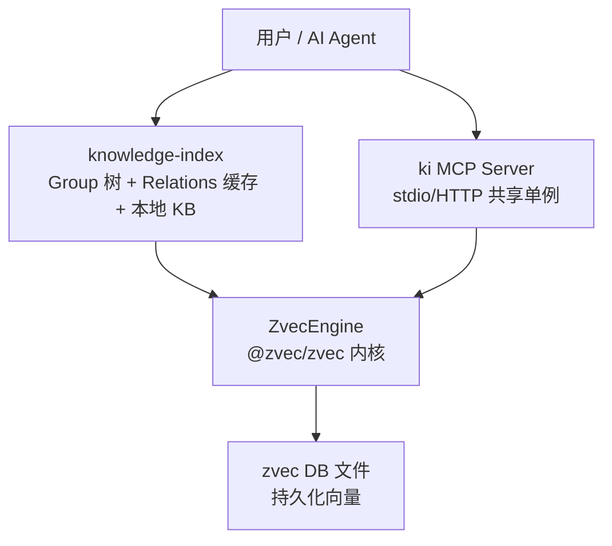
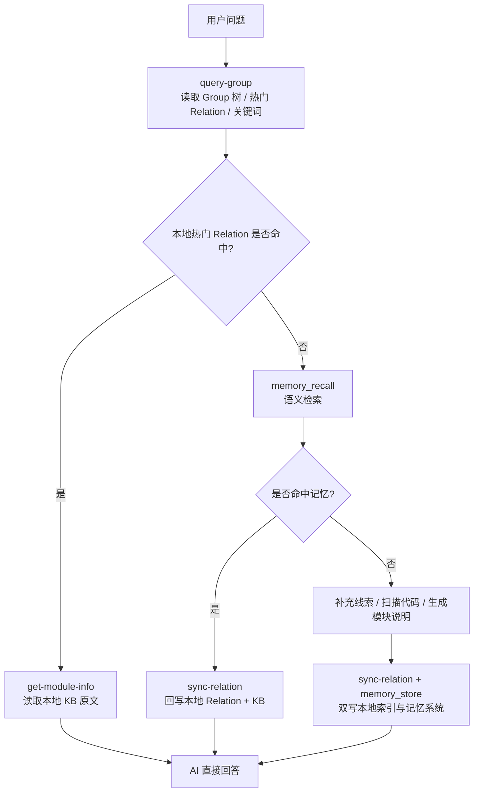
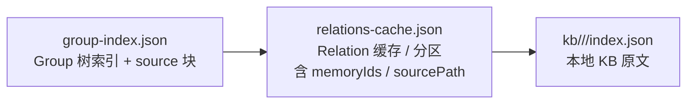
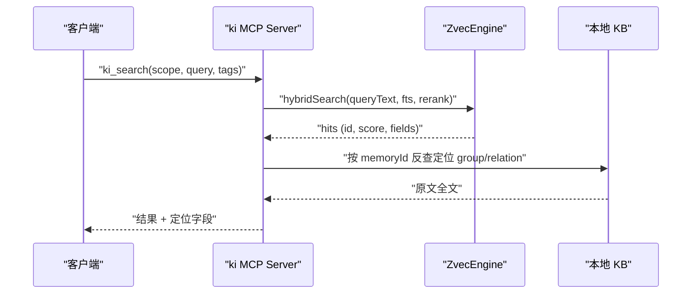
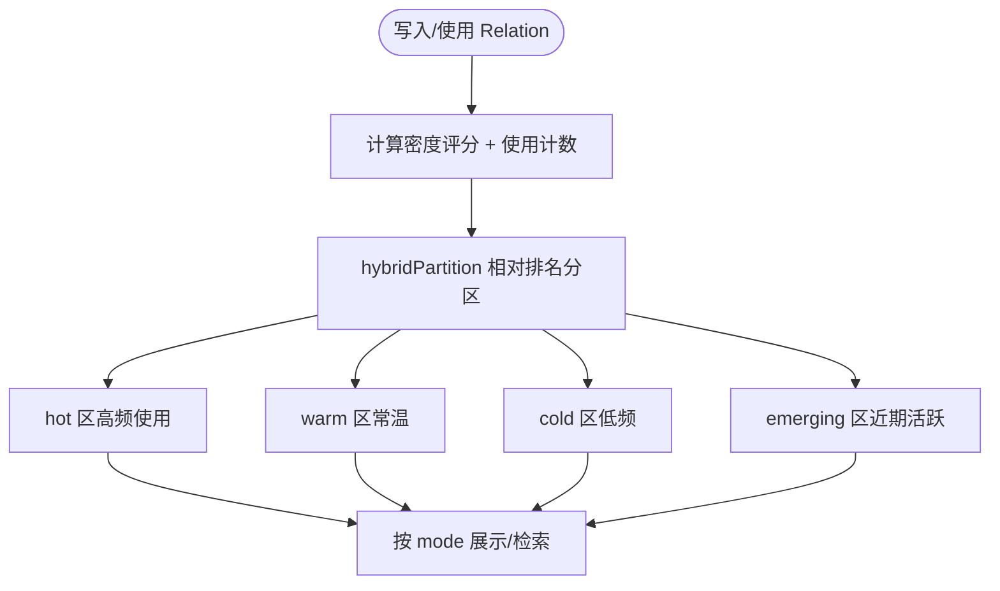
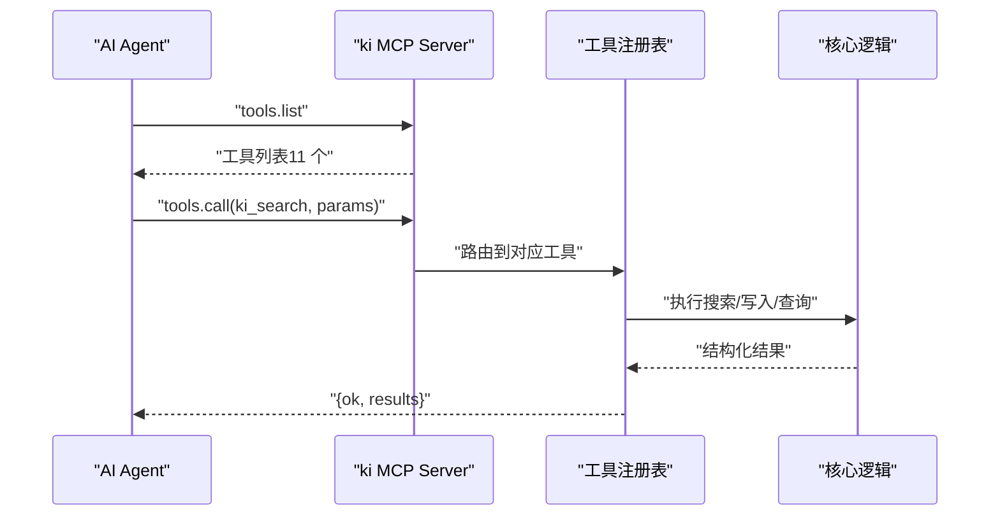
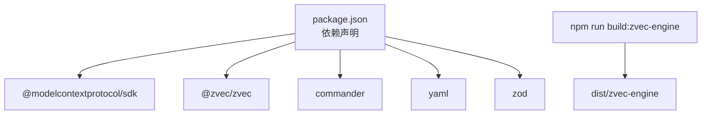

# 项目介绍

<cite>
**本文引用的文件**
- [README.md](file://README.md)
- [package.json](file://package.json)
- [docs/architecture.md](file://docs/architecture.md)
- [docs/configuration.md](file://docs/configuration.md)
- [docs/cli.md](file://docs/cli.md)
- [docs/workflows.md](file://docs/workflows.md)
- [docs/tags-design.md](file://docs/tags-design.md)
- [src/zvec-engine/types.ts](file://src/zvec-engine/types.ts)
- [_template/relations-cache.json](file://_template/relations-cache.json)
- [.module-experts/PROJECT.md](file://.module-experts/PROJECT.md)
</cite>

## 目录
1. [简介](#简介)
2. [项目结构](#项目结构)
3. [核心组件](#核心组件)
4. [架构总览](#架构总览)
5. [详细组件分析](#详细组件分析)
6. [依赖关系分析](#依赖关系分析)
7. [性能与检索特性](#性能与检索特性)
8. [适用场景与目标用户](#适用场景与目标用户)
9. [快速开始与配置](#快速开始与配置)
10. [故障排查要点](#故障排查要点)
11. [结论](#结论)

## 简介
kisearch（CLI 命令：ki）是一个面向 AI Agent 的知识索引系统，将“结构化知识索引”与“向量语义检索”有机结合。它不是传统的 RAG chunk 检索，而是以 Group 树 + Relation 的结构化视图组织知识，叠加 zvec 混合检索引擎（语义向量 + BM25 全文 + RRF 融合排序），让 Agent 既能“语义搜到”，也能“按索引直查原文”。

核心价值主张：
- 结构化导航：Group 树与 Relation 缓存，知识有归属、有层级、可定位。
- 双路径查询：已知索引时直接精准命中原文；未知时走语义检索兜底。
- 原文交付：通过 memoryId 反查定位 group/relation，返回完整 Markdown 原文而非片段。
- 长期记忆库：跨会话沉淀知识，支持评分衰减与冷热分区治理。
- MCP 集成：通过标准 MCP 协议向 Agent 暴露工具（stdio/HTTP），并提供可视化前端辅助验证。

一句话总结：常规 RAG 解决“搜得到”，kisearch 同时解决“搜得到 + 看得见 + 定位到原文”。

**章节来源**
- [README.md:35-80](file://README.md#L35-L80)
- [README.md:93-104](file://README.md#L93-L104)

## 项目结构
仓库采用“能力分层 + 领域模块”的组织方式：
- 顶层 CLI 与 MCP 服务：提供统一入口与对外工具集。
- 知识索引层：Group 树、Relation 缓存、本地 KB 原文管理。
- 向量引擎封装：zvec-engine 子项目，封装 @zvec/zvec 的嵌入、搜索、RRF 融合等能力。
- 导入与同步：外部知识库扫描、切分、批量向量化、增量更新。
- 配置与运维：YAML/JSON 配置、备份/恢复、健康检查、Token 鉴权。
- Web 前端：内置可视化页面，便于浏览 Group 树、执行语义搜索、查看状态。

**图表来源**
- [docs/architecture.md:11-26](file://docs/architecture.md#L11-L26)

**章节来源**
- [docs/architecture.md:1-49](file://docs/architecture.md#L1-L49)
- [README.md:48-62](file://README.md#L48-L62)

## 核心组件
- 结构化索引与导航
  - Group 树：知识分组路径（如 项目/告警系统设计/告警处理服务）。
  - Relation：Group 下可被检索和命中的知识条目，含 memoryId/sourcePath。
  - 三层标签：ki-path（路径层级）、ki-relation（关系名称）、ki-search（通用语义搜索）。
- 混合检索引擎
  - 语义向量召回 + BM25 全文召回 + RRF 融合排序，支持 camelCase 符号精确召回。
  - 双路径：索引直查（已知路径 → 原文）+ 语义检索（自然语言 → 向量 → 反查原文）。
- 数据与存储
  - 本地 JSON 文件：group-index.json、relations-cache.json、kb/{scope}/index.json。
  - WAL 原子写入、幂等覆盖更新、跨进程锁。
- MCP 工具与服务
  - 暴露 11 个工具（ki_query_group、ki_get_module_info、ki_sync_relation、ki_bulk_sync_relation、ki_delete_relation、ki_search、ki_store、ki_bulk_store、ki_scope_list、ki_tag_list 等）。
  - stdio 与 HTTP 共享单例模式，支持 Token 鉴权与启动预检。

**章节来源**
- [README.md:82-104](file://README.md#L82-L104)
- [docs/tags-design.md:1-39](file://docs/tags-design.md#L1-L39)
- [docs/cli.md:194-217](file://docs/cli.md#L194-L217)
- [docs/cli.md:275-293](file://docs/cli.md#L275-L293)

## 架构总览
整体分层职责清晰：
- knowledge-index：Group 导航、热门 Relation 缓存、本地 Markdown 原文交付、CLI 命令。
- ki MCP Server：常驻服务，暴露 store/search/list/stats 等工具。
- ZvecEngine：进程内向量引擎，提供 insert/upsert/hybridSearch、Embedding 集成。

运行时主链路：
- 用户问题 → query-group（读取 Group 树/热门 Relation/关键词）→ 若本地命中则 get-module-info 读取原文回答；否则 memory_recall 语义检索 → 命中后回写本地 Relation + KB → 回答。

**图表来源**
- [docs/architecture.md:109-126](file://docs/architecture.md#L109-L126)

**章节来源**
- [docs/architecture.md:28-49](file://docs/architecture.md#L28-L49)
- [docs/architecture.md:109-126](file://docs/architecture.md#L109-L126)

## 详细组件分析

### 结构化知识索引（Group 树与 Relation）
- Group 树：用于缩小范围、导航知识分类，支持模糊匹配与向量兜底。
- Relation：每个 Group 下的知识条目，携带 memoryIds/sourcePath，支持热度评分与分区。
- 三层标签：ki-path/ki-relation/ki-search 实现物理隔离与按需过滤。

**图表来源**
- [docs/architecture.md:38-49](file://docs/architecture.md#L38-L49)

**章节来源**
- [docs/architecture.md:52-101](file://docs/architecture.md#L52-L101)
- [docs/tags-design.md:1-39](file://docs/tags-design.md#L1-L39)

### 混合检索与双路径查询
- 混合检索：语义向量 + BM25 全文 + RRF 融合排序，camelCase 符号可精确召回。
- 双路径：
  - 索引直查：已知 Group/Relation 路径 → 直接返回原文（零误差、无向量噪声）。
  - 语义检索：自然语言 → 向量召回 → memoryId 反查定位 group/relation → 返回原文。
- 标签过滤：默认搜索全部标签且内容优先，可按 ki-search/ki-relation/ki-path 精确过滤。

**图表来源**
- [src/zvec-engine/types.ts:118-151](file://src/zvec-engine/types.ts#L118-L151)
- [docs/cli.md:534-538](file://docs/cli.md#L534-L538)

**章节来源**
- [README.md:64-80](file://README.md#L64-L80)
- [README.md:93-104](file://README.md#L93-L104)
- [docs/cli.md:534-538](file://docs/cli.md#L534-L538)

### 评分与冷热分区
- 评分机制：密度评分 + recordUse 防刷（5 分钟间隔 + useCount 上限 10）。
- 分区策略：hybridPartition 相对排名分区（抗评分尺度变化），boundaryDecay 冷门移除。
- 分区区间：hot/warm/cold/emerging/full，支持按 mode 展示。

**图表来源**
- [_template/relations-cache.json:1-19](file://_template/relations-cache.json#L1-L19)

**章节来源**
- [README.md:76-77](file://README.md#L76-L77)
- [docs/cli.md:542-565](file://docs/cli.md#L542-L565)

### MCP 工具与访问控制
- 工具集：11 个工具，遵循零破坏性约束（不含 delete/force），仅 ki_delete_relation 可按 Group+Relation 删除单条知识条目。
- 接入模式：stdio（默认）与 HTTP（共享单例，多 IDE 共享同一持锁进程）。
- 安全：Token 鉴权（generate/list/update/delete），启动预检（等价 doctor），回环绑定免鉴权。

**图表来源**
- [docs/cli.md:275-293](file://docs/cli.md#L275-L293)
- [README.md:219-235](file://README.md#L219-L235)

**章节来源**
- [README.md:219-235](file://README.md#L219-L235)
- [docs/cli.md:275-293](file://docs/cli.md#L275-L293)

## 依赖关系分析
- 运行时环境：Node.js ≥ 18，TypeScript（ESM），jiti 直接执行 .ts。
- 关键依赖：
  - @modelcontextprotocol/sdk：MCP 协议 SDK。
  - @zvec/zvec：阿里巴巴开源向量引擎（Rust 内核）。
  - commander：CLI 参数解析。
  - yaml：配置文件解析。
  - zod：类型校验。
- 构建产物：zvec-engine 子项目通过 tsc 编译到 dist/zvec-engine。

**图表来源**
- [package.json:1-68](file://package.json#L1-L68)

**章节来源**
- [package.json:1-68](file://package.json#L1-L68)
- [.module-experts/PROJECT.md:14-24](file://.module-experts/PROJECT.md#L14-L24)

## 性能与检索特性
- 混合检索性能：语义向量 + BM25 全文 + RRF 融合，毫秒级响应。
- 符号检索：BM25 全文路支持类名/方法名精确召回（camelCase）。
- 标签过滤：ki-search/ki-relation/ki-path 三层标签，按需过滤提升准确率。
- 冷热分区：热点 Relation 优先，减少检索开销。
- 原文交付：memoryId 反查定位 group/relation，避免片段断裂与上下文缺失。

**章节来源**
- [README.md:64-80](file://README.md#L64-L80)
- [README.md:93-104](file://README.md#L93-L104)
- [docs/tags-design.md:1-39](file://docs/tags-design.md#L1-L39)

## 适用场景与目标用户
- 适用场景：
  - AI Agent 需要跨会话长期记忆与结构化知识导航。
  - 团队知识库（Wiki/文档）需要高效检索与原文定位。
  - 代码知识库需要符号精确召回与模块说明快速查阅。
- 目标用户：
  - 开发者/工程师：构建与维护项目知识库。
  - AI Agent 平台：通过 MCP 集成知识索引能力。
  - 运维/产品：快速定位问题与查阅文档。

**章节来源**
- [README.md:35-44](file://README.md#L35-L44)
- [README.md:143-166](file://README.md#L143-L166)
- [docs/workflows.md:71-87](file://docs/workflows.md#L71-L87)

## 快速开始与配置
- 安装与初始化：
  - 一键安装 CLI 或源码安装。
  - 生成配置文件模板并运行 doctor 诊断。
- 导入外部 Wiki：
  - 原文直导，自动切分，幂等追加，无需 AI 依赖。
- 启动 MCP 与前端：
  - stdio/HTTP 模式，支持 --web 可视化前端。
- 配置项：
  - dataDir/backupDir/vectorDir/embedding/scopeMode/scopes/mcp 等。
  - 支持 YAML/JSON，优先级：命令行 > 环境变量 > 默认路径 > 内置默认。

**章节来源**
- [README.md:105-166](file://README.md#L105-L166)
- [docs/configuration.md:7-18](file://docs/configuration.md#L7-L18)
- [docs/configuration.md:27-37](file://docs/configuration.md#L27-L37)
- [docs/configuration.md:180-227](file://docs/configuration.md#L180-L227)

## 故障排查要点
- 启动预检：ki mcp 启动前自动执行健康检查（等价 doctor），失败项拒绝启动。
- 常见错误：
  - 缺 API 密钥、向量维度不匹配、目录权限问题。
  - 向量库 schema 变更需重建 vectorDir（会丢失该 scope 全部向量数据）。
- 恢复机制：运行时数据损坏自动从 _template/ 恢复；WAL 原子写入保障一致性。

**章节来源**
- [README.md:219-237](file://README.md#L219-L237)
- [docs/configuration.md:59-66](file://docs/configuration.md#L59-L66)
- [README.md:384-394](file://README.md#L384-L394)

## 结论
kisearch 通过“结构化知识索引 + 向量语义检索”的组合，解决了常规 RAG 在知识组织、检索结果、原文定位等方面的局限。其 Group 树与 Relation 管理、双路径查询机制、混合检索与冷热分区，为 AI Agent 提供了稳定、高效、可追溯的知识服务能力。配合 MCP 集成与可视化前端，适合团队协作与工程化落地。

[无需来源：本节为总结性内容]