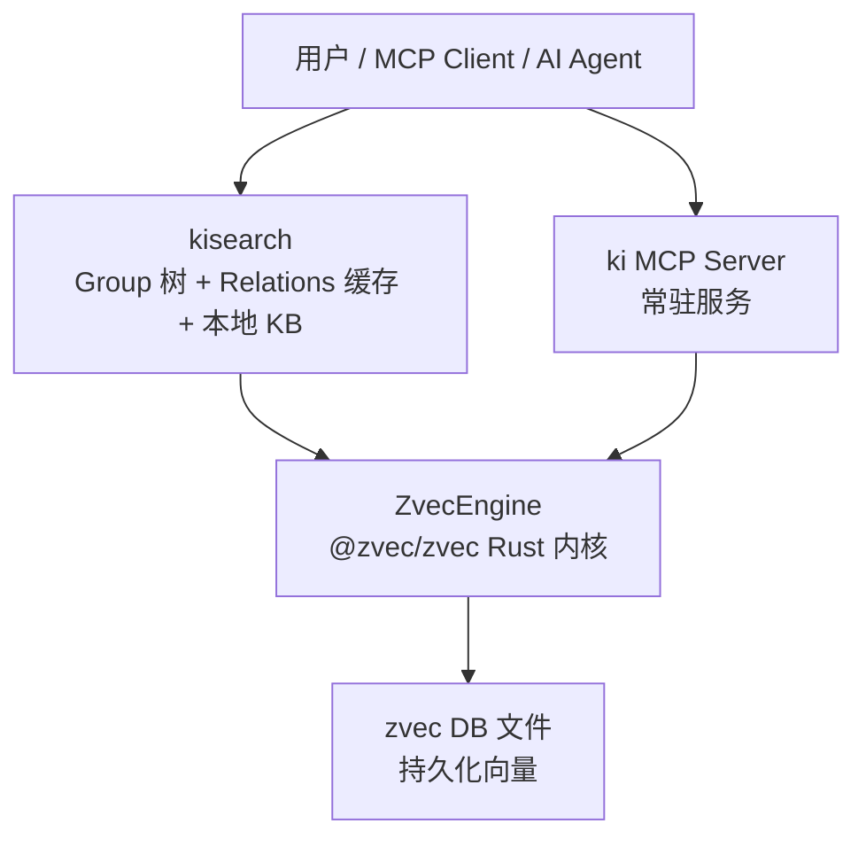
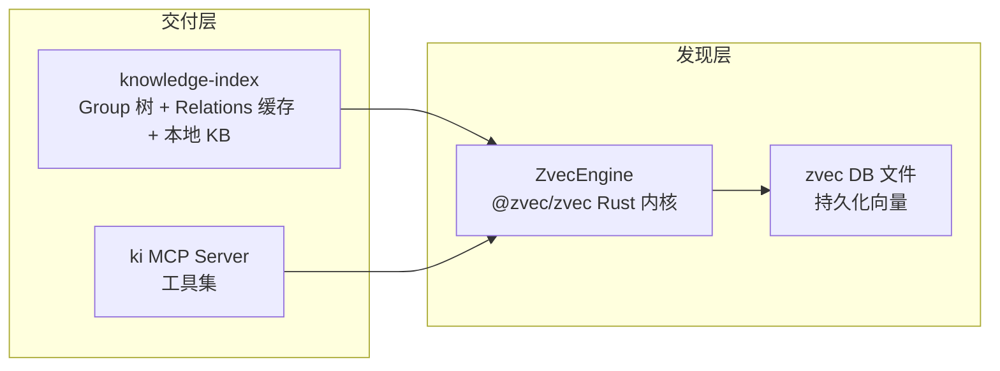
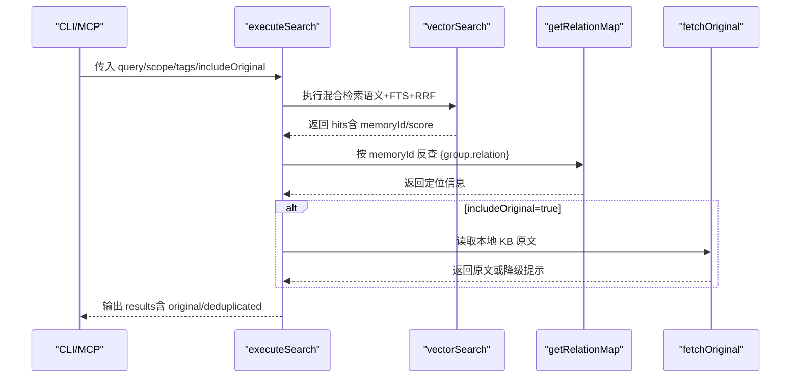
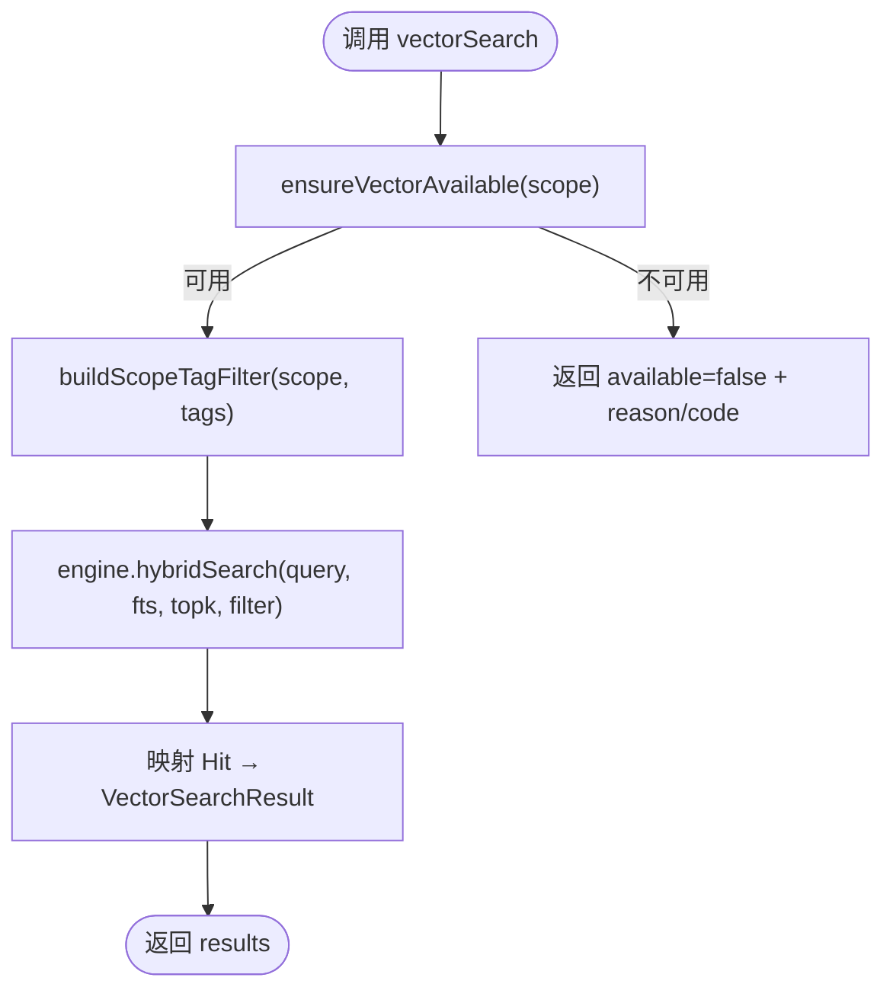
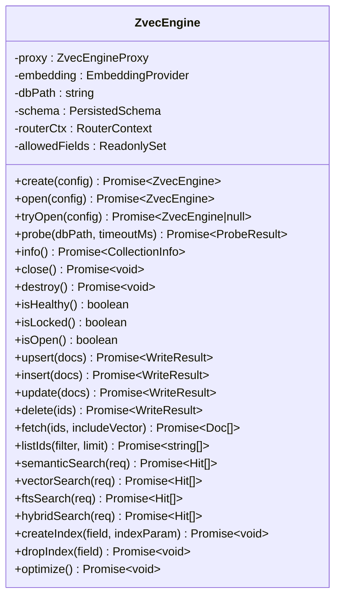
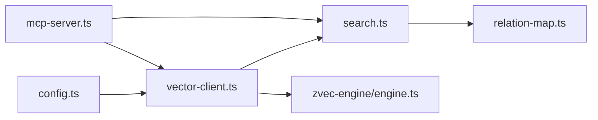

# 项目介绍与价值

<cite>
**本文引用的文件**
- [README.md](file://README.md)
- [docs/architecture.md](file://docs/architecture.md)
- [src/search.ts](file://src/search.ts)
- [src/lib/vector-client.ts](file://src/lib/vector-client.ts)
- [src/zvec-engine/engine.ts](file://src/zvec-engine/engine.ts)
- [src/lib/config.ts](file://src/lib/config.ts)
- [src/lib/relation-map.ts](file://src/lib/relation-map.ts)
- [src/mcp-server.ts](file://src/mcp-server.ts)
</cite>

## 目录
1. [引言](#引言)
2. [项目结构](#项目结构)
3. [核心组件](#核心组件)
4. [架构总览](#架构总览)
5. [关键组件深度解析](#关键组件深度解析)
6. [依赖关系分析](#依赖关系分析)
7. [性能与检索特性](#性能与检索特性)
8. [故障排查指南](#故障排查指南)
9. [结论](#结论)
10. [附录：使用场景示例](#附录使用场景示例)

## 引言
kisearch（CLI 命令 ki）是面向 AI Agent 的知识索引系统，提供“结构化知识索引 + 向量语义检索”的混合能力。它不是常规 RAG 的 chunk 检索，而是将知识组织为 Group 树与 Relation 视图，叠加 zvec 混合检索引擎（语义 + BM25 + RRF 融合），让 Agent 既能“语义搜到”，也能“按索引直查原文”。

核心价值主张
- 结构化导航：Group 树 + Relation 热缓存，知识有归属、有层级，便于先缩小范围再检索。
- 双路径查询：已知索引时直接精准查询原文；未知时走向量语义兜底。
- 原文交付：search 结果通过 memoryId 反查定位 group/relation，返回本地 KB 原文而非片段。
- 混合检索：语义向量召回 + BM25 全文关键词召回 + RRF 融合排序，符号（类名/方法名）可精确召回。
- 长期记忆：跨会话持续积累，带评分衰减与冷热治理，热点优先。
- 安全与隔离：scope 隔离、WAL 原子写入、幂等覆盖更新。

与传统 RAG 的差异优势
- 知识组织：无序 chunk vs Group 树/Relation 结构化索引。
- 检索结果：chunk 片段 vs 原文全文（命中可直接引用）。
- 查询路径：仅语义模糊召回 vs 索引直查 + 语义兜底。
- 精准度：语义噪声 vs 索引直查零误差；语义命中可通过 memoryId 反查定位。
- 符号检索：弱匹配 vs BM25 全文支持类名/方法名精确召回。
- 状态管理：无状态 vs 冷热治理 + 评分衰减 + 使用计数。
- 跨会话：一次性检索 vs 长期记忆库沉淀。
- 写入校验：无约束 vs scope 隔离 + WAL + 幂等覆盖。

一句话总结：常规 RAG 解决“搜得到”，kisearch 同时解决“搜得到 + 看得见 + 定位到原文”。

章节来源
- [README.md:35-80](file://README.md#L35-L80)

## 项目结构
整体由“发现层（zvec 向量引擎）+ 交付层（kisearch）”构成：
- 发现层：zvec 负责语义召回、BM25 全文、RRF 融合、持久化存储。
- 交付层：kisearch 负责 Group 树导航、Relation 热缓存、原文全文交付、CLI/MCP 暴露能力。

图表来源
- [docs/architecture.md:13-26](file://docs/architecture.md#L13-L26)

章节来源
- [docs/architecture.md:1-35](file://docs/architecture.md#L1-L35)

## 核心组件
- 配置与范围控制：加载配置、scope 护栏模式、默认路径与扩展。
- 向量客户端：封装 ZvecEngine，提供 hybridSearch、upsert、listIds/fetch、可用性检测、空闲释放锁。
- 搜索编排：执行 search 流程，tag 优先级、memoryId 反查、原文获取与去重。
- 关系映射：memoryId → {group, relation} 的反查映射，带 TTL 与 mtime/size 失效策略。
- 引擎门面：ZvecEngine 统一入口，创建/打开/探测、写入/检索编排、生命周期管理。
- MCP 服务：注册工具集，HTTP/stdio 传输、鉴权 Token、健康检查与守护进程。

章节来源
- [src/lib/config.ts:1-22](file://src/lib/config.ts#L1-L22)
- [src/lib/vector-client.ts:1-14](file://src/lib/vector-client.ts#L1-L14)
- [src/search.ts:1-19](file://src/search.ts#L1-L19)
- [src/lib/relation-map.ts:1-17](file://src/lib/relation-map.ts#L1-L17)
- [src/zvec-engine/engine.ts:1-11](file://src/zvec-engine/engine.ts#L1-L11)
- [src/mcp-server.ts:49-71](file://src/mcp-server.ts#L49-L71)

## 架构总览
kisearch 的分层职责与协作关系如下：
- knowledge-index（kisearch）：Group 导航、热门 Relation 缓存、本地 Markdown 原文交付、CLI 命令。
- ki MCP Server：常驻服务，暴露 store/search/list/stats 等工具。
- ZvecEngine：进程内向量引擎，insert/upsert/hybridSearch，Embedding 集成。

图表来源
- [docs/architecture.md:28-35](file://docs/architecture.md#L28-L35)

章节来源
- [docs/architecture.md:28-35](file://docs/architecture.md#L28-L35)

## 关键组件深度解析

### 搜索编排（search.ts）
- 标签优先级：默认全量搜索时，ki-search（内容）优先，其次 ki-relation / ki-path。
- 向量检索：调用 vectorSearch，支持 limit/threshold/tags。
- 原文定位：通过 getRelationMap 按 memoryId 反查 relations-cache，附加 group/relation。
- 原文获取：可选 includeOriginal，失败时降级为向量 content 并提示。
- 多 tag 去重：同一 (group, relation) 多条命中保留最高 score 一条。
- 同文件多 chunk 去重：开启原文时，同一文件多 chunk 命中只返回一次原文，其余标记 deduplicated。

图表来源
- [src/search.ts:70-199](file://src/search.ts#L70-L199)
- [src/lib/vector-client.ts:496-533](file://src/lib/vector-client.ts#L496-L533)
- [src/lib/relation-map.ts:48-78](file://src/lib/relation-map.ts#L48-L78)

章节来源
- [src/search.ts:20-199](file://src/search.ts#L20-L199)

### 向量客户端（vector-client.ts）
- 单例 Engine：进程内唯一 ZvecEngine，惰性打开，空闲超时自动释放锁。
- 撞锁重试：probe/open 检测到 locked 时等待并重试，避免立即失败。
- 混合检索：hybridSearch(queryText, fts, topk, filter)，按 scope/tag 过滤。
- 存储幂等：doc id = sha256(text + scope + tag) 截 32，重复写入覆盖。
- 可用性检测：ensureVectorAvailable 区分 LOCKED/CORRUPTED/PROBE_ERROR。
- 管理面：listDocs/listScopes/listTags/deleteScope/countScope 等。

图表来源
- [src/lib/vector-client.ts:430-494](file://src/lib/vector-client.ts#L430-L494)
- [src/lib/vector-client.ts:496-533](file://src/lib/vector-client.ts#L496-L533)

章节来源
- [src/lib/vector-client.ts:1-14](file://src/lib/vector-client.ts#L1-L14)
- [src/lib/vector-client.ts:106-164](file://src/lib/vector-client.ts#L106-L164)
- [src/lib/vector-client.ts:238-323](file://src/lib/vector-client.ts#L238-L323)
- [src/lib/vector-client.ts:334-382](file://src/lib/vector-client.ts#L334-L382)
- [src/lib/vector-client.ts:430-494](file://src/lib/vector-client.ts#L430-L494)
- [src/lib/vector-client.ts:496-533](file://src/lib/vector-client.ts#L496-L533)

### 引擎门面（zvec-engine/engine.ts）
- 工厂方法：create/open/tryOpen/probe，严格校验 dbPath、schema、维度。
- 写入编排：按是否需 embed 切分，小批 embed（EMBED_BATCH_SIZE=64），失败项进 errors，成功项正常写入。
- 检索编排：routeSearch 路由，必要时 embed，注入 filterSql，归一化为 Hit。
- 生命周期：close/destroy/isHealthy/isLocked/isOpen/probe，健壮的资源管理。

图表来源
- [src/zvec-engine/engine.ts:68-131](file://src/zvec-engine/engine.ts#L68-L131)
- [src/zvec-engine/engine.ts:201-326](file://src/zvec-engine/engine.ts#L201-L326)
- [src/zvec-engine/engine.ts:330-495](file://src/zvec-engine/engine.ts#L330-L495)

章节来源
- [src/zvec-engine/engine.ts:1-11](file://src/zvec-engine/engine.ts#L1-L11)
- [src/zvec-engine/engine.ts:95-131](file://src/zvec-engine/engine.ts#L95-L131)
- [src/zvec-engine/engine.ts:133-199](file://src/zvec-engine/engine.ts#L133-L199)
- [src/zvec-engine/engine.ts:201-326](file://src/zvec-engine/engine.ts#L201-L326)
- [src/zvec-engine/engine.ts:330-495](file://src/zvec-engine/engine.ts#L330-L495)

### 配置与范围（config.ts）
- 配置文件查找优先级：命令行 > ~/.ki/config.yaml/yml/json > 内置默认值。
- 路径展开：$HOME/~/相对路径解析。
- 字段校验：fail-loud，不静默落默认值/NaN。
- scopeMode：default（自动创建）/strict（必须显式注册）。
- 向量配置：vectorDir/embedding/provider/baseURL/model/dimension/apiKey。
- MCP 配置：http.host/port/allowedHosts（token 不入配置）。

章节来源
- [src/lib/config.ts:1-22](file://src/lib/config.ts#L1-L22)
- [src/lib/config.ts:30-65](file://src/lib/config.ts#L30-L65)
- [src/lib/config.ts:116-145](file://src/lib/config.ts#L116-L145)
- [src/lib/config.ts:156-183](file://src/lib/config.ts#L156-L183)
- [src/lib/config.ts:252-385](file://src/lib/config.ts#L252-L385)
- [src/lib/config.ts:408-485](file://src/lib/config.ts#L408-L485)

### 关系映射（relation-map.ts）
- 用途：memoryId → {group, relation} 反查，用于 search 结果定位原文。
- 缓存策略：模块级单例 Map<scope, entry>，TTL 10 分钟，mtime/size 优先失效。
- 构建逻辑：遍历 hot_relations，优先多值 memoryIds（方案 D），回退旧数据单值 memoryId。
- 容错：文件缺失/损坏返回空 Map，search 降级不带附加字段。

章节来源
- [src/lib/relation-map.ts:1-17](file://src/lib/relation-map.ts#L1-L17)
- [src/lib/relation-map.ts:48-78](file://src/lib/relation-map.ts#L48-L78)
- [src/lib/relation-map.ts:80-114](file://src/lib/relation-map.ts#L80-L114)

### MCP 服务（mcp-server.ts）
- 工具注册：query-group/get-module-info/sync-relation/bulk-sync-relation/manage-index/search/store/bulk-store/delete-relation/scope-list/tag-list。
- HTTP/stdio：共享单例，多 IDE 共用持锁进程，避免向量库锁冲突。
- 鉴权：非回环绑定强制 Token，支持多 Token + scope 授权。
- 守护进程：restart/stop/status/token 子命令，健康检查与版本守卫。

章节来源
- [src/mcp-server.ts:49-71](file://src/mcp-server.ts#L49-L71)
- [src/mcp-server.ts:83-107](file://src/mcp-server.ts#L83-L107)
- [src/mcp-server.ts:137-212](file://src/mcp-server.ts#L137-L212)
- [src/mcp-server.ts:227-351](file://src/mcp-server.ts#L227-L351)
- [src/mcp-server.ts:492-734](file://src/mcp-server.ts#L492-L734)

## 依赖关系分析
- 交付层依赖发现层：kisearch 通过 vector-client 调用 ZvecEngine 进行混合检索与存储。
- 配置驱动：所有路径、scope、向量配置来自 config.ts，确保一致性与可迁移性。
- 关系映射桥接：search 依赖 relation-map 将向量结果映射到 Group/Relation，实现原文定位。
- MCP 作为统一入口：对外暴露工具集，内部复用 vector-client 与 search 逻辑。

图表来源
- [src/lib/config.ts:156-183](file://src/lib/config.ts#L156-L183)
- [src/lib/vector-client.ts:334-382](file://src/lib/vector-client.ts#L334-L382)
- [src/search.ts:70-199](file://src/search.ts#L70-L199)
- [src/lib/relation-map.ts:48-78](file://src/lib/relation-map.ts#L48-L78)
- [src/mcp-server.ts:49-71](file://src/mcp-server.ts#L49-L71)
- [src/zvec-engine/engine.ts:95-131](file://src/zvec-engine/engine.ts#L95-L131)

章节来源
- [src/lib/config.ts:156-183](file://src/lib/config.ts#L156-L183)
- [src/lib/vector-client.ts:334-382](file://src/lib/vector-client.ts#L334-L382)
- [src/search.ts:70-199](file://src/search.ts#L70-L199)
- [src/lib/relation-map.ts:48-78](file://src/lib/relation-map.ts#L48-L78)
- [src/mcp-server.ts:49-71](file://src/mcp-server.ts#L49-L71)
- [src/zvec-engine/engine.ts:95-131](file://src/zvec-engine/engine.ts#L95-L131)

## 性能与检索特性
- 混合检索：语义向量 + BM25 全文 + RRF 融合排序，兼顾语义与符号精确匹配。
- 批量嵌入：EMBED_BATCH_SIZE=64，失败粒度小批，避免整批失败。
- 空闲释放锁：常驻 MCP 空闲超时后自动 closeEngine，多实例错开共享向量库。
- 撞锁重试：probe/open 检测到 locked 时等待并重试，提升鲁棒性。
- 原文去重：同文件多 chunk 命中只返回一次原文，减少冗余。
- 标签优先级：ki-search 内容优先，提升相关度。

章节来源
- [src/zvec-engine/engine.ts:330-450](file://src/zvec-engine/engine.ts#L330-L450)
- [src/lib/vector-client.ts:106-164](file://src/lib/vector-client.ts#L106-L164)
- [src/search.ts:20-29](file://src/search.ts#L20-L29)
- [src/search.ts:159-194](file://src/search.ts#L159-L194)

## 故障排查指南
- 向量库被占用：提示包含处置方式（停止实例、确认并发、稍后重试、重建向量库）。
- 启动预检失败：存在 ❌ 检查项拒绝启动，运行 ki doctor 排查。
- 配置错误：字段校验 fail-loud，列出全部问题，修正后继续。
- 原文不可用：降级返回向量 content，并提示原因（本地 KB 缺失/读取异常）。
- 锁竞争：多 stdio 实例与 HTTP 单例并存会争抢向量库锁，建议迁移 URL 接入。

章节来源
- [src/lib/vector-client.ts:72-87](file://src/lib/vector-client.ts#L72-L87)
- [src/mcp-server.ts:660-678](file://src/mcp-server.ts#L660-L678)
- [src/lib/config.ts:266-278](file://src/lib/config.ts#L266-L278)
- [src/search.ts:54-68](file://src/search.ts#L54-L68)
- [src/mcp-server.ts:609-643](file://src/mcp-server.ts#L609-L643)

## 结论
kisearch 通过“结构化知识索引 + 向量语义检索”的设计，解决了传统 RAG 在知识组织、检索精准度、原文定位、符号检索、状态管理等方面的痛点。结合 zvec 混合检索引擎，实现了语义与关键词的互补，并通过 Group 树/Relation 视图提供直观的导航与定位。MCP 协议暴露工具集，支持多 IDE 共享单例，保障高可用与易集成。对于初学者，可从导入外部 Wiki、语义检索、查看 Group 树开始；对于高级用户，可深入 zvec 引擎、混合检索策略、冷热分区与原文交付机制。

## 附录：使用场景示例
- 首次导入外部 Wiki：scan-kb import --source /path/to/wiki --group Wiki，自动切分、向量化、写索引与 KB。
- 语义检索：ki search --scope my-project --query "用户登录流程"，返回命中结果与原文定位。
- 构建 Web 前端：web/dist 构建后，ki mcp --http --web 启动服务，浏览器访问可视化界面。
- MCP 接入：HTTP 模式启动后，IDE 配置 url 型条目，通过标准 MCP 协议使用工具集。
- Token 管理：ki mcp token generate --scope team-a，生成授权 Token，支持 scope 隔离与权限控制。

章节来源
- [README.md:143-167](file://README.md#L143-L167)
- [README.md:220-236](file://README.md#L220-L236)
- [README.md:296-321](file://README.md#L296-L321)