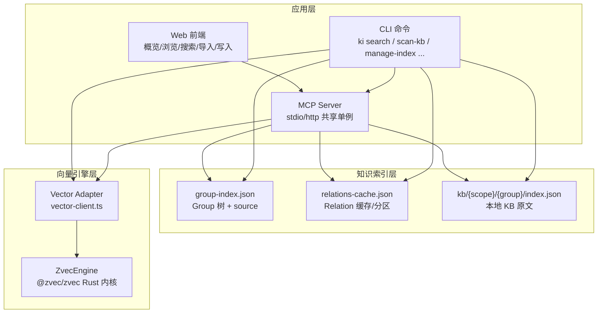
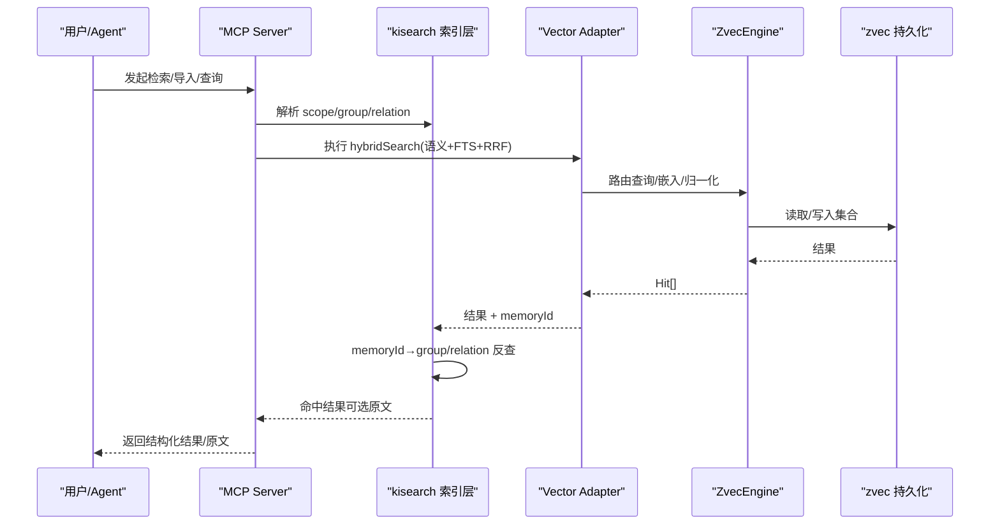
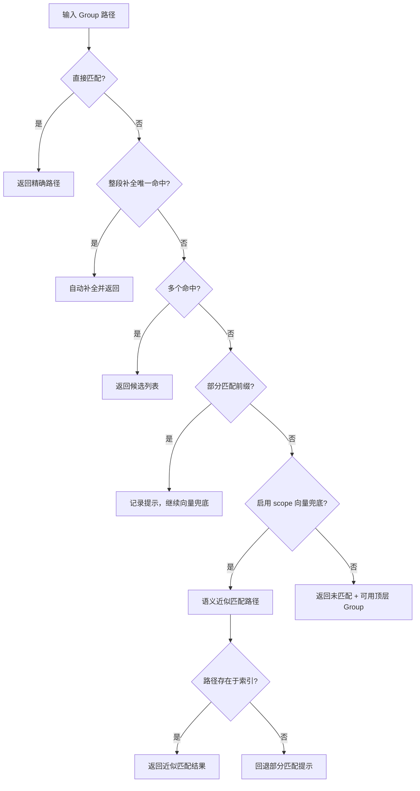
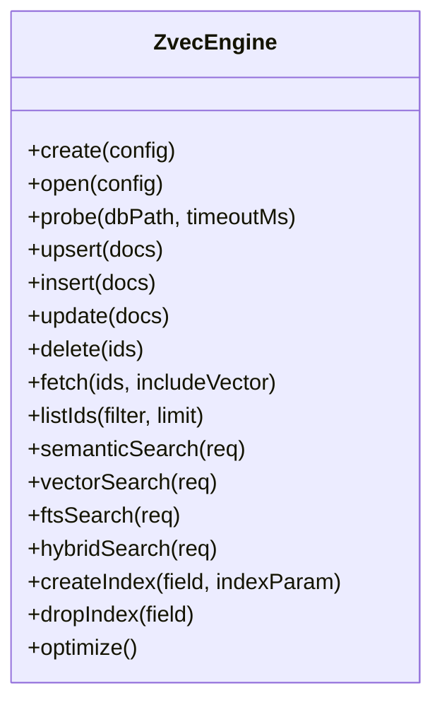
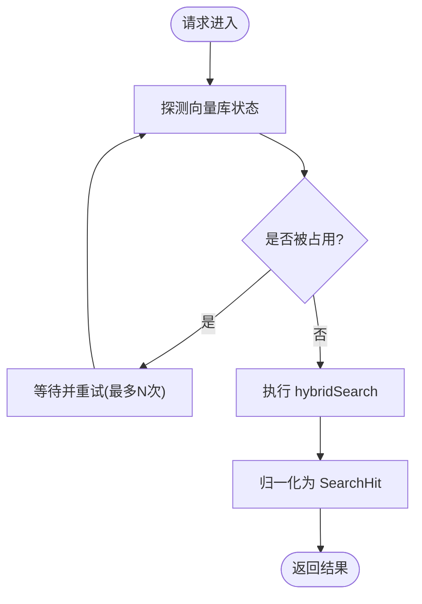
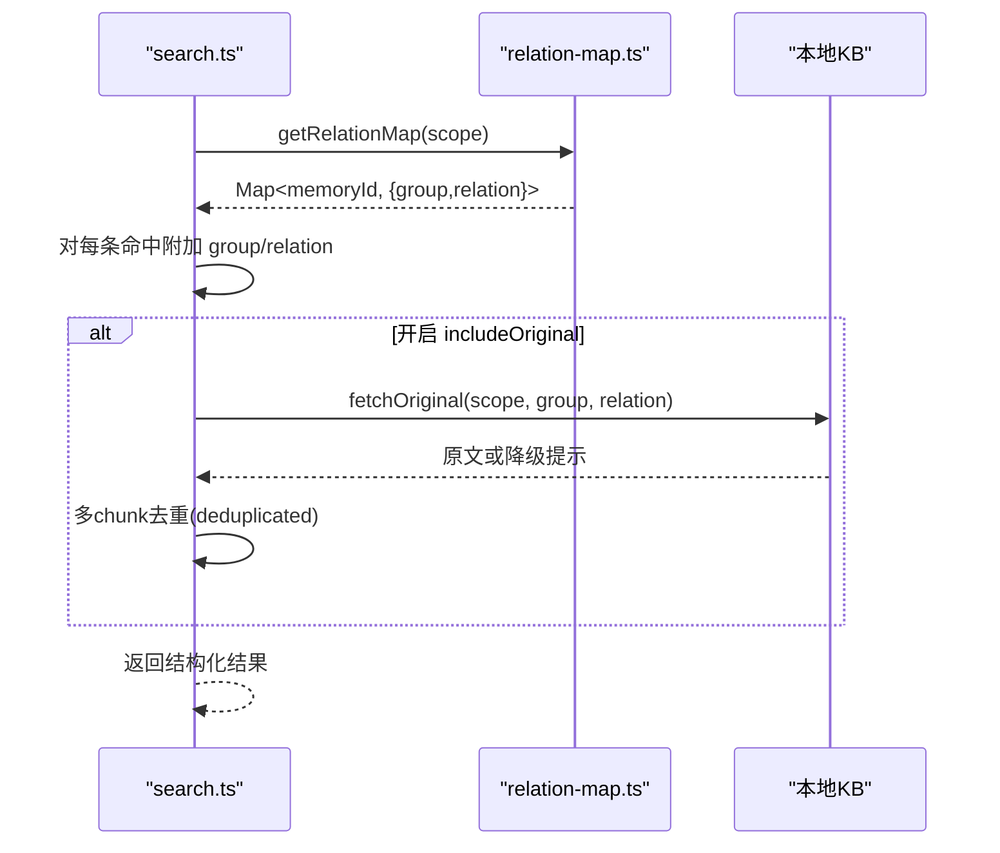
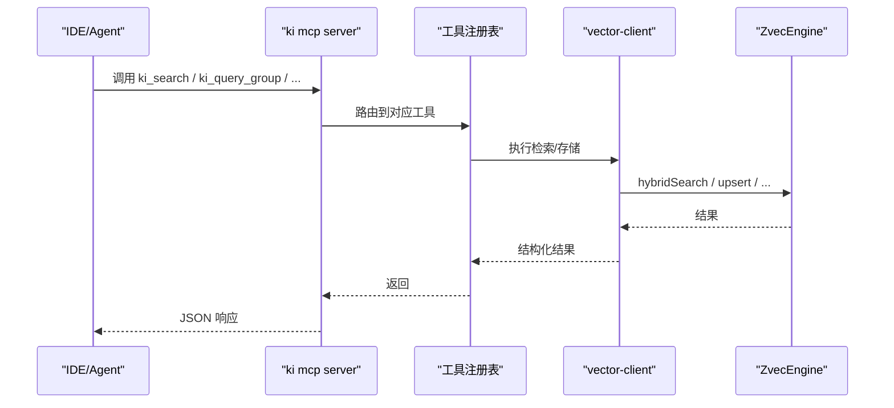
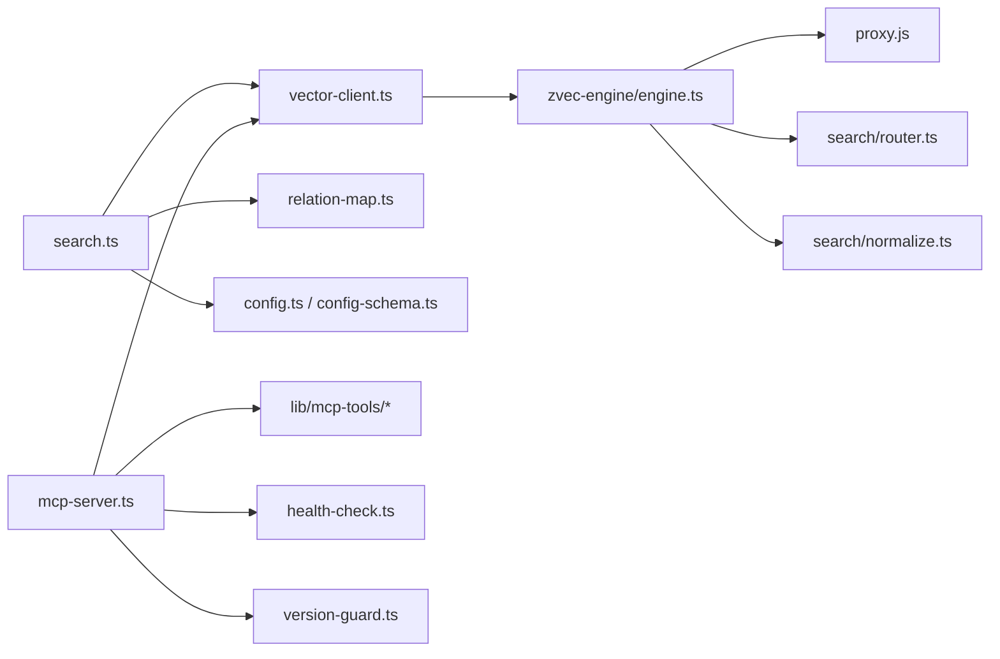

# 项目概述

<cite>
**本文引用的文件**
- [README.md](file://README.md)
- [package.json](file://package.json)
- [src/search.ts](file://src/search.ts)
- [src/zvec-engine/engine.ts](file://src/zvec-engine/engine.ts)
- [src/lib/vector-client.ts](file://src/lib/vector-client.ts)
- [src/lib/relation-map.ts](file://src/lib/relation-map.ts)
- [src/lib/group-resolve.ts](file://src/lib/group-resolve.ts)
- [src/mcp-server.ts](file://src/mcp-server.ts)
- [docs/architecture.md](file://docs/architecture.md)
- [docs/configuration.md](file://docs/configuration.md)
- [src/config.ts](file://src/config.ts)
- [src/lib/config-schema.ts](file://src/lib/config-schema.ts)
</cite>

## 目录
1. [简介](#简介)
2. [项目结构](#项目结构)
3. [核心组件](#核心组件)
4. [架构总览](#架构总览)
5. [关键组件深度解析](#关键组件深度解析)
6. [依赖关系分析](#依赖关系分析)
7. [性能与可扩展性](#性能与可扩展性)
8. [故障排查指南](#故障排查指南)
9. [结论](#结论)
10. [附录：快速开始与使用示例](#附录快速开始与使用示例)

## 简介
knowledge-indexer（CLI 命令 ki）为 AI Agent 提供“结构化知识索引 + 向量语义检索”能力，主要通过 MCP 协议暴露给 Agent，同时支持 CLI 直接调用。与传统 RAG 不同，它不是简单地把文档切块后做向量检索，而是将知识组织成 Group 树与 Relation 视图，叠加 zvec 混合检索引擎（语义 + BM25 + RRF 融合），让 Agent 既能“语义搜到”，也能“按索引直查原文”。

核心价值主张
- 结构化导航：Group 树 + Relation 热缓存，知识有归属、有层级，便于先缩小范围再检索。
- 原文交付：命中后可反查并返回本地 KB 的 Markdown 原文，而非片段。
- 双路径查询：已知索引时精准直达原文；未知时走向量语义兜底。
- 混合检索：语义召回 + BM25 全文 + RRF 融合排序，符号（类名/方法名）可精确召回。
- 安全与隔离：scope 隔离、WAL 原子写入、幂等覆盖更新、Token 鉴权（HTTP 模式）。

与常规 RAG 的差异优势
- 知识组织：无序 chunk vs Group 树 + Relation 结构化索引。
- 检索结果：chunk 片段 vs 原文全文（带 group/relation 定位）。
- 查询路径：仅语义 vs 索引直查 + 语义兜底。
- 精准度：模糊匹配噪声 vs 索引直查零误差 + 语义兜底。
- 状态管理：无状态 vs 冷热治理 + 评分衰减 + 使用计数。
- 跨会话：一次性检索 vs 长期记忆库持续积累。
- 写入校验：无约束 vs scope 隔离 + WAL + 幂等覆盖。

章节来源
- [README.md:35-80](file://README.md#L35-L80)

## 项目结构
仓库采用“分层 + 模块化”的组织方式：
- 顶层 CLI 入口与命令分发（bin/ki.mjs）
- src/ 业务逻辑与工具库（search、mcp-server、lib/*）
- src/zvec-engine/ 自研向量引擎封装（engine、proxy、worker、schema、filter、embedding、search）
- web/ 内置可视化前端（浏览、搜索、导入、写入）
- docs/ 架构与配置文档
- test/ 单元与端到端测试
- zvec-mcp-server/、zvec-probe-node/ 等辅助工程

图表来源
- [docs/architecture.md:11-50](file://docs/architecture.md#L11-L50)
- [src/mcp-server.ts:49-71](file://src/mcp-server.ts#L49-L71)
- [src/lib/vector-client.ts:138-147](file://src/lib/vector-client.ts#L138-L147)

章节来源
- [docs/architecture.md:11-60](file://docs/architecture.md#L11-L60)
- [package.json:1-68](file://package.json#L1-L68)

## 核心组件
- 结构化索引与导航
  - Group 树与 Relation 缓存：提供层级导航、热门条目、词云与关键词过滤。
  - 路径解析与自动补全：支持整段补全、部分匹配提示、向量近似兜底。
- 向量检索与混合排序
  - 基于 zvec 的 hybridSearch：dense 语义 + FTS 全文 + RRF 融合。
  - tag/scope 过滤：tag 小写化、scope 隔离，doc id 基于 text+scope 哈希实现幂等 upsert。
- 原文定位与交付
  - memoryId → group/relation 反查映射（TTL 缓存），按需返回本地 KB 原文。
- MCP 服务与 CLI
  - 11 个 MCP 工具（只读为主，最小破坏性），支持 stdio 与 HTTP 共享单例。
  - 19 个 CLI 命令覆盖导入、索引管理、检索、存储、备份恢复等。

章节来源
- [src/lib/group-resolve.ts:96-219](file://src/lib/group-resolve.ts#L96-L219)
- [src/lib/vector-client.ts:1-147](file://src/lib/vector-client.ts#L1-L147)
- [src/lib/relation-map.ts:1-120](file://src/lib/relation-map.ts#L1-L120)
- [src/mcp-server.ts:49-71](file://src/mcp-server.ts#L49-L71)
- [README.md:195-217](file://README.md#L195-L217)

## 架构总览
系统分为三层：发现层（zvec 向量引擎）、交付层（kisearch 结构化索引与原文）、接入层（CLI/MCP/Web）。

图表来源
- [src/zvec-engine/engine.ts:296-495](file://src/zvec-engine/engine.ts#L296-L495)
- [src/lib/vector-client.ts:106-147](file://src/lib/vector-client.ts#L106-L147)
- [src/lib/relation-map.ts:42-78](file://src/lib/relation-map.ts#L42-L78)
- [docs/architecture.md:11-26](file://docs/architecture.md#L11-L26)

## 关键组件深度解析

### 结构化知识索引（Group 树 / Relation）
- Group 树：以嵌套对象表示层级，支持存在性检查、最长前缀查找、子节点枚举。
- Relation 缓存：维护 hot/warm/cold/emerging 分区、评分与使用计数，附带 memoryIds/sourcePath。
- 路径解析：四层策略（直接匹配→整段补全→部分匹配→向量兜底），失败时给出候选或可用顶层 Group 提示。

图表来源
- [src/lib/group-resolve.ts:96-219](file://src/lib/group-resolve.ts#L96-L219)

章节来源
- [src/lib/group-resolve.ts:27-219](file://src/lib/group-resolve.ts#L27-L219)
- [docs/architecture.md:52-107](file://docs/architecture.md#L52-L107)

### 向量检索与混合排序（zvec 引擎）
- 引擎门面：create/open/probe 生命周期管理，writeDocs 批量写入（含 embed 批处理与去重），search 统一路由（semantic/vector/fts/hybrid）。
- 混合检索：hybridSearch 通过 router 选择 dense/fts 路，必要时主线程 embed，注入 filterSql，normalize 输出 Hit。
- 容错与健壮：维度校验、字段白名单、错误聚合（EMBEDDING_FAILED/INCONSISTENT_UPDATE 等）。

图表来源
- [src/zvec-engine/engine.ts:68-326](file://src/zvec-engine/engine.ts#L68-L326)

章节来源
- [src/zvec-engine/engine.ts:68-509](file://src/zvec-engine/engine.ts#L68-L509)

### Vector Adapter（vector-client）
- 单一 collection 隔离：通过 scope/tag 标量字段过滤，doc id = sha256(text+scope) 截 32 实现幂等 upsert。
- 检索主路径：hybridSearch（queryText 语义 + content FTS + RRF）。
- 撞锁重试与空闲释放：多实例共享向量库，空闲超时自动 closeEngine，避免持锁冲突。

图表来源
- [src/lib/vector-client.ts:106-147](file://src/lib/vector-client.ts#L106-L147)

章节来源
- [src/lib/vector-client.ts:1-200](file://src/lib/vector-client.ts#L1-L200)

### 原文定位与交付（relation-map + search）
- 反查映射：memoryId → {group, relation}，带 TTL 与 mtime/size 失效策略。
- 原文获取：按 (group, relation) 从本地 KB 读取 Markdown 原文；失败降级为向量内容并提示。
- 多 chunk 去重：同一文件多 chunk 命中时保留首条原文，其余标记 deduplicated。

图表来源
- [src/lib/relation-map.ts:42-120](file://src/lib/relation-map.ts#L42-L120)
- [src/search.ts:70-199](file://src/search.ts#L70-L199)

章节来源
- [src/lib/relation-map.ts:1-120](file://src/lib/relation-map.ts#L1-L120)
- [src/search.ts:33-199](file://src/search.ts#L33-L199)

### MCP 服务与 CLI
- MCP Server：注册 11 个工具（query_group/get_module_info/sync_relation/bulk_sync/manage_index/search/store/bulk_store/delete_relation/scope_list/tag_list），支持 stdio 与 HTTP 共享单例。
- 启动守卫：健康检查、版本守护、空闲释放锁、多实例冲突检测。
- CLI：19 个命令覆盖导入、索引管理、检索、存储、备份恢复等。

图表来源
- [src/mcp-server.ts:49-71](file://src/mcp-server.ts#L49-L71)
- [src/mcp-server.ts:492-734](file://src/mcp-server.ts#L492-L734)

章节来源
- [src/mcp-server.ts:49-71](file://src/mcp-server.ts#L49-L71)
- [src/mcp-server.ts:492-734](file://src/mcp-server.ts#L492-L734)
- [README.md:220-294](file://README.md#L220-L294)

## 依赖关系分析
- 外部依赖
  - @zvec/zvec：Rust 内核向量引擎，提供集合、索引、检索能力。
  - @modelcontextprotocol/sdk：MCP 协议 SDK，用于 stdio/http 传输。
  - commander：CLI 参数解析。
  - jiti：TypeScript 直接执行，无需编译。
  - yaml/zod：配置解析与校验。
- 内部模块耦合
  - search.ts 依赖 vector-client、relation-map、config/scope。
  - mcp-server.ts 依赖 lib/mcp-tools/*、vector-client、health-check、version-guard。
  - zvec-engine/engine.ts 依赖 proxy、router、normalize、schema、filter、embedding。

图表来源
- [src/search.ts:11-18](file://src/search.ts#L11-L18)
- [src/mcp-server.ts:5-23](file://src/mcp-server.ts#L5-L23)
- [src/zvec-engine/engine.ts:13-32](file://src/zvec-engine/engine.ts#L13-L32)

章节来源
- [package.json:42-49](file://package.json#L42-L49)
- [src/search.ts:11-18](file://src/search.ts#L11-L18)
- [src/mcp-server.ts:5-23](file://src/mcp-server.ts#L5-L23)
- [src/zvec-engine/engine.ts:13-32](file://src/zvec-engine/engine.ts#L13-L32)

## 性能与可扩展性
- 混合检索优化
  - hybridSearch 将语义与全文结合，RRF 融合排序提升召回质量与稳定性。
  - content 字段兼作 FTS 字段，jieba 分词加速关键词召回。
- 写入批处理与去重
  - embed 批大小 64，批内文本去重减少重复 HTTP 调用。
  - 失败粒度控制：某批失败不影响其他批次，错误聚合上报。
- 并发与锁管理
  - 撞锁重试与空闲释放锁：多实例共享向量库，空闲超时自动释放，降低争用。
  - 进程级单例（HTTP 模式）减少重复初始化开销。
- 可扩展点
  - Embedding Provider 可替换（siliconflow/openai-compatible）。
  - 标签体系可扩展（ki-search/ki-relation/ki-path），支持自定义 tag 过滤。
  - 清洗规则可开关（BOM/frontmatter/htmlComment/mermaid/codePath/codeBlock/keepShortSamples/emptyChunk）。

[本节为通用性能讨论，不直接分析具体代码行]

## 故障排查指南
- 向量库被占用/损坏
  - 现象：locked/corrupted 报错。
  - 处置：停止占用进程、等待释放、重建向量库（restore --rebuild-vector）。
- 配置错误
  - 现象：字段名拼写错误、类型不符、取值非法。
  - 处置：运行 ki doctor，根据错误清单修正；注意空值与废弃字段告警。
- MCP 启动失败
  - 现象：预检失败（缺 API Key、维度不匹配）。
  - 处置：修复 embedding 配置、确保端口与 Host 头合法、非回环绑定需 Token。
- 原文不可用
  - 现象：search 返回 originalHint 提示。
  - 处置：确认 relations-cache 与本地 KB 同步，必要时 sync-relation 或 restore 重建。

章节来源
- [src/lib/vector-client.ts:72-87](file://src/lib/vector-client.ts#L72-L87)
- [src/lib/config-schema.ts:125-166](file://src/lib/config-schema.ts#L125-L166)
- [src/mcp-server.ts:660-678](file://src/mcp-server.ts#L660-L678)
- [src/search.ts:54-68](file://src/search.ts#L54-L68)

## 结论
knowledge-indexer 通过“结构化知识索引 + 向量语义检索”的组合，解决了传统 RAG 在知识组织、结果可读性、定位准确性等方面的痛点。其设计兼顾了易用性与工程健壮性：Group 树与 Relation 视图提供清晰的导航与定位；zvec 混合检索保障召回质量；MCP/CLI/Web 多通道接入满足多样化场景；严格的配置校验与 WAL 原子写入确保数据一致性。对于初学者，可从快速开始入手；对于高级用户，可深入 zvec 引擎、标签体系与清洗规则进行定制与优化。

[本节为总结性内容，不直接分析具体代码行]

## 附录：快速开始与使用示例
- 安装与初始化
  - 安装 CLI：curl 脚本一键安装或源码安装。
  - 初始化配置：ki config init，生成 YAML 模板；ki doctor 诊断。
- 导入知识库
  - 外部 Wiki 原文直导：ki scan-kb import --scope <name> --source <path> --group <name>。
  - 增量更新：重复执行同命令即幂等追加。
- 检索与查看
  - 语义检索：ki search --scope <name> --query "自然语言查询" [--original]。
  - 构建 Web 前端：cd web && npm install && npm run build。
  - 启动 MCP HTTP：ki mcp --http --web，浏览器访问 http://127.0.0.1:7423/。
- 安全与权限
  - Token 管理：ki mcp token generate/list/update/delete。
  - 非回环绑定需 Token，回环绑定免鉴权。

章节来源
- [README.md:105-193](file://README.md#L105-L193)
- [docs/configuration.md:7-24](file://docs/configuration.md#L7-L24)
- [src/config.ts:121-177](file://src/config.ts#L121-L177)