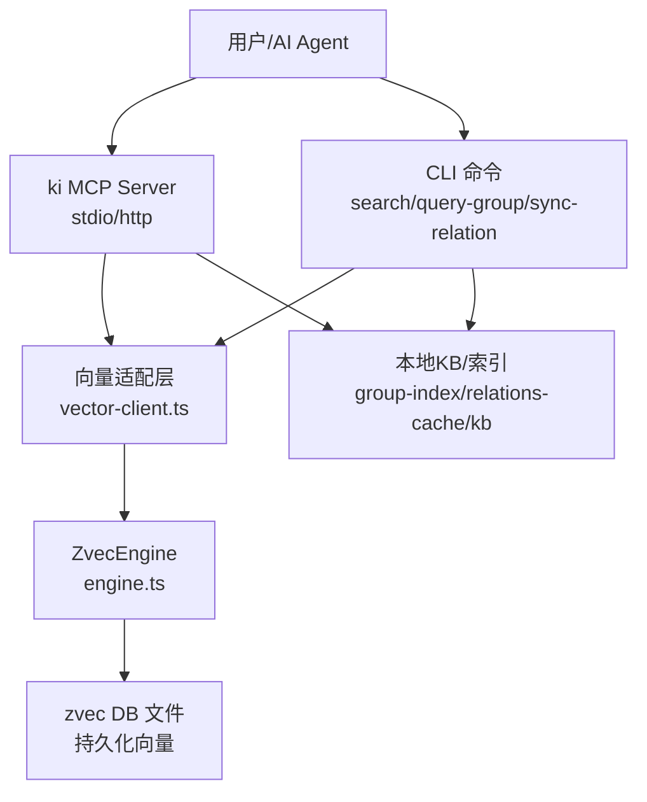
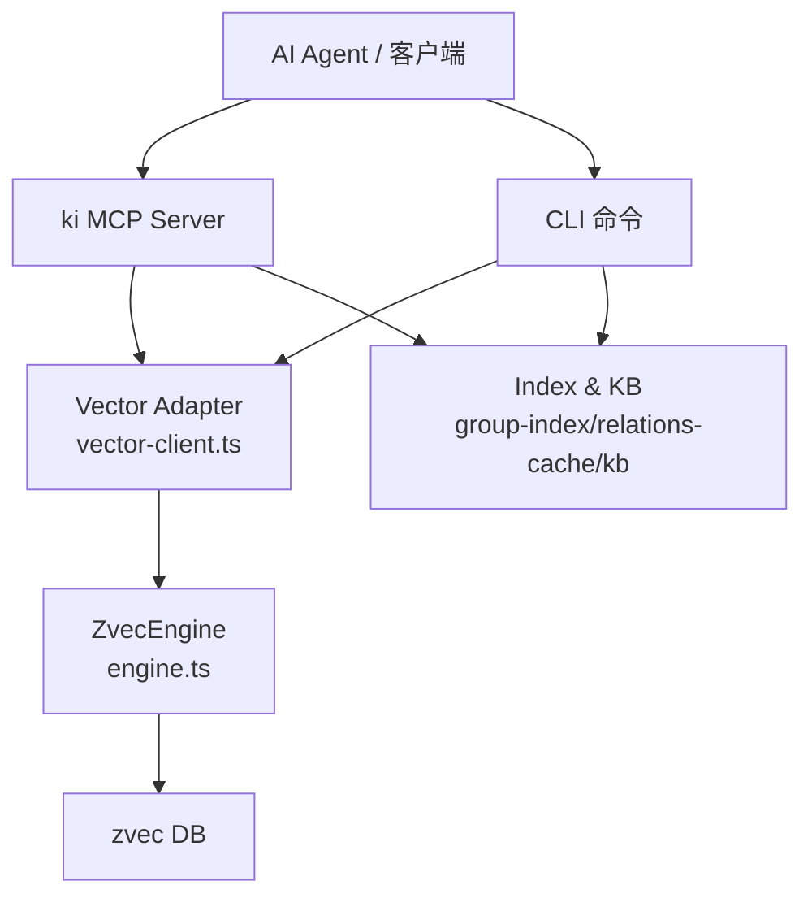
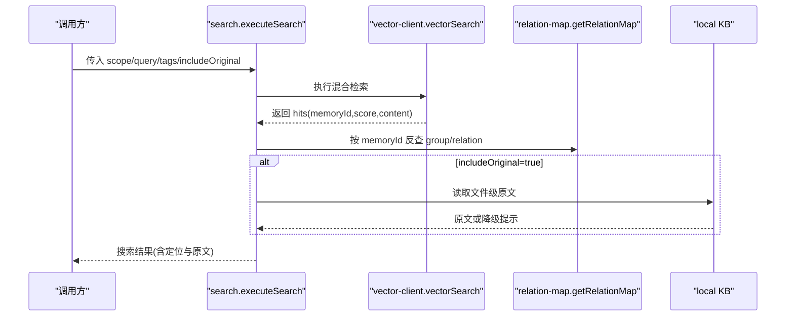
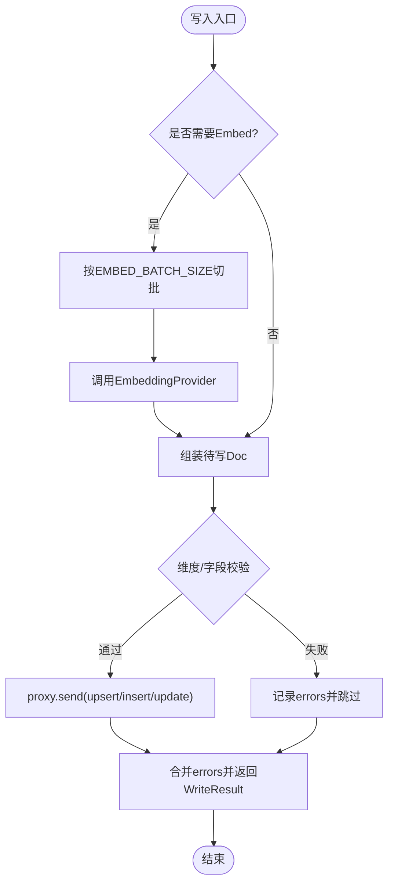
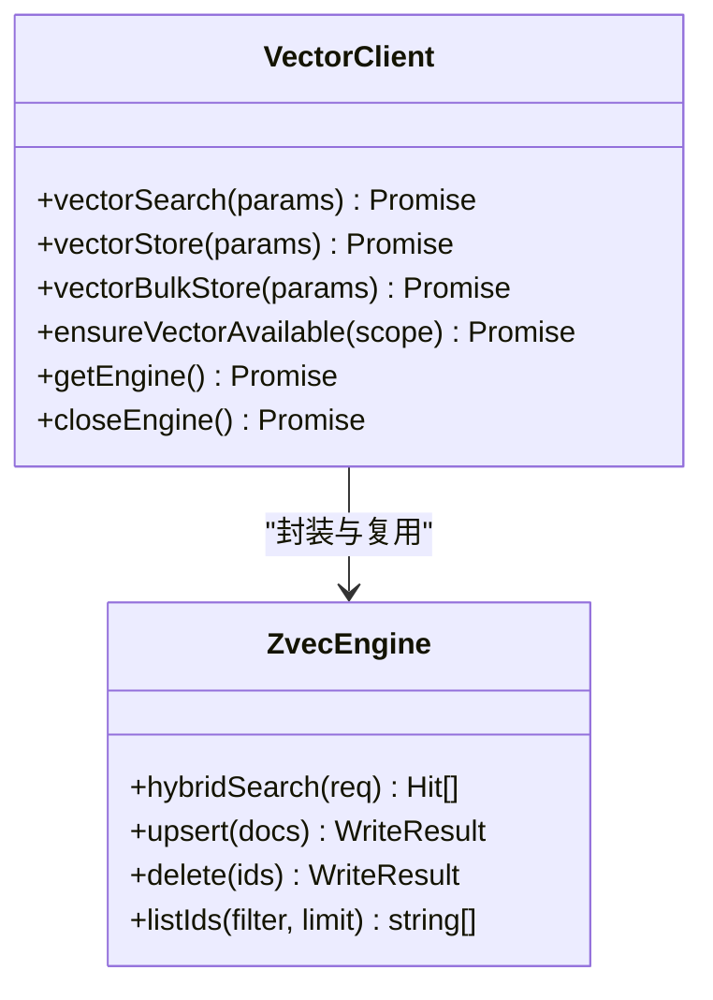
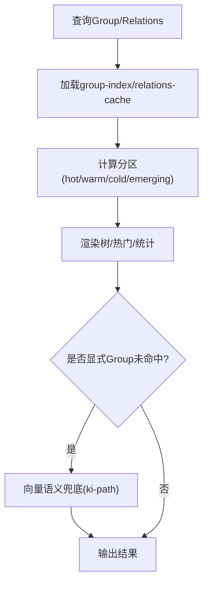
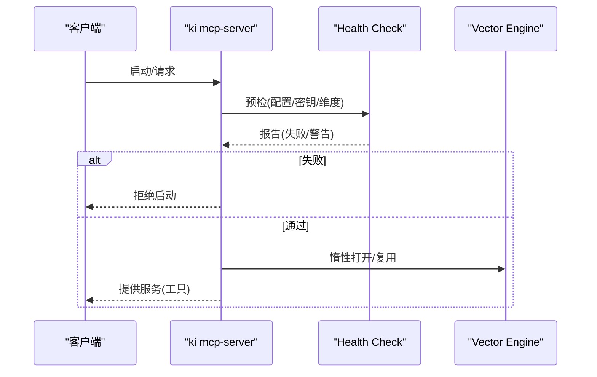
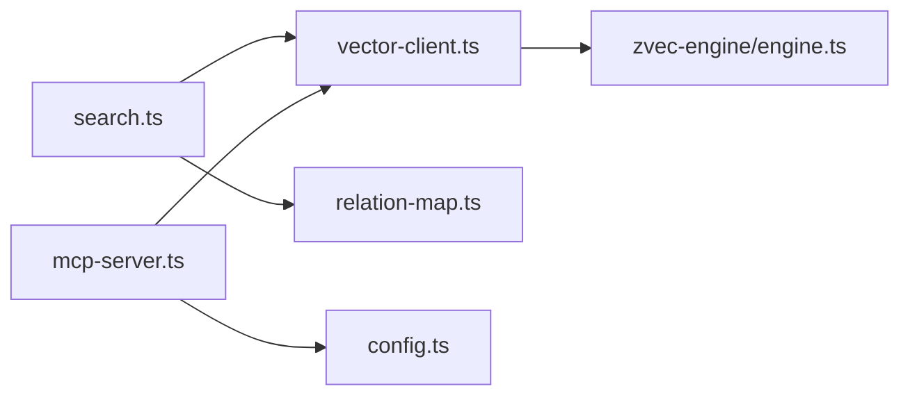

# 项目概述

<cite>
**本文引用的文件**
- [README.md](file://README.md)
- [package.json](file://package.json)
- [src/config.ts](file://src/config.ts)
- [src/search.ts](file://src/search.ts)
- [src/mcp-server.ts](file://src/mcp-server.ts)
- [src/lib/vector-client.ts](file://src/lib/vector-client.ts)
- [src/zvec-engine/engine.ts](file://src/zvec-engine/engine.ts)
- [src/lib/relation-map.ts](file://src/lib/relation-map.ts)
- [src/query-group.ts](file://src/query-group.ts)
- [docs/architecture.md](file://docs/architecture.md)
</cite>

## 目录
1. [简介](#简介)
2. [项目结构](#项目结构)
3. [核心组件](#核心组件)
4. [架构总览](#架构总览)
5. [详细组件分析](#详细组件分析)
6. [依赖关系分析](#依赖关系分析)
7. [性能与可用性](#性能与可用性)
8. [故障排查指南](#故障排查指南)
9. [结论](#结论)
10. [附录：快速开始](#附录快速开始)

## 简介
knowledge-indexer（CLI 命令 ki）为 AI Agent 提供“结构化知识索引 + 向量语义检索”的本地知识库能力。它不是常规 RAG 的 chunk 召回，而是以 Group 树组织知识、以 Relation 管理可检索条目，并通过 zvec 混合检索引擎实现语义+全文+RRF 融合排序；查询时优先走索引直查原文，未命中再走向量语义兜底，从而同时解决“搜得到、看得见、定位到原文”的问题。

核心价值主张
- 结构化知识索引：Group 树导航、Relation 热缓存、关键词词云，避免无序 chunk 带来的上下文断裂。
- 双路径查询：已知索引时直接精准查询原文（零误差），未知时走向量语义模糊定位并反查原文。
- 混合检索：语义向量 + BM25 全文 + RRF 融合排序，符号（类名/方法名）也能精确召回。
- 长期记忆库：跨会话沉淀知识，带评分衰减与冷热治理，热点优先。
- 安全与隔离：scope 隔离、WAL 原子写入、幂等覆盖更新。

技术栈
- TypeScript + jiti 运行时（无需编译即可执行脚本）
- zvec 向量数据库（Rust 内核，进程内引擎）
- MCP 协议（stdio / HTTP 共享单例），暴露工具供 AI Agent 调用

**章节来源**
- [README.md:35-103](file://README.md#L35-L103)
- [package.json:1-68](file://package.json#L1-L68)

## 项目结构
仓库采用分层与职责清晰的模块化组织：
- 入口与 CLI：bin/ki.mjs 及 src 下各子命令（search、query-group、sync-relation 等）
- 交付层（kisearch）：Group 树导航、Relation 缓存、本地 KB 原文交付、MCP Server
- 发现层（zvec 向量引擎）：engine.ts 封装 worker 代理、嵌入、路由、归一化、健康探测
- 向量适配层：lib/vector-client.ts 统一 collection、scope/tag 过滤、hybridSearch、批量存储
- 配置与诊断：config.ts、doctor、health-check
- 文档与前端：docs/*、web/*（内置可视化前端）

**图表来源**
- [src/mcp-server.ts:492-734](file://src/mcp-server.ts#L492-L734)
- [src/lib/vector-client.ts:477-506](file://src/lib/vector-client.ts#L477-L506)
- [src/zvec-engine/engine.ts:296-312](file://src/zvec-engine/engine.ts#L296-L312)
- [docs/architecture.md:11-35](file://docs/architecture.md#L11-L35)

**章节来源**
- [docs/architecture.md:11-50](file://docs/architecture.md#L11-L50)
- [package.json:9-33](file://package.json#L9-L33)

## 核心组件
- 向量适配层（vector-client.ts）
  - 单一 collection（kisearch），按 scope/tag 标量字段隔离
  - hybridSearch 语义+FTS+RRF 融合检索
  - 进程内 engine 单例、空闲释放锁、撞锁重试、open/create 串行化与超时保护
- 向量引擎（zvec-engine/engine.ts）
  - create/open/probe 生命周期管理
  - 写入编排：embed 批处理、维度校验、字段白名单、错误聚合
  - 检索编排：filter 编译、router 路由、normalize 归一化
- 搜索与原文交付（search.ts）
  - 多 tag 优先级合并、按 memoryId 反查 relations-cache 附加 group/relation
  - 可选返回 local KB 原文，失败降级并提示
- 分组与关系（query-group.ts、relation-map.ts）
  - Group 树展示、分区（hot/warm/cold/emerging）、词云
  - memoryId → {group, relation} 反查映射（TTL+mtime/size 失效）
- MCP 服务（mcp-server.ts）
  - stdio 与 HTTP 共享单例，预检健康检查、Token 鉴权、守护进程模式
  - 注册 11 个只读/最小破坏性工具（如 ki_query_group、ki_search、ki_sync_relation 等）

**章节来源**
- [src/lib/vector-client.ts:18-14](file://src/lib/vector-client.ts#L18-L14)
- [src/zvec-engine/engine.ts:68-131](file://src/zvec-engine/engine.ts#L68-L131)
- [src/search.ts:70-199](file://src/search.ts#L70-L199)
- [src/query-group.ts:611-745](file://src/query-group.ts#L611-L745)
- [src/lib/relation-map.ts:48-114](file://src/lib/relation-map.ts#L48-L114)
- [src/mcp-server.ts:492-734](file://src/mcp-server.ts#L492-L734)

## 架构总览
系统分为两层：
- 发现层（zvec 向量引擎）：负责语义召回、BM25 全文、RRF 融合、长期持久化
- 交付层（kisearch）：Group 树导航、Relation 热缓存、原文全文交付

**图表来源**
- [docs/architecture.md:11-35](file://docs/architecture.md#L11-L35)
- [src/mcp-server.ts:492-734](file://src/mcp-server.ts#L492-L734)
- [src/lib/vector-client.ts:477-506](file://src/lib/vector-client.ts#L477-L506)
- [src/zvec-engine/engine.ts:296-312](file://src/zvec-engine/engine.ts#L296-L312)

## 详细组件分析

### 搜索与原文交付（search.ts）
- 多标签优先级合并：默认搜索全部标签时，按 ki-search > ki-relation > ki-path 优先级合并结果
- 通过 memoryId 反查 relations-cache 附加 group/relation，支持方案 D 的多值 memoryIds
- 可选返回 local KB 原文；若不可用则降级返回向量 content 并给出提示
- Multi-tag 去重：同一 (group, relation) 保留最高分一条
- 同文件多 chunk 去重：仅首次返回 original，其余标记 deduplicated

**图表来源**
- [src/search.ts:70-199](file://src/search.ts#L70-L199)
- [src/lib/relation-map.ts:48-114](file://src/lib/relation-map.ts#L48-L114)

**章节来源**
- [src/search.ts:70-199](file://src/search.ts#L70-L199)

### 向量引擎（zvec-engine/engine.ts）
- 生命周期：create/open/probe/close/destroy，probe 对空目录与持锁场景做特殊处理
- 写入编排：按是否需 embed 切分，批大小 EMBED_BATCH_SIZE=64，批内文本去重减少重复 HTTP 调用
- 检索编排：filter 编译、router 路由、必要时 embed 主线程生成向量，再发往 worker
- 健壮性：维度校验、字段白名单、错误聚合、worker 状态保护

**图表来源**
- [src/zvec-engine/engine.ts:330-449](file://src/zvec-engine/engine.ts#L330-L449)

**章节来源**
- [src/zvec-engine/engine.ts:97-131](file://src/zvec-engine/engine.ts#L97-L131)
- [src/zvec-engine/engine.ts:330-449](file://src/zvec-engine/engine.ts#L330-L449)

### 向量适配层（vector-client.ts）
- 单 collection 设计：所有 scope 共享 vectorDir，通过 metadata（scope/tag/group）隔离
- 检索：hybridSearch(queryText, fts, topk, filter)，score 越大越相关
- 存储：upsert/bulkStore，doc id = sha256(text+scope+tag) 截 32，幂等覆盖
- 可用性检测：ensureVectorAvailable 区分 LOCKED/CORRUPTED/PROBE_ERROR
- 并发与稳定性：getEngine 串行化 open/create，空闲释放锁，在途保护，超时保护

**图表来源**
- [src/lib/vector-client.ts:477-506](file://src/lib/vector-client.ts#L477-L506)
- [src/lib/vector-client.ts:513-590](file://src/lib/vector-client.ts#L513-L590)
- [src/lib/vector-client.ts:314-340](file://src/lib/vector-client.ts#L314-L340)
- [src/zvec-engine/engine.ts:296-312](file://src/zvec-engine/engine.ts#L296-L312)

**章节来源**
- [src/lib/vector-client.ts:477-506](file://src/lib/vector-client.ts#L477-L506)
- [src/lib/vector-client.ts:314-340](file://src/lib/vector-client.ts#L314-L340)

### 分组与关系（query-group.ts、relation-map.ts）
- query-group：Group 树展示、分区（hot/warm/cold/emerging）、词云、统计信息；支持 auto-fallback 语义兜底
- relation-map：memoryId → {group, relation} 反查映射，TTL+mtime/size 失效策略，懒构建 O(N) 后 O(1)

**图表来源**
- [src/query-group.ts:611-745](file://src/query-group.ts#L611-L745)
- [src/lib/relation-map.ts:48-114](file://src/lib/relation-map.ts#L48-L114)

**章节来源**
- [src/query-group.ts:611-745](file://src/query-group.ts#L611-L745)
- [src/lib/relation-map.ts:48-114](file://src/lib/relation-map.ts#L48-L114)

### MCP 服务（mcp-server.ts）
- 启动守卫：HTTP 模式下复用健康实例、检测 stdio 冲突、非回环绑定强制 Token
- 预检：启动前运行健康检查（等价 ki doctor），失败拒绝启动
- 工具注册：11 个工具（查询、写入、管理、搜索、存储、删除、列表等）
- 常驻模式：enableIdleClose 空闲释放锁，错开共享向量库

**图表来源**
- [src/mcp-server.ts:492-734](file://src/mcp-server.ts#L492-L734)

**章节来源**
- [src/mcp-server.ts:492-734](file://src/mcp-server.ts#L492-L734)

## 依赖关系分析
- 模块耦合
  - search.ts 依赖 vector-client.ts（检索）、relation-map.ts（原文定位）、store.js（本地KB）
  - mcp-server.ts 依赖 vector-client.ts（健康检查/空闲释放）、config.ts（配置）、health-check.ts（预检）
  - vector-client.ts 依赖 zvec-engine/engine.ts（底层引擎）
- 外部依赖
  - @modelcontextprotocol/sdk（MCP 协议）
  - @zvec/zvec（向量引擎）
  - commander（CLI 参数解析）
  - jiti（TypeScript 直接执行）
  - yaml/zod（配置与校验）

**图表来源**
- [src/search.ts:11-18](file://src/search.ts#L11-L18)
- [src/mcp-server.ts:1-38](file://src/mcp-server.ts#L1-L38)
- [src/lib/vector-client.ts:21-31](file://src/lib/vector-client.ts#L21-L31)
- [package.json:42-49](file://package.json#L42-L49)

**章节来源**
- [package.json:42-49](file://package.json#L42-L49)

## 性能与可用性
- 混合检索：语义+FTS+RRF 融合，兼顾召回率与准确率
- 批处理与去重：embedding 批大小 64，批内文本去重减少重复 HTTP 调用
- 撞锁重试与空闲释放：多实例共享向量库，空闲超时自动释放锁，后续调用惰性 reopen
- 超时保护：open/create 上限 20s，避免原生阻塞导致永久挂起
- 原文交付：按 memoryId 反查定位，失败降级并提示，避免黑盒召回

[本节为通用性能讨论，不直接分析具体文件]

## 故障排查指南
- 向量库被占用
  - 现象：CollectionLockedException 或 probe locked
  - 处置：停止其他 ki mcp/server 实例；确认无并发写入；等待自动释放；必要时重建向量库
- 向量库损坏
  - 现象：probe healthy=false
  - 处置：执行恢复命令重建向量库
- 启动预检失败
  - 现象：缺少 API Key、维度不匹配、目录不存在
  - 处置：运行 ki doctor 修复；重新初始化配置
- 原文不可用
  - 现象：search 返回 originalHint
  - 处置：检查 relations-cache 与本地 KB 一致性；必要时 rebuild-vector 或 restore

**章节来源**
- [src/lib/vector-client.ts:74-86](file://src/lib/vector-client.ts#L74-L86)
- [src/lib/vector-client.ts:420-467](file://src/lib/vector-client.ts#L420-L467)
- [src/mcp-server.ts:660-678](file://src/mcp-server.ts#L660-L678)

## 结论
knowledge-indexer 将结构化知识索引与向量语义检索有机结合，通过 Group 树与 Relation 管理实现“索引直查原文 + 向量语义兜底”的双路径查询，显著优于常规 RAG 的无序 chunk 召回。其分层架构（发现层 zvec + 交付层 kisearch）、健壮的资源管理（空闲释放锁、撞锁重试、超时保护）以及 MCP 标准化接入，使其成为 AI Agent 的可靠知识基础设施。

[本节为总结性内容，不直接分析具体文件]

## 附录：快速开始
- 安装
  - 一键安装 CLI：curl 脚本
  - 源码安装：git clone && npm install && npm link
  - 构建 zvec 引擎：npm run build:zvec-engine
- 初始化配置
  - ki config init 生成 ~/.ki/config.yaml
  - ki doctor 校验配置、目录、API Key 与向量维度
- 导入与使用
  - 导入外部 Wiki：ki scan-kb import --scope <scope> --source <path> --group <name>
  - 语义检索：ki search --scope <scope> --query "自然语言查询"
  - 启动 MCP HTTP + Web：ki mcp --http --web，浏览器访问 http://127.0.0.1:7423/
  - Token 管理：ki mcp token generate/list/update/delete

**章节来源**
- [README.md:105-190](file://README.md#L105-L190)
- [src/config.ts:128-177](file://src/config.ts#L128-L177)