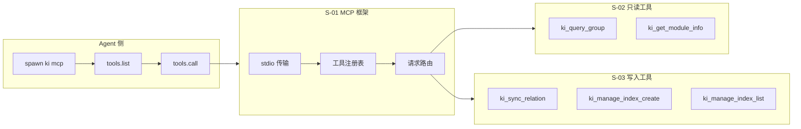
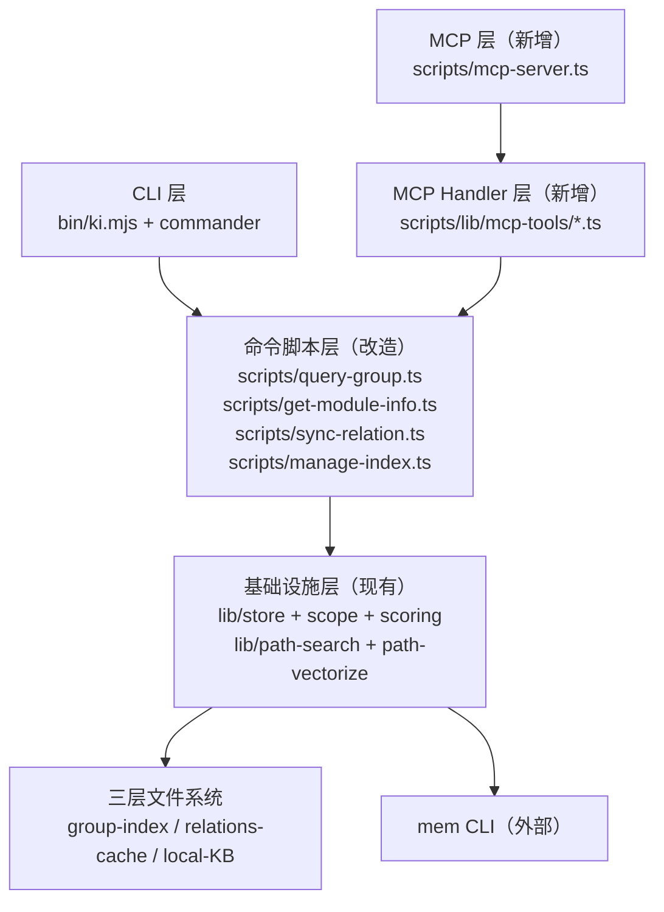

# ki MCP Server 技术设计

> 状态：草案
> 子需求：S-01 / S-02 / S-03
> 创建日期：2026-06-14

## 1. 需求背景 & 目标

**背景**：ki 是纯 CLI 工具，Agent 必须通过 Bash + shell 调用，stdout 混合日志与 JSON，参数需 shell 转义，错误处理不结构化。

**目标**：为 ki 添加 MCP Server 能力（stdio 模式），暴露 5 个工具供 Agent 直接调用，获得结构化 JSON 返回。

**工具集**：

| 工具名 | 对应命令 | 类型 |
|--------|---------|------|
| `ki_query_group` | query-group | 只读 |
| `ki_get_module_info` | get-module-info | 只读 |
| `ki_sync_relation` | sync-relation | 写入 |
| `ki_manage_index_create` | manage-index create | 创建 |
| `ki_manage_index_list` | manage-index list-scopes | 只读 |

**约束**：
- MCP 工具集零破坏性（不含 delete/force）
- 现有 CLI 模式完全不受影响
- MCP SDK (`@modelcontextprotocol/sdk@1.29.0`) 为唯一新增依赖

**不在范围内**：
- manage-index --action delete
- scan-kb import / import-kb / migrate-keywords
- MCP SSE 传输 / 远程服务器模式 / HTTP 端点
- 认证鉴权

## 2. 关键环节一览图



**依赖 DAG**：S-01 → S-02 / S-03（S-02 与 S-03 独立）

## 3. 总体方案设计

### 架构分层



**核心策略**：
1. 将现有命令 `.action()` 中的业务逻辑提取为 `executeXxx()` 纯函数，保留在原脚本文件中
2. MCP Handler（`scripts/lib/mcp-tools/`）调用 `executeXxx()` 纯函数
3. CLI 入口改为调用 `executeXxx()` + console.log/process.exit
4. 避免 MCP Handler 跨层级直接引用 `scripts/lib/` 基础设施（通过 `executeXxx` 封装）

### 共享术语速查

| 术语 | 定义 | 引用 |
|------|------|------|
| MCP Server | 通过 stdio JSON-RPC 提供工具调用的服务端 | S-01 |
| Tool Registration | 向 MCP Server 注册工具名 + Schema + Handler | S-01 |
| Group | 知识分类节点，树形结构 | S-02, S-03 |
| Relation | Group 下的知识条目，含评分和使用计数 | S-02, S-03 |
| 向量兜底 | 精确路径未命中时通过向量搜索模糊匹配 | S-02 |
| WAL | Write-Ahead Log，原子写入机制 | S-03 |
| 三层文件系统 | group-index + relations-cache + local-KB | S-02, S-03 |

## 4. 全局风险 & 跨子需求依赖

### 跨子需求风险

| 风险 | 影响子需求 | 缓解措施 |
|------|-----------|---------|
| MCP SDK 升级导致 API 变更 | S-01 | 锁定 `@modelcontextprotocol/sdk@^1.29.0`，工具注册逻辑集中在 S-01 |
| stdio 模式与 CLI 共存冲突 | S-01, S-02, S-03 | `ki mcp` 为独立子命令，不影响其他命令的 stdout |
| 纯函数提取导致现有 CLI 回归 | S-02, S-03 | 提取后保留原有 CLI 入口，仅改内部调用链；每步验证 npm test |

### 接口签名速查

```typescript
// S-01：MCP Server 启动
export function startMcpServer(): Promise<void>;

// S-02：只读工具纯函数（含隐式写入：get-module-info 的评分更新）
export function executeQueryGroup(params: QueryGroupParams): QueryGroupResult;
export function executeGetModuleInfo(params: GetModuleInfoParams): GetModuleInfoResult;

// S-03：写入工具纯函数
export function executeSyncRelation(params: SyncRelationParams): SyncRelationResult;
export function executeManageCreate(params: ManageCreateParams): ManageCreateResult;
export function executeListScopes(): ListScopesResult;
```

### 跨子需求接口契约

- S-02/S-03 的工具 Handler 必须返回 `{ content: [{ type: 'text', text: string }] }` 格式
- 错误统一通过 `isError: true` + error text 返回，不 throw（由 S-01 的 error wrapper 处理）
- 所有工具的 inputSchema 使用 Zod 定义（MCP SDK 要求）
