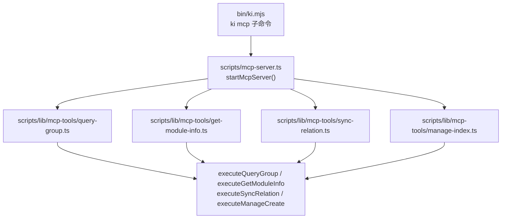

# S-01: MCP Server 框架 + 工具路由

> 状态：草案
> 依赖：无
> 创建日期：2026-06-14

## 术语表

| 术语 | 定义 |
|------|------|
| MCP (Model Context Protocol) | AI Agent 与工具交互的标准协议，支持 stdio / SSE 传输 |
| McpServer | `@modelcontextprotocol/sdk` 的高级 Server 类，封装 JSON-RPC 2.0 |
| StdioServerTransport | stdio 传输实现，读写 stdin/stdout |
| Tool Registration | `server.tool(name, desc, zodSchema, handler)` 注册工具 |
| Zod Schema | MCP SDK 要求的参数校验库，运行时生成 JSON Schema |

## 现状分析（AS-IS）

当前 ki 仅有 CLI 入口：

```
bin/knowledge-indexer.mjs → execFileSync('npx', ['jiti', scriptPath, ...args])
```

- `bin/ki.mjs` 为短入口（转发到 `knowledge-indexer.mjs`）
- 命令映射表硬编码在 `bin/knowledge-indexer.mjs` 的 `COMMANDS` 对象
- 每个命令是独立的 `.ts` 文件，使用 `commander` 解析参数
- 无 MCP 相关代码或依赖

**关键问题**：业务逻辑与 CLI 解析耦合在 `.action()` 回调内，无法直接复用。

## 方案设计（TO-BE）

### 新增文件

| 文件 | 职责 |
|------|------|
| `scripts/mcp-server.ts` | MCP Server 入口 + stdio 传输 + 工具注册 + 路由 |
| `scripts/lib/mcp-tools/query-group.ts` | ki_query_group 工具 Handler |
| `scripts/lib/mcp-tools/get-module-info.ts` | ki_get_module_info 工具 Handler |
| `scripts/lib/mcp-tools/sync-relation.ts` | ki_sync_relation 工具 Handler |
| `scripts/lib/mcp-tools/manage-index.ts` | ki_manage_index_create + ki_manage_index_list 工具 Handler |

### 修改文件

| 文件 | 变更 |
|------|------|
| `bin/ki.mjs` / `bin/knowledge-indexer.mjs` | COMMANDS 映射新增 `'mcp': 'scripts/mcp-server.ts'` |
| `package.json` | 新增 `"@modelcontextprotocol/sdk": "^1.29.0"` + `"zod": "^3.23.0"` |

### mcp-server.ts 结构

```typescript
import { McpServer } from '@modelcontextprotocol/sdk/server/mcp.js';
import { StdioServerTransport } from '@modelcontextprotocol/sdk/server/stdio.js';
import { registerQueryGroupTool } from './lib/mcp-tools/query-group.js';
import { registerGetModuleInfoTool } from './lib/mcp-tools/get-module-info.js';
import { registerSyncRelationTool } from './lib/mcp-tools/sync-relation.js';
import { registerManageIndexTools } from './lib/mcp-tools/manage-index.js';

export async function startMcpServer(): Promise<void> {
  const server = new McpServer({
    name: 'KiSearch',
    version: '0.1.0',
  });

  // 注册所有工具
  registerQueryGroupTool(server);
  registerGetModuleInfoTool(server);
  registerSyncRelationTool(server);
  registerManageIndexTools(server);

  // 启动 stdio 传输
  const transport = new StdioServerTransport();
  await server.connect(transport);
}

// 入口
startMcpServer().catch((err) => {
  console.error('MCP Server 启动失败:', err);
  process.exit(1);
});
```

### 工具注册模式

每个 `registerXxxTool(server)` 函数封装：
1. Zod schema 定义（inputSchema）
2. `server.tool()` 调用
3. Handler 函数（调用纯函数 + 包装返回格式）

```typescript
// 示例：scripts/lib/mcp-tools/query-group.ts
import { z } from 'zod';
import type { McpServer } from '@modelcontextprotocol/sdk/server/mcp.js';

export function registerQueryGroupTool(server: McpServer): void {
  server.tool(
    'ki_query_group',
    '查询 Group 树 + Relations + 词云，支持向量语义兜底',
    {
      scope: z.string().describe('项目隔离标识'),
      groups: z.string().optional().describe('逗号分隔的 Group 路径列表'),
      hot_count: z.number().optional().default(5).describe('热门展示个数'),
      depth: z.number().optional().default(4).describe('索引层级深度'),
      mode: z.string().optional().default('hot')
        .describe('展示分区：hot|warm|cold|emerging|full'),
    },
    async (args) => {
      try {
        const result = executeQueryGroup(args);
        return { content: [{ type: 'text', text: JSON.stringify(result, null, 2) }] };
      } catch (err) {
        return {
          isError: true,
          content: [{ type: 'text', text: (err as Error).message }],
        };
      }
    }
  );
}
```

## 关键决策点

### 决策 1：MCP SDK 选型

| 方案 | 优势 | 劣势 | 决定 |
|------|------|------|------|
| `@modelcontextprotocol/sdk` (官方) | 官方维护，API 稳定，支持 CJS/ESM | 体积较大 (~2MB) | **采用** |
| 自行实现 JSON-RPC 2.0 | 零依赖，体积极小 | 需手动处理协议细节，维护成本高 | 否决 |

**否决理由**：MCP 协议细节（capabilities negotiation、tool schema generation）复杂度高，自实现风险远大于引入官方 SDK。

### 决策 2：工具注册位置

| 方案 | 优势 | 劣势 | 决定 |
|------|------|------|------|
| 集中在 mcp-server.ts | 一目了然 | 文件膨胀，与业务耦合 | 否决 |
| 分散在 `lib/mcp-tools/` 各文件 | 关注点分离，独立维护 | 文件数增加 | **采用** |

**否决理由**：5 个工具的 Schema + Handler 集中在一个文件会超过 500 行，不利于维护。

### 决策 3：工具命名规范

| 方案 | 决定 |
|------|------|
| `ki_query_group` / `ki_get_module_info` (snake_case) | **采用** — MCP 社区惯例 |
| `kiQueryGroup` / `kiGetModuleInfo` (camelCase) | 否决 — 非 MCP 社区惯例 |
| `ki-query-group` / `ki-get-module-info` (kebab-case) | 否决 — MCP 社区主流使用 snake_case，kebab-case 不常见 |

## 模块设计



### 目录结构

```
scripts/
  mcp-server.ts                  # MCP Server 入口
  lib/
    mcp-tools/
      query-group.ts             # ki_query_group Handler
      get-module-info.ts         # ki_get_module_info Handler
      sync-relation.ts           # ki_sync_relation Handler
      manage-index.ts            # ki_manage_index_create + list Handler
    store.ts                     # 现有基础设施
    scope.ts
    ...
```

## 接口设计

```typescript
// scripts/mcp-server.ts
export function startMcpServer(): Promise<void>;

// scripts/lib/mcp-tools/query-group.ts
export function registerQueryGroupTool(server: McpServer): void;

// scripts/lib/mcp-tools/get-module-info.ts
export function registerGetModuleInfoTool(server: McpServer): void;

// scripts/lib/mcp-tools/sync-relation.ts
export function registerSyncRelationTool(server: McpServer): void;

// scripts/lib/mcp-tools/manage-index.ts
export function registerManageIndexTools(server: McpServer): void;
```

## 异常处理

| 场景 | 行为 | 是否对外暴露 |
|------|------|-------------|
| 工具 Handler 内抛出异常 | catch → 返回 `{ isError: true, content: [{ type: 'text', text: err.message }] }` | 是（MCP 协议） |
| MCP 协议层错误（JSON 解析失败等） | SDK 自动返回 error response | 是 |
| 向量兜底依赖的外部 API 超时 | 静默降级，返回无兜底结果 | 否（对 Agent 透明） |
| `ki mcp` 启动失败（端口/stdio 异常） | 打印错误到 stderr，process.exit(1) | 是 |

**核心原则**：工具调用异常不导致 MCP Server 进程崩溃。每个 Handler 自带 try-catch，错误通过 `isError: true` 返回给 Agent。
